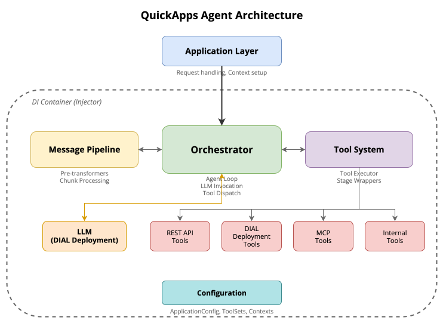
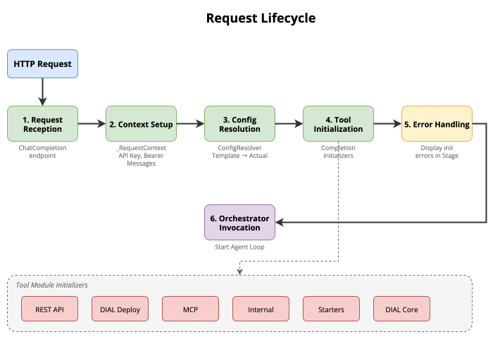
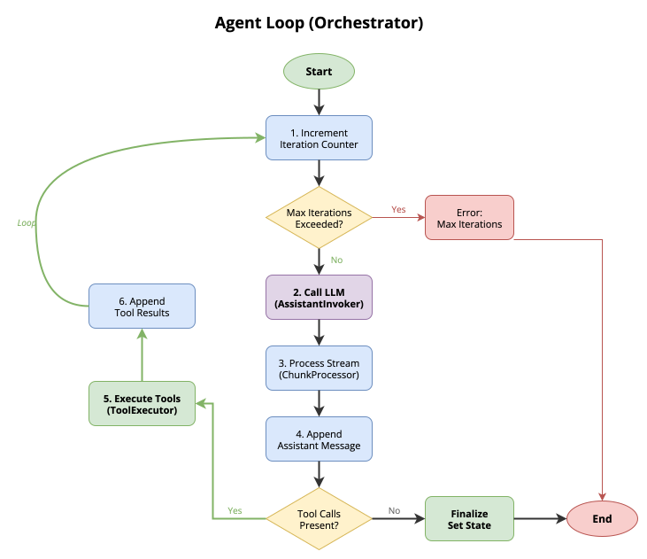
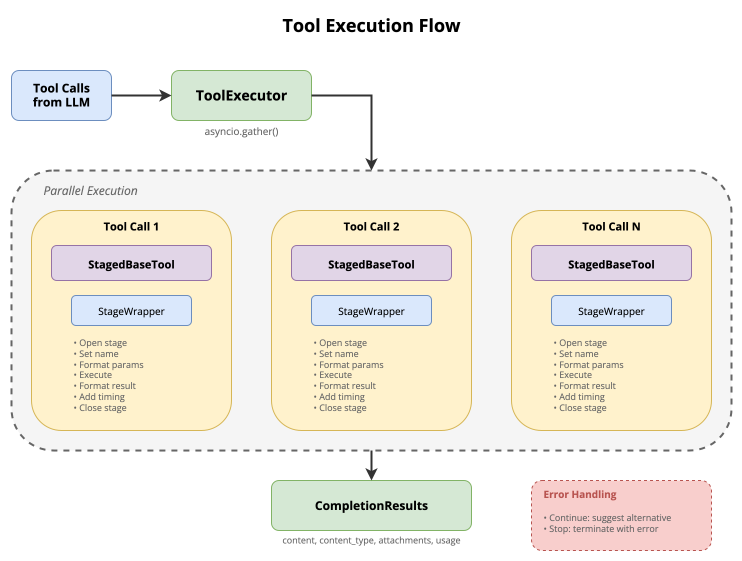
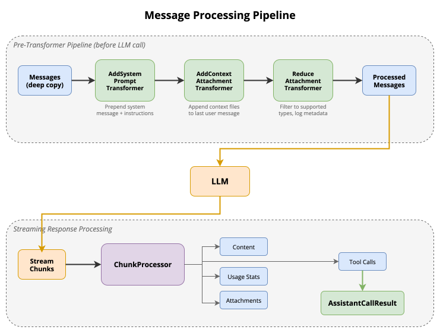

# QuickApps Agent Design

## Introduction

Quick Apps is a declarative AI orchestrator that composes applications by wiring together tools, contexts, and a Large
Language Model (LLM). It enables building AI-powered applications without writing custom orchestration logic.

The core capabilities include:

- **Tool Composition**: Combine REST APIs, DIAL deployments, MCP servers, and internal tools
- **Context Management**: Attach files and user-defined contexts to conversations
- **LLM Orchestration**: Manage multi-turn interactions with automatic tool execution
- **Visual Feedback**: Display tool execution progress in the UI via stages

This document describes the internal architecture of the Quick Apps agent system.

---

## High-Level Architecture

The Quick Apps backend consists of several interconnected components that work together to process chat requests and
orchestrate tool execution.

**Main Components:**

- **Application Layer**: Handles HTTP requests, manages request context, and coordinates initialization
- **Orchestrator**: Implements the agent loop that alternates between LLM calls and tool execution
- **Tool System**: Provides a unified abstraction for different tool types with parallel execution
- **Message Pipeline**: Preprocesses messages before LLM calls and processes streaming responses
- **DI Container**: Manages component lifecycle and dependencies across request and singleton scopes

<!-- DIAGRAM: High-level architecture showing Application Layer, Orchestrator, Tool System, Message Pipeline, and DI Container with their connections -->

---

## Request Lifecycle

When a chat completion request arrives, it flows through several stages before the orchestrator begins its work.

### 1. Request Reception

The chat completion endpoint receives the incoming request with messages, configuration, and authentication credentials.

### 2. Context Setup

A request-scoped context is created to hold:

- API key and bearer token for authentication
- Application configuration (resolved from templates if using predefined configs)
- Conversation messages
- Response choice object for streaming output

### 3. Configuration Resolution

If the request uses predefined templates (for system prompts, tools, or toolsets), these are resolved to their actual
definitions from the predefined configuration files.

### 4. Completion Initialization

Completion initializers are invoked to prepare the request for orchestration. This includes:

- **Message preprocessing**: `_MessagesSetup` (called from `_RequestContextSetup.setup()`) expands packed tool call
  state and runs all `MessagesTransformer` instances (adding system prompts, injecting context notifications).
  After this step, messages are fully expanded and ready for the orchestrator.
- **Tool construction**: Each tool module's initializer constructs tool instances based on the application
  configuration. Each tool type (REST API, DIAL deployment, MCP, internal) has its own initializer.
- **Interactive login (MCP)**: When a `DialMCPToolSet` returns HTTP 401 during initialization,
  `_MCPToolInitializer` collects all unauthorized toolsets and sends a single batched sign-in request
  to DIAL Core via `InteractiveLoginService`. Toolsets that succeed are retried; failures are recorded
  as `ToolInitializationException`. The same mechanism applies during tool execution: `_MCPTool` catches
  401 from `_MCPConnectionManager`, requests sign-in, and retries the call once. The
  `X-DIAL-CLIENT-CHANNEL-ID` request header enables this flow; without it, 401 errors fall through to
  the standard error path. See `docs/designs/interactive_login.md` for the full design.

### 5. Error Handling

Any tool initialization errors are collected and displayed to the user via a dedicated error stage, allowing partial
functionality even when some tools fail to initialize.

### 6. Orchestrator Invocation

The orchestrator is retrieved from the DI container and its invoke method is called, starting the agent loop.

<!-- DIAGRAM: Request lifecycle sequence showing HTTP Request -> Context Setup -> Config Resolution -> Tool Initialization -> Error Handling -> Orchestrator Invoke -->

---

## Agent Loop (Orchestrator)

The orchestrator implements an iterative agent loop that continues until the LLM produces a final response without tool
calls or the maximum iteration limit is reached.

### Loop Flow

1. **Iteration Tracking**: The iteration counter is incremented and checked against the configured maximum. If exceeded,
   the loop terminates with an error message.

2. **LLM Invocation**: The Assistant Invoker sends the already-preprocessed messages to the LLM. The response is
   streamed back.

3. **Response Processing**: The Chunk Processor accumulates streaming chunks, extracting content, attachments, and tool
   calls from the response deltas.

4. **Message Recording**: The assistant's response is appended to the conversation history.

5. **Tool Call Detection**: If the response contains tool calls, they are extracted for execution.

6. **Tool Execution**: The Tool Executor runs all requested tools in parallel, collecting their results.

7. **Result Recording**: Tool results are converted to tool messages and appended to the conversation history.

8. **Loop Continuation**: If tool calls were executed, the loop continues to the next iteration. Otherwise, the loop
   terminates, the tool execution history is derived from the message history, and the final state is set.

> **Note:** Message preprocessing (system prompt injection, state expansion, context notification) runs once at request
> setup via `_MessagesSetup`, not per iteration. The `AssistantInvoker` uses the already-transformed messages directly.

### Termination Conditions

- **Normal Completion**: The LLM responds without any tool calls, indicating it has finished its task
- **Max Iterations Exceeded**: The configured iteration limit is reached, preventing infinite loops
- **Error**: An unrecoverable error occurs during execution

<!-- DIAGRAM: Agent loop flowchart showing the iterative flow: Increment Counter -> Check Max -> Call LLM -> Process Response -> Tool Calls? -> Yes: Execute Tools -> Record Results -> Continue Loop / No: Derive History -> Finalize -->

---

## Tool System

The tool system provides a unified abstraction for executing different types of tools while maintaining consistent
behavior for UI display, error handling, and result formatting.

### Tool Abstraction

All tools inherit from a common base class that defines:

- A standardized execution interface
- Lifecycle management with stage wrappers
- Parameter preprocessing via a chain of `ToolArgumentTransformer` instances (e.g. `file:` prefix resolution)
- Attachment filtering based on `supported_types` configuration (single canonical filter point)
- Choice propagation for UI rendering based on `propagate_types_to_choice` (subset of surviving attachments)
- Performance timing

### Tool Types

Quick Apps supports several tool types:

- **REST API Tools**: HTTP endpoints defined declaratively in configuration. Support an optional
  `response_as_attachment` config (`enabled`, `content_types`, `include_body_as_content`) that controls whether the HTTP
  response body is wrapped as a file attachment. Defaults to disabled — responses are returned as text only.
- **DIAL Deployment Tools**: Invocations of other DIAL deployments (models, applications)
- **MCP Tools**: Tools from Model Context Protocol servers
- **Internal Tools**: Built-in tools such as the Python interpreter and other configured internal tools. Admin-context
  tools (`internal_attachments_available_context`, and when gated `internal_attachments_get_content`) are registered
  conditionally (see [Attachment Notification](#attachment-notification)).

### Parallel Execution

When the LLM requests multiple tools, the Tool Executor runs them concurrently using async gathering. Each tool call is:

1. Looked up in the tool registry by name
2. Invoked with parsed arguments
3. Timed for performance tracking

Results are collected and returned in order matching the original tool calls. After execution,
`CompletionResultEnricher` instances are applied to each result (e.g. the timestamp metadata enricher stamps every
result with its production time).

### Stage Wrapper Pattern

Each tool execution is wrapped in a stage that provides visual feedback in the UI:

- **Stage Name**: Displayed title showing which tool is running
- **Parameters**: Formatted input parameters
- **Timing**: Execution duration appended to the stage name
- **Result**: Formatted output from the tool
- **Errors**: Exception information if the tool fails

The stage wrapper acts as a context manager, ensuring proper lifecycle management even when errors occur.

### Result Format

Tool results are standardized into a common format containing:

- Content (the actual result data)
- Content type (MIME type)
- Attachments (files, images, etc.)
- Usage statistics (if the tool calls an LLM internally)
- Propagation flags (which attachments should be shown in the UI)

### Error Handling

Tools support configurable fallback strategies for error handling:

- **Continue Strategy**: Returns a message instructing the LLM to try an alternative approach
- **Stop Strategy**: Terminates execution with a user-friendly error message

Errors can optionally be displayed in the stage for debugging purposes.

<!-- DIAGRAM: Tool execution flow showing ToolExecutor receiving tool calls, parallel execution via async gather, each tool wrapped in StagedBaseTool with StageWrapper, returning CompletionResults -->

---

## Message Processing

Messages undergo processing both before being sent to the LLM and when receiving streaming responses.

### Pre-Transformer Pipeline

Message transformers are organized into two tiers:

| Tier                       | When it runs                           | Mutation safety                                     |
|----------------------------|----------------------------------------|-----------------------------------------------------|
| `MessagesTransformer`      | Once, in `_MessagesSetup.setup()`      | Mutates the canonical message list                  |
| `PreInvocationTransformer` | Every iteration, in `AssistantInvoker` | Each transformer selectively copies what it mutates |

`MessagesTransformer` implementations run once at request setup via `_MessagesSetup`, called from
`_RequestContextSetup.setup()`. `PreInvocationTransformer` implementations run before every LLM call in
`AssistantInvoker.__prepare_messages()` — their changes are transient and never persisted to history.

The setup pipeline runs the following steps in order:

1. **Tool Call Extraction**: Not a transformer — runs first in `_MessagesSetup.setup()`. Expands prior-turn tool calls
   packed in `custom_content.state[TOOL_EXECUTION_HISTORY]` into proper ASSISTANT + TOOL message pairs. This must run
   before any component that inspects `msg.tool_calls` on historical messages.

2. **System Prompt Transformer** (`_AddSystemPromptTransformer`): Ensures a system message exists at the start of the
   conversation, combining the configured system prompt with any agent instructions.

3. **Attachment Notification Injector** (`_AttachmentNotificationInjector`): Always included in the pipeline
   unconditionally. Self-detects whether the context tool should be active (file contexts exist or context tool was used
   in a prior turn). When active, checks whether admin-configured context files have changed since the last
   notification. If changes are detected, inserts synthetic tool call and tool result message pairs into the history
   using the `internal_attachments_available_context` tool. Returns messages unchanged when inactive.

4. **Timestamp Injection Transformer** (`_TimestampInjectionTransformer`, preview): Appends a synthetic
   `current_timestamp` tool-call + result pair at the end of the message list so the agent knows "when" the
   interaction is happening. Historical timestamps are restored from state with their original times.

### Pre-Invocation Transformers

Before each LLM call, `AssistantInvoker` runs all `PreInvocationTransformer` instances. Current implementations:

1. **Attachment Filter** (`_AttachmentFilter`): Filters unsupported attachment types and injects attachment XML metadata.
2. **Timestamp Annotation Transformer** (`_TimestampAnnotationTransformer`, preview): Appends human-readable
   `[Timestamp: ...]` annotations to tool messages that carry timestamp metadata.

### Streaming Response Processing

LLM responses are streamed and processed incrementally by the Chunk Processor:

- **Content**: Text content is streamed directly to the response choice
- **Attachments**: Custom attachments from the LLM are extracted and added
- **Tool Calls**: Tool call deltas are accumulated and assembled into complete calls
- **Usage**: Token usage statistics are captured from the final chunk

The processor builds an aggregated result containing all accumulated data for the orchestrator to use.

<!-- DIAGRAM: Message processing pipeline showing Messages -> ExtractToolCalls -> AddSystemPrompt -> AttachmentNotification -> LLM -> ChunkProcessor -> AssistantCallResult -->

---

## Attachment Notification

The system uses two separate mechanisms to inform the agent about available files:

- **Attachments**: The `_AttachmentFilter` (used in `AssistantInvoker`) appends structured XML metadata
  (`<attachments>`) to message content. Each attachment is represented as an `<attachment>` element with
  `<title>`, `<type>`, `<url>`, and optionally `<reference_url>` sub-elements.
- **Admin context files**: The Attachment Notification Injector uses synthetic tool call/result messages via the
  `internal_attachments_available_context` internal tool. This provides structured metadata without modifying user messages.

### Activation Conditions

The context notification tool (`AttachmentProcessingModule`) is **registered conditionally** — only when at least one of
the following is true:

1. The application configuration contains at least one `FileContextConfig` context.
2. The message history already contains tool calls for the context tool (i.e. it was active in a prior chat turn).

When neither condition is met, the tool does not appear in the LLM's tool list. This keeps the tool list clean for
applications that never use file contexts.

The `AttachmentNotificationInjector` pre-transformer is always included in the pipeline unconditionally. It evaluates
`should_activate_context_tool()` internally and returns messages unchanged when inactive. Because messages are
preprocessed (including state expansion by `_MessagesSetup.extract_tool_calls()`) before tool providers are resolved,
both the tool provider and the injector see fully expanded messages and are always in sync.

### Context Notification Tool

The **`internal_attachments_available_context`** internal tool returns metadata about admin-configured context files attached to the
application. Each entry contains:

- **Title**: File name
- **URL**: DIAL-relative file URL
- **MIME Type**: Content type of the file
- **Description**: Optional admin-provided description
- **Change Status**: Whether the file is `new` (added), `updated` (metadata changed), or `removed` since the last
  notification

Only metadata is returned — actual file content is not included. When the orchestrator deployment accepts the file MIME
(per DialCore `input_attachment_types`) and the lazy materialization gate passes, the **`internal_attachments_get_content`** tool
may appear in the tool list; the model passes the exact `url` from the list response to retrieve **one** configured file
as a tool-result attachment. Otherwise the orchestrator must rely on other configured tools (for example RAG) or answer
without that native attachment path.

### Algorithmic Injection

Before each LLM call, the `AttachmentNotificationInjector` pre-transformer checks whether admin-configured contexts
have changed since the last notification was injected.

If changes are detected, synthetic message pairs are appended to the message history:

1. An **assistant message** containing a tool call to `internal_attachments_available_context`
2. A **tool result message** with the current metadata and change indicators

These synthetic messages appear to the LLM as if the tool was already called, giving it up-to-date context awareness
without requiring it to make the call itself.

If no changes occurred since the last injection (same URLs and same metadata), no messages are inserted.

### On-Demand Access

When the context tool is active, it is registered in the tool registry and available in the tool list provided to the
LLM. The agent can call it at any point during the conversation to re-check available context files.

### Interaction with Existing Components

- **Attachment Filter**: Appends text metadata to user messages for all attachments and keeps only supported types
  inline in `custom_content` for vision model support. Used in `AssistantInvoker`, not a pre-transformer.
- **Python Interpreter Tool**: Continues to access attachments from user messages via `custom_content` for file
  transfer to the interpreter session.
- **Admin context content (`internal_attachments_get_content`)**: When registered, supplies a single admin-configured file
  as a tool attachment after list-then-get-content; see `docs/designs/lazy_admin_context_attachment.md`.

---

## Dependency Injection

Quick Apps uses dependency injection extensively to manage component lifecycle and enable testability.

### Module Architecture

The application is composed of 13 specialized DI modules:

1. **App Module**: Core application, request context, FastAPI setup
2. **Agent Module**: Orchestrator, assistant invoker, message transformers
3. **REST API Tooling Module**: REST API tool construction
4. **DIAL Deployment Tooling Module**: Deployment tool construction
5. **MCP Tooling Module**: MCP server tool construction
6. **Internal Tool Module**: Python interpreter and other built-in tools configured per application
7. **Starters Module**: UI starter button configuration
8. **Configuration Support API Module**: Configuration validation endpoints
9. **DIAL Core Services Module**: DIAL Core integration (`InteractiveLoginService`, `InteractiveLoginSettings`)
10. **File Transfer Module**: `ToolArgumentTransformer` for `file:` prefix resolution, file transfer instruction injection
11. **Attachment Processing Module**: `internal_attachments_available_context`, optional `internal_attachments_get_content`
  (when gated), attachment change detection injector
12. **Timestamp Module** (preview): Timestamp tool, injection/annotation transformers, metadata enricher
13. **Skills Module**: Skill reader tool, agent skills provider

### Scoping

Components use different lifecycle scopes:

- **Singleton**: Shared across all requests (configuration, factory components)
- **Request Scope**: Created fresh for each request (context, state holder, performance timer)
- **No Scope**: Created fresh on each injection (assistant invoker, chunk processor per iteration)

### Provider Pattern

Modules expose providers that extract request-specific data from the request context and make it available to dependent
components via type-based injection. This allows components to declare their dependencies without knowing how to obtain
them.

### Initializers

Each tool module provides initializers that run during request processing to construct tools based on the application
configuration. Initializers are typed (startup, configuration, completion) and invoked at appropriate lifecycle points.

---

## Configuration

Application behavior is controlled through JSON-schema validated configuration manifests.

### Application Configuration

The root configuration contains:

- **Orchestrator**: LLM deployment, system prompt, and maximum iterations
- **Contexts**: File or user-defined contexts attached to conversations
- **Tool Sets**: Collections of tools grouped by type and shared configuration
- **Starters**: Optional UI starter buttons for common actions

### Orchestrator Settings

- **Deployment**: Which LLM model/deployment to use, with optional parameters
- **System Prompt**: Predefined or custom instructions for the agent
- **Max Iterations**: Limit on agent loop iterations to prevent runaway execution

### Tool Sets

Tools are organized into toolsets that share common configuration:

- **REST API Toolset**: Base URL, authentication, shared headers
- **Deployment Toolset**: DIAL deployment references
- **MCP Toolset**: MCP server connection configuration
- **Internal Toolset**: Built-in tool configuration
- **Predefined Toolset**: Reference to predefined tool templates

### Template Resolution

`PredefinedContentProvider` is the single source of truth for all predefined content (prompts, tools, toolsets, skills). It scans a built-in layer (auto-detected at `/app/predefined` or `config/predefined/`) and optional extra layers (`PREDEFINED_EXTRA_PATHS`), eagerly loads all files, and merges them by filename stem (last wins).

`ConfigResolver` delegates all I/O to `PredefinedContentProvider` and focuses on config resolution logic:

- System prompts are loaded from markdown files
- Tools are loaded from JSON definitions
- Toolsets are loaded and their tools recursively resolved

`AgentSkillsProvider` also delegates to `PredefinedContentProvider` for skill file reading.

This enables reusable configuration building blocks that can be shared across applications, with layered override support for customization.

---

## Source Reference

For implementation details, refer to:

| Area                  | Directory                             |
|-----------------------|---------------------------------------|
| Agent and processors  | `src/quickapp/agent/`                 |
| Base abstractions     | `src/quickapp/common/`                |
| Request handling      | `src/quickapp/application/`           |
| Configuration schemas | `src/quickapp/config/`                |
| Attachment processing | `src/quickapp/attachment_processing/` |
| Tool implementations  | `src/quickapp/*_tooling/`             |
