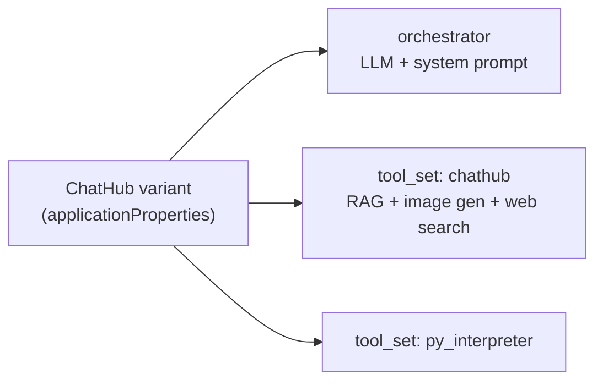

# ChatHub

This document is the configuration guide for **ChatHub** — DIAL's general-purpose productivity
agent built on top of Quick Apps 2.0. It covers what ChatHub is, how its variants are wired up,
and the recipes DevOps and support teams use to customize them.

For the full Quick Apps 2.0 schema reference, see [`CONFIGURATION.md`](../CONFIGURATION.md). For
the design rationale behind the override mechanism used in the recipes below, see
[Predefined Template Overrides](designs/predefined_template_overrides.md). For the broader Quick
Apps architecture, see [Agent Design](agent.md).

---

## What is ChatHub?

ChatHub is a family of Quick Apps 2.0 applications that combine a chat LLM with a curated bundle
of tools — vision, document RAG, web search, image generation, and Python code interpretation —
behind a single conversational interface.

Each ChatHub variant pairs a specific LLM with the same tool bundle, so users can ask questions,
generate code, search the web, interpret images, and produce artwork without thinking about which
tool to call. The Quick Apps 2.0 orchestrator routes each turn to the right tool automatically.

Sample ChatHub configurations ship in this repo under
[`docker_compose_files/core/configuration/chathub/`](../docker_compose_files/core/configuration/chathub/)
for the local-dev compose stack:

| File             | Variants in the sample set                                            |
|------------------|-----------------------------------------------------------------------|
| `anthropic.json` | ChatHub - Claude 4.5 Sonnet, ChatHub - Claude 4, ChatHub - Claude 3.7 |
| `openai.json`    | ChatHub - GPT-4o, ChatHub - GPT-5, ChatHub - GPT-5.2                  |
| `gemini.json`    | ChatHub - Gemini                                                      |

Each entry is a complete DIAL application config pointing at the Quick Apps 2.0 schema
(`applicationTypeSchemaId: https://mydial.epam.com/custom_application_schemas/quickapps2`).
The JSON shape is the same wherever DIAL Core consumes application configs — this guide focuses
on that JSON, not on how a particular deployment loads it.

---

## Architecture

A ChatHub variant configuration is a thin shell over three building blocks:

1. **Orchestrator** — the chat LLM that drives the conversation, plus its sampling parameters.
2. **System prompt** — a predefined prompt template chosen to match the model family's
   tool-calling conventions.
3. **Tool sets** — references to predefined toolsets that bundle the actual capabilities.



The predefined templates referenced from a ChatHub config live under
[`config/predefined/`](../config/predefined/):

| Path                                            | Purpose                                       |
|-------------------------------------------------|-----------------------------------------------|
| `config/predefined/prompt/anthropic_prompt.md`  | Claude system prompt                          |
| `config/predefined/prompt/gpt_prompt.md`        | GPT system prompt                             |
| `config/predefined/prompt/gemini_prompt.md`     | Gemini system prompt                          |
| `config/predefined/toolset/chathub.json`        | Bundles RAG + image generation + web search   |
| `config/predefined/toolset/py_interpreter.json` | Bundles the Python interpreter                |
| `config/predefined/tool/dial_rag.json`          | RAG search tool (`dial-rag` deployment)       |
| `config/predefined/tool/web_search.json`        | Web search tool (Gemini grounding by default) |
| `config/predefined/tool/image_generation.json`  | Image generation tool (`gpt-image-1`)         |
| `config/predefined/tool/py_interpreter.json`    | Internal Python interpreter tool              |

A predefined reference is a pointer — `{ "type": "predefined", "template_name": "chathub" }`. At
request time, `ConfigResolver` reads the matching template, optionally applies per-app overrides
(see [Recipes](#recipes)), and inlines the resulting content into the resolved configuration
before the orchestrator runs.

---

## Anatomy of a ChatHub variant

The canonical shape, condensed from the GPT-5 variant in `openai.json`:

```json
{
  "applications": {
    "chat_hub_gpt5_quickapp": {
      "displayName": "ChatHub - GPT-5 (QuickApp)",
      "description": "Agent with vision, image generation, documents RAG, web search and python code interpretation capabilities.",
      "applicationTypeSchemaId": "https://mydial.epam.com/custom_application_schemas/quickapps2",
      "applicationProperties": {
        "orchestrator": {
          "deployment": {
            "name": "gpt-5-2025-08-07",
            "parameters": { "seed": 820288 }
          },
          "system_prompt": { "type": "predefined", "template": "gpt_prompt" }
        },
        "contexts": [],
        "tool_sets": [
          { "type": "predefined", "template_name": "chathub" },
          { "type": "predefined", "template_name": "py_interpreter" }
        ],
        "starters": [
          "What's the weather in London?",
          "What can you do?",
          "What tools do you have?"
        ]
      },
      "inputAttachmentTypes": ["*/*"]
    }
  }
}
```

Two pieces are worth highlighting:

- The `tool_sets` array references **two** predefined toolsets: `chathub` (RAG + image generation
  + web search) and `py_interpreter`. Together they make up the full ChatHub capability surface.
- The system prompt picks a template that matches the model family. The mapping between prompt
  templates and supported deployments is enforced by `ConfigResolver.PromptMapping`; see
  [Authoring a variant](#authoring-a-variant).

---

## Authoring a variant

A ChatHub variant is a JSON entry inside the `applications` map of a DIAL application config:

- Choose an application key (e.g. `chat_hub_my_variant_quickapp`).
- Set `displayName` and `description` for end users.
- Set `orchestrator.deployment.name` to the DIAL model deployment name.
- Set `orchestrator.system_prompt.template` to the matching predefined prompt: `gpt_prompt`,
  `anthropic_prompt`, or `gemini_prompt`.
- Reference the same `tool_sets` (`chathub`, `py_interpreter`) — this is what makes it a
  ChatHub.

If the new model is not in the prompt mapping, the variant validates but the orchestrator may
not get the prompt that matches the model's tool-calling conventions. Extend the mapping via the
`CONFIG_PROMPT_MAPPING` environment variable to add custom models.

---

## Customizing a variant

ChatHub variants share the same predefined toolsets by default. To customize one variant — change
a tool's deployment, swap a tool entirely, disable a capability — apply the recipes below.

The recipes follow one principle:

> **Predefined references stay pointers, but every pointer takes one optional `override` patch.
> When the override would dominate the original definition, switch to the full inline config
> model.**

The `override` field carries a JSON Merge Patch (RFC 7396) applied to the loaded template before
pydantic validation:

- Objects merge recursively.
- Arrays replace wholesale (no element-wise merge, no append).
- A patch value of `null` deletes the corresponding key.
- The patch may not contain a `"type"` key at any depth — that is the schema discriminator on
  `AnyTool` and `ToolSet`, and reshaping a tool through the override would invert the boundary
  between the predefined-pointer-with-patch and inline-tool tiers. Use Recipe 5 (inline tool)
  for shape changes.

See [Predefined Template Overrides](designs/predefined_template_overrides.md) for the full design
rationale.

### Recipes

#### Recipe 1 — Swap a tool's deployment per variant

A team needs ChatHub-A to use a tenant-specific RAG deployment instead of the default `dial-rag`.

```json
{
  "tool_sets": [
    {
      "name": "chat-hub",
      "type": "dial-deployment",
      "tools": [
        {
          "type": "predefined-tool",
          "template_name": "dial_rag",
          "override": { "deployment": { "name": "hr-rag-prod" } }
        },
        { "type": "predefined-tool", "template_name": "image_generation" },
        { "type": "predefined-tool", "template_name": "web_search" }
      ]
    },
    { "type": "predefined", "template_name": "py_interpreter" }
  ]
}
```

The `dial_rag` template's deployment name is replaced; everything else (function descriptor,
attachment rules, fallback) comes unchanged from the template. The same recipe works for
`web_search`, `image_generation`, and any other predefined deployment tool.

Note the structural shift compared to the default ChatHub config: instead of a single
`{ "type": "predefined", "template_name": "chathub" }` toolset reference, the variant **dissolves**
the bundle into a `dial-deployment` toolset whose `tools` list contains individual
`predefined-tool` references. The dissolve pattern is what enables per-tool overrides and per-tool
`enabled` flags.

> **Note:** Overrides do not apply to tools whose type is `dial-deployment-simple` — those fetch
> their tool config from DIAL Core's tool-config endpoint at request time and bypass
> `ConfigResolver` entirely.

#### Recipe 2 — Tweak a tool's description per variant

A team wants their web search to be exposed to the orchestrator as "internal KB only" so the model
does not pick it for external queries:

```json
{
  "type": "predefined-tool",
  "template_name": "web_search",
  "override": {
    "open_ai_tool": {
      "function": {
        "description": "Search the internal knowledge base for company-internal information."
      }
    }
  }
}
```

The override path uses JSON Merge Patch: nested objects merge, so only the `description` key is
replaced — the function name, parameters, and everything else come unchanged from the template.

#### Recipe 3 — Disable a single tool from the bundle

To drop image generation but keep RAG and web search, use the dissolve pattern and set
`enabled: false` on the unwanted tool:

```json
{
  "tool_sets": [
    {
      "name": "chat-hub",
      "type": "dial-deployment",
      "tools": [
        { "type": "predefined-tool", "template_name": "dial_rag" },
        {
          "type": "predefined-tool",
          "template_name": "image_generation",
          "enabled": false
        },
        { "type": "predefined-tool", "template_name": "web_search" }
      ]
    },
    { "type": "predefined", "template_name": "py_interpreter" }
  ]
}
```

The disabled reference is short-circuited by `ConfigResolver.resolve_toolset` (which only
resolves predefined-tool references when `enabled` is true) and then ignored by
`_DeploymentToolInitializer` — the tool is never constructed. An `override` block on a disabled
reference is preserved but never applied; flipping `enabled` back to `true` re-enables both the
tool and the patch in one move.

#### Recipe 4 — Drop an entire toolset

To disable the Python interpreter for a variant, omit the toolset reference from `tool_sets`.
Removing the line is the recipe.

```json
{
  "tool_sets": [
    { "type": "predefined", "template_name": "chathub" }
  ]
}
```

#### Recipe 5 — Use a completely different tool

When a tool needs a different function name, parameter schema, or fundamentally different behavior,
drop the `predefined-tool` reference and write an inline `deployment-tool` (or any concrete tool
type from the schema):

```json
{
  "tool_sets": [
    {
      "name": "chat-hub",
      "type": "dial-deployment",
      "tools": [
        { "type": "predefined-tool", "template_name": "dial_rag" },
        { "type": "predefined-tool", "template_name": "web_search" },
        {
          "type": "deployment-tool",
          "deployment": { "name": "internal-image-gen-v2" },
          "open_ai_tool": {
            "type": "function",
            "function": {
              "name": "image_generation_tool",
              "description": "Custom image generator.",
              "parameters": {
                "type": "object",
                "properties": {
                  "query": {
                    "type": "string",
                    "description": "Description of the image to generate."
                  }
                },
                "required": ["query"]
              }
            }
          }
        }
      ]
    }
  ]
}
```

This is the canonical escape hatch — full inline tools coexist with predefined references in the
same `tool_sets` list. The trade-off: the inline tool will not pick up upstream improvements to
the predefined templates.

#### Recipe 6 — Image generation with a different parameter shape

When the alternative image-generation provider exposes a fundamentally different parameter set
than the predefined `image_generation` template — for example, a FLUX-style model that takes
`style` and `aspect_ratio` instead of `output_compression` / `moderation` / `quality` — the
override patch would be dominated by `null` deletions of the original properties and additions
of the new ones.

Prefer the full inline `deployment-tool` (Recipe 5) over the override path in this case. As a
rule of thumb: if your override has more `null` deletions than meaningful changes, switch to
inline.

#### Recipe 7 — Revise the system prompt

The `predefined` system prompt mode is a pure pointer; it has no override surface. To revise the
prompt, switch from `type: "predefined"` to `type: "custom"` and provide the full content:

```json
{
  "system_prompt": {
    "type": "custom",
    "content": "You are an internal assistant for ACME Corp. ...",
    "variables": {}
  }
}
```

The canonical predefined prompts live in
[`config/predefined/prompt/*.md`](../config/predefined/prompt/) — copy from there as the starting
baseline for your custom content. Note that variants that switch to `type: "custom"` will not
pick up upstream prompt improvements automatically; this is the deliberate cost of full revision.

---

## Environment knobs

Two environment variables affect ChatHub configuration globally. They complement the per-variant
`override` mechanism.

| Variable                  | Effect                                                                                                                                                                                                                                                                            |
|---------------------------|-----------------------------------------------------------------------------------------------------------------------------------------------------------------------------------------------------------------------------------------------------------------------------------|
| `PREDEFINED_EXTRA_PATHS`  | JSON list of directories layered on top of the built-in `config/predefined/`. Last wins. Replaces a template **globally** — every ChatHub variant that references the same template name picks up the override. Per-variant `override` patches are applied **after** layering. |
| `CONFIG_PROMPT_MAPPING`   | JSON mapping of predefined system prompt names (`gpt_prompt`, `anthropic_prompt`, `gemini_prompt`) to the DIAL model deployments they support. Extend this when adding new models that should use an existing predefined prompt.                                                  |
| `ENABLE_PREVIEW_FEATURES` | When `false` (default), preview features such as DIAL-prompt skills are deactivated even if configured. ChatHub variants that depend on preview features should be tested with this flag enabled before promotion.                                                                |

For the full list of environment variables that affect Quick Apps 2.0, see
[`README.md`](../README.md#environment-variables).

---

## Reference

- **Application schema** — generated via `make dump_app_schema` to
  [`docs/generated-app-schema.json`](generated-app-schema.json), also hosted at
  `https://mydial.epam.com/custom_application_schemas/quickapps2`.
- **Configuration reference** — [`CONFIGURATION.md`](../CONFIGURATION.md) for the full Quick
  Apps 2.0 schema, including all field semantics for `PredefinedTool`, `PredefinedToolSet`, and
  the `override` field.
- **Override design** — [Predefined Template Overrides](designs/predefined_template_overrides.md)
  for the design rationale, the merge semantics (RFC 7396), and the boundary between override
  and inline.
- **Quick Apps architecture** — [Agent Design](agent.md) for the request lifecycle, the
  orchestrator loop, and the tool system.
