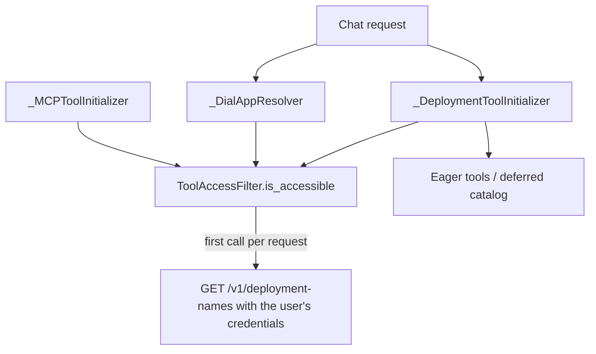

# Design: Access-Aware Tool Availability

- **Status:** Implemented
- **Requires:** DIAL Core with `GET /v1/deployment-names` ([ai-dial-core#2075](https://github.com/epam/ai-dial-core/pull/2075))
- **User-facing:** [CONFIGURATION - Tool access filter](../../CONFIGURATION.md#tool-access-filter-configuration)
- **Dependencies:**
  - [Dynamic Tool Discovery](dynamic_tool_discovery.md) (the deferred catalog this design filters)
  - [DIAL App Toolset](dial_app_toolset.md) (deployment metadata resolution)

## Problem Statement

A single "mega" QuickApp can be configured with a very large number of tools (for example ~200 DIAL deployments and
DIAL apps). Access to each is governed by DIAL Core per user: one user may be entitled to all 200, another to 120.
Today the QuickApp has no notion of per-user availability:

1. **The tool list is user-agnostic.** `_DeploymentToolInitializer` and `_DialAppResolver` build tools for every
   configured entry. The model is offered tools the caller cannot use, tries them, and gets a 403 from Core at call
   time. This wastes tokens (schemas and failed iterations) and produces confusing answers.
2. **Existing caches cannot answer "may this user use it".** `DialDeploymentToolCacheService` and
   `DialToolsetCacheService` are singletons keyed by resource id only; an entry created with user A's key is served
   to user B. They hold resource descriptions, not entitlements.
3. **Toolsets have no dedicated list endpoint** in the public DIAL API (https://dialx.ai/dial_api), only
   `GET /openai/toolsets/{id}`; `GET /v1/deployment-names` is the one call that also enumerates them (`type=toolset`).

## Design Goals

- With the feature enabled, the model is never offered a deployment tool the caller is known to lack access to.
- One DIAL Core lookup per request, not one per tool.
- Fail-open: if DIAL Core cannot be queried, all configured tools are offered. Core's execution-time enforcement stays
  the authority; this is a UX and token optimisation, not a security boundary.
- Opt-in per app, disabled by default. Apps that do not enable it behave identically.

---

## Use Cases

### UC-1: Same app, two users

**Trigger:** User A (200 entitlements) and user B (120) chat with the same mega-app.
**Behavior:** Each request intersects the configured tools with that user's accessible deployments.
**Outcome:** A sees 200 tools, B sees 120. The other 80 are absent from B's `payload["tools"]`, from the deferred
catalog, and from `tool_search` results.

### UC-2: Core lookup fails

**Trigger:** `GET /v1/deployment-names` times out or returns an error.
**Behavior:** A warning is logged and all configured tools are offered.
**Outcome:** Behavior equals today's; no outage.

---

## Proposed Design



### 1. Config: `features.tool_access_filter`

`ToolAccessFilterConfig` (`config/tool_access_filter.py`) with a single field, `enabled` (default `false`). The
`tool_access_filter` field on `Features` is a regular field (not a preview field) and defaults to `None`,
which is equivalent to disabled.

### 2. `ToolAccessFilter` (request-scoped)

- Loads the names lazily, on the first `is_accessible` call of a request, through `DeploymentNamesCoreService`
  (`dial_core_services/`). It calls `GET /v1/deployment-names?type=model,application,toolset` with the request's own
  `AsyncDial` client, so auth headers carry the calling user's credentials. Core returns a bare list of
  `{"id", "object"}`; the response is validated strictly. The SDK has no method for this endpoint, so the call goes
  through the client's HTTP layer.
- **No caching.** Each request makes one call; every consumer in that request awaits the same task.
- There is deliberately **no prefetch**: the first consumer (`_DialAppResolver`, or `_DeploymentToolInitializer` when
  there are no DIAL app toolsets) needs the answer immediately, so starting the call earlier would overlap nothing,
  and requests with no deployment tools never call Core.
- `is_accessible(deployment_id)` awaits that task. Tools with no deployment id (e.g. `PredefinedTool`) are never
  passed in, so they are always kept.
- Ids are compared after URL-unquoting both sides (Core reports `applications/<bucket>/my%20app`).
- Inert when the config is unset/disabled. Returns "accessible" when the lookup fails with an HTTP/transport error
  (including 403/404/500, e.g. an older Core without the endpoint) or an unexpected body (fail-open); other
  exceptions propagate.

### 3. Where it is applied

Filtering happens where tools are built, before the deferral decision, so counts, thresholds and the catalog all
reflect what the user can use.

| Component | Change |
|---|---|
| `_DeploymentToolInitializer.__build_toolset_tools` | Drops `DialDeploymentTool` / `DialDeploymentSimpleTool` whose deployment is not accessible, **before** `fetch_basic_tool_config`, so inaccessible simple tools cost no metadata round-trips. |
| `_DialAppResolver._resolve_one` | Skips an inaccessible `DialAppToolSet` before any metadata fetch; no error is raised. |
| `_MCPToolInitializer.initialize` | Drops a `DialMCPToolSet` whose `deployment_id` (toolset id) is not accessible before any metadata fetch, cache lookup, MCP session or interactive login; no error is raised. Plain `MCPToolSet` entries (incl. those `_DialAppResolver` produced) are never filtered here. |
| `is_toolset_deferred` / `DeferredToolsContext` | Unchanged; they receive the post-filter tools, so a restricted user's toolset can fall below `min_tools_for_deferral` and the catalog never lists inaccessible tools. |

Skips are logged at debug without any payload.

---

## Out of Scope

| Item | Why deferred |
|---|---|
| Caching the accessible set | Deliberately removed: one call per request keeps entitlement changes effective immediately and avoids a per-user cache key (only a per-request credential is available). Revisit if the lookup latency matters. |
| Filtering `MCPToolSet` (direct URL), REST and internal toolsets | They carry no DIAL id, so Core has no entitlement to check. |
| Invalidate on call-time 403 | Core still blocks the call; only relevant once a cache exists. |
| Treating filtering as a security control | Core enforces on execution. |

## Configuration / Usage Examples

```json
{
  "features": {
    "tool_access_filter": { "enabled": true }
  }
}
```

Added latency per request when enabled (and at least one DIAL deployment tool is configured): the duration of one
`GET /v1/deployment-names` call; bounded by the client timeout if Core is unresponsive, after which all tools are offered.

## Migration

### Breaking changes

None. The field is optional and off by default. When enabled, users who lack access to configured deployments no
longer see those tools (previously they failed with 403 at call time).

### Non-breaking changes

New optional config field; new `shared/user_access/` module (`UserAccessModule` in `shared_module`).

## Open Questions

1. **Fail-closed option** for tenants that prefer hiding everything when the lookup fails.
2. **Custom applications.** Core lists them only with `includeCustomApps` on; with it off, tools pointing at custom
   applications are hidden. Revisit if this bites (e.g. only filter ids Core could have listed).

## Summary of Changes

| Component | Change |
|---|---|
| `config/tool_access_filter.py` (new) | `ToolAccessFilterConfig` (`enabled`) |
| `config/application.py` | `Features.tool_access_filter` (regular field, default `None`) |
| `dial_core_services/deployment_names_service.py` (new) | `DeploymentNamesCoreService` (`GET /v1/deployment-names`) |
| `shared/user_access/` (new) | `ToolAccessFilter`, `UserAccessModule` |
| `shared/__init__.py` | `UserAccessModule` added to `shared_module` |
| `_DeploymentToolInitializer`, `_DialAppResolver`, `_MCPToolInitializer` | Inject `ToolAccessFilter`; drop inaccessible deployments, apps and `dial-mcp` toolsets before metadata fetch |
| `CONFIGURATION.md`, `docs/generated-app-schema.json` | Document and regenerate schema |
