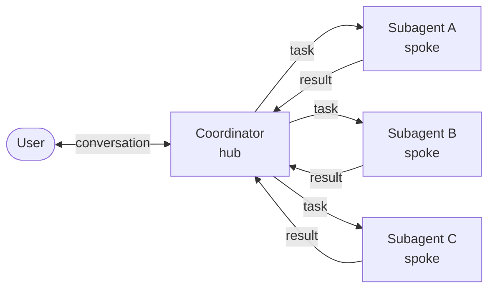

# Design: Anonymous Subagents

- **Status:** Draft
- **Dependencies:** None

## Problem Statement

Long multi-step work degrades any agent that runs it in one conversation. Every tool result stays in the
history — fetched pages, query dumps, file contents, and the failed calls that preceded a working one — and
is resent on every subsequent LLM call, so cost grows superlinearly with task length while the model's
attention drifts to results that stopped mattering many steps ago.

The general fix is settled: delegate a sub-task to a separate agent with its own context window, and take
back only its result. Agentic frameworks ship this as a **spawn primitive** — an ephemeral, caller-configured
worker, declared inline by the agent that uses it and registered nowhere.

QuickApps has the delegation half and not the declaration half. `DeploymentTool`
(`dial_deployment_tooling/`) already calls another DIAL deployment with a `query` and returns only its final
content; pointed at a second QuickApp, it gives the callee its own system prompt, model, tool set, and
iteration budget, and confines every intermediate step. But to use it, a builder who wants three helpers must
create, permission, and deploy three QuickApps in DIAL Core, keep three manifests in sync with the parent,
and re-deploy to change a helper's prompt by one sentence — every helper foreseen and provisioned before the
app that needs it exists. For a non-technical builder in the configurator, that is a reason not to decompose
the work at all.

So the gap is not confinement. It is authoring: **a builder cannot get a helper agent out of the manifest
they are already editing.** That absence is what this design fills; the context savings follow from
delegation itself.

There is a second question hiding behind the first: *who decides what a helper may touch?* One answer is
the builder, at authoring time, per declared helper — the shape Claude Code's `.claude/agents` takes, and
the right one when a job recurs and deserves a prompt tuned for it. But a builder declaring an allowlist is
guessing at tasks that do not exist yet, and the safe way to guess is to widen it. The other answer is the
coordinator, at the moment it delegates, when it knows what *this* sub-task needs. This design offers both:
declared types with a fixed prompt and allowlist, and a built-in general-purpose subagent the coordinator
scopes per call.

## Concepts

**Subagent** — a separate agent run the coordinator starts to carry out one scoped task. It executes its own
orchestrator loop over its own conversation; the coordinator hands over a task description and gets back a
single result. Tool calls, fetched documents, and retries live and die inside the subagent. What is separate
is the conversation and the orchestrator loop, not necessarily the process — where a spoke executes is an
implementation choice (see *Proposed Design*).

**Anonymous** — the subagent is not a deployment. It has no id anyone can call, nothing registered in DIAL
Core, and no state that survives the call. It exists only for the duration of one spawn. This is the
contrast with today's DIAL deployment tool, which calls a separate app that was built and deployed in
advance.

**Coordinator** — the QuickApp that owns the user's conversation. It decides how to split the work, scopes
and spawns subagents, integrates their results, and is the only party that talks to the user. A role, not a
new component: any QuickApp becomes one once its manifest enables subagents.

**Hub-and-spoke** — the multi-agent architecture this design adopts: one coordinator at the center, subagents
around it, and every exchange running between the center and one spoke.

### Hub-and-spoke

The coordinator is the hub; each spawned subagent is a spoke. All communication is radial:

- A spoke's only input is the task the hub writes for it. It does not see the user's conversation, the hub's
  history, or any other spoke.
- A spoke's only output is one result returned to the hub. It does not stream to the user, and the user
  never sees a spoke's intermediate steps.
- Spokes never talk to each other. Two subagents that need the same fact each derive it; the hub is the only
  place results combine.
- Spokes are stateless across spawns. Nothing carries over — spawning the same subagent twice yields two
  unrelated runs.

The hub holds the only durable state. That is the point: the token cost and attention cost of a sub-task
stay in the spoke and are dropped when it returns.



### The spawn surface

Everything lives under `features.subagents`. Turning `enabled` on gives the coordinator's LLM one tool:

```
task(subagent_type, prompt, tool_sets?)
```

`subagent_type` enumerates two kinds of spoke, offered side by side in the same enum.

**The built-in `general-purpose` subagent** is on by default and needs nothing declared. The coordinator
scopes it per call:

| Argument | Written by | Purpose |
|---|---|---|
| `prompt` | the coordinator's LLM | The whole task. The spoke sees nothing else — not the user's message, not the coordinator's history, not another spoke's work. |
| `tool_sets` | the coordinator's LLM | Names of the app's tool sets this spoke may use. It inherits none of the coordinator's tools. Required for this kind. |

The rest of its configuration comes from `features.subagents.general_purpose`: an optional `system_prompt`
(else the built-in general-purpose prompt — never the coordinator's), `deployment_id` and `max_iterations`
(else inherited from the coordinator). Setting `general_purpose` to `null` withholds this kind entirely.

**Declared `types`** take the shape Claude Code uses for `.claude/agents`: the builder writes each one up
front and the LLM chooses among them by name.

| Field            | Purpose                                                                                       |
|------------------|-----------------------------------------------------------------------------------------------|
| `name`           | Identifier the coordinator uses to select this type. May not collide with `general-purpose`.  |
| `description`    | When to use this subagent. Surfaced to the coordinator's LLM — this is the routing mechanism. |
| `system_prompt`  | The spoke's instructions. Replaces the app's system prompt; it is not appended to it.         |
| `tool_sets`      | Names of the app's tool sets this spoke may use. Omitted = inherit all.                       |
| `deployment_id`  | DIAL deployment (model) for this spoke. Omitted = inherit the coordinator's.                  |
| `max_iterations` | The spoke's own budget, independent of the coordinator's.                                     |

For a declared type the allowlist is the builder's, so `tool_sets` on the call is **rejected**, not ignored
— the coordinator would otherwise believe it narrowed a spoke that it did not.

Both kinds return the spoke's final message as a string, plus any attachments it produced. The two are
one mechanism underneath: a general-purpose spawn is materialized into the declared-type shape for the call
(`general_purpose_subagent()`), so the spawner sees a single input.

> **Naming.** The tool name `task` and its `prompt` parameter deliberately mirror Anthropic's Claude Code
> "Task" tool, which spawns subagents the same way; `general-purpose` is Claude Code's built-in agent of the
> same name. We follow that surface so builders and models already familiar with Claude Code's delegation
> primitive find the same shape here. We diverge on one point: Claude Code fixes every agent's tools in its
> definition, where our general-purpose spoke takes them as a call argument, for the reason below.

**Why `tool_sets` is a call argument for the general-purpose kind.** A builder knows what the app is *for*;
the coordinator, at the moment it delegates, knows what this particular sub-task *needs*. The second is the
better-informed decision, and it is the one that has to be right — a declared allowlist is a guess made
before the task exists, and the safe way to guess is to widen it, which erases the narrowing. Declared types
keep the builder's answer for jobs that recur; the general-purpose kind takes the coordinator's for
everything else. Two properties keep the call argument from being a hole rather than a decision:

- **The enum is the app's own enabled tool sets.** The coordinator can only hand a spoke tools it already
  holds itself, so a spawn is never an escalation.
- **Handing over no tools is explicit.** `tool_sets` is required for a general-purpose spawn, and `[]` is
  the way to say "reason over what I gave you". A model that simply *omitted* the argument would otherwise
  get a tool-less spoke, which does not fail: it answers from the prompt alone and sounds confident doing
  it. Requiring the argument turns that into a choice someone made rather than one nobody noticed.

**Why an unknown name fails the call.** The alternative — drop the unrecognised entry, run with what is
left — produces a spoke quietly weaker than the coordinator intended, and that failure is invisible in
exactly the way the previous point describes. `_SubagentTool` raises `InvalidToolCallParameterException`
listing the valid names, which reaches the LLM as a correctable tool error before any spoke runs. A
declared type with a dangling entry is the same mistake made by the builder, so it is reported at app
initialization instead, by name.

**Why the allowlist is toolset-level, not tool-level.** An MCP toolset has no static list of tools — they
are discovered when the session connects, long after the manifest is compiled and the `task` schema is
built — so there is nothing to match a tool-name allowlist against. Narrowing by toolset is the finest
granularity available uniformly across all four tool types. A tool-level allowlist would have to be applied
after initialization, which is a different (and larger) mechanism; see *Out of Scope*.

## Design Goals

The design succeeds when all the following hold. Each is independently verifiable, and several already
have spike tests in `src/tests/unit_tests/subagent_tooling_tests/`.

G1 and G2 distinguish this feature from a DIAL deployment tool pointed at a second QuickApp. G3–G5 are
properties the deployment-tool route already has; they are listed because the design must not lose them.

- **G1 — No advance registration.** Spawning a subagent requires no separate DIAL deployment, no prior
  registration in DIAL Core, and no second manifest to keep in sync. The spoke's manifest is compiled from
  the coordinator's own manifest at call time. *This is the feature.*
- **G2 — Enabled in the manifest the builder is already editing, and scoped by whoever knows best.** A
  declared helper is a `features.subagents.types[]` entry next to the tool sets it uses; changing its prompt
  is a manifest edit, not a re-deploy. The general-purpose helper needs no entry at all: the coordinator
  names its tool sets per spawn, and can name only the app's own. At runtime the LLM cannot select a type
  that is not offered. *(Verifiable: the `task` tool exposes `subagent_type` as an enum of the offered
  names and `tool_sets` as an array whose items enumerate the app's enabled tool set names; an unknown
  value in either is rejected — see UC-4.)*
- **G3 — Context confinement.** A subagent's intermediate work — its tool calls, fetched documents, retries,
  and per-turn LLM messages — never enters the coordinator's context window; the coordinator receives only
  the subagent's final answer as a string, and its token and attention cost is dropped when the spoke
  returns. *(Verifiable: after a spawn, none of the spoke's messages appear in the coordinator's
  `_RequestContext.messages`.)*
- **G4 — Independent budget and scope.** A spoke runs with its own system prompt, its own model
  (`deployment_id`), its own `max_iterations`, and a tool set narrowed to its allowlist — declared, or
  named by the spawn — each independent of the coordinator's. *(Verifiable:
  `test_a_general_purpose_spoke_gets_only_the_tool_sets_the_spawn_asked_for`.)*
- **G5 — Isolated parallelism.** A coordinator may issue several spawns that run concurrently; each runs in
  its own request scope with no shared state and no cross-talk. *(Verifiable:
  `test_parallel_spawns_do_not_share_scope`.)*
- **G6 — A failed spoke never reads as a successful one.** A spawn that produces no final answer surfaces to
  the coordinator as a tool error, never as an empty-but-successful result. Handing the coordinator's LLM an
  empty string it believes is an answer is the same confabulation failure the tool-set checks exist to
  prevent. *(Verifiable: `test_spawn_without_a_final_answer_fails_the_tool_call`.)*
- **G7 — Depth capped at 1.** A spoke cannot spawn: the compiled subagent manifest has
  `features.subagents = None`, so the `task` tool is never offered inside a spoke.
  *(Verifiable: `compile_subagent_manifest` clears it.)*

  **Why cap it.** A depth cap makes the cost of a turn bounded and predictable — with recursion, one
  coordinator decision can fan out into an unbounded tree, which is exactly the runaway spend the feature
  exists to reduce. That reason is permanent. There was a second, temporary one — under Approach A spokes
  share the coordinator's process and event loop, and until the per-spawn timeout and the concurrency bound
  landed, depth was the only structural bound available — but both now exist (see *Bounds on a spawn*), so
  it no longer applies. Relaxing the cap is cheap (one assignment in `compile_subagent_manifest`) and is now
  gated only on whether unbounded spawn trees are wanted at all. Its cost: a builder who needs two levels of
  decomposition is pushed back to deployed apps, which is the workflow G1 exists to remove.

---

## Use Cases

### UC-1: Fan-out to parallel subagents

**Trigger:** The user asks the coordinator to compare the current weather in three cities. The coordinator's
system prompt instructs it to delegate each independent piece.
**Behavior:** In a single turn the LLM issues three `task` calls, each with a task naming one city. With
a declared `weather_scout` type it selects that; without one it selects `general-purpose` and passes
`tool_sets: ["Location rest-api toolset", "Weather rest-api toolset"]`. Either way the three spokes run
concurrently, each in its own scope with only those two tool sets; each resolves coordinates, fetches
weather, and returns one line.
**Outcome:** The coordinator receives three short answer strings, ranks the cities, and replies. The user
sees the coordinator's stages and final ranking — never the spokes' tool calls. The coordinator's context
never held the intermediate location/weather traffic. *(Goals G3, G5.)*

### UC-2: Research delegation with a narrowed tool set

**Trigger:** The user asks a question that needs current external information.
**Behavior:** The coordinator spawns a subagent scoped to `["Web search toolset"]` — a declared
`web_researcher` whose allowlist says so, or the general-purpose one told so on the call — so the spoke can
search the web but cannot reach the coordinator's other tools. The spoke runs multiple searches inside its
own loop.
**Outcome:** The coordinator gets back a lead answer plus a few supporting bullets. The (potentially many)
search results and transcripts stayed inside the spoke and were dropped when it returned; only the distilled
answer entered the coordinator's context. *(Goals G3, G4.)*

### UC-3: Compute delegation over caller-supplied inputs

**Trigger:** Having gathered five temperatures (via UC-1 spokes), the coordinator needs statistics.
**Behavior:** The coordinator spawns a subagent with the Python interpreter tool set only and puts the five
numbers *in the task text* — the spoke sees nothing of the conversation, so the task must be self-contained.
The spoke runs Python and returns the result, and a chart if asked for one.
**Outcome:** The coordinator reports the mean, spread, and outlier; the chart reaches the user as an
attachment of the `task` result. Illustrates the hub-and-spoke rule that a spoke's only input is the task
the hub writes for it.

### UC-4: Error paths

The cases the design must handle:

- **A spoke that produces no answer.** The spoke exhausts `max_iterations` mid-tool-loop, so its conversation
  ends on a tool call and there is no final assistant message to return. `SubagentSpawner` raises
  `SubagentToolErrorException` rather than returning `""`. An empty string
  would reach the coordinator's LLM as a *successful* tool result, and the coordinator would compose an
  answer out of nothing — indistinguishable, from the user's side, from a spoke that genuinely had nothing to
  say. Failing loudly turns a silent wrong answer into a tool error the coordinator can retry or reword.
  *(Goal G6.)*

- **Unknown subagent type.** The LLM calls `task` with a `subagent_type` not in the enum — including
  `general-purpose` when the builder switched it off. `_SubagentTool` raises
  `InvalidToolCallParameterException` naming the offered types; this returns to the coordinator's LLM as a
  tool error it can correct. No spoke runs.
- **Unknown tool set on a general-purpose spawn.** The LLM names a tool set this app does not define, or one
  that is disabled. `_SubagentTool` raises `InvalidToolCallParameterException` listing the valid names. No
  spoke runs, and the call fails whole rather than dropping the bad entry — see *The spawn surface* for why
  silently narrowing is the worse outcome.
- **Missing `tool_sets` on a general-purpose spawn.** The argument is required for that kind. Omitting it
  fails the call the same way, rather than producing a tool-less spoke nobody chose. An *explicitly empty*
  list is a deliberate reasoning-only subagent and is allowed.
- **`tool_sets` on a declared type.** Rejected: the type's allowlist is the builder's, and ignoring the
  argument would let the coordinator believe it narrowed a spoke it did not.
- **Dangling tool-set reference in a declared type (build time).** A declared subagent names a tool set the
  app does not define or has disabled. `SubagentToolingModule` contributes a `ToolInitializationException`
  at initialization, so the builder sees the bad reference *by name* before any spawn is attempted.
- **Allowlist resolves to nothing (spawn time).** If a non-empty allowlist resolves to zero tool sets,
  `compile_subagent_manifest` raises `SubagentToolSetResolutionError` and fails the spawn rather than running
  a tool-less spoke that would confabulate an answer from the task text. Unreachable for a general-purpose
  spawn (the names were vetted at the tool boundary) and for a declared type in a correctly initialized app;
  it is the last line of defence, not the first.
- **Spawn exceeds its wall-clock budget.** `asyncio.wait_for` cancels the spoke and `SubagentSpawner` raises
  `SubagentToolErrorException` naming the budget — a truncated spoke has no answer, so it must reach the
  coordinator as an error rather than as silence.

---

## Proposed Design

Two implementations are on the table. They share the whole user-facing surface described in *Concepts* —
one switch in the manifest, one `task` tool whose `subagent_type` picks a declared type or the
general-purpose one scoped by the call — and differ only in **where the spoke runs**.

> **The decision is closed.** Approach A was implemented and is what ships; B is retained below as the
> documented migration target, and the comparison as the record of why. The two sections are written in the
> forward tense of the original proposal, with the outcome noted where it differs from the forecast.

### Shared: a subagent is an `ApplicationConfig`

Both approaches compile one subagent — a declared type, or the general-purpose one materialized from the
call — plus the coordinator's manifest into a full QuickApp manifest:

| Manifest field | Source |
|---|---|
| `orchestrator.deployment.deployment_id` | the subagent's `deployment_id`, else inherited from the coordinator |
| `orchestrator.system_prompt` | the subagent's `system_prompt` (replaces, never appends); for the general-purpose kind that is the builder's override or the built-in prompt, never the coordinator's |
| `orchestrator.max_iterations` | the subagent's `max_iterations`, else inherited |
| `tool_sets` | the coordinator's enabled tool sets, narrowed to the allowlist — the declared one, or **the one this `task` call named** |
| `tool_defaults` | **inherited** from the coordinator (deep-copied) |
| `contexts` | **inherited** from the coordinator (deep-copied) |
| `skills` | **inherited** from the coordinator |
| `hooks` | **inherited** from the coordinator |
| `features` | **inherited** from the coordinator, except `features.subagents` |
| `features.subagents` | always `None` — depth 1, a spoke cannot spawn |
| `starters`, `conversation_starters` | always **cleared** — coordinator↔user UI concerns; a spoke has no user conversation to seed |

**Inherited vs. cleared.** `compile_subagent_manifest` deep-copies the coordinator's manifest, then
overrides only what the subagent carries and clears exactly three fields: `features.subagents` (the depth
cap), and `starters` / `conversation_starters` (both are coordinator-facing conversation UI, meaningless to
a spoke that never talks to the user). Everything else — `contexts`, `skills`, `hooks`, and the other
`features` — is inherited wholesale, so a spoke sees the same attached files, skill library, lifecycle hooks,
and feature toggles as the coordinator.

**The cost of inherit-everything.** Two of the four inherited fields argue against this default:

- **`contexts` are attached files** — the single largest source of the token bloat this feature exists to
  reduce. Under inheritance, a spoke spawned to average five numbers still carries every document attached to
  the coordinator. That does not break G3 (the spoke's *own* traffic is still confined) but it does blunt it:
  the per-spawn floor is the coordinator's whole attachment set, paid once per spawn, and it rises as the
  builder attaches more.
- **`hooks` are lifecycle callbacks written against a user conversation.** A spoke has no user and no real
  `Choice`. A hook that assumes either is a latent failure inside a spawn, not a missing feature.

`tool_sets` is the one field that already took the confinement-first default for the general-purpose kind:
nothing is inherited, everything is named. Extending that to `contexts` and `skills` would mean adding them
to the `task` call too, which asks the coordinator's LLM to reason about attachments and skill libraries it
cannot see the contents of — a much weaker basis for a decision than "which tools does this sub-task need".
For declared types it would make `contexts` and `skills` required fields on every declaration, and keeping
that surface small is half the point of G2. Getting the default right needs a per-field merge/override
policy, which is a larger change than the one made here (see *Out of Scope*). Until then this is a known
cost: builders should assume a spoke pays for the coordinator's attachments, and hooks should be reviewed
for spoke-safety before being combined with subagents.

Two consequences follow. First, the tool allowlist needs no new filtering machinery in either approach: it is
expressed by narrowing `tool_sets` in the compiled manifest, whichever party wrote the allowlist. Second,
running a spoke is exactly "run one QuickApp request against this manifest" — so the two approaches are two
answers to *where that request executes*, not two different feature designs.

### Approach A — in-process spawn

**What.** The spoke runs inside the coordinator's Python process as an `asyncio` task with its own DI
request scope.

**Owner.** A new `subagent_tooling/` module: `_SubagentTool` (a `StagedBaseTool`), `SubagentSpawner`, and a
subagent output sink.

**Semantics.**

1. The LLM calls `task(subagent_type, prompt, tool_sets?)`. `ToolExecutor` dispatches to `_SubagentTool`
   like any other tool, and a stage opens on the coordinator's choice. `_SubagentTool` settles which
   subagent runs — a declared type as declared, or the general-purpose one materialized with the vetted
   `tool_sets` — before anything is spawned.
2. `SubagentSpawner` compiles the manifest and enters a fresh scope via `RequestScopeFactory.create_scope()`
   inside an `asyncio.Task`. The scope key is a `ContextVar` and
   `asyncio` copies context per task, so the child gets its own `_RequestContext`, `StateHolder`, tool
   instances, and `PerformanceTimer` — every `request_scope` binding — with no leakage in either direction.
3. The spawner builds a `CompletionInputs` — `api_key`, `bearer`, and forwarded headers copied from the
   parent; `application_config` set to the compiled manifest; the task as the sole user message; and a
   `Choice` over a `SubagentOutputSink` rather than the user's — the assignment that decides where
   everything the spoke writes ends up (see *How a spoke's output reaches the user*) — and hands it to
   `CompletionRunner`, the same request-scoped lifecycle the HTTP handler runs. No SDK `Request` is
   synthesized: `CompletionInputs.from_request` is the HTTP adapter's job, and the spawner already holds
   the values as typed data.
4. `CompletionRunner.run` does what it does for a user request: `_RequestContextSetup.setup_context`
   (which runs `ConfigResolver` over the manifest), `invoke_initializers(completion)` — the spoke builds its
   own tools from its own manifest; this is **mandatory** because the message-transformer chain reads
   `OrchestratorCapabilities`, which only exists once `_OrchestratorDeploymentInitializer.initialize()` has
   run — then `setup_messages` **after** initializers (the transformer chain needs the feature contexts
   populated during initialization), then the initialization-issues check, then `Orchestrator.invoke()`.
   A spoke can neither skip initialization nor borrow the coordinator's.
5. The final assistant message becomes `ToolCallResult.content`; the attachments the sink collected become
   `ToolCallResult.attachments`. Teardown has already happened by this point: the child orchestrator's
   `_persisting_state()` `finally` block flushes `RequestAsyncCloseRegistry` — closing the spoke's MCP
   sessions and HTTP clients — during `invoke()`, not as a consequence of the scope exiting. The scope then
   exits and the rest is garbage.

**How a spoke's output reaches the user.** Steps 2–5 above were first built as a spike that handed the
child scope a throwaway `Choice` over a discarding queue, dropping everything the spoke wrote — its streamed
content, its stage activity, and **any attachment it produced**. Lifting that appeared to require decoupling
`Orchestrator` from `Choice` behind an output-sink interface, which was the largest change this design
contemplated.

It turned out not to be necessary. `Choice` and `Stage` are pure producers over a `ChunkQueue`: every write
either offers — `append_content`, `add_attachment`, `set_state`, `create_stage`, `Stage.append_name`,
`Stage.append_content`, `Stage.close` — is one `put_nowait` of a typed chunk. Intercepting the *queue*
therefore captures a spoke's entire output, so `SubagentOutputSink` (an `asyncio.Queue` subclass) replaces
the discarding one and renders the chunks into the coordinator's `task` stage. **The orchestrator is
unchanged, and `AppModule.__provide_stage` is unchanged** — it still derives `Stage` from the child scope's
`Choice`, which is now sink-backed.

The smaller seam was taken because the sink interface would have added an abstraction to the orchestrator's
hot path to serve one caller, while the queue is already the SDK's own seam for exactly this: redirecting
where a choice's output goes. The refactor remains available if a second caller ever needs it.

What the sink does with each chunk:

| Chunk | Handling |
|---|---|
| `ContentChunk` | the spoke's own prose → appended to the parent stage. This is the live progress signal. |
| `StartStageChunk` / `NameStageChunk` / `ContentStageChunk` | buffered per stage index (names arrive incrementally) |
| `FinishStageChunk` | emits that spoke stage as one line plus its body as a blockquote |
| `AttachmentChunk` | collected onto `SpawnResult` → `ToolCallResult.attachments` |
| `AttachmentStageChunk` | added to the parent stage |
| `FunctionToolCallChunk` / `FunctionCallChunk` | dropped with a warning; unreachable, as a spoke inherits no client-side tools |
| everything else — `StateChunk` (spokes are stateless), choice start/end, usage, form schema, discarded messages | dropped by the catch-all branch |

Stage bodies are buffered until the stage closes rather than streamed through, because a spoke gathers its
tool calls — several of its stages are open at once, and streaming them into one parent stage would splice
two transcripts together character by character.

**Attachments cross back.** `StagedBaseTool.arun` already filters a result's attachments by
`propagate_types_to_choice` and `Orchestrator._execute_internal_tool_calls` already pushes those to the
user's choice, so a spoke's chart reaches the user with no further plumbing. This closes the capability gap
that once forced the demo app's `analyst` to be declared text-only.

**Usage is not aggregated.** A spoke's token usage stays inside its own run: the coordinator's
`ToolCallResult.usage` is left unset. The spoke's orchestrator renders its own "Usage Statistics" stage,
which the sink surfaces inside the `task` stage, so the numbers are visible — but they are not folded into
the coordinator's usage table. Reaching them properly means either a per-scope binding override or reading a
private field off the child `Orchestrator`, neither of which is worth it for a display total. Left as a
known gap.

**Bounds on a spawn.** Both were listed as prerequisites of this ship, and both are in it.

*Per-spawn timeout.* `asyncio.wait_for` wraps the spawn. The budget is `SUBAGENT_TIMEOUT_SECONDS` (admin,
default 600s), which an app's `features.subagents.timeout_seconds` may shorten but never extend — the
resolution is `min(declared, ceiling)`, so a manifest cannot raise a limit the operator set. On expiry the
spawn raises `SubagentToolErrorException`, reusing the path built for the answerless case (G6): a truncated
spoke has no answer, so it must reach the coordinator as an error it can act on rather than as silence.
Cancelling a spoke mid-loop does not leak its resources: `_persisting_state()` catches `BaseException`, so
the `finally` block that closes its MCP sessions and HTTP clients runs on the `CancelledError` path exactly
as it does on the success path (see semantics step 5).

*Concurrency bound.* `SpawnSemaphore` caps in-flight spawns at `SUBAGENT_MAX_CONCURRENT_SPAWNS` (default 4),
held around the initializer pass and the orchestrator loop. It is a **singleton, not request-scoped**: the
resource being protected is the replica's event loop and memory, which every concurrent user request draws
on, so a per-request cap would bound nothing. Excess spawns **queue rather than fail** — an LLM that fans out
to twelve scouts should get twelve results slowly, not eight results and four errors — and the timeout above
bounds the wait, so a queued spawn cannot block forever.

**One completion lifecycle, shared.** `CompletionRunner` (`core/application/`) owns the sequence
`_QuickAppCompletion.chat_completion` used to run inline — context setup → initializers → messages →
initialization issues → orchestrator — and takes a `CompletionInputs` value. The HTTP handler builds the
inputs from the SDK `Request` (`CompletionInputs.from_request`); the spawner builds them from the values it
already holds. The spike's first cut populated `_RequestContext` directly and re-ran the steps by hand,
which silently skipped `ConfigResolver` and the initialization-issues check for spokes. *(Decision: a
shared runner with typed inputs, not a synthetic request — see Semantics step 3.)*

**Costs and risks.**

- Initializers re-run per spawn (see semantics step 4 — this is not optional): MCP sessions reconnect, REST
  clients rebuild, DIAL app resolution repeats. Deployment metadata is the exception — it is served from
  `OrchestratorDeploymentCacheService`, a **singleton** (`agent_module.py:115`), so that lookup is cached
  across scopes and costs nothing after the first spawn. The per-spawn cost is therefore connection setup,
  not metadata resolution. Shared with B, but only A can mitigate it further by reusing selected parent tool
  instances.
- No process isolation. A runaway spoke consumes the coordinator's process; there is no HTTP layer to fall
  back on for cancellation.
- Spokes contend with the coordinator for the event loop and for memory, inside one replica.
- Scope leakage is a silent-correctness hazard: any dependency accidentally resolved against the parent
  scope from inside a child task is cross-contamination that tests will not obviously catch.

### Approach B — separate QuickApp deployment, configured per request

**What.** The spoke is a real chat-completion request against a *second QuickApp deployment* — a generic
"subagent runner" whose own manifest is trivial, because the coordinator configures it at call time: the
coordinator compiles a manifest and sends it with the request.

**Owner.** `subagent_tooling/` on the caller side; `_RequestContextSetup` on the callee side.

**Semantics.**

1. The LLM calls `task(subagent_type, prompt, tool_sets?)` — identical surface to Approach A.
2. `SubagentTool` compiles the manifest and delegates to the existing `DialCompletionService`, targeting the
   subagent deployment with the task as the user message and the manifest in the request body.
3. That request reaches a QuickApp instance and runs the ordinary lifecycle, with one difference:
   `_RequestContextSetup.setup_context` merges the injected manifest over the one resolved from application
   properties.
4. The spoke streams back. The coordinator's stream handler renders it into the tool stage — this already
   works for deployment tools — and the final content becomes the tool result.

**The manifest channel.** Two candidates:

- **`custom_fields.configuration` (request body)** — DIAL's standard request-time config channel, already
  modelled in `DialDeploymentParameters.custom_fields` (`config/dial_deployment.py:49`). Requires the
  subagent deployment to publish a configuration schema. *Preferred.*
- **`X-DIAL-Application-Properties` (header)** — the SDK already honors this as a full manifest override
  (`aidial_sdk/deployment/from_request_mixin.py`), so the callee needs no change at all. But QuickApp
  opts out of Core injecting properties into sub-calls (`config/application.py:247`), and whether Core
  forwards a caller-supplied value is a Core policy question outside our control.

**Which deployment?** A dedicated runner: one generic QuickApp deployment, operated alongside the
coordinator, whose own manifest is a placeholder because every spawn overrides it. It is provisioned once,
not per subagent type — all of an installation's spokes, from every coordinator, run against the same runner.

**Change.**

- `Features` gains `subagents` (shared with A).
- New `SubagentTool` that compiles a manifest and delegates to `DialCompletionService`.
- `_RequestContextSetup` merges a request-supplied manifest over the resolved one. **This is the trust
  boundary** — see below.
- The runner deployment publishes a configuration schema via `configuration_support/` if the body channel is
  used.

**The trust boundary.** In our own flow the manifest is server-authored: the builder declares the subagent
types and enables the general-purpose one, and the LLM only picks a type, writes a task string, and — for a
general-purpose spawn — names tool sets from the app's own. But the callee cannot tell the difference.
Once a deployment merges caller-supplied manifests, anyone holding an API key can POST an arbitrary manifest
— naming any deployment and any tool — and have it executed under their own key. This needs the same
two-tier gate shape used for external fetch: an admin env switch plus a per-app feature flag. Following the
external-fetch naming (`EXTERNAL_URL_FETCH_ENABLED` / `features.external_url_fetch.enabled`), the proposed
fields are an admin switch `SUBAGENT_MANIFEST_INJECTION_ENABLED` and a per-app
`features.subagents.accept_injected_manifest`, with the admin switch as a hard cap.

These fields exist only for Approach B — Approach A never exposes an injection endpoint, because the manifest
never leaves the process.

**Costs and risks.**

- Extra HTTP hop and a full application bootstrap per spawn.
- Config injection is a genuine new attack surface (above).
- Not a pure code change: it alters how QuickApps is deployed and depends on Core routing behavior.
- Debuggability — a spoke failure is a different request's stack trace; correlation needs a threaded trace id.

**Gains.**

- Process isolation. A spoke that hangs or OOMs does not take the coordinator down, and HTTP timeouts apply
  for free.
- Horizontal scale: spokes are load-balanced across replicas like any other request.
- **A real `Choice`, real streaming, and real state, because it is a real request.** Nothing has to be
  intercepted or stood in for. *(Forecast as B's decisive advantage, on the assumption that A would have to
  decouple `Orchestrator` from `Choice`. It did not — A intercepts the chunk queue instead and leaves the
  orchestrator untouched, so what remains here is a smaller edge than projected.)*
- Per-spawn cost and usage are already visible to Core as an ordinary deployment call.

### Comparison

| Dimension | A — in-process | B — separate QuickApp, configured per request |
|---|---|---|
| Orchestrator changes | None — the sink intercepts the chunk queue *(forecast: output-sink abstraction required)* | None |
| New code | Spawner + scope plumbing + sink | Spawn tool + manifest serialize/merge |
| Deployment/ops change | None | New runner deployment |
| Core dependency | None | Config channel policy |
| Isolation | None — shares process, loop, memory | Full |
| Scaling | Bounded by one replica | Load-balanced |
| Timeouts / cancellation | Ours to build — `asyncio.wait_for` per spawn, shipped | HTTP layer, free |
| Concurrency backpressure | Ours to build — `SpawnSemaphore`, replica-wide, shipped | HTTP layer / Core |
| Latency per spawn | Tool init only | Tool init + HTTP hop + app bootstrap |
| Security surface | None new — manifest never leaves the process | Caller-supplied manifest execution; needs a two-tier gate |
| Attachments from a spoke | Work — the sink collects them off the queue | Work — real `Choice` |
| Observability | In-process; parent's perf timer can nest | Separate request; needs trace correlation |
| Parallel spawns | `asyncio.gather` (validated) | Concurrent HTTP calls |
| Tool init cost per spawn | Connection setup only — deployment metadata is singleton-cached; mitigable further by reusing parent tools | Connection setup, not mitigable |

**Recommendation: A.** B is the better runtime on every operational dimension — isolation, free HTTP
timeouts, backpressure, and horizontal scale — and none of that is disputed. It is not the recommendation because of what it costs to get there:

- **A new trust boundary.** Merging caller-supplied manifests means the runner executes whatever manifest an
  API key posts to it, which forces the two-tier gate (`SUBAGENT_MANIFEST_INJECTION_ENABLED` plus a per-app
  flag) and a security review of a genuinely new attack surface. A never opens that endpoint.
- **A new deployment to operate.** The runner has to be provisioned, permissioned, monitored, and kept in
  step with the coordinator's QuickApps version in every installation.
- **A dependency on Core policy.** Whether the config channel carries a manifest into a sub-call is not ours
  to decide.

Against that, A's costs are all inside this repository and all bounded: the output sink, a per-spawn timeout,
and a concurrency bound. The sink in particular buys something worth having on its own merits — a way to
point an orchestrator's output somewhere other than the user's choice. A is also already spiked and
validated (scope isolation, manifest compilation, parallel spawns).

So: **A ships first, and the output sink, a per-spawn timeout, and a concurrency bound are prerequisites of
that ship rather than deferrals** (all three are in it — see *Bounds on a spawn* and *How a spoke's output
reaches the user*).

**In the event, three of A's four projected costs came in below forecast.** The output sink needed no
orchestrator change at all, because `Choice` and `Stage` are pure producers over a queue and the queue was
already the seam; attachments cross back rather than being dropped; and the timeout and concurrency bound
were each a contained addition. Only the scope-leakage hazard is unchanged — it is structural to running a
second agent in one process, and no amount of implementation retires it. B's real edge is therefore narrower
than the table forecast: isolation, scale, and free HTTP timeouts, bought with a trust boundary, a
deployment, and a Core-policy dependency.

B stays on the table as the migration target once subagents earn the operational investment — and the
switch is not a rewrite: manifest compilation, the `features.subagents` config, and the `task` tool surface
are identical in both, so only the execution backend behind `SubagentSpawner` changes.

---

## Secondary Fixes

- **`Stage` was *not* decoupled from `Choice`.** The anticipated DI seam — rebinding
  `AppModule.__provide_stage` so a child scope gets a spoke-owned stage — turned out not to need moving: the
  chunk queue is the cheaper interception point, and `__provide_stage` still derives `Stage` from the child
  scope's (now sink-backed) `Choice`. Recorded here because an earlier revision listed it as work to do.
- **Validation of `tool_sets` references happens where it can be acted on.** For a declared type the names
  are the builder's, so `SubagentToolingModule` contributes an `InitializationException` for every entry
  that names a nonexistent or disabled app tool set — a typo surfaces as a named error at app
  initialization rather than as a silently tool-less spoke at spawn time (guarded by
  `test_dangling_tool_set_reference_is_reported_at_initialization`). For a general-purpose spawn the names
  arrive from the coordinator's LLM, so there is nothing to check at startup: `_SubagentTool` rejects an
  unknown name with the valid options, which the LLM can read and retry against (guarded by
  `test_an_unknown_tool_set_fails_the_call_without_spawning`). Both checks share one definition of "which
  tool sets does this app offer" — `tool_set_names`, which also fills the schema enum.

---

## Out of Scope

Items considered but intentionally deferred, each with the reason and what a future pass would need.

### Structured error contract for a failed spoke

**In scope and already built:** a spoke that fails surfaces to the coordinator as a *tool error* rather than
a successful empty result (G6, UC-4). That is the correctness floor — see G6 for why an empty string is worse
than an error.

**Out of scope:** giving that error *structure*. Today the coordinator's LLM receives one prose string and
must infer from wording whether the spawn is worth retrying. It cannot distinguish "the spoke ran out of
iterations" (retry with a narrower task) from "a tool the spoke needed was down" (retry later, or not at all)
from "the task was malformed" (reword, never retry verbatim). The LLM guesses, and a guess costs a whole
extra spawn.

**Anthropic's API solves this by making failure part of the tool-result shape rather than part of its text.**
A tool result carries an explicit `is_error` flag alongside its content, so a failure is machine-readable
before anything parses the message. Its hosted tool results go further and carry a *typed* error code from a
closed set — `max_uses_exceeded`, `execution_time_exceeded`, `overloaded`, `unavailable`, and so on — which
is a category, not a sentence. Retryability then follows from the category rather than being re-derived per
call site: the same taxonomy underpins its documented split between retryable conditions (rate limits,
overload, transient server errors) and terminal ones (malformed request, not found). The shape is worth
copying: **a flag saying it failed, a category saying what kind, and a signal saying whether trying again
could plausibly work.**

The equivalent for a spawn would put three fields on `ToolCallResult`:

| Field | Meaning | Example values here |
| --- | --- | --- |
| `is_error` | The call failed. Machine-readable, independent of the message text. | `true` / `false` |
| `error_category` | What kind of failure, from a closed set. | `no_answer` (budget exhausted), `timeout`, `tool_failure`, `invalid_task` |
| `is_retryable` | Whether re-running the same spawn could plausibly succeed. | `timeout` → yes; `invalid_task` → no |

With those, the coordinator's prompt can carry one rule ("retry a retryable failure once with a narrower
task; otherwise report it") instead of relying on the LLM to read intent out of an error sentence.

Deferred because it is not subagent-shaped: `ToolCallResult` is shared by all four tool types, so adding
these fields changes the tool contract every tool implements, and the categories should be settled against
DIAL's own error taxonomy rather than invented for subagents. The per-spawn timeout now exists, so
`timeout` is a distinguishable category when that pass happens.

### Per-spawn `contexts` / `skills` / `hooks`

A spoke inherits all three wholesale from the coordinator. As *Proposed Design* notes, this has a real cost —
`contexts` are attachments, so inheritance sets the per-spawn token floor at the coordinator's whole
attachment set, and `hooks` written for a user conversation are a latent failure inside a spoke. The
general-purpose kind's `tool_sets` shows the shape a fix could take: make it an argument the coordinator
chooses per spawn. It is deferred because the analogy does not carry — the coordinator picks tool sets from
a list it understands, whereas asking it to select attachments and skills means asking it to reason about
contents it cannot see. On the declared side the cheap version (make the fields required) trades away the
small declaration surface that is half the point of G2. Fixing this properly needs a per-field
merge/override policy, not one more array on the `task` call or one more field on `SubagentConfig`.

### Tool-level scoping

A subagent narrows its tools by toolset, not by individual tool name. Deferred because MCP tools are
discovered when the session connects, so a tool-name enum cannot be built when the `task` schema is, and a
tool-name allowlist cannot be resolved at manifest-compile time the way a toolset allowlist can. Addressing
it means filtering `list[StagedBaseTool]` *after* initialization — a post-init filter in the child scope
rather than a manifest transformation — which also raises the question of what to do when a named tool turns
out not to exist on the connected server. Note this limit binds the *coordinator* as much as the builder: it
is the granularity at which the model can scope a general-purpose spawn.

### Per-call system prompt for the general-purpose kind

The coordinator scopes a general-purpose spawn's *tools* per call but not its *instructions*: the prompt is
the builder's override or the built-in one. A `system_prompt` call argument would complete the "ephemeral,
caller-configured worker" shape the problem statement describes. Deferred because it is a different trust
question — the coordinator's LLM would then author the instructions a second LLM runs under, with nothing
a builder wrote in between — and because the declared kind already covers the case where a task deserves
its own prompt. Cheap to add if wanted: `general_purpose_subagent()` already takes everything per call.

---

## Configuration / Usage Examples

**Preview gating.** `features.subagents` is a `PreviewField`: it is silently nullified during config
validation unless the QuickApps backend runs with `ENABLE_PREVIEW_FEATURES=true`. An app that enables
subagents while preview is off behaves exactly as if the field were absent — no `task` tool is offered.

**Minimal coordinator manifest.** One boolean; the tool sets are the app's ordinary ones, and nothing about
them mentions subagents. The coordinator gets the general-purpose subagent and scopes it per call:

```json
{
  "orchestrator": {
    "deployment": { "deployment_id": "gpt-4.1-2025-04-14" },
    "system_prompt": { "type": "custom", "content": "You coordinate; delegate multi-step work to subagents.", "variables": {} },
    "max_iterations": 20
  },
  "contexts": [],
  "tool_sets": [
    {
      "name": "Web search toolset",
      "description": "Grounded web search.",
      "type": "dial-deployment",
      "tools": [ { "type": "predefined-tool", "template_name": "web_search" } ]
    }
  ],
  "features": {
    "subagents": { "enabled": true }
  }
}
```

Give tool sets a `description`: both `name` and `description` are rendered into the `task` tool's
`tool_sets` parameter as a catalogue, because the coordinator knows which *tools* it holds but not which
*set* each belongs to.

**Adding a declared type** for a recurring job, with its own prompt and a fixed allowlist:

```json
{
  "orchestrator": {
    "deployment": { "deployment_id": "gpt-4.1-2025-04-14" },
    "system_prompt": { "type": "custom", "content": "You coordinate; delegate research to subagents.", "variables": {} },
    "max_iterations": 20
  },
  "contexts": [],
  "tool_sets": [
    {
      "name": "Web search toolset",
      "type": "dial-deployment",
      "tools": [ { "type": "predefined-tool", "template_name": "web_search" } ]
    }
  ],
  "features": {
    "subagents": {
      "enabled": true,
      "types": [
        {
          "name": "web_researcher",
          "description": "Researches a question on the web and reports what it found.",
          "system_prompt": "You research questions using web search. Reply with the answer and at most five supporting bullets.",
          "tool_sets": ["Web search toolset"],
          "max_iterations": 12
        }
      ]
    }
  }
}
```

`tool_sets` — declared or passed on the call — matches app tool sets by their `name` (the resolved name,
e.g. `"Web search toolset"`), not by template id. `"general_purpose": null` would withhold the built-in
kind and leave only `web_researcher` in the enum.

**The spawn round-trip.** The coordinator's LLM calls the generated tool, either selecting the declared type:

```json
{
  "name": "task",
  "arguments": {
    "subagent_type": "web_researcher",
    "prompt": "What problem does the Model Context Protocol solve, and what are its main primitives? Answer in five bullets."
  }
}
```

or scoping the general-purpose one as it goes:

```json
{
  "name": "task",
  "arguments": {
    "subagent_type": "general-purpose",
    "prompt": "What problem does the Model Context Protocol solve, and what are its main primitives? Answer in five bullets.",
    "tool_sets": ["Web search toolset"]
  }
}
```

and receives back only the spoke's final message:

```json
{ "content": "MCP standardises how apps feed context and tools to an LLM ...", "content_type": "text/markdown" }
```

The spoke's own web-search calls and intermediate turns are not in this result and never entered the
coordinator's context. Had the coordinator passed `"tool_sets": []` on the general-purpose call, the same
spoke would have run with no tools at all — a legitimate spawn for a task that is pure reasoning over text
already in the `prompt`.

**A full, runnable example** ships in `docker_compose_files/core/configuration/applications.json` as the
`subagent_demo` app: a coordinator with the general-purpose subagent on and three declared types
(`weather_scout`, `web_researcher`, `analyst`) with per-type `deployment_id` / `tool_sets` /
`max_iterations` narrowing, and conversation starters that exercise multi-city fan-out, computation with a
chart returned from a Python-only spoke, research, a general-purpose spawn scoped by the coordinator, and a
spawn with no tools at all. It requires `ENABLE_PREVIEW_FEATURES=true` on the backend.

---

## Migration

### Breaking changes

The root `ApplicationConfig.subagents` array of an earlier revision is **removed**; the same entries now live
at `features.subagents.types`, under an explicit `enabled` switch. This is acceptable because the whole
feature is preview-gated and unreleased: with `ENABLE_PREVIEW_FEATURES` unset — the default, and what any
deployed app runs on — the field was nullified during validation anyway, so no shipped app depended on it.
Apps built against the earlier revision move the array to `features.subagents.types` and add
`"enabled": true`; the `subagent_demo` app in the local stack shows the result.

### Non-breaking changes

`features.subagents` is an optional, preview-gated (`PreviewField`) addition. Apps that do not enable it are
unaffected. When `ENABLE_PREVIEW_FEATURES` is unset, the field is nullified during config validation, so
even a manifest that *does* include it degrades gracefully to today's behavior rather than erroring.
Enabling the feature requires no migration of existing apps.

## Summary of Changes

**Config (`src/quickapp/config/`)**

- `subagent.py` — `SubagentsConfig`: `enabled`, `general_purpose: GeneralPurposeSubagentConfig | None`
  (`system_prompt?`, `deployment_id?`, `max_iterations?`), `types: list[SubagentConfig]`,
  `timeout_seconds?`; a validator keeps names unique and `general-purpose` reserved while that kind is on.
  `SubagentConfig` (a declared type): `name`, `description`, `system_prompt`, `tool_sets?`,
  `deployment_id?`, `max_iterations?`.
- `application.py` — `Features.subagents: SubagentsConfig | None` (preview field).

**Module (`src/quickapp/subagent_tooling/`)**

- `SubagentToolingModule` (`@preview_module`) — offers the `task` tool when `features.subagents.enabled` is
  true and at least one kind is offered; builds its schema from the app's enabled tool sets so the
  coordinator can name them; contributes build-time `tool_sets` validation for declared types.
- `_tool_config.py` — the `task` schema: `subagent_type` (enum of the offered names, general-purpose first)
  and `prompt`, both required; `tool_sets`, present only when the general-purpose kind is offered, an array
  whose items enumerate the app's tool set names with a `name: description` catalogue in the parameter
  description. The `enum` is omitted when the app has no tool sets, since an empty `enum` is not valid JSON
  Schema.
- `_builtin_subagents.py` — `GENERAL_PURPOSE_SYSTEM_PROMPT` and `GENERAL_PURPOSE_DESCRIPTION`, and
  `general_purpose_subagent()`, which materializes the built-in kind into a `SubagentConfig` for one call.
- `compile_subagent_manifest` — compiles a `SubagentConfig` + parent manifest into a narrowed
  `ApplicationConfig` (filters `tool_sets` to the allowlist; inherits `contexts` / `skills` / `hooks` /
  other `features`; clears `features.subagents` / `starters` / `conversation_starters`). Caller-side in
  both approaches — the same function either way.
- `selectable_tool_sets` / `tool_set_names` / `unknown_tool_sets` — one definition of "which tool sets may
  a spoke be given" (enabled, named; manifest order) and "which ones did this subagent name that aren't
  offered", shared by the schema builder, the call-time check, the module's build-time check (hard
  failure) and the compiler (log only). All tolerate the unresolved `PredefinedToolSet` shape the config
  type admits. Names are `LocalizedString`, resolved with `resolve_localized` at the default locale: the
  coordinator selects by an identifier it read out of the schema, which must not shift with the caller's
  `Accept-Language`.
- `SubagentSpawner` — runs a spoke in-process in an isolated request scope (Approach A), under
  `SpawnSemaphore` and `asyncio.wait_for`, through `CompletionRunner`; returns a `SpawnResult` (answer +
  attachments).
- `_SubagentTool` / `_SubagentStageWrapper` — the `task` `StagedBaseTool`, its argument validation (type
  selection, `tool_sets` vetting for the general-purpose kind and rejection for declared types), and its
  stage rendering (which shows the tool sets a general-purpose spawn was given, since that varies per
  call).
- `_subagent_output_sink.py` — `SubagentOutputSink`, the `ChunkQueue` that renders a spoke's output into the
  coordinator's `task` stage and collects its attachments.
- `_subagent_settings.py` — `SubagentSettings` (`SUBAGENT_TIMEOUT_SECONDS`, `SUBAGENT_MAX_CONCURRENT_SPAWNS`)
  and `SpawnSemaphore`.
- `SubagentToolSetResolutionError` — raised when a non-empty allowlist resolves to no tool sets.
- `SubagentToolErrorException` — a `ToolErrorException` raised when a spawn produces no final answer or
  exceeds its budget, so an answerless spoke reaches the coordinator as a tool error rather than an empty
  success (G6).

**Core (`src/quickapp/core/application/`)**

- `CompletionInputs` — the typed boundary of one completion run; `from_request` is the only reader of the
  SDK request.
- `CompletionRunner` — the request-scoped lifecycle (context → initializers → messages → initialization
  issues → orchestrator) shared by `_QuickAppCompletion` and `SubagentSpawner`.
- `_RequestContextSetup.setup_context` takes `CompletionInputs` instead of an SDK request.

**Wiring**

- `app_factory.py` — registers `SubagentToolingModule`.
- `docs/generated-app-schema.json`, `docs/generated-internal-tools.json` — regenerated.
- `docker_compose_files/core/configuration/applications.json` — `subagent_demo` exercises both kinds.

**Still open**

Usage aggregation from a spoke (see *Approach A*), the structured error contract, per-spawn
`contexts` / `skills` / `hooks`, tool-level scoping, and a per-call system prompt for the general-purpose
kind — all detailed in *Out of Scope* above.
