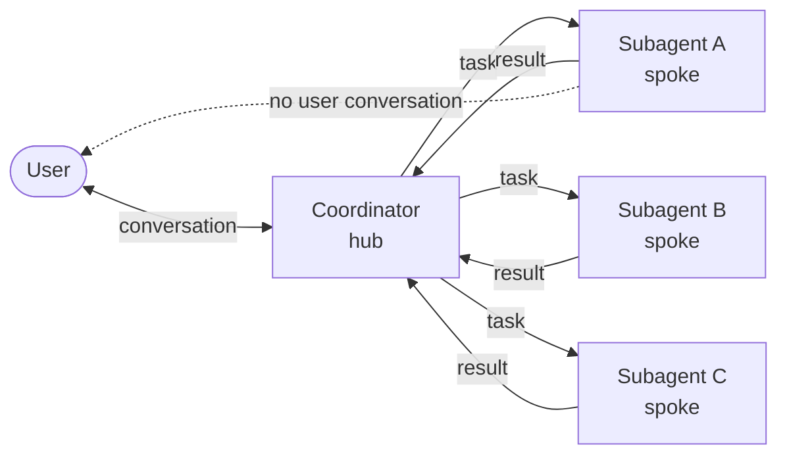

# Design: Anonymous Subagents

- **Status:** Draft
- **Dependencies:** None

> **What changed in this revision.** The problem statement now names the gap this feature actually closes
> (authoring: declaring a helper inline instead of deploying one) rather than context economics, which
> `DeploymentTool` already delivers against a second QuickApp. A third implementation — **Approach C**,
> out-of-process via self-call with a *selector* instead of an injected manifest — is added, and it changes
> the recommendation: C wins on every operational dimension and carries none of Approach B's security cost.
> The recommendation is therefore no longer "build A"; it is "answer one Core question, then pick".

## Problem Statement

Multi-step work in a QuickApp gets more expensive and worse the longer it runs. Every step's raw material
stays in the conversation: fetched pages, SQL dumps, file contents, retries that failed before one worked.
That history is resent on every subsequent LLM call, so token spend grows superlinearly with task length,
and the model's attention is increasingly spent on material that stopped being relevant many steps ago.

**We can already fix that, and the fix is the problem.** `DeploymentTool` (`dial_deployment_tooling/`) takes
a `query` string, calls another DIAL deployment, and returns only that deployment's final content. Point it
at a second QuickApp and you have delegation with every property this design wants: the callee runs its own
system prompt, model, tool set, and iteration budget, in its own context window, and the caller sees only
the answer. Context confinement is not the gap. **Authoring is.**

To use that today, an app builder who wants three helpers must create, permission, and deploy three
QuickApps in DIAL Core; keep three manifests in sync with the parent that calls them; and re-deploy to change
a helper's prompt by one sentence. Every helper must be foreseen and provisioned before the app that needs it
exists. For a non-technical builder working in the configurator that is not a workflow — it is a reason not
to decompose the work at all, which leaves them with the single long-context loop and the bill that comes
with it.

So the problem is not *"we cannot confine a sub-task's context."* It is: **a builder cannot declare a helper
agent in the manifest they are already editing.** Other agentic frameworks solve this with a spawn primitive
— an ephemeral, caller-configured worker with no separate registration. We have no equivalent, and that
absence is what this design fills.

The context-economics benefit follows for free, because it is the same benefit the deployment tool already
delivers. It is the reason the feature is worth having; it is not the reason it needs building.

## Concepts

**Subagent** — an agent instance the coordinator invokes to carry out one scoped task. It runs its own
orchestrator loop with its own conversation; the coordinator hands over a task description and gets back a
single result. Tool calls, fetched documents, and retries live and die inside the subagent.

**Anonymous** — the subagent is not a deployment. It has no id anyone can call, nothing registered in DIAL
Core, and no state that survives the call. It exists only for the duration of one spawn. This is the
contrast with today's DIAL deployment tool, which calls a separate app that was built and deployed in
advance.

**Coordinator** — the QuickApp that owns the user's conversation. It decides how to split the work, spawns
subagents, integrates their results, and is the only party that talks to the user. A role, not a new
component: any QuickApp becomes one once its manifest declares subagents.

### Hub-and-spoke

The coordinator is the hub; each spawned subagent is a spoke. All communication is radial:

- A spoke's only input is the task the hub writes for it. It does not see the user's conversation, the hub's
  history, or any other spoke.
- A spoke's only output is one result returned to the hub. It does not stream to the user, and the user
  never sees a spoke's intermediate steps.
- Spokes never talk to each other. Two subagents that need the same fact each derive it; the hub is the only
  place results combine.
- Spokes are stateless across spawns. Nothing carries over — spawning the same subagent twice yields two
  unrelated runs.

The hub holds the only durable state. That is the point: the token cost and attention cost of a sub-task
stay in the spoke and are dropped when it returns.



Every arrow is radial: tasks flow hub→spoke, results flow spoke→hub, and only the hub talks to the user.
There are no spoke-to-spoke edges, and the dashed edge is the one that does *not* exist — a spoke never
reaches the user.

### Declaring a subagent

The app builder declares subagent *types* in the manifest, the same shape Claude Code uses for
`.claude/agents`. The LLM does not invent a subagent; it chooses a declared one and writes its task.

| Field | Meaning |
| --- | --- |
| `name` | Identifier the coordinator uses to select this type. |
| `description` | *When to use this subagent.* Surfaced to the coordinator's LLM — this is the routing mechanism. |
| `system_prompt` | The spoke's instructions. Replaces the app's system prompt; it is not appended to it. |
| `tool_sets` | Names of the app's tool sets this spoke may use. Omitted = inherit all. |
| `deployment_id` | DIAL deployment (model) for this spoke. Omitted = inherit the coordinator's. |
| `max_iterations` | The spoke's own budget, independent of the coordinator's. |

At runtime the coordinator gets one tool — `task(subagent_type, prompt)` — whose `subagent_type`
enumerates the declared types. It returns the spoke's final message as a string.

> **Naming.** The tool name `task` and its `prompt` parameter deliberately mirror Anthropic's Claude Code
> "Task" tool, which spawns subagents the same way. We follow that surface so builders and models already
> familiar with Claude Code's delegation primitive find the same shape here.

**Why the allowlist is toolset-level, not tool-level.** An MCP toolset has no static list of tools — they
are discovered when the session connects, long after the manifest is compiled — so there is nothing to
match a tool-name allowlist against at declaration time. Narrowing by toolset is the finest granularity
available uniformly across all four tool types. A tool-level allowlist would have to be applied after
initialization, which is a different (and larger) mechanism; see *Out of Scope*.

## Design Goals

The design succeeds when all of the following hold. Each is independently verifiable, and several already
have spike tests in `src/tests/unit_tests/subagent_tooling_tests/`.

**G1 and G2 are the goals that distinguish this feature from a DIAL deployment tool pointed at a second
QuickApp. G3–G5 restate properties the deployment-tool route already has** — they are listed because the
design must not lose them, not because building it is how we get them.

- **G1 — No advance registration.** Spawning a subagent requires no separate DIAL deployment, no prior
  registration in DIAL Core, and no second manifest to keep in sync. The spoke's manifest is compiled from
  the coordinator's own manifest at call time. *This is the feature.*
- **G2 — Declared in the manifest the builder is already editing.** A helper agent is a `subagents[]` entry
  next to the tool sets it uses; changing its prompt is a manifest edit, not a re-deploy. At runtime the LLM
  selects one *declared* type per spawn and cannot name a type that was not declared. *(Verifiable: the
  `task` tool exposes `subagent_type` as an enum of declared names; an unknown value is rejected — see
  UC-4.)*
- **G3 — Context confinement.** A subagent's intermediate work — its tool calls, fetched documents, retries,
  and per-turn LLM messages — never enters the coordinator's context window; the coordinator receives only
  the subagent's final answer as a string, and its token and attention cost is dropped when the spoke
  returns. *(Verifiable: after a spawn, none of the spoke's messages appear in the coordinator's
  `_RequestContext.messages`.)*
- **G4 — Independent budget and scope.** A spoke runs with its own system prompt, its own model
  (`deployment_id`), its own `max_iterations`, and a tool set narrowed to the declared allowlist — each
  independent of the coordinator's.
- **G5 — Isolated parallelism.** A coordinator may issue several spawns that run concurrently; each runs in
  its own request scope with no shared state and no cross-talk. *(Verifiable:
  `test_parallel_spawns_do_not_share_scope`.)*
- **G6 — A failed spoke never reads as a successful one.** A spawn that produces no final answer surfaces to
  the coordinator as a tool error, never as an empty-but-successful result. Handing the coordinator's LLM an
  empty string it believes is an answer is the same confabulation failure the tool-set checks exist to
  prevent. *(Verifiable: `test_spawn_without_a_final_answer_fails_the_tool_call`.)*
- **G7 — Depth capped at 1.** A spoke cannot spawn: the compiled subagent manifest has `subagents = None`.
  *(Verifiable: `compile_subagent_manifest` clears `subagents`.)*

  **Why cap it.** Two honest reasons, one good and one temporary. The good one: a depth cap makes the cost of
  a turn bounded and predictable — with recursion, one coordinator decision can fan out into an unbounded
  tree, which is exactly the runaway spend the feature exists to reduce. The temporary one: under Approach A
  the spokes share the coordinator's process and event loop, and there is no timeout yet (see *Out of
  Scope*), so depth is the only structural bound we have. The cap is cheap to relax later — it is one
  assignment in `compile_subagent_manifest` — and relaxing it should wait until per-spawn timeouts and a
  concurrency bound exist. Its cost is real and should be stated: a builder who genuinely needs two levels of
  decomposition is pushed back to deployed apps, which is the workflow G1 exists to remove.

---

## Use Cases

### UC-1: Fan-out to parallel subagents

**Trigger:** The user asks the coordinator to compare the current weather in three cities. The coordinator's
system prompt instructs it to delegate each independent piece.
**Behavior:** In a single turn the LLM issues three `task` calls, each selecting `weather_scout`
with a task naming one city. The three spokes run concurrently, each in its own scope with only the location
and weather tool sets; each resolves coordinates, fetches weather, and returns one line.
**Outcome:** The coordinator receives three short answer strings, ranks the cities, and replies. The user
sees the coordinator's stages and final ranking — never the spokes' tool calls. The coordinator's context
never held the intermediate location/weather traffic. *(Goals G3, G5.)*

### UC-2: Research delegation with a narrowed tool set

**Trigger:** The user asks a question that needs current external information.
**Behavior:** The coordinator spawns `web_researcher`, whose declared `tool_sets` is `["Web search toolset"]`
— so the spoke can search the web but cannot reach the coordinator's other tools. The spoke runs multiple
searches inside its own loop.
**Outcome:** The coordinator gets back a lead answer plus a few supporting bullets. The (potentially many)
search results and transcripts stayed inside the spoke and were dropped when it returned; only the distilled
answer entered the coordinator's context. *(Goals G3, G4.)*

### UC-3: Compute delegation over caller-supplied inputs

**Trigger:** Having gathered five temperatures (via UC-1 spokes), the coordinator needs statistics.
**Behavior:** The coordinator spawns `analyst` (tool set: the Python interpreter only) and puts the five
numbers *in the task text* — the spoke sees nothing of the conversation, so the task must be self-contained.
The spoke runs Python and returns the result.
**Outcome:** The coordinator reports the mean, spread, and outlier. Illustrates the hub-and-spoke rule that a
spoke's only input is the task the hub writes for it.

### UC-4: Error paths

Four cases the design must handle:

- **A spoke that produces no answer.** The spoke exhausts `max_iterations` mid-tool-loop, so its conversation
  ends on a tool call and there is no final assistant message to return. `SubagentSpawner` raises
  `SubagentToolErrorException` rather than returning `""`. This matters more than it looks: an empty string
  would reach the coordinator's LLM as a *successful* tool result, and the coordinator would compose an
  answer out of nothing — indistinguishable, from the user's side, from a spoke that genuinely had nothing to
  say. Failing loudly turns a silent wrong answer into a tool error the coordinator can retry or reword.
  *(Goal G6.)*

- **Undeclared subagent type.** The LLM calls `task` with a `subagent_type` not in the enum.
  `_SubagentTool` raises `InvalidToolCallParameterException` naming the available types; this returns to the
  coordinator's LLM as a tool error it can correct. No spoke runs.
- **Dangling tool-set reference (build time).** A declared subagent names a tool set the app does not define.
  `SubagentToolingModule` contributes a `ToolInitializationException` at initialization, so the builder sees
  the bad reference *by name* before any spawn is attempted.
- **Allowlist resolves to nothing (spawn time).** If a non-empty allowlist resolves to zero tool sets,
  `compile_subagent_manifest` raises `SubagentToolSetResolutionError` and fails the spawn rather than running
  a tool-less spoke that would confabulate an answer from the task text. An *explicitly empty* allowlist
  (`[]`) is a deliberate no-tools subagent and is allowed.

---

## Proposed Design

Three implementations are on the table. They share the whole user-facing surface described in *Concepts* —
the builder declares subagent types in the manifest, the coordinator's LLM calls one `task` tool — and
differ only in **where the spoke runs**, and (for the two out-of-process variants) **what crosses the wire to
get it there**.

### Shared: a subagent is an `ApplicationConfig`

Both approaches compile a declared subagent type plus the coordinator's task into a full QuickApp manifest:

| Manifest field | Source |
|---|---|
| `orchestrator.deployment.deployment_id` | subagent `deployment_id`, else inherited from the coordinator |
| `orchestrator.system_prompt` | subagent `system_prompt` (replaces, never appends) |
| `orchestrator.max_iterations` | subagent `max_iterations`, else inherited |
| `tool_sets` | the coordinator's tool sets, narrowed to the declared allowlist |
| `tool_defaults` | **inherited** from the coordinator (deep-copied) |
| `contexts` | **inherited** from the coordinator (deep-copied) |
| `skills` | **inherited** from the coordinator |
| `hooks` | **inherited** from the coordinator |
| `features` | **inherited** from the coordinator |
| `subagents` | always `None` — depth 1, a spoke cannot spawn |
| `starters`, `conversation_starters` | always **cleared** — coordinator↔user UI concerns; a spoke has no user conversation to seed |

**Inherited vs. cleared, resolved.** `compile_subagent_manifest` deep-copies the coordinator's manifest, then
overrides only what the subagent declares and clears exactly three fields: `subagents` (the depth cap), and
`starters` / `conversation_starters` (both are coordinator-facing conversation UI, meaningless to a spoke
that never talks to the user). Everything else — `contexts`, `skills`, `hooks`, and `features` — is inherited
wholesale, so a spoke sees the same attached files, skill library, lifecycle hooks, and feature toggles as
the coordinator.

**Inherit-everything is the wrong default, and we are shipping it anyway.** Two of the four inherited fields
argue against it:

- **`contexts` are attached files** — the single largest source of the token bloat this feature exists to
  reduce. Under inheritance, a spoke spawned to average five numbers still carries every document attached to
  the coordinator. That does not break G3 (the spoke's *own* traffic is still confined) but it does blunt it:
  the per-spawn floor is the coordinator's whole attachment set, paid once per spawn, and it rises as the
  builder attaches more.
- **`hooks` are lifecycle callbacks written against a user conversation.** A spoke has no user and no real
  `Choice`. A hook that assumes either is a latent failure inside a spawn, not a missing feature.

The confinement-first default would be the opposite: inherit nothing but what the subagent declares. We are
not shipping that, for one reason — it would make `contexts` and `skills` required fields on every subagent
declaration, and the declaration surface is the thing this feature is trying to keep small (G2). Getting the
default right needs a per-field merge/override policy, which is a larger change than the one being made here
(see *Out of Scope*). Until then this is a known cost, not a considered preference: builders should assume a
spoke pays for the coordinator's attachments, and hooks should be reviewed for spoke-safety before being
combined with subagents.

Two consequences worth naming up front. First, the tool allowlist needs no new filtering machinery in any of
the approaches: it is expressed by narrowing `tool_sets` in the compiled manifest. Second, running a spoke is
exactly "run one QuickApp request against this manifest" — so the three approaches are three answers to
*where that request executes and how the manifest gets there*, not three different feature designs.

### Approach A — in-process spawn

**What.** The spoke runs inside the coordinator's Python process as an `asyncio` task with its own DI
request scope.

**Owner.** A new `subagent_tooling/` module: `_SubagentTool` (a `StagedBaseTool`), `SubagentSpawner`, and a
subagent output sink.

**Semantics.**

1. The LLM calls `task(subagent_type, prompt)`. `ToolExecutor` dispatches to `_SubagentTool` like any
   other tool, and a stage opens on the coordinator's choice.
2. `SubagentSpawner` compiles the manifest and enters a fresh scope via `RequestScopeFactory.create_scope()`
   inside an `asyncio.Task`. The scope key is a `ContextVar` and
   `asyncio` copies context per task, so the child gets its own `_RequestContext`, `StateHolder`, tool
   instances, and `PerformanceTimer` — every `request_scope` binding — with no leakage in either direction.
3. The child `_RequestContext` is populated **directly**: `api_key`, `bearer`, and forwarded headers copied
   from the parent; `application_config` set to the compiled manifest. No SDK `Request` is synthesized — the
   spawner already holds these as typed values, so it sets them on the context rather than round-tripping
   them through `_RequestContextSetup.setup_context`, whose job is to *extract* them from an HTTP request.
4. `invoke_initializers(injector, InitializerType.completion)` runs in the child scope — the spoke builds
   its own tools from its own manifest. This step is **mandatory**: the message-transformer chain reads
   `OrchestratorCapabilities`, which only exists once `_OrchestratorDeploymentInitializer.initialize()` has
   run. A spoke can neither skip initialization nor borrow the coordinator's.
5. `_RequestContextSetup.setup_messages([task])` runs **after** initializers (the transformer chain needs the
   feature contexts populated during initialization), setting the task as the spoke's sole user message.
6. `injector.get(Orchestrator)` → `await invoke()`.
7. The final assistant message becomes `ToolCallResult.content`. The child scope exits,
   `RequestAsyncCloseRegistry` closes its MCP sessions, and the rest is garbage.

**Current state — spike vs. target.** Steps 2–7 are built and validated as a spike in
`src/quickapp/subagent_tooling/` (`SubagentSpawner`), including the scope-isolation claim in step 2 for
parallel spawns. The spike runs the **unmodified** orchestrator by handing the child scope a throwaway
`Choice` (`_headless_choice()`, marked *SPIKE ONLY*) whose chunks are discarded where they are produced.
What the spike proves is scope isolation and manifest compilation; what it defers is the output sink.

**What the placeholder currently costs, stated plainly.** Everything the orchestrator writes to a spoke's
`Choice` is dropped: its streamed content (harmless — the final answer is read back off
`_RequestContext.messages` instead), its `set_state` (harmless — spokes are stateless by design), and **any
attachment it produced (not harmless)**. A spoke that generates a chart or a file has no way to return it;
only text crosses back to the coordinator. That is a real capability gap, not a cosmetic one, and it is why
the `subagent_demo` app's `analyst` is declared text-only rather than advertising charts. Approaches B and C
do not have this gap at all — a spoke there has a real `Choice` because it is a real request.

Before the feature ships on Approach A, the orchestrator must stop writing to `Choice` directly — the
**output-sink abstraction** below is the required production change, and it removes `_headless_choice()`.

**Change.**

- **Output-sink abstraction (the largest change, still to build).** `Orchestrator` writes to `Choice`
  directly — `set_state`, `add_attachment`, `create_function_tool_call`, and as the stream `destination`
  (`orchestrator.py:143,279,290,313`). A spoke has no user `Choice`. Introduce a sink interface with two
  implementations: today's choice-backed one, and a subagent one that buffers content, forwards attachments
  to the parent tool result, drops `set_state` (spokes are stateless), and rejects external tool calls (a
  spoke cannot surface client-side tool calls to a user it has no channel to).
- `AppModule.__provide_stage` derives `Stage` from `Choice` (`app_module.py:96`); the child scope must bind
  the spoke's own stage instead.
- **Message and manifest setup reuse the existing lifecycle, no shared extraction required.** The spawner
  mirrors the sequence `_QuickAppCompletion.chat_completion` runs (setup → initializers → messages →
  orchestrator), but populates `_RequestContext` directly and calls `setup_messages` rather than adding a
  fake-`Request` entry point to `setup_context`. *(Decision: direct population, not a synthetic request —
  see Semantics step 3. This supersedes the earlier "non-HTTP entry point" sketch.)*

**Costs and risks.**

- Initializers re-run per spawn (see semantics step 4 — this is not optional): MCP sessions reconnect, REST
  clients rebuild, DIAL app resolution repeats. Deployment metadata is the exception — it is served from
  `OrchestratorDeploymentCacheService`, a **singleton** (`agent_module.py:115`), so that lookup is cached
  across scopes and costs nothing after the first spawn. The per-spawn cost is therefore connection setup,
  not metadata resolution. Shared with B and C, but only A can mitigate it further by reusing selected
  parent tool instances.
- **Timeouts are out of scope for the initial ship.** `asyncio.wait_for` around the spawn is the intended
  mechanism, but enforcing it (and surfacing a clean timeout error to the coordinator) is deferred — see
  *Out of Scope*. Until then a runaway spoke is bounded only by its own `max_iterations`.
- No process isolation. A runaway spoke consumes the coordinator's process; there is no HTTP layer to fall
  back on for cancellation.
- Spokes contend with the coordinator for the event loop and for memory, inside one replica.
- Scope leakage is a silent-correctness hazard: any dependency accidentally resolved against the parent
  scope from inside a child task is cross-contamination that tests will not obviously catch.

### Approach B — out-of-process spawn, manifest injected

**What.** The spoke is a real QuickApp chat-completion request against a deployment, configured entirely by
the coordinator at call time: the coordinator compiles a manifest and sends it with the request.

**Owner.** `subagent_tooling/` on the caller side; `_RequestContextSetup` on the callee side.

**Semantics.**

1. The LLM calls `task(subagent_type, prompt)` — identical surface to Approach A.
2. `SubagentTool` compiles the manifest and delegates to the existing `DialCompletionService`, targeting the
   subagent deployment with the task as the user message and the manifest in the request body.
3. That request reaches a QuickApp instance and runs the ordinary lifecycle, with one difference:
   `_RequestContextSetup.setup_context` merges the injected manifest over the one resolved from application
   properties.
4. The spoke streams back. The coordinator's stream handler renders it into the tool stage — this already
   works for deployment tools — and the final content becomes the tool result.

**The manifest channel.** Two candidates:

- **`custom_fields.configuration` (request body)** — DIAL's standard request-time config channel, already
  modelled in `DialDeploymentParameters.custom_fields` (`config/dial_deployment.py:49`). Requires the
  subagent deployment to publish a configuration schema. *Preferred.*
- **`X-DIAL-Application-Properties` (header)** — the SDK already honors this as a full manifest override
  (`aidial_sdk/deployment/from_request_mixin.py`), so the callee needs no change at all. But QuickApp
  opts out of Core injecting properties into sub-calls (`config/application.py:247`), and whether Core
  forwards a caller-supplied value is a Core policy question outside our control.

**Which deployment?** A dedicated "subagent runner" QuickApp deployment with a trivial manifest. (Self-call
— the coordinator's own deployment id — is also possible, and turns out to remove the need to inject a
manifest at all; that is Approach C below.)

**Change.**

- `ApplicationConfig` gains `subagents` (shared with A).
- New `SubagentTool` that compiles a manifest and delegates to `DialCompletionService`.
- `_RequestContextSetup` merges a request-supplied manifest over the resolved one. **This is the trust
  boundary** — see below.
- The runner deployment publishes a configuration schema via `configuration_support/` if the body channel is
  used.

**The trust boundary.** In our own flow the manifest is server-authored: the builder declares the subagent
types, and the LLM only picks a type and writes a task string. But the callee cannot tell the difference.
Once a deployment merges caller-supplied manifests, anyone holding an API key can POST an arbitrary manifest
— naming any deployment and any tool — and have it executed under their own key. This needs the same
two-tier gate shape used for external fetch: an admin env switch plus a per-app feature flag. Following the
external-fetch naming (`EXTERNAL_URL_FETCH_ENABLED` / `features.external_url_fetch.enabled`), the proposed
fields are an admin switch `SUBAGENT_MANIFEST_INJECTION_ENABLED` and a per-app
`features.subagents.accept_injected_manifest`, with the admin switch as a hard cap.

These fields exist only for Approach B. Approach A never exposes an injection endpoint, and **Approach C
removes the boundary rather than gating it** — it sends a declared name, not a manifest, so there is nothing
to gate. If out-of-process is the direction, C is the way to get there.

**Costs and risks.**

- Extra HTTP hop and a full application bootstrap per spawn.
- Config injection is a genuine new attack surface (above).
- Not a pure code change: it alters how QuickApps is deployed and depends on Core routing behavior.
- Debuggability — a spoke failure is a different request's stack trace; correlation needs a threaded trace id.

**Gains.**

- Process isolation. A spoke that hangs or OOMs does not take the coordinator down, and HTTP timeouts apply
  for free.
- Horizontal scale: spokes are load-balanced across replicas like any other request.
- **No orchestrator changes at all.** The spoke has a real `Choice`, real streaming, and real state because
  it is a real request — Approach A's largest change simply does not exist here.
- Per-spawn cost and usage are already visible to Core as an ordinary deployment call.

### Approach C — out-of-process spawn, selector not manifest

**What.** Approach B without the manifest channel. The coordinator calls **its own deployment id**, passing
only the *name* of a declared subagent plus the task. The callee resolves its manifest the way every
QuickApp request already does — `_RequestContextSetup` reads it from the deployment's own application
properties (`_request_context_setup.py:59`) — and because the callee *is* the coordinator's deployment, that
manifest already contains the `subagents[]` declarations. It looks the name up and calls the same
`compile_subagent_manifest` the other approaches call, on the callee side.

**Owner.** `subagent_tooling/` on the caller side; `_RequestContextSetup` on the callee side.

**Semantics.**

1. The LLM calls `task(subagent_type, prompt)` — identical surface to A and B.
2. `SubagentTool` delegates to `DialCompletionService`, targeting the coordinator's own deployment id, with
   the task as the user message and `custom_fields.configuration = {"subagent_type": "<name>", "depth": 1}`.
3. `setup_context` sees a `subagent_type`, looks it up in the manifest it just resolved for itself, and
   applies `compile_subagent_manifest`. An unknown name is rejected there.
4. The spoke streams back; the coordinator's stream handler renders it into the tool stage — this already
   works for deployment tools — and the final content becomes the tool result.

**Why this is the interesting option: the trust boundary disappears.** Approach B's whole cost is that a
deployment which merges caller-supplied manifests will execute *any* manifest anyone with an API key posts to
it — naming any deployment and any tool, under their own key. That is what forces the two-tier gate
(`SUBAGENT_MANIFEST_INJECTION_ENABLED` plus a per-app feature flag) and makes B a bigger commitment than A.

Approach C never accepts a manifest. The only caller-supplied value is a string that must match a name the
app's *own server-authored* manifest declares. The worst an attacker with a valid key can do is run a
subagent the app already offers — which they could equally get by asking the coordinator to delegate. **No
new privilege, so no new gate, no new env var, and no new per-app feature flag.** The entire security
argument that decided this design against B does not apply to C.

**Change.**

- `ApplicationConfig` gains `subagents` (shared with A and B).
- New `SubagentTool` that passes a selector — strictly less code than B's manifest compiler-and-serializer,
  because compilation moves to the callee and is the function we already have.
- `_RequestContextSetup` applies `compile_subagent_manifest` when the request carries a `subagent_type`.
- The deployment publishes a configuration schema via `configuration_support/` for the two selector fields.

**Costs and risks.**

- **Depends on Core permitting a deployment to call itself.** This is the one genuinely open question and it
  should be answered before this comparison is treated as settled — it is a single experiment, not a design
  problem.
- Extra HTTP hop and a full application bootstrap per spawn (shared with B).
- Debuggability: a spoke failure is a different request's stack trace; correlation needs a threaded trace id
  (shared with B).
- Recursion guard is required but trivial and lands in the same place as the depth cap: when
  `subagent_type` is set, the compiled manifest has `subagents = None`, so a spoke cannot spawn.

**Gains.** Every gain of B — process isolation, HTTP timeouts for free, horizontal scale, backpressure from
the HTTP layer, no orchestrator changes, per-spawn usage visible to Core — with none of B's security surface
and no new deployment to operate.

### Comparison

| Dimension | A — in-process | B — out-of-process, manifest | C — out-of-process, selector |
|---|---|---|---|
| Orchestrator changes | Output-sink abstraction required | None | None |
| New code | Spawner + scope plumbing + sink | Spawn tool + manifest serialize/merge | Spawn tool + callee-side lookup |
| Deployment/ops change | None | New runner deployment | None — self-call |
| Core dependency | None | Config channel policy | Self-routing permitted |
| Isolation | None — shares process, loop, memory | Full | Full |
| Scaling | Bounded by one replica | Load-balanced | Load-balanced |
| Timeouts / cancellation | Ours to build (deferred initial ship) | HTTP layer, free | HTTP layer, free |
| Concurrency backpressure | None — unbounded fan-out in one replica | HTTP layer / Core | HTTP layer / Core |
| Latency per spawn | Tool init only | Tool init + HTTP hop + app bootstrap | Tool init + HTTP hop + app bootstrap |
| Security surface | None new — manifest never leaves the process | Caller-supplied manifest execution; needs a two-tier gate | None new — only a declared name crosses the wire |
| Attachments from a spoke | Dropped until the sink lands | Work — real `Choice` | Work — real `Choice` |
| Observability | In-process; parent's perf timer can nest | Separate request; needs trace correlation | Separate request; needs trace correlation |
| Parallel spawns | `asyncio.gather` (validated) | Concurrent HTTP calls | Concurrent HTTP calls |
| Tool init cost per spawn | Connection setup only — deployment metadata is singleton-cached; mitigable further by reusing parent tools | Connection setup, not mitigable | Connection setup, not mitigable |

**Recommendation: C is the target; A is what is built.** The table has one clear winner and it is not the
approach with the spike behind it. C takes every operational property of B — isolation, timeouts,
backpressure, scale, working attachments, zero orchestrator changes — and drops the one thing that made B
expensive, because a selector is not a manifest and carries no new privilege. It also needs no new
deployment. Its only genuinely open question is whether Core permits a deployment to call itself, and that is
one experiment, not a design.

A's honest case is narrower than the earlier draft claimed, and it is a case about *sequencing*, not about
which design is better:

- The work A requires — decoupling `Orchestrator` from `Choice` via an output sink — is a refactor we want on
  its own merits. It is the change that lets an orchestrator run anywhere, and it is a prerequisite for
  in-process anything. That argument stands on its own; it should not be used to justify shipping A as the
  subagent runtime.
- A is already spiked and validated (scope isolation, manifest compilation, parallel spawns), and it depends
  on nothing outside this repository. C is blocked on a Core behavior nobody has tested yet.

So: **run the self-routing experiment before committing further to A.** If Core permits it, C is the
shipping runtime and A's spike becomes what it always was — the thing that proved manifest compilation and
scope isolation work, plus a `Choice` refactor tracked as its own piece of work. If Core forbids it, A ships,
and the output sink, a per-spawn timeout, and a concurrency bound become prerequisites of that ship rather
than deferrals (see *Out of Scope*).

Switching between any two of these is not a rewrite. Manifest compilation, the `subagents` config, and the
`task` tool surface are identical across all three; only the execution backend behind `SubagentSpawner`
changes.

---

## Secondary Fixes

- **`Stage` decoupled from `Choice`.** `AppModule.__provide_stage` builds a `Stage` from the request `Choice`
  (`app_module.py:96`). When the output-sink abstraction lands, the child scope must bind a spoke-owned stage
  that targets the sink rather than a user choice. This is a prerequisite of the sink change, not an
  independent fix, but it is the concrete DI seam that has to move.
- **Build-time validation of `tool_sets` references (already implemented).** `SubagentToolingModule`
  contributes an `InitializationException` for every subagent `tool_sets` entry that names a nonexistent app
  tool set, so a typo surfaces as a named error at app initialization rather than as a silently tool-less
  spoke at spawn time. This falls directly out of the manifest-compilation design and is guarded by
  `test_dangling_tool_set_reference_is_reported_at_initialization`.

---

## Out of Scope

Items considered but intentionally deferred, each with the reason and what a future pass would need.

### Structured error contract for a failed spoke

**In scope and already built:** a spoke that fails surfaces to the coordinator as a *tool error* rather than
a successful empty result (G6, UC-4). That is the correctness floor, not a nicety — see G6 for why an empty
string is worse than an error.

**Out of scope:** giving that error *structure*. Today the coordinator's LLM receives one prose string and
must infer from wording whether the spawn is worth retrying. It cannot distinguish "the spoke ran out of
iterations" (retry with a narrower task) from "a tool the spoke needed was down" (retry later, or not at all)
from "the task was malformed" (reword, never retry verbatim). The LLM guesses, and a guess costs a whole
extra spawn.

**Anthropic's API solves this by making failure part of the tool-result shape rather than part of its text.**
A tool result carries an explicit `is_error` flag alongside its content, so a failure is machine-readable
before anything parses the message. Its hosted tool results go further and carry a *typed* error code from a
closed set — `max_uses_exceeded`, `execution_time_exceeded`, `overloaded`, `unavailable`, and so on — which
is a category, not a sentence. Retryability then follows from the category rather than being re-derived per
call site: the same taxonomy underpins its documented split between retryable conditions (rate limits,
overload, transient server errors) and terminal ones (malformed request, not found). The shape is worth
copying: **a flag saying it failed, a category saying what kind, and a signal saying whether trying again
could plausibly work.**

The equivalent for a spawn would put three fields on `ToolCallResult`:

| Field | Meaning | Example values here |
| --- | --- | --- |
| `is_error` | The call failed. Machine-readable, independent of the message text. | `true` / `false` |
| `error_category` | What kind of failure, from a closed set. | `no_answer` (budget exhausted), `timeout`, `tool_failure`, `invalid_task` |
| `is_retryable` | Whether re-running the same spawn could plausibly succeed. | `timeout` → yes; `invalid_task` → no |

With those, the coordinator's prompt can carry one rule ("retry a retryable failure once with a narrower
task; otherwise report it") instead of relying on the LLM to read intent out of an error sentence.

This is deferred rather than dismissed, for two reasons. It is not subagent-shaped: `ToolCallResult` is
shared by all four tool types, so adding these fields is a change to the tool contract every tool implements,
and the categories should be settled against DIAL's own error types rather than invented here. And the
categories only become distinguishable once the failures are — `timeout` cannot be a category before
per-spawn timeouts exist (below). A future pass should do the two together.

### Per-spawn timeout / cancellation

`asyncio.wait_for` around the spawn is the intended enforcement point, but it is not in the initial Approach A
ship. A spoke is currently bounded only by its own `max_iterations`. Addressing it needs a decision on the
timeout source (per-app config vs. an env default) and on the coordinator-facing error a timeout produces —
which is the `timeout` category above, so the two should land together.

### Concurrency bound on parallel spawns

UC-1 actively encourages fan-out, and nothing limits it. An LLM that decides to spawn twelve scouts gets
twelve spokes, each running a full initializer pass — MCP sessions reconnecting, REST clients rebuilding —
with no semaphore and, until the item above lands, no timeout either.

**This is Approach A's gap specifically.** Both out-of-process approaches get backpressure free from the HTTP
layer and spread the load across replicas; A concentrates all of it in the coordinator's single process and
event loop. If A ships, a spawn semaphore is a prerequisite of that ship rather than a deferral, and it needs
a decision on what the coordinator sees when it hits the cap (queue, or fail the excess spawns).

### Per-subagent `contexts` / `skills` / `hooks`

A spoke inherits all three wholesale from the coordinator. *Proposed Design* argues this is the wrong default
— `contexts` are attachments, so inheritance sets the per-spawn token floor at the coordinator's whole
attachment set, and `hooks` written for a user conversation are a latent failure inside a spoke. Fixing it
needs a per-field merge/override policy plus new schema surface on `SubagentConfig`, and the cheap version
(make the fields required) trades away the small declaration surface that is half the point of the feature
(G2). Deferred as a known cost, not as a preference.

### Tool-level allowlists

A subagent narrows its tools by toolset, not by individual tool name. Deferred because MCP tools are
discovered when the session connects, so a tool-name allowlist cannot be resolved at manifest-compile time
the way a toolset allowlist can. Addressing it means filtering `list[StagedBaseTool]` *after* initialization
— a post-init filter in the child scope rather than a manifest transformation — which also raises the
question of what to do when a named tool turns out not to exist on the connected server.

---

## Configuration / Usage Examples

**Preview gating.** `subagents` is a `PreviewField`: it is silently nullified during config validation unless
the QuickApps backend runs with `ENABLE_PREVIEW_FEATURES=true`. An app that declares subagents while preview
is off behaves exactly as if the field were absent — no `task` tool is offered.

**Minimal coordinator manifest** with one subagent type:

```json
{
  "orchestrator": {
    "deployment": { "deployment_id": "gpt-4.1-2025-04-14" },
    "system_prompt": { "type": "custom", "content": "You coordinate; delegate research to subagents.", "variables": {} },
    "max_iterations": 20
  },
  "contexts": [],
  "tool_sets": [
    {
      "name": "Web search toolset",
      "type": "dial-deployment",
      "tools": [ { "type": "predefined-tool", "template_name": "web_search" } ]
    }
  ],
  "subagents": [
    {
      "name": "web_researcher",
      "description": "Researches a question on the web and reports what it found.",
      "system_prompt": "You research questions using web search. Reply with the answer and at most five supporting bullets.",
      "tool_sets": ["Web search toolset"],
      "max_iterations": 12
    }
  ]
}
```

`tool_sets` on a subagent matches app tool sets by their `name` (the resolved name, e.g. `"Web search
toolset"`), not by template id.

**The spawn round-trip.** The coordinator's LLM calls the generated tool:

```json
{
  "name": "task",
  "arguments": {
    "subagent_type": "web_researcher",
    "prompt": "What problem does the Model Context Protocol solve, and what are its main primitives? Answer in five bullets."
  }
}
```

and receives back only the spoke's final message:

```json
{ "content": "MCP standardises how apps feed context and tools to an LLM ...", "content_type": "text/markdown" }
```

The spoke's own web-search calls and intermediate turns are not in this result and never entered the
coordinator's context.

**A full, runnable example** ships in `docker_compose_files/core/configuration/applications.json` as the
`subagent_demo` app: a coordinator with three subagent types (`weather_scout`, `web_researcher`, `analyst`),
per-subagent `deployment_id` / `tool_sets` / `max_iterations` narrowing, and conversation starters that
exercise single-city, multi-city fan-out, research, and mixed spawns. It requires
`ENABLE_PREVIEW_FEATURES=true` on the backend.

`analyst` is declared text-only — it computes and reports numbers, and its prompt tells it not to offer
charts. That is a constraint of the current runtime, not of the design: until the output sink lands, a
spoke's attachments are dropped (see *Current state — spike vs. target*), so a demo that advertised plots
would silently fail to deliver them.

---

## Migration

### Breaking changes

None. `subagents` is a new optional field; every existing manifest validates and behaves exactly as before.

### Non-breaking changes

`subagents` is an optional, preview-gated (`PreviewField`) addition to `ApplicationConfig`. Apps that do not
declare it are unaffected. When `ENABLE_PREVIEW_FEATURES` is unset, the field is nullified during config
validation, so even a manifest that *does* include it degrades gracefully to today's behavior rather than
erroring. Enabling the feature requires no migration of existing apps.

## Summary of Changes

**Config (`src/quickapp/config/`)**

- `subagent.py` — new `SubagentConfig`: `name`, `description`, `system_prompt`, `tool_sets?`,
  `deployment_id?`, `max_iterations?`.
- `application.py` — `ApplicationConfig.subagents: list[SubagentConfig] | None` (preview field).

**New module (`src/quickapp/subagent_tooling/`)**

- `SubagentToolingModule` (`@preview_module`) — provides the `task` tool when subagents are
  declared; contributes build-time `tool_sets` validation.
- `compile_subagent_manifest` — compiles a `SubagentConfig` + parent manifest into a narrowed
  `ApplicationConfig` (inherits `contexts` / `skills` / `hooks` / `features`; clears `subagents` /
  `starters` / `conversation_starters`). Callee-side in Approach C, caller-side in A and B — same function.
- `tool_set_names` / `unknown_tool_sets` — one definition of "which tool sets does this app have" and "which
  ones did this subagent name that don't exist", shared by the module's build-time check (hard failure) and
  the compiler (log only). Both tolerate the unresolved `PredefinedToolSet` shape the config type admits.
- `SubagentSpawner` — runs a spoke in-process in an isolated request scope (Approach A).
- `_SubagentTool` / `_SubagentStageWrapper` — the `task` `StagedBaseTool` and its stage rendering.
- `SubagentToolSetResolutionError` — raised when a non-empty allowlist resolves to no tool sets.
- `SubagentToolErrorException` — a `ToolErrorException` raised when a spawn produces no final answer, so an
  answerless spoke reaches the coordinator as a tool error rather than an empty success (G6).

**Wiring**

- `app_factory.py` — registers `SubagentToolingModule`.
- `docs/generated-app-schema.json` — regenerated for the new field.

**Open before this ships**

1. **Test whether DIAL Core permits a deployment to call itself.** This one answer decides between Approach C
   (preferred on every operational dimension) and Approach A (built, but needs the items below).
2. If Approach A ships: the output-sink abstraction, a per-spawn timeout, and a concurrency bound are
   prerequisites, not deferrals. See *Approach A — Current state — spike vs. target* and *Out of Scope*.
