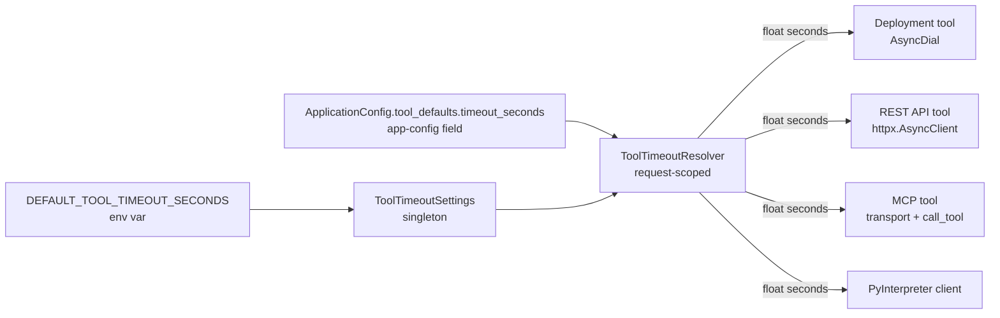
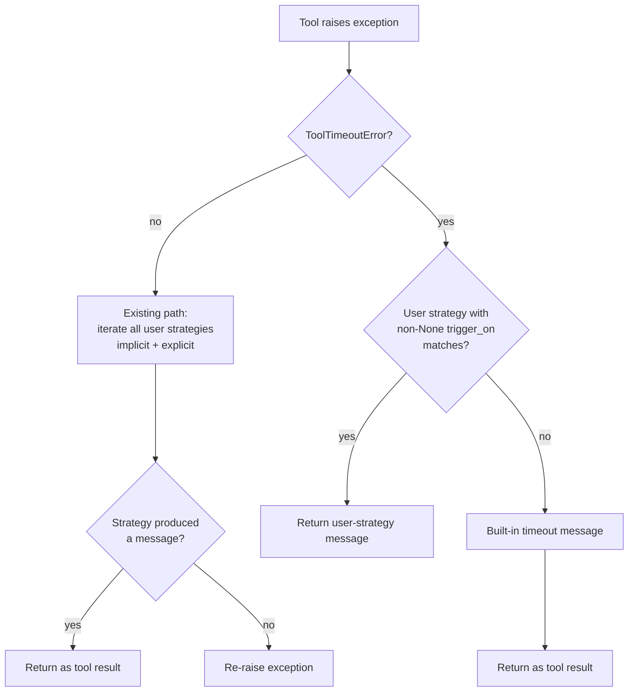

# Design: Configurable Tool Timeouts and Graceful Timeout Handling

- **Status:** Approved
- **Dependencies:**
  - None

## Problem Statement

Quick Apps calls external services as tools — DIAL deployments (`AsyncDial`), REST
APIs, MCP servers, and the Python interpreter. Bucket and file operations also
flow through `AsyncDial`. Three inadequacies today:

1. **Inconsistent, mostly hard-coded timeouts.** Effective budgets differ per call
   site, and only the Python interpreter is configurable (and only via its own env
   var):

   | Call site | Current effective timeout |
   |---|---|
   | `AsyncDial` (deployment tool) | `Timeout(connect=5, read=600, write=600, pool=600)` |
   | `_RestApiTool` (`httpx.AsyncClient()`) | httpx default — 5s all phases |
   | `_MCPConnectionManager.streamablehttp_client` | `timeout=30`, `sse_read_timeout=300` |
   | `_MCPConnectionManager.sse_client` | `timeout=5`, `sse_read_timeout=300` |
   | `ClientSession.call_tool` (MCP) | `read_timeout_seconds=None` — unbounded |
   | `_PyInterpreterClient` | 60s (env `PY_INTERPRETER_CLIENT_TIMEOUT`) |

2. **No app-level override.** App creators can't extend timeouts for apps that need
   longer processing. Issue
   [#216](https://github.com/epam/ai-dial-quickapps-backend/issues/216): a 7.2 MB
   PDF processes directly against DIAL RAG in 9.5 min, but errors out at ~5 min
   through a Quick App 2.0 deployment tool. The cap is in our code (per bug
   reporter), not infra, but the **exact call site** is not yet pinpointed —
   see [Investigation for #216](#0-investigation-tracing-the-5-minute-cap-for-216).
3. **Timeouts look like any other tool error to the LLM.** Every tool defaults to
   `ToolFallbackConfig.strategies = [ContinueStrategyModel()]` with
   `trigger_on=None` — matches all exceptions. A timed-out call today produces a
   generic *"An error occurs, try to call another applicable tool…"* message in the
   tool-result channel. The orchestrator does **not** terminate by default, but the
   LLM has no signal that the root cause was a timeout and cannot rationally decide
   to retry with smaller input, chunk the work, or tell the user.

The two concerns — configurability and timeout-aware signalling — naturally travel
together: the timeout value is what gets reported back in the message, so fixing
only one leaves the feature half-useful.

## Design Goals

- **Unified timeout configuration across all LLM-visible tools.**
  One mechanism replaces the mix of hard-coded defaults and per-component env vars.
- **Env default + app-level override.** Operators set a deployment-wide default; app
  creators override per app. No per-toolset granularity in this pass (see
  [Out of Scope](#out-of-scope)).
- **Typed `ToolTimeoutError`** carrying tool name and timeout value, replacing raw
  library exceptions in the fallback path.
- **Timeout-aware LLM signalling by default.** When a timeout fires, the LLM sees a
  message naming the tool and timeout — not the generic catch-all text. Users can
  override via `fallback_configuration` if they want non-default behaviour.
- **One predictable default for all tool calls.** Env default is **300s** (5 min),
  applied to every tool client. This is a deliberate uniformity choice — devops
  operators get a single number that bounds every tool call, instead of a per-client
  patchwork (5s for REST, 60s for PyInterpreter, 600s for AsyncDial,
  300s for MCP transport). Some clients see a shorter budget than today (notably
  AsyncDial's 600s read budget and PyInterpreter's 60s); this is acknowledged as a
  regression in [Migration](#migration), and operators or app creators raise the
  cap as needed via env or `tool_defaults.timeout_seconds`.

---

## Use Cases

- **UC-1. Operator sets a deployment-wide default.** Setting
  `DEFAULT_TOOL_TIMEOUT_SECONDS=600` makes every tool call (deployment, REST, MCP,
  Python interpreter) use a 600s budget unless overridden by app config.
- **UC-2. App creator extends a long-running app.** Setting
  `tool_defaults.timeout_seconds: 900` on an app gives all its tool calls a 15 min
  budget, so e.g. DIAL RAG on a large PDF completes instead of erroring out.
- **UC-3. Tool times out → agent gets a timeout-specific message.** A tool raises
  `ToolTimeoutError`, `FallbackProcessor` emits the built-in template ("The tool
  call `rag_search` timed out after 300 seconds. Consider retrying with a smaller
  input…") instead of the toolset's generic catch-all text. The LLM can rationally
  retry, chunk, or report — behaviour it couldn't choose from the generic "an
  error occurs, try another tool" message it gets today.
- **UC-4. Explicit trigger overrides default handling.** Configuring a strategy
  with `trigger_on: contains("timed out")` plus `stop` pre-empts the built-in
  branch; the LLM gets the stop strategy's forceful halt instruction in the tool
  result. The orchestrator keeps running (no process termination), but the LLM is
  directed to stop and inform the user.
- **UC-5. Developer adds a new tool type.** Any new tool injects
  `ToolTimeoutResolver` and wraps its body with `translate_timeout` — no new env
  var, no bespoke exception handling.

---

## Proposed Design

### 0. Investigation: tracing the 5-minute cap for #216

The "fixes #216" claim is gated on locating the actual cap — the unified
mechanism below only helps for caps that live in our HTTP clients. Priority
hypotheses:

1. **`AsyncDial`** — library read default is 600s, so not the cap directly, but
   the deployment-tool code path (and the bucket/file operations previously
   routed through a dedicated DIAL Core HTTP client) may wrap the call in an
   outer `asyncio.wait_for` or accumulate retries.
2. **MCP per-call** — if an MCP tool is in the failing flow, transport
   `sse_read_timeout=300s` is exactly 5 minutes.
3. **Upstream (DIAL Core / ingress)** — the user reports this is not the source,
   but cross-checked during repro.

Repro captures: exception class + traceback, elapsed time from `PerformanceTimer`,
the `httpx.AsyncClient` construction site, payload sizes, determinism (repeat
≥2×). If the cap turns out to be outside any of the call sites the design covers,
a follow-up design pass is needed before shipping #216.

### 1. `ToolTimeoutSettings` — env default

A `BaseSettings` singleton in `common/tool_timeout_settings.py` exposing
`DEFAULT_TOOL_TIMEOUT_SECONDS` as a `float` (always set, never `None`) with
`Field(gt=0, le=3600)` validation and **default `300.0`**, following the existing
`AgentSettings` / `FeatureSettings` pattern.

The numeric default makes the resolved value always a `float` — every tool
always passes an explicit timeout to its underlying client; library defaults
never apply at runtime. This gives devops a single, visible number for every
tool call (see [Design Goals](#design-goals)) at the cost of shortening some
clients' current budgets — see [Migration](#migration).

### 2. `tool_defaults` — app-config container

A new `ToolDefaults(BaseModel)` with `timeout_seconds: float | None` as its first
field, exposed on `ApplicationConfig` as
`tool_defaults: ToolDefaults = Field(default_factory=ToolDefaults)`. Peer to
`orchestrator` / `tool_sets` / `features`.

```yaml
# ApplicationConfig shape (abbreviated)
orchestrator: {...}
tool_sets: [...]
tool_defaults:
  timeout_seconds: 900        # float | None; gt=0, le=3600
features: {...}
```

**Why a container, not a bare `tool_timeout_seconds` field.** Breaking schema changes
to `ApplicationConfig` require every persisted app config to migrate — expensive. A
container reserves room for future tool-wide defaults (retries, concurrency caps,
header forwarding policies, ...) to land as sibling fields without a breaking change.
The one-field cost today is one extra level of YAML indentation.

**Defaulting.** `default_factory=ToolDefaults` materialises the container when it is
omitted from YAML, so `app_config.tool_defaults.timeout_seconds` is always safely
accessible (no `None`-check on the container itself).

No per-toolset granularity in this pass — see [Out of Scope](#out-of-scope).

### 3. `ToolTimeoutResolver` — DI-provided effective timeout

A request-scoped `ToolTimeoutResolver` in `common/tool_timeout_resolver.py`
(`@provider` in `AppModule`) merges the two sources and exposes
`resolve() -> float`. Resolution: return
`app_config.tool_defaults.timeout_seconds` when non-None, otherwise
`settings.default_tool_timeout_seconds` (which is always a `float` per
[`ToolTimeoutSettings`](#1-tooltimeoutsettings--env-default)). The return is
always a number — call sites never need a `None`-fallback branch.

Injecting the resolver (rather than exposing a raw `TOOL_TIMEOUT_SECONDS` typedef)
keeps a single DI pattern across call sites.

**Scopes.** `ToolTimeoutSettings` singleton; `ApplicationConfig` request-scoped
(from `_RequestContext`); `ToolTimeoutResolver` request-scoped.



### 4. Plumbing the timeout into each tool type

All call sites consume `T = ToolTimeoutResolver.resolve()` — always a `float`,
never `None` — and pass it explicitly to their underlying client. No
"library-default fallback" branch is needed anywhere. Per-client specifics:

- **Deployment (`AsyncDial`)** — `AppModule.__provide_async_dial` passes
  `timeout=openai.Timeout(connect=5, read=T, write=T, pool=T)`. `connect` is held
  at 5s to preserve fast-fail on dead deployments; the other phases track `T`.
  `http_client=` is not used — it would replace the whole transport and bypass
  internal openai-client config.
  *Streaming caveat:* DIAL deployments stream, so `read=T` means "T seconds of
  silence between SSE events," not wall-clock. Treat `tool_defaults.timeout_seconds`
  as an **idle budget** for streaming deployment calls.
- **REST API (`_RestApiTool._run_in_stage_async`)** — construct
  `httpx.AsyncClient(timeout=T)`. Body wrapped in `translate_timeout`.
- **Python interpreter (`InternalToolModule._provide_py_interpreter_client`)** —
  pass the resolved value to `_PyInterpreterClient(timeout=T)`. Remove
  `_PyInterpreterSettings.client_timeout` and the `PY_INTERPRETER_CLIENT_TIMEOUT`
  env var (see [Migration](#migration)).
- **Ad-hoc `AsyncDial` construction sites** —
  `ToolConfigCoreService._resolve_dial_client` (controller path, uses an
  explicit header-supplied `api_key`) and
  `InputFileHandler.get_attachment_url` (PyInterpreter's local-dev bridge,
  talks to a distinct dev DIAL Core base URL) both build `AsyncDial` inline
  rather than consuming the DI-provided client. Each one repeats the same
  `timeout=openai.Timeout(connect=5, read=T, write=T, pool=T)` shape as
  `__provide_async_dial`, so the resolved budget applies uniformly even on
  the bypass paths.

#### MCP tool — three tiers

MCP is the delicate case because it has three distinct wall-clock budgets. Getting
the mapping right matters: capping the wrong one either leaves tool calls
effectively unbounded or turns dead servers into multi-minute hangs.

| Tier | Controlled by | Library default | What it bounds | Bound by `T`? |
|---|---|---|---|---|
| Connection setup | `streamablehttp_client(timeout=...)` / `sse_client(timeout=...)` | 30s / 5s | Opening the HTTP/SSE session | **No** — leave at library default |
| Transport read | `{streamablehttp,sse}_client(sse_read_timeout=...)` | 300s | Idle-read on the event stream | Yes |
| Per-tool-call | `ClientSession.call_tool(..., read_timeout_seconds=...)` | `None` (unbounded) | Individual tool invocation | Yes — authoritative |

Leaving the connection-setup tier at its library default is deliberate: binding it to
a long `T` (e.g. 900s) would turn a misbehaving MCP server into a 15-minute hang on
every request.

**Centralisation.** `translate_timeout` wraps the full `_MCPTool._run_in_stage_async`
body — one place, not per inner call site. This is load-bearing because
`_MCPConnectionManager` runs under anyio task groups, which can raise
`BaseExceptionGroup`. `BaseExceptionGroup` is **not** a subclass of `Exception`, so
without the wrap such groups would escape `StagedBaseTool.arun()`'s `except Exception`
and bypass fallback handling. The MCP SDK also accepts both `float` and
`datetime.timedelta` for transport kwargs; `ClientSession.call_tool` requires
`timedelta`. For consistency the implementation passes `timedelta` everywhere.

### 5. `ToolTimeoutError` — typed exception

New exception in `common/exceptions.py` with `tool_name: str` and
`timeout_seconds: float` attributes. The resolved timeout is always a number (see
[`ToolTimeoutSettings`](#1-tooltimeoutsettings--env-default)), so there's no `None`
case to handle. `__str__` always contains the stable phrase `"timed out"` so
`TriggerOn(type=contains, value="timed out")` can match on message content.

### 6. Per-tool timeout → `ToolTimeoutError` translation

| Tool type | Library exception(s) mapped to `ToolTimeoutError` | Wrap point |
|---|---|---|
| Deployment | `openai.APITimeoutError`, `httpx.TimeoutException` | `DialCompletionService.complete_request_async` body |
| REST API | `httpx.TimeoutException` | `_RestApiTool._run_in_stage_async` body |
| MCP | `httpx.TimeoutException`, `asyncio.TimeoutError` (possibly inside `BaseExceptionGroup`), `mcp.McpError` with timeout code | `_MCPTool._run_in_stage_async` body — centralised here so stray `BaseExceptionGroup`s can't bypass `StagedBaseTool.arun()`'s `except Exception` |
| Python interpreter | Existing `_PyInterpreterTimeOutError` | No wrap needed — `_PyInterpreterTimeOutError` is changed to **extend** `ToolTimeoutError` (not replace), preserving existing `isinstance` callers |

A shared `translate_timeout(tool_name, timeout_seconds)` async context manager in
`common/tool_timeout_utils.py` performs the catch-and-raise, chaining the original
cause (`from e`) so tracebacks keep the underlying library exception visible. Two
subtleties worth naming because they're easy to get wrong:

- **`mcp.McpError` needs predicate matching**, not a tuple entry. Adding it to an
  `isinstance` tuple alongside `httpx.TimeoutException` et al. would misclassify
  every non-timeout MCP error as a timeout. The helper catches `McpError`
  separately and re-raises only when `e.error.code` matches the MCP timeout code
  (exact constant pinned during implementation).
- **`BaseExceptionGroup`** (from anyio) is handled via
  `eg.split(is_timeout_predicate)`: any timeout leaf at any nesting depth
  classifies the whole group as a timeout; non-timeout leaves are intentionally
  collapsed into the re-raised `from eg` chain.

### 7. Default graceful fallback for `ToolTimeoutError`

`ToolFallbackConfig.strategies` defaults to `[ContinueStrategyModel()]` with
`trigger_on=None` — a catch-all that matches every exception. A naive "user strategies
first, built-in fallback if none matched" layering would therefore never fire the
built-in branch. Instead, `FallbackProcessor.process_fallback` is modified to
special-case `ToolTimeoutError`:

1. Iterate user strategies with **non-None `trigger_on`** that match the error —
   this is the explicit opt-in path (e.g. `trigger_on: contains("timed out")` paired
   with `stop`). First match wins.
2. If none match, return the **built-in timeout message** (see template below).
   Never re-raise for timeouts.
3. **Implicit catch-all strategies (`trigger_on=None`) are skipped for
   `ToolTimeoutError`.** This is the key semantic shift — the implicit default is
   now reserved for "errors that aren't otherwise specifically handled," and
   timeouts are specifically handled by step 2.

For non-timeout errors, behaviour is unchanged: strategies iterate as today, implicit
and explicit, unmatched errors re-raise.

Message template (tunable in implementation review):

> *The tool call `{tool_name}` timed out after {timeout_seconds} seconds. Consider
> retrying with a smaller or different input, breaking the request into smaller
> pieces, or informing the user that the operation is taking longer than expected.*

Rendered by a small `_format_timeout_message(e: ToolTimeoutError)` helper in
`processor.py`.



#### Guardrail: `ContinueStrategyModel` validator

`ContinueStrategyModel(trigger_on=contains("timed out"))` without `instructions` is a
footgun: `ContinueStrategyHandler.handle` returns its generic *"An error occurs, try
another tool…"* text, silently replacing the built-in timeout message with a
less-useful generic one. A Pydantic `model_validator(mode="after")` is added to
`ContinueStrategyModel` that rejects `trigger_on is not None and instructions is None`
at config-load time, mirroring the existing constraint on `RetryStrategyModel`.
Authors who *really* want the generic text with a trigger must spell out
`instructions` explicitly — making intent visible.

### 8. Stage UI display and `display_error_in_stage` interaction

`StagedBaseTool.arun()` already calls `stage_wrapper.add_exception(e)` before handing
to `FallbackProcessor`. Two sub-cases:

- **`display_error_in_stage=True` (default):** `ToolTimeoutError.__str__` is
  user-friendly (`"Tool call 'x' timed out after 300 seconds."`), so the stage UI
  automatically shows the clear timeout label.
- **`display_error_in_stage=False`:** today, `StagedBaseTool.arun()` substitutes a
  generic `Exception("An error occurred while executing the tool.")` for the stage
  display to avoid leaking internal error details. Timeout messages contain nothing
  sensitive (tool name is already visible elsewhere in the stage; timeout value is
  operational, not user data), so the design **exempts `ToolTimeoutError`** from this
  masking and shows the timeout message directly. This preserves useful signal for
  operators debugging slow apps. App creators who want timeouts masked too can still
  configure an explicit `stop` or `continue` strategy with a fixed `instructions`
  string.

---

## Secondary Fixes

### `_RestApiTool` forwarded-header path does not currently time out on upload

The REST API tool currently forwards file references (via `file:` prefix resolution) as
JSON — not as multipart uploads. So large-file payload timeouts are not a direct risk
here. Noted for awareness; no code change.

### Legacy `PY_INTERPRETER_CLIENT_TIMEOUT` env var

Kept for one release as a deprecation-compatible fallback: if set, it wins over
`DEFAULT_TOOL_TIMEOUT_SECONDS` for the Python interpreter client only, and a startup
warning directs operators to migrate.

---

## Out of Scope

- **Per-toolset / per-tool overrides.** A single app-level knob is sufficient for
  #216. If future apps need mixed timeouts, add `ToolSet.timeout_seconds` (or a
  sibling field under `tool_defaults` for category-level defaults) layered on top.
- **Retry-on-timeout as a built-in strategy.** The built-in fallback is `continue`
  semantics; adding a `retry` with backoff risks multiplying wall-clock time on
  already-slow calls and requires idempotence. Users who want it can configure a
  `retry` strategy in `fallback_configuration` today.
- **Interactive login timeout unification.** `interactive_login_timeout_seconds`
  is a wall-clock wait for user action, not a tool call; unifying it would conflate
  unrelated concerns.
- **Per-phase httpx timeouts** (connect/read/write/pool). The design passes a
  single `T` everywhere (with phase tuning only for AsyncDial to preserve its 5s
  connect). Fine-grained config can be added later if needed.

---

## Configuration / Usage Examples

**Environment default** — `DEFAULT_TOOL_TIMEOUT_SECONDS=600`.

**App-config override** (peer to `orchestrator`, `tool_sets`):

```yaml
tool_defaults:
  timeout_seconds: 900      # 15 min — this app processes very large PDFs
```

**Default LLM-facing timeout message** (no config needed):

> *The tool call `rag_search` timed out after 300 seconds. Consider retrying with a
> smaller or different input, breaking the request into smaller pieces, or informing
> the user that the operation is taking longer than expected.*

**Overriding with a user-configured stop strategy:**

```yaml
fallback_configuration:
  strategies:
    - type: stop
      trigger_on: {type: contains, value: "timed out"}
```

With this config the LLM receives the stop-strategy's forceful instruction on
timeout, directing it to halt and inform the user. Orchestration itself continues
(stop is not a process-level termination).

### Resolution summary

| `DEFAULT_TOOL_TIMEOUT_SECONDS` | `tool_defaults.timeout_seconds` | Resolved | Effect |
|---|---|---|---|
| unset | unset | 300.0 | Built-in env default — all clients capped at 5 min (MCP caveat below) |
| 600 | unset | 600.0 | All clients capped at 600s (MCP caveat below) |
| unset | 900 | 900.0 | All clients for this app capped at 900s (MCP caveat below) |
| 600 | 900 | 900.0 | App override wins |

**MCP caveat.** Resolved `T` applies to `ClientSession.call_tool(read_timeout_seconds=T)`
(authoritative per-call budget) and `sse_read_timeout`. It does **not** bind the
connection-setup tier (`streamablehttp_client.timeout`, `sse_client.timeout`) — those
stay at library defaults (30s / 5s) so dead servers still fast-fail. See
[MCP tool — three tiers](#mcp-tool--three-tiers).

**Cumulative wall-clock.** Total request time is bounded by
`max_iterations × timeout_seconds`. A 900s timeout with the default
`max_iterations=15` allows up to 225 min worst-case; operators setting large
timeouts should lower `max_iterations` accordingly. `interactive_login_timeout_seconds`
(default 120s) is a separate wall clock that can additionally compound when login is
required.

---

## Migration

### Breaking changes

- **All tool clients now use a uniform 300s default.** Effective budgets change
  per client:

  | Client | Before | After (env unset) | Direction |
  |---|---|---|---|
  | `AsyncDial` (deployment) | 600s read | 300s read | Shortened (regression risk for long RAG flows) |
  | `_PyInterpreterClient` | 60s | 300s | Lengthened |
  | `_RestApiTool` (httpx) | 5s | 300s | Lengthened |
  | MCP transport `sse_read_timeout` | 300s | 300s | Unchanged |
  | MCP `call_tool` | unbounded | 300s | Bounded |
  | MCP connection setup | 30s / 5s | 30s / 5s | Unchanged (deliberate, see [MCP tool — three tiers](#mcp-tool--three-tiers)) |

  The shortening for `AsyncDial` is the notable regression: any app currently
  relying on the 600s read budget needs to set
  `DEFAULT_TOOL_TIMEOUT_SECONDS=600` (or higher) at the env level, or
  `tool_defaults.timeout_seconds: 600` per-app. The lengthenings for
  REST/PyInterpreter are improvements (5s and 60s were
  dangerously short for many real workloads), but operators should be aware
  that slow upstreams now occupy the agent loop longer.
- **LLM sees a timeout-specific message instead of the generic catch-all text.**
  Today a timed-out call produces *"An error occurs, try to call another applicable
  tool…"* via the implicit `ContinueStrategyModel()` catch-all; after this change,
  it produces *"The tool call 'X' timed out after Ys…"*. Intended improvement, but
  behaviour changes for any app whose prompts were tuned around the generic
  message.
- **Catch-all strategies (`trigger_on=None`) no longer apply to
  `ToolTimeoutError`.** The implicit default and any user-defined catch-all is
  skipped for timeouts; the built-in message fires instead. This is **silent in
  practice** — a team with
  `ContinueStrategyModel(instructions="When rag_search fails, suggest uploading a
  smaller file")` and `trigger_on=None` will see their customisation bypassed, and
  the built-in text is plausible enough to miss on casual review. Mitigation:
  startup scan logs an INFO line per customised catch-all (see Summary of
  Changes). Migration path: duplicate the strategy, add `trigger_on: contains
  ("timed out")` to the copy, and place it before the catch-all.
- **`ContinueStrategyModel(trigger_on=...)` now requires `instructions`.** Pydantic
  validator rejects `trigger_on is not None and instructions is None` at config
  load. Rationale: bare-trigger form silently returns the generic fallback text —
  almost always unintended. Mirrors the existing `RetryStrategyModel` constraint.

### Non-breaking changes

- **`tool_defaults`** is optional with `default_factory=ToolDefaults`, so existing
  configs pass through.
- **`PY_INTERPRETER_CLIENT_TIMEOUT`** kept for one release as a deprecation shim.
  When set, it continues to apply to the Python interpreter client only and wins
  over `DEFAULT_TOOL_TIMEOUT_SECONDS`; a startup warning directs operators to
  migrate. Removed in the next release.
- **`_PyInterpreterTimeOutError`** is kept but now extends `ToolTimeoutError`, so
  existing `isinstance` checks keep working.

## Summary of Changes

### New files (`common/`)

- `tool_timeout_settings.py` — `ToolTimeoutSettings` (env default, `float`,
  default 300.0)
- `tool_timeout_resolver.py` — `ToolTimeoutResolver` (env + app-config merge)
- `tool_timeout_utils.py` — `translate_timeout` async context manager

### Added

- `common/exceptions.py` — `ToolTimeoutError(tool_name: str, timeout_seconds: float)`
- `config/application.py` — `ToolDefaults` model + `ApplicationConfig.tool_defaults`
- `application/app_module.py` — `@provider`s for settings and resolver
- `common/tool_fallback/processor.py` — `_format_timeout_message` helper
- `app_factory.py` (or toolset initializer) — startup scan that logs an INFO line
  for customised `ContinueStrategyModel(trigger_on=None, instructions=...)` in any
  toolset (detection aid for the catch-all breaking change in
  [Migration](#migration))

### Modified

- `application/app_module.__provide_async_dial` — apply resolved timeout as
  `openai.Timeout(connect=5, read=T, write=T, pool=T)`
- `rest_api_tooling/_rest_api_tool._run_in_stage_async` — pass `timeout=T` to
  `httpx.AsyncClient(...)`; wrap body in `translate_timeout`
- `mcp_tooling/_mcp_connection_manager.__session_context` — pass
  `sse_read_timeout=timedelta(seconds=T)` only; leave connection `timeout` at
  library default
- `mcp_tooling/_mcp_connection_manager.call_mcp_tool` — pass
  `read_timeout_seconds=timedelta(seconds=T)` to `ClientSession.call_tool`
- `mcp_tooling/_mcp_tool._run_in_stage_async` — wrap body in `translate_timeout`
- `internal_tooling/internal_tooling_module._provide_py_interpreter_client` —
  pass resolved value to `_PyInterpreterClient(timeout=T)`. Legacy
  `client_timeout` honoured for one release if set
- `internal_tooling/.../_py_interpreter_client.py` — `_PyInterpreterTimeOutError`
  extends `ToolTimeoutError`; startup log when the legacy env var is set
- `common/tool_fallback/processor.FallbackProcessor.process_fallback` —
  `ToolTimeoutError` branch per
  [Default graceful fallback for `ToolTimeoutError`](#7-default-graceful-fallback-for-tooltimeouterror)
- `config/tools/tool_fallback.ContinueStrategyModel` — validator rejecting
  `trigger_on is not None and instructions is None`
- `dial_core_services/tool_config_service.ToolConfigCoreService._resolve_dial_client`
  and `internal_tooling/py_interpreter_tooling/handlers/input_file_handler.InputFileHandler.get_attachment_url`
  — apply resolved timeout to the inline-constructed `AsyncDial` instances that
  bypass the `__provide_async_dial` DI provider
- `common/staged_base_tool.StagedBaseTool.arun` — exempt `ToolTimeoutError` from
  `display_error_in_stage=False` masking
- `docs/agent.md` — tool system section
- `CLAUDE.md` — note on timeout resolution and graceful fallback
- `Makefile` — regenerate `dump_app_schema` to include `tool_defaults`

---

## Test Plan

**Unit — `translate_timeout`.** All listed library timeouts
(`httpx.TimeoutException`, `asyncio.TimeoutError`, `openai.APITimeoutError`,
`mcp.McpError`-with-timeout-code) plus `BaseExceptionGroup` containing a timeout
leaf map to `ToolTimeoutError` with correct `tool_name`/`timeout_seconds`.
Non-timeout exceptions pass through unchanged. Mixed exception group (timeout +
non-timeout leaves) classifies as timeout; all-non-timeout group passes through.

**Unit — `ToolTimeoutResolver`.** All four (env, app) combinations resolve
correctly: env unset + app unset → 300.0 (built-in default); env set + app
unset → env value; app set → app value (overrides env). Invalid app values
(0, negative, >3600) fail Pydantic validation;
`tool_defaults.timeout_seconds=None` falls through via explicit `is not None`;
`tool_defaults` omitted from YAML materialises via `default_factory`.

**Integration — `FallbackProcessor`.** Default `ToolFallbackConfig` +
`ToolTimeoutError` → built-in message; default + non-timeout → existing catch-all
text. User catch-all (`trigger_on=None`) + timeout → built-in wins (locks in the
catch-all breaking change in [Migration](#migration)); user catch-all + non-timeout
→ custom text. Explicit `trigger_on=contains("timed out")` + `instructions`
pre-empts built-in (continue and stop strategies). Bare
`ContinueStrategyModel(trigger_on=contains(...))` without `instructions` →
Pydantic error at config load.

**E2E — #216 repro.** Reproduce failure on `development`; with
`tool_defaults.timeout_seconds=900` the call succeeds (assuming
[Investigation for #216](#0-investigation-tracing-the-5-minute-cap-for-216)
confirms our HTTP clients are the cap). LLM-facing tool result names the tool and
timeout value.

**Stage UI.** `ToolTimeoutError.__str__` is displayed under
`display_error_in_stage=True` and `=False` (timeouts are intentionally exempt
from masking).
