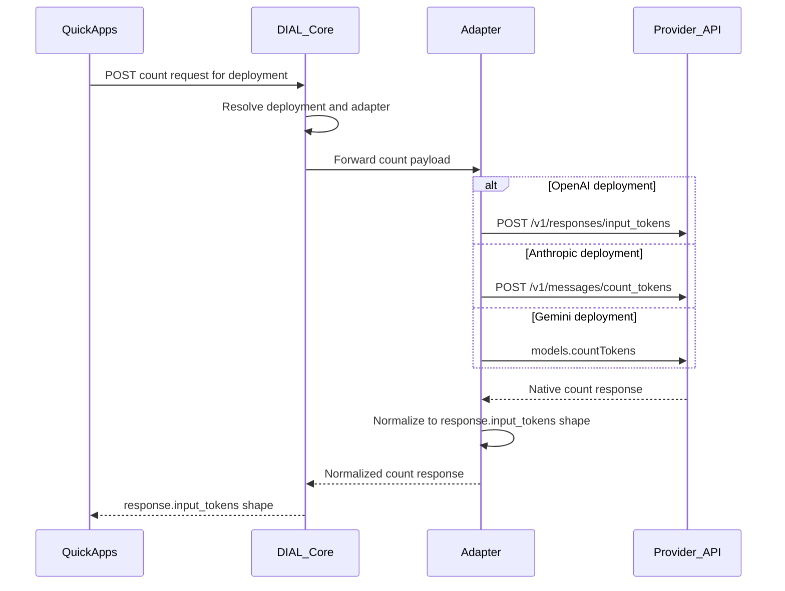

# Design: Context window usage — token-count measurement and UI transfer

- **Status:** Draft
- **Dependencies:**
  - [History compaction — UI and QuickApp backend communication](history_compaction_ui_backend.md) — `custom_content.state` round-trip contract; compaction itself is a separate follow-up.
- **Related:** [Large Tool Response Processing](large_tool_responses.md) — byte-based offload threshold is not model-aware today.

## Problem Statement

Long QuickApp sessions accumulate user, assistant, and tool messages plus system prompts and tool schemas. The orchestrator model has a finite context window, but users receive no indication of how much of that window is consumed until upstream returns a context-length error ([`_exception_message_resolver.py`](../../src/quickapp/core/application/_exception_message_resolver.py)).

Observable symptoms today:

1. **No context meter** — QuickApps does not compute or expose fill percentage to the UI.
1. **No provider-native preflight count** — legacy DIAL `/tokenize` is not equivalent to the provider count APIs that understand tools, images, PDFs, and other multimodal inputs.
1. **No denominator** — `model.get()` is used for pricing only ([`_pricing_service.py`](../../src/quickapp/usage_statistics/_pricing_service.py)); `ModelLimits` (`max_total_tokens`, `max_prompt_tokens`) is ignored.
1. **Provider-specific count APIs** — OpenAI, Anthropic, and Gemini expose different token-count endpoints and response shapes.
1. **Tokenize gap with attachments** — Today `aidial-adapter-openai` implements `/tokenize` with **tiktoken (text only)**. It does not count images, PDFs, tools, or other `custom_content.attachments` the way provider APIs do.

A future **history compaction** feature needs a reliable input-token count for when to compact. This design defines **measurement**, **UI transfer**, and a **compaction hook** — not compaction logic. Post-completion usage and billing information are intentionally out of scope for this feature.

## Design Goals

- **G1 — Dual consumer:** One `context_usage` snapshot serves UI notification and a future compaction policy (`compaction_recommended`).
- **G2 — Per-app feature gate:** Opt in via `features.context_usage.enabled` on the app manifest (default off).
- **G3 — Count-only measurement:** Use a DIAL token-count endpoint before the LLM call. Do not depend on completion stream `usage`, billing stats, or `SHOW_USAGE_STATISTICS`.
- **G4 — Provider-native count contract:** DIAL Core routes one count request shape to the correct adapter; adapters call provider-native count APIs and normalize responses.
- **G5 — UI-ready contract:** Structured `custom_content.state.context_usage` — not a markdown stage.
- **G6 — Honest cross-model semantics:** Count the exact logical input that the model receives: messages, system/instructions, tools, multimodal parts, and files when supported by the provider.
- **G7 — Compaction out of scope:** Set `compaction_recommended` only; no compaction algorithm in this design.

---

## Use Cases

### UC-1: UI shows context fill for an orchestrator call

**Trigger:** QuickApps is about to call the orchestrator deployment for an app with `features.context_usage.enabled: true`.

**Behavior:** QuickApps resolves `limit_tokens` from `model.get(deployment.model).limits`, sends the exact orchestrator input payload to the DIAL count endpoint, and writes `context_usage` to the final assistant message `custom_content.state`.

**Outcome:** UI displays e.g. “68% context used” from `percent`.

### UC-2: Multiple orchestrator iterations

**Trigger:** One user turn produces several LLM/tool iterations.

**Behavior:** QuickApps counts each orchestrator LLM input payload before sending it and keeps the latest count snapshot.

**Outcome:** The final assistant message contains the context fill for the last orchestrator LLM call in the turn. Counts are not summed across iterations.

### UC-3: Attachments and multimodal payloads

**Trigger:** The orchestrator input contains images, PDFs, DIAL file URLs, `custom_content.attachments`, or tool schemas.

**Behavior:** QuickApps uses the DIAL count endpoint only if the deployment advertises provider-native count support for the same modalities as completions. It must not fall back to text-only tiktoken.

**Outcome:** Attachment-heavy sessions receive a provider-aligned input count, or the snapshot records that counting was unavailable rather than showing a false low estimate.

### UC-4: Compaction hook (no compaction yet)

**Trigger:** Counted fill ≥ 80%.

**Behavior:** `compaction_recommended: true` on snapshot. Future compaction reads this flag per [history compaction design](history_compaction_ui_backend.md).

**Outcome:** No compaction runs today; flag is available for the next feature.

### UC-5: State survives reload

**Trigger:** User refreshes; UI resends assistant messages with `custom_content.state` intact (Track T1.1–T1.3 in history compaction doc).

**Behavior:** Backend overwrites `context_usage` on the next turn with a fresh measurement.

**Outcome:** Last known fill visible after reload until the next response.

---

## Proposed Design

### Concern 1: Feature configuration

- **What:** `ContextUsageConfig` with `enabled: bool = False`, nested under `Features` in [`application.py`](../../src/quickapp/config/application.py).

```json
{
  "features": {
    "context_usage": {
      "enabled": true
    }
  }
}
```

- **Owner:** Config layer; read per request from `ApplicationConfig`.
- **Semantics:** When `enabled` is false or omitted, no token-count calls and no `context_usage` state write.
- **Change:** New config model + schema dump (`make dump_app_schema`).

---

### Concern 2: Model limit resolution

- **What:** `ModelLimitsService` (or extension of the pricing registry pattern) resolves `limit_tokens` once per chat completion from `AsyncDial.model.get(deployment.model)`.
- **Owner:** `dial_core_services` or dedicated small module injected into orchestrator path.
- **Semantics:**

| `ModelLimits` fields | `limit_tokens` for % |
|----------------------|----------------------|
| `max_prompt_tokens` set | Use `max_prompt_tokens` |
| Only `max_total_tokens` | Use `max_total_tokens` (UI label: total context) |
| `max_prompt_tokens` + `max_completion_tokens` | Use `max_prompt_tokens` for fill % |
| Missing or `model.get` fails | `limit_tokens: null` — show token count only, hide % |

- **Change:** `OrchestratorCapabilities` extended with `model_id`, `limit_tokens`, and `token_count_supported`. Fix model key: use `Deployment.model`, not `deployment_id`, for `model.get()`.

---

### Concern 3: DIAL token-count API

QuickApps should depend on one DIAL contract instead of direct OpenAI, Anthropic, or Gemini count APIs.



**Responsibilities:**

- **DIAL Core** — Accept the request, resolve deployment → adapter, return the normalized response or standard DIAL error envelope.
- **Adapter** — Translate DIAL request → provider count API payload; map provider response → OpenAI-shaped output.
- **QuickApps** — Sends one request shape; reads one response shape. No provider-specific count logic.

#### Endpoint options

Exact path is for the DIAL Core team to decide.

| Option | Path | Notes |
|--------|------|-------|
| OpenAI-aligned | `POST /openai/deployments/{deployment_id}/responses/input_tokens` | Mirrors OpenAI URL shape. |
| Provider-neutral | `POST /deployments/{deployment_id}/count_tokens` | Shorter; same response body. |

**Request body:** Payload that adapters can forward to provider count APIs. Ideally aligned with OpenAI Responses API input (`model`, `input`, `instructions`, `tools`, multimodal parts). DIAL Core may alternatively accept Chat Completions-shaped requests and let each adapter translate.

**Response body:** Normalized `response.input_tokens` object.

**Errors:** Standard DIAL error envelope; adapters map provider 4xx/5xx.

---

### Concern 4: Target response contract

All adapters normalize to this shape. It mirrors OpenAI `response.input_tokens`.

#### Required fields

```json
{
  "object": "response.input_tokens",
  "input_tokens": 328
}
```

| Field | Type | Description |
|-------|------|-------------|
| `object` | string | Always `"response.input_tokens"`. |
| `input_tokens` | integer | Normalized input token count for the full logical request: messages, system/instructions, tools, and multimodal parts. |

The count endpoint is **input-only**. Do not add `output_tokens`; provider count APIs do not return output counts.

#### Optional extensions

```json
{
  "object": "response.input_tokens",
  "input_tokens": 328,
  "input_tokens_details": {
    "cached_tokens": 0
  },
  "provider_details": {}
}
```

| Field | When to populate |
|-------|------------------|
| `input_tokens_details.cached_tokens` | Only if the provider count API returns a cache breakdown pre-send. Usually omitted or `0`. |
| `provider_details` | Provider-specific count fields with no OpenAI mapping. Empty or omitted for v1. |

---

### Concern 5: Provider API reference

#### OpenAI

| Resource | URL |
|----------|-----|
| Token counting guide | https://developers.openai.com/api/docs/guides/token-counting |
| Count input tokens | `POST https://api.openai.com/v1/responses/input_tokens` |
| Count input tokens API reference | https://developers.openai.com/api/reference/resources/responses/input_tokens |
| Migrate to Responses API | https://platform.openai.com/docs/guides/migrate-to-responses |

Count response:

```json
{
  "object": "response.input_tokens",
  "input_tokens": 328
}
```

The count endpoint accepts the same input format as `responses.create` (text, messages, images, files, tools, instructions) and returns the input token count the model will receive.

#### Anthropic

| Resource | URL |
|----------|-----|
| Messages API reference | https://docs.anthropic.com/en/api/messages |
| Count tokens endpoint | `POST https://api.anthropic.com/v1/messages/count_tokens` |
| Count tokens section | https://docs.anthropic.com/en/api/messages#count-tokens |

Count response:

```json
{ "input_tokens": 2095 }
```

#### Google Gemini

| Resource | URL |
|----------|-----|
| Understand and count tokens | https://ai.google.dev/gemini-api/docs/tokens |
| CountTokens API (`models.countTokens`) | https://ai.google.dev/api/tokens#method:-models.counttokens |

Count response:

```json
{ "totalTokenCount": 328 }
```

SDKs may expose `total_tokens` or `totalTokenCount` depending on language.

---

### Concern 6: Count mapping tables

Tables use columns:

- **DIAL / OpenAI target** — field in the normalized DIAL response
- **Provider source** — field from the provider API
- **Rule** — how the adapter maps it
- **Excessive in provider** — provider has it; OpenAI has no equivalent
- **Missing in provider** — OpenAI has it; provider does not

#### OpenAI adapter — pass-through

Provider API: `POST /v1/responses/input_tokens`

| DIAL / OpenAI target | Provider source | Rule | Excessive in provider | Missing in provider |
|----------------------|-----------------|------|-----------------------|---------------------|
| `object` | `object` | Pass through (`"response.input_tokens"`) | — | — |
| `input_tokens` | `input_tokens` | Pass through | — | — |

No conversion needed. This adapter is the reference implementation.

**Note on legacy `/tokenize`:** Today `aidial-adapter-openai` uses tiktoken (text-only). The consolidated endpoint should call `/v1/responses/input_tokens` for parity with OpenAI multimodal and tool-aware counting.

#### Anthropic adapter

Provider API: `POST /v1/messages/count_tokens`

| DIAL / OpenAI target | Provider source | Rule | Excessive in provider | Missing in provider |
|----------------------|-----------------|------|-----------------------|---------------------|
| `object` | — | Set `"response.input_tokens"` | — | `object` discriminator |
| `input_tokens` | `input_tokens` | Direct map | — | — |
| `input_tokens_details.cached_tokens` | — | Omit or `0` pre-send | — | No cache breakdown in count API |
| `provider_details` | — | Empty for count | — | — |

#### Gemini adapter

Provider API: `count_tokens` / `CountTokens`

| DIAL / OpenAI target | Provider source | Rule | Excessive in provider | Missing in provider |
|----------------------|-----------------|------|-----------------------|---------------------|
| `object` | — | Set `"response.input_tokens"` | — | `object` discriminator |
| `input_tokens` | `totalTokenCount` / `total_tokens` | Rename to `input_tokens` | `*_token_count` naming suffix | — |
| `input_tokens_details.cached_tokens` | — | Omit pre-send | — | Structured `input_tokens_details` |
| `provider_details` | — | Empty for count | — | — |

#### Cross-provider summary

| | OpenAI | Anthropic | Gemini |
|---|--------|-----------|--------|
| **Count API** | `input_tokens` | `count_tokens` | `count_tokens` |
| **Count HTTP** | `POST /v1/responses/input_tokens` | `POST /v1/messages/count_tokens` | `models.countTokens` |
| **Count response field** | `input_tokens` | `input_tokens` | `totalTokenCount` / `total_tokens` |
| **Response object type** | `response.input_tokens` | none | none |
| **Cache in count response** | No | No | No |

---

### Concern 7: Count normalization rules

1. **Always emit `object: "response.input_tokens"`** — Anthropic and Gemini count APIs have no object discriminator.
2. **OpenAI:** pass through unchanged.
3. **Anthropic count:** `input_tokens` → `input_tokens` (direct).
4. **Gemini count:** `totalTokenCount` / `total_tokens` → `input_tokens` (rename only).
5. **Do not add `output_tokens`** to the count response — all three providers' count APIs are input-only.

Pseudocode:

```python
def to_response_input_tokens_openai(provider: dict) -> dict:
    return {
        "object": provider["object"],
        "input_tokens": provider["input_tokens"],
    }


def to_response_input_tokens_anthropic(provider: dict) -> dict:
    return {
        "object": "response.input_tokens",
        "input_tokens": provider["input_tokens"],
    }


def to_response_input_tokens_gemini(provider: dict) -> dict:
    count = provider.get("totalTokenCount") or provider.get("total_tokens")
    return {
        "object": "response.input_tokens",
        "input_tokens": count,
    }
```

---

### Concern 8: QuickApps measurement flow

- **What:** Fixed constants in code (not per-app config):

| Constant | Value | Purpose |
|----------|-------|---------|
| `COMPACTION_THRESHOLD_PERCENT` | 80 | Set `compaction_recommended` (hook only) |

- **Owner:** `ContextUsageService`.
- **Semantics:**
  1. Before each orchestrator LLM call, build the exact logical input payload for that call.
  2. Send the payload to the DIAL count endpoint for the deployment.
  3. Set `context_fill_tokens = input_tokens`.
  4. Set `percent = context_fill_tokens / limit_tokens * 100` when `limit_tokens` is known.
  5. Set `compaction_recommended` when `percent >= 80`.
  6. Persist the last successful snapshot for the turn on the final assistant message.
  7. If the count endpoint is unavailable or errors, log and emit a snapshot with `source: "unavailable"` only if there is useful structured failure state for the UI; otherwise omit `context_usage`.

- **Principle:** The DIAL token-count endpoint is the authority. QuickApps must not use stream `usage` or text-only `/tokenize` as the product meter for this feature.

```mermaid
sequenceDiagram
    Orchestrator->>Limits: model.get limits once
    Orchestrator->>ContextUsageService: exact LLM input payload
    ContextUsageService->>DIAL_count: count request payload
    DIAL_count-->>ContextUsageService: response.input_tokens
    ContextUsageService->>ContextUsageService: compute percent and compaction flag
    alt count succeeded
        Orchestrator->>LLM_stream: completion
    else count failed
        Note over ContextUsageService: log failure; continue without meter
    end
    ContextUsageService->>State: context_usage on final assistant message
    State-->>UI: stream custom_content.state
```

---

### Concern 9: Known count pitfalls

1. **Gemini tools in count:** Ensure tools in the DIAL request are passed to CountTokens the same way as `generateContent`; `count_tokens` may omit tool schemas if the adapter omits them.
2. **OpenAI legacy `/tokenize`:** Provider count API handles multimodal content and tools; legacy DIAL `/tokenize` (tiktoken) does not.
3. **All providers:** Count endpoint returns input tokens only — never invent `output_tokens` on the count response.
4. **Count vs later completion:** Count APIs estimate the logical input before send; actual provider execution can still differ if adapters mutate payloads between count and completion. The adapter contract must prevent that.
5. **Gemini SDK aliases:** Some SDKs expose `total_tokens`; adapters should accept both `totalTokenCount` and `total_tokens`.
6. **Bedrock-hosted Claude:** Field name aliases and availability of `count_tokens` on Bedrock vs direct Anthropic API need adapter validation.

---

### Concern 10: Relationship to existing DIAL `/tokenize`

DIAL today exposes `POST /openai/deployments/{deployment_id}/tokenize` (via `aidial_sdk.deployment.tokenize`). The OpenAI adapter implements this with **tiktoken** (text BPE only).

| | Existing `/tokenize` | Consolidated count endpoint |
|---|---------------------|-----------------------------|
| OpenAI implementation | tiktoken (text only) | `POST /v1/responses/input_tokens` (provider-native) |
| Response shape | `TokenizeInputRequest` / per-chunk `token_count` | `response.input_tokens` |
| Multimodal / tools | Not counted accurately | Counted per provider rules |
| Cross-provider | Each adapter may differ | One normalized response contract |

Whether the new endpoint **replaces**, **supplements**, or **coexists** with `/tokenize` is an open question for DIAL Core.

---

### Concern 11: UI transfer contract (primary deliverable)

- **What:** `custom_content.state.context_usage` on the **final assistant message** of each turn; also merged into top-level `choice.set_state()` via existing orchestrator persistence.
- **Owner:** QuickApps writes; UI reads and persists (Track T1 in [history compaction doc](history_compaction_ui_backend.md)).
- **Timing (v1):** End-of-turn only. Mid-stream per-iteration updates deferred.
- **Display rules (UI):**

| Field | UI behavior |
|-------|-------------|
| Primary % | `percent` |
| Tokens | Show `context_fill_tokens`; show `limit_tokens` when known |
| Thresholds | &lt; 60% neutral; 60–85% warning; &gt; 85% or `compaction_recommended` strong warning |
| Unknown limit | Show token count; hide % or “limit unknown” |
| Count unavailable | Hide the meter or show a neutral unavailable state, depending on product decision |

- **UI must not:** recompute % from message length; drop `context_usage` on reload.

#### DRAFT `context_usage` schema

```json
{
  "context_usage": {
    "schema_version": 1,
    "limit_tokens": 128000,
    "context_fill_tokens": 82000,
    "percent": 64.1,
    "source": "dial_token_count",
    "confidence": "high",
    "provider_details": {
      "object": "response.input_tokens",
      "input_tokens": 82000,
      "input_tokens_details": {
        "cached_tokens": 0
      },
      "extra": {}
    },
    "compaction_recommended": false,
    "model_id": "gpt-4o",
    "deployment_id": "my-deployment",
    "measured_at_iteration": 3
  }
}
```

| Field | Type | Required | Description |
|-------|------|----------|-------------|
| `schema_version` | int | yes | Start at `1` |
| `limit_tokens` | int \| null | yes | Denominator from `ModelLimits` |
| `context_fill_tokens` | int | yes | `input_tokens` from normalized count response |
| `percent` | float \| null | yes | `context_fill_tokens / limit_tokens * 100`; null if no limit |
| `source` | string | yes | `dial_token_count` |
| `confidence` | string | yes | `high` when provider-native count succeeds; `unknown` only for explicit unavailable state |
| `provider_details` | object | no | Raw / normalized count response details |
| `compaction_recommended` | bool | yes | Hook for future compaction |
| `model_id` | string | yes | `Deployment.model` |
| `deployment_id` | string | yes | Orchestrator deployment id |
| `measured_at_iteration` | int | yes | Last orchestrator iteration index (1-based) |
| `count_unavailable_reason` | string \| null | no | Optional machine-readable reason when a snapshot is emitted without a count |

---

### Concern 12: `DialTokenCountClient`

- **What:** HTTP client for the selected DIAL count endpoint.
- **Owner:** `dial_core_services`.
- **Semantics:** Input = exact logical orchestrator LLM input payload. Output = normalized `response.input_tokens`. On error: log, continue without a product meter for that turn.
- **Change:** New client; `aidial_client` has no wrapper for the proposed count endpoint today.

---

## Secondary Fixes

- **Orchestrator `model_id` for limits:** Record `Deployment.model` in context snapshots (deployment id is wrong for `model.get()`).
- **Payload parity:** Ensure the payload passed to the count endpoint is identical in meaning to the payload passed to the completion endpoint.

---

## Out of Scope

- History compaction implementation (algorithm, anchor keys, message normalization).
- Per-tool-deployment context meters (nested LLM calls inside DIAL deployment tools).
- Mid-stream context meter updates during multi-tool turns.
- Client-side live typing estimate.
- Adapting tool offload byte threshold to model limits ([large_tool_responses.md](large_tool_responses.md)).
- Billing / cost display (`SHOW_USAGE_STATISTICS` unchanged).
- Post-completion usage normalization (`prompt_tokens`, `completion_tokens`, `reasoning_tokens`, billing totals).
- DIAL Core or adapter code in this repository.

---

## Configuration / Usage Examples

### Enable context usage

```json
{
  "orchestrator": { "deployment": { "deployment_id": "gpt-5.2" } },
  "features": {
    "context_usage": { "enabled": true }
  }
}
```

### UI acceptance checks

| ID | Check |
|----|--------|
| R1 | After a turn with context usage enabled, final assistant message contains `custom_content.state.context_usage` with `schema_version: 1`. |
| R2 | UI displays `percent` when `limit_tokens` is known. |
| R3 | Reload + resend: `context_usage` on prior assistant rows is preserved until overwritten by a new turn. |
| R4 | App with `context_usage.enabled: false` emits no `context_usage` field. |
| R5 | Attachment-heavy payloads are counted only through the provider-native DIAL count endpoint, never through text-only tiktoken. |

---

## Migration

### Breaking changes

None. Feature is off by default (`features.context_usage` omitted).

### Non-breaking changes

- Optional `features.context_usage` block on app manifest.
- Optional `custom_content.state.context_usage` on assistant messages when enabled.
- New DIAL count endpoint consumed only when the feature is enabled.

---

## Summary of Changes

| Component | Addition / change |
|-----------|-------------------|
| `config/application.py` | `ContextUsageConfig`, `Features.context_usage` |
| `dial_core_services/` | `ModelLimitsService`, `DialTokenCountClient` |
| `core/agent/context_usage_service.py` (new) | Count request, snapshot, compaction hook |
| `core/agent/orchestrator.py` | Invoke service; persist `context_usage` on assistant state |
| `core/agent/orchestrator_capabilities.py` | `model_id`, `limit_tokens`, `token_count_supported` |
| UI (separate repo) | Read `state.context_usage`; threshold styling; persist state |
| DIAL Core / adapters | Provider-native count endpoint and normalized `response.input_tokens` contract |

---

## Proposed Core/Adapter requirements

QuickApps implements the UI state and compaction hook in this design, but **correct cross-model behavior depends on DIAL Core and adapters**. Model names below use product families referenced in QuickApps integration tests and fleet config; adapter teams map each deployment to the upstream API version.

**QuickApps rule:** when context usage is enabled, call the consolidated DIAL token-count endpoint for the exact orchestrator input payload. Do not use stream usage or legacy text-only `/tokenize` as a fallback product meter.

### Current adapter limitation (OpenAI)

**aidial-adapter-openai** implements `/tokenize` with **tiktoken** (text BPE). It does **not** count:

- `custom_content.attachments` (DIAL file URLs, images, PDFs),
- multimodal `content` parts,
- provider image-tiling / PDF extraction rules,
- tool-schema overhead the same way provider APIs do.

The consolidated count endpoint must call the provider-native count API instead of the legacy tiktoken path.

### How each model family should count context fill

| Family | Count authority | Normalized field | Cache / optimization gotcha |
|--------|-----------------|------------------|----------------------------|
| **GPT-5.2 / GPT-5.5** | OpenAI `POST /v1/responses/input_tokens` on full request | `input_tokens` | Legacy adapter tokenize = tiktoken → text-only. Provider count handles multimodal/tools. |
| **Gemini 3.5 / 3.1 mini & pro** | Gemini `count_tokens` / CountTokens | `totalTokenCount` / `total_tokens` → `input_tokens` | Some adapters bill by **chars**; limits must still be in **tokens**. |
| **Claude 4.6 / 4.7 Sonnet, Haiku, Opus** | Anthropic `POST /v1/messages/count_tokens` | `input_tokens` | Direct Anthropic and Bedrock-hosted Claude may differ in availability / aliases. |

### Cross-cutting requirements (all models)

| ID | Requirement | Owner | Why |
|----|-------------|-------|-----|
| DC-1 | `GET model` returns accurate `limits` (`max_prompt_tokens` and/or `max_total_tokens`) per deployment’s underlying model | DIAL Core | Denominator for % |
| DC-2 | `limits` use **token** units for context window (not chars), even when `pricing.unit` is `char_without_whitespace` | DIAL Core / adapter | Avoid % on incompatible units |
| DC-3 | DIAL Core exposes one token-count endpoint and routes deployment → adapter | DIAL Core | Single client contract |
| DC-4 | Count endpoint accepts the full logical request payload: messages/input, system/instructions, tools, multimodal content, files, and attachments | DIAL Core / adapter | Match model input |
| DC-5 | Adapter calls provider-native count API, not text-only tiktoken, whenever multimodal/tools may be present | Adapter | Accurate count |
| DC-6 | Adapter normalizes count response to `response.input_tokens` | Adapter | Single parse path in QuickApps |
| DC-7 | `features.token_count` or equivalent deployment capability identifies deployments where the count endpoint is supported and provider-aligned | DIAL Core / adapter | Gate count calls |
| DC-8 | Count payload and completion payload have equivalent semantics; adapters must not count one shape and complete with another | Adapter | Avoid false precision |
| DC-9 | Golden fixtures prove fixed payload → normalized count matches provider native API with 0 delta for count | Adapter | Regression guard |

### Per-family adapter must-haves

| ID | GPT-5.2 / GPT-5.5 | Gemini 3.5 / 3.1 mini & pro | Claude 4.6 / 4.7 Sonnet, Haiku, Opus |
|----|-------------------|----------------------------|--------------------------------------|
| A1 | Count = OpenAI **input token count API** on full multimodal request | Count via CountTokens, not tiktoken | Count via Anthropic count API |
| A2 | Pass through `object` and `input_tokens` | Map `totalTokenCount` / `total_tokens` → `input_tokens` | Add `object: "response.input_tokens"` |
| A3 | Replace or supplement text-only `/tokenize` with provider-native count | Include tools in CountTokens the same way as `generateContent` | Validate direct Anthropic vs Bedrock count availability |
| A4 | Correct 128k–1M limits per variant | `input_token_limit` / `output_token_limit` on model metadata | 200k-class limits per tier (Sonnet / Haiku / Opus) |

### OpenAI family — GPT-5.2, GPT-5.5

| Topic | Upstream behavior | Adapter requirement |
|-------|-------------------|---------------------|
| Tokenizer | tiktoken / model-specific BPE for **text**; images/PDFs use provider rules | **Today:** `/tokenize` uses tiktoken only — insufficient for attachments. **Target:** OpenAI input token count API on same payload as completions |
| Context fill | `response.input_tokens.input_tokens` = full input size in window | Pass through unchanged |
| Prompt caching | Count endpoint normally does not expose cache breakdown | Omit `input_tokens_details` unless provider returns it pre-send |
| Context window | Model-specific (e.g. 128k–1M depending on variant) | Expose correct `max_prompt_tokens` or `max_total_tokens` on model metadata |
| GPT-5.x note | May use Responses API or Chat Completions depending on deployment | Adapter count request must reflect **the same API path** as completions |

**Fill formula (normalized):** `context_fill_tokens = input_tokens`

### Google Gemini — 3.5 mini/pro, 3.1 mini/pro (and 2.5+ lineage)

| Topic | Upstream behavior | Adapter requirement |
|-------|-------------------|---------------------|
| Tokenizer | SentencePiece / Gemini tokenizer (not tiktoken) | Count via `count_tokens` / CountTokens API — do not use tiktoken |
| Context fill | `totalTokenCount` from CountTokens | Map to `input_tokens` |
| Implicit caching | Usually not exposed in count response | Omit cache details pre-send |
| Char-priced adapters | Some deployments bill by `char_without_whitespace` | **Still** expose token `limits` and count in **tokens**; document pricing unit separately |
| Context window | Per-model `input_token_limit` / `output_token_limit` | Map to `max_prompt_tokens` + `max_completion_tokens` or `max_total_tokens` |

**Fill formula (normalized):** `context_fill_tokens = input_tokens` (adapter-mapped from `totalTokenCount` / `total_tokens`)

### Anthropic — 4.6 / 4.7 Sonnet, Haiku, Opus

| Topic | Upstream behavior | Adapter requirement |
|-------|-------------------|---------------------|
| Tokenizer | Anthropic tokenizer | Count endpoint uses Anthropic `count_tokens` or equivalent |
| Context fill | `input_tokens` from count response | Direct map |
| Prompt caching | Count response normally does not return cache breakdown | Omit cache details pre-send |
| Context window | Model-specific (200k+ for Sonnet/Opus class) | Accurate `limits` on model metadata |
| Bedrock vs direct API | Field names may differ | Adapter normalizes to DC-6 shape |

**Fill formula (normalized):** `context_fill_tokens = input_tokens`

### Summary matrix

| Model family | Count meter | Known pitfall |
|--------------|-------------|---------------|
| GPT-5.2 / GPT-5.5 | OpenAI `response.input_tokens.input_tokens` | Text-only `/tokenize` ignores attachments and tools |
| Gemini 3.5 / 3.1 mini/pro | Adapter-mapped `totalTokenCount` / `total_tokens` | Char pricing ≠ token limits; tools must be included in CountTokens |
| Claude 4.6 / 4.7 Sonnet/Haiku/Opus | Anthropic `input_tokens` | Bedrock/direct API differences need validation |

### Adapter acceptance tests (suggested)

1. Golden fixture: fixed messages + tools → normalized count matches provider native count API with **0 delta**.
2. `model.limits` matches vendor-documented context window for each listed deployment.
3. Attachment fixture: messages + image/PDF attachment → consolidated endpoint uses provider-native count; tiktoken-only count must **not** be used for product meter.
4. Tool fixture: messages + tool definitions → count includes tool-schema overhead when the provider count API supports it.
5. Provider aliases: Gemini `totalTokenCount` and SDK `total_tokens` both normalize to `input_tokens`.

---

## Open Questions

1. **DIAL endpoint path** — OpenAI-aligned (`/responses/input_tokens`) vs provider-neutral (`/count_tokens`)?
2. **Request body shape** — Accept OpenAI Responses API input directly, or Chat Completions-shaped requests with per-adapter translation?
3. **`/tokenize` migration** — Deprecate tiktoken-based `/tokenize` for OpenAI deployments, or keep both?
4. **`provider_details` on v1** — Include the optional bag on the count response, or defer?
5. **Gemini tools in count** — How to guarantee CountTokens receives the same tool definitions as `generateContent`?
6. **Bedrock-hosted Claude** — Field name aliases and availability of `count_tokens` on Bedrock vs direct Anthropic API.

---

## Suggested Next Steps

| Team | Action |
|------|--------|
| **DIAL Core** | Choose endpoint path and request contract; define routing deployment → adapter. |
| **aidial-adapter-openai** | Implement pass-through to `POST /v1/responses/input_tokens`; document `/tokenize` relationship. |
| **aidial-adapter-anthropic** | Implement `count_tokens` → `response.input_tokens` mapping. |
| **aidial-adapter-gemini** | Implement CountTokens → `response.input_tokens`; validate tool/multimodal parity. |
| **QuickApps** | Add `DialTokenCountClient`, `ContextUsageService`, feature gate, model limit resolution, and `custom_content.state.context_usage`. |
| **All** | Golden fixtures: fixed payload → normalized count matches provider native API. |
