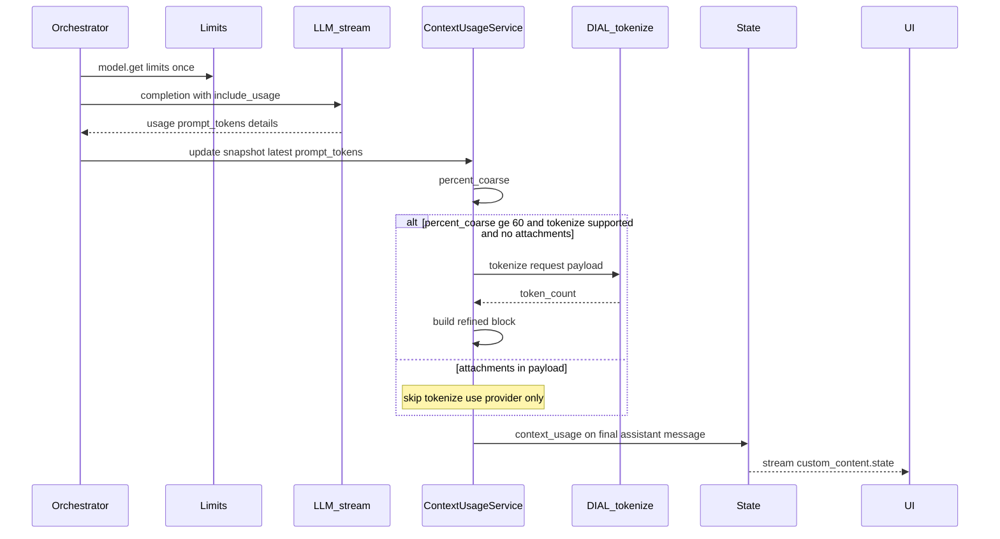

# Design: Context window usage — measurement and UI transfer

- **Status:** Draft
- **Dependencies:**
  - [History compaction — UI and QuickApp backend communication](history_compaction_ui_backend.md) — `custom_content.state` round-trip contract; compaction itself is a separate follow-up.
- **Related:** [Large Tool Response Processing](large_tool_responses.md) — byte-based offload threshold is not model-aware today.

## Problem Statement

Long QuickApp sessions accumulate user, assistant, and tool messages plus system prompts and tool schemas. The orchestrator model has a finite context window, but users receive no indication of how much of that window is consumed until upstream returns a context-length error ([`_exception_message_resolver.py`](../../src/quickapp/core/application/_exception_message_resolver.py)).

Observable symptoms today:

1. **No context meter** — QuickApps does not compute or expose fill percentage to the UI.
2. **Usage collection is presentation-gated** — `prompt_tokens` from the completion stream is parsed only when `SHOW_USAGE_STATISTICS=true`, and rendered as a markdown stage ([`usage_statistics_service.py`](../../src/quickapp/usage_statistics/usage_statistics_service.py)), not as structured state.
3. **No denominator** — `model.get()` is used for pricing only ([`_pricing_service.py`](../../src/quickapp/usage_statistics/_pricing_service.py)); `ModelLimits` (`max_total_tokens`, `max_prompt_tokens`) is ignored.
4. **Provider-specific semantics** — Models apply prompt caching, reasoning tokens, char-based billing, and other optimizations. `prompt_tokens` alone does not mean the same thing across OpenAI, Anthropic, and Google adapters; QuickApps get only `prompt_tokens` and `completion_tokens` ([`parse.py`](../../src/quickapp/common/chat_completion_stream/parse.py)).
5. **Tokenize gap with attachments** — Today `aidial-adapter-openai` implements `/tokenize` with **tiktoken (text only)**. It does not count images, PDFs, or other `custom_content.attachments`. Tokenize refinement is **unreliable** for attachment-heavy orchestrator payloads until adapters add multimodal counting (see [Proposed Core/Adapter requirements](#proposed-coreadapter-requirements)).

A future **history compaction** feature needs a reliable signal for when to compact. This design defines **measurement**, **UI transfer**, and a **compaction hook** — not compaction logic.

## Design Goals

- **G1 — Dual consumer:** One `context_usage` snapshot serves UI notification and a future compaction policy (`compaction_recommended`).
- **G2 — Per-app feature gate:** Opt in via `features.context_usage.enabled` on the app manifest (default off).
- **G3 — Internal usage independent of cost UI:** Collect stream usage when context usage is enabled, regardless of `SHOW_USAGE_STATISTICS`.
- **G4 — Two-tier measurement:** Provider usage by default; DIAL **tokenize** when coarse fill ≥ **60%** (fixed constant).
- **G5 — UI-ready contract:** Structured `custom_content.state.context_usage` — not a markdown stage.
- **G6 — Honest cross-model semantics:** Pass through provider breakdown; tokenize is compaction authority when available; log warning when provider % and tokenize % diverge by > **5** percentage points.
- **G7 — Compaction out of scope:** Set `compaction_recommended` only; no compaction algorithm in this design.

---

## Use Cases

### UC-1: UI shows context fill after a turn

**Trigger:** User completes a turn in an app with `features.context_usage.enabled: true`.

**Behavior:** QuickApps enables `stream_options.include_usage`, reads `prompt_tokens` from the last orchestrator iteration, resolves `limit_tokens` from `model.get(deployment.model).limits`, writes `context_usage` to the final assistant message `custom_content.state`.

**Outcome:** UI displays e.g. “68% context used” from `refined.percent` or `percent`.

### UC-2: Tokenize refinement near limit (text-only)

**Trigger:** Coarse fill ≥ 60%, deployment advertises `features.tokenize`, and orchestrator payload has **no attachments**.

**Behavior:** QuickApps POSTs to `/openai/deployments/{id}/tokenize` with the same payload shape as the orchestrator completion. Snapshot includes `refined` block with tokenize-based fill.

**Outcome:** UI shows refined %; backend may set `compaction_recommended` when effective fill ≥ 80%.

### UC-2b: Attachments present — skip tokenize

**Trigger:** Payload includes `custom_content.attachments` (or equivalent); coarse fill ≥ 60%.

**Behavior:** QuickApps skips tokenize (aidial-adapter-openai tiktoken would under-count). Uses provider `prompt_tokens` only; sets `refine_skipped_reason: "attachments_present"`.

**Outcome:** UI % reflects post-completion provider usage, not a low tiktoken estimate.

### UC-3: Provider vs tokenize divergence

**Trigger:** Both provider and tokenize counts exist; `|percent − refined.percent| > 5`.

**Behavior:** Backend logs a warning with both values. UI shows **refined only** (resolved product decision).

**Outcome:** Operators can investigate adapter normalization; user sees the more precise number.

### UC-4: Compaction hook (no compaction yet)

**Trigger:** Effective fill ≥ 80% (refined if present, else provider `percent`).

**Behavior:** `compaction_recommended: true` on snapshot. Future compaction reads this flag per [history compaction design](history_compaction_ui_backend.md).

**Outcome:** No compaction runs today; flag is available for the next feature.

### UC-5: State survives reload

**Trigger:** User refreshes; UI resends assistant messages with `custom_content.state` intact (Track T1.1–T1.3 in history compaction doc).

**Behavior:** Backend overwrites `context_usage` on the next turn with a fresh measurement.

**Outcome:** Last known fill visible after reload until the next response.

---

## Proposed Design

### Concern 1: Feature configuration

- **What:** `ContextUsageConfig` with `enabled: bool = False`, nested under `Features` in [`application.py`](../../src/quickapp/config/application.py).

```json
{
  "features": {
    "context_usage": {
      "enabled": true
    }
  }
}
```

- **Owner:** Config layer; read per request from `ApplicationConfig`.
- **Semantics:** When `enabled` is false or omitted, no `include_usage` for context metering, no `context_usage` state write, no tokenize calls.
- **Change:** New config model + schema dump (`make dump_app_schema`).

---

### Concern 2: Model limit resolution

- **What:** `ModelLimitsService` (or extension of the pricing registry pattern) resolves `limit_tokens` once per chat completion from `AsyncDial.model.get(deployment.model)`.
- **Owner:** `dial_core_services` or dedicated small module injected into orchestrator path.
- **Semantics:**

| `ModelLimits` fields | `limit_tokens` for % |
|----------------------|----------------------|
| `max_prompt_tokens` set | Use `max_prompt_tokens` |
| Only `max_total_tokens` | Use `max_total_tokens` (UI label: total context) |
| `max_prompt_tokens` + `max_completion_tokens` | Use `max_prompt_tokens` for fill % |
| Missing or `model.get` fails | `limit_tokens: null` — show token count only, hide % |

- **Change:** `OrchestratorCapabilities` extended with `model_id`, `limit_tokens`, `tokenize_supported` (from `deployment.features.tokenize`). Fix model key: use `Deployment.model`, not `deployment_id`, for `model.get()`.

---

### Concern 3: Usage collection (decoupled from usage statistics)

- **What:**
  - `_ChatCompletionConfigBuilder` sets `stream_options.include_usage: true` when `features.context_usage.enabled`.
  - Extend `ChunkUsageFootprint` and `parse.py` to capture `total_tokens`, `prompt_tokens_details` (incl. `cached_tokens`), `completion_tokens_details` (incl. `reasoning_tokens`), and a `provider_details` pass-through bag for adapter-specific fields.
  - New `ContextUsageService` owns snapshot building; **not** gated on `SHOW_USAGE_STATISTICS`.
- **Owner:** `core/agent` + `common/chat_completion_stream`.
- **Semantics — what to aggregate:**

| Metric | Rule |
|--------|------|
| **Context fill** | `prompt_tokens` from the **latest** orchestrator LLM call in the request (full payload). **Do not sum** `prompt_tokens` across tool-call iterations. |
| **Completion total** (optional, informational) | Sum `completion_tokens` across orchestrator iterations in the request. |
| **Cross-turn** | Each turn’s snapshot reflects that turn’s last orchestrator `prompt_tokens`. |

- **Change:** Orchestrator calls `ContextUsageService` after each iteration; persists final snapshot on last assistant message.

---

### Concern 4: Two-tier measurement (provider → tokenize)

- **What:** Fixed constants in code (not per-app config):

| Constant | Value | Purpose |
|----------|-------|---------|
| `REFINE_THRESHOLD_PERCENT` | 60 | Call tokenize when coarse % ≥ this |
| `DIVERGENCE_WARN_THRESHOLD_PP` | 5 | Log warning when \|provider % − tokenize %\| exceeds this |
| `COMPACTION_THRESHOLD_PERCENT` | 80 | Set `compaction_recommended` (hook only) |

- **Owner:** `ContextUsageService`.
- **Semantics:**
  1. After latest iteration: `percent_coarse = context_fill_tokens / limit_tokens`.
  2. If `percent_coarse >= 60` and `deployment.features.tokenize` and payload has **no orchestrator attachments** in the serialized completion request: POST tokenize (`TokenizeInputRequest` matching completion payload). Populate `refined` with tokenize count and `source: dial_tokenize`, `confidence: high`.
  3. If payload contains attachments (any `custom_content.attachments` or equivalent content parts on messages/tools path): **skip tokenize refine** — tiktoken-based adapters (e.g. **aidial-adapter-openai** today) under-count. Use provider `prompt_tokens` only; `confidence: medium`; optional `refine_skipped_reason: "attachments_present"` on snapshot.
  4. If tokenize unavailable or returns error: keep provider snapshot, `confidence: medium`.
  5. **Compaction hook:** `compaction_recommended` when effective fill ≥ 80% — effective fill = `refined.context_fill_tokens` when refined exists, else provider `context_fill_tokens`.
  6. If both provider and refined exist and \|Δ\| > 5pp: `logger.warning(...)` with deployment id, both counts, both percents.

- **Principle:** **Post-call provider `prompt_tokens` is the authority when attachments are present.** Tokenize is the compaction decision authority for **text-only** payloads when the adapter implements provider-aligned counting (not text-only tiktoken).



---

### Concern 5: Provider cache and optimization semantics

- **Owner:** QuickApps receive only prompt_tokens and completion_tokens. Probably, tokenizers might return more detailed information. [Proposed Core/Adapter requirements](#proposed-coreadapter-requirements).
- **Semantics:**

| Pattern | Context fill numerator | Notes |
|---------|------------------------|-------|
| OpenAI-style | `prompt_tokens` | `cached_tokens` ⊆ prompt; expose separately in `provider_details` |
| Anthropic cache | `input_tokens + cache_read_input_tokens + cache_creation_input_tokens` (adapter-normalized to `prompt_tokens` or `provider_details`) | Uncached `input_tokens` alone **understates** fill |
| Gemini | `prompt_token_count` (adapter-normalized to `prompt_tokens`) | May include `cached_content_token_count`, `thoughts_token_count`; char-priced adapters need tokenize |
| Reasoning models | Prompt fill unchanged | `reasoning_tokens` in completion details only; affects output headroom |

---

### Concern 6: UI transfer contract (primary deliverable)

- **What:** `custom_content.state.context_usage` on the **final assistant message** of each turn; also merged into top-level `choice.set_state()` via existing orchestrator persistence.
- **Owner:** QuickApps writes; UI reads and persists (Track T1 in [history compaction doc](history_compaction_ui_backend.md)).
- **Timing (v1):** End-of-turn only. Mid-stream per-iteration updates deferred.
- **Display rules (UI):**

| Field | UI behavior |
|-------|-------------|
| Primary % | `refined.percent` if `refined` present, else `percent` |
| Tokens | `refined.context_fill_tokens` if refined, else `context_fill_tokens`; always show `limit_tokens` when known |
| Thresholds | &lt; 60% neutral; 60–85% warning; &gt; 85% or `compaction_recommended` strong warning |
| Unknown limit | Show token count; hide % or “limit unknown” |
| Low confidence | No `refined` and `confidence: medium` → optional “~” prefix |

- **UI must not:** recompute % from message length; drop `context_usage` on reload.

#### DRAFT `context_usage` schema

```json
{
  "context_usage": {
    "schema_version": 1,
    "limit_tokens": 128000,
    "context_fill_tokens": 82000,
    "percent": 64.1,
    "source": "provider",
    "confidence": "medium",
    "refined": {
      "context_fill_tokens": 79100,
      "percent": 61.8,
      "source": "dial_tokenize",
      "confidence": "high"
    },
    "provider_details": {
      "prompt_tokens": 82000,
      "completion_tokens": 1200,
      "cached_tokens": 45000,
      "reasoning_tokens": null,
      "extra": {}
    },
    "compaction_recommended": false,
    "model_id": "gpt-4o",
    "deployment_id": "my-deployment",
    "measured_at_iteration": 3,
    "completion_tokens_total": 5400
  }
}
```

| Field | Type | Required | Description |
|-------|------|----------|-------------|
| `schema_version` | int | yes | Start at `1` |
| `limit_tokens` | int \| null | yes | Denominator from `ModelLimits` |
| `context_fill_tokens` | int | yes | Coarse fill (provider) |
| `percent` | float \| null | yes | `context_fill_tokens / limit_tokens * 100`; null if no limit |
| `source` | string | yes | `provider` |
| `confidence` | string | yes | `medium` \| `high` |
| `refined` | object \| null | no | Present after tokenize at ≥ 60% |
| `provider_details` | object | no | Raw / normalized usage breakdown |
| `compaction_recommended` | bool | yes | Hook for future compaction |
| `model_id` | string | yes | `Deployment.model` |
| `deployment_id` | string | yes | Orchestrator deployment id |
| `measured_at_iteration` | int | yes | Last orchestrator iteration index (1-based) |
| `completion_tokens_total` | int | no | Sum of completion tokens this request |
| `refine_skipped_reason` | string \| null | no | e.g. `"attachments_present"` when tokenize skipped |

---

### Concern 7: `DialTokenizeClient`

- **What:** HTTP client for `POST /openai/deployments/{deployment_id}/tokenize` using `aidial_sdk.deployment.tokenize` request/response shapes.
- **Owner:** `dial_core_services`.
- **Semantics:** Input = `TokenizeInputRequest` wrapping the serialized chat completion request (messages, tools, model). Output = sum of successful `token_count` values. On error: log, skip `refined`, keep provider snapshot.
- **Change:** New client; `aidial_client` has no tokenize wrapper today.

---

## Secondary Fixes

- **Orchestrator `model_name` for usage:** Record `Deployment.model` in context snapshots (today orchestrator usage uses `deployment_id` — wrong for `model.get()`).
- **Parse layer:** Preserve full usage object instead of two integers — benefits context usage and optionally enriches usage statistics later.

---

## Out of Scope

- History compaction implementation (algorithm, anchor keys, message normalization).
- Per-tool-deployment context meters (nested LLM calls inside DIAL deployment tools).
- Mid-stream context meter updates during multi-tool turns.
- Client-side live typing estimate.
- Adapting tool offload byte threshold to model limits ([large_tool_responses.md](large_tool_responses.md)).
- Billing / cost display (`SHOW_USAGE_STATISTICS` unchanged).

---

## Configuration / Usage Examples

### Enable context usage

```json
{
  "orchestrator": { "deployment": { "deployment_id": "gpt-5.2" } },
  "features": {
    "context_usage": { "enabled": true }
  }
}
```

### UI acceptance checks

| ID | Check |
|----|--------|
| R1 | After a turn with context usage enabled, final assistant message contains `custom_content.state.context_usage` with `schema_version: 1`. |
| R2 | UI displays `refined.percent` when `refined` is present; otherwise `percent`. |
| R3 | Reload + resend: `context_usage` on prior assistant rows is preserved until overwritten by a new turn. |
| R4 | App with `context_usage.enabled: false` emits no `context_usage` field. |

---

## Migration

### Breaking changes

None. Feature is off by default (`features.context_usage` omitted).

### Non-breaking changes

- Optional `features.context_usage` block on app manifest.
- Optional `custom_content.state.context_usage` on assistant messages when enabled.
- `stream_options.include_usage` added to orchestrator calls only when feature enabled.

---

## Summary of Changes

| Component | Addition / change |
|-----------|-------------------|
| `config/application.py` | `ContextUsageConfig`, `Features.context_usage` |
| `core/agent/_chat_completion_config_builder.py` | `include_usage` when `context_usage.enabled` |
| `common/chat_completion_stream/models.py`, `parse.py` | Extended usage footprint + `provider_details` |
| `dial_core_services/` | `ModelLimitsService`, `DialTokenizeClient` |
| `core/agent/context_usage_service.py` (new) | Snapshot, refine, compaction hook, divergence warning |
| `core/agent/orchestrator.py` | Invoke service; persist `context_usage` on assistant state |
| `core/agent/orchestrator_capabilities.py` | `model_id`, `limit_tokens`, `tokenize_supported` |
| UI (separate repo) | Read `state.context_usage`; threshold styling; persist state |
| DIAL Core / adapters | [Proposed Core/Adapter requirements](#proposed-coreadapter-requirements) |

---

## Proposed Core/Adapter requirements

QuickApps implements the mixed measurement strategy in this design, but **correct cross-model behavior depends on DIAL Core and adapters**. Model names below use product families referenced in QuickApps integration tests and fleet config; adapter teams map each deployment to the upstream API version.

**QuickApps rule:** below 60% coarse fill, use provider stream usage (cheap). At ≥ 60%, call **tokenize** only for **text-only** payloads (no attachments in the completion request). When attachments are present, **provider `prompt_tokens` from the actual completion is the authority** — do not call tokenize on tiktoken-based adapters. Provider breakdown remains in `provider_details` for tooltips and ops debugging.

### Current adapter limitation (OpenAI)

**aidial-adapter-openai** implements `/tokenize` with **tiktoken** (text BPE). It does **not** count:

- `custom_content.attachments` (DIAL file URLs, images, PDFs),
- multimodal `content` parts,
- provider image-tiling / PDF extraction rules.

Until the adapter adds multimodal tokenize (DC-8), QuickApps **must skip** tokenize refine when the orchestrator payload includes attachments and rely on stream `usage.prompt_tokens` after the real completion.

### How each model family should count context fill

| Family | Coarse meter (stream `prompt_tokens`) | Tokenize authority | Cache / optimization gotcha |
|--------|--------------------------------------|--------------------|-----------------------------|
| **GPT-5.2 / GPT-5.5** | OpenAI `prompt_tokens` = full prompt in window (incl. attachments after completion) | Provider token-count API on full request — **not tiktoken** when attachments present | **Today:** adapter tokenize = tiktoken → text-only. `cached_tokens` ⊆ `prompt_tokens`. |
| **Gemini 3.5 / 3.1 mini & pro** | `prompt_token_count` → normalized to `prompt_tokens` | Gemini `count_tokens` / CountTokens — **not** tiktoken | Implicit cache from 2.5+; report `cached_content_token_count`. Some adapters bill by **chars** — limits must still be in **tokens**. Thinking → `thoughts_token_count` (output). |
| **Claude 4.6 / 4.7 Sonnet, Haiku, Opus** | **Sum:** `input_tokens + cache_read_input_tokens + cache_creation_input_tokens` | Anthropic count API on full request | **`input_tokens` alone understates fill** when prompt caching is on. Cache is explicit (`cache_control`), not automatic like OpenAI. |

### Cross-cutting requirements (all models)

| ID | Requirement | Owner | Why |
|----|-------------|-------|-----|
| DC-1 | `GET model` returns accurate `limits` (`max_prompt_tokens` and/or `max_total_tokens`) per deployment’s underlying model | DIAL Core | Denominator for % |
| DC-2 | `limits` use **token** units for context window (not chars), even when `pricing.unit` is `char_without_whitespace` | DIAL Core / adapter | Avoid % on incompatible units |
| DC-3 | `features.tokenize: true` only when tokenize endpoint is implemented and matches provider counting | Adapter | Gate tokenize calls |
| DC-4 | `POST .../tokenize` accepts `TokenizeInputRequest` with full chat payload (messages + tools + system in messages) and returns token count **identical to pre-send logical input** for that deployment | Adapter | Compaction authority |
| DC-5 | Chat completion stream honors `stream_options.include_usage: true` and emits a final chunk with `usage` | Adapter | Coarse meter |
| DC-6 | Normalize usage to OpenAI `CompletionUsage` **minimum** (`prompt_tokens`, `completion_tokens`, `total_tokens`) plus optional `*_details` and `provider_details` bag for non-OpenAI fields | Adapter | Single parse path in QuickApps |
| DC-7 | `tokenizer_model` on `ModelInfo` when a stable tokenizer id exists | DIAL Core | Future local fallback (out of scope for QuickApps v1) |
| DC-8 | Tokenize with `TokenizeInputRequest` counts **the same modalities** as chat completions: resolve DIAL file URLs, images, PDFs, `custom_content.attachments` — via **provider count API**, not text-only tiktoken | Adapter (aidial-adapter-openai et al.) | Attachment-heavy QuickApp threads |
| DC-9 | Optional deployment capability (e.g. `features.tokenize_multimodal` or documented guarantee) so QuickApps knows when tokenize refine is safe with attachments | DIAL Core / adapter | Avoid false precision |

### Per-family adapter must-haves

| ID | GPT-5.2 / GPT-5.5 | Gemini 3.5 / 3.1 mini & pro | Claude 4.6 / 4.7 Sonnet, Haiku, Opus |
|----|-------------------|----------------------------|--------------------------------------|
| A1 | Pass `prompt_tokens_details.cached_tokens` | Map `prompt_token_count` → `prompt_tokens` | Sum input + cache read + cache creation → `prompt_tokens` |
| A2 | Pass `reasoning_tokens` in completion details | Map `cached_content_token_count`, `thoughts_token_count` | Pass cache fields in `provider_details` |
| A3 | Tokenize = OpenAI **input token count API** on full multimodal request (replace tiktoken-only path) | Tokenize via CountTokens, not tiktoken | Tokenize via Anthropic count API |
| A4 | Correct 128k–1M limits per variant | `input_token_limit` / `output_token_limit` on model metadata | 200k-class limits per tier (Sonnet / Haiku / Opus) |

### OpenAI family — GPT-5.2, GPT-5.5

| Topic | Upstream behavior | Adapter requirement |
|-------|-------------------|---------------------|
| Tokenizer | tiktoken / model-specific BPE for **text**; images/PDFs use provider rules | **Today:** tokenize uses tiktoken only — **insufficient for attachments**. **Target:** OpenAI input token count API (or Responses count) on same payload as completions |
| Context fill | `usage.prompt_tokens` = full prompt size in window | Pass through unchanged |
| Prompt caching | `usage.prompt_tokens_details.cached_tokens` | Map to `prompt_tokens_details.cached_tokens`; cached ⊆ prompt |
| Reasoning / thinking | `completion_tokens_details.reasoning_tokens` billed and counted in completion budget | Pass through in `completion_tokens_details`; **exclude from prompt fill** |
| Context window | Model-specific (e.g. 128k–1M depending on variant) | Expose correct `max_prompt_tokens` or `max_total_tokens` on model metadata |
| GPT-5.x note | May use Responses API or Chat Completions depending on deployment | Adapter tokenize + usage must reflect **the same API path** as completions |

**Fill formula (normalized):** `context_fill_tokens = prompt_tokens`

### Google Gemini — 3.5 mini/pro, 3.1 mini/pro (and 2.5+ lineage)

| Topic | Upstream behavior | Adapter requirement |
|-------|-------------------|---------------------|
| Tokenizer | SentencePiece / Gemini tokenizer (not tiktoken) | Tokenize via `count_tokens` / CountTokens API — **do not use tiktoken** |
| Context fill | `usage_metadata.prompt_token_count` | Map to `usage.prompt_tokens` |
| Implicit caching | `cached_content_token_count` in `usage_metadata` (2.5+ / 3.x) | Pass in `provider_details.cached_content_token_count`; fill = full `prompt_token_count` |
| Thinking models | `thoughts_token_count` in output metadata | Map to `completion_tokens_details` or `provider_details.thoughts_token_count` |
| Char-priced adapters | Some deployments bill by `char_without_whitespace` | **Still** expose token `limits` and tokenize in **tokens**; document pricing unit separately |
| Context window | Per-model `input_token_limit` / `output_token_limit` | Map to `max_prompt_tokens` + `max_completion_tokens` or `max_total_tokens` |
| 3.x caching | Implicit cache min 4096 tokens (per Google docs) | Usage must report cache hits when present |

**Fill formula (normalized):** `context_fill_tokens = prompt_tokens` (adapter-mapped from `prompt_token_count`)

### Anthropic — 4.6 / 4.7 Sonnet, Haiku, Opus

| Topic | Upstream behavior | Adapter requirement |
|-------|-------------------|---------------------|
| Tokenizer | Anthropic tokenizer | Tokenize endpoint uses Anthropic `count_tokens` or equivalent |
| Context fill | **Not** `input_tokens` alone when caching is active | **Normalize:** `prompt_tokens = input_tokens + cache_read_input_tokens + cache_creation_input_tokens` |
| Prompt caching | `cache_read_input_tokens`, `cache_creation_input_tokens` separate from `input_tokens` | Pass all three in `provider_details`; use sum for `prompt_tokens` |
| Extended thinking | May affect output token accounting | Pass thinking-related fields in completion details; not part of prompt fill |
| Context window | Model-specific (200k+ for Sonnet/Opus class) | Accurate `limits` on model metadata |
| Bedrock vs direct API | Field names may differ | Adapter normalizes to DC-6 shape |

**Fill formula (normalized):** `context_fill_tokens = input_tokens + cache_read_input_tokens + cache_creation_input_tokens`

### Summary matrix

| Model family | Coarse meter (`prompt_tokens`) | Tokenize at ≥ 60% | Known pitfall |
|--------------|-------------------------------|-------------------|---------------|
| GPT-5.2 / GPT-5.5 | Provider `prompt_tokens` (post-completion) | Tokenize only if text-only; else provider only | **Tiktoken tokenize ignores attachments**; reasoning tokens in completion details |
| Gemini 3.5 / 3.1 mini/pro | Adapter-mapped `prompt_token_count` | CountTokens / tokenize | Char pricing ≠ token limits; implicit cache |
| Claude 4.6 / 4.7 Sonnet/Haiku/Opus | **Sum** of input + cache read + cache creation | Anthropic count API | `input_tokens` alone understates fill |

### Adapter acceptance tests (suggested)

1. Golden fixture: fixed messages + tools → tokenize count equals provider `prompt_tokens` within **1%** (or document intentional delta).
2. Cached second turn: cache fields populated; normalized `prompt_tokens` reflects **full** window occupancy.
3. Stream final chunk includes `usage` when `include_usage: true`.
4. `model.limits` matches vendor-documented context window for each listed deployment.
5. **Attachment fixture:** messages + image/PDF attachment → completion `prompt_tokens` ≈ multimodal tokenize count (within 1%); tiktoken-only count must **not** be used for product meter.
