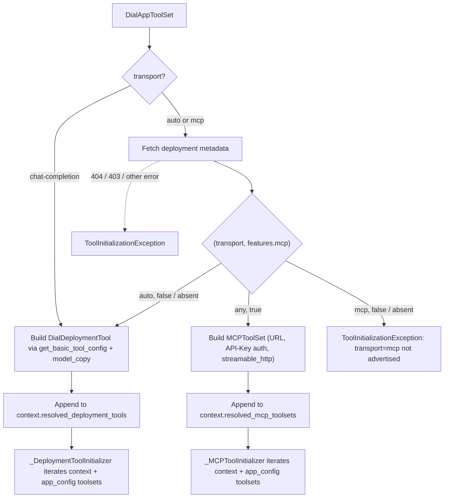

# Design: DIAL App Toolset

- **Status:** Implemented

## Problem Statement

DIAL applications can now expose an MCP interface in addition to chat completions. QuickApps today can only talk to a
DIAL app through chat completion, which forces a **1 deployment = 1 tool** abstraction: `DialDeploymentSimpleTool`
synthesises a single `query` tool per deployment, discarding the fact that a DIAL app can legitimately publish many
capabilities. As more DIAL apps start advertising MCP, the mismatch between what they offer (a toolset of N tools) and
what QuickApps consumes (one synthetic `query` tool) grows.

Two concrete symptoms follow:

1. **Capability loss.** When a DIAL app exposes several MCP tools, the agent can only reach them through
   freeform natural-language routing inside the app's own orchestrator, with no direct tool-level visibility.
2. **No uniform abstraction for "a DIAL app as an agent dependency."** Callers must choose between
   `DialDeploymentSimpleTool` (chat-completion only, single synthetic tool) and `DialMCPToolSet` (MCP only, takes a
   toolset resource id, not a deployment id). There is no single toolset type whose input is "a DIAL app" and whose
   output is "whichever tools that app exposes."

## Design Goals

- Introduce a **single configuration abstraction** that takes a DIAL deployment id and produces tools from whichever
  transport that deployment advertises.
- When the deployment advertises MCP (`features.mcp == true`), surface **all** MCP tools it publishes (optionally
  filtered by `allowed_tools`) as first-class QuickApp tools, via the existing MCP stack.
- When the deployment does **not** advertise MCP, fall back to the existing chat-completion single-`query` behaviour
  with no configuration change.
- **Make transport selectable per toolset, defaulting to MCP-preferring auto-detect.** Some DIAL apps publish *both*
  MCP and chat completion (e.g. during migration windows). Admins must be able to pin transport explicitly without
  forking the deployment, while the default ("MCP if available, otherwise chat completion") preserves the
  zero-config story.
- Reuse the existing MCP runtime (toolset client, tool wrapper, stage wrapper) and the existing chat-completion
  runtime (completion service, deployment tool) unchanged — Phase 1 is a resolution/routing change, not a new
  execution path. Interactive sign-in on the deployment-scoped MCP endpoint is deferred (see Out of Scope).
- Additive change from a caller's perspective: no breaking impact on existing `DeploymentToolSet`,
  `DialDeploymentSimpleTool`, `DialDeploymentTool`, `MCPToolSet`, or `DialMCPToolSet` configurations. The internal
  wiring of `_MCPToolInitializer` and `_DeploymentToolInitializer` gains an additional source of toolsets (see
  Proposed Design); their existing app-config traversal remains unchanged.

**Preview posture.** Phase 1 ships GA, not behind `@preview_module` / `ENABLE_PREVIEW_FEATURES`. Rationale: the
deployment-scoped MCP endpoint and the `features.mcp` signal have both landed in DIAL Core, and the fallback
branch — the safety net for deployments that don't advertise MCP — exercises only paths that are already GA in
QuickApps. The one acknowledged gap (interactive sign-in on the deployment-scoped MCP endpoint; see UC-4 and
Out of Scope) surfaces as a `ToolInitializationException` rather than a broken request, which is the same
failure mode every other toolset type already has when it can't initialise. If operational experience shows a
reason to gate, flipping the module to `@preview_module` is a one-line change.

---

## Use Cases

### UC-1: DIAL app with MCP support

**Trigger:** A request arrives whose application config contains a `DialAppToolSet` with `deployment_id: "my-app"`.
The DIAL metadata for `my-app` returns `features.mcp == true`.

**Behaviour:** During initialization, QuickApps resolves the deployment metadata, detects MCP support, constructs
an MCP connection to `/v1/toolset/my-app/mcp` (API-Key authed with the request's DIAL key), and lists the tools
the app exposes. Each MCP tool is registered as a separate QuickApp tool, named `{toolset_name}_{mcp_tool_name}`.

**Outcome:** The agent sees N tools for the DIAL app, invokes them individually, and their results are processed
through the existing `_MCPTool` path (including attachment handling and the stage wrapper).

### UC-2: DIAL app without MCP support (fallback)

**Trigger:** Same configuration as UC-1, but the deployment's metadata does not advertise MCP
(`features.mcp == false` or the flag is absent).

**Behaviour:** QuickApps falls back to chat completion: it resolves the deployment through
`ToolConfigCoreService.get_basic_tool_config` (producing a `DialDeploymentTool` with a `query` parameter, and any
configuration schema fields it exposes), and registers a single tool through the existing `DeploymentTool` path.
The tool name follows the rule in §"Synthesised tool name" below.

**Outcome:** From the caller's perspective, the toolset still works. The agent-visible surface matches today's
`DialDeploymentSimpleTool`: the same `query` parameter, the same `attachment_urls` when the deployment declares
`input_attachment_types`, and the same configuration-schema-derived fields. Differences introduced by the new
type — `attachment` / `fallback_configuration` propagation (see §"Chat-completion fallback branch") — are
additive.

### UC-3: Deployment not found or inaccessible

**Trigger:** `deployment_id` does not resolve (404) or the caller lacks permissions (403).

**Behaviour:** The error is captured as a `ToolInitializationException` and surfaced through the existing error
stage, alongside other failing toolsets. The rest of the request proceeds.

**Outcome:** The user sees an initialization error for this specific toolset; other toolsets and the agent loop
continue.

### UC-4: DIAL-internal authentication required on the MCP endpoint (deferred)

**Trigger:** The DIAL app advertises MCP, but the deployment-scoped MCP endpoint returns 401 for the caller's API
key.

**Behaviour (Phase 1):** The 401 surfaces as `MCPUnauthorizedException` during initialisation and is captured as a
`ToolInitializationException`, same as any other initialisation failure. The resolver does **not** attempt
interactive sign-in on the deployment-scoped MCP endpoint in Phase 1 because
`InteractiveLoginService.request_signin_batch` today sends a JSON-RPC `toolset/signin` call keyed on a DIAL
*toolset* id (see `src/quickapp/dial_core_services/_interactive_login_service.py:36-61`); the DIAL Core contract
for interactive sign-in against a deployment-scoped MCP endpoint is not yet defined.

**Outcome:** The user sees an initialisation error for this toolset. Re-enabling interactive login on this path
is tracked in Out of Scope and will be addressed in a follow-up once DIAL Core publishes the corresponding RPC.

### UC-5: `allowed_tools` restriction (MCP path only)

**Trigger:** Config sets `allowed_tools: ["search"]` on a `DialAppToolSet` whose DIAL app exposes MCP.

**Behaviour:** After listing tools, QuickApps keeps only those whose MCP name appears in `allowed_tools`.

**Outcome:** The agent sees exactly the whitelisted tools. When the deployment does not advertise MCP, the flag has
no effect (there is only one synthetic `query` tool) and QuickApps logs a warning if `allowed_tools` was provided.

**Known quirk (inherited from existing `MCPToolSet`):** `allowed_tools` filters on the raw MCP tool name, but the
agent-visible name goes through `sanitize_toolname` (see §"Synthesised tool name"). Two MCP tools whose raw
names differ only in characters that `sanitize_toolname` collapses would both survive the filter and then collide
in the registry. This is not introduced by `DialAppToolSet`; it already affects `DialMCPToolSet` / `MCPToolSet`
and is left as-is for Phase 1 so the new type matches existing behaviour. In practice DIAL MCP servers name
tools conservatively, so this edge case has not surfaced operationally.

### UC-6: DIAL app exposes both MCP and chat completion — transport selected by config

**Trigger:** A `DialAppToolSet` references a deployment whose metadata advertises `features.mcp == true` *and*
the deployment also accepts chat completion (the common case during MCP migration). The config either omits
`transport` (default `"auto"`) or sets it explicitly to `"mcp"` or `"chat-completion"`.

**Behaviour:**

- `transport: "auto"` (default) — MCP wins because it's available; same outcome as UC-1. If the deployment
  doesn't advertise MCP, fall through to chat completion (UC-2).
- `transport: "mcp"` — force MCP. If `features.mcp != true`, the resolver surfaces a `ToolInitializationException`
  (`"transport=mcp requested but features.mcp is not advertised"`) instead of silently falling back. This is the
  knob admins reach for when they explicitly do not want the silent fallback.
- `transport: "chat-completion"` — force chat completion. The resolver **skips the metadata fetch entirely** (no
  `features.mcp` lookup needed) and goes straight to `get_basic_tool_config`. Saves one DIAL Core roundtrip per
  request and removes any "what does the deployment currently advertise?" non-determinism.

**Outcome:** Admins of DIAL apps that publish both transports can pin the choice without touching the deployment.
The default ("auto") preserves the zero-config story for callers who don't care.

**Why this matters:** MCP and chat completion have different agent-visible shapes. MCP exposes N tools with
typed `inputSchema`s; chat completion exposes one synthetic `query` tool that takes a free-text string. Some
agents — and some prompts — perform measurably better with one shape over the other for the same underlying
deployment. `transport` is the explicit override for that judgment call. It also future-proofs the type for a
period when DIAL Core is rolling out MCP coverage app-by-app: pinning to `"chat-completion"` is the safe choice
when an app's MCP surface is not yet trusted.

**Interaction with `allowed_tools`:** identical to UC-5. `allowed_tools` is meaningful when the resolver routes
to MCP (whether by `auto` or `mcp`) and is logged as a warning when it routes to chat completion (whether by
`auto` falling through, or `chat-completion` forcing it).

---

## Proposed Design

Phase 1 introduces exactly one new public concept (`DialAppToolSet`) and one internal routing decision. All runtime
execution continues to flow through the existing MCP or DIAL-deployment modules — this is a resolver, not a new
runtime.

### New public type: `DialAppToolSet`

**What:** A new toolset type discriminated by `type: "dial-app"`, living alongside
`DeploymentToolSet` / `DialMCPToolSet` / `MCPToolSet` in the discriminated `ToolSet` union.

**Owner:** `src/quickapp/config/toolsets/` (new file, e.g. `dial_app.py`). Registered in
`src/quickapp/config/toolsets/toolset.py`.

**Semantics:** A declarative reference to a DIAL deployment or application, optionally pinned to a specific
transport via the `transport` field. By default (`transport: "auto"`), transport is decided at initialisation
time based on the deployment metadata (`features.mcp`); when set explicitly, the resolver respects the
config's choice without auto-detection (see UC-6).

**Fields:**

| Field                    | Required | Type                 | Notes                                                                                                                  |
|--------------------------|----------|----------------------|------------------------------------------------------------------------------------------------------------------------|
| `type`                   | Yes      | `"dial-app"`         | Discriminator literal.                                                                                                 |
| `deployment_id`          | Yes      | String               | DIAL deployment / application id. Wrapped in `DialResourceConfigField` like existing DIAL references.                  |
| `name`                   | No       | String               | Inherited from `BaseToolSet`. Used as the MCP tool-name prefix on the MCP branch (same as today's MCP toolsets); **not** used to prefix the agent-visible name on the fallback branch (see §"Synthesised tool name"). |
| `description`            | No       | String               | Inherited. Optional admin description.                                                                                 |
| `enabled`                | No       | Boolean              | Inherited. Default `true`.                                                                                             |
| `transport`              | No       | `Literal["auto", "mcp", "chat-completion"]` | Default `"auto"`. Routing override. `"auto"`: MCP if the deployment advertises `features.mcp`, otherwise chat completion (UC-1 / UC-2). `"mcp"`: force MCP — initialization fails with a `ToolInitializationException` if `features.mcp != true`. `"chat-completion"`: force chat completion — the resolver skips the metadata fetch and goes directly to `get_basic_tool_config`. See UC-6. |
| `allowed_tools`          | No       | List[String]         | MCP branch only: whitelists the subset of tool names that reach the agent. Meaningless in the fallback branch (one synthetic `query` tool); logged as a warning if set.                   |
| `attachment`             | No       | `AttachmentConfig`   | Propagated on both branches. MCP: set on the synthesised `MCPToolSet`. Fallback: overrides `DialDeploymentTool.attachment` via `model_copy`. |
| `fallback_configuration` | No       | `ToolFallbackConfig` | Propagated on both branches. MCP: set on the synthesised `MCPToolSet`. Fallback: overrides `DialDeploymentTool.fallback_configuration` (defaulted by `_convert_to_openai_tool_format` to `ToolFallbackConfig(strategies=[ContinueStrategyModel()])`) via `model_copy`. |

**Rationale for a new type rather than a flag on `DialDeploymentSimpleTool`:** an MCP-backed DIAL app produces a
*set* of tools, which is fundamentally a toolset concept. A flag would either overload the semantics of a tool
(yielding N tools from one tool definition) or require the toolset to decide the arity retroactively. Using a
toolset type aligns with the structural reality and sidesteps that ambiguity. It also leaves the door open to a
future deprecation decision for `DialDeploymentSimpleTool` (deferred to Phase 2; see Out of Scope) without
forcing that call now.

**Alternative considered — extend `DialMCPToolSet` with a resource-type discriminator.** Instead of a new toolset
type, `DialMCPToolSet` could gain a `dial_resource_type: Literal["toolset", "deployment"]` field that reinterprets
its `dial_id` (toolset resource id vs deployment id) and points the URL template at the corresponding DIAL Core
endpoint (today `/v1/toolset/{id}/mcp` for both; per [ai-dial-core#1477] the deployment variant moves to
`/v1/deployments/{id}/mcp`). This keeps the DIAL-internal MCP surface in one place, but has two disadvantages:
(1) the `deployment` variant must also support a chat-completion fallback (and an explicit transport override —
see UC-6) when the deployment doesn't expose MCP, forcing `DialMCPToolSet` to host chat-completion logic it
otherwise has no business with; (2) the `dial_id` field semantics become overloaded (toolset id vs deployment
id), which leaks into schema, logs, and error messages. A sibling type keeps each abstraction's invariants
clean.

### Synthesised tool name

The agent-visible tool name depends on the branch. Both rules go through `sanitize_toolname`, which replaces
any consecutive run of characters outside `[a-zA-Z0-9_-]` with a single `_` and truncates the result to 64
chars (see `src/quickapp/common/utils.py`). The MCP rule matches the existing
`_MCPToolInitializer._process_toolset` convention; the fallback rule matches the existing
`_DeploymentToolInitializer.__init_deployment_tool` convention for `DialDeploymentSimpleTool`.

| Branch   | Rule                                                                                       | Example                                                                                                                                  |
|----------|--------------------------------------------------------------------------------------------|------------------------------------------------------------------------------------------------------------------------------------------|
| MCP      | `sanitize_toolname(f"{toolset.name}_{mcp_tool.name}")`                                     | toolset `"ticket-triage"`, MCP tool `classify` → `ticket-triage_classify`                                                                |
| Fallback | `sanitize_toolname(f"{deployment.id.split('/')[-1].replace('%20', '_')}_tool")` (built by `_convert_to_openai_tool_format`) | deployment id `"support-triage"` → (last segment) `"support-triage"` → (no `%20`) `"support-triage"` → (suffix) `"support-triage_tool"` → (sanitize) `support-triage_tool`; deployment id `"applications/abc/My%20App%201.0"` → (last segment) `"My%20App%201.0"` → (replace) `"My_App_1.0"` → (suffix) `"My_App_1.0_tool"` → (sanitize replaces `.` with `_`) `My_App_1_0_tool` |

**MCP branch — toolset-name prefix is intentional.** MCP servers publish many tools and the prefix disambiguates
collisions across multiple `DialAppToolSet` / `DialMCPToolSet` / `MCPToolSet` entries pointing at different
servers, mirroring today's `_MCPToolInitializer._process_toolset` behaviour.

**Fallback branch — toolset-name prefix is *not* applied.** DIAL deployments are not packed in natural toolsets
the way MCP servers are, so prefixing the agent-visible name with the toolset name is fragile (the same
deployment would surface under different names depending on which `DialAppToolSet` references it) and ambiguous
(the agent can't tell from the name which deployment it's calling). Fallback names therefore come straight from
`_convert_to_openai_tool_format` without modification, matching `DialDeploymentSimpleTool` exactly. The
resolver's customisation (`attachment` / `fallback_configuration` propagation via `model_copy`) leaves
`open_ai_tool.function.name` untouched.

**Hyphen handling.** `sanitize_toolname` preserves hyphens — they're part of the allowed character set. So
`support-triage_tool` stays as-is. Spaces, slashes, periods, and non-ASCII characters collapse to `_`. This
matters for deployment ids like `applications/{hash}/My%20App%201.0` (Cyrillic and other non-ASCII characters
in display-name-derived ids would otherwise produce tool names rejected by LLM tool-name schemas).

### New DI module: `DialAppToolingModule` (resolver)

**What:** A small injector module whose sole job is to expand each `DialAppToolSet` into transport-specific,
**fully-resolved** inputs (`MCPToolSet` or `DialDeploymentTool`) that the existing MCP and deployment
initializers consume alongside their current sources.

**Owner:** `src/quickapp/dial_app_tooling/` (new directory, following the existing `*_tooling/` convention).

**Semantics:** The resolver is registered as a `CompletionInitializer` so it runs during the chat path (the
`configuration` initializer phase only runs for the separate `ConfigurationRequest` endpoint — see
`application/_quick_app_completion.py:41-67` — so it cannot be used for chat-time resolution). The resolver
exposes an idempotent async `resolve()` method that, for every enabled `DialAppToolSet` in
`app_config.tool_sets`, dispatches based on `transport`:

1. **`transport == "chat-completion"`** — skip the metadata fetch entirely and go straight to step 4.
2. **`transport == "auto"` or `"mcp"`** — fetch raw deployment/application metadata via a new
   `ToolConfigCoreService.get_deployment_metadata(deployment_id)` helper (see *Caching*) and inspect
   `features.mcp`.
3. **MCP branch** — taken when (`transport == "mcp"`) or (`transport == "auto"` and `features.mcp == true`).
   Build a fully-formed `MCPToolSet` (URL `/v1/toolset/{deployment_id}/mcp`, `MCPApiKeyAuthorization` with
   `DIAL_API_KEY`, protocol `streamable_http`, `name`, `allowed_tools`, `attachment`, `fallback_configuration`
   copied from the `DialAppToolSet`) and append it to the context. If `transport == "mcp"` but
   `features.mcp != true`, raise a `ToolInitializationException`
   (`"transport=mcp requested but features.mcp is not advertised"`) instead of falling back — admins who pin
   MCP want to know when the deployment doesn't support it, not silently get chat completion.
4. **Fallback branch** — taken when (`transport == "chat-completion"`) or (`transport == "auto"` and
   `features.mcp != true`). Obtain a `DialDeploymentTool` by calling `get_basic_tool_config(deployment_id)`
   **through `DialDeploymentToolCacheService`** with key `basic_config_{deployment_id}` — the same key that
   `_DeploymentToolInitializer.__init_simple_deployment_tool` uses, so the fallback fetch shares the existing
   singleton cache with `DialDeploymentSimpleTool` configs pointing at the same deployment. The resolver then
   produces a customised copy via `DialDeploymentTool.model_copy(update={"attachment": ts.attachment,
   "fallback_configuration": ts.fallback_configuration})` so the toolset's values override the defaults built
   by `_convert_to_openai_tool_format`, and appends the `DialDeploymentTool` to the context.
   `allowed_tools` — meaningless on the fallback branch — is logged as a warning at this point.

The output is written into a new request-scoped `_DialAppResolverContext`:

- `resolved_mcp_toolsets: list[MCPToolSet]`
- `resolved_deployment_tools: list[DialDeploymentTool]` — fully-customised, ready for
  `_DeploymentToolInitializer.__init_deployment_tool(tool)`. The originating `DialAppToolSet`'s `name` is
  **not** part of this list. If a downstream consumer needs to identify which `DialAppToolSet` produced a
  given resolved tool (e.g. for an error message), the resolver captures that on
  `ToolInitializationException.toolset_name` at the moment of failure — the resolver is the only place where
  the originating toolset and the resolved tool are still in scope together. The flat list shape is
  deliberate so the downstream initializer's loop matches the existing `__init_deployment_tool(tool)` call
  shape used for plain `DialDeploymentTool` entries inside `DeploymentToolSet` configs.

**Phase ordering.** `invoke_initializers` does not guarantee execution order across a single-phase multiprovider,
so the resolver enforces ordering at the call site: `_MCPToolInitializer.initialize()` and
`_DeploymentToolInitializer.initialize()` both inject the resolver and `await self.__resolver.resolve()` at the
top of their own `initialize()`. `resolve()` is idempotent (guarded by an internal `_resolved: bool` flag) so
whichever downstream initializer runs first triggers resolution; subsequent calls return immediately.

**Dual registration of `_DialAppResolver`.** The resolver is registered **both** as a `CompletionInitializer`
(via `DialAppToolingModule.__provide_initializers`) and as an injected dependency that the downstream
initializers `await` directly. This is deliberate, not redundant:

- The `CompletionInitializer` slot keeps the resolver in the standard lifecycle (it appears alongside other
  initializers, surfaces its exceptions through the same `list[InitializationException]` multiprovider, and
  participates in the same logging/metrics).
- The direct `await self.__resolver.resolve()` inside the downstream initializers gives a hard ordering
  guarantee that the multiprovider iteration order alone cannot provide — even if the resolver hasn't run yet
  in the standard pass when an MCP/Deployment initializer starts, that initializer triggers resolution
  on-demand. The `_resolved` flag makes the second entry-point a no-op when the first has already run.

The cost of the dual registration is one extra `await` (which short-circuits via `_resolved`); the benefit is
that neither callers nor the multiprovider have to care about scheduling order.

**DI scopes.** Both `_DialAppResolver` and `_DialAppResolverContext` are bound at `request_scope`, matching
`_MCPToolingContext` and `_DeploymentToolingContext`. Request-scoping is load-bearing: the idempotency flag must
reset each request, and both downstream initializers must receive the same resolver instance so only one actually
performs the fetches. The initializers' own scopes are incidental here — `_MCPToolInitializer` happens to be
`request_scope` and `_DeploymentToolInitializer` is currently unscoped, but the shared-resolver guarantee
depends on the resolver and context being request-scoped, not on the initializer bindings.

**Change:** `AppFactory.create` registers `DialAppToolingModule` in `app_factory.py` alongside the existing
modules. `_MCPToolInitializer` and `_DeploymentToolInitializer` are both modified: each gains a resolver
dependency, awaits it once, and then iterates `_DialAppResolverContext.resolved_*` in addition to its existing
sources (see *Summary of Changes*).

### Routing decision

Resolution happens once per `DialAppToolSet` at initialisation time, in parallel with other toolsets. The
decision incorporates both the deployment's advertised capabilities and the `transport` config field:



*Edge legend:* solid edges = decided routing path; dotted edges = fetch-failure error paths.

**Owner:** `DialAppToolingModule`'s completion initializer (`_DialAppResolver`).

**Semantics:**

- **At most** one raw-metadata fetch per `DialAppToolSet` per request, via a new
  `ToolConfigCoreService.get_deployment_metadata(deployment_id)` helper that returns the raw
  `Deployment | Application` object. The fetch is **skipped entirely** when `transport == "chat-completion"`
  (the routing decision is already made by config; nothing to inspect). Otherwise it's needed for the
  `features.mcp` check.
- If the resolved branch is MCP, the resolver builds a fully-formed `MCPToolSet` and appends it to
  `_DialAppResolverContext.resolved_mcp_toolsets`. `_MCPToolInitializer._process_toolset` already handles plain
  `MCPToolSet`s (no DIAL-toolset-info lookup), so no new logic is needed on the MCP side beyond the
  extra-iteration change documented under *MCP transport branch*.
- If the resolved branch is fallback, the resolver calls `get_basic_tool_config(deployment_id)` **through
  `DialDeploymentToolCacheService`** (same key as `__init_simple_deployment_tool`), applies the toolset's
  `attachment` and `fallback_configuration` via `model_copy`, and appends the `DialDeploymentTool` to
  `resolved_deployment_tools`. `_DeploymentToolInitializer` hands each entry to its existing
  `__init_deployment_tool(tool)` method — we skip the `__init_simple_deployment_tool` wrapper (because the
  resolver has already done the cache lookup and the customisation), but we keep its cache key so the two
  entry points share the singleton cache.

**Why resolve in a separate initializer rather than inline inside the MCP / Deployment initializers?** Keeping the
routing logic in one place avoids the two downstream initializers having to duplicate
"is-it-a-`DialAppToolSet`?" conditions. It also keeps a clean separation: the new type's config semantics live in
one module; the MCP and deployment modules remain transport-specific.

### MCP transport branch

This branch is taken when (`transport == "auto"` and `features.mcp == true`) or (`transport == "mcp"` and
`features.mcp == true`). The resolver builds a plain `MCPToolSet` (not `DialMCPToolSet`) and appends it to
`_DialAppResolverContext.resolved_mcp_toolsets`. `_MCPToolInitializer` iterates this list in addition to its
existing injected `toolset_list`.

When `transport == "mcp"` but the deployment doesn't advertise MCP, the resolver raises a
`ToolInitializationException` (`"transport=mcp requested but features.mcp is not advertised on
{deployment_id}"`). It does **not** fall back silently — the whole point of pinning `"mcp"` is to make this
case loud. The error is captured per-toolset and other toolsets continue (same channel as every other
initialisation failure; see *Error handling*).

- **Endpoint URL:** `{DIAL base URL}/v1/toolset/{deployment_id}/mcp`. Both `DialMCPToolSet` and
  `DialAppToolSet` currently target the same path prefix; the difference is which DIAL resource the `{id}`
  segment names (a *toolset resource* vs a *deployment*). Per [ai-dial-core#1477], the deployment-scoped path
  will move to `/v1/deployments/{deployment_id}/mcp`; when that lands, only the URL template here changes.
- **Authorization:** `MCPApiKeyAuthorization` with the request's DIAL API key (injected via `DIAL_API_KEY`),
  header name `Api-Key`. Same mechanism as `DialMCPToolSet`.
- **Protocol:** `streamable_http`. DIAL Apps expose MCP exclusively over streamable HTTP, so the resolver
  hard-codes this transport — no discovery step and no fallback to SSE is needed. This is deliberately
  different from `DialMCPToolSet`, where `_MCPToolInitializer._process_toolset` branches on
  `ToolsetInfo.transport` because a DIAL toolset resource can be backed by either transport.
- **Tool naming:** MCP tools are prefixed with the `DialAppToolSet`'s `name` (sanitised) — see §"Synthesised
  tool name" — matching the existing `_MCPToolInitializer._process_toolset` convention.
- **Interactive login:** not supported on this branch in Phase 1. See UC-4 and Out of Scope.

[ai-dial-core#1477]: https://github.com/epam/ai-dial-core/issues/1477

**Change.** `_MCPToolInitializer.__init__` gains a `_DialAppResolver` dependency; `initialize()` begins with
`await self.__resolver.resolve()`, then iterates `self.__toolset_list + self.__resolver_context.resolved_mcp_toolsets`.
The per-toolset processing logic in `_process_toolset` remains unchanged because plain `MCPToolSet` already
skips the DIAL-toolset-info resolve step — the resolver hands over a fully-formed value. Because the entries
are already plain `MCPToolSet`s, the integration point could alternately be the existing
`MCPToolingModule.__provide_mcp_toolsets` multiprovider; that would keep `_MCPToolInitializer.initialize()`
itself untouched. However, multiproviders resolve at injection time (before any `initialize()` runs), so they
cannot await the resolver. Adding the `await` inside `_MCPToolInitializer.initialize()` is the only shape that
actually respects phase ordering.

### Chat-completion fallback branch

This branch is taken when (`transport == "chat-completion"`) or (`transport == "auto"` and
`features.mcp != true`). The resolver calls `get_basic_tool_config(deployment_id)` **through the singleton
`DialDeploymentToolCacheService`** with the same `basic_config_{deployment_id}` key that
`_DeploymentToolInitializer.__init_simple_deployment_tool` uses. The resolver then applies the `DialAppToolSet`'s
`attachment` and `fallback_configuration` onto the returned (cached or freshly built) `DialDeploymentTool` via
`model_copy(update=...)`, and appends the customised tool to
`_DialAppResolverContext.resolved_deployment_tools`. `_DeploymentToolInitializer.initialize()` iterates this
list and calls its own existing `__init_deployment_tool(tool)` on each — the initializer is still the only
component that constructs a `DeploymentTool`; the resolver's job is to produce
the pre-resolved, customised `DialDeploymentTool` input. `__init_simple_deployment_tool` is not invoked for
`DialAppToolSet` entries (the resolver has already done its work), but they share its cache key, so a process
that mixes `DialAppToolSet` and `DialDeploymentSimpleTool` entries pointing at the same deployment only fetches
each deployment once. The existing scan of `app_config.tool_sets` is unchanged, so regular `DeploymentToolSet`
configs still route through the old path.

Net effect: a tool named per §"Synthesised tool name" (fallback rule) is registered, accepting `query` and —
when the deployment advertises `input_attachment_types` — `attachment_urls`. The agent-visible behaviour, name,
and schema match today's `DialDeploymentSimpleTool` exactly. The `attachment` and `fallback_configuration`
fields on the `DialAppToolSet` additionally tune the tool's post-processing (MIME-type filtering, fallback
strategies) in the same way they tune MCP tools.

**`transport: "chat-completion"` short-circuit.** When the config explicitly forces this branch, the resolver
**skips the metadata fetch** — no `get_deployment_metadata` call, no `features.mcp` inspection. This both saves
a DIAL Core roundtrip and avoids any "what does the deployment advertise right now?" surprise: the config has
already made the decision. `get_basic_tool_config` still runs (it produces the actual tool definition).

- **Warnings (emitted by the resolver at resolution time, not by downstream initializers; each names the
  offending `DialAppToolSet` by its `name` so admins can locate the config entry quickly):**
  - `allowed_tools` set on a `DialAppToolSet` whose resolved branch is fallback (whether by `auto` falling
    through or `chat-completion` forcing it) → "ignored on chat-completion fallback (single synthetic tool)".
- **History / content propagation:** not configurable via `DialAppToolSet` in Phase 1. Callers that need
  `content_propagation` or `custom_fields.configuration` continue to use `DialDeploymentTool` directly.

### Error handling

All resolution errors (metadata fetch failure, missing deployment, inaccessible MCP endpoint) surface through the
same `ToolInitializationException` channel used today. The resolver mirrors the `_DeploymentToolInitializer`
pattern: log, append to context exceptions, do not fail the whole request. The existing error-stage UI picks them
up unchanged.

### Caching

The number of DIAL Core fetches per `DialAppToolSet` per request varies with `transport`. The
**worst case is two fetches**, and that case occurs only when `transport: "auto"` falls through to chat
completion. The other paths each do one fetch (or zero):

| `transport`        | `features.mcp` | Metadata fetch | `get_basic_tool_config` fetch | Total                                            | Resolution outcome                                                |
|--------------------|----------------|----------------|-------------------------------|--------------------------------------------------|-------------------------------------------------------------------|
| `"auto"`           | `true`         | yes            | no                            | 1 (metadata only — MCP branch)                   | success: N MCP tools                                              |
| `"auto"`           | `false`/absent | yes            | yes                           | **2 — worst case** (metadata, then fallback)     | success: 1 chat-completion tool                                   |
| `"mcp"`            | `true`         | yes            | no                            | 1 (metadata only)                                | success: N MCP tools                                              |
| `"mcp"`            | `false`/absent | yes            | no                            | 1 (metadata, then `ToolInitializationException`) | failure: `ToolInitializationException` ("transport=mcp not advertised") |
| `"chat-completion"`| irrelevant     | **no**         | yes                           | 1 (`get_basic_tool_config` only)                 | success: 1 chat-completion tool                                   |

The two underlying fetches:

1. **Raw metadata fetch** for the `features.mcp` routing decision, via the new
   `ToolConfigCoreService.get_deployment_metadata(deployment_id)` helper. **Skipped entirely when
   `transport == "chat-completion"`** — the routing decision is already pinned by config. For the other modes
   the fetch runs once per `DialAppToolSet` per request and is *not* cached cross-request. Per-request,
   `_DialAppResolver.resolve()` is idempotent (guarded by `_resolved: bool`) and request-scoped, so multiple
   downstream initializers `await`ing the resolver never cause a duplicate fetch within one request.
2. **`get_basic_tool_config` fetch** on the fallback branch only (whether reached via `auto` falling through
   or `chat-completion` forcing it), routed through the existing singleton `DialDeploymentToolCacheService`
   under key `basic_config_{deployment_id}`. This is the same key
   `_DeploymentToolInitializer.__init_simple_deployment_tool` uses, so `DialAppToolSet` and
   `DialDeploymentSimpleTool` configs pointing at the same deployment share one DIAL Core roundtrip
   process-wide, matching today's memoisation for `DialDeploymentSimpleTool`. The customisation step
   (`attachment` / `fallback_configuration` propagation) runs on a `model_copy` of the cached value, not on the
   shared cache entry.

The raw-metadata fetch is intentionally not cached cross-request. It is cheap (a single
`dial_client.deployments.get` or `.application.get`), the resolver already request-scopes it, and caching it
would require a new singleton cache for a single-field routing check whose correctness must track live DIAL
Core state (an operator flipping `features.mcp` on a deployment should take effect on the next request, not
wait out a TTL). The `transport == "chat-completion"` shortcut already provides a way to opt out of this fetch
entirely on the hot path. If usage patterns later show that even the `auto` path needs caching, adding a
short-TTL cache for raw metadata is a straightforward follow-up.

No new cache layer is introduced; `DialDeploymentToolCacheService`'s type (`CacheService[DialDeploymentTool]`)
is untouched. The MCP tool-list fetch uses the per-request MCP session as today.

### Implementation notes (non-normative)

- The resolver produces **plain `MCPToolSet` and `DialDeploymentTool`** instances, not `DialMCPToolSet` or
  `DialDeploymentSimpleTool`. This avoids overloading `DialMCPToolSet.dial_id` (which today is a DIAL toolset
  resource id, not a deployment id) and removes any need for an internal subclass.
- Phase ordering is enforced at the call site: the resolver is a `CompletionInitializer` with an idempotent
  `async resolve()` method (guarded by an internal `_resolved: bool` flag); both `_MCPToolInitializer` and
  `_DeploymentToolInitializer` inject the resolver and `await self.__resolver.resolve()` at the top of their
  `initialize()`. `invoke_initializers` runs initializers sequentially (`for ... await`), so the simple boolean
  flag is sufficient — no `asyncio.Event`/`Lock` needed for concurrent re-entry.
- `features.mcp` presence check: `Features.mcp` is a plain `Optional[bool]`. The resolver checks
  `deployment.features is not None and deployment.features.mcp is True` — absent, `None`, and `False` all
  route to the chat-completion branch (under `transport == "auto"`) or to the
  "transport=mcp not advertised" error (under `transport == "mcp"`).

---

## Secondary Fixes

### Document the MCP URL semantics

`DialMCPToolSet` and `DialAppToolSet` currently target the same path prefix in DIAL Core
(`/v1/toolset/{id}/mcp`), but the `{id}` segment names different DIAL resources: a *toolset resource* for
`DialMCPToolSet` (e.g. `toolsets/{hash}/Foo__1.0.0`) versus a *deployment / application id* for
`DialAppToolSet`. The path will diverge once [ai-dial-core#1477] lands and deployment-scoped MCP moves to
`/v1/deployments/{id}/mcp`. `CONFIGURATION.md` and `docs/agent.md` should call this out so readers
understand which DIAL resource each toolset references and which URL it currently produces.

[ai-dial-core#1477]: https://github.com/epam/ai-dial-core/issues/1477

### Schema regeneration

`docs/generated-app-schema.json` must be regenerated via `make dump_app_schema` after the new type is added, so
external consumers (UI, validators) see it.

### Two `transport` fields — distinct consumers, kept distinct

`DialAppToolSet` introduces a `transport: Literal["auto", "mcp", "chat-completion"]` field. The sibling
`DialMCPToolSet` already carries a legacy `transport: Literal["HTTP", "SSE"]` field. The two share a name
but nothing else:

- **`DialAppToolSet.transport`** is a **QuickApps-side routing override** consumed by `_DialAppResolver`
  to decide whether to surface MCP tools or fall back to chat completion (see UC-6). Its value space
  describes QuickApps' choice of execution path against a deployment.
- **`DialMCPToolSet.transport`** is **DIAL-side metadata** describing how DIAL Core connects upstream
  to the MCP server it fronts (`HTTP` vs `SSE`). QuickApps always talks to DIAL over HTTP — the
  QuickApps↔DIAL leg is fixed — so QuickApps does not consume this value at runtime. The field is
  retained as a legacy descriptor that UI and other DIAL consumers may read as part of the toolset
  resource contract.

The two fields are discriminator-disjoint (Pydantic's `type` discriminator picks the right model by
`type: "dial-app"` vs `type: "dial-mcp"`), so there is no runtime collision. The collision concern is
purely about admin/reader confusion when scanning a config file. Phase 1 accepts that ambiguity rather
than mutating the legacy field's contract: introducing `DialAppToolSet.transport` is additive, while
renaming or removing `DialMCPToolSet.transport` would be a breaking schema change for downstream
consumers. Renaming the legacy field for additional clarity is plausible future work and is left out
of Phase 1.

---

## Out of Scope

- **Interactive sign-in on the deployment-scoped MCP endpoint.** `InteractiveLoginService.request_signin_batch`
  sends a JSON-RPC `toolset/signin` keyed on `toolsetId`; DIAL Core does not yet publish an equivalent RPC for
  deployments. Phase 1 surfaces 401s on `/v1/toolset/{id}/mcp` as `ToolInitializationException`. Re-enabling
  interactive login on this path requires the DIAL Core contract to be defined first and is tracked as a
  follow-up.
- **Duplicate-resource handling.** Two collision modes are possible: (1) the same `deployment_id` appears in a
  `DialAppToolSet` **and** a `DialDeploymentSimpleTool` inside the same app config, and the resolver routes the
  `DialAppToolSet` down the chat-completion fallback; (2) two `DialAppToolSet` entries share the same
  `deployment_id` and the same toolset `name`. In both cases the synthesised tool names (see §"Synthesised tool
  name") can collide, tripping the existing registry uniqueness checks. Phase 1 does not detect or deduplicate
  either case; admins are expected not to configure duplicates. Emitting a warning on detection is acceptable
  Phase 1 work if cheap, but rejecting the request is deferred to Phase 2 alongside the wider deprecation story.
- **Mid-session toolset-shape flips on `transport: "auto"`.** If an operator flips a deployment's `features.mcp`
  flag mid-session, two consecutive requests against the same `DialAppToolSet` can resolve to different shapes
  (N MCP tools vs 1 chat-completion tool), changing what the agent sees within a single user conversation.
  Phase 1 doesn't detect or smooth this transition because the routing decision is per-request (see *Caching*).
  The `transport: "mcp"` and `transport: "chat-completion"` overrides are the operator's escape hatches:
  pinning either side disables the flip cost. A future phase could memoise the resolved transport per session
  if the dynamic-flip cost surfaces operationally.
- **Deprecation of `DialDeploymentSimpleTool`.** Deferred to Phase 2. Phase 1 keeps the type untouched so existing
  configurations continue to work. Phase 2 will decide between a soft deprecation (schema warning + log) and a
  hard removal across releases.
- **Auto-upgrade of existing `DialDeploymentSimpleTool` to MCP.** The existing type continues to always use chat
  completion; only the new `DialAppToolSet` branches. Auto-upgrade would be a behaviour change for every existing
  config and is better rolled into Phase 2 together with the deprecation story.
- **Merging `DialMCPToolSet` and `DialAppToolSet`.** These serve different DIAL resources (toolset vs deployment)
  with different endpoints. Unifying them is a longer-term question and would depend on whether DIAL chooses to
  collapse the resource model.
- **Exposing MCP-server-side capabilities beyond tool calls** (resources, prompts, sampling). Out of scope here;
  tracked separately if/when demand emerges.
- **Per-tool configuration on a `DialAppToolSet`.** MCP tools come with their own `inputSchema`; QuickApps does not
  override them. Advanced per-tool configuration (argument transformers, display overrides) is deferred.
- **Propagating chat-completion-only concerns (`content_propagation`, `custom_fields.configuration`) through the new
  toolset.** Callers that need these continue to use `DialDeploymentTool` explicitly.

---

## Configuration / Usage Examples

### MCP-backed DIAL app (auto-detect, default)

```json
{
  "type": "dial-app",
  "name": "ticket-triage",
  "deployment_id": "support-triage",
  "allowed_tools": ["classify", "summarize"],
  "attachment": {
    "supported_types": ["application/pdf"]
  }
}
```

With `features.mcp == true` on `support-triage`, the agent sees two tools (MCP rule from §"Synthesised tool
name"): `ticket-triage_classify` and `ticket-triage_summarize`. Attachments of type `application/pdf` are
forwarded; other types are filtered. `transport` is omitted, so the resolver auto-detects.

### Non-MCP DIAL app (auto-detect → fallback to chat completion)

```json
{
  "type": "dial-app",
  "name": "legacychatbot",
  "deployment_id": "legacy-bot-v1"
}
```

With `features.mcp` absent or false, the agent sees one tool (fallback rule from §"Synthesised tool name"):
`legacy-bot-v1_tool` — no toolset-name prefix; hyphens preserved by `sanitize_toolname`. The tool accepts a
`query` string (and optionally `attachment_urls` if the deployment advertises `input_attachment_types`).
Agent-visible schema matches today's `DialDeploymentSimpleTool`.

### DIAL app exposing both transports — pin to chat completion

```json
{
  "type": "dial-app",
  "name": "support-bot",
  "deployment_id": "support-bot-v2",
  "transport": "chat-completion"
}
```

Even if `support-bot-v2` advertises `features.mcp == true`, the resolver routes through chat completion: the
agent sees a single `support-bot-v2_tool`. The metadata fetch is skipped entirely (the routing decision is
already made by config). Useful when the app's MCP surface isn't yet trusted, or when the agent performs better
with the single-`query` shape on this particular deployment.

### DIAL app pinned to MCP (loud failure if not advertised)

```json
{
  "type": "dial-app",
  "name": "ticket-triage",
  "deployment_id": "support-triage",
  "transport": "mcp"
}
```

Initialization fails for this toolset if `support-triage` does not advertise MCP — the resolver records a
`ToolInitializationException` ("transport=mcp requested but features.mcp is not advertised") and other
toolsets continue. Use this when silent fallback to chat completion is the wrong default for the deployment.

### Coexistence with existing types

`DialAppToolSet` is purely additive. The following continues to work unchanged:

```json
{
  "name": "existing-deployments",
  "type": "dial-deployment",
  "tools": [
    { "type": "dial-deployment-simple", "deployment_id": "gpt-4o" }
  ]
}
```

---

## Migration

### Breaking changes

None. `DialAppToolSet` is a new discriminator value; existing configurations are unaffected. The JSON schema
emitted by `make dump_app_schema` gains a new union variant but existing variants are unchanged.

### Non-breaking changes

- New toolset type in the discriminated `ToolSet` union, including a new `transport` field (`Literal["auto",
  "mcp", "chat-completion"]`, default `"auto"`).
- New DI module.
- New use of the existing `/v1/toolset/{id}/mcp` path with the `{id}` segment carrying a *deployment* id (vs
  the *toolset resource* id used by `DialMCPToolSet`). Path will move to `/v1/deployments/{id}/mcp` when
  [ai-dial-core#1477] lands.
- Documentation updates in `CONFIGURATION.md` and `docs/agent.md`.

---

## Summary of Changes

**New files:**

- `src/quickapp/config/toolsets/dial_app.py` — `DialAppToolSet` Pydantic model, including the `transport` field
  (`Literal["auto", "mcp", "chat-completion"]`, default `"auto"`).
- `src/quickapp/common/deployment_tool_cache.py` — `DialDeploymentToolCacheService` lives here (in `common/`)
  so the resolver and the deployment-tooling module can both inject it without an import cycle.
- `src/quickapp/dial_app_tooling/__init__.py`, `dial_app_tooling_module.py`,
  `_dial_app_resolver.py`, `_dial_app_resolver_context.py` — resolver module, the
  `_DialAppResolver` (`CompletionInitializer` with idempotent `resolve()`), and the request-scoped
  `_DialAppResolverContext` holding `resolved_mcp_toolsets` + `resolved_deployment_tools`.
- `src/tests/unit_tests/dial_app_tooling_tests/` — unit tests for routing decision (including the three
  `transport` modes), MCP branch, fallback branch, idempotent-resolve behaviour, warning emission, and error
  paths (including the `transport=mcp` not-advertised error).
- `docs/designs/dial_app_toolset.md` — this document.

**Modified files:**

- `src/quickapp/config/toolsets/toolset.py` — add `DialAppToolSet` to the `ToolSet` union.
- `src/quickapp/app_factory.py` — register `DialAppToolingModule`. `DialAppToolingModule.configure` binds
  `_DialAppResolver` and `_DialAppResolverContext` at `request_scope`.
- `src/quickapp/mcp_tooling/_mcp_tool_initializer.py` — `__init__` gains a `_DialAppResolver` dependency;
  `initialize()` awaits `resolve()` once and then iterates `_DialAppResolverContext.resolved_mcp_toolsets`
  alongside the existing injected `toolset_list`. `_process_toolset` is unchanged.
- `src/quickapp/dial_deployment_tooling/_deployment_tool_initializer.py` — `__init__` gains a `_DialAppResolver`
  dependency and an injected `_DialAppResolverContext`; `initialize()` awaits `resolve()` once, then (in
  addition to its existing `app_config.tool_sets` scan) iterates `resolved_deployment_tools` and calls
  `__init_deployment_tool(tool)` on each entry. `__init_simple_deployment_tool` is not invoked for
  `DialAppToolSet` entries; the resolver does the cache lookup (under the shared key
  `basic_config_{deployment_id}`) and the `attachment` / `fallback_configuration` customisation itself.
- `src/quickapp/dial_core_services/tool_config_service.py` — add
  `get_deployment_metadata(deployment_id, api_key: SecretStr | None = None)` helper that returns the raw
  `Deployment | Application`. Mirrors `get_basic_tool_config`'s existing resolution contract: calls
  `dial_client.deployments.get(deployment_id)` first, falls back to `dial_client.application.get(deployment_id)`
  on a 404 `DialException`, and raises `RuntimeError` if neither resolves (same error text format as
  `get_basic_tool_config`). The optional `api_key` parameter is accepted for controller-path parity with
  `get_basic_tool_config`; the completion-path resolver passes `None` and lets the helper use the injected
  `AsyncDial` provider. The helper is used only for the routing-decision read of `features.mcp` and is not
  cached cross-request.
- `CONFIGURATION.md` — document the new toolset type, the `transport` field semantics, and contrast with
  `DialMCPToolSet` / `DeploymentToolSet`.
- `docs/agent.md` — mention the new DI module in the module list; note the `/v1/toolset/{deployment_id}/mcp`
  path and the upcoming `/v1/deployments/{id}/mcp` migration.
- `docs/generated-app-schema.json` — regenerated via `make dump_app_schema`.

**Unchanged:**

- Existing tool-naming behaviour for `DialDeploymentSimpleTool`. The fallback branch of `DialAppToolSet`
  reuses `_convert_to_openai_tool_format` exactly, so the agent-visible name is identical for the same
  deployment whether it's referenced via `DialDeploymentSimpleTool` or `DialAppToolSet` fallback.
- Runtime components (`_MCPTool`, `_MCPToolsetClient`, `DeploymentTool`, `DialCompletionService`). Phase 1
  changes which toolset inputs reach the MCP/Deployment initializers, not how those initializers build tools or
  how the runtime executes them.
- `_MCPToolInitializer._process_toolset` — plain `MCPToolSet` entries already skip the DIAL-toolset-info
  resolve step, so no changes to per-toolset processing are required.
- `DialMCPToolSet` — definition unchanged, including its legacy `transport: Literal["HTTP", "SSE"]` field
  (DIAL-side metadata; see *Secondary Fixes — Two `transport` fields*).
- `InteractiveLoginService`. Interactive sign-in on the deployment-scoped MCP endpoint is deferred (see Out of
  Scope); the existing toolset-scoped flow is untouched.
