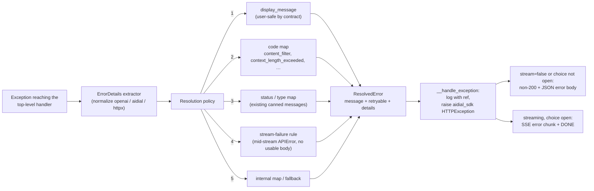

# Design: User-Facing Error Message Resolution

- **Status:** Implemented
- **Approved:** 2026-07-08
- **Dependencies:**
  - None

## Problem Statement

When a request fails, `_QuickAppCompletion` funnels every exception through a single handler that maps it to a
canned sentence via `resolve_exception_message` and appends it to the choice. The mapping is driven purely by
**exception type and HTTP status code**, which produces misleading and unactionable messages:

1. **The dominant complaint: "The AI model service encountered an internal error. Please try again later."**
   This is the bucket for *any* HTTP 5xx returned by DIAL Core on the orchestrator LLM call. DIAL Core is a
   proxy — a 5xx can mean an upstream provider outage, an adapter bug, a misconfigured deployment, an
   interceptor failure, or an error raised by a downstream application in a chain. All of these collapse into
   one sentence. The openai client has already retried transient failures (2 retries with backoff by default)
   before the user sees this, so "try again later" is often false hope for a deterministic failure.

2. **DIAL's `display_message` is discarded.** The DIAL error protocol carries a field explicitly designated as
   safe to show end users: `display_message`. It is present on `aidial_sdk.exceptions.HTTPException` and inside
   the JSON error body of openai exceptions when DIAL Core propagates an upstream error. The resolver never
   reads it — the precise, user-safe explanation frequently already exists and is thrown away.

3. **Mid-stream errors hit the weakest branch.** When a model fails *after* streaming has started, DIAL sends an
   `{"error": ...}` chunk over an HTTP 200 stream. The openai SDK surfaces this as a **plain `APIError`** (no
   status code), which matches none of the resolver's isinstance checks and falls through to the generic
   fallback ("Something went wrong…"), again discarding the error body. Long orchestrator streams make this a
   common production failure mode.

4. **Context-length and content-filter handling is dead code for the main path.** The resolver maps the
   in-process `aidial_sdk.ContextLengthExceededError` type, but the orchestrator calls the model through the
   openai client — a real context overflow arrives as `openai.BadRequestError` with
   `code == "context_length_exceeded"`. The user is told the request "was rejected — please try again", which
   retrying will never fix. Content-filter rejections (`code == "content_filter"`) get the same misleading text.

5. **"Contact your administrator" is a dead end.** The handler logs the full stack trace, but the user-visible
   message carries no correlation identifier, so the administrator being contacted has no way to find the
   corresponding log entry.

6. **The delivery mechanism hides the failure from the platform.** The handler appends the error sentence as
   ordinary assistant *content* over HTTP 200 (`choice.append_content`), bypassing DIAL's error protocol.
   Verified against the DIAL Core and DIAL Chat sources: DIAL Chat never sets its message-level `errorMessage`
   field for such a turn, so it renders as a normal successful reply — no error styling, no "Regenerate
   response" steering — and the error sentence is stored in message `content` and **replayed verbatim to the
   LLM as assistant history on every subsequent turn**, polluting context and inflating tokens. On the
   operations side, DIAL Core's analytics pipeline records the request as a `status: 200` success, making
   application failures invisible to status-based monitoring.

## Design Goals

- Surface DIAL's `display_message` to the user whenever the failing upstream provides one, regardless of which
  client library delivered the error (openai exception, aidial exception, raw httpx response).
- Classify errors by **error code** (e.g. `content_filter`, `context_length_exceeded`) before falling back to
  status-class messages, so actionable causes get actionable text.
- Handle mid-stream errors (plain `openai.APIError` carrying a DIAL error body) as first-class citizens instead
  of the generic fallback.
- Stamp every failure that reaches the top-level handler with a short **error reference** that also appears in
  the server log entry, making "contact your administrator" actionable. (Requests rejected before the handler —
  e.g. message-shape validation — already deliver correct protocol errors and carry no server-side stack trace
  worth correlating, so they are deliberately unstamped.)
- Stop advising "try again later" for failures classified as non-retryable.
- Never leak raw internal detail (stack traces, endpoints, header contents) into user-facing text — only
  `display_message` (user-safe by DIAL contract) and curated canned messages.
- Deliver errors through the DIAL error protocol — a non-200 response with an OpenAI-style error body where
  the response is not yet committed (non-streaming requests, failures before the choice opens), an SSE
  `{"error": ...}` chunk otherwise — so clients render a true error state, steer the user to regenerate, and
  keep the error text out of LLM-visible history.
- Never emit a status code that DIAL Core's balancer treats as retriable (429/502/503/504) — for an
  application, Core discards the response body for those and substitutes a generic error.

---

## Use Cases

### UC-1: Upstream failure with a display message

**Trigger:** The orchestrator LLM call fails with a 502 from DIAL Core; the propagated error body contains
`display_message: "Daily token budget exhausted for this key."`.\
**Behavior:** The resolver extracts the error body from the openai exception, finds `display_message`, and uses
it as the user-facing text, suffixed with the error reference.\
**Outcome:** The user sees the actual cause rendered as an error state (in DIAL Chat: a red error box)
instead of "The AI model service encountered an internal error." presented as a normal reply — and the
error text is not replayed to the LLM on the next turn.

### UC-2: Mid-stream model failure

**Trigger:** The model dies halfway through streaming a response; DIAL delivers an error chunk; the openai SDK
raises a plain `APIError` with the DIAL error body attached.\
**Behavior:** The resolver recognizes the body-carrying `APIError`, applies the same resolution order as for
status errors (display message → code map → status map), and produces a specific message. When the body
carries nothing usable (no display message, no known code, no usable status), the dedicated stream-failure
rule applies (Component 2, rule 4).\
**Outcome:** Instead of "Something went wrong with the execution of your request", the user sees the upstream
cause — or, in the fully degraded case, "The AI model service failed while responding. Please try again
later." — plus an error reference. The error is delivered as an SSE error chunk (Component 4): partial
content already streamed stays visible, with the error state rendered beneath it.

### UC-3: Context window exceeded

**Trigger:** The conversation grows past the model's context limit; DIAL returns 400 with
`code: "context_length_exceeded"` and the openai client raises `BadRequestError`.\
**Behavior:** The code map matches before the status map and selects the existing context-length message.\
**Outcome:** The user is told to shorten their messages — actionable — rather than "try again".

### UC-4: Content policy rejection

**Trigger:** The provider's content filter rejects the request; DIAL returns 400 with `code: "content_filter"`.\
**Behavior:** The code map selects a dedicated content-policy message.\
**Outcome:** The user understands the request was blocked by policy and that retrying verbatim will not help.

### UC-5: Genuinely unknown failure

**Trigger:** An unexpected exception (e.g. a bug in QuickApps itself) reaches the top-level handler.\
**Behavior:** No error body exists; the resolver falls back to the generic message, now suffixed with the error
reference. The handler logs the stack trace together with the same reference.\
**Outcome:** The user's screenshot or copy-paste contains a token the administrator can grep in the logs.

### UC-6: User recovers after a failed turn

**Trigger:** Any of UC-1–UC-5 ended the turn with a protocol error; the user wants to continue.\
**Behavior:** DIAL Chat stores the error in the message-level `errorMessage` field — which it excludes from
subsequent request bodies — and switches the composer to "Regenerate response", which deletes the failed
assistant message and resends the last user message.\
**Outcome:** The retried request replays a clean history: no error sentences, no half-finished assistant
turn. Today, by contrast, the error sentence is an ordinary assistant message that stays in history forever.

---

## Proposed Design

The change is contained in the `core/application` layer: a new error-detail extraction step, a re-ordered
resolution policy, and a structured result consumed by `_QuickAppCompletion.__handle_exception` — which now
delivers the error through the DIAL error protocol instead of appending chat text.



### Component 1: `ErrorDetails` extractor

**What:** A normalization step that converts any supported exception into a single value object:

```python
class ErrorDetails(BaseModel):
    model_config = ConfigDict(frozen=True)

    status_code: int | None
    code: str | None            # e.g. "content_filter", "context_length_exceeded"
    error_type: str | None      # DIAL/OpenAI "type" field
    message: str | None         # internal message — logged, never shown
    display_message: str | None # user-safe by DIAL contract
```

**Owner:** `_exception_message_resolver` (private helper within the module).

**Semantics:** One extraction function understands the four shapes an error reaches us in:

| Source                                | Where the details live                                                      |
|---------------------------------------|------------------------------------------------------------------------------|
| `openai.APIStatusError` (4xx/5xx)      | `.status_code` from the exception; all other fields from the unwrapped body  |
| plain `openai.APIError` (mid-stream)   | unwrapped body only (the SDK stores it pre-unwrapped); no status code        |
| `aidial_sdk.exceptions.HTTPException`  | native attributes: `status_code`, `code`, `type`, `display_message`          |
| `httpx.HTTPStatusError`                | `.response.status_code`; error JSON parsed best-effort from the response body |

**Body unwrapping (openai shapes).** For both openai shapes, `code`, `error_type`, `message`, and
`display_message` are read from `body.get("error", body)` — **never** from the exception's
`.code`/`.type`/`.message` attributes. openai populates those attributes from the *top level* of the response
body, while DIAL Core returns the OpenAI-compatible envelope `{"error": {code, message, type,
display_message}}` with the fields nested one level down — so on the dominant 4xx path
(`BadRequestError` etc.) the attributes are `None` and `.message` is openai's synthesized `"Error code: 400 -
{…}"` wrapper. Mid-stream errors are the asymmetric case: the SDK already stores the unwrapped error object as
`body`, for which `body.get("error", body)` is a no-op. This unwrap is what makes UC-3
(`context_length_exceeded`) and UC-4 (`content_filter`) — both arriving as `BadRequestError` — actually reach
the code map instead of regressing to the status ladder.

Extraction is **best-effort and total**: malformed or absent bodies yield an `ErrorDetails` with `None` fields,
never an exception. Bodies are only inspected, never mutated or re-serialized.

Two further normalization rules smooth over DIAL conventions:

- **Numeric-code backfill.** DIAL defaults `code` to the stringified status code (`str(status_code)`), so a
  mid-stream error body frequently carries `code: "429"` with no HTTP status of its own. When `status_code` is
  absent and `code` is a purely numeric string, the extractor backfills `status_code` from it (and leaves
  `code` as-is). This lets mid-stream rate limits and 5xx-class stream errors resolve through the ordinary
  status ladder.
- **`error_type` never influences resolution.** It is carried for two pass-through consumers: the log record
  written by Component 3, and the outgoing wire `type` field (Component 4), to which it is forwarded verbatim.

**Change:** New. Today no branch of the resolver reads error bodies at all.

### Component 2: Resolution policy

**What:** `resolve_exception_message` is reworked to resolve in a fixed precedence order over `ErrorDetails`,
returning a structured result instead of a bare string:

```python
class ResolvedError(BaseModel):
    model_config = ConfigDict(frozen=True)

    message: str            # user-facing text, sanitized, retry suffix already composed
    retryable: bool         # classification — logged by the handler; future telemetry dimension
    details: ErrorDetails   # extracted internals, carried for the handler's log record only
```

**Owner:** `_exception_message_resolver.resolve_exception` (the string-returning
`resolve_exception_message` is replaced; it has exactly one caller).

**Semantics — precedence order:**

1. **`display_message`**, when present. It is user-safe by DIAL contract, but it is still treated as untrusted
   *text*: rendered as plain text (no markdown interpretation is assumed) and capped in length (~500 chars,
   truncated with an ellipsis) so a misbehaving upstream cannot flood the chat.
2. **Code map** — a small, curated dictionary keyed on error `code` **strings only** (statuses live in the
   status map; numeric-string codes are backfilled into `status_code` by the extractor, see Component 1):

   | Code                       | Message class                                             | Retryable |
   |----------------------------|-----------------------------------------------------------|-----------|
   | `content_filter`           | "blocked by the content management policy"                | no        |
   | `context_length_exceeded`  | existing context-length message ("shorten your messages") | no        |
   | `truncate_prompt_error`    | existing context-length message                           | no        |

3. **Status / type map** — the existing canned-message ladders (AI-model wording for orchestrator-call
   errors, service wording for httpx errors), with the holes closed (see Secondary Fixes) and one structural
   change: each per-shape ladder returns **unresolved** (`None`) for an unmatched case instead of terminating
   with the fallback string as today, so precedence continues to the rules below. Status matching keys on the
   **normalized `ErrorDetails.status_code`** (i.e. post numeric-code backfill), not on exception attributes —
   this is what lets a backfilled mid-stream 429/5xx resolve to the specific rate-limit/internal-error text
   here rather than degrading to rule 4. The status-less *type* branches that exist today (`APITimeoutError`,
   `APIConnectionError`) remain part of this rule and therefore resolve **before** rule 4 — they are never
   misrouted to the stream-failure message.
4. **Stream-failure rule** — a plain `openai.APIError` (mid-stream error) that was not resolved by rules
   1–3 — whether because it carries no HTTP status even after the extractor's numeric-code backfill, or
   because the backfilled status matched nothing in the status ladder — gets a new dedicated constant,
   `_MSG_AI_MODEL_STREAM_FAILURE`: *"The AI model service failed while responding."* The rule is classified
   retryable, so the composed text ends with the appended retry sentence (see Retryability mechanism below) —
   exactly once. This is the terminal rule for the mid-stream path: no mid-stream error can reach the generic
   fallback.
5. **Internal exception map** — the existing `OrchestratorExceedMaxIterations` / toolset / initialization
   branches, unchanged in structure.
6. **Fallback** — the existing generic message.

**Retryability mechanism.** Message constants are reworked along a simple split: **retryable-classified
constants carry the cause only** — their advice *is* the appended retry sentence — while **non-retryable
constants carry cause + cause-specific advice** (e.g. "…contact your administrator", "…shorten your
messages"). No constant carries the retry phrase itself, so the append mechanism can never stack a retry
sentence on top of conflicting advice. The resolver composes the final `message`: when the resolution is
classified retryable (timeouts, `httpx.NetworkError` transport blips, 429s, 409 conflicts, and 5xx or stream
failures *without* a more specific code), it appends the standard sentence "Please try again later." —
exactly once. **`APIConnectionError` on the orchestrator path is classified non-retryable**: by the time it
surfaces, the openai client has already retried it, so it overwhelmingly indicates deterministic
misconfiguration (wrong endpoint, DNS, TLS). Consistent with the "false hope for deterministic failures"
critique in Problem Statement item 1, `_MSG_SERVICE_NO_CONNECTIVITY` keeps its admin-escalation advice
("…check connectivity or contact your administrator") instead of gaining the retry sentence. Raw
`httpx.NetworkError` from service calls gets no such client-level retry, so it stays retryable (cause-only
constant + appended sentence). Rules 5 and 6 are classified **non-retryable**: an internal invariant violation
or unknown bug will not be fixed by retrying, so the fallback becomes "Something went wrong with the
execution of your request. Please contact your administrator." `ResolvedError.retryable` therefore has no further effect
on the text in the handler — it is exposed so Component 3 can include it in the log record, and as the
natural dimension for future telemetry (Out of Scope). **`display_message` resolutions are terminal and never
retry-suffixed**: the upstream authored the complete user-facing text, and appending generic advice can
contradict it (e.g. a "daily budget exhausted" explanation followed by "try again later"). They are still
*classified* for the log record — `retryable` is derived from the underlying `ErrorDetails` status/code with
the same rules as above, defaulting to `False` when neither is available — but the text is used as-is (after
the plain-text/length sanitization of rule 1).

**Trade-off — trusting `display_message`:** the field is defined by the DIAL SDK as the user-displayable
message, and every hop in a DIAL chain is DIAL-operated infrastructure, so we honor it. The mitigations
(plain-text rendering, length cap) bound the damage of a buggy upstream. The alternative — ignoring it, as
today — is exactly the problem this design removes.

**Change:** the string-returning `resolve_exception_message` is replaced by `resolve_exception` returning
`ResolvedError`; the per-shape ladders switch from terminate-with-fallback to return-unresolved; all message
constants are reworded per the retryability split.

### Component 3: Error reference correlation

**What:** Every handled exception gets a short opaque reference (8 hex chars derived from a random UUID) that
appears in **both** the log record and the user-facing message.

**Owner:** `_QuickAppCompletion.__handle_exception` — generation and logging stay with the component that owns
the log call, keeping the resolver pure.

**Semantics:**

- The handler generates the reference and logs one `logger.exception` record containing: the reference, the
  exception (with stack trace), the extracted `ErrorDetails` internals (`message`, `code`, `error_type`,
  `status_code` — reached via `ResolvedError.details`), and `ResolvedError.retryable`. Internal detail
  belongs in logs.
- The user-facing text — carried in the outgoing `display_message` (Component 4) — is rendered as:
  `<resolved message> (error reference: <ref>)` — e.g. "Daily token budget exhausted for this key. (error
  reference: `a1b2c3d4`)", matching the Usage-table examples.
- The reference is a correlation token only — it carries no encoded meaning and is not persisted anywhere
  besides the log stream and the error text shown to the user.

**Change:** `__handle_exception` grows from two lines to: generate ref → resolve → log with ref → raise
(Component 4).

### Component 4: Error delivery via the DIAL error protocol

**What:** `_QuickAppCompletion.__handle_exception` no longer appends the resolved message to the choice as
assistant content. It logs (Component 3) and then **raises an `aidial_sdk.exceptions.HTTPException`** built
from `ResolvedError`, letting the SDK deliver it through the DIAL error protocol.

**Owner:** `_quick_app_completion.py` builds the exception; the aidial-sdk owns the wire format.

**Field mapping:**

| `HTTPException` field | Populated with |
|-----------------------|----------------|
| `display_message`     | the composed user-facing text + error reference — **always set** (see client behavior below) |
| `message`             | identical to `display_message` (including the error reference); internal detail stays in server logs only, retrievable via the reference |
| `code` / `type`       | propagated from `ErrorDetails` when present (e.g. `content_filter`, or DIAL's numeric-string `"429"`, which the backfill rule leaves as-is) |
| `status_code`         | per the outgoing-status policy below |

**SDK delivery (verified against the installed aidial-sdk):** the SDK picks the wire shape by position in
the chunk stream: a DIAL exception in the *first* position becomes a non-200 JSON response carrying
`json_error()`; any later position becomes an SSE `{"error": ...}` chunk followed by `[DONE]`
(`aidial_sdk.utils.streaming.to_streaming_response`). For non-streaming (`stream=false`) requests the SDK
raises the FastAPI error — a non-200 — wherever the exception occurred. One consequence must be stated
honestly: `create_single_choice()` enqueues the choice-open chunk on entry (`Choice.__enter__` → `open()`),
so for **streaming requests every failure inside the choice context — even before any visible content —
delivers as the mid-stream shape (HTTP 200 + SSE error chunk)**. The clean non-200 shape therefore applies
to non-streaming requests and to exceptions raised before the choice opens (e.g. message-shape validation).
This is acceptable: DIAL Chat treats both shapes identically for every property this design needs (error
state, exclusion from history, regenerate steering); the toast + trace id is a non-200-shape extra. Both
shapes carry `display_message`. A non-DIAL exception escaping `chat_completion` would be wrapped by the SDK
into a generic 500 `RuntimeServerError`; the handler always raises a fully-populated DIAL exception, so that
path stays a safety net rather than a delivery route.

**Control-flow restructuring in `chat_completion`:** today the method's `finally` block unconditionally
creates the "Execution time" stage (when `show_execution_time_stage` is enabled) after `__handle_exception`
runs. With a raising handler this would append a spurious stage *after* the resolved error. **Change:** the
`except` clause sets a failure flag that the `finally` consults — the execution-time stage is created only
when the flag is unset; the perf-timer stop and debug report in the same `finally` are kept. The raise thus
leaves the error chunk as the last meaningful event of the stream.

**Outgoing-status policy:** the app must never respond with **429, 502, 503, or 504**. DIAL Core treats
these as retriable; an application has a single synthetic upstream with a retry budget of one, so Core
cannot retry — it instead **discards the app's error body** and substitutes a generic `502`/`503` with no
analytics record (verified in DIAL Core's `DeploymentPostController` / `TieredBalancer`). Therefore:
client-attributable causes keep their natural non-retriable 4xx (400/401/403/404/413/422); everything else —
upstream 429/5xx, stream failures, timeouts, unknown internal errors — is emitted as **500**, with the true
cause preserved in `code` and the user-facing explanation in `display_message`. Core passes non-retriable
statuses and bodies through to the caller verbatim, and its analytics log records the true status for the
shapes that reach it as non-200 (non-streaming requests, pre-choice failures). Streaming-request failures
are necessarily logged by Core as 200 — the error chunk is still present in the logged response body — so
full operator visibility additionally rests on the app's own log record keyed by the error reference
(Component 3). This is still a strict improvement over today, where the failure is indistinguishable from a
successful answer in *both* places (Problem Statement item 6). One consequence for consumers: the emitted
`code` may not correspond to the emitted `status_code` — a `500` can carry `code: "429"` — because the
status is deliberately downgraded to dodge Core's balancer. `code` carries the true cause; `status_code` is
the transport classification.

**Client behavior (verified against the DIAL Chat sources):** DIAL Chat maps both error shapes onto the
message-level `errorMessage` field: the user gets a red error box (plus a toast with a trace id on the
non-200 shape), partial content and attachments already streamed remain visible, and the composer switches
to "Regenerate response". Critically, `errorMessage` is **excluded from subsequent request bodies** and the
failed message is deleted on regenerate — the error text never enters LLM-visible history. On the mid-stream
path DIAL Chat surfaces **only** `display_message` (the `message` field is dropped there), which is why the
field mapping above always sets it.

**Stage hygiene:** DIAL Chat renders a stage that was opened but never closed as a perpetual spinner, and its
error path does not auto-close stages, so every stage must be closed — with the right status — before the
exception propagates. Streaming stages are already covered: `ChatCompletionStreamHandler` closes them as
failed on error. Deferred stages are not: `DeferredStageCloseRegistry.flush()` takes no arguments and always
closes wrappers via a success-shaped `__exit__(None, None, None)`, and `Orchestrator._persisting_state`
calls it from a `finally` that runs on both the success and error paths. **Change:** `flush()` gains an
optional failure flag (default success, so the success path is untouched); `_persisting_state` passes the
failure flag exactly when it holds an exception to re-raise, and the registry then closes still-open
wrappers with failure exc-info so the stages render as failed. Owner: `DeferredStageCloseRegistry`
(`common/stage_close_registry.py`) for the interface, `Orchestrator._persisting_state` for the call site.

**State:** `Orchestrator._persisting_state` still persists choice state before re-raising, but a regenerate
in DIAL Chat deletes the failed message together with that state — the retried request starts from the last
successful turn. This is the desired outcome: a failed turn leaves no trace in either history or state.

**Change:** `__handle_exception` raises instead of appending; the exception escapes `chat_completion` into
the SDK. The deferred-stage flush on the error path closes stages as `failed`.

---

## Secondary Fixes

Small corrections that fall out of reviewing the same code paths:

- **httpx 401** — currently resolves to "An unexpected HTTP error occurred"; add a service-context
  authentication constant (`_MSG_SERVICE_AUTH_FAILED`) for it — the httpx ladder is the *service* wording
  family, so reusing the AI-model auth message would mislabel the failing component.
- **aidial plain 400** — the status ladder in `_resolve_aidial_error` skips 400 (only the `InvalidRequestError`
  *type* is matched); add it to the invalid-request branch.
- **openai 409 / 413** — currently fall to the fallback; map 409 to retryable service-conflict wording, and
  413 (*Payload Too Large* — request byte size, distinct from token-context overflow) to dedicated size
  wording: "The request payload is too large. Please reduce the size of your message or attachments."
- **Toolset identity in messages** — `ToolsetNotFoundException` / `ToolsetForbiddenException` carry a
  `toolset_id` that the resolver currently drops; include it in the message (it is configuration identity, not
  sensitive detail).
- **Redundant exception tuple** — `except (BadRequestError, APIError)` in `AssistantInvoker.invoke` and
  `Orchestrator.__invoke_and_accumulate_stream_with_recovery` — `BadRequestError` is a subclass of `APIError`;
  reduce to `except APIError` for clarity (no behavior change).
- **Misleading comment** — the subclass-ordering comment in `_resolve_httpx_error` describes a relationship
  that does not exist; fix alongside the refactor.

---

## Out of Scope

- **DIAL Chat's stuck-spinner asymmetry.** Chat strips still-open stages on manual stop but not on the error
  path, so an unclosed stage renders as a perpetual spinner. The app-side mitigation (closing stages as
  `failed` before raising, Component 4) is in scope; a client-side fix belongs to the ai-dial-chat repo.
- **The initialization-issues flow.** `ConfigResolutionException` (and skip-and-record tool/toolset init
  failures) bypass `__handle_exception`: `_InitializationErrorHandler` deliberately renders detailed
  diagnostics into the chat over HTTP 200 for the app-builder persona fixing their manifest. That flow shares
  the history-pollution caveat of Problem Statement item 6, but changing it is a separate UX decision — its
  audience *wants* rich in-chat diagnostics — and is deferred to its own pass.
- **Recovering LLM-fixable tool-call failures** (malformed JSON arguments in `ToolExecutor.execute`,
  hallucinated tool names) by feeding an error tool-message back to the model instead of aborting the turn.
  This is a change to orchestrator-loop semantics, not message resolution; the existing
  `InvalidToolCallParameterException` fallback pattern is the natural home, and it should be designed with
  retry-budget considerations.
- **Message catalog / i18n / per-deployment customization** of the canned texts. The refactor concentrates all
  strings in one module, which is the prerequisite; externalizing them is deferred until a real localization or
  white-labeling need appears.
- **Automatic retry policy changes.** The openai client's built-in retries (2, exponential backoff) are kept
  as-is; adding orchestrator-level retry loops risks doubling latency on deterministic failures.
- **Error-class metrics/telemetry.** The `ResolvedError` classification would be a natural metrics dimension;
  wiring it into monitoring is left to the observability backlog.

---

## Configuration / Usage Examples

How an error reaches the user (verified behavior of DIAL Core and DIAL Chat):

| Failure point | Wire format | DIAL Chat behavior |
|---------------|-------------|--------------------|
| Non-streaming request, or failure before the choice opens | non-200 + OpenAI-style JSON error body, passed through Core verbatim | red error box + toast with trace id; composer switches to "Regenerate response" |
| Streaming request, failure after the choice opens (with or without prior content) | SSE `{"error": ...}` chunk + `[DONE]` in the open 200 stream, forwarded by Core uninterpreted | partial content/attachments stay visible; red error box beneath; regenerate; no toast |

In both cases the error text lands in the message-level `errorMessage` field, which DIAL Chat excludes from
subsequent requests — the "After" texts below never re-enter the LLM context.

Before/after examples of the text the user sees (today: appended as a normal assistant reply; after:
rendered in the error state):

| Scenario | Today | After |
|----------|-------|-------|
| Upstream 502 with `display_message: "Daily token budget exhausted for this key."` | The AI model service encountered an internal error. Please try again later. | Daily token budget exhausted for this key. (error reference: `a1b2c3d4`) |
| Mid-stream model crash, error body without display message or usable code/status | Something went wrong with the execution of your request. Please try again or contact your administrator. | The AI model service failed while responding. Please try again later. (error reference: `a1b2c3d4`) |
| 400 `context_length_exceeded` from the model | The request was rejected by the AI model service. Please try again or contact your administrator. | The request exceeds the maximum context length of the AI model. Please shorten your messages and try again. (error reference: `a1b2c3d4`) |
| 400 `content_filter` | The request was rejected by the AI model service. Please try again or contact your administrator. | The request was blocked by the content management policy. Please rephrase your message. (error reference: `a1b2c3d4`) |
| Unknown internal bug | Something went wrong with the execution of your request. Please try again or contact your administrator. | Something went wrong with the execution of your request. Please contact your administrator. (error reference: `a1b2c3d4`) |

Administrator workflow: user reports the reference → `grep a1b2c3d4` over application logs → full stack trace
and internal error message at the matching record.

---

## Migration

### Breaking changes

- **Failures change wire shape.** Today every failure is an HTTP 200 completion whose content is an error
  sentence; after this design, failures surface as protocol errors — a non-200 JSON error body (non-streaming
  requests and failures before the choice opens), or an SSE `{"error": ...}` chunk in the 200 stream
  (streaming requests). This is the standard OpenAI-compatible contract and DIAL Chat handles it natively,
  but API consumers that treated QuickApps failures as successful completions must start handling error
  responses and in-stream error chunks.
- **Failed turns no longer produce assistant messages.** The error sentence no longer becomes part of
  conversation history (in DIAL Chat it lives in `errorMessage`, stripped from subsequent requests). Any
  workflow that read error text back out of the conversation must consume the error response instead.
- User-visible error **texts change** (that is the point): deployments that pattern-match on the exact canned
  sentences (e.g. alerting on chat transcripts) should switch to the error `code` — it carries the true cause;
  the HTTP status is the transport classification and may be deliberately downgraded (see the outgoing-status
  policy, e.g. a `500` carrying `code: "429"`).

### Non-breaking changes

- All resolution changes are internal to `core/application`; no config schema, no env vars, no DI wiring
  changes outside the module.
- Unit tests for the resolver (`test_exception_message_resolver.py`) are extended for the new precedence
  order, body extraction, and the no-leak guarantee (the existing `test_no_internal_detail_leaked` contract is
  kept and extended to the wire format: the outgoing `message` mirrors the sanitized text, so raw internal
  detail, stack traces, and URLs never leave the process — only via server logs keyed by the error reference).

## Summary of Changes

**`core/application/_exception_message_resolver.py`**

- Added: `ErrorDetails` value object + best-effort extractor over openai / aidial / httpx error shapes,
  including numeric-code → status backfill.
- Added: code map (`content_filter`, `context_length_exceeded`, `truncate_prompt_error`).
- Added: `_MSG_AI_MODEL_STREAM_FAILURE` constant — terminal rule for mid-stream `APIError` with no usable body.
- Added: `ResolvedError` (message + retryable + details) returned by the new `resolve_exception`;
  string-returning `resolve_exception_message` removed (single caller).
- Changed: resolution precedence — display message → code map → status/type map → stream-failure rule →
  internal map → fallback; per-shape ladders return unresolved (`None`) on a miss instead of terminating with
  the fallback string.
- Changed: all message constants (including `_FALLBACK_MESSAGE` and the internal-map messages) reworked —
  retryable-classified constants to cause-only, non-retryable to cause + specific advice, none carrying the
  retry phrase; the retry sentence is appended by the resolver exactly once for retryable classifications;
  internal-map and fallback resolutions are non-retryable; `display_message` resolutions are terminal and
  never retry-suffixed.
- Changed: plain `openai.APIError` (mid-stream) resolved via its body instead of falling to the fallback.
- Fixed: httpx 401 (new `_MSG_SERVICE_AUTH_FAILED` service-context constant), aidial 400, openai 409/413
  mappings; toolset id included in toolset messages; misleading subclass comment.

**`core/application/_quick_app_completion.py`**

- Changed: `__handle_exception` generates an error reference, logs it with the stack trace and internal error
  detail, and **raises `aidial_sdk.exceptions.HTTPException`** — `display_message` = `<message> (error
  reference: <ref>)`, sanitized `message`, propagated `code`/`type`, non-retriable `status_code` per the
  outgoing-status policy — instead of appending text to the choice. The SDK renders it as a non-200 response
  (non-streaming requests, pre-choice failures) or an SSE error chunk (streaming requests).
- Changed: the "Execution time" stage in `chat_completion`'s `finally` is skipped when an exception is in
  flight, so no spurious stage trails the error.

**`common/stage_close_registry.py`, `core/agent/orchestrator.py`**

- Changed: `DeferredStageCloseRegistry.flush()` gains an optional failure flag; `_persisting_state` passes it
  on the error path so still-open deferred stages close as `failed` (success path unchanged).

**`core/agent/assistant_invoker.py`, `core/agent/orchestrator.py`**

- Cleanup: redundant `(BadRequestError, APIError)` tuples reduced to `APIError` (no behavior change).

**Tests**

- Extended: resolver unit tests for extraction, precedence, retryability, and leak guarantees; completion
  handler test for reference formatting.
