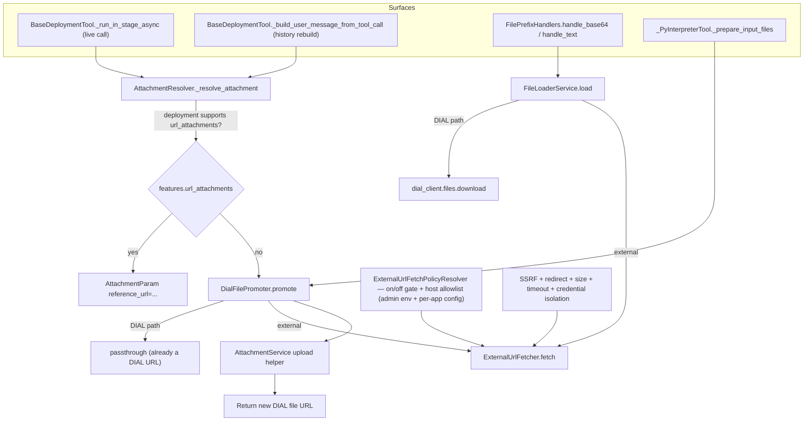
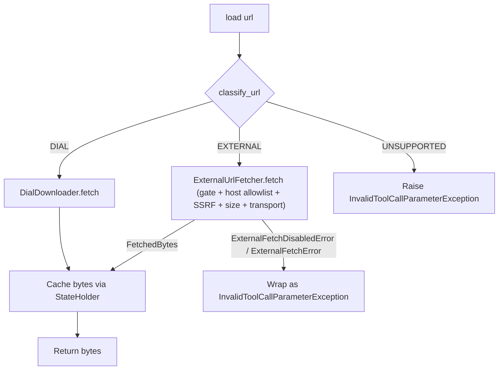
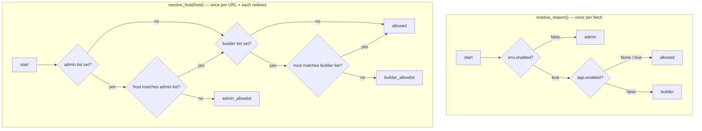

# Design: External URLs as First-Class File References

- **Status:** Implemented
- **Approved:** 2026-05-08
- **Dependencies:**
  - None

## Problem Statement

QuickApps' pipeline silently assumes that **every file reference points to DIAL Core File Storage**. Whenever a URL passes through the agent — whether it came from a user attachment, a system prompt, an LLM tool-call argument, or a chained tool result — the code that consumes it (forwarding to a deployment, decoding for a tool argument, staging for the interpreter) is hard-wired to the DIAL file path shape. As a consequence, an arbitrary public URL such as `https://example.com/report.pdf` is not usable anywhere it logically should be.

The same conceptual operation ("here is a URL — go use the file") fails differently in five places:

| # | Surface | Failing call site | What goes wrong |
|---|---------|-------------------|-----------------|
| 1 | RAG / deployment tools | `AttachmentResolver._resolve_attachment` (`src/quickapp/dial_deployment_tooling/_attachment_resolver.py`) | Calls `dial_client.metadata.get("files", url)` for every entry in `attachment_urls`; an external URL 404s. |
| 2 | REST/MCP tool, base64-inline | `FilePrefixHandlers.handle_base64` via `DialFileService.download_file` (`src/quickapp/dial_core_services/dial_file_service.py:25-42`) | Asks DIAL Core to download the URL via `dial_client.files.download`; DIAL doesn't own it. |
| 3 | REST/MCP tool, text-inline | `FilePrefixHandlers.handle_text` via the same service | Same path; same failure. |
| 4 | Python interpreter input | `_PyInterpreterTool._prepare_input_files` + `InputFileHandler.get_attachment_url` (`src/quickapp/internal_tooling/py_interpreter_tooling/_py_interpreter_tool.py:154-220`, `handlers/input_file_handler.py:17-50`) | The interpreter's `transferInputFile` endpoint is given a raw URL it can only resolve against DIAL. |
| 5 | Promotion to durable storage | `AttachmentService.upload_attachment_to_core` (`src/quickapp/dial_core_services/attachment_service.py:28-49`) | Only uploads when an `Attachment` carries inline `data`; there is no "take this URL, save it as a DIAL file" entry point. |

In every case the agent (or builder) made a perfectly reasonable choice — pass a URL to a tool — and the system collapses purely because the URL doesn't live in DIAL Core.

DIAL itself already provides both pieces of the contract that would make this work:

- A `reference_url` field exists on both inbound `Attachment` (validated SDK model, `aidial_sdk/chat_completion/request.py:21-49`) and outbound `AttachmentParam` (TypedDict, `aidial_client/types/chat/request_param.py:13-19`). On the validated inbound side, the model's `data XOR url` validator (lines 29-46) requires either `data` or `url`; `reference_url` is an additional descriptor, never the sole handle. On the wire-out side, `AttachmentParam` has no validator, so an attachment shaped `{reference_url: <external>, type: ..., title: ...}` is permissible.
- A deployment advertises whether it accepts URL-based attachments via `Deployment.features.url_attachments` (`aidial_client/types/deployment.py:19`).

QuickApps never consults that capability flag and never sets `reference_url` on its outbound `AttachmentParam`s. The inbound `Attachment.reference_url` is read (`_AttachmentFilter` surfaces it in the LLM-visible XML, `src/quickapp/agent/_attachment_filter.py:36-40`) but the outbound side always emits `AttachmentParam(url=...)` instead.

The agent-facing skill `tool-call-file-parameter-formatting` already documents `file:url::https://...` examples (Example 9 in `config/predefined/skills/tool-call-file-parameter-formatting/SKILL.md` shows a multi-file upload tool fed external `https://` URLs); the runtime is the only thing that doesn't deliver.

## Design Goals

- **One shared "fetch from URL" path** with a single security envelope (SSRF, redirect cap, size limit, credential isolation), used by every surface that needs the actual bytes.
- **One shared "promote URL to DIAL file" API** that interpreter staging, RAG fallback, and any future "cache this fetched file" caller all go through.
- **Capability-driven dispatch on the deployment path.** Forward as a `reference_url` when `Deployment.features.url_attachments` is advertised; materialise to a DIAL file otherwise.
- **Two-tier egress control.** Admin-level env settings cap the surface; per-app config fields refine within that cap. Two orthogonal axes are gated this way:
    - **On/off switch** — when the admin disallows egress, no app can opt back in; when the admin allows it, individual apps can opt out.
    - **Domain allowlist** — admin can restrict outbound fetches to a specific list of hosts; apps can further narrow that list. An app's allowlist never expands what the admin permits. When neither tier specifies a list, any external host that passes the SSRF envelope is reachable.

  The deployment-handoff branch (where bytes never leave DIAL) is unaffected by any tier.
- **Every external-fetch failure surfaces as `InvalidToolCallParameterException`** at every consumer of `classify_url` (`FileLoaderService.load`, `DialFilePromoter.promote`, `_resolve_attachment`, `InputFileHandler.get_attachment_url`), so the agent's existing retry path applies uniformly across unsupported schemes, SSRF blocks, oversize files, disabled egress, and disallowed hosts.
- **Failure messages name the offending URL and the closing tier** (admin / builder, gate / allowlist) so operators and builders can diagnose policy issues from a single line of agent-visible text or server log.

---

## Use Cases

### UC-1: Agent passes an external URL to a RAG / DIAL deployment that supports URL attachments

**Trigger:** The orchestrator invokes a deployment tool with `attachment_urls=["https://example.com/whitepaper.pdf"]`. The deployment's metadata advertises `features.url_attachments == true`.

**Behaviour:** `AttachmentResolver._resolve_attachment` classifies the URL as external, skips the `metadata.get("files", ...)` lookup, and emits `AttachmentParam(reference_url="https://example.com/whitepaper.pdf", type=..., title=...)`. QuickApps does not download the bytes; the deployment fetches them itself.

**Outcome:** The deployment receives the URL as a reference attachment. QuickApps' egress surface is untouched — the outbound fetch comes from the deployment's own host, which is the audit-log and network-policy boundary operators expect for that resource.

### UC-2: Agent passes an external URL to a deployment that does **not** support URL attachments

**Trigger:** Same as UC-1, but the deployment advertises `features.url_attachments` as `false`, `None`, or absent.

**Behaviour:** `AttachmentResolver._resolve_attachment` classifies the URL as external, hands it to `DialFilePromoter.promote(url)` (see Proposed Design), which fetches the bytes through the shared `ExternalUrlFetcher`, uploads them to the caller's DIAL File Storage via the existing upload path, and returns the resulting DIAL `url`. The resolver then emits a regular `AttachmentParam(url=<dial-url>, type=..., title=...)`.

**Outcome:** The deployment sees a normal DIAL attachment and proceeds. The agent-visible behaviour is identical to UC-1; only the wire-level shape and who fetches the bytes differ.

### UC-3: Agent passes a mixed list of DIAL paths and external URLs

**Trigger:** `attachment_urls=["files/bucket/local.pdf", "https://example.com/external.pdf"]` against any deployment.

**Behaviour:** Each entry is classified independently. Order is preserved. DIAL paths route through the existing `dial_client.metadata.get("files", ...)` resolver; external URLs route through UC-1 or UC-2 depending on the deployment's `features.url_attachments`.

**Outcome:** The deployment receives a mixed `attachments` list whose entries are each shaped appropriately for what the deployment accepts.

### UC-4: Agent calls a REST/MCP tool with `file:base64::https://...` or `file:text::https://...`

**Trigger:** Tool argument value matches `^/*file:(base64|text)::https?://...` (the existing `FILE_PATTERN`, `src/quickapp/common/file_reference_pattern.py:3-5`).

**Behaviour:** `_FileArgumentTransformer` calls the new `FileLoaderService.load(url)`, which classifies the URL and dispatches: DIAL → existing `dial_client.files.download`; external → `ExternalUrlFetcher.fetch`. The `base64` / `text` post-processing in `FilePrefixHandlers` is unchanged — the bytes look the same regardless of source.

**Outcome:** The tool receives the same base64 string or decoded text it would receive for a DIAL-hosted file.

### UC-5: Agent stages an external file as input to the Python interpreter

**Trigger:** A prior message's `custom_content.attachments` contains an `Attachment` whose `url` is an external `https://` URL (e.g. `https://example.com/dataset.csv`). The agent calls the interpreter with this URL in `attachment_urls`. The inbound `Attachment` validator (`data XOR url`) means the URL must be present on `url`; a `reference_url`-only inbound attachment cannot exist.

**Behaviour:** `_PyInterpreterTool._prepare_input_files` finds the matching attachment in conversation history, classifies the URL, and routes through `DialFilePromoter.promote(url)` to materialise the bytes as a DIAL file. The interpreter then receives a `sourceUrl` it can resolve (the new DIAL URL).

**Outcome:** External CSVs/PDFs can be staged for the interpreter. The dev-DIAL cross-upload case (`InputFileHandler.get_attachment_url`, `handlers/input_file_handler.py:27-48`) remains unchanged when the source URL is itself a DIAL URL on a different DIAL instance.

### UC-6: Internal caller wants to persist a fetched URL as a durable DIAL file

UC-6 is the **conceptual** capability shared by UC-2 and UC-5; it does not introduce a new agent-facing surface. It enumerates the contract of `DialFilePromoter.promote(url)` so the API is reviewable independently from its current consumers.

**Trigger:** An internal caller (today: deployment-attachment fallback in UC-2; interpreter staging in UC-5) needs a DIAL file URL for a given URL of any kind.

**Behaviour:** `DialFilePromoter.promote(url)` is the single API. It fetches via `ExternalUrlFetcher` on the external branch, reads metadata via `dial_client.files.get_metadata` on the DIAL branch, and (on the external branch) uploads via `AttachmentService.upload_bytes` — a public alias of the internal `_upload_bytes` helper that the existing `upload_attachment_to_core` flow also delegates to. The alias exists because the promoter wants the raw upload without the swallow-and-return-original-attachment semantics that `upload_attachment_to_core` keeps for back-compat. The result is cached per request so a URL referenced multiple times in one turn produces one upload.

**Outcome:** Future callers (e.g. a "cache this" tool) drop into the same API without reinventing fetch+upload. The single API also localises decisions about filename derivation, MIME inference, and bucket selection.

### UC-7: SSRF, oversize file, unsupported scheme, or disallowed host

**Trigger:** Any of: a URL whose host resolves to loopback / RFC1918 / link-local / cloud-metadata; a redirect target that fails the same check; a fetch that exceeds the configured size limit; a `file:` URL or non-`http(s)` scheme; a host that is not in the effective domain allowlist (UC-10 / UC-11).

**Behaviour:** `ExternalUrlFetcher` raises a typed exception (`ExternalFetchError` for envelope violations, `ExternalFetchDisabledError` for policy denials such as a closed gate or a disallowed host). Every consuming surface translates either exception into `InvalidToolCallParameterException` with a parameter-aware message — the same retry pipeline that already exists for binary-text mismatches and missing prefixes. The agent gets a clear instruction back; the request continues.

**Outcome:** Egress is bounded. Errors are diagnosable. The agent can re-route (e.g. ask the user for a DIAL upload) without the request collapsing.

### UC-8: Operator disables external egress entirely (admin cap)

**Trigger:** `EXTERNAL_URL_FETCH_ENABLED=false` (the default).

**Behaviour:** `ExternalUrlFetcher.fetch` raises `ExternalFetchDisabledError` immediately, before any DNS lookup. UC-1 (deployment with `features.url_attachments == true`) continues to work — no QuickApps egress happens on that branch. UC-2 / UC-4 / UC-5 / UC-6 fail with a clear message naming the operator-level switch. **Per-app overrides (UC-9) are ignored on this branch** — when the admin gate is closed, a builder cannot opt their app back in.

**Outcome:** Operators can keep the egress surface closed in environments where it isn't desired (regulated tenants, air-gapped deployments) without losing the deployment-handoff path or breaking DIAL-internal flows. The admin policy is a hard cap, not a default.

### UC-9: Builder opts a single app out of external egress (within admin-allowed)

**Trigger:** `EXTERNAL_URL_FETCH_ENABLED=true` AND the app's manifest sets `features.external_url_fetch.enabled: false`.

**Behaviour:** The fetcher raises `ExternalFetchDisabledError` for any caller within the request, with a message naming the per-app switch (same exception type as UC-8, different reason). Other apps in the same process — same admin policy, no per-app `false` — keep the feature.

**Outcome:** A builder running a security-sensitive or PII-handling app can disable external fetches even when the admin globally allows them, without forcing the operator to split deployments. This is the inverse symmetric case of UC-8: admin caps from the top; builder narrows from below.

### UC-10: Operator restricts external fetches to a specific set of hosts (admin allowlist)

**Trigger:** `EXTERNAL_URL_FETCH_ENABLED=true` AND `EXTERNAL_URL_FETCH_HOST_ALLOWLIST` is set to a non-empty list (e.g. `example.com,*.public-cdn.net`). The fetcher receives a URL whose host is not on that list.

**Behaviour:** `ExternalUrlFetcher.fetch` raises `ExternalFetchDisabledError` with reason `admin_allowlist`, before any DNS lookup. Hosts that *are* on the list proceed through the normal pipeline (SSRF guard, redirect cap, size limit). Each redirect hop's host is re-checked against the same list.

**Outcome:** Operators can permit external egress in principle while still constraining outbound traffic to a known, audited set of upstreams (e.g. a corporate document store, a public dataset host). The blocklist-based SSRF guard and the allowlist are independent and both must pass.

### UC-11: Builder narrows the allowlist for a single app (within admin's set)

**Trigger:** Admin allowlist contains `example.com, public-cdn.net, partner.io`; the app's manifest sets `features.external_url_fetch.host_allowlist: ["example.com"]`. The fetcher receives a URL with host `partner.io`.

**Behaviour:** The effective allowlist for this request is the intersection of the admin and builder lists — `{example.com}`. The fetch is rejected with `ExternalFetchDisabledError` reason `builder_allowlist`. A URL with host `example.com` would proceed.

**Outcome:** Builders can scope a particular app's egress more tightly than the operator-wide policy without operator involvement, and cannot expand it. This is the symmetric case of UC-9 for hosts: admin caps from the top; builder narrows from below. An app whose builder list contains a host the admin doesn't allow is effectively locked out of that host — the empty intersection is the configuration error, surfaced as a `builder_allowlist` denial.

---

## Proposed Design

The change is structurally small: introduce three new shared primitives (URL classifier, external fetcher, DIAL file promoter), make the existing file-loading service scheme-aware, and wire one capability check into the deployment-attachment resolver. Every surface enumerated in the Problem Statement consumes those primitives instead of growing its own.



The two-tier egress policy (on/off gate plus host allowlist) and the security envelope both apply to every call into `ExternalUrlFetcher.fetch`; the deployment-handoff branch (UC-1, `reference_url` emission) never reaches the fetcher and is therefore unaffected by either.

### URL classification

**What:** A small, pure helper that decides what kind of reference a string is — a DIAL-relative path / DIAL-absolute URL, an external `http(s)` URL, or unsupported. Single source of truth for the distinction; every surface consumes it.

**Owner:** `src/quickapp/common/url_classification.py` (new file). Returns a `UrlScheme` enum: `DIAL`, `EXTERNAL`, `UNSUPPORTED`.

**Semantics:**

| Input shape | Classification | Examples |
|-------------|---------------|----------|
| Bare DIAL relative path | `DIAL` | `files/bucket/foo.pdf`, `files/{hash}/Foo.pdf` |
| DIAL-absolute URL (host equals configured `DialSettings.url`) | `DIAL` | `<DIAL_URL>/files/bucket/foo.pdf` (path is illustrative; the host comparison is the contract) |
| `http(s)://` URL whose host is *not* the configured DIAL host | `EXTERNAL` | `https://example.com/foo.pdf`, `https://gist.github.com/.../raw/x.md` |
| `file:`, `ftp:`, `data:`, anything else, or malformed | `UNSUPPORTED` | `file:///etc/passwd`, `ftp://...`, `not a url` |

**Why split DIAL-absolute from external by host comparison.** A URL whose host is the configured DIAL endpoint must be routed through the authenticated DIAL client (it carries DIAL-scoped permissions, requires the API key, and bypasses egress gating). Treating it as external would either fail (no API key on the request) or leak DIAL-internal headers. The host comparison is one line in one place; localising it here means no other surface needs to know about it.

**Change:** A new abstraction. Today none of `dial_completion_service.py`, the file-transfer handlers, or the interpreter's input file handler distinguish DIAL paths from external URLs at all — they assume DIAL. The classifier introduces the distinction in one place so every surface adds the same branch.

### `ExternalUrlFetcher` — shared security envelope

**What:** A request-scoped service that wraps `httpx.AsyncClient` with the security envelope mandated by the issue. The single egress point for every external fetch QuickApps performs.

**Owner:** `src/quickapp/common/external_fetch/external_url_fetcher.py` (new file). Bound at request scope.

**Public API:** one async method, `fetch(url) -> FetchedBytes`. `FetchedBytes` is a small frozen Pydantic model carrying `bytes`, `content_type` (best-effort, from `Content-Type`), and `filename` (best-effort, from `Content-Disposition` or the URL path). Everything the downstream `base64`/`text`/upload pipeline needs.

**Security envelope (enforced uniformly, no per-surface knobs):**

| Concern | Behaviour | Reuses |
|---------|-----------|--------|
| **Credential isolation** | `httpx.AsyncClient` is constructed with **no DIAL API key, no bearer token, and no DIAL-internal headers**. No request headers are forwarded outbound in Phase 1. | New. |
| **SSRF guard** | Resolves the host before connecting; rejects loopback (`127.0.0.0/8`, `::1`), RFC1918 (`10/8`, `172.16/12`, `192.168/16`), link-local (`169.254/16`, `fe80::/10`), and the cloud-metadata literal (`169.254.169.254`). Re-checks on every redirect target. | New. `ipaddress` stdlib + a custom `httpx.AsyncHTTPTransport`. |
| **Redirect cap** | At most 5 redirects (configurable via env, but a hard ceiling of 10). Each hop is SSRF-checked. | `httpx` already supports a max-redirect setting; the SSRF check on each hop is the new piece. |
| **Size limit** | Reuse `FileLoadingSizeLimitResolver` (`src/quickapp/common/file_loading_size_limit_resolver.py`). Streams in chunks; aborts the download if the running total exceeds the resolved limit. `Content-Length` is used as a pre-check when present. | Same resolver `DialFileService.download_file` uses today. |
| **Timeout** | Reuse `ToolTimeoutResolver` for the per-call ceiling; on the deployment-attachment path, use the deployment's resolved tool timeout. | Existing resolver. |
| **Binary/text policy** | Unchanged — `FilePrefixHandlers.handle_text` already enforces this on the result bytes. The fetcher does not interpret the body. | Existing. |

**Errors:** Two exception classes co-located in the same file as `ExternalUrlFetcher`: `ExternalFetchError(reason: Literal["ssrf_block", "size_limit", "redirect_cap", "timeout", "transport"])` for security-envelope violations and transport failures; `ExternalFetchDisabledError(reason: Literal["admin", "builder", "admin_allowlist", "builder_allowlist"])` for policy denials raised before any DNS lookup or network egress. The first two reasons cover the on/off gate (UC-8 / UC-9); the latter two cover the host allowlist (UC-10 / UC-11). Each exception carries a human-readable message naming the offending URL and which tier closed the gate. Consumers re-raise as `InvalidToolCallParameterException` so the agent's existing retry path applies. Unsupported schemes (covered in UC-7) never reach the fetcher — they are rejected upstream by `classify_url` and the consuming services (`FileLoaderService.load`, `DialFilePromoter.promote`), which raise `InvalidToolCallParameterException` directly. The `ExternalFetchError` reason set is therefore narrower than UC-7's full error matrix on purpose.

**Change:** New service. Centralises every concern that today is either absent (SSRF) or duplicated ad-hoc (timeouts, in three places: `_rest_api_tool.py:80`, `_py_interpreter_client.py:46`, `_interactive_login_service.py:93`). The other call sites are not migrated by this design — `RestApiTool` already has its own egress policy for tool-defined HTTP — but the fetcher is the shared egress for *file* loading.

### `FileLoaderService` — scheme-aware bytes loader

**What:** A request-scoped service with one method `load(url: str, parameter_name: str = "<unknown>") -> bytes` that supersedes `DialFileService.download_file`. Used by every caller that wants the *bytes* of a URL (today: `_FileArgumentTransformer` for `file:base64::` and `file:text::`). Callers thread the originating tool-argument name through `parameter_name` so that any failure surfaces as `InvalidToolCallParameterException(parameter_name=...)` and the agent retry pipeline attributes the error to the right parameter. Dispatches on URL classification, applies the per-request bytes cache (`StateHolder`), enforces the same size limit on both branches.

**Owner:** `src/quickapp/file_transfer/_file_loader_service.py` (new file). Bound at request scope.

**Semantics:**



The DIAL branch keeps the existing logic verbatim — `dial_client.files.get_metadata` for size pre-check, `dial_client.files.download` for the bytes. The external branch consumes `ExternalUrlFetcher.fetch`, which returns a `FetchedBytes` (bytes + best-effort `content_type` + `filename`); `FileLoaderService.load` keeps only the bytes (its callers don't need the metadata). Both branches share the `StateHolder` cache (already keyed by URL string) so a URL referenced multiple times in one request fetches once.

**Change:**

| Component | Before | After |
|-----------|--------|-------|
| `DialFileService.download_file(url)` | Method on `DialFileService` doing DIAL-only download. | DIAL-download logic extracted into a new request-scoped `DialDownloader` consumed by `FileLoaderService`. `DialDownloader.fetch` returns `(bytes, FileMetadata)` — the metadata is already fetched for the size pre-check, and the loader writes it to `StateHolder` alongside the bytes so that a later `DialFileService.download_file` cache-hit returns a real `FileMetadata` (callers like `_edit_file_tool` need `metadata.etag` for `If-Match`). `DialFileService.download_file` itself stays with its `(bytes, FileMetadata \| None)` tuple shape for `dial_files_tooling/` consumers; unifying the two DIAL-download paths is tracked as a follow-up (see `claude/issues/dial-download-path-unification.md`). |
| `_FileArgumentTransformer.__init__` | Takes `DialFileService`. | Takes `FileLoaderService`. |
| `FilePrefixHandlers.handle_base64 / handle_text` | Take a `DialFileService`. | Take a `FileLoaderService`. |

`grant_permissions_to_files` is **not** generalised — granting a DIAL resource permission to a DIAL toolset has no meaning for an external URL. MCP tools that mark a parameter `dial_url: true` retain their existing DIAL-only semantics; if the resolved URL is external, the MCP tool fails with the existing `InvalidToolCallParameterException` ("Files cannot be shared because the URL is not a DIAL file"). The agent can re-route via `file:base64::` / `file:text::`.

### `DialFilePromoter` — single "URL → DIAL file metadata" API

**What:** A request-scoped service with one method `promote(url: str, parameter_name: str = "<unknown>") -> FileMetadata` that materialises any URL as a durable DIAL file and returns its metadata. `FileMetadata` is the SDK type `aidial_client.types.metadata.FileMetadata` returned by `dial_client.files.get_metadata` and `dial_client.files.upload`; the promoter does not introduce a wrapper. Callers (`_resolve_attachment`, `_PyInterpreterTool._prepare_input_files` via `InputFileHandler`) thread the originating tool-argument name through `parameter_name` so policy and envelope failures surface as `InvalidToolCallParameterException(parameter_name=...)`. The single shared API for the deployment-attachment fallback (UC-2) and interpreter staging of external files (UC-5).

**Owner:** `src/quickapp/dial_core_services/dial_file_promoter.py` (new file). Bound at request scope. Sits in `dial_core_services/` because it integrates with DIAL Core (`AsyncDial.files.get_metadata` for DIAL URLs and `AttachmentService.upload_bytes` for materialised external bytes); the external-fetch leg goes through the `common/external_fetch/` infrastructure.

**Why colocated with the loader rather than under `dial_core_services/`.** The promoter depends on `ExternalUrlFetcher` (in `file_transfer/`) for the external branch. Today the import direction is `file_transfer/` → `dial_core_services/`; placing the promoter under `dial_core_services/` would invert it and force `dial_core_services/` to import from `file_transfer/`. Keeping the promoter in `file_transfer/` preserves the current direction. The DIAL upload work it performs goes through `AttachmentService` (still in `dial_core_services/`) via the factored helper, which is the standard direction.

**Relationship with `FileLoaderService`.** The two services are orthogonal:

| Service | Use case | DIAL branch | External branch |
|---------|----------|-------------|-----------------|
| `FileLoaderService.load(url) -> bytes` | Caller wants the bytes themselves. | `DialDownloader.fetch` (DIAL Core download API). | `ExternalUrlFetcher.fetch` → take `.bytes`. |
| `DialFilePromoter.promote(url) -> FileMetadata` | Caller wants a durable DIAL file. | `dial_client.files.get_metadata(url)` — passthrough; no upload (the URL already names a DIAL file). | `ExternalUrlFetcher.fetch` → upload bytes via the factored `AttachmentService` helper → return new metadata. |

The promoter goes directly to `ExternalUrlFetcher` and `dial_client.files.get_metadata` — never via `FileLoaderService`. They share the underlying primitives but neither depends on the other. This avoids forcing a single internal contract (bytes-only vs metadata-rich) on both consumers and avoids a redundant cache layer.

**Caches.** Two distinct per-request caches, both keyed by the input URL string:

- `StateHolder` (existing) — bytes, populated by `FileLoaderService.load` on either branch.
- New small map inside `DialFilePromoter` — `FileMetadata` keyed by the originating URL, so the same URL referenced multiple times produces one upload (external branch) or one metadata read (DIAL branch).

Two caches is correct here: the loader's consumers (file-prefix handlers) only need bytes and would pay an unused metadata cost otherwise; the promoter's consumers (deployment fallback, interpreter staging) only need metadata and would pay a doubled-cache memory cost otherwise. Sharing them would force one shape on both.

**Semantics:**

1. Classify the URL.
2. **DIAL** — already a DIAL file; read metadata once via `dial_client.files.get_metadata` and cache the `FileMetadata`. No upload.
3. **EXTERNAL** — fetch via `ExternalUrlFetcher` (gated by `ExternalUrlFetchPolicyResolver`, which combines the admin env switch, the per-app config, and the host allowlist); upload via `AttachmentService.upload_bytes(bytes, content_type, filename) -> FileMetadata`, the public alias of the internal helper that `upload_attachment_to_core` also delegates to; cache the resulting metadata keyed by the original external URL.
4. **UNSUPPORTED** — raise `InvalidToolCallParameterException`.

The returned `FileMetadata` carries `url` (DIAL absolute), `content_type`, and `name` — the triple `_resolve_attachment` needs to build an `AttachmentParam`.

**Bucket and filename derivation.** Uses the same `dial_client.bucket.get_raw()` + `appdata or bucket` pattern that `AttachmentService.upload_attachment_to_core` (`src/quickapp/dial_core_services/attachment_service.py:35-44`) and `InputFileHandler.get_attachment_url` (`handlers/input_file_handler.py:41-47`) already use. Filename derivation is best-effort: `Content-Disposition` `filename=` if present → the URL path's last non-empty segment if present → a generated placeholder of the form `external-{sha256(url)[:16]}{extension_from_content_type}` (e.g. `external-1a2b3c4d5e6f7a8b.pdf`). `extension_from_content_type` is `mimetypes.guess_extension(content_type)` from the stdlib, falling back to no extension when the content-type is unknown or absent. The hash-derived placeholder keeps file names stable across retries of the same URL within a request and avoids collisions in the bucket. Uploaded files inherit the standard per-bucket naming used by today's upload paths; the promoter does not introduce a new namespace.

Both upstream-derived branches (`Content-Disposition` and URL path) pass through `_sanitize_external_filename`, which keeps only the last path segment (split on both `/` and `\`), drops control characters, runs the existing `sanitize_filename` (collapses ``\\ / : * ? " < > |`` and whitespace to `-`), and strips leading dots. The interpolation into `files/{bucket}/{filename}` therefore cannot be steered out of the bucket by a malicious upstream serving e.g. `Content-Disposition: attachment; filename="../../poison.pdf"`. When sanitisation yields the empty string (separator-only or dot-only inputs), the derivation falls through to the URL path and then to the hash placeholder.

### Capability-aware deployment-attachment resolution

**What:** Attachment URL → `AttachmentParam` resolution becomes scheme-aware and capability-aware. The single call site that today silently assumes DIAL paths now dispatches on URL classification and the deployment's `features.url_attachments`.

**Owner:** `src/quickapp/dial_deployment_tooling/_attachment_resolver.py` (request-scoped `AttachmentResolver`). Consumed by `DialCompletionService` (live-call path) and `BaseDeploymentTool._build_user_message_from_tool_call` (history-rebuild path). Originally landed inside `DialCompletionService` and was extracted in a follow-up to give the dispatch its own single-responsibility seam.

**Resolution table:**

| URL classification | `features.url_attachments` | Output |
|--------------------|----------------------------|--------|
| `DIAL` | (any) | `AttachmentParam(url=<resolved DIAL url>, type=..., title=...)`. |
| `EXTERNAL` | `true` | `AttachmentParam(reference_url=url, title=<URL filename>)`. No QuickApps fetch. |
| `EXTERNAL` | `false` / `None` / absent | `DialFilePromoter.promote(url)` → `AttachmentParam(url=<new DIAL url>, type=..., title=...)`. QuickApps fetches and uploads. |
| `UNSUPPORTED` | (any) | `InvalidToolCallParameterException` with the offending URL and a hint. |

QuickApps deliberately does **not** issue a HEAD probe on the `EXTERNAL` + supported branch — `AttachmentParam.type` is optional in the TypedDict (`aidial_client/types/chat/request_param.py:13-19`), and probing would itself be QuickApps-originating egress, contradicting the "untouched egress" guarantee in UC-1 and UC-8. The deployment infers the type from its own fetch.

**Interaction with the `file:url::` prefix.** `_resolve_attachment` already strips the `file:` prefix via `strip_file_prefix` (defined in `src/quickapp/common/file_reference_pattern.py`). Classification operates on the post-strip URL, so `file:url::https://example.com/x.pdf` and `https://example.com/x.pdf` reach `classify_url` as the same input. The prefix-stripping step is therefore the canonical normalisation point on this path — a future contributor adding logic *before* the strip must take the prefixed form into account; logic *after* is dealing with bare URLs.

**Where `features.url_attachments` is read.** The resolver needs the deployment metadata. Two access patterns are already established in the codebase:

- `DialDeploymentTool` configs are built from a one-shot metadata fetch in `ToolConfigCoreService._convert_to_openai_tool_format`; that snapshot drops `features` after extracting `input_attachment_types` and `features.configuration`.
- `DialAppToolingModule` (`docs/designs/dial_app_toolset.md`) routes per-request via `ToolConfigCoreService.get_deployment_metadata(deployment_id)` and inspects `features.mcp`.

This design extends the snapshot path: `_convert_to_openai_tool_format` retains `features.url_attachments` on `DialDeploymentTool` as a new `supports_url_attachments: bool` field. The flag is read directly off `self.tool_config` inside `BaseDeploymentTool` (which already holds the `DialDeploymentTool`) and reaches `resolve_attachment_urls` two ways: passed through `complete_request_async` on the live-call path (`_run_in_stage_async` → `complete_request_async` → `resolve_attachment_urls`), and as a direct argument on the history-rebuild call (`_build_user_message_from_tool_call` → `resolve_attachment_urls`). No additional metadata fetch per request.

**Why snapshot rather than fetch-per-request.** The capability is read once per `DialDeploymentTool` construction; that construction already involves a deployment-metadata fetch cached process-wide in `DialDeploymentToolCacheService`. Making the resolver fetch metadata again would be a second roundtrip per tool call. The cache has no TTL today (`src/quickapp/common/deployment_tool_cache.py`), so an operator who flips `features.url_attachments` on a deployment sees the change only after the **next process restart** — same staleness profile as `input_attachment_types` and `features.configuration` already have. If that surfaces operationally, adding a TTL to the cache is a cross-cutting follow-up.

**Change:** `_resolve_attachment` (currently a one-line `metadata.get` + `AttachmentParam` build) becomes a 4-branch dispatch. The `supports_url_attachments: bool` parameter is added on `complete_request_async`, threaded through `__build_request_messages` → `__user_message_from_content_and_attachments` → `resolve_attachment_urls` → `_resolve_attachment` so every call site that builds an outbound attachment list sees the flag. `BaseDeploymentTool` reads `self.tool_config.supports_url_attachments` once and passes it to `complete_request_async` (live call) and `resolve_attachment_urls` (history rebuild).

### Tool argument transformer (`file:base64::`, `file:text::`)

**What:** `_FileArgumentTransformer` and `FilePrefixHandlers` consume `FileLoaderService` instead of `DialFileService.download_file`.

**Owner:** `src/quickapp/file_transfer/_file_argument_transformer.py`, `_file_prefix_handlers.py`.

**Semantics:** `file:url::https://example.com/x` continues to be passthrough — strip the prefix, return the bare URL. `file:base64::https://...` and `file:text::https://...` go through `FileLoaderService.load`, which classifies and dispatches.

**Change:** Constructor parameters; `FilePrefixHandlers.handle_base64 / handle_text` signatures.

### Python interpreter input staging

**What:** `_PyInterpreterTool._prepare_input_files` and `InputFileHandler` route external URLs through `DialFilePromoter.promote(url)` before staging.

**Owner:** `src/quickapp/internal_tooling/py_interpreter_tooling/_py_interpreter_tool.py`, `handlers/input_file_handler.py`.

**Semantics:**

- The matching attachment in conversation history is found as today (URL-suffix match against `attachments_urls_map`).
- Before calling `client.transfer_input_file(InputFileTransferDto(sourceUrl=url, ...))`, classify the matched URL. DIAL paths (same DIAL or the dev-DIAL upload variant at `handlers/input_file_handler.py:27-48`) keep their existing behaviour.
- External → `DialFilePromoter.promote(url)`, then pass the resulting DIAL URL to `transfer_input_file`. If the dev-DIAL upload path is also active, the promoter result is uploaded there next, identical to the existing dev path.

**Change:** `InputFileHandler` is currently instantiated inline (`InputFileHandler()` at `_py_interpreter_tool.py:189`) with no DI binding and constructs its own `AsyncDial` instances; consuming `DialFilePromoter` requires it to become a DI participant. Add `@inject` to `InputFileHandler`, register it in `InternalToolModule` at request scope, and have `_PyInterpreterTool` inject it. `get_attachment_url` gains the `external` branch and consumes `DialFilePromoter` (also injected). The existing dev-DIAL upload behaviour is preserved. The wiring change is a real structural step (new DI binding, new injection points), not a one-line patch.

*Considered alternative:* dissolving the handler into `_PyInterpreterTool`. Rejected to keep staging logic isolated from orchestration; `InputFileHandler` is the natural seam for the dev-DIAL cross-upload case and benefits from being independently testable.

### Operational gating (two-tier)

**What:** Egress is gated by two layers, mirroring the `FileLoadingConfig` pattern (`src/quickapp/config/application.py:59-79` + `src/quickapp/common/file_loading_size_limit_resolver.py`). Two orthogonal axes are gated through this composition: **on/off** (does egress happen at all) and **host allowlist** (which destinations are reachable). The deployment-handoff branch (UC-1) is **not** gated — no QuickApps egress happens there, and neither tier reaches it.

**Implementation cadence.** The on/off axis (`enabled`, `EXTERNAL_URL_FETCH_ENABLED`, the corresponding `admin` / `builder` reasons) shipped first within this PR; the host-allowlist axis (`host_allowlist` env + per-app field, `match_host`, `resolve_host`, the corresponding `admin_allowlist` / `builder_allowlist` reasons, the per-redirect-hop re-check) is staged in the same PR as a follow-on commit. Both axes are designed together because they share the resolver, the error class, the SSRF transport's redirect-hop integration, and the agent-facing retry contract — splitting the design would force forward-references in either half.

#### Admin tier — env settings

**Owner:** New `BaseSettings` class `ExternalFetchSettings` in `src/quickapp/common/external_fetch/external_fetch_settings.py`, mirroring `FileLoadingSettings`. Singleton.

| Setting | Env | Default | Notes |
|---------|-----|---------|-------|
| `enabled` | `EXTERNAL_URL_FETCH_ENABLED` | `false` | Admin cap. When `false`, no app can fetch externally regardless of its manifest. |
| `host_allowlist` | `EXTERNAL_URL_FETCH_HOST_ALLOWLIST` | `None` | Optional comma-separated list of host patterns (see [Domain matching semantics](#domain-matching-semantics)). When unset, no admin-level host restriction (any host that passes the SSRF envelope is reachable). When set, only listed hosts are reachable; per-app builder lists can narrow but never expand this set. Independent from the SSRF blocklist — both must pass. |
| `max_redirects` | `EXTERNAL_URL_FETCH_MAX_REDIRECTS` | `5` | Hard ceiling 10 enforced by validator. Not per-app overridable; SSRF policy is uniform. |
| `connect_timeout_seconds` | `EXTERNAL_URL_FETCH_CONNECT_TIMEOUT_SECONDS` | `5` | Read/total timeout reuses `ToolTimeoutResolver`. The resolver is request-scoped and returns the app-level tool-timeout default; every consuming surface — `_FileArgumentTransformer`, `DialFilePromoter`, and `_resolve_attachment` (reached during `BaseDeploymentTool.complete_request_async`) — runs inside a tool call and therefore inherits a timeout budget. |

The SSRF *blocklist* itself remains static (loopback / RFC1918 / link-local / multicast / reserved / CGNAT / unspecified). The new `host_allowlist` is layered *on top of* the blocklist and is about explicitly enumerating reachable upstreams, not punching holes in the SSRF guard.

#### Builder tier — per-app config

**Owner:** New `ExternalUrlFetchConfig` Pydantic model on `ApplicationConfig.features` (`src/quickapp/config/application.py`), sibling of `FileLoadingConfig`.

| Field | Type | Default | Notes |
|-------|------|---------|-------|
| `enabled` | `bool \| None` | `None` | Builder-level override of the on/off gate. `None` means "follow the admin tier". `true` is a no-op when admin allows; meaningless when admin disallows. `false` opts this app out even when admin allows. |
| `host_allowlist` | `list[str] \| None` | `None` | Builder-level allowlist override. `None` means "follow the admin tier". A list narrows: a host must be in *both* the admin and the builder list to be allowed. An explicit empty list (`[]`) means "no host allowed by this app" — a deliberate lock. Patterns follow the same matching rules as the admin list. |

**Why this shape (and why these defaults).** Mirrors `FileLoadingConfig.size_limit: int | None` exactly: `None` defers to env, an explicit value overrides. Adopting the existing pattern means operators and builders already understand the precedence model, the field is documentable in one sentence, and the implementation is a one-method resolver that follows a known precedent. The defaults — admin off, builder unset — bias toward the conservative outcome: external egress is disabled until *both* an operator and (implicitly) a builder choose otherwise.

Why per-app **narrowing** for the host list rather than per-app **substitution**: the admin's allowlist is the operator-controlled audit boundary (logged, reviewable, change-managed). If apps could substitute their own list, a malicious or careless manifest could route egress to upstreams the operator never reviewed. Intersection preserves the audit boundary while letting builders tighten further. This is the same direction the on/off switch points: env sets a cap, app *narrows* it.

Why a per-app **opt-out** rather than per-app **opt-in** when admin allows: the admin gate is the meaningful security boundary; once admin policy permits external fetches, requiring every app to also opt in would be a second redundant switch with no additional security value (a malicious or careless app's manifest can flip an opt-in just as easily as an opt-out). The per-app field is for builders running narrower-trust apps (PII processors, regulated data flows) who want to disable a capability the deployment otherwise grants. This is the same direction `FileLoadingConfig.size_limit` points: env sets a default, app *narrows* it.

#### Domain matching semantics

Host patterns in either tier follow these rules, applied case-insensitively to the URL's host component (port and userinfo ignored):

| Pattern | Matches | Does not match |
|---------|---------|----------------|
| `example.com` | `example.com` | `sub.example.com`, `example.com.evil.com` |
| `*.example.com` | `sub.example.com`, `a.b.example.com` (any number of labels ≥ 1) | `example.com` itself, `notexample.com`, `evil-example.com` |
| `*.example.com` AND `example.com` (both listed) | both apex and any subdomain | (n/a) |

The wildcard form is the only pattern variant. Mid-string wildcards (`api*.example.com`), suffix wildcards (`example.*`), regex, and CIDR-by-host are out of scope — they invite mistakes, and exact-or-`*.x.y` covers the operator use cases the issue raises (CDN domains, partner APIs, public datasets).

IP-literal hosts (`https://1.2.3.4/...`) are not matchable via the allowlist. If the admin or builder list is set and the URL's host is an IP literal, the fetch is rejected (the SSRF guard remains responsible for IP-level filtering; the allowlist is purely a domain-name policy). IDNs / Unicode hostnames are the operator's responsibility to normalise to ASCII (punycode) when configuring; matching is byte-equality on the lowered ASCII form.

#### Effective-policy resolution

**Owner:** Request-scoped `ExternalUrlFetchPolicyResolver` in `src/quickapp/common/external_fetch/external_url_fetch_policy_resolver.py`, mirroring `FileLoadingSizeLimitResolver`. The resolver exposes two methods:

- `resolve_reason() -> "admin" | "builder" | "allowed"` — the on/off gate, called once per fetch.
- `resolve_host(host) -> "admin_allowlist" | "builder_allowlist" | "allowed"` — the host check, called once per URL (and re-called on each redirect target).



`ExternalUrlFetcher.fetch` consumes the resolver in this order: (1) `resolve_reason()` — if not `"allowed"`, raise `ExternalFetchDisabledError` immediately; (2) `resolve_host(url.host)` — if not `"allowed"`, raise `ExternalFetchDisabledError` with the matching reason. Both checks happen before DNS lookup. On each redirect hop the SSRF transport additionally re-runs `resolve_host` against the redirect target's host so an allowlist-passing URL cannot redirect to a disallowed one.

The error message names which tier rejected (admin or builder) and whether the rejection was the on/off gate or the allowlist, so operators and builders can tell from logs whose policy is in effect. UC-1 is unaffected because it never reaches the fetcher.

**Precondition:** The two tiers compose; they do not race. The resolver is request-scoped and reads both `ExternalFetchSettings` (singleton) and `ApplicationConfig` (already request-scoped) once. A request that sees admin=allow + app=opt-out behaves identically on every code path that matters to a request that sees admin=disallow — both raise `ExternalFetchDisabledError` from the same fetcher entry point. The only operator-visible difference is the error reason.

**Why a dedicated env switch rather than `@preview_module`.** `@preview_module` toggles entire feature modules at process start (`src/quickapp/common/preview.py`); it is appropriate for "this feature is not yet GA." External URL handling here is GA-shaped (the SDK contract is stable, the security envelope is non-negotiable), but operators in regulated tenants still need an off-switch — and individual app owners may want to narrow the surface further. A dedicated env var separates "feature maturity" from "egress policy", and the per-app field separates "deployment-wide policy" from "per-app trust posture". `@preview_module` could express none of these distinctions.

### Schema and skill alignment

**Schema.** The `attachment_urls` parameter on auto-generated deployment tools is already typed `array[string]` (declared in `ToolConfigCoreService._convert_to_openai_tool_format`). The string description ("Attachment url related to tool call. Use full url.") is updated to explicitly state that both DIAL paths and external `https://` URLs are accepted. `make dump_app_schema` regenerates `docs/generated-app-schema.json`.

**Skill.** `config/predefined/skills/tool-call-file-parameter-formatting/SKILL.md` already documents external URL examples (Example 6 — `fetch_resource(resource_url=...)`; Example 9 — multi-file upload with `file:url::` array). The skill body is reaffirmed with one note: external URLs may fail with a clear error if the operator has disabled egress (or the per-app config has opted out), and the agent should fall back to asking the user for a DIAL upload in that case.

**Docs.** `docs/file_transfer.md` (today says "DIAL-relative URL or an external URL" but the implementation only handles DIAL — see `docs/file_transfer.md:35`) is updated to describe the actual runtime: classification, capability-driven dispatch on the deployment path, the SSRF/size envelope, and the operator gate.

---

## Secondary Fixes

### Parameter-aware errors on unresolvable attachments

Previously, when `DialCompletionService._resolve_attachment` was handed a URL DIAL Core doesn't own, the error surfaced as a raw `DialException` with status 404 — no parameter context, no agent-actionable hint. The new `AttachmentResolver` catches every classification and unsupported-scheme case and raises `InvalidToolCallParameterException(parameter_name="attachment_urls", message=...)`. The retry pipeline in `StagedBaseTool` already converts that to a retry response (`docs/file_transfer.md:138-145`), so the agent gets a clear "use file:base64:: instead" or "this URL scheme is not supported" message instead of a generic deployment failure.

### Document the URL semantics

`CONFIGURATION.md` and `docs/file_transfer.md` are updated to describe:

- Which surfaces accept external URLs and which DIAL paths.
- The role of `Deployment.features.url_attachments` in dispatch.
- The two-tier egress policy: the `EXTERNAL_URL_FETCH_ENABLED` admin switch and the per-app `features.external_url_fetch.enabled` opt-out, plus the security envelope.
- The list of blocked address ranges.

`docs/agent.md` mentions the new modules in the DI module list and the new `_resolve_attachment` dispatch.

### MCP `dial_url: true` parameters reject external URLs explicitly

The MCP transformer already requires DIAL files for `dial_url: true` parameters because permission-grant only makes sense for DIAL resources (`docs/file_transfer.md:124-132`). The error today is "dial_toolset_id is not configured." The new explicit case is "the resolved URL is external; `dial_url` parameters require a DIAL file. Use `file:base64::` or `file:text::` instead." Same exception type; clearer message.

---

## Out of Scope

- **Authenticated external URLs.** No outbound credentials (Basic, custom Bearer, OAuth). Builders that need authenticated external sources should configure a REST tool with explicit credentials. Adding credential support here would re-introduce all the per-surface security questions the design intentionally collapses.
- **Streaming bytes through QuickApps without buffering.** The size limit implies a buffered fetch. A streaming variant is a possible future optimisation but adds substantial complexity (back-pressure, partial-error handling, MIME inference without the full body) for callers that today don't need it. A future pass would need a streaming `FetchedBytes` variant that yields chunks, back-pressure-aware size enforcement that works without `Content-Length`, and a streaming `AttachmentService.upload_stream` helper to forward to DIAL Core's chunked-upload endpoint.
- **Cross-request URL caching.** Per-request `StateHolder` caching is preserved on both branches. A process-wide cache for external URLs (analogous to `DialDeploymentToolCacheService`) would have to grapple with cache invalidation, max-age headers, and per-tenant isolation — none of which are needed for the cases in the issue.
- **Operator-tunable SSRF carve-outs.** The IP-level blocklist (loopback / RFC1918 / link-local / multicast / reserved / CGNAT / unspecified) is static and not operator-tunable. Punching holes in the SSRF guard for legitimate internal endpoints (e.g. a tenant who needs to fetch from `10.x`) remains out of scope; if that need surfaces, a separate `EXTERNAL_URL_FETCH_BLOCKLIST_OVERRIDES` setting would be added with its own design. The `EXTERNAL_URL_FETCH_HOST_ALLOWLIST` introduced here is *layered on top of* the SSRF guard, not in place of it — both must pass.
- **Smarter MIME inference.** `Content-Type` from the fetch is good enough; we do not perform binary signature detection on the fetched bytes for type guessing. The existing binary detection in `FilePrefixHandlers.handle_text` continues to be the policy enforcer for "is this text-decodable."
- **Migrating the other ad-hoc `httpx.AsyncClient` call sites** (`_rest_api_tool.py`, `_py_interpreter_client.py`, `_interactive_login_service.py`) onto a shared client. Those have distinct policies (REST tools deliberately accept arbitrary URLs configured by builders; the interpreter client targets a fixed sandbox; interactive login targets DIAL Core). Sharing a transport for *file* loading — the case the issue raises — is sufficient.

---

## Configuration / Usage Examples

### Default operator deployment (egress on)

```bash
EXTERNAL_URL_FETCH_ENABLED=true
DEFAULT_FILE_LOADING_SIZE_LIMIT=10485760  # 10 MiB, also applies to external fetches
```

Per-app override of the size limit (already supported, no change):

```json
{
  "features": {
    "file_loading": { "size_limit": 5242880 }
  }
}
```

### Egress disabled by admin (regulated tenant)

```bash
EXTERNAL_URL_FETCH_ENABLED=false  # default
```

Behaviour:

- Deployments that advertise `features.url_attachments == true` continue to receive `reference_url` attachments — DIAL Core fetches the bytes, not QuickApps.
- Any `file:base64::https://...` / `file:text::https://...` tool call returns a retry response: "External URL fetching is disabled by operator policy. Upload the file to DIAL and pass `files/...` instead."
- Interpreter staging of an external URL fails with the same message.
- Per-app `features.external_url_fetch.enabled: true` in any manifest is **ignored** — the admin gate is a hard cap.

### Egress allowed by admin, disabled per app (security-sensitive app)

```bash
EXTERNAL_URL_FETCH_ENABLED=true
```

App manifest:

```json
{
  "features": {
    "external_url_fetch": { "enabled": false }
  }
}
```

Behaviour:

- Other apps in the same process keep external fetches.
- This app's external fetches fail with the same retry response, citing the per-app override.
- The deployment-handoff branch (UC-1) is unaffected: this app can still pass an external URL to a `url_attachments`-capable deployment via `reference_url`. No QuickApps egress occurs there in any case.

### Egress allowed by admin, default (typical case)

```bash
EXTERNAL_URL_FETCH_ENABLED=true
```

App manifest omits `features.external_url_fetch` entirely. The resolver returns `allowed`; external fetches proceed under the security envelope. This is the path most apps take once an operator has decided to permit the egress surface.

### Admin restricts external fetches to a vetted host list

```bash
EXTERNAL_URL_FETCH_ENABLED=true
EXTERNAL_URL_FETCH_HOST_ALLOWLIST=example.com,*.public-cdn.net,partner.io
```

Behaviour:

- Fetches against `example.com`, `cdn.public-cdn.net`, `a.b.public-cdn.net`, or `partner.io` proceed (subject to SSRF + size + redirect limits).
- A fetch against `evil.com` raises `ExternalFetchDisabledError(reason="admin_allowlist")`, before DNS lookup. Agent receives a retry response naming the operator-level setting.
- A redirect from `example.com` to `evil.com` is rejected mid-pipeline by the same check on the redirect target.
- The deployment-handoff branch (UC-1) is unaffected — the deployment fetches the URL itself, no QuickApps egress.

### Builder narrows the allowlist for a high-trust app

```bash
EXTERNAL_URL_FETCH_ENABLED=true
EXTERNAL_URL_FETCH_HOST_ALLOWLIST=example.com,*.public-cdn.net,partner.io
```

App manifest:

```json
{
  "features": {
    "external_url_fetch": {
      "host_allowlist": ["example.com"]
    }
  }
}
```

Behaviour:

- Fetches against `example.com` from this app proceed.
- Fetches against `partner.io` from this app raise `ExternalFetchDisabledError(reason="builder_allowlist")` — the host is in the admin list but not the builder list.
- Other apps without the per-app override keep the full admin set.
- An app whose manifest names a host not in the admin list (e.g. `["intranet.local"]`) sees its fetches rejected with `builder_allowlist` because the intersection with the admin list is empty for that host. The admin list is a hard cap; the builder list never expands it.

### Mixed-source RAG call

The agent emits:

```json
{
  "tool_call": {
    "name": "rag_tool",
    "arguments": {
      "query": "compare these reports",
      "attachment_urls": [
        "files/bucket/internal-report.pdf",
        "https://example.com/competitor-whitepaper.pdf"
      ]
    }
  }
}
```

If the deployment behind `rag_tool` advertises `features.url_attachments`:

- `internal-report.pdf` → `AttachmentParam(url="<resolved DIAL url>")`
- `competitor-whitepaper.pdf` → `AttachmentParam(reference_url="https://example.com/competitor-whitepaper.pdf")`

Otherwise:

- `internal-report.pdf` → `AttachmentParam(url="<resolved DIAL url>")`
- `competitor-whitepaper.pdf` → fetched + uploaded to the caller's DIAL bucket → `AttachmentParam(url="<new DIAL url>")`

Order is preserved; the deployment receives a single `attachments` list.

### Agent calls a base64-expecting tool with an external URL

```json
{ "image_data": "file:base64::https://example.com/photo.jpg" }
```

`FileLoaderService.load` classifies the URL as external, fetches via `ExternalUrlFetcher` (if egress is enabled), and `FilePrefixHandlers.handle_base64` returns the base64 string to the tool.

---

## Migration

### Breaking changes

None for application configs, agent-facing schemas, or callers. `DialDeploymentTool` gains a `supports_url_attachments: bool = False` field, but the type is constructed in-process by `_convert_to_openai_tool_format` and cached by `DialDeploymentToolCacheService`; it is not user-serialised. The cache has no TTL, so an operator who flips `features.url_attachments` on a DIAL deployment sees the new behaviour only after a process restart — same operational profile that already applies to `input_attachment_types` and `features.configuration`.

### Non-breaking changes

- New env vars (`EXTERNAL_URL_FETCH_ENABLED`, `EXTERNAL_URL_FETCH_*`, including the newly-in-scope `EXTERNAL_URL_FETCH_HOST_ALLOWLIST`) all have safe defaults; the admin cap is **off** by default and the host allowlist is **unset** by default (no admin-level host restriction once the cap is open). The new per-app `features.external_url_fetch` field defaults to absent, which the resolver treats as "follow the admin tier" — no existing manifest needs to be updated. Both `enabled` and `host_allowlist` sub-fields default to `None`.
- New `FileLoaderService`, `ExternalUrlFetcher`, and `DialFilePromoter` services in DI; downstream consumers (`_FileArgumentTransformer`, `FilePrefixHandlers`, `_PyInterpreterTool`, `DialCompletionService`) switch to them. Internal-only — no public type renames.
- File-prefix handlers and other bytes-only callers migrate from `DialFileService.download_file` to `FileLoaderService.load`. `DialFileService.download_file` itself retains its existing `(bytes, FileMetadata | None)` shape for `dial_files_tooling/` consumers that need the etag for `If-Match` semantics; unifying the two DIAL-download paths is tracked as a follow-up (`claude/issues/dial-download-path-unification.md`). Internal-only — no public consumer.
- `_resolve_attachment` accepts external URLs.
- The auto-generated `attachment_urls` parameter description on deployment tools is reworded to mention external URLs explicitly. The schema **shape** is unchanged (`array[string]`), but the schema **dump** in `docs/generated-app-schema.json` changes the description string.
- The new `features.external_url_fetch` field (default-absent) lands in `docs/generated-app-schema.json` as a non-breaking addition; existing manifests need no update. Operators running schema diffs will see this delta and the description-string delta in the same `make dump_app_schema` regeneration.

---

## Summary of Changes

**New files:**

- `src/quickapp/common/url_classification.py` — `UrlScheme` enum, `classify_url(url) -> UrlScheme`. Single source of truth for the DIAL-vs-external distinction.
- `src/quickapp/common/external_fetch/external_fetch_settings.py` — `ExternalFetchSettings` (`BaseSettings`) with `EXTERNAL_URL_FETCH_ENABLED`, `EXTERNAL_URL_FETCH_HOST_ALLOWLIST` (parsed from a comma-separated list), redirect cap, connect timeout. Singleton.
- `src/quickapp/common/external_fetch/external_url_fetch_policy_resolver.py` — `ExternalUrlFetchPolicyResolver` with two methods: `resolve_reason()` for the on/off gate and `resolve_host(host)` for the allowlist check. Request-scoped. Combines the admin tier (`ExternalFetchSettings.enabled` + `host_allowlist`) and the builder tier (`ApplicationConfig.features.external_url_fetch.enabled` + `host_allowlist`) into per-axis effective decisions; mirrors `FileLoadingSizeLimitResolver` for the singleton/request layout.
- `src/quickapp/common/external_fetch/host_pattern_match.py` — small pure helper `match_host(host, patterns) -> bool` implementing the exact-or-`*.suffix` matching rule used by both tiers. Single source of truth, easy to unit-test in isolation from the resolver.
- `src/quickapp/common/external_fetch/external_url_fetcher.py` — `ExternalUrlFetcher` with the shared security envelope; `ExternalFetchError` and `ExternalFetchDisabledError` co-located in the same module. Consumes `ExternalUrlFetchPolicyResolver` for the gate check. Request-scoped.
- `src/quickapp/file_transfer/_file_loader_service.py` — `FileLoaderService.load(url)`. Request-scoped. Dispatches on `UrlScheme`; reuses `StateHolder` for per-request caching.
- `src/quickapp/dial_core_services/dial_file_promoter.py` — `DialFilePromoter.promote(url) -> FileMetadata`. Request-scoped. Depends on `ExternalUrlFetcher` (external branch, via `common/external_fetch/`) and `AttachmentService` (DIAL upload, sibling in `dial_core_services/`).
- `src/quickapp/dial_deployment_tooling/_attachment_resolver.py` — `AttachmentResolver` with the 4-branch dispatch (DIAL / external+supports / external+materialise / unsupported). Request-scoped. Originally lived inside `DialCompletionService` and was extracted in a follow-up to give the resolution its own single-responsibility seam, shared by the live-call path (`DialCompletionService.create_user_message_with_attachments`) and the history-rebuild path (`BaseDeploymentTool._build_user_message_from_tool_call`).

**Modified files:**

- `src/quickapp/config/application.py` — `Features` gains `external_url_fetch: ExternalUrlFetchConfig = Field(default_factory=ExternalUrlFetchConfig, ...)` (sibling of `file_loading`). `ExternalUrlFetchConfig` carries `enabled: bool | None = None` (on/off override) and `host_allowlist: list[str] | None = None` (per-app domain allowlist; intersects with the admin list, never expands it). Both default to "follow the admin tier".
- `src/quickapp/dial_core_services/dial_file_service.py` — bytes-only DIAL-download logic extracted into a new request-scoped `DialDownloader` in the same directory, consumed by `FileLoaderService`. `DialFileService.download_file` retained (with its `(bytes, FileMetadata | None)` tuple shape) for `dial_files_tooling/` callers needing `FileMetadata.etag`; unifying the two paths is tracked as a follow-up (`claude/issues/dial-download-path-unification.md`). `grant_permissions_to_files` unchanged.
- `src/quickapp/dial_deployment_tooling/dial_completion_service.py` — `complete_request_async`, `__build_request_messages`, and `__user_message_from_content_and_attachments` thread a new `supports_url_attachments: bool` parameter so every outbound attachment-list construction sees the flag. The attachment resolution itself is delegated to the injected `AttachmentResolver` (extracted into its own file).
- `src/quickapp/dial_deployment_tooling/base_deployment_tool.py` — reads `self.tool_config.supports_url_attachments` once and passes it to `complete_request_async` (live call) and to `AttachmentResolver.resolve_attachment_urls` (history rebuild).
- `src/quickapp/config/tools/deployment.py` (`DialDeploymentTool`) — gains `supports_url_attachments: bool = False`. Populated by `_convert_to_openai_tool_format`.
- `src/quickapp/dial_core_services/tool_config_service.py` — `_convert_to_openai_tool_format` reads `deployment.features.url_attachments` and sets the new field. The `attachment_urls` parameter description is updated to mention external URLs explicitly.
- `src/quickapp/file_transfer/_file_argument_transformer.py` — constructor takes `FileLoaderService`. The transformer threads the originating tool-argument key into `FileLoaderService.load(..., parameter_name=key)` so policy / envelope failures attribute to the correct parameter.
- `src/quickapp/file_transfer/_file_prefix_handlers.py` — `handle_base64`, `handle_text` take `FileLoaderService` and accept `parameter_name`, threading it to `FileLoaderService.load`.
- `src/quickapp/dial_core_services/attachment_service.py` — upload body factored into an internal helper `_upload_bytes(bytes, content_type, filename) -> FileMetadata`, exposed via a public alias `upload_bytes` for callers (today: `DialFilePromoter`) that want the raw upload without `upload_attachment_to_core`'s "swallow exception, return original attachment" branch. Public `upload_attachment_to_core` signature unchanged.
- `src/quickapp/internal_tooling/py_interpreter_tooling/_py_interpreter_tool.py`, `handlers/input_file_handler.py` — external branch added; routes through `DialFilePromoter`.
- `src/quickapp/file_transfer/file_transfer_module.py` — bind `_FileArgumentTransformer` and `FileLoaderService` at request scope.
- `src/quickapp/application/app_module.py` — bind `ExternalFetchSettings` as a singleton and `ExternalUrlFetchPolicyResolver`, `ExternalUrlFetcher` at request scope (the `common/external_fetch/` trio).
- `src/quickapp/dial_core_services/dial_core_services_module.py` — bind `DialFilePromoter` at request scope, alongside `AttachmentService` / `DialDownloader`.
- `src/quickapp/dial_deployment_tooling/dial_deployment_tooling_module.py` — bind `AttachmentResolver` at request scope, alongside `DialCompletionService`.
- `config/predefined/skills/tool-call-file-parameter-formatting/SKILL.md` — note the operator-egress-disabled fallback in "Common Mistakes."
- `docs/file_transfer.md`, `docs/agent.md`, `CONFIGURATION.md` — document the classification, dispatch, security envelope, and env switches.
- `docs/generated-app-schema.json` — regenerated via `make dump_app_schema` (description string change on `attachment_urls`; new `features.external_url_fetch` object).

**Unchanged:**

- `aidial_sdk` and `aidial_client` types (`Attachment`, `AttachmentParam`, `Deployment`, `Features`). The fields the design relies on (`reference_url`, `url_attachments`, `input_attachment_types`) are already in the SDKs.
- `_AttachmentFilter` (`src/quickapp/agent/_attachment_filter.py`) — already reads and surfaces `reference_url` to the LLM.
- The `file:` prefix grammar and `FILE_PATTERN` (`src/quickapp/common/file_reference_pattern.py`).
- `RestApiTool`, `_PyInterpreterClient`, `InteractiveLoginService` egress paths — out of scope; their HTTP clients are not migrated.
- `AttachmentService.upload_attachment_to_core` public signature — its body is factored into an internal `_upload_bytes` helper (exposed via the public `upload_bytes` alias for the promoter), but the public method continues to accept `Attachment(data=..., url=None)` and persist it; existing callers (`internal_tooling/py_interpreter_tooling/handlers/display_content_processor.py:67`) need no change.
- `DialDeploymentToolCacheService` — process-wide cache of `DialDeploymentTool` snapshots already memoises the `features.url_attachments` read.
