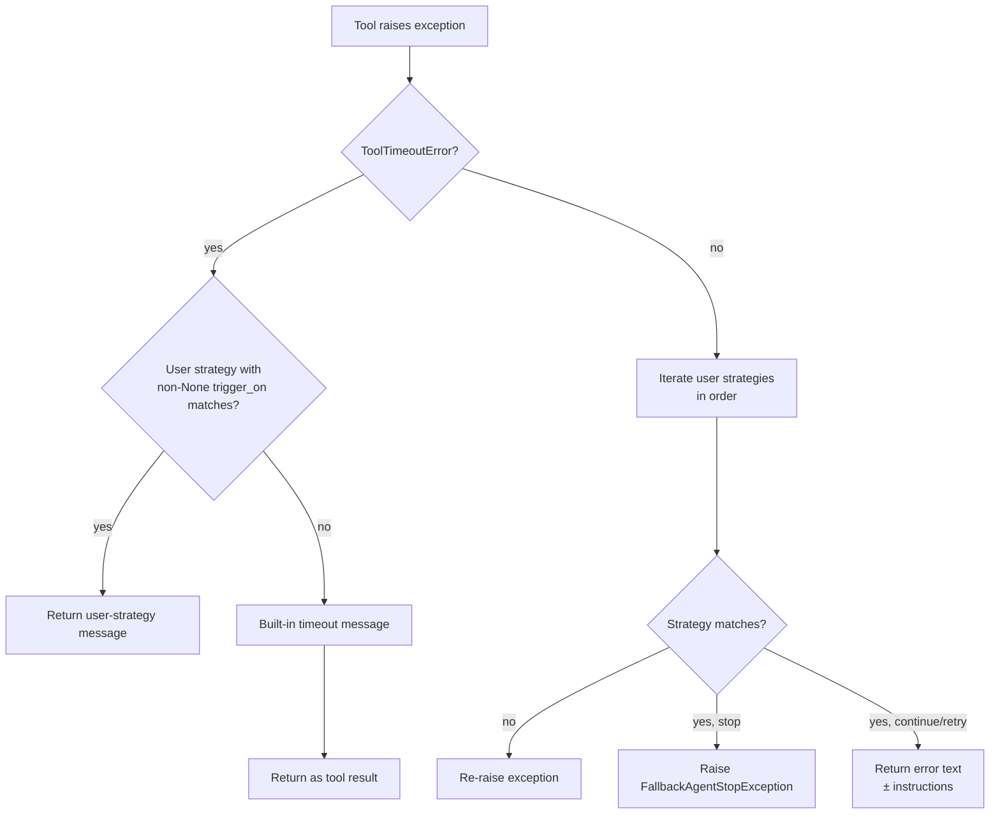

# Design: Fallback Strategy Semantics Refactor

- **Status:** Approved
- **Dependencies:**
  - [Configurable Tool Timeouts](configurable_timeouts.md) — introduced `ToolTimeoutError`, the
    special-cased `FallbackProcessor` path, and the `ContinueStrategyModel` validator that this
    design removes

## Problem Statement

The `fallback_configuration` feature had three behavioural issues that made it both unreliable and
hard to configure correctly:

1. **`stop` relied on LLM compliance.** `StopStrategyHandler` returned a message instructing the
   LLM to stop, but the LLM may disregard natural-language directives and keep calling tools. The
   stop intent had no enforcement mechanism — it was advisory at best.

2. **Errors were hidden from the LLM by default.** `ContinueStrategyModel` defaulted
   `forward_tool_error_message` to `false`. The agent received a generic *"An error occurred, try
   to call another applicable tool…"* message with no error context. The LLM had no information
   about *why* the tool failed, making informed recovery impossible. App creators had to opt in to
   forwarding the actual error, which was the only meaningful default.

3. **`retry` was a confusing synonym for `continue`.** The `retry` type existed as a separate
   strategy, but its semantics were identical to `continue` except for the name. App creators had
   to understand why two names existed for the same thing, and internal logic had two code paths
   that stayed in sync by convention rather than design.

4. **Catch-all `instructions` were applied unconditionally.** When a `ContinueStrategyModel` had
   no `trigger_on`, its `instructions` were unconditionally sent to the LLM as the tool-result
   content, replacing the actual error message. This made a catch-all with instructions suppress
   the error text entirely — a footgun when debugging why tools failed.

The configurable-timeouts design introduced a related constraint: `ContinueStrategyModel` with
`trigger_on` was required to also have `instructions` (the validator rejected the bare-trigger
form). With error always forwarded (see Design Goals below) that constraint is no longer needed —
a trigger-match should always forward the error, optionally appending instructions.

---

## Design Goals

- **Reliable `stop`.** When a `stop` strategy fires, the agent loop terminates unconditionally — no
  LLM message is sent, the exception propagates through the orchestrator, and a safe generic message
  is returned to the user.
- **Error always forwarded.** A `continue` strategy always sends the actual tool error to the LLM
  as the tool-result content. The LLM gets the error context it needs for rational recovery without
  app creators having to opt in.
- **`instructions` as optional addendum.** When a strategy matches via `trigger_on` and has
  `instructions`, those instructions are appended after the error text. Catch-all strategies
  (no `trigger_on`) ignore `instructions` entirely — the error text alone is the message.
- **Deprecation preserves config compatibility.** `forward_tool_error_message` and `retry` continue
  to parse without error; they log deprecation warnings so operators can migrate at their pace.
  JSON schema marks both deprecated.

---

## Use Cases

- **UC-1. Tool repeatedly fails → agent stops, user sees a safe message.** A `stop` strategy fires,
  `FallbackAgentStopException` propagates to the completion handler, and the user receives a
  generic "encountered an error and was stopped" message rather than an empty or confused response.
- **UC-2. Tool error surfaces in LLM context.** With the new defaults, the LLM sees the actual
  error text in the tool-result channel and can retry with different parameters, inform the user,
  or choose an alternative tool.
- **UC-3. Specific error triggers targeted instructions.** A `continue` strategy with
  `trigger_on: contains("rate limit")` and `instructions: "Wait and retry with a smaller batch"`
  forwards the error and appends the instruction — the LLM sees both.
- **UC-4. Catch-all forwards error without instructions.** `ContinueStrategyModel()` (no
  `trigger_on`, no `instructions`) forwards the error text only. No configuration required for
  sensible default behaviour.
- **UC-5. Migrating from `retry`.** An app configured with `type: retry` continues to parse and
  behave identically to `type: continue`. A `WARNING` log at startup directs operators to rename
  the field; the JSON schema marks the type deprecated.

---

## Proposed Design

### 1. `FallbackAgentStopException` — typed halt signal

A new `FallbackAgentStopException(Exception)` in
`common/exceptions/fallback_agent_stop.py`, re-exported from
`common/exceptions/__init__.py`. It carries no payload — it is a pure control-flow signal.

`StopStrategyHandler.handle` raises it instead of returning a message string:

```python
class StopStrategyHandler(BaseStrategy[StopStrategyModel]):
    @staticmethod
    def handle(strategy_config: StopStrategyModel, error: Exception) -> str:
        raise FallbackAgentStopException()
```

The exception propagates through `FallbackProcessor`, through `StagedBaseTool.arun`, through the
orchestrator loop, and is caught by `_quick_app_completion.py`'s exception handler alongside the
other application exceptions. The completion handler returns a safe generic message to the user
via `_exception_message_resolver`:

```
A tool encountered an error and the agent was stopped.
Please try again or contact your administrator if the issue persists.
```

The orchestrator does **not** need to handle this exception — it propagates naturally as an
unhandled `Exception` subclass, and the existing completion-layer catch handles it.

### 2. `extract_error_content` — unified error text helper

A new `extract_error_content(error: Exception) -> str` in
`common/tool_fallback/utils.py` replaces the ad-hoc `compose_tool_error_fallback_message` logic
scattered across handlers:

```python
def extract_error_content(error: Exception) -> str:
    if isinstance(error, ToolErrorException):
        return error.error_message
    return str(error)
```

For `ToolErrorException` (and its subtypes, including `MCPToolErrorException`), the public
`.error_message` attribute is returned — this is the safe, operator-authored error text. For all
other exceptions, `str(error)` is used.

### 3. `ContinueStrategyHandler` — error always forwarded

`ContinueStrategyHandler.handle` is simplified: it always calls `extract_error_content` and
returns the result. When `trigger_on` matches *and* `instructions` is set, instructions are
appended after the error text with a blank-line separator:

```python
class ContinueStrategyHandler(BaseStrategy[ContinueStrategyModel]):
    @staticmethod
    def handle(strategy_config: ContinueStrategyModel, error: Exception) -> str:
        if strategy_config.trigger_on is None and strategy_config.instructions is not None:
            logger.warning(
                "ContinueStrategyModel: instructions on catch-all (no trigger_on) are deprecated "
                "and will be ignored. The tool error message is forwarded to the LLM directly."
            )
        content = extract_error_content(error)
        if strategy_config.trigger_on is not None and strategy_config.instructions:
            return f"{content}\n\n{strategy_config.instructions}"
        return content
```

The `_DEFAULT_INSTRUCTIONS` constant and `forward_tool_error_message` field are removed from the
handler logic (the field remains on the model as a deprecated no-op — see Section 5).

### 4. `RetryStrategyHandler` — mirrors `ContinueStrategyHandler`

`RetryStrategyHandler.handle` is updated to the same semantics as `ContinueStrategyHandler`:
error forwarded unconditionally, instructions appended only when `trigger_on` matches.

```python
class RetryStrategyHandler(BaseStrategy[RetryStrategyModel]):
    @staticmethod
    def handle(strategy_config: RetryStrategyModel, error: Exception) -> str:
        content = extract_error_content(error)
        if strategy_config.trigger_on is not None and strategy_config.instructions:
            return f"{content}\n\n{strategy_config.instructions}"
        return content
```

This removes the last difference between `retry` and `continue` at the handler level, making the
`retry` type a true zero-behavioural-delta alias.

### 5. Deprecation — `forward_tool_error_message` and `retry`

Both deprecated fields are kept in the Pydantic models to preserve parse compatibility but are
marked in two ways:

- **JSON schema** — `Field(deprecated=True, ...)` generates a `"deprecated": true` annotation,
  visible in editors and schema validators.
- **Runtime warning** — `model_validator(mode="after")` emits a `WARNING` log on construction
  (for `retry`, always; for `forward_tool_error_message`, only when set to `True` — the `False`
  no-op default is silent to avoid noise for unchanged configs).

```python
# ContinueStrategyModel / RetryStrategyModel
forward_tool_error_message: bool = Field(
    default=False,
    deprecated="forward_tool_error_message is deprecated and has no effect. "
               "The tool error message is now always forwarded to the LLM.",
)

# RetryStrategyModel.type
type: Literal["retry"] = Field(
    default="retry",
    deprecated="The 'retry' strategy type is deprecated. Use 'continue' instead.",
)
```

### 6. `ContinueStrategyModel` validator removal

The `model_validator` that rejected `trigger_on is not None and instructions is None` is removed.
With error always forwarded, a trigger-match without instructions is valid and useful: the matched
strategy forwards the error text as-is, without any appended instruction. This mirrors the
catch-all form.

The `catch_all_scanner.py` startup scan is updated to log an INFO line for each catch-all strategy
with `instructions` set, alerting operators that those instructions will be ignored at runtime.

---

## FallbackProcessor flow after refactor



---

## Out of Scope

- **Custom stop messages.** `stop` sends no message to the LLM — it terminates. Adding a
  configurable user-facing message to `StopStrategyModel` can be done in a later pass if needed.
- **Retry-with-backoff built-in.** Automatic retry with delay would require idempotence guarantees
  and risks multiplying wall-clock time on slow calls. App creators wanting retry semantics should
  configure a `continue` strategy with appropriate instructions.
- **Removing `retry` type entirely.** Kept for one release cycle as a deprecated alias. Hard
  removal would be a breaking schema change for any existing app using `type: retry`.

---

## Configuration Examples

**Minimal catch-all (forwards error, agent continues):**

```json
{
  "fallback_configuration": {
    "strategies": [
      { "type": "continue" }
    ]
  }
}
```

The LLM receives the actual error text. No explicit configuration of `forward_tool_error_message`
needed — it is always on.

**Specific error triggers instructions:**

```json
{
  "fallback_configuration": {
    "strategies": [
      {
        "type": "continue",
        "trigger_on": { "type": "contains", "value": "rate limit" },
        "instructions": "Wait a moment and retry with a smaller request."
      },
      { "type": "continue" }
    ]
  }
}
```

On a rate-limit error, the LLM sees: `<error text>\n\nWait a moment and retry with a smaller
request.` On any other error, the catch-all forwards the error text.

**Hard stop on unrecoverable error:**

```json
{
  "fallback_configuration": {
    "strategies": [
      {
        "type": "stop",
        "trigger_on": { "type": "contains", "value": "quota exceeded" }
      },
      { "type": "continue" }
    ]
  }
}
```

A quota-exceeded error terminates the agent loop; the user receives a generic "agent was stopped"
message. Any other error is forwarded and the agent continues.

**Stop-all catch-all:**

```json
{
  "fallback_configuration": {
    "strategies": [
      { "type": "stop" }
    ]
  }
}
```

Any tool failure terminates the agent loop unconditionally.

---

## Migration

### Breaking changes

- **`stop` now terminates the agent loop.** Previously `stop` sent an instruction string to the
  LLM and the orchestrator continued running. After this change, `FallbackAgentStopException`
  propagates through the orchestrator and is handled at the completion layer, returning a generic
  message to the user. The LLM no longer receives any content from the tool call — the entire
  request ends. Apps that relied on the LLM receiving the stop-instruction text (e.g., to insert a
  specific user-facing phrase) must switch to a `continue` strategy with `instructions` set to that
  phrase.

- **`continue` catch-all no longer accepts `instructions`.** A `ContinueStrategyModel` with no
  `trigger_on` but with `instructions` set now **ignores** those instructions (and logs a
  `WARNING`). Previously the instructions were forwarded to the LLM. App creators must add a
  `trigger_on` matcher to preserve instruction injection, or remove the instructions.

- **Error text always forwarded.** Any app whose prompts were tuned assuming the LLM would *not*
  see raw tool error text now receives that text. This is an intended improvement, but system
  prompts may need updating if they contain guidance keyed to the generic "An error occurs" message.

### Non-breaking changes

- **`forward_tool_error_message: false` (default)** parses without error and without a warning.
  Existing configs that omit this field are unaffected.
- **`forward_tool_error_message: true`** parses and a `WARNING` is logged at construction time
  directing operators to remove the field. Behaviour is identical to the new default (error
  forwarded).
- **`type: retry`** parses, a `WARNING` is logged, and behaviour is identical to `type: continue`.
  Rename to `continue` at your convenience; no functional change is needed.
- **`ContinueStrategyModel(trigger_on=..., instructions=None)`** is now valid (validator removed).
  Previously this raised a `ValidationError` at config load. Existing configs that had to work
  around this (by supplying a placeholder `instructions` value) can clean up the field.

---

## Summary of Changes

### New files

- `common/exceptions/fallback_agent_stop.py` — `FallbackAgentStopException`

### Added

- `common/exceptions/__init__.py` — re-export `FallbackAgentStopException`
- `core/application/_exception_message_resolver.py` — `FallbackAgentStopException` branch →
  generic user-facing stop message
- `common/tool_fallback/utils.py` — `extract_error_content(error: Exception) -> str`

### Modified

- `common/tool_fallback/stop_strategy.py` — `handle` raises `FallbackAgentStopException` instead
  of returning a message string
- `common/tool_fallback/continue_strategy.py` — always calls `extract_error_content`; appends
  `instructions` only on `trigger_on` match; logs `WARNING` when catch-all has `instructions`
- `common/tool_fallback/retry_strategy.py` — same semantics as `ContinueStrategyHandler`; removed
  `_DEFAULT_INSTRUCTIONS` and `forward_tool_error_message` logic
- `config/tools/tool_fallback.py` — `forward_tool_error_message` marked deprecated in `Field()` +
  runtime `WARNING` validator; `RetryStrategyModel.type` marked deprecated in `Field()` + runtime
  `WARNING` validator; `ContinueStrategyModel` validator requiring `instructions` with `trigger_on`
  removed
- `common/tool_fallback/catch_all_scanner.py` — updated INFO log messages to note that catch-all
  instructions are deprecated and will be ignored

---

## Test Plan

**Unit — `FallbackAgentStopException`.**
- `isinstance(FallbackAgentStopException(), Exception)` is `True`.
- Re-exportable from `quickapp.common.exceptions`.

**Unit — `extract_error_content`.**
- `ToolErrorException("t", "public msg")` → `"public msg"`.
- `ValueError("connection refused")` → `"connection refused"`.

**Unit — `ContinueStrategyHandler`.**
- Catch-all (`trigger_on=None`, no `instructions`): error text forwarded.
- Catch-all with `instructions`: error text forwarded, `instructions` ignored, `WARNING` logged to
  `quickapp.common.tool_fallback.continue_strategy`.
- Trigger match + `instructions`: `"<error>\n\n<instructions>"`.
- Trigger match, no `instructions`: error text only.
- Non-matching trigger: strategy skipped, falls through to next strategy.

**Unit — `RetryStrategyHandler`.**
- Same cases as `ContinueStrategyHandler` (mirrors continue semantics).

**Unit — `StopStrategyHandler`.**
- Catch-all: raises `FallbackAgentStopException`.
- Matching trigger: raises `FallbackAgentStopException`.
- Non-matching trigger: falls through.

**Unit — deprecation warnings.**
- `ContinueStrategyModel(forward_tool_error_message=True)` → `WARNING` logged at construction.
- `ContinueStrategyModel(forward_tool_error_message=False)` → no warning.
- `RetryStrategyModel(instructions="x")` → `WARNING` logged at construction.

**Unit — validator removal.**
- `ContinueStrategyModel(trigger_on=TriggerOn(...))` without `instructions` → valid (no
  `ValidationError`).
- `RetryStrategyModel()` without `instructions` → still raises `ValidationError`.

**Unit — `FallbackProcessor` end-to-end.**
- `[StopStrategyModel()]` + any error → `FallbackAgentStopException` raised.
- `[StopStrategyModel(trigger_on=...), ContinueStrategyModel()]` + matching error → stop raises.
- `[StopStrategyModel(trigger_on=...), ContinueStrategyModel()]` + non-matching error → continue
  forwards error.
- `[ContinueStrategyModel()]` + `ToolErrorException` → `result.content == error_message`.
- `[ContinueStrategyModel()]` + `ValueError` → `result.content == str(error)`.
- No matching strategy + non-timeout error → re-raises original exception.
