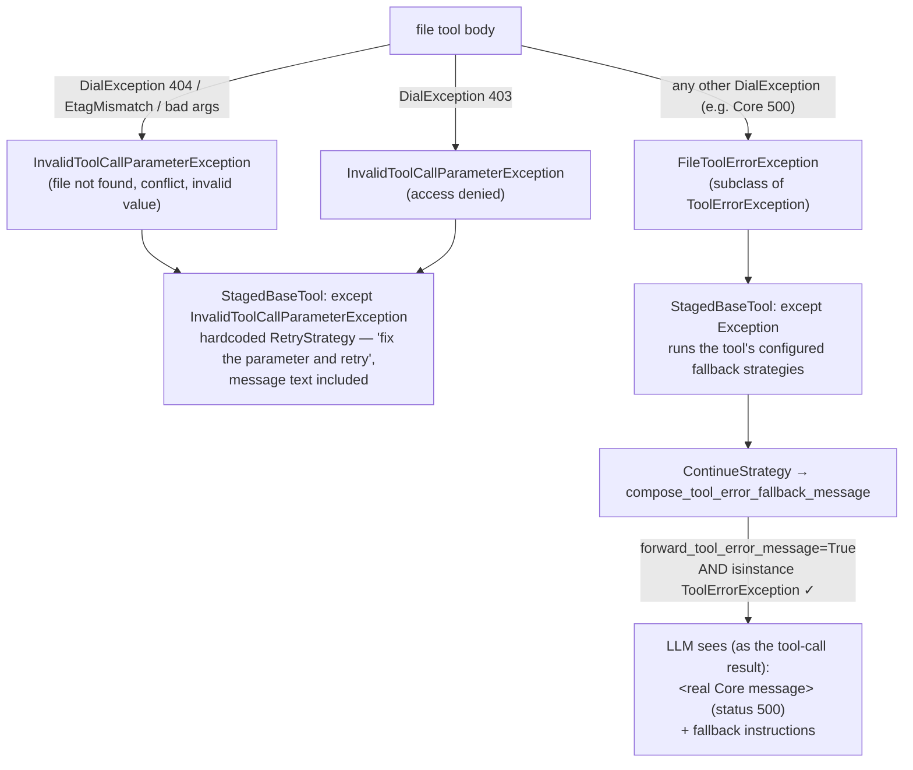

# Design: File-Tool Error Flow Standardization

- **Status:** Draft
- **Issue:** [#455](https://github.com/epam/ai-dial-quickapps-backend/issues/455)
- **Dependencies:**
  - None. Builds on the `forward_tool_error_message` contract introduced by
    [#408](https://github.com/epam/ai-dial-quickapps-backend/pull/408); motivated by the symptom reported in
    [#447](https://github.com/epam/ai-dial-quickapps-backend/issues/447).

## Problem Statement

PR #408 gave fallback strategies a `forward_tool_error_message` flag: when a tool fails and a
`ContinueStrategyModel` (or `RetryStrategyModel`) handles the failure, the real error text is forwarded to the LLM
alongside the fallback instructions. The gate lives in `compose_tool_error_fallback_message`
(`src/quickapp/common/tool_fallback/utils.py`): the message is forwarded **only** when the escaping exception is a
`ToolErrorException` subclass. Such subclasses exist today for two of the four tool types — MCP
(`MCPToolErrorException` in `src/quickapp/mcp_tooling/_mcp_tool_error_exception.py`) and REST
(`RestApiToolErrorException` in `src/quickapp/rest_api_tooling/_rest_api_tool_error_exception.py`).

The internal file tools (`src/quickapp/dial_files_tooling/`) never raise a `ToolErrorException`. Their error
handling has two defects:

1. **Raw `DialException`s leak.** The shared helper `_DialFileTool._check_permission_denied` translates only 403
   into `InvalidToolCallParameterException`; every `except DialException` site then ends in a bare `raise` — in
   `_list_folder_entries` (`_base_file_tool.py`) and in the write/edit/delete/copy/move tools (e.g.
   `_copy_file_tool.py`). A Core 5xx therefore escapes as a raw `DialException`, lands in the generic
   `except Exception` branch of `StagedBaseTool.__run_tool_body`, and — because it is not a `ToolErrorException` —
   `forward_tool_error_message=True` is a **silent no-op**: the LLM receives only the generic fallback
   instructions. The model then reports vague failures like "the backend tool is failing", the exact symptom of
   #447.
2. **Server errors are mislabeled as parameter errors.** `_DialFileTool._download_text` wraps any non-404
   `DialException` — including Core 5xx server errors — into `InvalidToolCallParameterException("path", ...)`.
   That routes the failure into the hardcoded parameter-retry branch of `StagedBaseTool.__run_tool_body`
   ("fix the parameter and retry"), which is misleading — the parameter is fine — and bypasses the tool's
   configured fallback strategies entirely.

## Design Goals

- Every failure escaping a file-tool body is one of exactly **two standardized shapes**; no raw `DialException`
  ever leaks out of `dial_files_tooling/`.
- `forward_tool_error_message=True` works for internal file tools exactly as it does for MCP and REST tools —
  with **zero changes** to the fallback machinery (`compose_tool_error_fallback_message`, `FallbackProcessor`,
  the strategy models).
- Core server errors (5xx) stop being presented to the model as parameter errors; they flow through the tool's
  configured fallback strategies like any genuine tool failure.
- Parameter-shaped failures (not found, access denied, etag conflict, bad range/pattern) keep their current
  retry-with-a-fixed-value behavior unchanged.
- The nine file tools forward real error text by default, so failures like #447 surface an actionable message in
  the conversation without any app-level configuration.

---

## Use Cases

### UC-1: Core returns 500 during a file copy

**Trigger:** The model calls `internal_file_copy`; DIAL Core responds 500 to the server-side copy request.
**Behavior:** The escaping `DialException` is translated into `FileToolErrorException` (a `ToolErrorException`),
which the `except Exception` branch of `StagedBaseTool.__run_tool_body` hands to the tool's configured fallback
strategies. The default `ContinueStrategyModel(forward_tool_error_message=True)` makes
`compose_tool_error_fallback_message` prepend the real Core message.
**Outcome:** The tool result for that tool call carries `<real Core message> (status 500)` plus the fallback
instructions — the LLM can explain the actual failure to the user instead of guessing that "the backend tool
is failing" (#447).

### UC-2: The model passes a path the user cannot access

**Trigger:** The model calls `internal_file_read_lines` with a path that resolves to a 403 from Core.
**Behavior:** Unchanged: the 403 is translated into `InvalidToolCallParameterException("path", "access denied: ...")`
and handled by the dedicated parameter-retry branch in `StagedBaseTool.__run_tool_body`, whose hardcoded
`RetryStrategyModel` already embeds the message.
**Outcome:** The LLM is told the parameter is invalid ("access denied") and retries with a corrected value or asks
the user — exactly today's behavior.

### UC-3: Core hiccups during a single-file download

**Trigger:** The model calls `internal_file_search` on a single file; the download fails with a Core 503.
**Behavior:** Today `_download_text` raises `InvalidToolCallParameterException("path", "File download failed: ...")`
and the model is told to fix a parameter that is not broken. With this design the 503 becomes
`FileToolErrorException` and flows through the configured fallback strategies (UC-1 path).
**Outcome:** No misleading "fix the parameter and retry" instruction; the real server error reaches the model.

---

## Proposed Design

Every failure escaping a file-tool body is one of two shapes, each with a distinct handler in
`StagedBaseTool.__run_tool_body`:

1. **`InvalidToolCallParameterException`** — parameter-shaped, "retry with a fixed value": file/folder not found
   (404), access denied (403), etag conflict (overwrite refusal), bad range/pattern/depth. Handled by the
   dedicated `except InvalidToolCallParameterException` branch, whose hardcoded `RetryStrategyModel` already
   embeds the message text. **Unchanged behavior.**
2. **`FileToolErrorException(ToolErrorException)`** — **new**, for genuine tool/server failures (Core 5xx and any
   other unclassified `DialException`). Being a `ToolErrorException` makes `compose_tool_error_fallback_message`
   forward the real text when `forward_tool_error_message=True`. Follows the pattern of
   `src/quickapp/mcp_tooling/_mcp_tool_error_exception.py`; requires zero changes to the fallback machinery.



### 1. `FileToolErrorException`

- **What:** A new exception class in `dial_files_tooling/`, subclassing
  `quickapp.common.exceptions.tool_error.ToolErrorException`, constructed with `(tool_name, error_message)` like
  its MCP and REST siblings.
- **Owner:** `dial_files_tooling/` — the class is private to the package, exactly as `MCPToolErrorException` is to
  `mcp_tooling/` and `RestApiToolErrorException` is to `rest_api_tooling/`.
- **Semantics:** Raised whenever a `DialException` escaping a file-tool body is *not* parameter-shaped.
  `compose_tool_error_fallback_message` forwards **`error.error_message`** (not `str(error)`), so the text
  delivered to the LLM is exactly the `error_message` the tool constructs — `<real Core message> (status 5xx)`.
  The tool identity does not need to be embedded in that text: the fallback message is returned as the result of
  the failing tool call, so the model already knows which tool it belongs to. The `tool_name` argument still
  matters for logs and stage rendering, where the base `__str__`
  (`Tool '<name>' returned an error: <message>`) is used; unlike its MCP and REST siblings — which override
  `__str__` with a type-specific prefix — `FileToolErrorException` keeps the base rendering deliberately.
- **Change:** New file, following the pattern of `_mcp_tool_error_exception.py`. No changes to
  `ToolErrorException`, `compose_tool_error_fallback_message`, or `FallbackProcessor`.

### 2. Translation helper in `_base_file_tool.py`

- **What:** A helper on `_DialFileTool` replacing `_check_permission_denied` (which today handles only 403 and
  lets everything else leak raw). It classifies an escaping `DialException` into exactly one of the two
  standardized exceptions and always raises — no code path returns the raw `DialException` to the caller:
  - `status_code == 403` → `InvalidToolCallParameterException(parameter_name, f"access denied: {url}")` —
    identical to today's `_check_permission_denied` output.
  - anything else → `FileToolErrorException(tool_name, f"{e.message} (status {e.status_code})")`.
- **Owner:** `_DialFileTool` — the shared base of all nine file tools, so classification lives in one place.
- **Semantics:** The tool name comes from `self._tool_config.open_ai_tool.function.name` (the same name the LLM
  called, so the forwarded message is self-identifying). The message uses `e.message` — the human-readable Core
  error — not the noisy full exception repr.
- **Change:** `_check_permission_denied` (a `@staticmethod` today) becomes the always-raising instance-level
  translation helper; being an instance method is what gives it access to the tool name.

### 3. Applying the helper at every `except DialException` site

- **What:** Each site that today calls `_check_permission_denied` and then bare-`raise`s (or wraps into
  `InvalidToolCallParameterException`) instead calls the translation helper:
  - `_DialFileTool._download_text` — the `except DialException` arm stops wrapping non-404 errors into
    `InvalidToolCallParameterException("path", "File download failed: ...")`; server errors become
    `FileToolErrorException`. The `ResourceNotFoundError` → "file not found" arm is unchanged.
  - `_DialFileTool._list_folder_entries` — the `except DialException` + bare `raise` becomes a call to the helper.
  - The write/edit/delete/copy/move tools (`_write_file_tool.py`, `_edit_file_tool.py`, `_delete_file_tool.py`,
    `_copy_file_tool.py`, `_move_file_tool.py`) — each `except DialException: self._check_permission_denied(...);
    raise` block becomes a call to the helper (preserving the per-tool `parameter_name`, e.g. `"source"` for
    copy/move).
- **Owner:** The individual tool bodies; the classification logic stays in the base class.
- **Semantics:** Existing dedicated arms are untouched: `ResourceNotFoundError` → "not found"
  `InvalidToolCallParameterException`s, `EtagMismatchError` → the "already exists / ask the user about
  overwrite" `InvalidToolCallParameterException`s, and `_read_text_for_scan`'s deliberate skip-on-undecodable
  behavior in folder-scan mode all stay as-is.
- **Change:** Mechanical replacement of the `_check_permission_denied` + bare `raise` pattern; after it, no
  `except DialException` block in the package re-raises the raw exception.

### 4. Default `forward_tool_error_message=True` for the nine file tools

- **What:** Each of the nine configs in `dial_files_tooling/_tool_configs.py` (`ALL_FILE_TOOL_CONFIGS`) gains an
  explicit fallback configuration:

  ```python
  fallback_configuration=ToolFallbackConfig(
      strategies=[ContinueStrategyModel(forward_tool_error_message=True)]
  )
  ```

- **Owner:** `_tool_configs.py` — the single place the internal file tools are configured.
- **Semantics:** Same strategy shape as the implicit default (`[ContinueStrategyModel()]`), with forwarding turned
  on. These configs are hardcoded; app manifests cannot override them, so turning the flag on here is a product
  decision, not a schema change — nothing in the app-config schema moves.
- **Change:** Nine config literals gain the `fallback_configuration` field. Without this step the new exception
  class would be inert (the default `ContinueStrategyModel()` has `forward_tool_error_message=False`).

### Testing strategy

- Mirror the forwarding tests in `src/tests/unit_tests/mcp_tool_tests/test_mcp_tool_is_error.py`: a file tool
  whose Core call fails with a non-404 `DialException` raises `FileToolErrorException`, and with the shipped
  config the fallback message returned to the model contains the real Core text.
- 403 keeps the invalid-parameter behavior: assert the translation helper raises
  `InvalidToolCallParameterException` with the "access denied" message for `status_code == 403`.
- `_download_text` with a non-404 `DialException` (e.g. 503) raises `FileToolErrorException`, not
  `InvalidToolCallParameterException` — the regression test for the mislabeling defect.

---

## Secondary Fixes

- **`_download_text`'s generic `except Exception` arm.** The trailing arm that wraps *any* exception into
  `InvalidToolCallParameterException("path", f"File download failed: {e}")` today also swallows programming
  errors. It sits outside the `DialException` classification and is kept as-is by this design; tightening it is a
  candidate follow-up once the standardized shapes are in place.

---

## Out of Scope

- **Changing the fallback machinery.** `compose_tool_error_fallback_message`, the strategy models, and
  `FallbackProcessor` are untouched by design — the whole point is that a `ToolErrorException` subclass slots into
  the existing #408 contract.
- **DIAL-deployment tools.** The fourth tool type has its own error-propagation semantics (deployment responses
  are surfaced differently); giving it a `ToolErrorException` subclass deserves its own analysis.
- **Other internal tools** (py-interpreter, get-content, etc.). Same pattern could apply, but their failure modes
  differ; deferred until the file-tool precedent has proven itself.
- **Retrying transient Core errors inside the tool.** Automatic retry of 5xx before surfacing the failure is a
  reliability feature orthogonal to error *shaping*; it can be layered on later without changing these shapes.
- **Exception-message content policy.** `e.message` from Core is third-party text and is accepted as-is, in line
  with the boundary rules of the log levels & content policy design
  ([log_levels_and_content_policy.md](log_levels_and_content_policy.md)).

---

## Configuration / Usage Examples

### Before / after: what the LLM sees when Core returns 500 on a copy

| | Tool message returned to the model |
|---|---|
| **Today** | Generic fallback instructions only — the raw `DialException` fails the `ToolErrorException` isinstance gate in `compose_tool_error_fallback_message` |
| **With this design** | `<real Core message> (status 500)` + the fallback instructions (forwarded `error_message`, delivered as the failing tool call's result) |

### Exception classification reference

| Failure | Standardized shape | Handled by |
|---|---|---|
| 404 / `ResourceNotFoundError` (file, folder, copy source) | `InvalidToolCallParameterException` ("not found") | Parameter-retry branch (hardcoded `RetryStrategyModel`) |
| 403 | `InvalidToolCallParameterException` ("access denied") | Parameter-retry branch |
| `EtagMismatchError` (overwrite refusal) | `InvalidToolCallParameterException` ("already exists…") | Parameter-retry branch |
| Bad range / glob / depth / absolute path | `InvalidToolCallParameterException` | Parameter-retry branch |
| Any other `DialException` (Core 5xx, unclassified 4xx) | `FileToolErrorException` | Configured fallback strategies (`ContinueStrategyModel(forward_tool_error_message=True)` by default) |

---

## Migration

### Breaking changes

None. The file-tool fallback configuration is hardcoded and not part of the app-config schema, so no manifest
changes, no schema regeneration semantics change, and no user action is required.

### Non-breaking changes

- The tool message the LLM receives on a file-tool server failure changes from generic instructions to the real
  error text — an intended behavioral improvement. Apps relying on the model *not* seeing Core error text from
  file tools would be affected, but no such contract exists.
- Failures previously mislabeled as parameter errors in `_download_text` (non-404 `DialException`) now route
  through fallback strategies instead of the parameter-retry branch; the model stops receiving "fix the
  parameter" instructions for server errors.

## Summary of Changes

| Component | Change |
|---|---|
| `dial_files_tooling/` (new file) | `FileToolErrorException(ToolErrorException)`, following the pattern of `_mcp_tool_error_exception.py` (base `__str__` kept — no type-specific prefix) |
| `dial_files_tooling/_base_file_tool.py` | `_check_permission_denied` replaced by an always-raising translation helper: 403 → `InvalidToolCallParameterException` ("access denied"), anything else → `FileToolErrorException(tool_name, f"{e.message} (status {e.status_code})")`; applied in `_download_text` (5xx no longer mislabeled) and `_list_folder_entries` |
| `dial_files_tooling/_write_file_tool.py`, `_edit_file_tool.py`, `_delete_file_tool.py`, `_copy_file_tool.py`, `_move_file_tool.py` | `except DialException` sites call the translation helper instead of `_check_permission_denied` + bare `raise`; `ResourceNotFoundError`/`EtagMismatchError` arms unchanged |
| `dial_files_tooling/_tool_configs.py` | All nine configs gain `fallback_configuration=ToolFallbackConfig(strategies=[ContinueStrategyModel(forward_tool_error_message=True)])` |
| Fallback machinery (`common/tool_fallback/`) | **No changes** |
| Tests | New unit tests mirroring `test_mcp_tool_is_error.py`: forwarding on 5xx, 403 stays invalid-parameter, `_download_text` non-404 `DialException` → `FileToolErrorException` |
