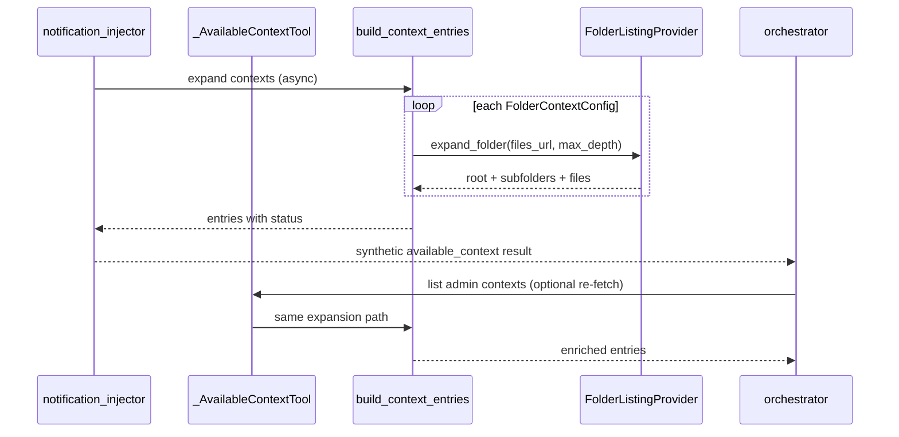
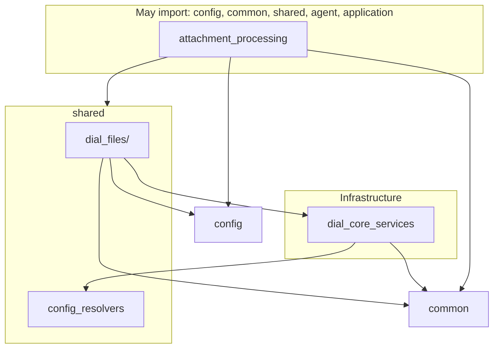

# Design: Folder Context

- **Status:** Draft
- **Dependencies:**
  - [dial_files_tools.md](dial_files_tools.md) — DIAL file tools (`list`, read/write surface)
  - [preview_feature_gating.md](preview_feature_gating.md) — preview gating for folder contexts and dial-files
  - [generic_synthetic_toolcall_injector.md](generic_synthetic_toolcall_injector.md) — attachment-notification injector pattern
- **Replaces:** An earlier draft that proposed request-time folder expansion via a `/.dial_folder` URL convention on `FileContextConfig`. Intermediate drafts proposed synthetic `internal_file_list` message pairs — superseded by enriching the available-context tool response (see Concern 3).

## Problem Statement

QuickApps administrators can attach **contexts** — static knowledge the agent should be aware of — via `application_properties.contexts`. Today each attached **file** requires its own `FileContextConfig` entry with an explicit DIAL URL.

When an administrator wants the agent to work with a **shared document folder** (e.g. a team docs bucket that users upload to over time), every new or removed file requires a configuration change. The admin must edit the QuickApp manifest to add or remove individual `FileContextConfig` entries. This is brittle, slow, and does not scale for folders that change frequently.

A single `FileContextConfig` can carry a `description` that tells the orchestrator what the file contains. A `FolderContextConfig` has only an optional folder-level `description` — it does not describe individual files inside. That gap may be filled in future by convention files living in the folder itself (see *Future: folder instruction files*).

## Design Goals

- Administrators can attach a **folder** as a context item alongside files and user-defined text (**preview-gated** until stable).
- New files and subfolders added under an attached folder become discoverable by the agent **without** changing QuickApp configuration.
- Folder expansion (files **and** child folders, recursively) is delivered through the **`internal_attachments_available_context` tool response** — no separate synthetic `internal_file_list` assistant/tool message pairs.
- For every `FolderContextConfig` in `contexts`, the backend **always** runs folder expansion when building the available-context response (same as if the tool were invoked for that folder on every request).
- Expanded file URLs are then available to whatever tools the QuickApp author configured (RAG, MCP, get-content, dial-files, etc.).
- DIAL file tools live under **`shared`** (importable cross-module infrastructure), not a standalone top-level feature module.
- `features.dial_files` presets are **`read_only`** and **`all` only** — no `write`-only preset (write without read is unusable for folder discovery and mid-conversation file access).
- Folder contexts and dial-files remain **preview-gated** until they graduate to stable.

---

## Use Cases

### UC-1: Admin attaches a shared docs folder (RAG-backed QuickApp, preview on)

**Trigger:** Operator sets `ENABLE_PREVIEW_FEATURES=true`. Administrator configures a folder context at `metadata/files/{bucket}/shared-docs/` and a DIAL RAG tool. No `features.dial_files` block.

**Behavior:** On every request, `_AvailableContextTool` / notification injector builds an available-context response that includes the folder root entry **and** recursively expanded child folders and files under `files/{bucket}/shared-docs/`. The attachment-notification injector surfaces this response when membership changes. The orchestrator passes discovered file URLs to RAG.

**Outcome:** The agent can answer questions about documents in the folder using RAG. A new upload under `shared-docs/` or a nested subfolder appears on the next request's available-context response — no manifest update required.

### UC-2: Mixed static file and dynamic folder

**Trigger:** Contexts include one `FileContextConfig` (policy PDF) and one `FolderContextConfig` (living FAQ folder with nested subfolders). Preview on.

**Behavior:** Available-context returns the PDF entry plus the expanded tree for the folder (root folder entry, subfolder entries, file entries with inferred MIME types). Static PDF is fetched via get-content; folder files are handled by configured tools (MCP, RAG, etc.).

**Outcome:** Static and dynamic knowledge sources coexist. Nested folder structure is visible to the orchestrator without per-file config entries.

### UC-3: Production deployment without preview features

**Trigger:** Operator deploys with `ENABLE_PREVIEW_FEATURES=false`. App manifest still lists a folder context (e.g. persisted from staging).

**Behavior:** Preview validator nullifies folder context entries (logs warning). Available-context behaves as if folder contexts were absent. No folder expansion runs. `features.dial_files` is also nullified (existing preview behaviour).

**Outcome:** No folder-context or dial-files behaviour in production until the feature graduates from preview.

### UC-4: App with dial-files `all` preset (preview on)

**Trigger:** Preview on. App configures `features.dial_files.enabled_tools: "all"` alongside folder context.

**Behavior:** Available-context response includes recursively expanded folder tree. All eight dial-files tools are registered for LLM invocation (read + write). Folder discovery does not depend on the LLM calling `list` — expansion is always in the available-context payload.

**Outcome:** Agent sees full folder tree via available-context; may additionally use dial-files tools for appdata read/write during the conversation.

### UC-5: Context change notification on folder membership update

**Trigger:** A new file is uploaded to a nested subfolder under an attached folder context.

**Behavior:** `build_context_entries` (async, with expansion) produces an updated set of entries compared to history from prior available-context tool results. New file URLs produce `status: "new"`; removed URLs produce `status: "removed"`. Subfolder entries appear when subfolders are created. The attachment-notification injector surfaces the delta.

**Outcome:** The agent is notified when folder **membership** changes, not only when admin edits folder metadata in config.

---

## Proposed Design

### Concern 1: `FolderContextConfig` (config schema, preview-gated)

**What:** A dedicated context discriminator `type: "folder"` in the `Context` union.

**Owner:** `src/quickapp/config/context.py`

**Semantics:**

| Field | Type | Default | Description |
|-------|------|---------|-------------|
| `type` | `"folder"` | `"folder"` | Discriminator value. **Preview-gated** — omitted from JSON schema when preview is off. |
| `url` | DIAL file URL | required | Folder path in DIAL storage. Format: `metadata/files/{bucket}/{path}/` (trailing slash). |
| `mime` | string | `application/vnd.dial.metadata+json` | MIME for the **root** folder entry in available-context. Child folders use the same default unless overridden later. |
| `description` | string \| null | null | Optional label for the root folder entry. |
| `max_depth` | integer | `10` | Maximum recursion depth when expanding child folders and files (same bound as dial-files `list`). |

**Preview gating:**

- Mark the `folder` variant as preview in schema generation (same mechanism as `PreviewField` — hidden from schema when `ENABLE_PREVIEW_FEATURES=false`).
- At runtime, `_gate_preview_fields` / context validation strips `FolderContextConfig` entries from `contexts` when preview is off; log warning if present in persisted config.

**Change:** Partially implemented (`FolderContextConfig` exists). Add `max_depth`; wire preview gating for the folder discriminator.

### Concern 2: Recursive folder expansion in available-context response

**What:** When building the `internal_attachments_available_context` response, **expand each `FolderContextConfig` recursively** into `ContextEntry` rows for the root folder, every nested subfolder, and every file under the configured tree.

**Owner:** `src/quickapp/attachment_processing/_context_entries.py`, `_available_context_tool.py`, `_attachment_notification_injector.py`

**Semantics:**

- **No synthetic `internal_file_list` pairs.** Expansion results appear only inside the available-context JSON response (`AvailableContextToolResponse.entries`).
- **Always expand for each folder context** whenever the available-context tool runs or when the notification injector builds content — there is no lazy "agent must call list first" path for admin folder contexts.
- **Recursive listing:** For each `FolderContextConfig`, call `FolderListingProvider.expand_folder(files_url, max_depth=ctx.max_depth)` which returns a flat list of `(url, is_folder, mime, description)` entries:
  - Root folder row (metadata MIME + config `description`).
  - Each **child folder** row (metadata MIME; title = folder name; `description` null unless future instruction files apply).
  - Each **file** row (inferred MIME from extension; title = filename).
- **URL mapping:** `metadata/files/{bucket}/{path}/` → `files/{bucket}/{path}/` for DIAL listing API.
- **Ordering:** Deterministic (sort by URL) so new/removed detection is stable across requests.
- **Change detection:** Compare expanded URL set against history from prior available-context tool results. Individual files and subfolders inside configured folders participate in `new` / `removed` / `updated` status — unlike earlier designs that only tracked the root folder URL.
- **Static file contexts unchanged:** `FileContextConfig` and `UserDefinedContextConfig` behaviour is unchanged.

**Response shape (conceptual):**

```json
{
  "entries": [
    {
      "title": "shared-docs",
      "url": "metadata/files/bucket/shared-docs/",
      "type": "application/vnd.dial.metadata+json",
      "description": "Team documentation"
    },
    {
      "title": "2026",
      "url": "files/bucket/shared-docs/2026/",
      "type": "application/vnd.dial.metadata+json"
    },
    {
      "title": "report.pdf",
      "url": "files/bucket/shared-docs/2026/report.pdf",
      "type": "application/pdf",
      "status": "new"
    }
  ]
}
```

**Change:** Replace synchronous `build_context_entries` with async `build_context_entries_async` (or internal expand step) that accepts `FolderListingProvider`. Update `_AvailableContextTool._get_response` and `_AttachmentNotificationInjector.get_content` to await expansion.



### Concern 3: Always surface available-context for folder contexts

**What:** Ensure the orchestrator always receives an up-to-date available-context result when folder contexts are configured (preview on).

**Owner:** `attachment_processing` module

**Semantics:**

- `should_activate_context_tool` remains `true` when any preview-valid `FolderContextConfig` is present.
- `_AttachmentNotificationInjector` uses `InjectionFrequency.ALWAYS` when folder contexts exist (or when any context entry changed), so the enriched response is injected at request setup — the agent does not need to invoke the tool first to see folder contents.
- `_AvailableContextTool` uses the **same** expansion path when the LLM calls it later in the conversation (re-list / refresh).
- `should_enable_get_content_tool`: enabled when expanded entries include file MIME types the deployment accepts (same rules as static file contexts); folder metadata rows alone do not enable get-content.

**Change:** Align notification injector gating with expanded entry diff (membership change), not only root-folder metadata change.

### Concern 4: DIAL file tools move to `shared`

**What:** Relocate dial-files tooling from top-level `dial_files_tooling/` to `shared/dial_files/` and register via `shared_module`.

**Owner:** `src/quickapp/shared/dial_files/`, `shared/__init__.py`, `app_factory.py`

**Rationale:**

- File tools are cross-cutting infrastructure (like `external_fetch`, `config_resolvers`) used when apps opt in via `features.dial_files`.
- `shared` is already an allowed import target for independent feature modules.
- Folder expansion and dial-files tools share listing/formatting utilities — colocation under `shared` avoids a forbidden `attachment_processing` → `dial_files_tooling` dependency.

**Structure:**

```
shared/
  dial_files/
    dial_files_module.py          # was dial_files_tooling_module (@preview_module)
    _base_file_tool.py
    _list_files_tool.py
    … (other tools)
    _tool_configs.py
    _folder_listing.py            # shared expand + render (used by AP port and list tool)
  shared_module: […, DialFilesModule()]
```

**Migration:**

- Move package; update imports across codebase (`dial_files_tooling` → `shared.dial_files`).
- Remove `DialFilesToolingModule()` from `app_factory.build_di_modules()`; append `DialFilesModule()` to `shared_module`.
- Keep `@preview_module` on `DialFilesModule` — entire dial-files surface stays preview-gated until stable.

**Change:** Physical move + import renames. No behaviour change to individual tools.

### Concern 5: File tool presets — `read_only` and `all` only

**What:** Extend `DialFilesConfig.enabled_tools` with preset group names. Drop `"write"` as a preset.

**Owner:** `src/quickapp/config/dial_files.py`, `shared/dial_files/dial_files_module.py`

**Semantics:**

| Preset | Tools included |
|--------|----------------|
| `"read_only"` | `list`, `read_lines`, `search` |
| `"all"` | All eight tools (read-only + write) |

**Rationale:** A write-only preset omits `list`, `read_lines`, and `search`. That breaks mid-conversation file access and duplicates poorly with server-side folder expansion (which does not require LLM-invoked `list` for admin folders). Apps needing write tools use `"all"`.

```python
DialFilesToolPreset = Literal["read_only", "all"]
enabled_tools: DialFilesToolPreset | list[DialFilesToolName] = "all"
```

Individual tool names remain supported for fine-grained control (e.g. `["list", "read_lines"]`). Explicit lists that include write tool names without read tools log a warning and union the read-only preset.

**Note:** Folder expansion does **not** require `features.dial_files`. Presets apply only when the app opts into LLM-callable file tools.

### Concern 6: Preview gating (folder + dial-files)

**What:** Both folder contexts and dial-files remain preview-gated for v1.

**Owner:** `config/context.py`, `config/application.py`, `shared/dial_files/dial_files_module.py`, schema generation

**Semantics:**

| Feature | Gating mechanism |
|---------|------------------|
| `FolderContextConfig` in `contexts` | Preview discriminator in schema; runtime strip + warn when preview off |
| `features.dial_files` | Existing `PreviewField` on `Features.dial_files` |
| `DialFilesModule` | Existing `@preview_module` (stays after move to `shared`) |

When `ENABLE_PREVIEW_FEATURES=false`:

- Folder contexts in persisted configs are ignored.
- `features.dial_files` nullified (existing behaviour).
- `DialFilesModule` not wired (existing behaviour).

When preview is enabled, both features are fully functional.

**Graduation path (future):** Remove preview marker from folder discriminator and/or remove `@preview_module` / `PreviewField` when stable — independent decisions.

### Concern 7: UI — folder context picker

**What:** Configuration UI support for adding a folder as a contexts item (**visible only when preview features enabled** in the deployment / schema).

**Owner:** QuickApps configuration UI (frontend)

**Semantics:**

- Contexts editor offers **Folder** type when preview schema includes the `folder` discriminator.
- Folder picker writes `{ "type": "folder", "url": "…", "description": "…", "max_depth": 10 }`.
- UI copy: folder contents (files and subfolders) appear automatically in available-context responses; `features.dial_files` is optional for LLM-driven file operations.

---

## Future: folder instruction files (not in v1)

**Problem:** Expanded file entries have inferred MIME only — no per-file description unless each file is a separate `FileContextConfig`.

**Idea:** Well-known files inside the attached folder tree:

| Filename | Purpose |
|----------|---------|
| `agents.md` | Agent/orchestrator instructions for this folder |
| `descriptions.md` | Per-file or section descriptions |
| `README.md` | General orientation |

**Proposed behaviour (future):** During expansion, detect these files at each folder root, download text, and attach content to the root folder entry's `description` or a dedicated field on `ContextEntry`. Same freshness model as recursive expansion (per-request).

---

## Secondary Fixes

### Available-context tool description

Update description: folder contexts expand recursively into folder and file entries in **this** response. Subfolders use metadata MIME; files use inferred MIME. Use file URLs with configured tools (RAG, MCP, get-content, dial-files, etc.).

### System prompt guidance (optional)

"When available-context returns folder entries (`application/vnd.dial.metadata+json`) and file entries under the same tree, use file URLs with your configured tools."

---

## Out of Scope

- **Synthetic `internal_file_list` assistant/tool message pairs.** Superseded by enriched available-context response.
- **`write`-only dial-files preset.** Use `"all"` instead.
- **Folder instruction files (`agents.md`, etc.).** Future work.
- **Admin UI implementation.** Frontend repo.
- **Non-DIAL folder URLs.** Only `metadata/files/...` supported.
- **Prescribing which tool consumes folder files.** Up to QuickApp tool configuration.

---

## Configuration / Usage Examples

### Folder context only (preview on)

```json
{
  "contexts": [
    {
      "type": "folder",
      "url": "metadata/files/684f6Lz7ubje66aoCRsa5c/shared-docs/",
      "description": "Team documentation",
      "max_depth": 10
    }
  ]
}
```

No `features.dial_files` required. Available-context response includes root folder, subfolders, and files.

### Folder + optional dial-files read-only

```json
{
  "contexts": [
    {
      "type": "folder",
      "url": "metadata/files/org-bucket/faq/",
      "description": "Living FAQ"
    }
  ],
  "features": {
    "dial_files": {
      "enabled_tools": "read_only"
    }
  }
}
```

### Mixed file and folder with dial-files all

```json
{
  "contexts": [
    {
      "type": "file",
      "url": "files/org-bucket/policies/terms.pdf",
      "description": "Terms of service"
    },
    {
      "type": "folder",
      "url": "metadata/files/org-bucket/faq/",
      "description": "Living FAQ"
    }
  ],
  "features": {
    "dial_files": {
      "enabled_tools": "all"
    }
  }
}
```

Requires `ENABLE_PREVIEW_FEATURES=true`.

### `enabled_tools` preset reference (preview on)

| Value | Tools registered |
|-------|------------------|
| `"read_only"` | `list`, `read_lines`, `search` |
| `"all"` | All eight tools |
| `["list", "read_lines"]` | Listed tools only |

No `"write"` preset. Explicit lists containing only write tool names are unioned with read-only tools (with warning).

---

## Migration

### Breaking changes

- **`dial_files_tooling` package path** → `shared.dial_files` (import renames for any external consumers).
- **Folder available-context shape:** Apps that relied on a single metadata row per folder will see many entries (files + subfolders). Notification diffs will include membership changes.

### Non-breaking changes

- `FolderContextConfig` and folder expansion are additive when preview on.
- `"read_only"` preset added; `"all"` unchanged. No `"write"` preset (none existed in stable release).

---

## Summary of Changes

| Component | Status | Change |
|-----------|--------|--------|
| **`FolderContextConfig`** | Partial | Add `max_depth`; preview-gate folder discriminator |
| **`build_context_entries`** | **TODO** | Async recursive expansion via `FolderListingProvider`; entries for root, subfolders, files |
| **`_AvailableContextTool`** | **TODO** | Await async expansion |
| **`_AttachmentNotificationInjector`** | **TODO** | Diff expanded membership; ALWAYS inject when folders present |
| **`shared/dial_files/`** | **TODO** | Move from `dial_files_tooling/`; register in `shared_module` |
| **`DialFilesConfig.enabled_tools`** | **TODO** | `"read_only"` and `"all"` only |
| **Preview gating** | **TODO** | Folder discriminator + existing dial-files preview |
| **Configuration UI** | **TODO** (frontend) | Folder picker (preview schema) |
| **Folder instruction files** | Future | `agents.md` etc. |
| **Dropped:** synthetic `internal_file_list` injection | — | Enriched available-context instead |
| **Dropped:** `"write"` preset | — | Use `"all"` |

---

## Implementation: module structure

Structure design for module independence. **No code changes** — ownership only.

### Module inventory and import rules

**Allowed import targets for independent feature modules:**

`config`, `common`, `shared`, `agent`, `application`

**After this design:**

| Module | Role |
|--------|------|
| `shared/dial_files` | LLM-facing file tools + shared folder listing/expansion helpers |
| `shared/config_resolvers`, `shared/external_fetch` | Existing shared utilities |
| `dial_core_services` | DIAL SDK wrappers (`DialFileService`) |
| `attachment_processing` | Available-context tool + notification injector + expansion orchestration |

### Dependency diagram (target)



### Proposed structure changes

#### 1. `shared/dial_files/` — file tools + listing

| Artifact | Purpose |
|----------|---------|
| `dial_files_module.py` | `@preview_module`; multiprovider for staged tools; `@preview_module` retained |
| `_folder_listing.py` | `expand_folder_to_entries(...)`, `_render_listing` — used by list tool and by expansion port |
| `_list_files_tool.py`, … | Existing tools (moved) |
| `FolderListingProvider` | Port interface (can live in `shared/dial_files/_folder_listing_provider.py` or `common/abstract/`) |

**Why `shared` not `common`:** tools are full DI modules with staged tool configs; `common` stays lightweight (ABCs, pure helpers). Listing **implementation** calls `DialFileService` and lives next to tools in `shared/dial_files`; **interface** may remain in `common/abstract/` for `attachment_processing` injection.

#### 2. `common` — pure helpers

| Artifact | Purpose |
|----------|---------|
| `folder_context_urls.py` | `metadata_folder_url_to_files_url()` |
| `abstract/folder_listing_provider.py` | ABC: `async def expand_folder(files_url, max_depth) -> list[ExpandedFolderEntry]` |

#### 3. `dial_core_services` — DIAL IO

| Artifact | Purpose |
|----------|---------|
| Implementation backing | `DialFolderListingProvider` uses `DialFileService.list_folder` recursively; bound in `DialCoreServicesModule` or `shared/dial_files` module |

Prefer binding in `DialCoreServicesModule` if it alone holds `DialFileService`; `shared/dial_files` receives `FolderListingProvider` by injection for `_ListFilesTool`.

#### 4. `attachment_processing` — expansion only, no synthetic list pairs

| Artifact | Purpose |
|----------|---------|
| `_context_entries.py` | `build_context_entries_async(contexts, seen, folder_listing_provider)` — merges static file entries + expanded folder tree; status detection on full URL set |
| `_available_context_tool.py` | Async `_get_response` |
| `_attachment_notification_injector.py` | Async `get_content`; inject when folder contexts present or membership changed |
| **No** `_FolderListInjector` | Removed from plan |

Imports: `config`, `common`, `shared` (port only via ABC in `common`, implementation injected).

#### 5. `config`

| Artifact | Change |
|----------|--------|
| `context.py` | `max_depth` on `FolderContextConfig`; preview-gate folder type in schema |
| `dial_files.py` | `Literal["read_only", "all"]` presets |
| `application.py` | Strip folder contexts when preview off (extend `_gate_preview_fields` or context validator) |

#### 6. `app_factory`

| Change |
|--------|
| Remove `DialFilesToolingModule()` from module list |
| Append `DialFilesModule()` to `shared_module` in `shared/__init__.py` |

### What we deliberately do **not** do

| Approach | Why rejected |
|----------|--------------|
| Synthetic `internal_file_list` message pairs | User direction: enrich available-context instead |
| `"write"` preset | Write without read is incomplete |
| Top-level `dial_files_tooling` | Moves to `shared` per import rules |
| `attachment_processing` → `dial_core_services` import | Use `FolderListingProvider` port |
| Stable (non-preview) folder contexts in v1 | Preview-gated until graduation |

### Testing layout

| Module | Tests |
|--------|-------|
| `common` | URL mapping; ABC contract |
| `dial_core_services` / `shared/dial_files` | Recursive expansion; depth limit; empty folder |
| `attachment_processing` | Expanded entries in available-context; subfolder rows; new/removed file status; preview-off strips folders |
| `shared/dial_files` | Presets `read_only` / `all`; preview module wiring |

### Future: `agents.md`

Extend `FolderListingProvider.expand_folder` (or post-process step in `build_context_entries_async`) to merge instruction file content into folder entry descriptions. Still no synthetic tool pairs.
