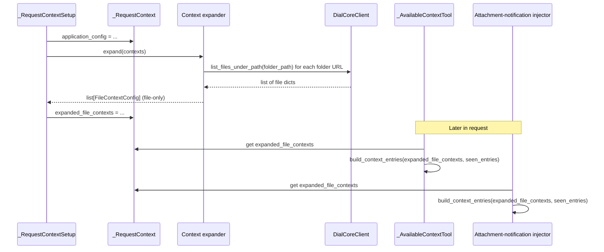

# Design: Folder Attachment for Context

**Status:** Draft

## Problem Statement

QuickApps backend supports admin-configured **contexts** (file or user-defined). File contexts are listed in `application_properties.contexts` as `FileContextConfig` with a DIAL-relative `url`. The available-context tool and the attachment-notification injector use `build_context_entries(contexts, seen_entries)` to produce context file metadata and detect new/updated/removed entries.

Today **only single files** can be attached. Each file requires its own config entry. When new files are added to a logical folder (e.g. a shared docs bucket), the administrator must change the QuickApp configuration to include each new file. There is no way to express “attach everything under this folder,” so context does not automatically reflect new or removed files under that path.

## Design Goals

- Administrator can attach **folders** as well as files to context. Attaching a folder means “all files under this folder” are in context.
- New files added to an attached folder are picked up **without** changing QuickApp configuration.
- Existing behaviour for single-file contexts remains unchanged; no new context discriminator type is introduced.
- Available-context tool and attachment-notification injector see the **same** expanded set of files (including those under folders), so “available context” and “context change notifications” stay consistent.

---

## Proposed Design

The design supports folder attachment via a **URL convention**: a context whose `url` ends with `/.dial_folder` denotes “attach the entire folder.” The logical folder path is the URL with `/.dial_folder` removed. A single **request-scoped context expansion** step (async) resolves folder URLs to concrete file URLs via `DialCoreClient` and stores the expanded list in request context. Downstream consumers use this expanded list so that folders appear as multiple file entries.

### Concern 1: Config and validation

**What:** `FileContextConfig` (in `quickapp.config.context`) already has `url` with `DialFileConfigField`. Allow `url` to end with `/.dial_folder` (folder placeholder). No new context type; the same `Context` union and `ApplicationConfig.contexts` list hold both file and folder-placeholder entries.

**Owner:** Config validation in `context.py` (e.g. `DialFileConfigField` or schema) must accept either a file path or a path ending with `/.dial_folder`.

**Semantics:** A context entry with `url` ending in `/.dial_folder` is treated as a folder context. The folder path used for listing is `url` with the `/.dial_folder` suffix removed. All other behaviour is driven by the **expanded** list produced in request setup.

**Change:** Introduce a shared constant (e.g. `DIAL_FOLDER_PLACEHOLDER = ".dial_folder"` or path suffix `"/.dial_folder"`). Update validation so `url` may be a file path or a path ending with `/.dial_folder`. No structural change to `ApplicationConfig.contexts`.

### Concern 2: DialCoreClient — list files under path

**What:** New method on `DialCoreClient` (in `quickapp.common.dial_core_client`) to list **all file URLs** under a folder path, recursively.

**Owner:** `DialCoreClient`.

**Semantics:**

- **Method:** `list_files_under_path(folder_path: str) -> list[dict]`
- Reuses existing `get_metadata(path)` and `_get_items(path)`; recurses into items with `nodeType == 'FOLDER'`.
- Returns one dict per **file** (not folder) under `folder_path`. Each dict has at least `url` (str). Optional: `name`, `content_type` / `contentLength` for consistency with existing metadata shape.
- **Ordering:** Deterministic (e.g. sort by URL) so that “new”/“removed” detection in `build_context_entries` is stable.
- **Limits:** Optionally enforce a reasonable limit (max files per folder or max depth) to avoid timeouts; document in code.

**Change:** Add `list_files_under_path`; no change to existing `get_metadata` / `search_file_on_core` signatures.

### Concern 3: Context expansion and request context

**What:** A new **context expander** abstraction and a new slot on `_RequestContext` for the expanded file list.

**Owner:** Request setup (`_RequestContextSetup` in `quickapp.application._request_context_setup`); new expander (e.g. in attachment/context module or application).

**Semantics:**

- **Context expander (new):**
  - **Input:** `list[Context]` and access to `DialCoreClient` (or a wrapper that can list folder contents).
  - **Output:** `list[FileContextConfig]` — file-only; each folder placeholder replaced by N file entries (one per file under that path).
  - **Invocation:** Async. Called once per request during `_RequestContextSetup.setup()` **after** `application_config` is set.
- **Request context:** New field, e.g. `expanded_file_contexts: list[FileContextConfig]`, populated by the expander. Both the available-context tool and the attachment-notification injector read this field when calling `build_context_entries`.

**Change:**

- Add `expanded_file_contexts` to `_RequestContext` (`quickapp.application._request_context`).
- Implement the expander: for each context whose `url` ends with `/.dial_folder`, call `list_files_under_path(folder_path)` and replace with file entries; pass through non-folder file contexts as-is; flatten to a single file-only list.
- In `_RequestContextSetup.setup()`, after setting `application_config`, call the expander and set `context.expanded_file_contexts`.
- **Logging:** Log folder path and number of files resolved; log failures when folder listing fails.
- **Error handling:** If folder listing fails (e.g. DIAL Core unavailable or permission denied), treat folder as empty or log and skip that folder’s files so the request does not break (exact behaviour to be defined in implementation).

### Concern 4: Consumers — use expanded file contexts

**What:** The available-context tool and the attachment-notification injector must use the **expanded** file contexts instead of raw `application_config.contexts` when building context entries.

**Owner:**  
- `_AvailableContextTool` (`quickapp.attachment_processing._available_context_tool`)  
- Attachment-notification injector (`quickapp.attachment_processing._attachment_notification_injector`)

**Semantics:** When calling `build_context_entries(contexts, seen_entries)`, pass `expanded_file_contexts` from request context (so that folder entries have already been expanded to file entries). The signature of `build_context_entries` in `_context_entries.py` does not change; it continues to receive a list of file-level contexts.

**Change:**  
- In `_AvailableContextTool._get_response()` (or equivalent), obtain expanded file contexts from request context and pass them into `build_context_entries` instead of `application_config.contexts`.  
- In the attachment-notification injector `transform()`, use expanded file contexts from request context instead of `application_config.contexts` when calling `build_context_entries`.  
Result: available-context tool returns entries for all files under a folder; attachment notification detects new/removed files under a folder without config change.

### Data flow (summary)



---

## Key interfaces and data contracts

| Item | Contract |
|------|----------|
| **Folder placeholder** | Path suffix `"/.dial_folder"` (constant e.g. `DIAL_FOLDER_PLACEHOLDER = ".dial_folder"`). A context with `url` ending with `/.dial_folder` is a folder context; folder path = `url` with that suffix removed. |
| **DialCoreClient** | `list_files_under_path(folder_path: str) -> list[dict]`; each dict at least `url`; optional `name`, `content_type`, `contentLength`. Uses existing metadata/items API; recurse on `nodeType == 'FOLDER'`. |
| **Context expander** | Input: `list[Context]` + DialCoreClient (or wrapper). Output: `list[FileContextConfig]`. Async. Invoked once per request in setup. |
| **_RequestContext** | New field: `expanded_file_contexts: list[FileContextConfig]`, set during setup. Read by available-context tool and attachment-notification injector. |
| **build_context_entries** | No signature change. Continues to receive a list of file-level contexts (possibly the expanded list). |

---

## Secondary considerations

- **Auth:** `DialCoreClient` uses existing request-scoped API key / DialSettings; no new auth surface.
- **Extensibility:** Folder placeholder name (`.dial_folder`) should be a single constant so future changes (e.g. multiple placeholder types) are localised.
- **Schema/UI:** If an admin UI later adds folder selection, it should produce URLs ending with `/.dial_folder`. Backend does not depend on UI beyond receiving valid config.

---

## Out of Scope

- **New context type:** No new discriminator (e.g. `FolderContextConfig`); we use a URL convention on `FileContextConfig` to keep config schema and existing UIs unchanged.
- **Recursive folder limits in config:** Initial implementation may enforce a single constant limit (e.g. max files or max depth) in code rather than per-folder config.
- **Admin UI for folder picker:** This design only specifies backend behaviour; UI changes are out of scope.

---

## Configuration / Usage Examples

### Single file (unchanged)

```json
{
  "contexts": [
    {
      "type": "file",
      "url": "files/bucket-id/docs/readme.md",
      "description": "Main readme"
    }
  ]
}
```

### Folder attachment

To attach all files under `files/bucket-id/shared-docs/`:

```json
{
  "contexts": [
    {
      "type": "file",
      "url": "files/bucket-id/shared-docs/.dial_folder",
      "description": "All shared documentation"
    }
  ]
}
```

The backend resolves `files/bucket-id/shared-docs/.dial_folder` to the list of file URLs under `files/bucket-id/shared-docs/` via DIAL Core and treats each file as a separate context entry for available-context and attachment notifications. New files added under `shared-docs/` appear in context without changing this config.

### Mixed file and folder

```json
{
  "contexts": [
    { "type": "file", "url": "files/bucket-id/static/terms.pdf" },
    { "type": "file", "url": "files/bucket-id/dynamic/.dial_folder", "description": "Dynamic content" }
  ]
}
```

---

## Error handling and logging

- **Folder listing failure:** If `list_files_under_path` fails (e.g. DIAL Core unavailable, permission denied), define behaviour so the request does not fail: e.g. treat that folder as empty (no files from that folder in context) and log the error. Exact behaviour to be fixed in implementation.
- **Logging:** Log successful folder expansion (folder path and count of files resolved) and log failures when folder listing fails.

---

## Risks and constraints

- **External API:** Depends on DIAL Core metadata/list API; behaviour and response shape (e.g. `nodeType`, `items`) are assumed stable.
- **Performance:** Large or deeply nested folders may produce many entries; a reasonable limit (max files per folder or max depth) should be considered to avoid timeouts or oversized responses.
- **Ordering:** Deterministic order for expanded file list (e.g. sort by URL) is required so that new/removed detection is stable.

---

## Migration

### Breaking changes

None. Existing configs use only file URLs; they continue to work. New behaviour is opt-in via `/.dial_folder` URLs.

### Non-breaking changes

- New optional `url` form: path ending with `/.dial_folder`.
- New request-context field and expander; consumers that currently read `application_config.contexts` are updated to read `expanded_file_contexts` when building file-context entries (so folder support is transparent to callers of `build_context_entries`).

---

## Summary of Changes

| Component | Change |
|-----------|--------|
| **Config (`context.py`)** | Allow `url` to end with `/.dial_folder`; add or adjust validation. Introduce `DIAL_FOLDER_PLACEHOLDER` (or path suffix) constant. |
| **Application config** | No structural change; contexts may include folder-placeholder entries. |
| **DialCoreClient** | Add `list_files_under_path(folder_path: str) -> list[dict]`; recursive; deterministic order; optional limit. |
| **_RequestContext** | Add `expanded_file_contexts: list[FileContextConfig]`. |
| **_RequestContextSetup** | After setting `application_config`, call context expander and set `expanded_file_contexts`. |
| **Context expander (new)** | Async; input `list[Context]` + DialCoreClient; output `list[FileContextConfig]`; replace folder URLs with file entries. |
| **_AvailableContextTool** | Use `expanded_file_contexts` from request context when calling `build_context_entries`. |
| **Attachment-notification injector** | Use `expanded_file_contexts` from request context when calling `build_context_entries`. |
| **build_context_entries** | No signature or behaviour change; still receives file-level contexts. |
