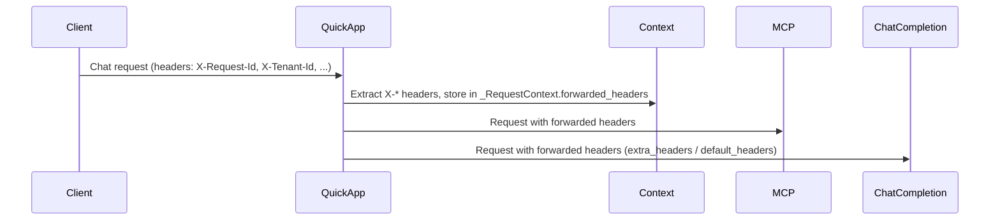

# Design: Forwarded X-* Headers

**Status:** Implemented

## Problem Statement

Callers of the QuickApp (e.g. DIAL Core, gateways, or clients) often send custom headers whose names start with `X-` (e.g. `X-Request-Id`, `X-Tenant-Id`, `X-Correlation-Id`). These headers are useful for tracing, multi-tenancy, or policy enforcement. Today they are not visible to downstream services: when the QuickApp calls MCP servers or ChatCompletion APIs (Azure OpenAI, DIAL deployments), those requests are made without the original request’s X-* headers. As a result, downstream systems cannot correlate requests or apply tenant-specific behavior.

## Design Goals

- **Extract** all incoming request headers whose names start with `X-` (case-insensitive) from the chat completion request.
- **Forward** those headers to every outbound MCP and ChatCompletion request made during that chat completion.
- **No new configuration** — forwarding is always on; no opt-in or allow-list is required.
- **Minimal surface** — use a single request-scoped value (injected via DI) so all consumers receive the same filtered dict.

---

## Proposed Design

### Flow

1. On chat completion, the incoming SDK `Request` is processed by `_RequestContextSetup`. Headers are read from `request.headers` (or `request.original_request.headers` when available).
2. Only headers whose names start with `X-` (case-insensitive) are kept and stored in `_RequestContext.forwarded_headers` (a `dict[str, str]`).
3. The same value is provided to the injector as the `ForwardedHeaders` type (an `Annotated[dict[str, str] | None, "ForwardedHeaders"]`), so any component that needs to call out can request it.
4. **MCP:** `_MCPConnectionManager` injects `ForwardedHeaders` and merges them into the headers used for SSE and streamable-HTTP MCP connections (`__build_headers`).
5. **Azure OpenAI ChatCompletion:** `AgentModule.provide_openai_client` injects `ForwardedHeaders` and passes them as `default_headers` to `AsyncAzureOpenAI`. `AssistantInvoker` also passes them as `extra_headers` on each `chat.completions.create` call when present.
6. **DIAL deployment ChatCompletion:** `DialCompletionService` injects `ForwardedHeaders` and passes them as `extra_headers` (or equivalent) when calling `dial_client.chat.completions.create`.
7. **REST API tools:** `_RestApiTool` injects `ForwardedHeaders` and merges them into the outgoing HTTP request headers when calling external REST endpoints.

### Main components

| Component | Responsibility |
|-----------|----------------|
| `extract_x_headers_from_request()` | Reads the SDK `Request`, returns a dict of headers whose names start with `X-`. |
| `_RequestContext.forwarded_headers` | Holds the filtered dict for the request lifecycle. |
| `ForwardedHeaders` (Annotated type) | DI key for injecting `dict[str, str] \| None` into MCP, ChatCompletion, and REST tool code. |
| `AppModule.__provide_forwarded_headers` | Provider that returns `context.forwarded_headers` so the value is request-scoped. |

### Semantics

- **Configuration requests** do not set `forwarded_headers`; the context default is an empty dict, so no headers are forwarded for config-only flows.
- **Empty or missing headers:** If no X-* headers are present, the injected value is an empty dict (or `None` in tests that do not set up request context). Consumers treat falsy values as “no headers to add.”
- **Case:** Header names are preserved as received (e.g. `X-Request-Id` stays `X-Request-Id`). Matching is case-insensitive for the `X-` prefix only.

---
