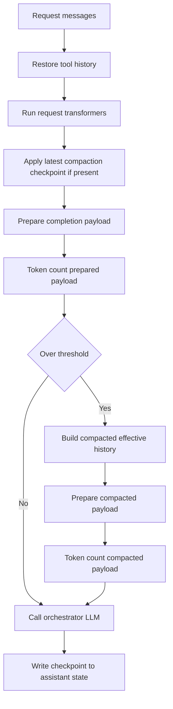

# Design: History compaction strategy

- **Status:** Draft
- **Dependencies:**
  - [Context window usage](context_window_usage.md) - provider-native token-count preflight, model limits, and `context_usage` state.
  - [History compaction UI/backend communication](history_compaction_ui_backend.md) - `custom_content.state` round-trip contract and optional UI trimming tracks.

## Problem Statement

Long QuickApp conversations can exceed the orchestrator model context window because the UI sends the full `messages` array on every turn. The backend then restores assistant `custom_content.state.tool_execution_history` into assistant/tool message pairs and sends that expanded history to the LLM.

Today this creates several failure modes:

1. **Tool history expands hidden state into prompt tokens** - a single assistant row can carry a large tool-call history in `custom_content.state`; after restoration it can dominate the context window.
1. **No effective-history shortening** - even if the backend can detect that the request is close to the context limit, it has no strategy for replacing old history with a smaller representation.
1. **State can only be persisted on the next assistant message** - compaction performed for the current request must also be written to the next assistant response so the UI can round-trip the checkpoint on the following turn.
1. **Attachments and artifacts can be lost by naive summarization** - compacting prose alone risks dropping attachment names, file URLs, generated artifact references, and whether a document was actually inspected.
1. **A summary can still be too large** - compaction needs its own token budget and retry path instead of assuming that any summary will fit.

This design defines the backend compaction strategy, compacted state shape, and message-selection rules. It builds on the token-count hook from `context_window_usage.md` and the UI persistence contract from `history_compaction_ui_backend.md`.

## Design Goals

- **G1 - Prevent over-limit upstream calls:** When token-count preflight exceeds the compaction threshold, build a smaller effective history before calling the orchestrator model.
- **G2 - Preserve conversation semantics:** Retain user goals, constraints, decisions, unresolved tasks, tool outcomes, and artifact references while dropping low-value bulk.
- **G3 - Preserve tool integrity:** Never create invalid chat history with orphan tool messages or assistant tool calls without matching tool results.
- **G4 - Preserve attachment identity:** Keep structured attachment and artifact references even when their surrounding messages are summarized.
- **G5 - Bound compacted state size:** Token-count the compacted effective payload and recursively shrink the compacted state if it still exceeds budget.
- **G6 - Persist the checkpoint:** Write compaction metadata to the next assistant message `custom_content.state` so the next request can anchor on it.
- **G7 - Keep configuration small:** Use one backend compaction pipeline with internal content-aware reducers, not many user-facing strategy knobs.

---

## Use Cases

### UC-1: Long plain-text thread reaches the threshold

**Trigger:** Token-count preflight for the orchestrator request exceeds the configured compaction threshold.

**Behavior:** QuickApp keeps the protected prefix and recent suffix raw, summarizes older plain-text turns into compacted state, rebuilds the effective history, then token-counts the rebuilt payload.

**Outcome:** The current LLM call succeeds with a shorter prompt. The final assistant message includes the compaction checkpoint in `custom_content.state` for the next turn.

### UC-2: Old assistant row contains large restored tool history

**Trigger:** Request setup expands `state.tool_execution_history` from an old assistant message, making the prompt too large.

**Behavior:** QuickApp groups assistant/tool messages into tool episodes and summarizes old episodes as tool outcomes, preserving durable IDs, URLs, artifact names, errors, and any useful final result.

**Outcome:** The LLM sees the outcome of old tool work without receiving all raw tool bodies.

### UC-3: User uploaded attachments

**Trigger:** Compactable history contains messages with `custom_content.attachments` or tool results that reference DIAL files.

**Behavior:** QuickApp records attachment metadata in a structured registry and summarizes only observed or extracted facts. If an attachment was uploaded but never read, the state says it was referenced but not analyzed.

**Outcome:** Attachment names and references survive compaction without inventing document contents.

### UC-4: Audio or transcript-heavy messages are old enough to compact

**Trigger:** Compactable history contains audio-derived content, transcripts, or speech-to-text tool results.

**Behavior:** QuickApp reduces the transcript into concise text while preserving speaker intent, key facts, decisions, and any referenced attachments or artifacts.

**Outcome:** The LLM receives the useful content from the audio without carrying the full transcript in the prompt.

### UC-5: Compacted history is still too large

**Trigger:** The rebuilt effective payload still exceeds the target after the first compaction attempt.

**Behavior:** QuickApp runs recursive shrink steps: compress the summary, prune low-value sections, reduce attachment/tool details to metadata, and retest with token count.

**Outcome:** The effective payload fits the budget or QuickApp returns a controlled error instead of sending an over-limit LLM request.

---

## Proposed Design

### Concern 1: Runtime placement and payload parity

- **What:** Add a history-compaction step that shares the exact message-preparation path used for orchestrator token counting and completion.
- **Owner:** QuickApp backend, in the agent/orchestrator request path.
- **Semantics:**
  1. Request setup restores `custom_content.state.tool_execution_history` into assistant/tool message pairs.
  1. Request-level message transformers run.
  1. If a valid `history_compaction` checkpoint exists, QuickApp reconstructs the baseline effective history from that checkpoint plus the later raw suffix; otherwise it counts the restored transcript.
  1. QuickApp builds the same logical orchestrator input that completion will use, including pre-invocation transformers currently applied in `_ChatCompletionConfigBuilder._prepare_messages`.
  1. The raw effective payload is sent to the token-count endpoint.
  1. If context fill is below threshold, no compaction runs.
  1. If context fill is above threshold, QuickApp builds a compacted message list, runs it through the same pre-invocation preparation path, and token-counts that prepared payload again.
  1. The prepared compacted payload that was counted is passed to completion without another divergent message transformation step.
  1. The compaction checkpoint is written to the next assistant message state.
- **Change:** The model no longer always receives the fully restored UI transcript. It receives an effective transcript derived from the UI transcript plus the latest valid compaction checkpoint, and the counted payload stays identical in meaning to the completion payload.

Implementation should avoid a second, hidden message-preparation path. Either:

1. Refactor `_ChatCompletionConfigBuilder` so token counting, compaction, and `AssistantInvoker` all consume one shared prepared-payload builder.
1. Or split message preparation from payload assembly so compaction can replace the `messages` field and then reuse the same prepared payload for both token count and completion.



### Concern 2: History zones

- **What:** Split the conversation into protected prefix, compactable body, and recent suffix.
- **Owner:** `HistoryCompactionService`.
- **Semantics:**
  - **Protected prefix:** System/setup content that must remain raw or be regenerated by backend. This includes system messages and required assistant/tool pairs used for skill loading or internal context enrichment when they are needed for app behavior.
  - **Compactable body:** Older user/assistant/tool episodes that can be replaced by a compacted summary and structured references.
  - **Recent suffix:** Last N turns or episodes kept raw to preserve local coherence for the next answer.
- **Change:** Compaction operates on episode groups, not arbitrary individual messages.

Protected messages can still contribute to a separate "active context summary" if they are expensive enrichment outputs, but the MVP should avoid dropping required setup messages. If a setup/enrichment message is deterministic, prefer regeneration or raw retention over summarizing it as user conversation.

### Concern 3: Episode grouping

- **What:** Normalize messages into compaction episodes before selecting what to compact.
- **Owner:** `HistoryEpisodeBuilder`.
- **Semantics:** Episodes are the smallest safe compaction unit:
  - Plain user message plus assistant answer.
  - Assistant tool-call message plus matching tool result messages and the assistant follow-up.
  - Attachment upload plus related list/read/get-content tool activity.
  - Short clarification sequences grouped into one requirements episode.
  - Existing compaction anchor plus later messages.
- **Change:** Tool messages are never compacted without their owning assistant tool call. This preserves OpenAI-style tool integrity.

### Concern 4: Content-aware reducers

- **What:** Use one compaction pipeline with internal reducers selected by episode shape.
- **Owner:** `HistoryCompactionService`.
- **Semantics:** Reducers produce a common compacted representation. They are internal implementation details, not separate public strategies.

Recommended reducers:

| Reducer | Input shape | Output |
|---------|-------------|--------|
| `PlainConversationReducer` | Text-only user/assistant turns | Goals, constraints, decisions, open questions, final answers |
| `ToolEpisodeReducer` | Assistant/tool message groups | Tool intent, relevant arguments, outcome, errors, durable IDs/URLs |
| `AttachmentEpisodeReducer` | Messages or tool results with attachments/files | Attachment registry entries and observed facts only |
| `AudioTranscriptReducer` | Audio messages, transcripts, speech-to-text tool results | Concise text summary with speaker intent and key facts |
| `StageNoiseReducer` | Reasoning/progress/stage-heavy content | User-visible conclusion or nothing if purely diagnostic |
| `ArtifactReferenceReducer` | Generated files, charts, exports, links | Artifact name, URL, purpose, status |

- **Change:** `history_compaction` enables the pipeline; reducer selection is automatic based on episode shape.

### Concern 5: Attachment and artifact registry

- **What:** Store attachment and artifact metadata separately from prose summary.
- **Owner:** `HistoryCompactionService`.
- **Semantics:** Every attachment or generated artifact found in compacted history gets a small structured entry. The prose summary may reference these entries but does not need to carry all metadata inline.
- **Change:** Compaction no longer risks losing names or URLs when old messages are omitted from effective history.

Illustrative entry:

```json
{
  "name": "contract.pdf",
  "url": "files/abc/contract.pdf",
  "source": "user",
  "content_type": "application/pdf",
  "status": "referenced",
  "observed_facts": [],
  "first_seen_at": {
    "message_index": 12
  }
}
```

Attachment statuses:

| Status | Meaning |
|--------|---------|
| `referenced` | Attachment appeared in history but was not read or analyzed by the backend/model. |
| `read` | Attachment content was loaded or exposed through a tool result. |
| `summarized` | Relevant extracted content is represented in compacted summary. |
| `generated` | Artifact was created by QuickApp or a tool and sent to the user. |

### Concern 6: Compacted state schema

- **What:** Store compaction checkpoint under `custom_content.state.history_compaction`.
- **Owner:** QuickApp writes; UI preserves and resends.
- **Semantics:** The latest valid assistant message with `history_compaction` is the anchor. On the next request, messages before that anchor can be ignored for effective LLM input and replaced by the compacted state.
- **Change:** Replaces illustrative `history_compacted` and `history_summary` fields from the UI/backend draft with a versioned object.

Anchor semantics:

- The primary anchor rule is "latest valid assistant message containing `custom_content.state.history_compaction`".
- If the UI/backend message contract provides stable message ids, store the compacted-through id and use it for validation.
- `message_index` is diagnostic only; it can help tests and logs, but it must not be the sole source of truth because UI-side trimming can renumber messages.

Draft schema:

```json
{
  "history_compaction": {
    "schema_version": 1,
    "compacted_through": {
      "message_id": "msg_018",
      "message_index": 18,
      "anchor_role": "assistant"
    },
    "summary": "User is building a QuickApps history compaction design. Key decisions: ...",
    "preserved_facts": [
      "Compaction runs before the current LLM call when token count exceeds threshold.",
      "The compacted checkpoint is written to the next assistant message state."
    ],
    "open_questions": [],
    "attachments": [
      {
        "name": "contract.pdf",
        "url": "files/abc/contract.pdf",
        "source": "user",
        "content_type": "application/pdf",
        "status": "referenced",
        "observed_facts": []
      }
    ],
    "artifacts": [],
    "tool_outcomes": [
      {
        "tool_name": "internal_attachments_get_content",
        "outcome": "Loaded selected pages from contract.pdf",
        "status": "success"
      }
    ],
    "token_budget": {
      "target_tokens": 8192,
      "estimated_tokens": 2100
    }
  }
}
```

### Concern 7: Compaction feature configuration

- **What:** Add `HistoryCompactionConfig` under `features.history_compaction`, with an optional summarizer deployment.
- **Owner:** Config layer and compaction service.
- **Semantics:** History compaction is a feature-level capability because it depends on context-usage measurement rather than on a specific orchestrator deployment parameter. When `features.history_compaction.enabled` is `true`, QuickApp also enables the context-usage measurement path required for token-count preflight, even if `features.context_usage` is omitted. If `summarizer_deployment` is set, QuickApp uses it for summarization. If omitted, QuickApp falls back to the main orchestrator deployment.
- **Change:** Moves compaction config under `features`, keeps summarization configurable without requiring a separate application-level tool or deployment type, and makes the dependency on `context_usage` explicit.

Config fields:

| Field | Default | Validation | Omitted behavior |
|-------|---------|------------|------------------|
| `enabled` | `false` | boolean | No compaction, no summarizer calls, and no `history_compaction` state is written. |
| `trigger_percent` | `85` | `1 <= value <= 100` | Compaction starts when token-counted input reaches 85% of the prompt limit. |
| `target_percent` | `70` | `1 <= value < trigger_percent` | Recursive shrink targets 70% after compaction. |
| `keep_recent_turns` | `3` | integer `>= 1` | Keep the latest three user-facing turns or equivalent tool episodes raw. |
| `summary_budget_tokens` | derived from `target_percent`, capped at `8192` | integer `>= 512` when set | Use a bounded summary budget computed from the model limit. |
| `summarizer_deployment` | `null` | same deployment config shape as `orchestrator.deployment` | Use the main orchestrator deployment as the summarizer. |

`features.history_compaction` should be a stable disabled-by-default config block, not preview-gated. The field is inert when omitted or when `enabled` is `false`. When `enabled` is `true`, config resolution treats `features.context_usage` as enabled for the backend measurement path because compaction cannot safely decide when or how much to shrink without provider-native token-count preflight. This remains compatible with making `features.context_usage.enabled` default to `true` in a nearby release.

Example:

```json
{
  "features": {
    "history_compaction": {
      "enabled": true,
      "trigger_percent": 85,
      "target_percent": 70,
      "keep_recent_turns": 3,
      "summary_budget_tokens": 8192,
      "summarizer_deployment": {
        "deployment_id": "gpt-5.2-mini"
      }
    }
  },
  "orchestrator": {
    "deployment": {
      "deployment_id": "gpt-5.2"
    }
  }
}
```

### Concern 8: Recursive shrink and failure behavior

- **What:** Treat compaction as successful only if the rebuilt effective payload fits the target budget.
- **Owner:** `HistoryCompactionService` and `ContextUsageService`.
- **Semantics:**
  1. Build first compacted state.
  1. Rebuild effective messages.
  1. Token-count the effective payload.
  1. If it still exceeds target, shrink the compacted state with stricter instructions.
  1. Drop low-value sections in order: stage details, verbose tool bodies, repeated errors, non-recent observed facts, attachment observed facts while keeping attachment identity.
  1. Retry up to a small fixed limit.
  1. If still too large, return a controlled context-limit error.
- **Change:** QuickApp avoids sending an upstream LLM request that is known to be too large.

### Concern 9: Effective history reconstruction

- **What:** Convert compacted state plus raw suffix into valid model messages.
- **Owner:** `HistoryCompactionService`.
- **Semantics:** The compacted state is injected as a synthetic assistant message after the protected prefix and before the recent suffix. The message content uses a deterministic envelope so golden tests can compare the effective history.
- **Change:** The backend can ignore UI messages before the anchor while still preserving their meaning in a compacted replacement.

MVP synthetic message envelope:

```text
Previous conversation was compacted by QuickApp.

Summary:
{summary}

Preserved facts:
- {fact}

Open questions:
- {question}

Attachments and artifacts:
- {name} ({status}): {url_or_description}

Tool outcomes:
- {tool_name}: {status}; {outcome}
```

Provider-specific role or envelope changes are future compatibility work and must keep the same compacted state schema.

Illustrative effective order:

1. System/setup messages.
1. Protected skill/context-enrichment messages that must remain raw.
1. Synthetic compacted history message derived from `history_compaction`.
1. Recent raw user/assistant/tool episodes.
1. New user message.

---

## Secondary Fixes

### Logging and privacy

Compacted summaries may contain sensitive user data. Logs should report sizes, token counts, and reducer names, not full summaries or attachment contents.

### Metrics

Add counters for compaction triggered, compaction succeeded, recursive shrink count, final percent, controlled failures, and reducer categories used. This will show whether content-aware reducers are worth their complexity.

---

## Out of Scope

- **UI-side deletion of old messages:** Deferred to Track 2 in `history_compaction_ui_backend.md`. Backend effective-history compaction works even when UI keeps sending the full transcript.
- **Server-owned session history:** Deferred to a larger session model. This design stays compatible with stateless UI-resends-full-history behavior.
- **Vector/RAG memory over chat history:** Useful later, but too large for MVP and requires retrieval correctness work.
- **Provider-specific summarization prompts:** MVP should use one conservative summarization prompt with structured output.
- **Exact attachment content extraction:** Compaction records attachment identity and observed facts. It does not introduce new document parsing beyond existing tools.

---

## Configuration / Usage Examples

### Minimal enabled config

```json
{
  "features": {
    "history_compaction": {
      "enabled": true
    }
  },
  "orchestrator": {
    "deployment": {
      "deployment_id": "gpt-5.2"
    }
  }
}
```

### Summarizer fallback

If `features.history_compaction.summarizer_deployment` is omitted, QuickApp uses `orchestrator.deployment` for compaction. This keeps existing apps easy to enable while allowing production apps to choose a cheaper or faster summarizer.

### Context usage dependency

Enabling `features.history_compaction.enabled` also enables the backend context-usage measurement path needed for compaction decisions. Apps may still configure `features.context_usage` directly when they need UI-visible context-meter behavior, but compaction does not require the app author to set both feature blocks.

### Acceptance checks

| ID | Check |
|----|-------|
| R1 | A request above `trigger_percent` compacts before the current LLM call, not only after the turn. |
| R2 | Final assistant state contains `history_compaction.schema_version: 1` after compaction succeeds. |
| R3 | Next request with the checkpoint can omit messages before the anchor from effective LLM input. |
| R4 | Tool messages are compacted only as complete assistant/tool episodes. |
| R5 | Attachments from compacted history appear in `history_compaction.attachments` with name, source, and status. |
| R6 | Audio/transcript-heavy compacted history is represented as concise text, not raw transcript bulk. |
| R7 | If compacted payload still exceeds budget after retries, QuickApp returns a controlled error and does not call the orchestrator LLM. |

---

## Migration

### Breaking changes

None. The feature is disabled by default and relies on optional config plus optional `custom_content.state.history_compaction`.

### Non-breaking changes

- Adds optional `features.history_compaction` config.
- Adds optional `custom_content.state.history_compaction` on assistant messages.
- Reuses the existing UI requirement to preserve unknown `custom_content.state` fields.
- Keeps the UI full-history request contract unchanged for MVP.
- Exposes one public compaction mode in v1; content-aware reducers remain internal policy.

## Summary of Changes

| Area | Addition or change |
|------|--------------------|
| Config | `features.history_compaction.enabled`, `trigger_percent`, `target_percent`, `keep_recent_turns`, `summary_budget_tokens`, optional `summarizer_deployment`; enabling it also enables backend `context_usage` measurement |
| Agent request path | Compaction step that reuses the same prepared-payload path for token counting and orchestrator LLM invocation |
| State | Versioned `custom_content.state.history_compaction` checkpoint |
| Compaction service | Episode grouping, content-aware reducers, recursive shrink, effective-history reconstruction |
| Attachments | Structured attachment/artifact registry preserved outside prose summary |
| Tests | Token-threshold trigger, tool-episode integrity, attachment preservation, recursive shrink, next-turn checkpoint reuse |

---

## Review Notes — Round 1

- **Reviewer:** Claude (quickapps-design-review skill)
- **Date:** 2026-06-24

### Verdict

Blocking issues must be addressed. The design is well structured and covers the hard semantic cases, especially tool episodes and attachment identity, but it needs a more exact runtime placement and config contract before implementation can proceed safely.

### Blocking issues

1. **Proposed Design / Concern 1: Runtime placement** — The doc says compaction runs after "normal message transformers" and after the "chat-completion payload is built for token counting", but the current LLM payload is also changed later by pre-invocation transformers in `_ChatCompletionConfigBuilder._prepare_messages` (`src/quickapp/core/agent/_chat_completion_config_builder.py:78`) before `chat.completions.create` (`src/quickapp/core/agent/assistant_invoker.py:34`). If compaction/counting is inserted only between `_RequestContextSetup.setup_messages` and `AssistantInvoker.invoke`, it can measure or compact a payload that is not exactly what the model receives, contradicting the linked context-usage design's "exact logical input" requirement.
   **Suggestion:** Specify the concrete integration point: either move compaction/token-counting behind the same payload-preparation path used by `_ChatCompletionConfigBuilder`, or refactor that builder so compaction receives the post-transform effective payload and then passes the same messages into completion.

2. **Proposed Design / Concern 7: Compaction model configuration** — The example introduces `enabled`, `trigger_percent`, `target_percent`, `keep_recent_turns`, `summary_budget_tokens`, and `summarizer_deployment`, but only `summarizer_deployment` has omitted-field semantics. The design goals promise "Keep configuration small", while the README rubric requires explicit defaults and non-obvious behavior. Without defaults, `None` handling, validation bounds, and preview-gating decision, implementers cannot know whether this lands as a stable public schema or a preview field.
   **Suggestion:** Add a compact config table covering each field's default, validation range, omitted behavior, and whether `orchestrator.history_compaction` is gated by `ENABLE_PREVIEW_FEATURES` / `PreviewField` or is a stable disabled-by-default feature.

### Suggestions

1. **Proposed Design / Concern 6: Compacted state schema** — The schema uses `compacted_through.message_index` in the main contract and only later notes in Secondary Fixes that indexes are fragile. Because the UI/backend dependency already calls out optional trimming tracks, an index-like anchor in the primary schema could become stale as soon as Track 2 exists.
   **Suggestion:** Move the "prefer stable message id / latest valid checkpoint" rule into Concern 6 and make `message_index` explicitly illustrative or diagnostic rather than the primary anchor contract.

2. **Proposed Design / Concern 9: Effective history reconstruction** — The design says the synthetic compacted message can be "assistant or system-adjacent" and that the exact role "should match provider compatibility". That is a reasonable implementation concern, but it leaves the persisted state schema and golden tests without a deterministic expected message shape.
   **Suggestion:** Pick the MVP role and content envelope in the design, then list provider-specific deviations as future compatibility work if needed.

### Nits

1. **Proposed Design / Concern 4: Content-aware reducers** — "QuickApp does not expose multiple compaction strategies in configuration for v1" is useful compatibility information, but the skill rubric asks to keep non-change prose out of design-body sections where possible.
   **Suggestion:** Move this sentence to Migration / Non-breaking changes or shorten it into the config concern's default behavior.

---

## Review Notes — Round 2

- **Reviewer:** Claude (quickapps-design-review skill)
- **Date:** 2026-06-24

### Verdict

Ready for approval pending minor suggestions. The Round 1 blockers are resolved: payload parity is now explicit, config defaults and gating are specified, anchor semantics moved into the schema concern, and the synthetic message envelope is deterministic enough for golden tests.

### Suggestions

1. **Proposed Design / Concern 7: Compaction model configuration** — The doc now says enabling compaction requires `features.context_usage.enabled: true`, but it does not state what happens when `orchestrator.history_compaction.enabled: true` is configured without that dependency, or when the token-count endpoint is unavailable. This matters because the linked context-usage design allows count failures to continue without a meter, while this design's G1 and UC-5 promise to avoid known over-limit calls and return controlled errors.
   **Suggestion:** Add one sentence or config-table row that defines this failure mode: schema/config validation error, initialization warning with compaction disabled, or controlled runtime error before orchestrator completion.

2. **Proposed Design / Concern 1: Runtime placement and payload parity** — The runtime flow covers first-time compaction, and Concern 6 says the latest valid `history_compaction` message is the anchor. The flow does not explicitly show whether an existing checkpoint is applied before the "raw effective payload" token count on the next turn.
   **Suggestion:** Add a short step after request transformers: "If a valid checkpoint exists, reconstruct baseline effective history from it before counting; if no checkpoint exists, count the restored transcript." That makes the cross-turn behavior line up with R3 and the UI/backend contract.

### Changes since previous round

1. **Resolved:** Round 1 blocking issue on runtime placement. Concern 1 now names `_ChatCompletionConfigBuilder._prepare_messages`, requires shared preparation for token count and completion, and updates the flow diagram.
2. **Resolved:** Round 1 blocking issue on config defaults and gating. Concern 7 now includes defaults, validation ranges, omitted behavior, and the stable disabled-by-default decision.
3. **Resolved:** Round 1 suggestion on anchor fragility. Concern 6 now makes latest-valid-checkpoint the primary rule and treats `message_index` as diagnostic only.
4. **Resolved:** Round 1 suggestion on effective history reconstruction. Concern 9 now chooses a synthetic assistant message and deterministic envelope for MVP.
5. **Resolved:** Round 1 nit on non-change prose. The reducer strategy note was moved into positive behavior in Concern 4 and compatibility wording in Migration.
