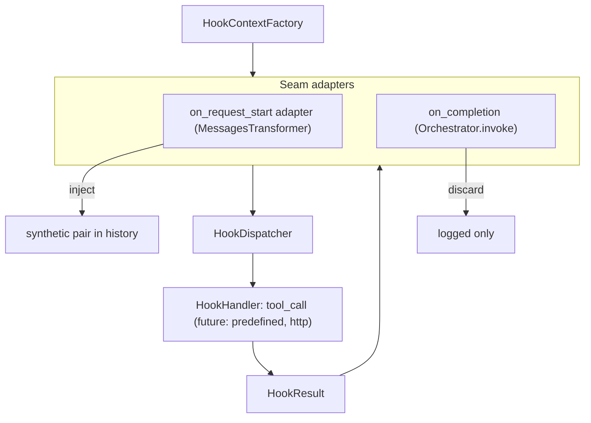

# Design: Hook Context, Parameter Templating, and Lifecycle Events

- **Status:** Implemented
- **User-facing:** [CONFIGURATION - Hooks](../../CONFIGURATION.md#hooks-configuration) / [Hooks guide](../hooks.md)
- **Phases:** Phase 1 (this iteration, specified in detail) and Phase 2 (background execution, a
  hook-level `condition` and role-filtered message lists, conditional) — see [Phasing](#phasing)
- **Dependencies:**
  - [Config-Driven Synthetic Tool Call Injection](config_driven_hooks.md) — supersedes its runtime once implemented
  - [Generic Synthetic Tool-Call Injector](generic_synthetic_toolcall_injector.md)

## Problem Statement

Config-driven hooks ([config_driven_hooks.md](config_driven_hooks.md)) support exactly one seam and one
behavior: at `on_request_start`, call a tool with **literal** arguments and inject the result as a
synthetic `(ASSISTANT/tool_calls, TOOL)` pair.

An agent-memory PoC built by an adjacent team needs more than that:

- **Write memory after the turn.** A hook must fire after the agent loop produces its final answer and
  call a tool with the final assistant text (`last_assistant_message`). There is no seam after the loop
  today.
- **Read memory at turn start, keyed by the user's message.** The existing `on_request_start` hook can
  call a tool, but its `arguments` are literals — it cannot pass the latest user message, or any other
  artifact of the conversation, to the tool.
- **More seams will follow.** Tool-call checkpoints (before and after each tool execution) with access
  to tool names and arguments are the expected next step. Requirements are still forming.

The current runtime also does not generalize. `_ConfigDrivenToolCallHook` fuses three concerns into one
`MessagesTransformer` subclass:

1. **What runs** — look up a `StagedBaseTool` and call `arun()`.
2. **What happens to the result** — inject a synthetic pair into history.
3. **Injection policy** — `frequency` and TTL `refresh_condition`.

That shape fits only `on_request_start` and only tool calls. A seam that is not a message transformer
(after the loop, around a tool call), or a handler that is not a tool (a predefined Python function, an
HTTP call), has nowhere to plug in.

## Design Goals

- Add an `on_completion` event that fires after the agent loop's final answer, before the response and
  request-scoped resources close.
- Define a documented, read-only **hook context** per event, exposing agent-loop artifacts (message
  history, last user/assistant message, loop counters).
- Let hook `arguments` reference context values through a [JSON-e](https://json-e.js.org) template
  (`${expr}` interpolation and `{"$eval": "expr"}`) instead of a custom grammar; the engine stays behind a
  small engine-neutral facade so it can be replaced.
- Split the hook runtime into handler / dispatcher / seam adapter so that new events and new handler
  kinds can be added without touching existing ones.
- Keep every existing `hooks` manifest working unchanged; migrate the existing runtime onto the new
  pipeline rather than running two runtimes side by side.
- Never execute shell commands or manifest-supplied code: the service is multi-tenant and server-side.

---

## Phasing

| Phase | Scope | Status |
|---|---|---|
| **1** | `on_completion` (blocking), hook context, JSON-e argument templating with best-effort config validation, handler / dispatcher / seam-adapter split | Specified in this document |
| **2** | `execution: background` for `on_completion`; hook-level `condition`; role-filtered message lists in the context | Conditional — see [Phase 2](#phase-2-background-execution-conditional) |

Phase 2 holds three independent items. Background execution starts only if Phase 1 proves the hook model
worthwhile **and** the memory PoC shows that blocking `on_completion` latency is a real problem; it may
never be built. The hook-level [`condition`](#hook-level-condition) has no latency precondition and is
built when the PoC needs to gate a hook on the conversation state. The
[role-filtered message lists](#role-filtered-message-lists) are built when manifests need them often
enough that the `$map` + `$if` filter becomes boilerplate.

Phase 1 is shaped so that Phase 2 is additive, but implements none of it: no `execution` field, no
`condition` field, no background registry, no stage-less tool call. The rules below cost nothing in
Phase 1 and are what keeps Phase 2 from becoming a rewrite:

1. **The hook context is a self-contained immutable snapshot.** It holds plain data only — no `choice`,
   no DI objects, no `MessagesMixin`. A background task can keep it after the request ends.
2. **One place touches stage / choice.** Only `ToolCallHookHandler` calls `tool.arun(...)` (with the hidden
   DEBUG stage). Phase 2 swaps a stage-less call in there and nowhere else.
3. **`HookResult` carries plain data only.**
4. **The seam decides how a run is applied; the dispatcher is mode-agnostic.** Timeout and failure
   isolation live in `run_hook` and apply to any execution mode. Phase 2 adds a scheduling strategy at
   the seam.
5. **New configuration is additive** — enums and new fields with defaults (see
   [Schema evolution rules](#schema-evolution-rules)).

---

## Use Cases

### UC-1: Read memory at turn start, keyed by the user's message

**Trigger:** A hook with `event: on_request_start`, `kind: tool_call` targeting
`memory_server_search_memories`, with `arguments: {"query": {"$eval": "last_user_message.content"}}` and the
default `frequency: append_if_changed`.
**Behavior:** Before the first orchestrator iteration, the hook renders `query` from the current user
message, calls the tool, and injects the result as a synthetic pair (existing behavior). The tool is
called every turn; a new pair is appended only when the recalled memories differ from the previous
injection, an identical result replaces the earlier pair in place (see Component 5).
**Outcome:** The LLM sees memories relevant to the current question as a tool result it "already
called", without the context growing on turns that recall the same memories.

### UC-2: Write memory after the turn

**Trigger:** A hook with `event: on_completion`, `kind: tool_call` targeting
`memory_server_save_memory`, with arguments referencing `last_user_message.content` and
`last_assistant_message.content` (through `$eval`, which keeps the value as it is, or through `${...}`
when the value is embedded in text).
**Behavior:** After the loop terminates with a final answer (no tool calls), the hook renders the
arguments, calls the tool under a timeout, and discards the result.
**Outcome:** The answer is already streamed to the user; the memory is persisted before the response
closes. A failing or slow hook is logged and never fails the request.

### UC-3: Load a memory file at turn start

**Trigger:** A hook with `event: on_request_start` calling a file-reading tool with a literal path
argument.
**Behavior:** The tool is called with the literal arguments and its result is injected as a synthetic
pair; no templating is involved.

---

## Proposed Design

### Architecture overview

The runtime is split into three layers, mirroring how Claude Code separates handlers from events: a
handler receives the event's context and returns a result; **the seam decides what the result does**.



| Layer | Responsibility | Knows about |
|---|---|---|
| `HookHandler` | Execute one hook against a context, return a `HookResult` | The context, its own config |
| `HookDispatcher` | Run handlers with timeout and error isolation. `dispatch(event, …)` selects hooks for an event (used by `on_completion`). For `on_request_start`, selection stays in `AgentHooksModule` and the adapter calls `run_hook` for its own hook (see Component 5) | Handlers, hook configs |
| Seam adapter | Build the context at its checkpoint, call the dispatcher, apply results by event rules | Its own seam only |

**Comparison with Claude Code.** In Claude Code every handler type (`command`, `http`, `mcp_tool`,
`prompt`, `agent`) has the same contract — JSON event context in, output out — and the **event**
defines the effect: on `SessionStart` / `UserPromptSubmit` output becomes model context
(`additionalContext`); on `Stop` a hook can block stopping; on `PreToolUse` it can allow/deny or rewrite
input. QuickApps adopts the same split. The one QuickApps-specific choice is how request-start output
enters history: for a `tool_call` handler the natural representation is a synthetic tool-call pair (the
model sees a call it "made", and the pair round-trips through `tool_execution_history`), so that stays
the default. Other representations can be added later as a new config field with a default.

What is intentionally **not** copied from Claude Code: subprocess/stdin execution, shell commands, and
filesystem-scoped settings. Handlers are in-process async Python.

---

### Component 1: Events

**What:** `HookEvent` gains `on_completion`.

**Owner:** `config/hooks.py`

| Value | Fires at | Result effect |
|---|---|---|
| `on_request_start` | In the message-transformer chain, before the first orchestrator iteration (unchanged position) | Injected into history as a synthetic tool-call pair |
| `on_completion` | `Orchestrator.invoke()`, after the loop, only when `completion_kind == "completed"` | Discarded (side effect only) |

`on_completion` fires **only** on a normal final answer (an assistant message without tool calls). It
does not fire when the loop stops to surface external (client-side) tool calls — the turn is not
finished — nor when the loop raises (including `OrchestratorExceedMaxIterationsException`).

`on_pre_tool_use` and `on_post_tool_use` stay reserved (not in the enum; Pydantic rejects them). Their
seam is `ToolExecutor.execute`, before and after `tool.arun`; see [Out of Scope](#out-of-scope).

---

### Component 2: Hook context

**What:** Frozen Pydantic models describing what a hook can read. Their public fields **are** the
documented contract that templates resolve against.

**Owner:** `common/hook_context/context.py` — in `common/` so packages above it can depend on the
contract without importing each other. Dependency direction is one-way: `config/` → `common/` (as
`config/hooks.py` already imports `common.synthetic_injection`). `common/hook_context` never imports
`config` — `event` on the snapshot is a plain `str`, not `HookEvent`.

```
HookToolCall        [id, name, arguments: dict]
HookMessage         [role, content: str | None, tool_calls: list[HookToolCall], tool_call_id]
HookContext         [event: str, messages: list[HookMessage], last_user_message*, last_assistant_message*]
├── RequestStartHookContext
└── CompletionHookContext    [+ iteration_count, total_tool_calls]
                              * computed fields, may be None
```

| Field | Type | Source |
|---|---|---|
| `event` | `str` | The seam firing the hook (the `HookEvent` value as a string — no import of `config`) |
| `messages` | `list[HookMessage]` | Working message list at the seam (see below) |
| `last_user_message` | `HookMessage \| None` | Last `messages` entry with `role == "user"` |
| `last_assistant_message` | `HookMessage \| None` | Last `messages` entry with `role == "assistant"` **and no `tool_calls`** (falsy: `None` or `[]`; the final answer) |
| `iteration_count` | `int` | `Orchestrator.iteration_count` (completion only) |
| `total_tool_calls` | `int` | `Orchestrator.total_tool_calls` (completion only) |

**`last_assistant_message` is the final answer, not the last assistant role.** Synthetic pairs from
earlier injectors (`_TimestampInjectionTransformer`, `_AttachmentNotificationInjector`, earlier
`on_request_start` hooks) append an assistant message with `content=""` and `tool_calls`. Intermediate
orchestrator steps do the same. Defining `last_assistant_message` as the last assistant **without**
`tool_calls` skips those and yields the previous turn's answer on `on_request_start` (or `None` on the
first turn) and the current answer on `on_completion`. Raw access to any message, including synthetic
ones, stays available through `messages[...]`. `last_user_message` stays the last `role == "user"`
entry — synthetic injectors do not create user messages.

**`HookMessage` is a view, not `aidial_sdk.Message`.** Decoupling the contract from the SDK keeps
template paths stable if the SDK model changes, and simplifies the shape:

- `content` is text. Multimodal content parts are reduced to their text parts joined with `\n`;
  non-text parts are dropped. Attachments (`custom_content`) are not exposed in this iteration.
- Whitespace-only `content` is normalized to `""`. The orchestrator stores an empty final answer as a
  single space (`content=stream_result.content or " "`); without this normalization
  `last_assistant_message.content` at `on_completion` would be `" "` rather than empty.
- `tool_calls[].arguments` is the parsed JSON object, not the raw string, so
  `messages[-2].tool_calls[0].arguments.file_path` works in an expression.

**Which messages the context sees:**

- `on_request_start`: the message list as it flows through the transformer chain at the adapter's
  position — tool history already restored by `extract_tool_calls`, plus any pairs injected by earlier
  transformers. That list is the seam argument; the factory must **not** read `MessagesMixin` on this
  path (`MessagesMixin` still holds the post-`extract_tool_calls`, pre-transform list until
  `replace_messages` runs after every transformer). `last_user_message` is the current request's user
  message; `last_assistant_message` is the previous turn's final answer (or `None` on the first turn).
- `on_completion`: `MessagesMixin.messages` after the loop — the full working history including this
  turn's tool calls and the final answer, which is `last_assistant_message`.

**One context per event, built by one factory.** A request-scoped `HookContextFactory`
(`agent_hooks/_context_factory.py`) builds every context:

- On `on_request_start`, messages come **only** from the chain argument the seam passes —
  `request_start(messages)`. The factory does not read `MessagesMixin` on that path.
- On `on_completion`, `completion(iteration_count=..., total_tool_calls=...)` reads `MessagesMixin`
  itself for the post-loop history.
- A future `tool_use(tool_call, args)` would pass the call as event-specific data.

A new common field is added once, in the factory and in `HookContext`, and every event gets it. There is
no object accumulated across the request: each context is a fresh snapshot built at the moment the hook
fires — the same approach as Claude Code's `createBaseHookInput`.

**Alternative considered: one shared, request-accumulated context.** Rejected because:

- `ToolExecutor` runs tool calls concurrently (`asyncio.gather`). "Current tool call" fields on a shared
  mutable object would race between parallel calls — exactly the seams planned next.
- Fields meaningless for an event (e.g. `tool_input` at `on_completion`) could not be rejected by static
  template validation (Component 3).
- A mutable object threaded through the whole request couples components that are otherwise
  independent.

The per-event models share a base class, so the template syntax and the common fields are identical
across events; only the event-specific fields differ. The context is dumped with
`model_dump(mode="json")` to become the JSON-e context, so the top-level field names are the names an
expression can read.

**Change:** New `common/hook_context/context.py`; new `agent_hooks/_context_factory.py`.

---

### Component 3: Parameter templating

**What:** Hook `arguments` is a [JSON-e](https://json-e.js.org) template, rendered against the hook's
context when the hook fires.

**Owner:** `common/hook_context/templating.py` — a thin adapter over the `json-e` package.

**Facade.** The module exposes an engine-neutral surface and nothing else is allowed to import json-e:

| Name | Purpose |
|---|---|
| `render_arguments(arguments, context)` | Render the template against a context model; raises `TemplateResolutionError` |
| `contains_placeholder(value)` | True if the value holds anything the engine evaluates (used for the TTL check and the no-template fast path) |
| `validate_template_paths(arguments, root_model)` | Best-effort static check against a context model class; raises `TemplateError` |
| `TemplateError`, `TemplateResolutionError` | Config-time and render-time errors (`TemplateResolutionError` is a `TemplateError`) |

**Syntax.** The whole JSON-e language is available; the pieces hooks need most:

| Form | Result |
|---|---|
| `"Q: ${last_user_message.content}"` | Interpolation: the value is inserted as **text**. `null` becomes an empty string; interpolating an object or array is an error |
| `{"$eval": "last_user_message.content"}` | The value with its **JSON type preserved** (string, number, list, object) |
| `{"$eval": "messages[-4:]"}` | The last four messages, as a list of objects |
| `{"$eval": "messages[0].tool_calls[0].arguments.file_path"}` | An argument of a past tool call |
| `{"$eval": "iteration_count"}` | Loop iteration count (at `on_completion`) |
| `{"$map": {"$eval": "messages"}, "each(m)": {"$eval": "m.role"}}` | Any other JSON-e operator (`$if`, `$let`, `$flatten`, `$merge`, `$sort`, ...) and built-in function (`len`, `lowercase`, `join`, ...) |

- **Where it applies:** every string value inside `arguments`, recursively through nested objects and
  arrays, and object **keys** too (JSON-e templates keys). No other config field is templated.
- **Escape:** `$${` renders as a literal `${`; a key that must start with a literal `$` is written `$$...`
  (in JSON-e, `$<identifier>` keys are operators or reserved).
- **`null` at the end of a path** is passed to the tool as `null` by `$eval`, and interpolates as `""`.
- **Top level:** the rendered `arguments` must be an object (a top-level operator that yields anything else
  is a render-time error).

**Static validation (config time, best-effort).** `validate_template_paths(arguments, root_model)` parses
the `${...}` interpolations and the string values of `$eval` and `$if` with json-e's own parser (no
evaluation) and checks:

- **syntax** — a malformed expression, an empty one, a missing operand (`1 +`), an unterminated `${`, or a
  non-string `$eval` is a validation error;
- **root names** — a name must be a field or computed field of the event's context model, a json-e
  built-in (`len`, `lowercase`, `now`, ...), or a name bound inside the template by `$let`, `each(..)` or
  `by(..)` (scoping is ignored, so a valid template is never rejected);
- **paths through the context model** — a field segment must be a field of the current model, an index
  or slice requires a list-typed field (a slice keeps the list type, so `messages[-4:].content` is
  rejected), and `X | None` types are traversed. The walk stops at a free-form type (`dict[str, Any]`,
  i.e. `tool_calls[].arguments`) and at the first dynamic index (`messages[i]`); the names inside a
  dynamic index are still checked.

Other operators (`$map`, `$let`, `$match`, `$switch`, ...) are checked only when the template is
rendered. Unknown roots (`tool_input` on `on_completion`) and typos in deeper segments
(`last_user_message.contnet`) are Pydantic validation errors naming the expression and the failing
segment. `templating.py` knows nothing about events or config: it receives a model class.
`config/hooks.py` owns the `event → context model` map and calls the validator from a `model_validator`
on the hook config, keeping the dependency one-way: `config` → `common`.

**Runtime resolution failure** — anything json-e raises while rendering (`JSONTemplateError`): a missing
property, `null` before the end of a path (e.g. `last_assistant_message.content` on the first turn), an
operator applied to the wrong type: the hook is **skipped** with a warning naming the hook and the
template location (for example `template.query`). json-e does not name the failing expression. The
message carries template text only; resolved values are never logged (CODESTYLE §9), payload detail goes
through `log_payload` only. Any other exception from the engine is isolated by `HookDispatcher.run_hook`
like any handler failure.

#### Templating engine

`templating.py` is the only module that imports json-e, and the facade above says nothing about the
engine, so swapping the engine (for example for JMESPath) means replacing that one file together with its
tests and the templating sections of `CONFIGURATION.md` and this document. The manifest syntax is the
part that would change for users, which is why the decision below is to be confirmed before production.

| Candidate | License | Verdict |
|---|---|---|
| **json-e** | MPL-2.0 | **Chosen.** Least code (render is one call), full templating (operators, built-ins, `${}` interpolation), pure Python, no dependencies, ~14 KB wheel. Static validation needs our own walk over its parser output |
| JMESPath | MIT | Path/expression language only: no templating, so a small walker and a marker key would be ours; exposes an AST, returns `null` for a missing field |
| JSONata | Apache-2.0 | More power than hooks need; the Python port is 0.x and larger |
| CEL | Apache-2.0 | Built for untrusted expressions, but a 0.x port with heavy dependencies (`google-re2`, `pendulum`, `lark`) |

json-e's MPL-2.0 is a file-level copyleft: using the unmodified package as a dependency of this
Apache-2.0 project is fine, but its files must **not** be vendored or patched into the repository. A
license review may still reverse the choice before production; the isolation above is what keeps that
reversal cheap.

**Change:** New `common/hook_context/templating.py` (json-e adapter); `json-e` dependency in
`pyproject.toml` and `poetry.lock`; mypy override for `jsone.*` (the package ships no type information).

---

### Component 4: Handler, dispatcher, result

**What:** The execution core, independent of any seam.

**Owner:** `agent_hooks/`

```python
class HookResult(BaseModel):          # common/hook_context/context.py, frozen
    hook_name: str
    content: str | None
    tool_name: str | None = None      # present for tool_call handlers
    arguments: dict[str, Any] | None = None  # rendered arguments actually sent

class HookHandler(ABC):               # agent_hooks/_handlers.py
    async def run(self, context: HookContext) -> HookResult | None: ...  # None = skipped
```

**`ToolCallHookHandler`** — the only handler in this iteration:

1. Render `arguments` against the context (Component 3); on resolution failure log and return `None`.
2. Resolve the tool by final function name (`resolve_hook_tool_name`, unchanged naming rules).
3. Call `tool.arun(<probe call id>, stage_level=StageDisplayLevel.DEBUG, **rendered)` — the lookup and
   call move here from `StagedToolSyntheticInjector.get_content`, so the stage stays hidden exactly as
   today.
4. Return `HookResult(content=result.content, tool_name=..., arguments=rendered)`.

**`HookDispatcher`** (request-scoped):

- `run_hook(hook, context)` — resolves the effective timeout, then runs one hook's handler under it
  and isolates failures: any exception is logged with the hook name and converted to `None`. Never
  raises. Timeout resolution:

  ```
  effective = hook.timeout_seconds if set else _EVENT_DEFAULT_TIMEOUT[event]
  # _EVENT_DEFAULT_TIMEOUT: on_completion=30, on_request_start=15
  ```

  `asyncio.wait_for` always runs with `effective`. The dispatcher — not the seam or the handler — is
  the single owner that turns omitted `timeout_seconds` into the event default before `wait_for`.
  Without that step an omitted value would leave the open response bounded only by the tool's own
  timeout.
- `dispatch(event, context)` — `run_hook` for every configured hook of `event`, **sequentially in
  manifest order**, returning the non-`None` results. Sequential (unlike Claude Code's parallel
  execution) keeps ordering deterministic; parallel execution can be an opt-in later. Used by
  `on_completion`. For `on_request_start`, selection stays in `AgentHooksModule` (one transformer per
  hook); the adapter calls `run_hook` for that single hook so its place in the transformer chain is
  not collapsed into a dispatcher loop.

**Handlers are constructed in DI, not by the dispatcher.** `AgentHooksModule` has a request-scoped provider
(request-scoped because the tools a handler resolves are) that walks the configured hooks and maps each
`kind` to a handler class (`match` on the config type, the same shape as today's
`_build_on_request_message_transformers`); dependencies arrive through the handler constructor. The result
is a hook → handler registry that `HookDispatcher` receives by constructor injection, and the
`on_request_start` adapter takes its handler from the same registry. A future `kind` adds a handler class
and a `case` in that provider, nothing else.

**Change:** New `agent_hooks/_handlers.py`, `agent_hooks/_dispatcher.py`.

---

### Component 5: `on_request_start` adapter

**What:** The existing `_ConfigDrivenToolCallHook` becomes a thin seam adapter over the dispatcher.

**Owner:** `agent_hooks/_config_driven_hooks.py`

It **remains a `MessagesTransformer`**, one instance per hook, for a single reason: the transformer
chain's order is the order of modules in `app_factory`, and today's position of `AgentHooksModule` in
that chain must be preserved. Hook selection for this event stays in
`AgentHooksModule._build_on_request_message_transformers` — one transformer per hook — not in
`dispatch()`. The adapter calls `dispatcher.run_hook` for its own config only. It keeps all
injection-policy logic it has today (`frequency`, `refresh_condition`/TTL, `should_inject`,
`make_call_id`); it no longer calls the tool itself:

- `get_content(messages)` builds `RequestStartHookContext` via the factory, calls
  `dispatcher.run_hook(...)` once, caches the `HookResult`, and returns `result.content` (or `None`
  to skip).
- The pair shown to the model uses the **rendered** arguments from that cached `HookResult`.
- Call-id identity uses the **unrendered template** arguments (see below).

**Call-id identity must use template arguments.** `SyntheticToolCallInjector` derives the call-id
prefix from `hash(arguments)`. TTL lookup (`should_inject`) and the `APPEND_IF_CHANGED` "prior pair"
search depend on that prefix staying stable across turns. With rendered arguments the prefix would change
every turn (the user message differs), silently breaking TTL and appending a new pair each turn.
Therefore:

- `SyntheticToolCallInjector` gains `get_call_arguments(messages)` — the arguments rendered into the
  synthetic `ASSISTANT` message — defaulting to `get_arguments()`. Existing code injectors are
  unaffected.
- **Substitution point.** Today every `_inject_*` method passes the single `arguments` value (from
  `get_arguments()`) to both `make_call_id` and `_build_pair`. After the change each `_inject_*` method
  keeps `get_arguments()` for identity (`make_call_id`, `_make_call_id_prefix`) and, **after**
  `get_content` has run, calls `await self.get_call_arguments(messages)` once for display. That value
  replaces `arguments` in every `_build_pair` path, including the in-place replacement branch of
  `_inject_append_if_changed`, and is passed to `_inject_at` through its existing `arguments`
  parameter — in `_inject_at` that parameter is used only for display (the call id is already built), so
  its signature does not change and it needs no `messages`.
- The adapter returns the template `arguments` from `get_arguments()` (identity) and the rendered ones
  from `get_call_arguments()` (display).
- `get_call_arguments` returns the `HookResult.arguments` cached from the single `run_hook` inside
  `get_content`. A second render that called the handler again would execute the tool twice — that
  must not happen.

**Config semantics of template-stable identity.** `_make_call_id_prefix` hashes the template text, so
the prefix does not change when the rendered value does. Per policy:

| Policy | Behavior with templated `arguments` |
|---|---|
| `append_if_changed` (default) | Works as intended. The tool is called every turn with freshly rendered arguments; the content hash (part of the call id) decides: identical result → the earlier pair is replaced in place (no growth), different result → a new pair is appended |
| `always` | Works, but appends a pair every turn and grows the context. Use only when duplicates are wanted |
| `refresh_condition` (TTL) | **Does not work.** `should_inject` finds the earlier pair by prefix and skips the call until TTL expiry, pinning the first turn's result. Rejected at config validation when `arguments` contains any JSON-e template construct (`${`, `$eval`, another `$` operator) |

Memory recall results usually differ between turns, so `append_if_changed` still appends on most turns;
deduplication only saves context when the recalled result is identical.

**Change:** Rework `agent_hooks/_config_driven_hooks.py`; add `get_call_arguments` to
`common/synthetic_injection/synthetic_tool_call_injector.py`.

---

### Component 6: `on_completion` seam

**What:** A post-loop checkpoint in the orchestrator.

**Owner:** `core/agent/orchestrator.py` (call site), `agent_hooks/` (implementation).

`core/` must not depend on the preview-only `agent_hooks` package, so the seam is an abstraction in
`common/abstract/completion_hook_runner.py`:

```python
class CompletionHookRunner(ABC):
    """Post-loop hook seam. Implementations must not raise Exception —
    failures are isolated at the orchestrator call site. CancelledError
    (a BaseException) propagates so client disconnects still cancel the request."""

    async def run(self, *, iteration_count: int, total_tool_calls: int) -> None: ...
```

- `AgentModule` provides an empty `@multiprovider list[CompletionHookRunner]` — the established pattern
  for extension lists (`MessagesTransformer`, `ToolCallResultEnricher`).
- `AgentHooksModule` (preview) contributes one runner that builds `CompletionHookContext` via the
  factory and calls `dispatcher.dispatch(ON_COMPLETION, context)`, discarding results.
- `Orchestrator.invoke()` calls the runners **after the loop, inside `_persisting_state()`**, with
  per-runner isolation at the seam:

```python
async def invoke(self):
    async with self._persisting_state():
        while await self._run_iteration():
            pass
        if self.__completion_kind == "completed":
            for runner in self.__completion_hook_runners:
                try:
                    await runner.run(iteration_count=..., total_tool_calls=...)
                except Exception:
                    logger.warning("Completion hook runner failed", exc_info=True)
```

The failure boundary is the seam, not only the dispatcher. Context build and `dispatch` both sit inside
`runner.run`; a factory failure would otherwise escape `HookDispatcher`'s `try`, land in
`_persisting_state`'s exception path ("Orchestrator interrupted"), re-raise, and deliver a protocol
error on a choice that has already streamed the final answer. Isolating each runner at the call site
logs the failure and lets the next runner still run. `except Exception` deliberately lets
`CancelledError` (a `BaseException`) propagate.

The dispatcher keeps its own per-hook isolation inside `run_hook`. Note also that with the default
fallback configuration (`ContinueStrategyModel`, which matches any exception) `StagedBaseTool.arun` does
not raise on a tool failure: it logs `Tool call failed` and returns a fallback `ToolCallResult`. For
`on_completion` that content is discarded, so a failed memory write surfaces only as the tool-layer
warning — not as a dispatcher `None` from an exception. A tool whose manifest overrides the fallback
with strategies whose `trigger_on` is narrow can let the exception through
(`FallbackProcessor.process_fallback` re-raises when no strategy produces a message); that case is
caught by the dispatcher's per-hook isolation.

Placement matters: `_persisting_state`'s `finally` calls `request_async_close_registry.aclose_all()`,
which closes per-request MCP sessions. Running before it lets `on_completion` tool calls reuse the live
sessions. Hook results never enter `MessagesMixin`, so they are not persisted into
`tool_execution_history` and the next turn does not see them.

**Latency.** The final answer has already streamed when `on_completion` runs, but the response stays
open until the hooks finish (`_quick_app_completion.py` awaits `Orchestrator.invoke` inside
`response.create_single_choice()`). The dispatcher resolves omitted `timeout_seconds` to the event
default of 30s (Component 4). Hooks run sequentially, so the open response is bounded by the **sum** of
their effective timeouts. Errors and timeouts are logged and never fail the request.

Blocking is the only execution mode in Phase 1. Whether this latency is acceptable for the memory PoC is
measured during Phase 1 and is the input to the decision on [Phase 2](#phase-2-background-execution-conditional).

**Change:** New `common/abstract/completion_hook_runner.py`; `AgentModule` empty multiprovider;
`Orchestrator` injects `list[CompletionHookRunner]` and calls it in `invoke()`.

---

### Component 7: Configuration changes

**What:** Additive fields on the hook config.

**Owner:** `config/hooks.py`

| Field | On | Type | Default | Description |
|---|---|---|---|---|
| `event` | base | `HookEvent` | required | Adds `on_completion` |
| `timeout_seconds` | base | `float \| None` | `None` | Per-hook timeout. `None` = event default, resolved by `HookDispatcher.run_hook` (Component 4): 30 for `on_completion`, 15 for `on_request_start` (both block the response; the tool's own timeout still applies if shorter) |
| `arguments` | `tool_call` | `dict[str, Any]` | `{}` | Now a JSON-e template (`${expr}`, `{"$eval": "expr"}`, operators) rendered against the hook context |
| `frequency` | `tool_call` | `InjectionFrequency` | `append_if_changed` | `on_request_start` only (unchanged) |
| `refresh_condition` | `tool_call` | `RefreshConditionConfig \| None` | `None` | `on_request_start` only (unchanged); not allowed together with a template in `arguments` |

No field is added "for the future": Phase 1 adds only `timeout_seconds` and the templated `arguments`.
The `execution` field belongs to [Phase 2](#phase-2-background-execution-conditional); adding a new
optional field with a default is a non-breaking schema change.

**Cross-field validation** is enforced by `model_validator`s on the hook config:

- *Event/field compatibility.* Explicitly setting (checked via `model_fields_set`) `frequency` or
  `refresh_condition` on `on_completion` is a validation error. Defaults never trigger it, so existing
  manifests validate unchanged.
- *Templates and TTL.* Any JSON-e template construct in `arguments` (`${`, `$eval`, another `$`
  operator key; detected by `contains_placeholder`) together with `refresh_condition` is a validation
  error (see Component 5).
- *Template expressions.* `${...}`, `$eval` and `$if` expressions are checked against the event's context
  model (Component 3).

**Change:** `config/hooks.py`; `make dump_app_schema`.

### Schema evolution rules

The application is schema-driven: manifests outlive the code that validates them, and a config shape
that cannot grow without breaking old manifests is a defect. Rules for every field this design adds:

1. **A closed set of values is a `StrEnum`, never a `bool`, a free `str`, or a `Literal`.** Adding a member
   is non-breaking; turning a `str` or `bool` into an enum later is breaking. Example: Phase 2 adds
   `execution: blocking | background` as an enum from day one, not an `async: bool`.
2. **New behavior arrives as a new enum member or a new optional field with a default equal to today's
   behavior.** Existing manifests must validate and behave identically.
3. **Variants are discriminated by `kind`** (`kind: tool_call` today; `predefined`, `http` later), never by
   optional-field combinations.
4. **Grammars reject what they do not yet define, and we do not extend them.** Templates use json-e's
   own grammar, which errors on what it does not define (`${a | b}` is a syntax error), so new syntax
   can only arrive with a new json-e release. The dependency is pinned to a major range
   (`>=4.8.4,<5.0.0`) so a manifest keeps its meaning until the pin is moved on purpose.
5. **Context contracts grow by adding fields.** Templates reference fields by name, so a new context field
   does not affect existing manifests; renaming or removing one does, and is a breaking change.

---

## Out of Scope

- **Tool-call seams (`on_pre_tool_use`, `on_post_tool_use`).** Seam is `ToolExecutor.execute` around
  `tool.arun`; context adds `tool_name`, `tool_input`, `tool_use_id`, `tool_result`. Deferred until the
  memory PoC defines needs. Requires a decision protocol (below) to be useful beyond observation.
- **Decision protocol.** `HookResult` fields for `decision` (allow/deny), `updated_input`, and
  `additional_context`, with Claude Code merge semantics (most restrictive decision wins). Only needed by
  tool-call seams.
- **`background` execution** for `on_completion` — deferred to [Phase 2](#phase-2-background-execution-conditional).
- **Deciding whether a hook runs.** JSON-e conditionals (`$if`, `$switch`) shape argument *values*; they
  cannot skip the tool call (`$if` without `else` only drops that argument key). A hook-level `condition`
  is deferred to [Phase 2](#hook-level-condition).
- **`predefined` handler kind.** A Python callable registered by a feature module via DI under a name
  and referenced from the manifest by that name — the server-side equivalent of a hook script. The
  handler layer (Component 4) is designed to accept it as one more `HookHandler`. Arbitrary code or shell
  commands from manifests are explicitly not planned.
- **`http` handler kind.** Needs an egress policy aligned with `EXTERNAL_URL_FETCH_ENABLED` /
  `features.external_url_fetch` before manifest authors can target arbitrary URLs.
- **`context_message` injection** for non-tool handlers.
- **Matchers.** Claude Code's `matcher` filters by tool name; meaningful only with tool-call seams.
- **Templating outside `arguments`.** Expressions, slicing and conditionals inside `arguments` come with
  json-e; no other config field is templated.
- **Hooks on failures and external tool calls** (`StopFailure`-like events).
- **Attachments in the context** (`custom_content.attachments`).

---

## Phase 2: Background execution (conditional)

**Start condition.** Phase 1 is shipped and used by the memory PoC, and measured blocking latency of
`on_completion` hooks is a problem. Nothing below is built in Phase 1; the [Phasing](#phasing) rules keep
it additive.

**Configuration.** One new optional field on `tool_call` hooks, an enum from the start (see
[Schema evolution rules](#schema-evolution-rules)):

```python
class HookExecution(StrEnum):
    BLOCKING = "blocking"      # Phase 1 behavior, the default
    BACKGROUND = "background"
```

`execution` is valid only on `on_completion` (explicitly setting it on `on_request_start` is a validation
error, same mechanism as `frequency` on `on_completion`). Existing manifests are unaffected.

**Semantics.**

- The hook runs after the answer, outside the request's lifetime. It writes **only to logs**: no stage, no
  choice output, no usage statistics — none of them can be guaranteed to be open.
- Best-effort: a replica restart loses pending tasks.
- No read-your-writes guarantee: a background write of turn N may not be visible to a recall at turn N+1.
  Hooks that need it stay `blocking` — which is why `blocking` remains the default.

**Mechanism — ownership handoff.** `_persisting_state`'s `finally` calls
`request_async_close_registry.aclose_all()`, which closes per-request MCP sessions. For background hooks
the orchestrator does not close them; it hands the registry and the hook tasks to an application-scoped
`BackgroundHookRegistry`, which bounds concurrency, applies the same per-hook timeout as `run_hook`, calls
`aclose_all()` after the tasks finish, and drains pending tasks on shutdown. All tools a hook needs are
resolved before the hand-off, so no request-scoped DI lookup happens after the request ends.
`ToolCallHookHandler` gains a stage-less tool call — the single change point promised by the Phasing
rules.

**What a hook tool depends on** (from `_RequestContext` and the tool clients). These constraints apply to
the `background` mode of any event, not only `on_completion`:

| Resource | After the response |
|---|---|
| Messages, config, forwarded headers, `Accept-Language` | Plain data, remains valid |
| Live MCP sessions (`_MCPSessionManager`) | Closed by `aclose_all()` — kept alive by the hand-off |
| Static authorization from the manifest (API key, Basic, OAuth client secret) | Independent of the request, remains valid |
| `DIAL_BEARER` (user token) | Valid for the token's own TTL, normally outlives the response |
| `DIAL_API_KEY` (per-request key) | **Open question** — lifetime is decided by DIAL Core and must be confirmed before Phase 2 |
| `choice`, stages, usage statistics | Tied to the response — unavailable, hence log-only |
| Interactive MCP login (`MCPUnauthorizedException`) | Needs the user — the hook ends silently with a log line |

**Open questions.**

- Does `DIAL_API_KEY` survive the response? If not, `background` must be restricted to tools that do not
  use it (MCP and REST with manifest-level authorization), rejected at config validation for DIAL
  deployment tools.
- Is per-replica best-effort delivery acceptable, or does the memory PoC need a durable queue?

### Hook-level `condition`

Independent of background execution: no latency precondition, and it works for every event.

**Problem.** `arguments` are rendered by JSON-e, so `$if` / `$switch` can pick a value — for example
`{"$if": "len(messages) > 1", "then": {"$eval": "messages[-2:]"}, "else": []}` — but the tool is still
called. A manifest author cannot say "call `search_memories` only after the first turn" or "save memory only
when the turn used tools". Encoding a "skip" marker in the rendered arguments is rejected: it mixes two
concerns (shaping arguments, gating the hook) and `$if` without `else` just removes the key.

**Configuration.** One new optional field on the base hook config (every `kind`, since it gates the hook,
not the tool):

| Field | On | Type | Default | Description |
|---|---|---|---|---|
| `condition` | base | `str \| None` | `None` | A JSON-e expression (the language used by `$eval`), evaluated against the hook context. The hook runs only when the result is truthy. `None` = always run, today's behavior |

```json
{
  "kind": "tool_call",
  "event": "on_completion",
  "name": "save-memory",
  "toolset_name": "memory_server",
  "tool_name": "save_memory",
  "condition": "total_tool_calls > 0 && iteration_count > 1",
  "arguments": { "user_message": { "$eval": "last_user_message.content" } }
}
```

```json
{
  "kind": "tool_call",
  "event": "on_request_start",
  "name": "recall-memory",
  "toolset_name": "memory_server",
  "tool_name": "search_memories",
  "condition": "last_assistant_message != null",
  "arguments": { "query": { "$eval": "last_user_message.content" } }
}
```

The second hook recalls memory from the second turn on. `len(messages) > 1` is a poor test for "not the
first turn" at `on_request_start`: earlier injectors already append synthetic pairs to `messages`.

**Semantics.**

- `HookDispatcher.run_hook` evaluates `condition` before the handler runs, on the same context as the
  arguments. A falsy result returns `None` (the hook is skipped) without calling the tool; no timeout is
  applied to the evaluation.
- An expression that cannot be evaluated (for example `last_assistant_message.content` on the first turn)
  skips the hook with a warning naming the hook, never the context values — the same rule as a failed
  argument render.
- For `on_request_start` a skipped hook injects nothing and leaves the pairs from earlier turns in place, so
  `frequency` and TTL `refresh_condition` behave as if the tool returned no content. `condition` is not a
  template construct in `arguments`, so it can be combined with `refresh_condition`.
- Static validation reuses the templating facade: the expression is checked like an `$eval` expression
  (syntax, unknown names and fields against the event's context model), so a typo is rejected when the
  manifest is loaded. The facade gains an engine-neutral `evaluate_condition(expression, context) -> bool`;
  the engine stays confined to `templating.py`.

**Why Phase 2 is additive.** The dispatcher is already the single owner of per-hook timeout and failure
isolation (Phasing rule 4), so the check is one more step in `run_hook`; the field is optional and defaults
to today's behavior (Phasing rule 5).

**Open questions.**

- Truthiness: JSON-e's rules for non-boolean results (`0`, `""`, `[]`, `null`) must be pinned down and
  documented, or the expression required to be boolean.
- A plain string blocks a later structured condition. Widening `condition` to `str | <kind-discriminated
  object>` is non-breaking, but the alternative of starting with `{"kind": "expression", "expression": ...}`
  (consistent with `refresh_condition`) should be decided before implementation.

### Role-filtered message lists

Independent of the other Phase 2 items: no latency precondition, works for every event.

**Problem.** `messages` holds every role (system prompt, tool results, synthetic pairs). To take only the
user's messages a manifest author writes a `$map` + `$if` filter (see `CONFIGURATION.md`), and the
`last_*` fields cover only the final item of two roles.

**Proposal.** Computed fields on `HookContext`, next to `last_user_message` / `last_assistant_message`, so
the last item is reachable as `[-1]` and earlier ones as `[-2]`:

| Field | Type | Content |
|---|---|---|
| `user_messages` | `list[HookMessage]` | Entries with `role == "user"` |
| `assistant_messages` | `list[HookMessage]` | Entries with `role == "assistant"` and no `tool_calls` (final answers; same definition as `last_assistant_message`) |
| `tool_messages` | `list[HookMessage]` | Entries with `role == "tool"` |

**Why Phase 2 is additive.** New computed fields do not change existing paths, and the load-time path
check already covers computed fields (Phasing rule 5).

**Open questions.**

- The `last_*` fields stay: they return `null` on an empty history, while `xxx_messages[-1]` on an empty
  list is an error that skips the hook.
- `assistant_messages` as final answers only hides intermediate assistant steps (which carry
  `tool_calls`); they stay reachable through `messages[...]`. Confirm this is the wanted default.

---

## Security considerations

- **Stored text is untrusted on read.** UC-2 persists user and assistant text, UC-1 later injects it into
  the model's context — a channel for persistent prompt injection. The hook layer cannot sanitize
  semantics; the trust boundary is the memory tool/server: it should scope memories per user, keep
  provenance, and treat stored text as data. A recalled result enters history as a *tool result*, not as
  a system message, which already lowers its authority.
- **Template choice limits exposure.** `last_user_message.content` and `last_assistant_message.content`
  are the recommended sources. `messages` (and slices such as `messages[-4:]`) also contain outputs of
  external REST/MCP tools (web pages, API responses) — the main injection source — and should not be
  written to memory wholesale. Even `last_assistant_message` may derive from a poisoned tool result, so it
  is not a guaranteed-clean source.
- **Manifest authors choose what leaves the request.** A template can route any context value to any tool
  of the app. This is within the manifest author's existing authority (they already configure the tools),
  but it is why templating stays limited to `arguments`. json-e is a data-templating language: it reads
  the context and builds values, it does not run shell commands or arbitrary code. Its built-ins are
  pure functions, but some (for example `range`) can build large values; the manifest author is trusted
  with that, as with the rest of the tool configuration.

---

## Configuration / Usage Examples

### UC-1: memory lookup keyed by the user message

```json
{
  "hooks": [
    {
      "kind": "tool_call",
      "event": "on_request_start",
      "name": "recall-memory",
      "toolset_name": "memory_server",
      "tool_name": "search_memories",
      "arguments": { "query": { "$eval": "last_user_message.content" } }
    }
  ]
}
```

The default `append_if_changed` fits: the tool is called every turn and a new pair is appended only when
the recalled memories change. Do not add `refresh_condition` — it is rejected for templated arguments
(Component 5).

### UC-2: memory write after the final answer

```json
{
  "hooks": [
    {
      "kind": "tool_call",
      "event": "on_completion",
      "name": "save-memory",
      "toolset_name": "memory_server",
      "tool_name": "save_memory",
      "arguments": {
        "user_message": { "$eval": "last_user_message.content" },
        "assistant_message": { "$eval": "last_assistant_message.content" },
        "recent": { "$eval": "messages[-4:]" },
        "note": "Turn finished after ${iteration_count} iterations"
      },
      "timeout_seconds": 20
    }
  ]
}
```

`user_message` and `assistant_message` receive the raw strings, `recent` the last four messages as a list of
objects (`$eval` keeps the type); `note` is interpolated as text.

### UC-3: literal memory file (unchanged behavior)

```json
{
  "hooks": [
    {
      "kind": "tool_call",
      "event": "on_request_start",
      "tool_name": "read_file",
      "arguments": { "path": "memory/profile.md" },
      "refresh_condition": { "kind": "ttl", "ttl_minutes": 60 }
    }
  ]
}
```

### Rejected configurations

| Config | Error |
|---|---|
| `"event": "on_completion"`, `"arguments": {"x": "${tool_input.path}"}` | `unknown field 'tool_input' on CompletionHookContext` |
| `"event": "on_completion"`, `"frequency": "always"` | `frequency` is only valid for `on_request_start` |
| `"event": "on_request_start"`, `"arguments": {"q": {"$eval": "last_user_message.content"}}`, `"refresh_condition": {...}` | `refresh_condition` cannot be combined with templated `arguments` |
| `"arguments": {"x": {"$eval": "last_user_message.contnet"}}` | `unknown field 'contnet' on HookMessage` |
| `"arguments": {"x": {"$eval": "messages[-4:].content"}}` | `cannot read field 'content' of list` (a slice is still a list) |
| `"arguments": {"x": "${messages[}"}` | Expression syntax error (`invalid ${..} expression: ...`) |

---

## Migration

### Breaking changes

None. The user-facing contract — the `hooks` config — only gains optional fields. There is no deprecation
period, because nothing user-facing is deprecated: only the internal runtime changes, and it migrates onto
the new pipeline in the same change. Two runtimes for the same config are not kept.

The one behavioral risk: an existing `arguments` string containing `${` (or a key starting with `$`
followed by an identifier) is now evaluated by json-e. A literal is written as `$${`. An accidental match
of an unknown name fails loudly at config validation. A literal that happens to start with a valid name
(`"processed ${messages} items"`) passes validation and is substituted at runtime, so any literal `${`
must be escaped as `$${`. Templating itself is new in this same unreleased change, so no shipped manifest
uses the earlier custom `${path}` grammar and nothing has to be deprecated or converted.

### Non-breaking changes

- Existing `on_request_start` hooks behave identically: same position in the transformer chain, same
  `frequency`/TTL semantics, same hidden stage, same call-id format for literal arguments.
- `_AgentHooksContext` continues to report "tool not found" as `HookInitializationException` for every
  hook regardless of event.
- `StagedToolSyntheticInjector` and `SyntheticToolCallInjector` remain for code-defined injectors that are
  not hooks (e.g. skill invocation). `get_call_arguments` defaults to `get_arguments`, so they are
  unaffected.
- Existing `on_request_start` unit tests (frequency, TTL, initialization errors) must pass unchanged as
  the regression check.
- `hooks` stays a `PreviewField`; `AgentHooksModule` stays `@preview_module`. With preview disabled,
  the `CompletionHookRunner` list is empty and the orchestrator does nothing extra.
- After implementation: run `make dump_app_schema`, update the Hooks section of
  [CONFIGURATION.md](../../CONFIGURATION.md#hooks-configuration), mark
  [config_driven_hooks.md](config_driven_hooks.md) `Superseded` with a link to this doc, and repoint the
  Design column of the "Config-driven hooks" row in [docs/README.md](../README.md) here (the L1 link
  can stay `CONFIGURATION.md#hooks-configuration`).

---

## Summary of Changes

### `config/hooks.py` — MODIFIED

- `HookEvent.ON_COMPLETION`
- `_BaseHookConfig.timeout_seconds`
- `ToolCallHookConfig.arguments` is a JSON-e template
- Owns the `event → context model` map; `model_validator`s for event/field compatibility, for
  rejecting templated `arguments` together with `refresh_condition`, and for calling
  `validate_template_paths(arguments, root_model)`

### `pyproject.toml`, `poetry.lock` — MODIFIED

- New dependency `json-e>=4.8.4,<5.0.0` (MPL-2.0; see [Templating engine](#templating-engine))
- mypy override `ignore_missing_imports = true` for `jsone.*` (the package ships no type information)

### `common/hook_context/` — NEW package

- `context.py` — `HookToolCall`, `HookMessage`, `HookContext` (`event: str`), `RequestStartHookContext`,
  `CompletionHookContext`, `HookResult`. No imports from `config`.
- `templating.py` — thin json-e adapter and the only module that imports it: `render_arguments`,
  `contains_placeholder`, `validate_template_paths(arguments, root_model)`, `TemplateError`,
  `TemplateResolutionError`

### `common/abstract/completion_hook_runner.py` — NEW

- `CompletionHookRunner` abstraction for the post-loop seam (docstring: must not raise `Exception`;
  `CancelledError` propagates)

### `common/synthetic_injection/synthetic_tool_call_injector.py` — MODIFIED

- `get_call_arguments(messages)`, defaulting to `get_arguments()`; used when building the pair

### `agent_hooks/` — MODIFIED

- `_context_factory.py` — NEW: `HookContextFactory` (request-scoped); `on_request_start` messages from
  the chain argument only (not `MessagesMixin`)
- `_handlers.py` — NEW: `HookHandler`, `ToolCallHookHandler`
- `_dispatcher.py` — NEW: `HookDispatcher` (request-scoped); owns event-default timeout resolution
- `_config_driven_hooks.py` — `_ConfigDrivenToolCallHook` becomes the `on_request_start` adapter over
  `run_hook`; call-id identity from template arguments; caches `HookResult` for `get_call_arguments`
- `agent_hooks_module.py` — binds factory, the hook → handler registry (provider) and dispatcher; contributes the `CompletionHookRunner`; keeps
  per-hook `MessagesTransformer` selection for `on_request_start`

### `core/agent/` — MODIFIED

- `agent_module.py` — empty `@multiprovider list[CompletionHookRunner]`
- `orchestrator.py` — injects `list[CompletionHookRunner]`; calls it after the loop inside
  `_persisting_state()` when `completion_kind == "completed"`, with per-runner `try/except Exception`

### `docs/generated-app-schema.json` — REGENERATED

### `CONFIGURATION.md` — MODIFIED (at implementation time)

### `docs/README.md` — MODIFIED (at implementation time, when marking the predecessor Superseded)
