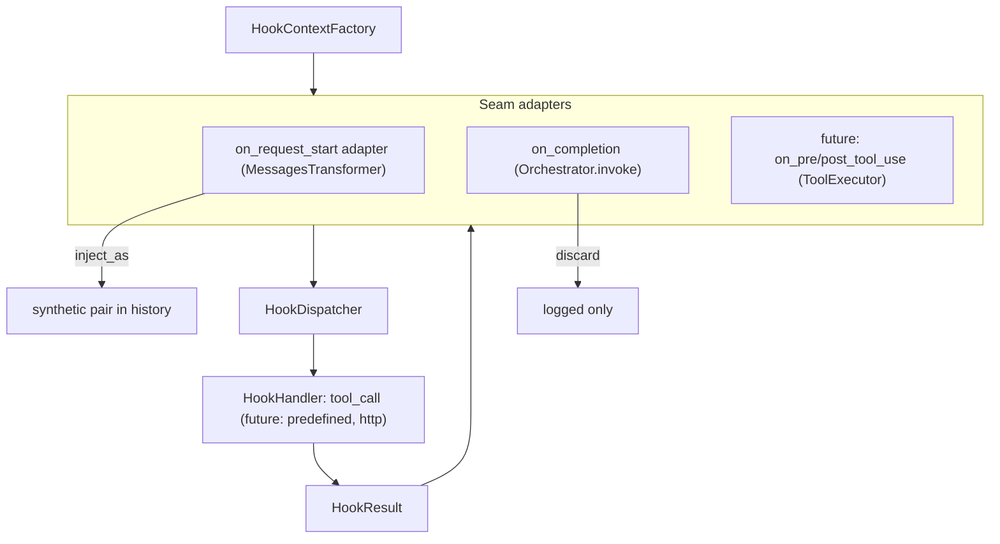

# Design: Hook Context, Parameter Templating, and Lifecycle Events

- **Status:** Draft
- **Dependencies:**
  - [Config-Driven Synthetic Tool Call Injection](config_driven_hooks.md) — supersedes its runtime once implemented
  - [Generic Synthetic Tool-Call Injector](generic_synthetic_toolcall_injector.md)

## Problem Statement

Config-driven hooks ([config_driven_hooks.md](config_driven_hooks.md)) support exactly one seam and one
behavior: at `on_request_start`, call a tool with **literal** arguments and inject the result as a
synthetic `(ASSISTANT/tool_calls, TOOL)` pair.

An agent-memory PoC built by an adjacent team needs more than that:

- **Write memory after the turn.** A hook must fire after the agent loop produces its final answer and
  call a tool with the final assistant text (`last_assistant_message`). There is no seam after the loop
  today.
- **Read memory at turn start, keyed by the user's message.** The existing `on_request_start` hook can
  call a tool, but its `arguments` are literals — it cannot pass the latest user message, or any other
  artifact of the conversation, to the tool.
- **More seams will follow.** Tool-call checkpoints (before and after each tool execution) with access
  to tool names and arguments are the expected next step. Requirements are still forming.

The current runtime also does not generalize. `_ConfigDrivenToolCallHook` fuses three concerns into one
`MessagesTransformer` subclass:

1. **What runs** — look up a `StagedBaseTool` and call `arun()`.
2. **What happens to the result** — inject a synthetic pair into history.
3. **Injection policy** — `frequency` and TTL `refresh_condition`.

That shape fits only `on_request_start` and only tool calls. A seam that is not a message transformer
(after the loop, around a tool call), or a handler that is not a tool (a predefined Python function, an
HTTP call), has nowhere to plug in.

## Design Goals

- Add an `on_completion` event that fires after the agent loop's final answer, before the response and
  request-scoped resources close.
- Define a documented, read-only **hook context** per event, exposing agent-loop artifacts (message
  history, last user/assistant message, loop counters).
- Let hook `arguments` reference context values with a `${path}` syntax, following Claude Code's
  `mcp_tool` hook convention.
- Split the hook runtime into handler / dispatcher / seam adapter so that new events and new handler
  kinds can be added without touching existing ones.
- Keep every existing `hooks` manifest working unchanged; migrate the existing runtime onto the new
  pipeline rather than running two runtimes side by side.
- Never execute shell commands or manifest-supplied code: the service is multi-tenant and server-side.

---

## Use Cases

### UC-1: Read memory at turn start, keyed by the user's message

**Trigger:** A hook with `event: on_request_start`, `kind: tool_call` targeting
`memory_server_search_memories`, with `arguments: {"query": "${last_user_message.content}"}`,
and `frequency: always`.
**Behavior:** Before the first orchestrator iteration, the hook renders `query` from the current user
message, calls the tool, and injects the result as a synthetic pair (existing behavior).
`frequency: always` is required here: call-id identity uses the unrendered template, so
`append_if_changed` / `refresh_condition` would not treat a new user message as a change (see
Component 5).
**Outcome:** The LLM sees memories relevant to the current question as a tool result it "already
called".

### UC-2: Write memory after the turn

**Trigger:** A hook with `event: on_completion`, `kind: tool_call` targeting
`memory_server_save_memory`, with arguments referencing `${last_user_message.content}` and
`${last_assistant_message.content}`.
**Behavior:** After the loop terminates with a final answer (no tool calls), the hook renders the
arguments, calls the tool under a timeout, and discards the result.
**Outcome:** The answer is already streamed to the user; the memory is persisted before the response
closes. A failing or slow hook is logged and never fails the request.

### UC-3: Load a memory file at turn start

**Trigger:** A hook with `event: on_request_start` calling a file-reading tool with a literal path
argument.
**Behavior:** Identical to today's `on_request_start` hook — no templating involved.

---

## Proposed Design

### Architecture overview

The runtime is split into three layers, mirroring how Claude Code separates handlers from events: a
handler receives the event's context and returns a result; **the seam decides what the result does**.



| Layer | Responsibility | Knows about |
|---|---|---|
| `HookHandler` | Execute one hook against a context, return a `HookResult` | The context, its own config |
| `HookDispatcher` | Run handlers with timeout and error isolation. `dispatch(event, …)` selects hooks for an event (used by `on_completion`). For `on_request_start`, selection stays in `AgentHooksModule` (one `MessagesTransformer` per hook) so chain order is preserved; the adapter calls `run_hook` for that one hook | Handlers, hook configs |
| Seam adapter | Build the context at its checkpoint, call the dispatcher, apply results by event rules | Its own seam only |

**Comparison with Claude Code.** In Claude Code every handler type (`command`, `http`, `mcp_tool`,
`prompt`, `agent`) has the same contract — JSON event context in, output out — and the **event**
defines the effect: on `SessionStart` / `UserPromptSubmit` output becomes model context
(`additionalContext`); on `Stop` a hook can block stopping; on `PreToolUse` it can allow/deny or rewrite
input. QuickApps adopts the same split. The one QuickApps-specific choice is how request-start output
enters history: for a `tool_call` handler the natural representation is a synthetic tool-call pair (the
model sees a call it "made", and the pair round-trips through `tool_execution_history`), so that stays
the default. It is one representation (`inject_as`), not the only possible one.

What is intentionally **not** copied from Claude Code: subprocess/stdin execution, shell commands, and
filesystem-scoped settings. Handlers are in-process async Python.

---

### Component 1: Events

**What:** `HookEvent` gains `on_completion`.

**Owner:** `config/hooks.py`

| Value | Fires at | Result effect |
|---|---|---|
| `on_request_start` | In the message-transformer chain, before the first orchestrator iteration (unchanged position) | Injected into history (`inject_as`) |
| `on_completion` | `Orchestrator.invoke()`, after the loop, only when `completion_kind == "completed"` | Discarded (side effect only) |

`on_completion` fires **only** on a normal final answer (an assistant message without tool calls). It
does not fire when the loop stops to surface external (client-side) tool calls — the turn is not
finished — nor when the loop raises (including `OrchestratorExceedMaxIterationsException`).

`on_pre_tool_use` and `on_post_tool_use` stay reserved (not in the enum; Pydantic rejects them). Their
seam is `ToolExecutor.execute`, before and after `tool.arun`; see [Out of Scope](#out-of-scope).

---

### Component 2: Hook context

**What:** Frozen Pydantic models describing what a hook can read. Their public fields **are** the
documented contract that templates resolve against.

**Owner:** `common/hook_context/context.py` — in `common/` so packages above it can depend on the
contract without importing each other. Dependency direction is one-way: `config/` → `common/` (as
`config/hooks.py` already imports `common.synthetic_injection`). `common/hook_context` never imports
`config` — `event` on the snapshot is a plain `str`, not `HookEvent`.

```
HookToolCall        [id, name, arguments: dict]
HookMessage         [role, content: str | None, tool_calls: list[HookToolCall], tool_call_id]
HookContext         [event: str, messages: list[HookMessage], last_user_message*, last_assistant_message*]
├── RequestStartHookContext
└── CompletionHookContext    [+ iteration_count, total_tool_calls]
                              * computed fields, may be None
```

| Field | Type | Source |
|---|---|---|
| `event` | `str` | The seam firing the hook (the `HookEvent` value as a string — no import of `config`) |
| `messages` | `list[HookMessage]` | Working message list at the seam (see below) |
| `last_user_message` | `HookMessage \| None` | Last `messages` entry with `role == "user"` |
| `last_assistant_message` | `HookMessage \| None` | Last `messages` entry with `role == "assistant"` **and no `tool_calls`** (the final answer) |
| `iteration_count` | `int` | `Orchestrator.iteration_count` (completion only) |
| `total_tool_calls` | `int` | `Orchestrator.total_tool_calls` (completion only) |

**`last_assistant_message` is the final answer, not the last assistant role.** Synthetic pairs from
earlier injectors (`_TimestampInjectionTransformer`, `_AttachmentNotificationInjector`, earlier
`on_request_start` hooks) append an assistant message with `content=""` and `tool_calls`. Intermediate
orchestrator steps do the same. Defining `last_assistant_message` as the last assistant **without**
`tool_calls` skips those and yields the previous turn's answer on `on_request_start` (or `None` on the
first turn) and the current answer on `on_completion`. Raw access to any message, including synthetic
ones, stays available through `messages[...]`. `last_user_message` stays the last `role == "user"`
entry — synthetic injectors do not create user messages.

**`HookMessage` is a view, not `aidial_sdk.Message`.** Decoupling the contract from the SDK keeps
template paths stable if the SDK model changes, and simplifies the shape:

- `content` is text. Multimodal content parts are reduced to their text parts joined with `\n`;
  non-text parts are dropped. Attachments (`custom_content`) are not exposed in this iteration.
- Whitespace-only `content` is normalized to `""`. The orchestrator stores an empty final answer as a
  single space (`content=stream_result.content or " "`); without this normalization
  `${last_assistant_message.content}` at `on_completion` would be `" "` rather than empty.
- `tool_calls[].arguments` is the parsed JSON object, not the raw string, so
  `${messages[-2].tool_calls[0].arguments.file_path}` works.

**Which messages the context sees:**

- `on_request_start`: the message list as it flows through the transformer chain at the adapter's
  position — tool history already restored by `extract_tool_calls`, plus any pairs injected by earlier
  transformers. That list is the seam argument; the factory must **not** read `MessagesMixin` on this
  path (`MessagesMixin` still holds the post-`extract_tool_calls`, pre-transform list until
  `replace_messages` runs after every transformer). `last_user_message` is the current request's user
  message; `last_assistant_message` is the previous turn's final answer (or `None` on the first turn).
- `on_completion`: `MessagesMixin.messages` after the loop — the full working history including this
  turn's tool calls and the final answer, which is `last_assistant_message`.

**One context per event, built by one factory.** A request-scoped `HookContextFactory`
(`agent_hooks/_context_factory.py`) builds every context:

- On `on_request_start`, messages come **only** from the chain argument the seam passes —
  `request_start(messages)`. The factory does not read `MessagesMixin` on that path.
- On `on_completion`, `completion(iteration_count=..., total_tool_calls=...)` reads `MessagesMixin`
  itself for the post-loop history.
- A future `tool_use(tool_call, args)` would pass the call as event-specific data.

A new common field is added once, in the factory and in `HookContext`, and every event gets it. There is
no object accumulated across the request: each context is a fresh snapshot built at the moment the hook
fires — the same approach as Claude Code's `createBaseHookInput`.

**Alternative considered: one shared, request-accumulated context.** Rejected because:

- `ToolExecutor` runs tool calls concurrently (`asyncio.gather`). "Current tool call" fields on a shared
  mutable object would race between parallel calls — exactly the seams planned next.
- Fields meaningless for an event (e.g. `tool_input` at `on_completion`) could not be rejected by static
  template validation (Component 3).
- A mutable object threaded through the whole request couples components that are otherwise
  independent.

The per-event models share a base class, so the template syntax and the common fields are identical
across events; only the event-specific fields differ.

**Change:** New `common/hook_context/context.py`; new `agent_hooks/_context_factory.py`.

---

### Component 3: Parameter templating

**What:** `${path}` placeholders in hook `arguments`, resolved against the hook's context.

**Owner:** `common/hook_context/templating.py` (parser, static validation, renderer).

**Syntax** — follows Claude Code's `mcp_tool` hook `input` substitution
(`"file_path": "${tool_input.file_path}"`), extended with list indexing:

```
placeholder := "${" path "}"
path        := ident ( "." ident | "[" "-"? digits "]" )*
ident       := [A-Za-z_][A-Za-z0-9_]*
```

| Example | Resolves to |
|---|---|
| `${last_user_message.content}` | Text of the current user message |
| `${last_assistant_message.content}` | Text of the final answer (at `on_completion`) |
| `${messages[-2].content}` | Second-to-last message text |
| `${messages[0].tool_calls[0].arguments.file_path}` | An argument of a past tool call |
| `${iteration_count}` | Loop iteration count (at `on_completion`) |

**Where substitution applies:** string values inside `arguments`, recursively through nested objects and
arrays. Keys are never templated. No other config field is templated in this iteration.

**Rendering rules:**

| Case | Result |
|---|---|
| Value is exactly one placeholder (`"${messages}"`) | The raw resolved value, type preserved (list, object, number, string); models are dumped to JSON-compatible data |
| Placeholder embedded in text (`"Q: ${last_user_message.content}"`) | Resolved value converted to string; objects and arrays as compact JSON |
| Literal `${` needed | Escape with a backslash: `\${` renders as `${` (in a JSON manifest: `"\\${"`) |

The escape follows Claude Code's convention of backslash-escaping `$` in prompt hooks (`\$1.00`);
Claude Code does not document an escape for `${path}`, so the same convention is reused.

**Static validation (config time):** `templating.py` exposes
`validate_template_roots(arguments, allowed_roots: set[str])` — it parses every placeholder and checks
the **root segment** against the provided set. It has no knowledge of events or context models.
`config/hooks.py` owns the `event → context model` map and computes `allowed_roots` from
`model_fields` and `model_computed_fields`, then calls the validator from a `model_validator` on the
hook config. Unknown roots (`${tool_input...}` on `on_completion`) and syntax errors are Pydantic
validation errors — the manifest is rejected with a precise message. Deeper segments are not validated
statically (they depend on runtime data). This keeps the dependency one-way: `config` → `common`.

**Runtime resolution failure** — an index out of range, `None` anywhere along the path (e.g.
`last_assistant_message` on the first turn), a missing key: the hook is **skipped** with a warning naming
the hook and the failing path. Resolved values are never logged (CODESTYLE §9); payload detail goes
through `log_payload` only.

**Change:** New `common/hook_context/templating.py`.

---

### Component 4: Handler, dispatcher, result

**What:** The execution core, independent of any seam.

**Owner:** `agent_hooks/`

```python
class HookResult(BaseModel):          # common/hook_context/context.py, frozen
    hook_name: str
    content: str | None
    tool_name: str | None = None      # present for tool_call handlers
    arguments: dict[str, Any] | None = None  # rendered arguments actually sent

class HookHandler(ABC):               # agent_hooks/_handlers.py
    async def run(self, context: HookContext) -> HookResult | None: ...  # None = skipped
```

**`ToolCallHookHandler`** — the only handler in this iteration:

1. Render `arguments` against the context (Component 3); on resolution failure log and return `None`.
2. Resolve the tool by final function name (`resolve_hook_tool_name`, unchanged naming rules).
3. Call `tool.arun(<probe call id>, stage_level=StageDisplayLevel.DEBUG, **rendered)` — the lookup and
   call move here from `StagedToolSyntheticInjector.get_content`, so the stage stays hidden exactly as
   today.
4. Return `HookResult(content=result.content, tool_name=..., arguments=rendered)`.

**`HookDispatcher`** (request-scoped):

- `run_hook(hook, context)` — resolves the effective timeout, then runs one hook's handler under it
  and isolates failures: any exception is logged with the hook name and converted to `None`. Never
  raises. Timeout resolution:

  ```
  effective = hook.timeout_seconds if set else EVENT_DEFAULT_TIMEOUT[event]
  # EVENT_DEFAULT_TIMEOUT: on_completion=30, on_request_start=None
  ```

  `asyncio.wait_for` runs only when `effective` is not `None`. The dispatcher — not the seam or the
  handler — is the single owner that turns omitted `timeout_seconds` into the event default before
  `wait_for`. Without that step an omitted value would leave the open response bounded only by the
  tool's own timeout.
- `dispatch(event, context)` — `run_hook` for every configured hook of `event`, **sequentially in
  manifest order**, returning the non-`None` results. Sequential (unlike Claude Code's parallel
  execution) keeps ordering deterministic; parallel execution can be an opt-in later. Used by
  `on_completion`. For `on_request_start`, selection stays in `AgentHooksModule` (one transformer per
  hook); the adapter calls `run_hook` for that single hook so its place in the transformer chain is
  not collapsed into a dispatcher loop.

Handler construction maps `kind` to a handler class (`match` on the config type), the same shape as
today's `AgentHooksModule._build_on_request_message_transformers`. A future `kind` adds a handler class
and a `case`, nothing else.

**Change:** New `agent_hooks/_handlers.py`, `agent_hooks/_dispatcher.py`.

---

### Component 5: `on_request_start` adapter

**What:** The existing `_ConfigDrivenToolCallHook` becomes a thin seam adapter over the dispatcher.

**Owner:** `agent_hooks/_config_driven_hooks.py`

It **remains a `MessagesTransformer`**, one instance per hook, for a single reason: the transformer
chain's order is the order of modules in `app_factory`, and today's position of `AgentHooksModule` in
that chain must be preserved. Hook selection for this event stays in
`AgentHooksModule._build_on_request_message_transformers` — one transformer per hook — not in
`dispatch()`. The adapter calls `dispatcher.run_hook` for its own config only. It keeps all
injection-policy logic it has today (`frequency`, `refresh_condition`/TTL, `should_inject`,
`make_call_id`); it no longer calls the tool itself:

- `get_content(messages)` builds `RequestStartHookContext` via the factory, calls
  `dispatcher.run_hook(...)` once, caches the `HookResult`, and returns `result.content` (or `None`
  to skip).
- The pair shown to the model uses the **rendered** arguments from that cached `HookResult`.
- Call-id identity uses the **unrendered template** arguments (see below).

**Call-id identity must use template arguments.** `SyntheticToolCallInjector` derives the call-id
prefix from `hash(arguments)`. TTL lookup (`should_inject`) and the `APPEND_IF_CHANGED` "prior pair"
search depend on that prefix staying stable across turns. With rendered arguments the prefix would change
every turn (the user message differs), silently breaking TTL and appending a new pair each turn.
Therefore:

- `SyntheticToolCallInjector` gains `get_call_arguments(messages)` — the arguments rendered into the
  synthetic `ASSISTANT` message — defaulting to `get_arguments()`. Existing code injectors are
  unaffected.
- The adapter returns the template `arguments` from `get_arguments()` (identity) and the rendered ones
  from `get_call_arguments()` (display).
- `get_call_arguments` returns the `HookResult.arguments` cached from the single `run_hook` inside
  `get_content`. A second render that called the handler again would execute the tool twice — that
  must not happen.

**Config semantics of template-stable identity.** Because `should_inject` / `_make_call_id_prefix` hash
the template text, a new user message does **not** change the prefix. A templated hook with
`refresh_condition` will not re-run until TTL expires; `append_if_changed` will not treat a newly
resolved query as a change unless the tool *content* also changes. Templated hooks that should refresh
on every turn (UC-1) must set `frequency: always`.

`inject_as` (Component 7) selects the representation; `synthetic_tool_call` is the only value now, and
the adapter implements it.

**Change:** Rework `agent_hooks/_config_driven_hooks.py`; add `get_call_arguments` to
`common/synthetic_injection/synthetic_tool_call_injector.py`.

---

### Component 6: `on_completion` seam

**What:** A post-loop checkpoint in the orchestrator.

**Owner:** `core/agent/orchestrator.py` (call site), `agent_hooks/` (implementation).

`core/` must not depend on the preview-only `agent_hooks` package, so the seam is an abstraction in
`common/abstract/completion_hook_runner.py`:

```python
class CompletionHookRunner(ABC):
    """Post-loop hook seam. Implementations must not raise Exception —
    failures are isolated at the orchestrator call site. CancelledError
    (a BaseException) propagates so client disconnects still cancel the request."""

    async def run(self, *, iteration_count: int, total_tool_calls: int) -> None: ...
```

- `AgentModule` provides an empty `@multiprovider list[CompletionHookRunner]` — the established pattern
  for extension lists (`MessagesTransformer`, `ToolCallResultEnricher`).
- `AgentHooksModule` (preview) contributes one runner that builds `CompletionHookContext` via the
  factory and calls `dispatcher.dispatch(ON_COMPLETION, context)`, discarding results.
- `Orchestrator.invoke()` calls the runners **after the loop, inside `_persisting_state()`**, with
  per-runner isolation at the seam:

```python
async def invoke(self):
    async with self._persisting_state():
        while await self._run_iteration():
            pass
        if self.__completion_kind == "completed":
            for runner in self.__completion_hook_runners:
                try:
                    await runner.run(iteration_count=..., total_tool_calls=...)
                except Exception:
                    logger.warning("Completion hook runner failed", exc_info=True)
```

The failure boundary is the seam, not only the dispatcher. Context build and `dispatch` both sit inside
`runner.run`; a factory failure would otherwise escape `HookDispatcher`'s `try`, land in
`_persisting_state`'s exception path ("Orchestrator interrupted"), re-raise, and deliver a protocol
error on a choice that has already streamed the final answer. Isolating each runner at the call site
logs the failure and lets the next runner still run. `except Exception` deliberately lets
`CancelledError` (a `BaseException`) propagate.

The dispatcher keeps its own per-hook isolation inside `run_hook`. Note also that `StagedBaseTool.arun`
does not raise on a tool failure: it logs `Tool call failed` and returns a fallback `ToolCallResult`.
For `on_completion` that content is discarded, so a failed memory write surfaces only as the tool-layer
warning — not as a dispatcher `None` from an exception.

Placement matters: `_persisting_state`'s `finally` calls `request_async_close_registry.aclose_all()`,
which closes per-request MCP sessions. Running before it lets `on_completion` tool calls reuse the live
sessions. Hook results never enter `MessagesMixin`, so they are not persisted into
`tool_execution_history` and the next turn does not see them.

**Latency.** The final answer has already streamed when `on_completion` runs, but the response stays
open until the hooks finish (`_quick_app_completion.py` awaits `Orchestrator.invoke` inside
`response.create_single_choice()`). The dispatcher resolves omitted `timeout_seconds` to the event
default of 30s (Component 4). Hooks run sequentially, so the open response is bounded by the **sum** of
their effective timeouts. Errors and timeouts are logged and never fail the request.

**Change:** New `common/abstract/completion_hook_runner.py`; `AgentModule` empty multiprovider;
`Orchestrator` injects `list[CompletionHookRunner]` and calls it in `invoke()`.

---

### Component 7: Configuration changes

**What:** Additive fields on the hook config.

**Owner:** `config/hooks.py`

| Field | On | Type | Default | Description |
|---|---|---|---|---|
| `event` | base | `HookEvent` | required | Adds `on_completion` |
| `timeout_seconds` | base | `float \| None` | `None` | Per-hook timeout. `None` = event default, resolved by `HookDispatcher.run_hook` (Component 4): 30 for `on_completion`; none for `on_request_start` (tool's own timeouts apply, as today) |
| `arguments` | `tool_call` | `dict[str, Any]` | `{}` | Now supports `${path}` templates |
| `inject_as` | `tool_call` | `InjectAs` | `synthetic_tool_call` | `on_request_start` only. How the result enters history |
| `frequency` | `tool_call` | `InjectionFrequency` | `append_if_changed` | `on_request_start` only (unchanged) |
| `refresh_condition` | `tool_call` | `RefreshConditionConfig \| None` | `None` | `on_request_start` only (unchanged) |
| `execution` | `tool_call` | `HookExecution` | `blocking` | `on_completion` only. `background` is reserved |

```python
class InjectAs(StrEnum):
    SYNTHETIC_TOOL_CALL = "synthetic_tool_call"
    # CONTEXT_MESSAGE = "context_message"   # future: for non-tool handlers

class HookExecution(StrEnum):
    BLOCKING = "blocking"
    # BACKGROUND = "background"             # future: fire-and-forget
```

**Event/field compatibility** is enforced by a `model_validator`: explicitly setting (checked via
`model_fields_set`) an injection field on `on_completion`, or `execution` on `on_request_start`, is a
validation error. Defaults never trigger it, so existing manifests validate unchanged.

**Why `background` is reserved, not implemented.** Fire-and-forget after the response means running
outside the request: by then the DI request scope is torn down, the choice is closed, and MCP sessions
have been closed by `aclose_all()`. It needs its own lifecycle (task ownership, its own tool sessions,
shutdown draining). The field exists now so the config shape is ready; adding `background` later is an
additive enum value that still requires `make dump_app_schema` (an additive schema change), not a
change to how the field is declared on the config. The commented member is not in the schema today —
only `blocking` is emitted.

**Change:** `config/hooks.py`; `make dump_app_schema`.

---

## Out of Scope

- **Tool-call seams (`on_pre_tool_use`, `on_post_tool_use`).** Seam is `ToolExecutor.execute` around
  `tool.arun`; context adds `tool_name`, `tool_input`, `tool_use_id`, `tool_result`. Deferred until the
  memory PoC defines needs. Requires a decision protocol (below) to be useful beyond observation.
- **Decision protocol.** `HookResult` fields for `decision` (allow/deny), `updated_input`, and
  `additional_context`, with Claude Code merge semantics (most restrictive decision wins). Only needed by
  tool-call seams.
- **`background` execution** for `on_completion` — see Component 7.
- **`predefined` handler kind.** A Python callable registered by a feature module via DI under a name
  and referenced from the manifest by that name — the server-side equivalent of a hook script. The
  handler layer (Component 4) is designed to accept it as one more `HookHandler`. Arbitrary code or shell
  commands from manifests are explicitly not planned.
- **`http` handler kind.** Needs an egress policy aligned with `EXTERNAL_URL_FETCH_ENABLED` /
  `features.external_url_fetch` before manifest authors can target arbitrary URLs.
- **`context_message` injection** for non-tool handlers.
- **Matchers.** Claude Code's `matcher` filters by tool name; meaningful only with tool-call seams.
- **Template filters/expressions** (defaults, slicing, conditionals) and templating outside `arguments`.
- **Hooks on failures and external tool calls** (`StopFailure`-like events).
- **Attachments in the context** (`custom_content.attachments`).

---

## Configuration / Usage Examples

### UC-1: memory lookup keyed by the user message

```json
{
  "hooks": [
    {
      "kind": "tool_call",
      "event": "on_request_start",
      "name": "recall-memory",
      "toolset_name": "memory_server",
      "tool_name": "search_memories",
      "arguments": { "query": "${last_user_message.content}" },
      "frequency": "always"
    }
  ]
}
```

`frequency: always` is required for templated arguments that should refresh each turn — see Component 5.

### UC-2: memory write after the final answer

```json
{
  "hooks": [
    {
      "kind": "tool_call",
      "event": "on_completion",
      "name": "save-memory",
      "toolset_name": "memory_server",
      "tool_name": "save_memory",
      "arguments": {
        "user_message": "${last_user_message.content}",
        "assistant_message": "${last_assistant_message.content}",
        "note": "Turn finished after ${iteration_count} iterations"
      },
      "timeout_seconds": 20
    }
  ]
}
```

`user_message` and `assistant_message` receive the raw strings; `note` is rendered as text.

### UC-3: literal memory file (unchanged behavior)

```json
{
  "hooks": [
    {
      "kind": "tool_call",
      "event": "on_request_start",
      "tool_name": "read_file",
      "arguments": { "path": "memory/profile.md" },
      "refresh_condition": { "kind": "ttl", "ttl_minutes": 60 }
    }
  ]
}
```

### Rejected configurations

| Config | Error |
|---|---|
| `"event": "on_completion"`, `"arguments": {"x": "${tool_input.path}"}` | Unknown root `tool_input` for `on_completion` |
| `"event": "on_completion"`, `"frequency": "always"` | `frequency` is only valid for `on_request_start` |
| `"event": "on_request_start"`, `"execution": "blocking"` | `execution` is only valid for `on_completion` |
| `"arguments": {"x": "${messages[}"}` | Placeholder syntax error |

---

## Migration

### Breaking changes

None. The user-facing contract — the `hooks` config — only gains optional fields. There is no deprecation
period, because nothing user-facing is deprecated: only the internal runtime changes, and it migrates onto
the new pipeline in the same change. Two runtimes for the same config are not kept.

The one behavioral risk: an existing `arguments` string containing `${` is now parsed as a placeholder.
The syntax deliberately matches Claude Code; a literal is written as `\${`. An accidental match fails
loudly at config validation (unknown root) rather than substituting silently.

### Non-breaking changes

- Existing `on_request_start` hooks behave identically: same position in the transformer chain, same
  `frequency`/TTL semantics, same hidden stage, same call-id format for literal arguments.
- `_AgentHooksContext` continues to report "tool not found" as `HookInitializationException` for every
  hook regardless of event. Template syntax and root-path checks happen earlier, at config validation
  (Component 3).
- `StagedToolSyntheticInjector` and `SyntheticToolCallInjector` remain for code-defined injectors that are
  not hooks (e.g. skill invocation). `get_call_arguments` defaults to `get_arguments`, so they are
  unaffected.
- Existing `on_request_start` unit tests (frequency, TTL, initialization errors) must pass unchanged as
  the regression check.
- `hooks` stays a `PreviewField`; `AgentHooksModule` stays `@preview_module`. With preview disabled,
  the `CompletionHookRunner` list is empty and the orchestrator does nothing extra.
- After implementation: run `make dump_app_schema`, update the Hooks section of
  [CONFIGURATION.md](../../CONFIGURATION.md#hooks-configuration), mark
  [config_driven_hooks.md](config_driven_hooks.md) `Superseded` with a link to this doc, and repoint the
  Design column of the "Config-driven hooks" row in [docs/README.md](../README.md) here (the L1 link
  can stay `CONFIGURATION.md#hooks-configuration`).

---

## Summary of Changes

### `config/hooks.py` — MODIFIED

- `HookEvent.ON_COMPLETION`
- `InjectAs` (`synthetic_tool_call`), `HookExecution` (`blocking`)
- `_BaseHookConfig.timeout_seconds`
- `ToolCallHookConfig.inject_as`, `ToolCallHookConfig.execution`; `arguments` templated
- Owns the `event → context model` map; `model_validator`s for event/field compatibility and for
  calling `validate_template_roots(arguments, allowed_roots)`

### `common/hook_context/` — NEW package

- `context.py` — `HookToolCall`, `HookMessage`, `HookContext` (`event: str`), `RequestStartHookContext`,
  `CompletionHookContext`, `HookResult`. No imports from `config`.
- `templating.py` — placeholder parser, `validate_template_roots(arguments, allowed_roots)`, renderer

### `common/abstract/completion_hook_runner.py` — NEW

- `CompletionHookRunner` abstraction for the post-loop seam (docstring: must not raise `Exception`;
  `CancelledError` propagates)

### `common/synthetic_injection/synthetic_tool_call_injector.py` — MODIFIED

- `get_call_arguments(messages)`, defaulting to `get_arguments()`; used when building the pair

### `agent_hooks/` — MODIFIED

- `_context_factory.py` — NEW: `HookContextFactory` (request-scoped); `on_request_start` messages from
  the chain argument only (not `MessagesMixin`)
- `_handlers.py` — NEW: `HookHandler`, `ToolCallHookHandler`
- `_dispatcher.py` — NEW: `HookDispatcher` (request-scoped); owns event-default timeout resolution
- `_config_driven_hooks.py` — `_ConfigDrivenToolCallHook` becomes the `on_request_start` adapter over
  `run_hook`; call-id identity from template arguments; caches `HookResult` for `get_call_arguments`
- `agent_hooks_module.py` — binds factory and dispatcher; contributes the `CompletionHookRunner`; keeps
  per-hook `MessagesTransformer` selection for `on_request_start`

### `core/agent/` — MODIFIED

- `agent_module.py` — empty `@multiprovider list[CompletionHookRunner]`
- `orchestrator.py` — injects `list[CompletionHookRunner]`; calls it after the loop inside
  `_persisting_state()` when `completion_kind == "completed"`, with per-runner `try/except Exception`

### `docs/generated-app-schema.json` — REGENERATED

### `CONFIGURATION.md` — MODIFIED (at implementation time)

### `docs/README.md` — MODIFIED (at implementation time, when marking the predecessor Superseded)

---

## Review Notes — Round 1

- **Reviewer:** Claude (quickapps-design-review skill)
- **Date:** 2026-09-30

### Verdict

`Blocking issues must be addressed`

The split into handler, dispatcher, and seam is grounded in the current code: `_ConfigDrivenToolCallHook` really does fuse lookup, `arun`, and injection policy; `Orchestrator.invoke` has no post-loop seam; `ToolExecutor.execute` really does `asyncio.gather`. The per-event snapshot (instead of one mutable context) and the template-vs-rendered call-id split are the right calls. Approval waits on four gaps: a package split that creates the import cycle it claims to avoid, a `last_assistant_message` contract the transformer order falsifies, an `on_completion` timeout default with no owner, and a seam that can still fail the request after the answer has streamed.

### Blocking issues

1. **[Component 2 / Component 3]** — `common/hook_context/` is justified as the place `config/`, `agent_hooks/`, and `core/` can all depend on "without depending on each other." The models contradict that. `HookContext.event` is typed as `HookEvent`, which lives in `config/hooks.py`, and the config-time `model_validator` must import those models to check root segments. That is a cycle: `config/hooks.py` → `common/hook_context` → `config/hooks.py`. `ApplicationConfig` imports `config/hooks.py` at startup, so this fails at import, not at the first hook.
   **Suggestion:** Keep the dependency one-way, `config` → `common`. Define the context models without importing `HookEvent` (an `event: str` is enough on the snapshot). Let `config/hooks.py` own the event→model map used by the validator.

2. **[Component 2]** — "`last_assistant_message` is the previous turn's final answer (or `None` on the first turn)" is not what the seam sees. `last_*` is defined as the last matching role in the transformer-chain list, and that list already contains synthetic pairs from earlier modules. `TimestampModule` is registered before `AgentHooksModule` in `app_factory.py`, and `_TimestampInjectionTransformer` uses `InjectionFrequency.ALWAYS`, which appends an assistant/tool pair at `len(messages)` (`synthetic_tool_call_injector.py` `_inject_always`). The assistant message in that pair has `content=""`. The same shape comes from `_AttachmentNotificationInjector` and from an earlier `on_request_start` hook. When any of those has run, `last_assistant_message` is that empty synthetic assistant, not the previous turn.
   **Suggestion:** Define `last_user_message` / `last_assistant_message` strictly as the last message with that role in the seam's list, and state the synthetic-pair case. If manifest authors need "previous turn's final answer," specify how synthetic pairs are skipped; the current sentence is a contract the implementation will not meet.

3. **[Component 4 / Component 6 / Component 7]** — Omitted `timeout_seconds` has two meanings. Component 7: `None` means the event default, 30s for `on_completion`. Component 4: `asyncio.wait_for` runs only when `timeout_seconds` is set. Nothing names the component that turns `None` into 30 before `run_hook`. The response stays open until `Orchestrator.invoke` returns (`_quick_app_completion.py` awaits it inside `response.create_single_choice()`), so an unresolved `None` leaves that delay bounded only by the tool's own timeout. Component 6's "default 30 bounds that delay" is then false.
   **Suggestion:** Give one owner — the dispatcher or the completion runner — that resolves `None` to the event default before `wait_for`, and state that several `on_completion` hooks run sequentially, so the open response is bounded by the sum of their timeouts.

4. **[Component 6 / UC-2]** — "Errors and timeouts are logged and never fail the request" is only true inside `HookDispatcher`. The runner builds `CompletionHookContext` and then calls `dispatch`. A factory failure is outside that `try`. The proposed `invoke()` snippet sits in `_persisting_state`'s `try`; any exception there is logged as "Orchestrator interrupted," state is saved, `aclose_all()` runs, and the exception is re-raised. `_QuickAppCompletion.chat_completion` then delivers a protocol error on a choice that has already streamed the final answer (`accumulate_stream` uses `stream_content=True` before the loop exits).
   **Suggestion:** Isolate the whole runner at the seam (context build and `dispatch`), per runner, so one failure is logged and the next runner still runs. Do not rely on the dispatcher alone. Also note that `StagedBaseTool.arun` already logs "Tool call failed" and returns a fallback `ToolCallResult` instead of raising (`staged_base_tool.py` `__run_tool_body`), so a failed memory write is not a dispatcher `None` — for `on_completion` that fallback content is discarded and only the tool-layer warning remains.

### Suggestions

1. **[Component 5]** — Template-stable call ids are the right fix for TTL, and the consequence should be stated as config semantics. `should_inject` and `_make_call_id_prefix` hash `get_arguments()`. After this change those arguments stay the template text, so a new user message does not change the prefix. A templated hook with `refresh_condition` will not re-run until TTL expires; `append_if_changed` will not treat a new resolved query as a change unless the tool *content* also changes. UC-1 correctly sets `frequency: always`. Say that next to the call-id rule, and in the UC-1 example, so a copied `refresh_condition` does not pin the first question's memories.
   Same component: `transform()` today threads one `arguments` value into both `make_call_id` and `_build_pair`. `get_call_arguments` must return the `HookResult.arguments` cached from the single `run_hook` inside `get_content`. A second render that calls the handler again would execute the tool twice.

2. **[Architecture overview / Component 5]** — The layer table says `HookDispatcher` selects the hooks for an event. For `on_request_start`, selection stays in `AgentHooksModule._build_on_request_message_transformers` (one `MessagesTransformer` per hook, module order in `app_factory`). Only `on_completion` uses `dispatch()`. Say that explicitly, so the adapter is not "fixed" into a single dispatcher loop and loses its place in the chain.

3. **[Component 2]** — "The factory gathers common fields itself from request-scoped DI sources" is unsafe for `on_request_start`. During the transformer chain, `MessagesMixin` still holds the post-`extract_tool_calls`, pre-transform list; `replace_messages` runs only after every transformer (`_request_context_setup.py` `setup_messages`). The seam argument is the list that includes earlier injectors. State that the factory must not read `MessagesMixin` on that path.

4. **[Component 7]** — `execution` accepts only `blocking`, which is the default, and setting it on `on_request_start` is a validation error. Adding `background` later is an additive enum value and still a schema change (`make dump_app_schema`); the commented member is not in the schema now. Either drop `execution` until a second value exists, or correct the sentence. The lifecycle argument for not implementing `background` yet (request scope, closed choice, `aclose_all()`) is sound and should stay.

5. **[Component 6]** — A final answer with empty model content is stored as a single space (`orchestrator.py`, `content=stream_result.content or " "`). At `on_completion`, `${last_assistant_message.content}` is then `" "`, not an empty string. Mention it next to the completion message list so a memory write does not persist that placeholder as the answer.

6. **[Migration]** — `docs/README.md` Preview row "Config-driven hooks" still points its Design column at `config_driven_hooks.md`. When that doc is marked `Superseded`, point the L3 link here (the L1 link can stay `CONFIGURATION.md#hooks-configuration`).

### Nits

1. **[UC-3]** — The trigger (a literal path, no templating) is a real use case. The outcome sentence exists only to say existing manifests stay byte-for-byte; Migration already owns that. Cut the outcome restatement.

2. **[Component 8]** — The section only restates today's `_AgentHooksContext` behavior ("keeps reporting…"). Fold one sentence into Migration and drop the component.
