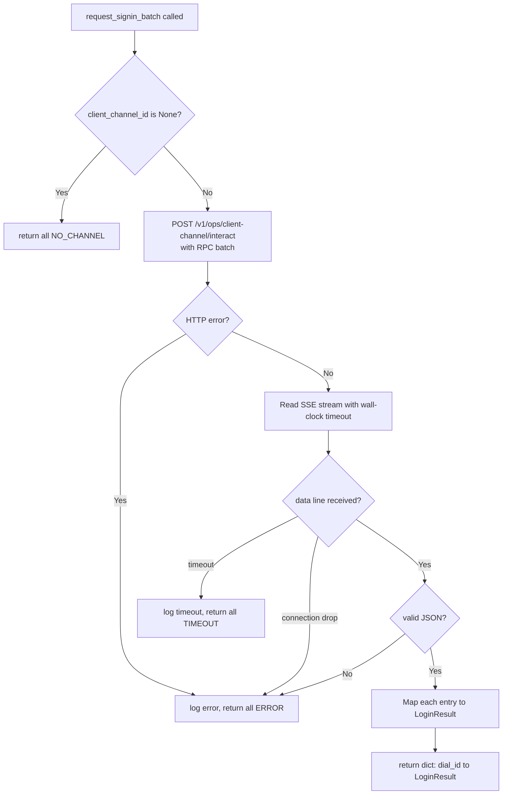
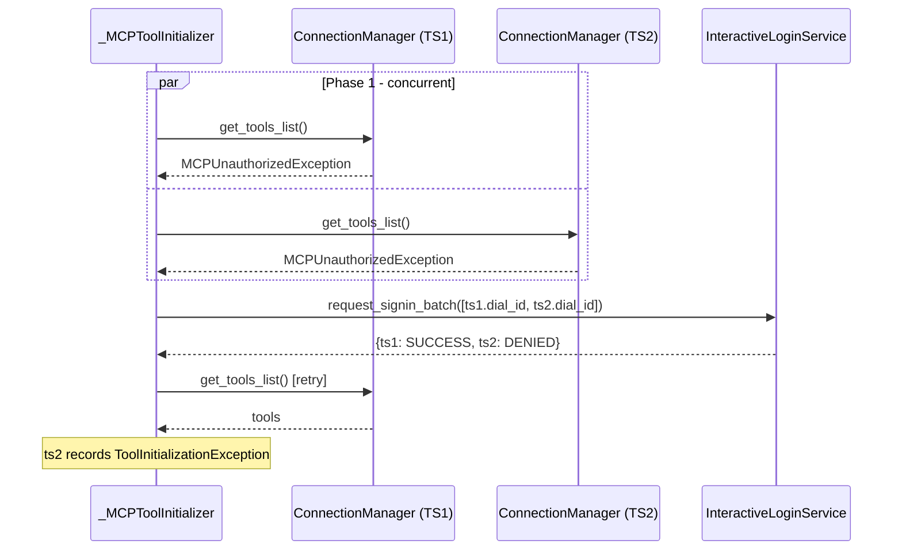

# Design: Interactive Login into DIAL Toolset

**Status:** Implemented

## Problem Statement

When a DIAL MCP toolset requires authentication, the MCP server returns `401 Unauthorized` — either during
toolset initialization (connecting and listing tools) or during tool execution (calling a tool mid-request).
QuickApp currently has no way to recover from this: both paths surface the 401 as an unrecoverable error,
and the user must navigate to a separate login page and retry the entire conversation.

DIAL Core PR #1412 introduces a **client channel** mechanism that enables QuickApp to request interactive
sign-in from the user mid-request: it calls a dedicated DIAL Core API, which notifies the already-connected
client via a persistent SSE channel, waits for the user to complete login, and streams the result back to
QuickApp. This design describes how QuickApp integrates with that mechanism.

## Design Goals

- When a `DialMCPToolSet` returns 401 (during initialization **or** tool execution), QuickApp requests
  interactive login via DIAL Core instead of failing immediately.
- The login flow is transparent to the orchestrator: after a successful login, the failing operation
  (tool list fetch or tool call) is retried exactly once.
- If no client channel ID is present in the request (e.g. programmatic clients), the 401 falls through
  to the existing error handling unchanged.
- The timeout for waiting on user sign-in is configurable via an environment variable.
- Only `DialMCPToolSet` toolsets participate in interactive login; plain `MCPToolSet` toolsets are unaffected.

---

## Use Cases

### UC-1: 401 during toolset initialization (single or multiple toolsets)

**Trigger:** A chat completion request arrives for an app that includes one or more `DialMCPToolSet`s.
The client has subscribed to a client channel and passed `X-DIAL-CLIENT-CHANNEL-ID` in the request.
When QuickApp connects to the MCP servers concurrently and lists tools, one or more servers return 401.

**Behavior:** QuickApp collects all failing toolsets and sends a single batched
`POST /v1/ops/client-channel/interact` request to DIAL Core containing one sign-in RPC entry per
failing toolset. DIAL Core notifies the client; the user logs in to each toolset; DIAL Core streams
back one result per entry. QuickApp retries the tool list fetch for each toolset whose entry returned
`success`.

**Outcome:** All successfully-authed toolsets initialize; any that were denied or timed out surface
as individual errors. From the user's perspective, one sign-in prompt covers all toolsets at once.

### UC-2: 401 during tool execution

**Trigger:** Same setup as UC-1, but the toolset initialized successfully (e.g. a cached session was
used), and the 401 occurs when a tool is called mid-request during the orchestrator loop.

**Behavior:** Same interact call as UC-1. After success, the specific tool call is retried once.

**Outcome:** The tool call succeeds. The orchestrator loop continues.

### UC-3: Login timeout or denial

**Trigger:** QuickApp sends the interact request but the user does not complete login within the configured
timeout, or the client returns a `denied` result.

**Behavior:** `InteractiveLoginService` returns a failure signal. The retry does not happen.

**Outcome:** The failing operation (tool list fetch or tool call) raises an error, which surfaces to the
user the same way other tool errors do today.

### UC-4: No client channel ID

**Trigger:** A chat completion request arrives without `X-DIAL-CLIENT-CHANNEL-ID` (e.g. a programmatic
API call).

**Behavior:** `InteractiveLoginService` detects that `CLIENT_CHANNEL_ID` is `None` and skips the interact
call immediately.

**Outcome:** The 401 falls through to the existing `ToolInitializationException` / tool error path, as today.

---

## Proposed Design

### `CLIENT_CHANNEL_ID` — new DI-injectable value

**What:** A new annotated DI type alias `CLIENT_CHANNEL_ID = Annotated[str | None, "CLIENT_CHANNEL_ID"]`
added to `common/_di_types.py`, following the same convention as `DIAL_API_KEY`, `DIAL_BEARER`, and
`ForwardedHeaders`.

**Owner:** `common/_di_types.py`, `application/app_module.py`.

**Semantics:** Holds the value of the `X-DIAL-CLIENT-CHANNEL-ID` request header, or `None` if the header
was absent. Injected wherever interactive login is needed.

**Rationale for a dedicated DI type:** The header is already captured in `ForwardedHeaders`, but
`CLIENT_CHANNEL_ID` represents a protocol-level channel identifier — not just another forwarded header.
A dedicated type makes the dependency explicit at injection sites, prevents accidental loss if
`ForwardedHeaders` is filtered or manipulated, and provides `str | None` ergonomics without a dict
lookup.

**Change:**

- `_RequestContext` gains an explicit `client_channel_id: str | None` field using a set-once property
  with a `_client_channel_id_set: bool` flag — same pattern as `bearer`, because `None` is a valid
  assigned value ("no channel") and must be distinguishable from "not yet set."
- `_RequestContextSetup.setup()` extracts the header by iterating `forwarded_headers.items()` and
  comparing `key.lower() == "x-dial-client-channel-id"` (not a direct dict `.get()`, since
  `extract_x_headers_from_request` preserves original header casing).
- `AppModule` gains a `@provider` method `__provide_client_channel_id` that reads from `_RequestContext`
  and binds it to `CLIENT_CHANNEL_ID`, keeping it request-scoped.

### `InteractiveLoginService` — dedicated sign-in coordinator

**What:** A new request-scoped service in `dial_core_services/` responsible for calling the
`POST /v1/ops/client-channel/interact` DIAL Core endpoint and returning per-toolset sign-in outcomes.

**Owner:** `dial_core_services/interactive_login_service.py`

**Semantics:**

**`LoginResult` enum:**

The service returns per-toolset outcomes using a `LoginResult` enum rather than a plain `bool`,
so callers can produce meaningful error messages:

| Value        | Meaning                                                            |
|--------------|--------------------------------------------------------------------|
| `SUCCESS`    | `"result": "success"` in the JSON-RPC response                     |
| `DENIED`     | `"result": "denied"` or other non-success result                   |
| `TIMEOUT`    | Wall-clock deadline elapsed before response                        |
| `ERROR`      | HTTP error, connection drop, malformed JSON, JSON-RPC error object |
| `NO_CHANNEL` | `client_channel_id` is `None` — interactive login unavailable      |

**Public methods:**

```
async def request_signin_batch(self, toolset_dial_ids: list[str]) -> dict[str, LoginResult]
async def request_signin(self, toolset_dial_id: str) -> LoginResult  # calls batch with one entry
```

**Execution flow:**



- Each `dial_id` is assigned a sequential JSON-RPC request ID (`"1"`, `"2"`, …). The service maintains
  the mapping internally to correlate results back to `dial_id`s.
- The JSON-RPC request body is a batch array, one entry per toolset:
  `[{"jsonrpc":"2.0","method":"toolset/signin","params":{"toolsetId":"<dial_id>"},"id":"<n>"}, ...]`.
- The `X-DIAL-CLIENT-CHANNEL-ID` header carries the channel ID.
- The SSE stream contains heartbeat comments (`: heartbeat`) followed by one `data:` line with the
  full batch response.
- **HTTP client:** `request_signin_batch()` creates an `httpx.AsyncClient` inline
  (`async with httpx.AsyncClient(base_url=..., headers={"Api-Key": ...}) as client:`), same pattern
  as `DialCoreClient.__aenter__` but without the wrapper — `aconnect_sse` requires a raw
  `AsyncClient`.
- **SSE reading:** Uses `httpx-sse` (already a project dependency via the MCP SDK). The service calls
  `aconnect_sse(client, "POST", url, json=batch)` and iterates with `event_source.aiter_sse()`.
  Heartbeat comments (`: heartbeat`) are automatically filtered by `httpx-sse` — only `data:` events
  are yielded. The service takes the first yielded event and parses it. The DIAL Core contract is
  exactly one `data:` event per interact call containing the full batch response.
- **Wall-clock timeout:** The entire SSE reading loop is wrapped in `asyncio.timeout()` (not
  `httpx.Timeout(read=...)`, which resets on each received byte including heartbeats and would not
  enforce a wall-clock deadline). The timeout applies to the **entire batch** — the user has the
  configured duration (default 120s) to complete all sign-ins, not 120s per toolset.
- Response entry mapping: `"result": "success"` → `SUCCESS`; `"result": "denied"` (or any other
  non-success value) → `DENIED`; entry with `"error"` key (JSON-RPC error object) or missing
  `"result"` key → `ERROR`.

**Error handling:** The service **never raises exceptions**. All failure modes (DIAL Core returns
404/401/5xx, connection drops, malformed JSON) are logged and mapped to `ERROR` for all entries
in the batch. This is intentional — the interact call is best-effort recovery, and propagating
exceptions would complicate the caller's already-complex retry logic.

**Logging:** Key log points at `INFO` level:

- When the interact call is initiated (with toolset IDs and channel ID).
- When the response arrives (per-toolset outcomes).
- On timeout (elapsed time and toolset IDs).
- On error (HTTP status, connection error, or parse failure details).

**Injected dependencies:**

- `DIAL_API_KEY` — for the `Api-Key` header on the DIAL Core request.
- `DialSettings` — for the DIAL Core base URL.
- `CLIENT_CHANNEL_ID` — the channel ID header value.
- `InteractiveLoginSettings` — for the configurable timeout.

**Registration:** Request-scoped in `dial_core_services_module.py`.

### `InteractiveLoginSettings` — timeout configuration

**What:** A new `BaseSettings` class in `dial_core_services/` holding the sign-in timeout.

**Semantics:**

- Single field: `interactive_login_timeout_seconds: float`, default `120.0`.
- Environment variable: `DIAL_INTERACTIVE_LOGIN_TIMEOUT_SECONDS` (using `SettingsConfigDict(env_prefix='dial_')`).
- The timeout is a **wall-clock absolute deadline** measured from the start of the `POST /interact`
  request. It is not reset by heartbeats. This prevents indefinitely hanging on slow multi-toolset logins.

**Registration:** Singleton in `dial_core_services_module.py`.

### `MCPUnauthorizedException` — typed 401 signal

**What:** A new exception class in `mcp_tooling/`, raised when an MCP connection attempt or tool call
returns HTTP 401.

**Owner:** `mcp_tooling/`

**Semantics:** Wraps the underlying `httpx.HTTPStatusError` and carries the `toolset_name` for logging.
Should include a user-friendly message (e.g. "Authentication required for toolset '{name}'") since
it may propagate to `StagedBaseTool.arun()` and surface to the user when interactive login fails.
Raised by `_MCPToolsetClient` in both `get_tools_list()` and `call_mcp_tool()` when an
`httpx.HTTPStatusError` with `status_code == 401` is detected. This replaces the current behavior
where 401s in `call_mcp_tool()` are silently wrapped in a generic `RuntimeError` and 401s in
`get_tools_list()` propagate as raw `httpx.HTTPStatusError`.

### `_MCPToolsetClient` — surface 401 as typed exception

**What:** Both `get_tools_list()` and `call_mcp_tool()` gain explicit handling for HTTP 401: they
raise `MCPUnauthorizedException` instead of propagating the raw error or wrapping it in `RuntimeError`.

**Where 401 manifests:** Verified against MCP SDK 1.26.0. A 401 from the MCP server surfaces as
`httpx.HTTPStatusError` during the HTTP connection phase — the MCP SDK does **not** wrap it in any
SDK-specific exception type or `ExceptionGroup`.

- **SSE transport:** `sse_client()` calls `event_source.response.raise_for_status()` (sse.py line 74)
  immediately after connecting, before any MCP protocol messages. A 401 raises
  `httpx.HTTPStatusError` directly.
- **Streamable HTTP transport:** `streamablehttp_client()` calls `response.raise_for_status()`
  (streamable_http.py line 358) in the POST stream handler. Same exception type.
- **`ClientSession.initialize()`** does not independently produce HTTP errors — it operates on the
  already-established transport. The 401 always surfaces at the transport level before `initialize()`
  runs.

**Change:**

- The catch is placed inside `__session_context()`. It catches `httpx.HTTPStatusError` with
  `status_code == 401` and raises `MCPUnauthorizedException`. All other HTTP errors propagate
  unchanged.
- `call_mcp_tool()` adds `except MCPUnauthorizedException: raise` before the existing generic
  `except Exception` handler (same pattern as `_process_toolset()`). This allows
  `MCPUnauthorizedException` from `__session_context()` to propagate to `_MCPTool` for the
  catch-interact-retry flow, while preserving the `RuntimeError` wrapping for non-401 errors
  (which provides tool name context in error messages).

### Response stream keepalive during interactive login wait

**What:** While QuickApp is blocked waiting for the `interact` SSE response (up to 120 seconds), it
must emit heartbeat chunks on its own response stream back to DIAL Core. Without this, the upstream
HTTP connection chain (Client → DIAL Core → QuickApp) will time out.

**Solution:** Enable the `aidial_sdk`'s built-in heartbeat mechanism. `DIALApp.add_chat_completion()`
accepts an optional `heartbeat_interval` parameter. When set, the SDK wraps the response SSE stream
with `add_heartbeat()` (from `aidial_sdk.utils.streaming`), which emits `: heartbeat\n\n` SSE
comment lines at the configured interval whenever the stream is idle — i.e. whenever
`chat_completion()` is blocked and not producing chunks.

This covers the interactive login wait automatically: when the initializer or tool execution is
blocked on `request_signin_batch()`, no chunks are pushed to the response queue, so the
`add_heartbeat` wrapper detects the idle timeout and emits heartbeats on behalf of QuickApp.

**Change:** `_QuickAppApplication.__init__()` passes `heartbeat_interval=1.0` (seconds) to
`self.add_chat_completion()`. No changes needed in `_MCPToolInitializer`, `_MCPTool`, or
`InteractiveLoginService` — keepalive is handled transparently at the SDK/transport level.

**Trade-off:** This is a global change affecting all requests, not just those with interactive login.
SSE comment lines (`: heartbeat\n\n`) are standard and ignored by compliant clients, so there is no
observable impact on existing behavior.

**Note on forwarded headers:** `_MCPToolsetClient.__build_headers()` forwards all X-headers
(including `X-DIAL-CLIENT-CHANNEL-ID`) to MCP servers. This is acceptable — MCP servers ignore
unknown headers, and the channel ID carries no security-sensitive information beyond what the
Api-Key already provides.

### `_MCPToolInitializer` — multi-phase batch initialization

**What:** `initialize()` is restructured into three phases. Phase 1 runs all toolsets concurrently
as today; phase 2 collects all `MCPUnauthorizedException` failures from `DialMCPToolSet`s, sends a
single batched interact request; phase 3 retries the ones that succeeded.

**Owner:** `mcp_tooling/_mcp_tool_initializer.py`

**Semantics:**



**Control flow restructuring:**

`_process_toolset()` adds `except MCPUnauthorizedException: raise` before the existing generic
`except Exception` handler, so the 401 propagates to `initialize()` instead of being swallowed.

**Phase 1 — concurrent initialization (existing logic).** `initialize()` runs all
`_process_toolset()` tasks via `asyncio.gather(return_exceptions=True)`. It then classifies the
results: `MCPUnauthorizedException` from a `DialMCPToolSet` is collected for batch interaction;
a 401 from a plain `MCPToolSet` falls through to the existing exception handler; all other
exceptions are handled as today.

**Phase 2 — batch interactive login.** The collected `dial_id`s are passed to
`InteractiveLoginService.request_signin_batch()`. If no toolsets are unauthorized, this phase is
skipped. The `NO_CHANNEL` case (no client channel ID) is handled by the service itself — it
returns `NO_CHANNEL` for all entries, and `initialize()` maps that to `ToolInitializationException`
with an appropriate message (see error templates below).

**Phase 3 — retry and error reporting.** Toolsets whose `LoginResult` is not `SUCCESS` have a
`ToolInitializationException` appended to `_MCPToolingContext` with a message derived from the
result (see error templates below). Toolsets that succeeded are retried concurrently via a
`_retry_process_toolset()` wrapper. This wrapper calls `_process_toolset()` but catches
`MCPUnauthorizedException` and converts it to `ToolInitializationException` (since interactive
login was already attempted). Any other exception from the retry is also converted to
`ToolInitializationException` and appended to `_MCPToolingContext`.

**Error message templates** (user-facing, for `ToolInitializationException`):

- `NO_CHANNEL`: "Toolset '{name}' requires sign-in, but no client channel is available"
- `DENIED`: "Sign-in was denied for toolset '{name}'"
- `TIMEOUT`: "Sign-in timed out for toolset '{name}'"
- `ERROR`: "Sign-in failed for toolset '{name}'"
- Retry failure: "Sign-in succeeded but toolset '{name}' initialization still failed"

**New injected dependency:** `InteractiveLoginService`.

### `_MCPTool` — catch, interact, retry during tool execution

**What:** `_run_in_stage_async()` intercepts `MCPUnauthorizedException` from
`toolset_client.call_mcp_tool()`, calls `InteractiveLoginService.request_signin()`, and retries
the tool call once on success.

**Owner:** `mcp_tooling/_mcp_tool.py`

**Semantics:** Interactive login is only attempted when `self.__dial_toolset_id` is not `None`.
The `CLIENT_CHANNEL_ID` guard is not duplicated here — `InteractiveLoginService.request_signin()`
already returns non-`SUCCESS` when no channel is present. When `dial_toolset_id` is `None` or login
fails, the exception propagates through the `StagedBaseTool` error handling path as today.
Keepalive is handled by the SDK-level heartbeat. Note: the stage wrapper is already tracking
wall-clock time when the interactive login wait occurs, so the tool will appear as taking up to
120s in the UI stage display. This is intentional — the user knows they were logging in.

**New injected dependency:** `InteractiveLoginService`.

---

## Out of Scope

- **Batching during tool execution.** Tools execute in parallel within an orchestrator step, so multiple
  tools from different toolsets could return 401 simultaneously. Batching those would require coordination
  across concurrent tool calls, adding significant complexity for a rare case. Single-call `request_signin()`
  is sufficient for tool execution. Note: if two tools from the **same** toolset both fail with 401
  simultaneously, two concurrent `request_signin()` calls are made with the same `dial_id`. This is safe —
  DIAL Core's RPC batch processing deduplicates by checking pending messages: the second call finds the
  existing entry and subscribes as a recipient on the same response rather than creating a duplicate prompt.
- **Retry count > 1.** A single retry after sign-in is sufficient for the current use case. If the retry
  also fails with 401, it is treated as a hard error.

---

## Configuration / Usage Examples

### Environment variables

| Variable                                 | Default | Description                                      |
|------------------------------------------|---------|--------------------------------------------------|
| `DIAL_INTERACTIVE_LOGIN_TIMEOUT_SECONDS` | `120.0` | Max seconds to wait for user to complete sign-in |

### Typical request flow — multiple toolsets requiring login

1. DIAL Chat subscribes: `POST /v1/ops/client-channel/subscribe` → receives `X-DIAL-CLIENT-CHANNEL-ID: abc-123`.
2. Chat sends a completion request with header `X-DIAL-CLIENT-CHANNEL-ID: abc-123`.
3. QuickApp stores `abc-123` in `_RequestContext.client_channel_id` and exposes it as `CLIENT_CHANNEL_ID`.
4. `_MCPToolInitializer` runs all toolsets concurrently; two `DialMCPToolSet`s return 401 →
   `MCPUnauthorizedException` for each.
5. `InteractiveLoginService.request_signin_batch(["toolsets/public/ts1", "toolsets/public/ts2"])` calls:
   ```
   POST /v1/ops/client-channel/interact
   Api-Key: <key>
   X-DIAL-CLIENT-CHANNEL-ID: abc-123

   [
     {"jsonrpc":"2.0","method":"toolset/signin","params":{"toolsetId":"toolsets/public/ts1"},"id":"1"},
     {"jsonrpc":"2.0","method":"toolset/signin","params":{"toolsetId":"toolsets/public/ts2"},"id":"2"}
   ]
   ```
6. DIAL Core notifies the client; user logs in to both; DIAL Core streams:
   ```
   : heartbeat
   data: [{"jsonrpc":"2.0","result":"success","id":"1"},{"jsonrpc":"2.0","result":"success","id":"2"}]
   ```
7. Service returns `{"toolsets/public/ts1": SUCCESS, "toolsets/public/ts2": SUCCESS}`; initializer
   retries both concurrently and they succeed.

---

## Migration

### Non-breaking changes

- `X-DIAL-CLIENT-CHANNEL-ID` header is optional; existing clients that do not send it see no change in behavior.
- `DIAL_INTERACTIVE_LOGIN_TIMEOUT_SECONDS` has a safe default.
- All new components are additive; no existing public interfaces change.

---

## Testing Strategy

- **`InteractiveLoginService`:** Unit tests with mocked `httpx.AsyncClient` and SSE responses
  covering: successful batch, partial success/denial, timeout, HTTP errors, malformed JSON, and
  `NO_CHANNEL`.
- **`_MCPToolInitializer` multi-phase flow:** Unit tests with mocked `_MCPToolsetClient` and
  `InteractiveLoginService`, covering: no 401s (unchanged path), batch login + retry, retry failure,
  mixed success/failure.
- **`_MCPToolsetClient`:** Unit test verifying `MCPUnauthorizedException` is raised on 401 and
  other HTTP errors propagate unchanged.
- **Integration tests:** Require a DIAL Core instance with client channel support. Test the full
  flow: subscribe → send request with channel ID → 401 → interact → retry → success.
- **Observability (future work):** A counter metric for login attempts by outcome (`SUCCESS`,
  `DENIED`, `TIMEOUT`, `ERROR`, `NO_CHANNEL`) and a tracing span wrapping the interact call would
  aid production debugging. Deferred to a follow-up — the `INFO`-level logging specified in
  `InteractiveLoginService` is sufficient for initial rollout.

---

## Summary of Changes

| Component                                          | Change                                                                                                                        |
|----------------------------------------------------|-------------------------------------------------------------------------------------------------------------------------------|
| `common/_di_types.py`                              | Add `CLIENT_CHANNEL_ID` type alias                                                                                            |
| `application/_request_context.py`                  | Add `client_channel_id: str \| None` field                                                                                    |
| `application/_request_context_setup.py`            | Extract `X-DIAL-CLIENT-CHANNEL-ID` from forwarded headers into context                                                        |
| `application/app_module.py`                        | Add `@provider` for `CLIENT_CHANNEL_ID`                                                                                       |
| `dial_core_services/interactive_login_service.py`  | **New** — `InteractiveLoginService` with `LoginResult` enum, `request_signin_batch()`, `request_signin()`                     |
| `dial_core_services/interactive_login_settings.py` | **New** — `InteractiveLoginSettings` with wall-clock timeout                                                                  |
| `dial_core_services/dial_core_services_module.py`  | Register new service and settings                                                                                             |
| `mcp_tooling/_mcp_unauthorized_exception.py`       | **New** — `MCPUnauthorizedException`                                                                                          |
| `mcp_tooling/_mcp_toolset_client.py`           | Raise `MCPUnauthorizedException` on 401 in `__session_context()`; re-raise before `RuntimeError` wrapper in `call_mcp_tool()` |
| `application/_quick_app_application.py`            | Enable `heartbeat_interval` on `add_chat_completion()`                                                                        |
| `mcp_tooling/_mcp_tool_initializer.py`             | Multi-phase batch init; inject `InteractiveLoginService`                                                                      |
| `mcp_tooling/_mcp_tool.py`                         | Catch `MCPUnauthorizedException`, call `request_signin()`, retry                                                              |
| `mcp_tooling/mcp_tooling_module.py`                | Update DI wiring for new `InteractiveLoginService` dependency on `_MCPTool` and `_MCPToolInitializer`                         |
| `docs/agent.md`                                    | Document interactive login flow, new DI types, `InteractiveLoginService`, heartbeat setting                                   |
