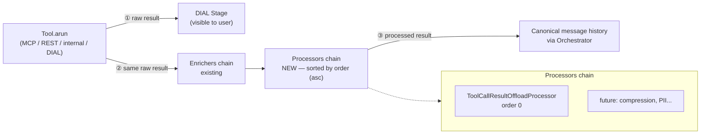
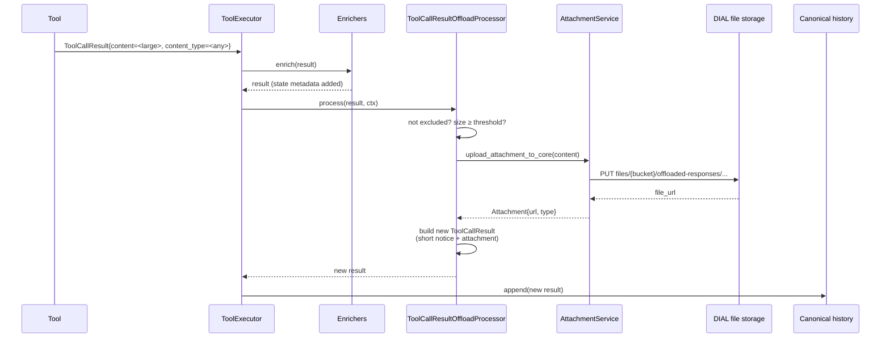
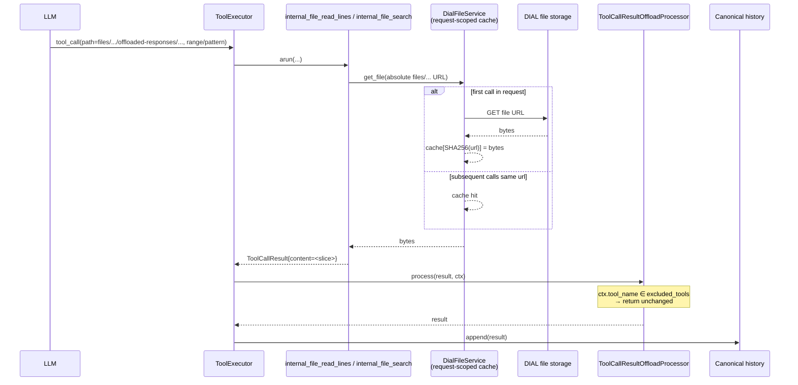

# Design: Large Tool Response Processing

- **Status:** Implemented
- **Approved:** 2026-05-25
- **Dependencies:**
  - [DIAL Files Tools](dial_files_tools.md) — provides the `internal_file_read_lines` / `internal_file_search` tools the LLM uses to read offloaded content back on demand. This is a **hard dependency**: an offloaded response is unreadable without these tools. Offload is implemented as a **sub-feature of DIAL Files Tools** — its config nests under `features.dial_files` and its wiring lives in `DialFilesToolingModule` (see Components 3 & 5), so it cannot be configured without the dependency.
- **Related:** [Issue #64](https://github.com/epam/ai-dial-quickapps-backend/issues/64)

## Problem Statement

Tool responses (REST, MCP, internal, DIAL deployment) are currently appended to the canonical message history verbatim. When a tool returns a large text response (e.g., a web page dump, a log snippet, a large JSON payload), two problems emerge:

1. **Token waste** — the entire response is sent to the LLM on every subsequent iteration, consuming context window and money.
2. **Poor UX in the stage** — the full response is rendered in the DIAL stage and is effectively unreadable.

There is also **no extension point** in the current pipeline for transforming `ToolCallResult.content`. `ToolCallResultEnricher` exists, but it is scoped to enrichment of `result.state` (metadata), not content transformation. `MessagesTransformer` and `PreInvocationTransformer` operate on the message list before LLM calls and do not persist changes to the canonical history — wrong layer for one-time offload.

## Design Goals

- Provide a generic extension point for post-processing `ToolCallResult` in `ToolExecutor`, applied **once** per tool call and persisted to canonical history.
- Implement **large response offload** as the first consumer of this extension point: detect oversized responses by size alone (no content-type filtering in v1), upload them to DIAL file storage, replace the response content with a short reference + attachment.
- Rely on [DIAL Files Tools](dial_files_tools.md) (`internal_file_read_lines`, `internal_file_search`) for read-back — they are the agent-facing half of this feature and are specified in their own design. Because an offloaded response is useless without a way to read it back, this design treats DIAL Files Tools as a **hard dependency**: offload self-disables (stays inline) when the read-back tools are not exposed.
- Keep performance impact **negligible for small responses**; net-positive for large ones (trades one HTTP upload for smaller LLM context).
- Make the extension point **future-ready for a configuration hierarchy** (global → application → toolset → tool), without paying the cost of hierarchy logic today.
- **Fail-open** on upload errors: a broken DIAL file storage must not break agent iterations.

---

## Use Cases

### UC-1: Large response is offloaded

**Trigger:** Any tool (REST, MCP, DIAL deployment, internal) returns a response whose `content` length exceeds the configured threshold.\
**Behavior:** `ToolCallResultOffloadProcessor` detects `len(content) ≥ threshold` and (the tool is not in the exclusion list). Content is uploaded to DIAL file storage. The `ToolCallResult.content` is replaced with a short notice containing the file URL and instructions to use `internal_file_read_lines` / `internal_file_search`. The file is attached to the result.\
**Outcome:** Canonical history contains only the short notice + attachment. The stage shows a compact, readable message. The LLM sees a small message and a file it can read on demand.

### UC-2: Agent reads offloaded content back

**Trigger:** The LLM calls `internal_file_read_lines` or `internal_file_search` with `path` set to the offloaded file URL. The offloaded file lives outside the agent's home dir, so the LLM passes the absolute `files/{bucket}/...` URL from the notice; both tools accept absolute `files/...` paths.\
**Behavior:** Covered by [DIAL Files Tools](dial_files_tools.md). The key interaction with this design is that both tool names are always in `ToolCallResultOffloadProcessor`'s resolved `excluded_tools` (a mandatory, non-overridable exclusion), so read-back results are never re-offloaded (no recursive loop, no duplicate storage).\
**Outcome:** The LLM can narrow in on the content it needs. If it requests an oversized slice, it pays the context cost directly — expected self-correction.

### UC-3: DIAL file storage is unavailable during offload

**Trigger:** Upload to DIAL file storage fails with a 5xx error.\
**Behavior:** `ToolCallResultOffloadProcessor` logs a warning and returns the original `ToolCallResult` unchanged (fail-open).\
**Outcome:** Large content goes into the LLM context — not ideal, but the agent iteration completes. No user-visible error.

---

## Proposed Design

### Component 1: `ToolCallResultProcessor` (new abstraction)

**What:** A new async interface that transforms a `ToolCallResult` after tool execution. `ProcessingContext` carries tool identity (`tool_call_id`, `tool_name`) so processors can route on it; introducing it from day one keeps `process()` stable as routing inputs grow (adding context fields is non-breaking; changing the signature is not).

```python
# src/quickapp/common/abstract/tool_call_result_processor.py

class ProcessingContext(BaseModel):
    tool_call_id: str | None
    tool_name: str
    # Future: toolset/tool-level config overrides

class ToolCallResultProcessor(ABC):
    # Lower values run earlier; ties broken by registration order (stable sort).
    # Default 0 = "no preference"; may be negative.
    order: int = 0

    @abstractmethod
    async def process(
        self,
        result: ToolCallResult,
        ctx: ProcessingContext,
    ) -> ToolCallResult: ...
```

**Owner:** `ToolExecutor` collects all bound `ToolCallResultProcessor` instances via DI and applies them in `order` (ascending) after `ToolCallResultEnricher`s have run.

**Semantics:**
- Each processor returns a (possibly new) `ToolCallResult`. The returned value is the input for the next processor.
- Processors are sorted by `order` at application time (lower first; stable sort, so equal `order` keeps registration order). Ordering is **explicit**, mirroring the `BaseInitializer.order` convention.
- `ProcessingContext` carries tool identity for routing decisions. It is constructed by `ToolExecutor` from the current tool call.

**Change:** New file. `ToolExecutor.execute()` gets a new DI dependency `list[ToolCallResultProcessor]` and a new step after the enricher loop.

---

### Component 2: `ToolExecutor` changes

**What:** Add processor invocation after enricher invocation.

`execute()` gathers all tool results first, then runs the enricher pass over them. The processor pass is a **new third stage** with the same gather-then-iterate shape. (Snippets simplified — real code in `agent/tool_executor.py`.)

**Current (simplified):**
```python
results = list(await asyncio.gather(*tasks))   # one task per valid tool call
for enricher in self._enrichers:                # enricher pass
    for result in results:
        enricher.enrich(result)
return results
```

**New:**
```python
# In __init__: sort once, store.
self._processors = sorted(processors, key=lambda p: p.order)

# In execute(), after the enricher pass — a separate processor pass per result:
for i, (result, tc) in enumerate(zip(results, valid_calls)):
    ctx = ProcessingContext(tool_call_id=tc.id, tool_name=tc.name)
    for processor in self._processors:
        result = await processor.process(result, ctx)
    results[i] = result   # processors may return a new ToolCallResult
return results
```

**Owner:** `src/quickapp/core/agent/tool_executor.py`

**Change:** New constructor parameter (list of processors). Sorting happens **once in the constructor** (`ToolExecutor` is request-scoped → sorted list is reused for every `execute()` call within the request). New loop after enrichers.

---

### Component 3: `ToolCallResultOffloadProcessor` (first consumer)

**What:** First concrete implementation of `ToolCallResultProcessor`. Detects oversized responses (by size only, regardless of content type) and offloads them.

**Module:** `src/quickapp/dial_files_tooling/` — offload is a **sub-feature of DIAL Files Tools**, not a standalone module. The processor (`_offload_processor.py`) and its resolved-config dataclass (`_offload_config.py`) live alongside the file tools, and `DialFilesToolingModule` owns all the wiring (see Component 5).

**Algorithm:**


**Textual steps:**
1. If processor disabled → return result unchanged.
2. If `ctx.tool_name in self._excluded_tools` → return result unchanged.
3. Size check (the canonical comparison unit is **bytes**; see _Threshold calibration_). The implementation compares `len(result.content.encode("utf-8")) < threshold`. If under threshold → return result unchanged. (A code-point pre-check is intentionally avoided: `len(result.content)` is only a lower bound on UTF-8 byte length, so it cannot safely short-circuit either direction without a separate byte confirmation.)
4. Upload `result.content` to DIAL file storage via `AttachmentService`, path `files/{bucket}/offloaded-responses/{tool_name}-{iso8601_timestamp}.txt` (see note on extension below).
5. On upload failure → log warning, return original result (**fail-open**).
6. On success → return a new `ToolCallResult` with:
   - `content` = short notice containing file URL + usage hint (`internal_file_read_lines` / `internal_file_search`)
   - `attachments` += an attachment pointing to the uploaded file (title includes tool name); attachment's media type preserves the original `result.content_type` when set, else `text/plain`
   - `state["offloaded_response"]` = `{file_url, original_size, content_type}` (metadata only)

**Note on content type / extension:** Size-only filtering is intentional for v1. The original `content_type` is preserved on the attachment so DIAL can render it. The stored file name uses a `.txt` extension as a conservative default since responses are always treated as text strings; extension-from-content-type is deferred (see Out of Scope). This does not affect the LLM's ability to read the file back — read tools operate on bytes/lines regardless of extension.

**Settings:** `ToolCallResultOffloadSettings` (pydantic-settings, env prefix `TOOL_CALL_RESULT_OFFLOAD__`). Sets env-level defaults:
- `enabled_by_default: bool` — default `True`. Sets the **default value of the per-app `enabled` flag** (see _Per-app override_): when an app's offload section omits `enabled`, it falls back to this. It is the single env knob for enablement.
- `size_threshold: int` — byte threshold (compared against `len(result.content.encode("utf-8"))`); default `40_000` (≈ 40 KB; see _Threshold calibration_ in Design Decisions)
- `excluded_tools: set[str]` — default `set()` (empty). **Additional** tools to exempt from offloading, on top of the mandatory read-back exclusion (see below). The DIAL Files read-back tools (`internal_file_read_lines`, `internal_file_search`) are **always** excluded regardless of this value, so a large read-back slice is never re-offloaded into a recursive loop — that guard is not configurable.

**Per-app override (explicit `enabled` flag, nested under DIAL Files):** Offload config is nested **inside** `DialFilesConfig` as `features.dial_files.tool_call_result_offload`, a non-optional `ToolCallResultOffloadConfig` (a `default_factory` always yields an instance). Enablement is the explicit `enabled: bool` flag — `enabled: false` turns offload off for one app while still carrying its `size_threshold` / `excluded_tools` overrides. Nesting under `dial_files` makes offload structurally a sub-feature: there is no way to configure offload without engaging DIAL Files, so a globally-default-on optimization can no longer collide with the per-app-opt-in `dial_files` dependency.

- `enabled` defaults from `TOOL_CALL_RESULT_OFFLOAD__ENABLED_BY_DEFAULT` when not set.
- `size_threshold` / `excluded_tools` are overridable per-app; each defaults from the matching env var when not set.
- Offload still requires `features.dial_files` itself to be present (DIAL Files remains presence-based): an app with no `dial_files` block gets no offload regardless of `enabled`.

Config resolution happens **once per request** in `DialFilesToolingModule._provide_offload_config` (a request-scoped `@provider`), producing a `ResolvedOffloadConfig` dataclass. `ToolCallResultOffloadProcessor` receives only the resolved config — it has no knowledge of `ApplicationConfig` or the dial-files coupling.

**Read-back availability gate (hard dependency).** The provider checks `app_config.features.dial_files` **presence directly** (not the defaulted `DialFilesConfig()` produced by `_provide_dial_files_config`, which would otherwise re-enable offload when the feature is absent). Offload is disabled when `features.dial_files` is absent, when its `tool_call_result_offload.enabled` is `false`, **or** when `enabled_tools` is a list that omits `read_lines` or `search`. Checking the *resolved tool set* is essential: an app can enable the files module but restrict `enabled_tools` to, say, `["write"]`, in which case offloading would produce a notice pointing at tools the LLM cannot call. Folding this gate into `ResolvedOffloadConfig.enabled` keeps the processor ignorant of the coupling.

The restricted-`enabled_tools` disable is **surfaced to the user**, not silent: a sibling `@multiprovider` on `DialFilesToolingModule` contributes an `OffloadConfigurationException` (a soft `InitializationException`) when offload is `enabled` but the read-back tools are missing. It returns `[]` when `dial_files` is absent or offload is `enabled: false` — those mean offload was never requested, so there is nothing to warn about. `_InitializationErrorHandler` renders the exception as a warning line in the shared **"Initialization issues"** stage (`Status.COMPLETED`, since the exception is soft — the request still proceeds).

**Order:** `0` (default). No other processors planned today.

**Owner:** `src/quickapp/dial_files_tooling/_offload_processor.py`

---

### Component 4: DIAL files tools (read-back provider)

Specified separately in [DIAL Files Tools](dial_files_tools.md). Relevant facts for this design:

- The read-back tools are named `internal_file_read_lines` and `internal_file_search`; these names are always in `ToolCallResultOffloadProcessor`'s resolved `excluded_tools` (a mandatory, non-overridable exclusion folded in by `_provide_offload_config`) so read-back results are never re-offloaded.
- Both tools address files by `path`, which may be a path relative to the agent's home dir **or** an absolute `files/...` URL. Offloaded files live under `files/{bucket}/offloaded-responses/`, outside the agent home dir, so the LLM reads them back via the absolute URL carried in the notice.
- They are wired by `DialFilesToolingModule` (preview-gated), which **also owns the offload wiring** (see Component 5). Offload has a **hard dependency** on these tools being exposed: when they are not, it self-disables. Because offload config nests under `dial_files`, offload cannot exist without the module that provides read-back.

---

### Component 5: `DialFilesToolingModule` (DI wiring — offload folded in)

**What:** Offload has **no standalone module**. `DialFilesToolingModule` (which already wires the file tools) also owns the offload wiring, reflecting that offload is a sub-feature of DIAL Files. On top of binding the file tools, it:

- Binds `ToolCallResultOffloadProcessor` (request-scoped).
- Provides a request-scoped `ResolvedOffloadConfig` via `_provide_offload_config`, reading `features.dial_files.tool_call_result_offload` **and applying the read-back availability gate** — forcing `enabled = False` when `dial_files` is absent, the offload section's `enabled` flag is `false`, or `read_lines` / `search` are not in the resolved `enabled_tools`.
- Provides the processor into the `list[ToolCallResultProcessor]` multiprovider (`_provide_offload_processors`).
- Contributes an `OffloadConfigurationException` via `_provide_initialization_exceptions` → `list[InitializationException]` when offload is `enabled` but read-back tools are missing. Returns `[]` when offload was never requested (no `dial_files` / `enabled: false`).
- `ToolCallResultOffloadSettings` (pydantic-settings) is read directly by `DialFilesConfig`'s field defaults; it is not bound in the container.

**Preview gating:** `DialFilesToolingModule` is already **preview-feature-gated** (`@preview_module`). When preview is off, the module is skipped entirely and `features.dial_files` is nullified — so offload, being nested under it, is invisible too. No separate gating needed.

**Owner:** `src/quickapp/dial_files_tooling/dial_files_tooling_module.py`

**Change:** Added providers + one binding to the existing module. The standalone `tool_call_result_offload/` package and its `app_factory.py` registration are **removed**.

---

## Data Flow

### Pipeline Overview

Where the new `ToolCallResultProcessor` chain sits inside `ToolExecutor`, alongside the existing enricher chain:



> **Note:** Each tool type (MCP, REST, internal, DIAL deployment) writes its raw `ToolCallResult` to the DIAL stage inside `arun()`, before the result is returned to `ToolExecutor`. This means the stage always displays the **original, unprocessed content** — even when `ToolCallResultOffloadProcessor` later replaces it with a short notice in canonical history. The LLM sees the compact notice; the user in the DIAL UI sees the full response in the stage.

### Offload (write path)



### Read-back (read path)



---

## Error Handling

| Failure | Behavior |
|---------|----------|
| Upload to DIAL storage fails | **Fail-open**: log warning, return original `ToolCallResult` unchanged. |
| Read-back tools not exposed (`features.dial_files` absent, offload `enabled: false`, or `enabled_tools` excludes `read_lines`/`search`) | Offload **self-disables** at config resolution: `ResolvedOffloadConfig.enabled = False`. Large content stays inline. When offload is `enabled` but `enabled_tools` is restricted, the disable is surfaced as a warning (`OffloadConfigurationException`) in the "Initialization issues" stage (`Status.COMPLETED`). When `dial_files` is absent or offload is `enabled: false`, offload was never requested → no warning. |
| Invalid range / bad input to DIAL files tools | `InvalidToolCallParameterException` → existing `FallbackProcessor` returns tool-call error to LLM. |
| File URL missing or unreachable during read-back | Same as above — tool returns a meaningful error the LLM can act on. |
| LLM requests a huge slice | Result is not re-offloaded (tool in `excluded_tools`). Large content goes to the LLM context directly — expected self-correction. Optional: log a warning for monitoring. |

---

## Out of Scope

- **Regex search.** `internal_file_search` (owned by [DIAL Files Tools](dial_files_tools.md)) ships with substring + `case_insensitive` only. Regex requires DoS protection (timeout, catastrophic backtracking mitigation via the `regex` library), bounds checks, and careful error surfaces. Addressed in a follow-up design when the use case becomes concrete.
- **Content-type-based routing.** v1 applies size-only filtering — any large `content` is offloaded regardless of `content_type`. Future work: allow-list / deny-list per content type, per-type processors (e.g., compress JSON differently from plain text), extension-from-content-type for stored file names.
- **Configuration hierarchy (app → toolset → tool).** App-level overrides (`enabled`, `size_threshold`, `excluded_tools`) are in scope (v1). Toolset- and tool-level overrides are deferred. `ProcessingContext` is designed to accept additional override fields when that layer is added.
- **Explicit file cleanup / retention.** Offloaded files live in the same DIAL bucket as all other attachments and inherit DIAL Core's retention policy. No QuickApps-side cleanup today.
- **Caching strategy for read-back downloads.** `DialFileService` already caches within a request; whether to extend or introduce additional caching (e.g., LRU per file URL) is deferred to implementation, based on observed behavior.
- **Additional processors** (compression, PII scrubbing, format conversion). The abstraction supports them; concrete processors are not part of this design.

---

## Configuration / Usage Examples

### Environment variables (pydantic-settings)

```
TOOL_CALL_RESULT_OFFLOAD__ENABLED_BY_DEFAULT=true
TOOL_CALL_RESULT_OFFLOAD__SIZE_THRESHOLD=40000
TOOL_CALL_RESULT_OFFLOAD__EXCLUDED_TOOLS=["internal_file_read_lines","internal_file_search"]
```

`ENABLED_BY_DEFAULT` sets the default value of the per-app `enabled` flag; `SIZE_THRESHOLD` / `EXCLUDED_TOOLS` set the field defaults used when an app omits them.

### Per-app manifest override (example)

```json
{
  "features": {
    "dial_files": {
      "enabled_tools": "all",
      "tool_call_result_offload": {
        "enabled": true,
        "size_threshold": 20000
      }
    }
  }
}
```

Offload is nested inside `features.dial_files` and toggled by its `enabled` flag: `enabled: false` turns it off (while still carrying `size_threshold` / `excluded_tools`); when `enabled` is omitted it falls back to `TOOL_CALL_RESULT_OFFLOAD__ENABLED_BY_DEFAULT`. The example lowers the threshold for one app while `excluded_tools` falls back to the env default. Because the section lives under `dial_files`, an app cannot enable offload without also enabling the read-back tools — and an app with no `dial_files` block gets no offload and **no warning**.

### LLM-visible notice (example content the LLM sees after offload)

```
Response from 'fetch_logs' was too large (124312 bytes) and
has been saved to: files/{bucket}/.../offloaded-responses/fetch-logs-2026-04-17T10-30-45.123.txt
Use one of:
  - internal_file_read_lines(path, start_line, end_line)
  - internal_file_search(path, pattern, context_lines=0, case_insensitive=False)
Pass the saved URL above as `path`.
```

### Adding a new processor (future)

```python
class MyProcessor(ToolCallResultProcessor):
    order = -10  # negative → runs before default-order processors

    async def process(self, result, ctx):
        ...
        return result

# In some_module.py:
@multiprovider
def _provide_processors(self, p: MyProcessor) -> list[ToolCallResultProcessor]:
    return [p]
```

---

## Migration

### Breaking changes

None. Existing tool responses smaller than the threshold pass through unchanged. `ToolExecutor`'s constructor gains a new DI dependency but DI wiring is automatic.

### Non-breaking changes

- New optional DI binding `list[ToolCallResultProcessor]`. Defaults to an empty list when no module provides processors — confirmed by the baseline empty `@multiprovider` in `agent/agent_module.py`.
- Feature is **preview-gated** by `ENABLE_PREVIEW_FEATURES`. When disabled (the production default today), `DialFilesToolingModule` is skipped and `features.dial_files` is nullified — so neither the file tools nor the offload processor are bound, and the LLM sees no change.
- **Toggled by `enabled` under `dial_files`.** Offload is on when `features.dial_files.tool_call_result_offload.enabled` is `true` (an app that sets it to `false`, or omits `dial_files` entirely, gets no offload). The `enabled` default is governed by `TOOL_CALL_RESULT_OFFLOAD__ENABLED_BY_DEFAULT`.
- **Hard dependency on DIAL Files Tools.** Offload cannot be configured without `dial_files`, and self-disables when `enabled_tools` excludes `read_lines`/`search`. No broken intermediate state: either offload + read-back both work, or content stays inline.

---

## Summary of Changes

### New files

| File | Purpose |
|------|---------|
| `common/abstract/tool_call_result_processor.py` | `ToolCallResultProcessor` ABC, `ProcessingContext` model |
| `dial_files_tooling/_offload_config.py` | `ResolvedOffloadConfig` frozen dataclass |
| `dial_files_tooling/_offload_processor.py` | `ToolCallResultOffloadProcessor` — receives `ResolvedOffloadConfig` directly |

DIAL files tool files are listed in [DIAL Files Tools](dial_files_tools.md).

### Modified files

| File | Change |
|------|--------|
| `agent/tool_executor.py` | Inject `list[ToolCallResultProcessor]`, sort by `order` in constructor, apply chain after enrichers |
| `agent/agent_module.py` | Add baseline empty `@multiprovider` for `list[ToolCallResultProcessor]` |
| `config/dial_files.py` | Add `ToolCallResultOffloadSettings`, `ToolCallResultOffloadConfig` (with `enabled` flag), and the `tool_call_result_offload` field on `DialFilesConfig` |
| `dial_files_tooling/dial_files_tooling_module.py` | Bind the processor; add `_provide_offload_config`, `_provide_offload_processors`, `_provide_initialization_exceptions`, and the read-back gate helper |

### Removed

- `tool_call_result_offload/` package (settings, processor, module) — folded into `dial_files_tooling/`.
- `ToolCallResultOffloadAppConfig` and the `tool_defaults.tool_call_result_offload` field in `config/application.py`.
- `ToolCallResultOffloadModule` registration in `app_factory.py`.

### New interfaces

- `ToolCallResultProcessor.process(result, ctx) -> ToolCallResult`
- `ProcessingContext(tool_call_id, tool_name)`
- `ResolvedOffloadConfig(enabled, size_threshold, excluded_tools)` — frozen dataclass produced once per request by `DialFilesToolingModule`

### Tests

- Unit: `src/tests/unit_tests/dial_files_tooling/` — `test_offload_processor.py` covers threshold / exclusion / fail-open branches for `ToolCallResultOffloadProcessor`; `test_offload_config_resolution.py` covers the read-back availability gate and the initialization-exception surface (offload self-disables and stays silent when `dial_files` or the offload section is absent; disables with a warning when `enabled_tools` excludes `read_lines`/`search`). Other DIAL files tool tests are covered in their own design.
- Integration: end-to-end case with a large REST response in the existing integration suite; recursive-read-back case (covered via the DIAL files tools' exclusion, UC-2).

---

## Design Decisions

### Read-back tool set

Read-back relies on `internal_file_read_lines` + `internal_file_search` from [DIAL Files Tools](dial_files_tools.md). That module exposes a broader toolkit (list/write/edit/delete/copy/move as well), but only those two return file *content* and so only those two matter for offload. The rationale for the line-based, substring-search read surface is documented in [DIAL Files Tools](dial_files_tools.md).

---

### Hard dependency on read-back tools (vs. independent modules)

**Decision:** Offload self-disables when `internal_file_read_lines` / `internal_file_search` are not exposed, rather than offloading regardless.

**Rationale:**

- **An offloaded response without read-back is broken behaviour.** The notice tells the LLM to call read-back tools; if those tools are absent, the LLM is handed a pointer it cannot follow and the content is simply lost from its reach. Failing closed (stay inline) is strictly safer than failing open here.
- **Why gate on the resolved tool set, not the module flag.** `DialFilesToolingModule` can be wired while `features.dial_files.enabled_tools` restricts the exposed tools (e.g. `["write"]`). Checking module presence alone would miss this case. The gate therefore inspects the resolved tool set for both `read_lines` and `search`.
- **Why fold the gate into `ResolvedOffloadConfig.enabled`.** It keeps `ToolCallResultOffloadProcessor` oblivious to the coupling — the processor only ever reads `enabled`. The cross-module knowledge lives in one request-scoped provider (`_provide_offload_config`), evaluated once per request.
- **Why surface the disable as a chat-stage warning, not a server log.** A misconfiguration the operator can't see is a misconfiguration that never gets fixed. Emitting an `OffloadConfigurationException` through the existing `list[InitializationException]` multiprovider reuses the established "Initialization issues" stage rather than inventing a one-off surface. It is **soft** (`is_hard=False`): the request proceeds with offload disabled, and the stage stays `COMPLETED` — a warning, not a failure.

---

### Threshold calibration: 40 KB default, per-app override

**Decision:** Default `size_threshold = 40_000` bytes (UTF-8). Per-app overrides are supported via the app manifest.

**Rationale:**

- **Anchored to context window size.** Most current models (Claude, GPT-4o, Llama 3) offer 128K–200K token context windows. At ~4 bytes per token (English UTF-8), that is roughly 512 KB–800 KB of raw text. A threshold of 40 KB is ~5% of a typical 200K-token context — large enough to avoid noisy offloads of medium-sized responses, small enough to protect the context window from single-tool floods.
- **Why not derive the threshold from the model's actual context size?** QuickApps does not currently have access to the model's declared context limit at request time (the deployment name does not map to a known context window without an external registry). Using a fixed, well-reasoned default avoids that dependency. If model metadata becomes available in the future, the threshold can be made adaptive.
- **Why per-app override?** Different applications have different tool response profiles. A log-analysis app may want a lower threshold (e.g., 20 KB) to keep iterations focused; a data-retrieval app may tolerate larger inline responses. The global default is a safe starting point; the override lets operators tune without redeploying.
- **Comparison unit: bytes, not characters.** `len(result.content)` counts Unicode code points, which is misleading for multi-byte scripts (CJK, Arabic). Encoding the content to UTF-8 first (`len(content.encode("utf-8"))`) gives a stable, byte-accurate measure that matches what actually gets serialised on the wire and counted toward token budgets.
