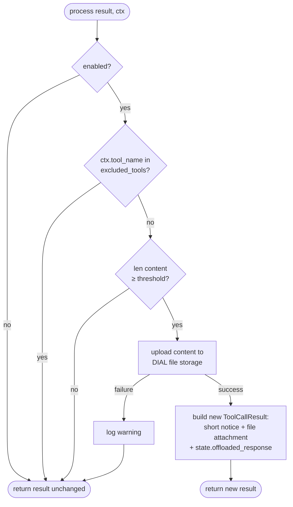
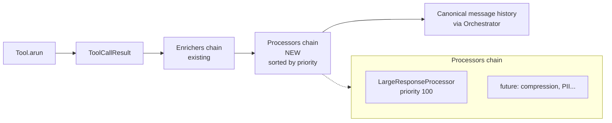
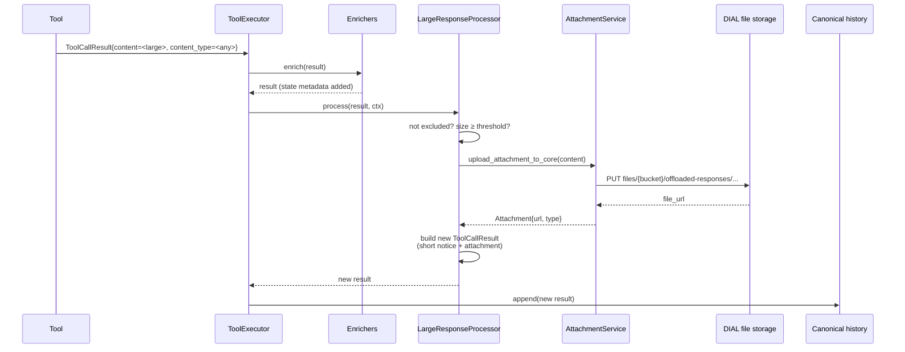
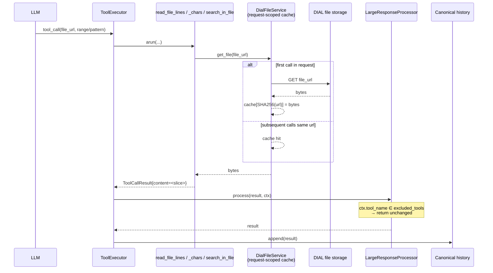

# Design: Large Tool Response Processing

- **Status:** Draft
- **Dependencies:**
  - None
- **Related:** [Issue #64](https://github.com/epam/ai-dial-quickapps-backend/issues/64)

## Problem Statement

Tool responses (REST, MCP, internal, DIAL deployment) are currently appended to the canonical message history verbatim. When a tool returns a large text response (e.g., a web page dump, a log snippet, a large JSON payload), two problems emerge:

1. **Token waste** — the entire response is sent to the LLM on every subsequent iteration, consuming context window and money.
2. **Poor UX in the stage** — the full response is rendered in the DIAL stage and is effectively unreadable.

There is also **no extension point** in the current pipeline for transforming `ToolCallResult.content`. `ToolCallResultEnricher` exists, but it is scoped to enrichment of `result.state` (metadata), not content transformation. `MessagesTransformer` and `PreInvocationTransformer` operate on the message list before LLM calls and do not persist changes to the canonical history — wrong layer for one-time offload.

## Design Goals

- Provide a generic extension point for post-processing `ToolCallResult` in `ToolExecutor`, applied **once** per tool call and persisted to canonical history.
- Implement **large response offload** as the first consumer of this extension point: detect oversized responses by size alone (no content-type filtering in v1), upload them to DIAL file storage, replace the response content with a short reference + attachment.
- Give the agent **file-reading tools** to pull content back on demand (line range, char range, substring search with optional context).
- Keep performance impact **negligible for small responses**; net-positive for large ones (trades one HTTP upload for smaller LLM context).
- Make the extension point **future-ready for a configuration hierarchy** (global → application → toolset → tool), without paying the cost of hierarchy logic today.
- **Fail-open** on upload errors: a broken DIAL file storage must not break agent iterations.

---

## Use Cases

### UC-1: Large response is offloaded

**Trigger:** Any tool (REST, MCP, DIAL deployment, internal) returns a response whose `content` length exceeds the configured threshold.\
**Behavior:** `LargeResponseProcessor` detects `len(content) ≥ threshold` and (the tool is not in the exclusion list). Content is uploaded to DIAL file storage. The `ToolCallResult.content` is replaced with a short notice containing the file URL and instructions to use `read_file_lines` / `search_in_file`. The file is attached to the result.\
**Outcome:** Canonical history contains only the short notice + attachment. The stage shows a compact, readable message. The LLM sees a small message and a file it can read on demand.

### UC-2: Agent searches inside an offloaded file

**Trigger:** The LLM calls `search_in_file(file_url=..., pattern="error", context_lines=2)`.\
**Behavior:** The tool downloads the file from DIAL storage, performs a substring search, returns matching chunks with ±2 lines of context as `ToolCallResult(content=..., content_type="text/plain")`.\
**Outcome:** The LLM gets a focused snippet instead of the full file; it can iterate.

### UC-3: Agent requests too much back → recursive offload

**Trigger:** The LLM calls `read_file_lines(start=0, end=100000)` on a very large file.\
**Behavior:** The read tool returns a `ToolCallResult` with the large content. Because `search_in_file` / `read_file_*` tools are in the exclusion list, `LargeResponseProcessor` **skips** them — the large content **is not re-offloaded**. The LLM sees its own oversized request filling the context.\
**Outcome:** The LLM learns (from context cost / follow-up iterations) to request smaller slices. No infinite loop; no duplicate storage of the same data.

> **Alternatives considered (deferred):** Hard limits on read-tool parameters (`end_line - start_line ≤ N`), truncation to threshold with a "truncated" notice, pagination tokens, or summarization. Each has trade-offs (loss of data, complexity, cost) — see the Out of Scope section for follow-up notes.

### UC-4: DIAL file storage is unavailable during offload

**Trigger:** Upload to DIAL file storage fails with a 5xx error.\
**Behavior:** `LargeResponseProcessor` logs a warning and returns the original `ToolCallResult` unchanged (fail-open).\
**Outcome:** Large content goes into the LLM context — not ideal, but the agent iteration completes. No user-visible error.

### UC-5: Multiple reads of the same offloaded file in one request

**Trigger:** The LLM calls `read_file_lines` on the same `file_url` several times within a single request (e.g., first to inspect structure, then to grab specific ranges).\
**Behavior:** The download is performed **once** and cached by `DialFileService` (request-scoped, keyed by `SHA256(url)`, 10 MB limit per file — already implemented). Subsequent calls hit the cache.\
**Outcome:** No repeated GETs to DIAL; low latency on follow-up reads.

---

## Proposed Design

### Component 1: `ToolCallResultProcessor` (new abstraction)

**What:** A new async interface that transforms a `ToolCallResult` after tool execution.

`ProcessingContext` is included from day one even though it only carries `tool_call_id` and `tool_name` today. Adding fields to `ProcessingContext` later is non-breaking; changing the `process()` signature later is breaking for every processor. The 3-line class now saves a migration later.

```python
# src/quickapp/common/abstract/tool_call_result_processor.py

class ProcessingContext(BaseModel):
    tool_call_id: str | None
    tool_name: str
    size_threshold_override: int | None = None  # per-app override; None → use global default
    # Future: toolset/tool-level config overrides

class ToolCallResultProcessor(ABC):
    priority: int = 100  # lower = earlier in chain

    @abstractmethod
    async def process(
        self,
        result: ToolCallResult,
        ctx: ProcessingContext,
    ) -> ToolCallResult: ...
```

**Owner:** `ToolExecutor` collects all bound `ToolCallResultProcessor` instances via DI and applies them in priority order after `ToolCallResultEnricher`s have run.

**Semantics:**
- Each processor returns a (possibly new) `ToolCallResult`. The returned value is the input for the next processor.
- Processors are sorted by `priority` at application time (lower first). Ordering is **explicit**, not dependent on module registration order.
- `ProcessingContext` carries tool identity for routing decisions. It is constructed by `ToolExecutor` from the current tool call.

**Change:** New file. `ToolExecutor.execute()` gets a new DI dependency `list[ToolCallResultProcessor]` and a new step after the enricher loop.

---

### Component 2: `ToolExecutor` changes

**What:** Add processor invocation after enricher invocation.

**Current (simplified):**
```python
for tool_call in tool_calls:
    result = await tool.arun(tool_call.id, **args)
    for enricher in self._enrichers:
        enricher.enrich(result)
    results.append(result)
```

**New:**
```python
# In __init__: sort once, store.
self._processors = sorted(processors, key=lambda p: p.priority)

# In execute():
for tool_call in tool_calls:
    result = await tool.arun(tool_call.id, **args)
    for enricher in self._enrichers:
        enricher.enrich(result)
    ctx = ProcessingContext(tool_call_id=tool_call.id, tool_name=tool_call.function.name)
    for processor in self._processors:
        result = await processor.process(result, ctx)
    results.append(result)
```

**Owner:** `src/quickapp/agent/tool_executor.py`

**Change:** New constructor parameter (list of processors). Sorting happens **once in the constructor** (`ToolExecutor` is request-scoped → sorted list is reused for every `execute()` call within the request). New loop after enrichers.

---

### Component 3: `LargeResponseProcessor` (first consumer)

**What:** First concrete implementation of `ToolCallResultProcessor`. Detects oversized responses (by size only, regardless of content type) and offloads them.

**Module:** `src/quickapp/tool_call_result_offload/`

**Algorithm:**



**Textual steps:**
1. If processor disabled → return result unchanged.
2. If `ctx.tool_name in self._excluded_tools` → return result unchanged.
3. If `len(result.content) < self._size_threshold` → return result unchanged.
4. Upload `result.content` to DIAL file storage via `AttachmentService`, path `files/{bucket}/offloaded-responses/{tool_name}-{iso8601_timestamp}.txt` (see note on extension below).
5. On upload failure → log warning, return original result (**fail-open**).
6. On success → return a new `ToolCallResult` with:
   - `content` = short notice containing file URL + usage hint (read_file_lines / search_in_file)
   - `attachments` += an attachment pointing to the uploaded file (title includes tool name); attachment's media type preserves the original `result.content_type` when set, else `text/plain`
   - `state["offloaded_response"]` = `{file_url, original_size, content_type}` (metadata only)

**Note on content type / extension:** Size-only filtering is intentional for v1. The original `content_type` is preserved on the attachment so DIAL can render it. The stored file name uses a `.txt` extension as a conservative default since responses are always treated as text strings; extension-from-content-type is deferred (see Out of Scope). This does not affect the LLM's ability to read the file back — read tools operate on bytes/lines regardless of extension.

**Settings:** `ToolCallResultOffloadSettings` (pydantic-settings), registered as singleton.
- `size_threshold: int` — byte threshold (compared against `len(result.content.encode("utf-8"))`); default `40_000` (≈ 40 KB; see _Threshold calibration_ in Design Decisions)
- `excluded_tools: set[str]` — default `{"read_file_lines", "search_in_file"}`
- `enabled: bool` — default `True`

**Per-app override:** The app manifest may include a `tool_call_result_offload` section with a `size_threshold` field. When present, it overrides the global setting for that application only. The override is surfaced to `LargeResponseProcessor` via `ProcessingContext.size_threshold_override` (see Component 1). Absent → global default applies.

**Priority:** `100` (default). No other processors planned today.

**Owner:** `src/quickapp/tool_call_result_offload/_large_response_processor.py`

---

### Component 4: Text-file internal tools (`text_file_tooling`)

**What:** Two new internal tools in their own module `src/quickapp/text_file_tooling/`. They are registered by `TextFileToolingModule` — contributed to the same internal-tool multiprovider that other internal tools (e.g., Python interpreter) also feed.

**Tools:**

| Tool | Parameters | Behavior |
|------|------------|----------|
| `read_file_lines` | `file_url: str`, `start_line: int`, `end_line: int` | Download file, split by `\n`, slice `[start_line:end_line]`. Return as `text/plain`. |
| `search_in_file` | `file_url: str`, `pattern: str`, `context_lines: int = 0`, `case_insensitive: bool = False` | Download file, substring search line-by-line, return matching lines ± `context_lines` as `text/plain`. |

**Rationale for two tools:** Character-based reading (`read_file_chars`) was rejected because LLMs cannot reliably estimate character offsets; line numbers are surfaced naturally by grep results. A combined `file_query(mode=...)` tool was also considered and rejected — see _Design Decisions_ section.

**Error handling:** Invalid input (bad range, missing file, etc.) → `InvalidToolCallParameterException` → existing `FallbackProcessor` returns the error to the LLM as a tool-call error.

**Behavior under re-offload:** Their results bypass `LargeResponseProcessor` (via `excluded_tools` default). If the LLM requests a too-large slice, it pays the context cost directly — expected self-correction loop (UC-3).

**Owner:** `src/quickapp/text_file_tooling/`

---

### Component 5: `ToolCallResultOffloadModule` (DI wiring)

**What:** New `injector.Module` that:

- Binds `ToolCallResultOffloadSettings` as singleton.
- Provides `LargeResponseProcessor` into the `list[ToolCallResultProcessor]` multiprovider.
- Does **not** register text-file tools directly — those are wired by `TextFileToolingModule` (Component 4).
- Registers itself in `src/quickapp/app_factory.py` alongside other feature modules.

**Preview gating:** Module is **preview-feature-gated**. `configure(binder)` checks `ApplicationConfig.enable_preview_features` (same pattern other preview modules use); when the flag is off, **nothing** is bound — no processor, no tools. This keeps the feature invisible in production deployments until it stabilizes. Once stable, the gate is removed and the module becomes always-on.

**Owner:** `src/quickapp/tool_call_result_offload/tool_call_result_offload_module.py`

**Change:** New file; one-line addition in `app_factory.py`.

---

## Data Flow

### Pipeline Overview

Where the new `ToolCallResultProcessor` chain sits inside `ToolExecutor`, alongside the existing enricher chain:



### Offload (write path)



### Read-back (read path)



---

## Error Handling

| Failure | Behavior |
|---------|----------|
| Upload to DIAL storage fails | **Fail-open**: log warning, return original `ToolCallResult` unchanged. |
| Invalid range / bad input to text-file tools | `InvalidToolCallParameterException` → existing `FallbackProcessor` returns tool-call error to LLM. |
| File URL missing or unreachable during read-back | Same as above — tool returns a meaningful error the LLM can act on. |
| LLM requests a huge slice | Result is not re-offloaded (tool in `excluded_tools`). Large content goes to the LLM context directly — expected self-correction. Optional: log a warning for monitoring. |

---

## Out of Scope

- **Regex search.** `search_in_file` ships with substring + `case_insensitive` only. Regex requires DoS protection (timeout, catastrophic backtracking mitigation via the `regex` library), bounds checks, and careful error surfaces. Addressed in a follow-up design when the use case becomes concrete.
- **Content-type-based routing.** v1 applies size-only filtering — any large `content` is offloaded regardless of `content_type`. Future work: allow-list / deny-list per content type, per-type processors (e.g., compress JSON differently from plain text), extension-from-content-type for stored file names.
- **Configuration hierarchy (app → toolset → tool).** App-level `size_threshold` override is in scope (v1). Toolset- and tool-level overrides are deferred. `ProcessingContext` is designed to accept additional override fields when that layer is added.
- **Explicit file cleanup / retention.** Offloaded files live in the same DIAL bucket as all other attachments and inherit DIAL Core's retention policy. No QuickApps-side cleanup today.
- **Caching strategy for read-back downloads.** `DialFileService` already caches within a request; whether to extend or introduce additional caching (e.g., LRU per file URL) is deferred to implementation, based on observed behavior.
- **Additional processors** (compression, PII scrubbing, format conversion). The abstraction supports them; concrete processors are not part of this design.

---

## Configuration / Usage Examples

### Environment variables (pydantic-settings)

```
TOOL_CALL_RESULT_OFFLOAD__ENABLED=true
TOOL_CALL_RESULT_OFFLOAD__SIZE_THRESHOLD=40000
TOOL_CALL_RESULT_OFFLOAD__EXCLUDED_TOOLS=["read_file_lines","search_in_file"]
```

### Per-app manifest override (example)

```json
{
  "tool_call_result_offload": {
    "size_threshold": 20000
  }
}
```

The per-app `size_threshold` overrides the global env-var for that application only. All other global settings (`enabled`, `excluded_tools`) remain in effect unless a future iteration extends the manifest schema to cover them.

### LLM-visible notice (example content the LLM sees after offload)

```
Response from 'fetch_logs' was too large (124312 chars) and
has been saved to: https://dial-storage/.../offloaded-responses/fetch_logs-2026-04-17T10:30:45.123.txt
Use one of:
  - read_file_lines(file_url, start_line, end_line)
  - search_in_file(file_url, pattern, context_lines=0, case_insensitive=False)
```

### Adding a new processor (future)

```python
class MyProcessor(ToolCallResultProcessor):
    priority = 50  # runs before LargeResponseProcessor (100)

    async def process(self, result, ctx):
        ...
        return result

# In some_module.py:
@multiprovider
def _provide_processors(self, p: MyProcessor) -> list[ToolCallResultProcessor]:
    return [p]
```

---

## Migration

### Breaking changes

None. Existing tool responses smaller than the threshold pass through unchanged. `ToolExecutor`'s constructor gains a new DI dependency but DI wiring is automatic.

### Non-breaking changes

- New optional DI binding `list[ToolCallResultProcessor]`. Defaults to an empty list if no module provides processors (via existing `@multiprovider` semantics, the binding resolves to an empty list when no providers exist; confirm during implementation).
- Feature is **preview-gated** by `ENABLE_PREVIEW_FEATURES`. When disabled (the production default today), neither the processor nor the text-file tools are bound — LLM sees no change.
- When preview is enabled, feature can still be disabled entirely via `TOOL_CALL_RESULT_OFFLOAD__ENABLED=false`.

---

## Summary of Changes

### New files

| File | Purpose |
|------|---------|
| `common/abstract/tool_call_result_processor.py` | `ToolCallResultProcessor` ABC, `ProcessingContext` model |
| `tool_call_result_offload/_large_response_processor.py` | First processor implementation |
| `tool_call_result_offload/_settings.py` | `ToolCallResultOffloadSettings` pydantic-settings |
| `tool_call_result_offload/tool_call_result_offload_module.py` | DI wiring (preview-gated) |
| `text_file_tooling/_read_file_lines_tool.py` | `read_file_lines` internal tool |
| `text_file_tooling/_search_in_file_tool.py` | `search_in_file` internal tool |
| `text_file_tooling/text_file_tooling_module.py` | `TextFileToolingModule` DI wiring |

### Modified files

| File | Change |
|------|--------|
| `agent/tool_executor.py` | Inject `list[ToolCallResultProcessor]`, sort by priority in constructor, apply chain after enrichers |
| `app_factory.py` | Register `ToolCallResultOffloadModule` |

### New interfaces

- `ToolCallResultProcessor.process(result, ctx) -> ToolCallResult`
- `ProcessingContext(tool_call_id, tool_name)`

### Tests

- Unit: `src/tests/tool_call_result_offload/` covering threshold / exclusion / fail-open branches for `LargeResponseProcessor`; `src/tests/text_file_tooling/` covering each text-file tool.
- Integration: end-to-end case with a large REST response in the existing integration suite; recursive-read-back case (UC-3).

---

## Design Decisions

### Text-file tool set: two tools, line-based reading

**Decision:** `text_file_tooling` exposes exactly two tools — `search_in_file` and `read_file_lines`. Character-based reading (`read_file_chars`) was considered and rejected.

**Rationale:**

- **Lines over characters.** LLMs cannot reliably estimate character/byte offsets in an opaque file. Line numbers are natural and directly surfaced by grep results, making `read_file_chars` unusable in practice.
- **Two tools over one.** Combining grep and line-read into a single `file_query(mode=...)` tool was considered. Rejected because conditional parameters (either `query` or `start_line`/`end_line` depending on mode) confuse weaker models and add validation complexity for marginal token savings.
- **Grep is often sufficient alone.** `search_in_file` returns ±N context lines around each match. In most workflows the LLM does not need a separate line-read at all; `read_file_lines` covers only the case where a larger contiguous chunk is needed.

---

### Threshold calibration: 40 KB default, per-app override

**Decision:** Default `size_threshold = 40_000` bytes (UTF-8). Per-app overrides are supported via the app manifest.

**Rationale:**

- **Anchored to context window size.** Most current models (Claude, GPT-4o, Llama 3) offer 128K–200K token context windows. At ~4 bytes per token (English UTF-8), that is roughly 512 KB–800 KB of raw text. A threshold of 40 KB is ~5% of a typical 200K-token context — large enough to avoid noisy offloads of medium-sized responses, small enough to protect the context window from single-tool floods.
- **Why not derive the threshold from the model's actual context size?** QuickApps does not currently have access to the model's declared context limit at request time (the deployment name does not map to a known context window without an external registry). Using a fixed, well-reasoned default avoids that dependency. If model metadata becomes available in the future, the threshold can be made adaptive.
- **Why per-app override?** Different applications have different tool response profiles. A log-analysis app may want a lower threshold (e.g., 20 KB) to keep iterations focused; a data-retrieval app may tolerate larger inline responses. The global default is a safe starting point; the override lets operators tune without redeploying.
- **Comparison unit: bytes, not characters.** `len(result.content)` counts Unicode code points, which is misleading for multi-byte scripts (CJK, Arabic). Encoding the content to UTF-8 first (`len(content.encode("utf-8"))`) gives a stable, byte-accurate measure that matches what actually gets serialised on the wire and counted toward token budgets.
