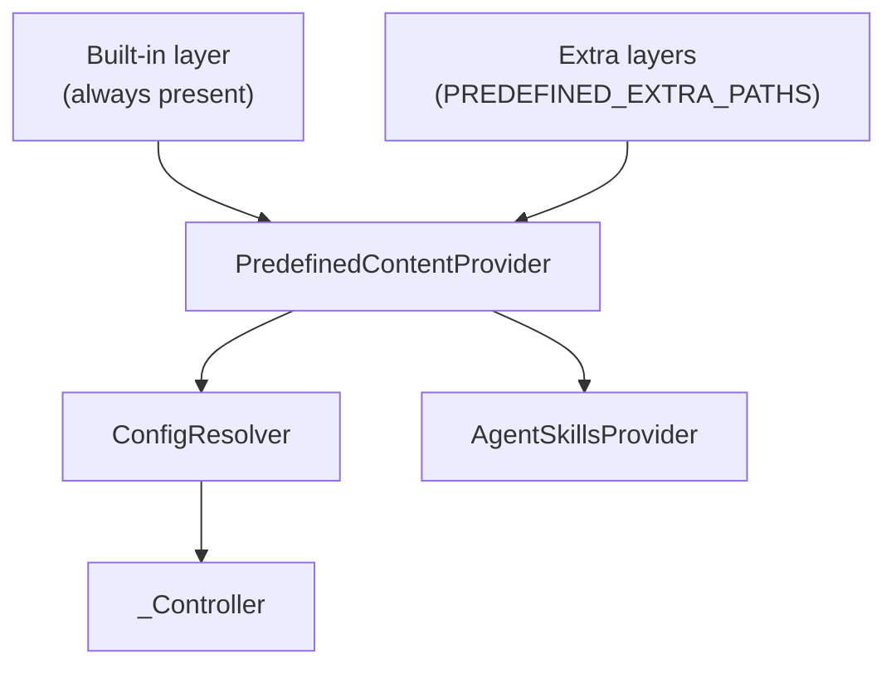

# Design: Layered Predefined Configuration

**Status:** Implemented

## Problem Statement

`PredefinedSettings.base_path` (`PREDEFINED_BASE_PATH` env var) is a single directory path that points to all predefined
content: prompts, tools, toolsets, and skills. Two independent consumers — `ConfigResolver` and `AgentSkillsProvider` —
each read from this path with their own duplicated fallback logic.

Three problems follow from this design:

1. **Duplicated I/O logic.** Both `ConfigResolver` and `AgentSkillsProvider` independently resolve the base path,
   implement the same "if None, fall back to `project_root/config/predefined`" default, scan directories, read files,
   and maintain separate caches. There is no single source of truth for "what predefined content is available."

2. **No customization layer.** Deployments cannot override or extend built-in content without replacing the entire
   `config/predefined/` directory. A customer who wants to add one custom skill or override one prompt must fork the
   whole tree.

3. **Built-in content is accidentally configurable.** The built-in predefined directory must always be present for the
   application to work correctly, yet `PREDEFINED_BASE_PATH` allows pointing away from it entirely. Misconfiguration
   silently loses all built-in content.

## Design Goals

- **Single source of truth** for all predefined content scanning, caching, and retrieval — eliminating the duplicated
  logic in `ConfigResolver` and `AgentSkillsProvider`.
- **Implicit built-in layer** that is always present and requires no configuration.
- **Optional override/extension layers** so deployments can add or replace individual templates and skills without
  forking the built-in directory.
- **Minimal change to downstream consumers** — `_Controller` API endpoints, `ConfigResolver.resolve_config()`, and
  `AgentSkillsProvider.get_skill_content()` continue to work as before. Internal wiring changes (constructor parameters,
  enum imports) are limited to the components directly involved.

---

## Proposed Design

### `PredefinedContentProvider` — central content service

A new singleton service that owns all predefined content I/O: directory scanning, file reading, layer merging, and
caching. It replaces the file I/O responsibilities currently split between `ConfigResolver` and `AgentSkillsProvider`.



**What:** A new class in the `config/` package.
**Owner:** `PredefinedContentProvider` is the sole owner of predefined content I/O.
**Semantics:**

- On construction, resolves the ordered list of layer directories (built-in first, then extra paths left to right).
- Scans each layer for all content types (`prompt/`, `tool/`, `toolset/`, `skills/`).
- Merges by content type and filename stem — later layers override earlier ones ("last wins").
- **Eager loading:** all files are read and cached in memory at construction time. No repeated file reads. This is
  acceptable because the content set is small and bounded — a handful of files per layer across a few
  operator-configured directories. If layers grow significantly larger in the future, lazy loading can be introduced
  without changing the public interface.
- Exposes `list_names()`, `read_text()`, and `read_json()` as the retrieval interface.

**Interface (signatures only):**

```python
@dataclass
class LayerInfo:
    path: Path
    content_counts: dict[ContentType, int]  # e.g. {PROMPT: 3, TOOL: 2, ...}
    overrides: dict[ContentType, list[str]]  # names that override an earlier layer


class PredefinedContentProvider:
    def list_names(self, content_type: ContentType) -> list[str]: ...

    def read_text(self, content_type: ContentType, name: str) -> str: ...

    def read_json(self, content_type: ContentType, name: str) -> dict: ...

    def get_layers_info(self) -> list[LayerInfo]: ...

    def get_default_configuration(self) -> dict: ...
```

`read_text()` is used for markdown content types (`PROMPT`, `SKILL`). `read_json()` is used for JSON content types (
`TOOL`, `TOOLSET`). Calling the wrong method for a content type raises `TypeError`. This avoids pushing a `str | dict`
union to every caller.

`ContentType` is a `str` enum replacing the current `TemplateType`. The `skills/` subdirectory name is kept as-is (
plural) for backward compatibility with existing custom mounts, despite the other names being singular. The
inconsistency is cosmetic and not worth the operator friction of renaming directories in production Helm charts.

| Value     | Subdirectory | File type |
|-----------|--------------|-----------|
| `PROMPT`  | `prompt/`    | `*.md`    |
| `TOOL`    | `tool/`      | `*.json`  |
| `TOOLSET` | `toolset/`   | `*.json`  |
| `SKILL`   | `skills/`    | `*.md`    |

### Layer resolution

The built-in predefined directory is **always included** as the base layer — it requires no configuration and cannot be
removed. The env var `PREDEFINED_EXTRA_PATHS` specifies additional override/extension layers on top.

**Resolution order:**

1. **Built-in layer** (implicit, always present):
    - Check `/app/predefined` first (`Path.is_dir()`) — this is the Docker layout
    - Fall back to `<project_root>/config/predefined/` — the development layout, where `project_root` is defined as a
      module-level constant computed once from `Path(__file__).parents[N]` relative to `PredefinedContentProvider`'s
      source file
    - If neither location is a directory, startup **fails with a fatal error**. The built-in layer is required — running
      without it means the application was deployed incorrectly.
2. **Extra layers** (from `PREDEFINED_EXTRA_PATHS`, optional):
    - JSON list of directory paths (e.g. `'["/shared/config", "/tenant/config"]'`), processed left to right
    - Later entries override earlier ones and the built-in layer
    - If any path does not exist or is not a directory, startup **fails with a fatal error**. Extra paths are
      operator-configured — a non-existent path is a misconfiguration that should be caught immediately, not silently
      ignored.

**Malformed files:** If a file within a valid layer cannot be read or parsed (e.g. invalid JSON in a `.json` file,
unreadable `.md` file), startup **fails with a fatal error** identifying the file path and layer. These files are
operator-managed — a corrupt file likely means a bad deploy and should be caught immediately rather than silently
skipped.

Each directory follows the same structure. Override layers only need the subdirectories they want to extend or replace.

```
<layer>/
  default_configuration.json   optional; JSON object (see below)
  prompt/       *.md files
  tool/         *.json files
  toolset/      *.json files
  skills/       *.md files
```

### `default_configuration.json` (layer root)

Each layer may include an optional `default_configuration.json` at the layer root (not under a content-type
subdirectory). The built-in layer ships `config/predefined/default_configuration.json` as `{}` to document the
convention; operators add keys via extra layers.

**Merge semantics:** Layers are processed in order. Each file’s top-level keys are **shallow-merged** into the merged
default configuration (`dict.update`) — later layers override earlier ones for the same top-level key. Nested objects are
not deep-merged (e.g. replacing `tool_sets` in a later layer replaces the entire list from earlier layers).

**Malformed files:** Invalid JSON or a non-object root is logged at `ERROR` and treated as empty for that layer only —
startup does **not** fail. This differs from corrupt files under `prompt/`, `tool/`, `toolset/`, or `skills/`, which
still fail fast at startup.

**Retrieval:** `PredefinedContentProvider.get_default_configuration()` returns a shallow copy of the merged object.

**Resolution for the builder API:** `PredefinedConfigResolver.get_default_configuration()` copies that dict, then
expands `tool_sets` when present and valid: predefined toolsets and `predefined-tool` entries inside hosting toolsets
are resolved the same way as at runtime. Failed toolsets are skipped with a warning only (no
`ConfigResolutionException` recorded on the request context). Skipped predefined tools inside a hosting toolset are
still logged and recorded. Invalid `tool_sets` (wrong type or Pydantic validation failure) are left unchanged.

**API:** `GET /v1/configuration-support/default-configuration` returns the resolved dict for the app builder UI.

### Merge semantics

Layers are processed in order. Later layers override earlier ones by **filename stem** within each content type ("last
wins"). No partial merging of file contents — an override replaces the entire file.

| Layer           | File                      | Result                                                                                        |
|-----------------|---------------------------|-----------------------------------------------------------------------------------------------|
| Built-in        | `prompt/gpt_prompt.md`    | Included (base)                                                                               |
| Extra `/custom` | `prompt/gpt_prompt.md`    | Overrides built-in                                                                            |
| Extra `/custom` | `prompt/custom_prompt.md` | Added (new)                                                                                   |
| **Merged**      |                           | `gpt_prompt` (from `/custom`) + `custom_prompt` (from `/custom`) + all other built-in prompts |

**Within-layer uniqueness:** Within a single layer, filename stems are unique by filesystem constraint. However, for
skills, the frontmatter `name` field may differ from the filename — two files with different stems can declare the same
skill name. This deduplication remains the responsibility of `AgentSkillsProvider` (not the provider), using the same
first-wins-alphabetically semantics as today. The provider only merges by filename stem; it has no knowledge of skill
metadata.

**Cross-layer direction change:** The current `AgentSkillsProvider` uses first-wins for duplicate skill names within a
single directory. The layering model uses **last-wins** across layers (later layer overrides earlier). These operate at
different levels and do not conflict: the provider merges files by stem across layers, then `AgentSkillsProvider`
deduplicates by skill name within the merged set.

### `PredefinedSettings` changes

A new `extra_paths` field is added. The old `base_path` field is retained but **deprecated** — if set and `extra_paths`
is not, it is treated as a single extra layer and a deprecation warning is logged at startup. If both are set,
`extra_paths` wins and `base_path` is ignored (with a warning). The built-in layer is no longer configurable — it is
always auto-detected.

|               | Before                                      | After                                                                                  |
|---------------|---------------------------------------------|----------------------------------------------------------------------------------------|
| **Fields**    | `base_path: str \| None`                    | `extra_paths: list[str] \| None` (new), `base_path: str \| None` (deprecated)         |
| **Env vars**  | `PREDEFINED_BASE_PATH`                      | `PREDEFINED_EXTRA_PATHS` (new), `PREDEFINED_BASE_PATH` (deprecated)                   |
| **Default**   | `None` (falls back to `config/predefined/`) | `None` (built-in only, no extras)                                                      |
| **Semantics** | Single directory replacing the default      | JSON list of directories layered on top of the built-in                                |

`base_path` will be removed in a future major version.

### Impact on `ConfigResolver`

`ConfigResolver` becomes a pure **config resolution logic** layer. It no longer scans directories or reads files — it
delegates to `PredefinedContentProvider`.

| What changes                                                                              | Detail                                                                                                                                                                                                                                                                                                                       |
|-------------------------------------------------------------------------------------------|------------------------------------------------------------------------------------------------------------------------------------------------------------------------------------------------------------------------------------------------------------------------------------------------------------------------------|
| `_scan_templates()`                                                                       | Removed; replaced by `provider.list_names()`                                                                                                                                                                                                                                                                                 |
| `read_template_content()`                                                                 | Delegates to `provider.read_text()` / `provider.read_json()` based on content type                                                                                                                                                                                                                                           |
| `template_map` attribute                                                                  | Retained as a read-only property that delegates to `provider.list_names()`, since `_Controller` accesses it directly. Reconstructs the same `dict[str, list[str]]` shape keyed by `ContentType` value strings (e.g. `{"prompt": [...], "tool": [...], "toolset": [...]}`), excluding `SKILL` which is not a config template. |
| `cache` dict                                                                              | Removed (caching lives in provider)                                                                                                                                                                                                                                                                                          |
| Constructor parameter                                                                     | `PredefinedContentProvider` instead of `PredefinedSettings`                                                                                                                                                                                                                                                                  |
| `resolve_config()`, `resolve_predefined_toolset()`, `resolve_toolset()`, `resolve_tool()` | Unchanged — these are config resolution logic, not I/O                                                                                                                                                                                                                                                                       |
| `get_default_configuration()`                                                               | New — copies provider merge, resolves `tool_sets` for builder export (`log_only` skips for bad toolsets)                                                                                                                                                                                                                     |

### Impact on `AgentSkillsProvider`

`AgentSkillsProvider` no longer scans directories or reads files directly.

| What changes                                              | Detail                                                                                                 |
|-----------------------------------------------------------|--------------------------------------------------------------------------------------------------------|
| `_get_skills_directory()`                                 | Removed                                                                                                |
| `_load_skills()`                                          | Uses `provider.list_names(ContentType.SKILL)` + `provider.read_text()` instead of globbing `.md` files |
| `_skill_content_cache`                                    | Removed (caching lives in provider)                                                                    |
| Constructor parameter                                     | `PredefinedContentProvider` instead of `PredefinedSettings`                                            |
| Frontmatter parsing, XML generation, skill metadata logic | Unchanged                                                                                              |

### DI wiring

`PredefinedContentProvider` is registered as a singleton in `AppModule`. Both `ConfigResolver` and `AgentSkillsProvider`
receive it via constructor injection. `PredefinedSettings` is still bound as a singleton and injected into
`PredefinedContentProvider`.

### Startup logging

On startup, `PredefinedContentProvider` logs the configured layers and merged totals:

```
INFO  Predefined content layers: [/app/predefined, /custom/config]
INFO  Layer /app/predefined: 3 prompts, 3 tools, 4 toolsets, 1 skill
INFO  Layer /custom/config: 1 prompt (override: gpt_prompt), 2 skills
INFO  Merged predefined content: 3 prompts, 3 tools, 4 toolsets, 3 skills
```

---

## Secondary Fixes

### Dockerfile cleanup

The `PREDEFINED_BASE_PATH` env var is removed from the Dockerfile. The built-in `/app/predefined` directory is
auto-detected by `PredefinedContentProvider` — no env var needed.

### Impact on `_Controller`

`_Controller` continues to consume `ConfigResolver`. Existing template listing endpoints are unchanged. One new
endpoint: `GET /v1/configuration-support/default-configuration` (delegates to `get_default_configuration()`). Two
source-level updates were also required:

- **`TemplateType` → `ContentType`:** `_Controller` imports and uses `TemplateType` directly. Update imports to use
  `ContentType`.
- **`template_map` access:** `_Controller._get_template_content()` accesses `self.__config_resolver.template_map` as a
  public attribute. This continues to work because `ConfigResolver` retains `template_map` as a delegating property (
  see "Impact on ConfigResolver" above).

There is also a pre-existing type annotation bug in `_Controller._get_template_content()`: line 70 annotates
`actual_tool_set: PredefinedToolSet` but validates as `ToolSet`. This is not introduced by this design but is worth
fixing alongside these changes.

---

## Out of Scope

- **Partial file merging** (e.g., adding one tool to an existing toolset JSON). "Last wins by name" replaces the entire
  file. Partial merging would be complex and error-prone. Could be revisited if a concrete use case arises.
- **Hot-reloading.** Content is scanned once at startup and cached. Runtime changes to layer directories require a
  restart. Hot-reloading could be added later if needed.
- **`PromptMapping` refactoring.** The hardcoded model-to-prompt mapping in `PromptMapping` is a separate concern and
  not addressed here. Note that a custom layer can add a new prompt file (e.g. `custom_prompt.md`), but its
  `allowed_models` will be empty unless the operator also configures `CONFIG_PROMPT_MAPPING` to include it. This is a
  limitation of the current `PromptMapping` design, not of layering — addressing it requires a separate design pass.

---

## Configuration / Usage Examples

### Default setup (no env vars)

Built-in layer is auto-detected. All built-in prompts, tools, toolsets, and skills are available.

### Customer deployment: add custom skills

```bash
# Mount a directory with custom skills, keep all built-in content
PREDEFINED_EXTRA_PATHS='["/custom/config"]'
```

Where `/custom/config/skills/` contains additional `.md` skill files.

### Customer deployment: override a built-in prompt

```bash
PREDEFINED_EXTRA_PATHS='["/overrides"]'
```

Where `/overrides/prompt/gpt_prompt.md` replaces the built-in `gpt_prompt.md`. All other built-in content is still
available.

### Multiple override layers

```bash
# Shared org config, then tenant-specific overrides (tenant wins)
PREDEFINED_EXTRA_PATHS='["/shared/config", "/tenant/config"]'
```

---

## Migration

### Breaking changes

| Change                                                     | Impact                                                                                                                                                                                                                                                                                                                                                                                                                                                                                                                                                                                                       | Mitigation                                                                              |
|------------------------------------------------------------|--------------------------------------------------------------------------------------------------------------------------------------------------------------------------------------------------------------------------------------------------------------------------------------------------------------------------------------------------------------------------------------------------------------------------------------------------------------------------------------------------------------------------------------------------------------------------------------------------------------|-----------------------------------------------------------------------------------------|
| `PREDEFINED_BASE_PATH` deprecated                          | Deployments that set this env var have it treated as a single extra layer on top of the always-present built-in layer, with a deprecation warning logged. **Behavioral change:** the old semantics *replaced* the built-in directory entirely; the new semantics always include it. Deployments that relied on `PREDEFINED_BASE_PATH` to *exclude* built-in content (e.g. omitting specific tools) will see that content reappear. This is intentional (see problem #3). Excluding built-in content is not a supported use case — application-level config should be used to disable specific tools instead. | Migrate to `PREDEFINED_EXTRA_PATHS`. Remove `base_path` in a future major version.      |
| `TemplateType` removed                                     | `_Controller` and any external code importing `TemplateType` will break at import time                                                                                                                                                                                                                                                                                                                                                                                                                                                                                                                       | Update to `ContentType`. If needed, add a temporary alias `TemplateType = ContentType`. |
| Test code constructing `PredefinedSettings(base_path=...)` | Still works during deprecation period                                                                                                                                                                                                                                                                                                                                                                                                                                                                                                                                                                        | Update tests to inject `PredefinedContentProvider` directly or use `extra_paths`        |

### Non-breaking changes

- `ConfigResolver` and `AgentSkillsProvider` public interfaces are unchanged.
- `_Controller` API endpoints are unchanged.
- All existing built-in content continues to work without any configuration.

### Dockerfiles

Both the production `Dockerfile` and the integration test `Dockerfile` (`src/tests/integration_tests/Dockerfile`) set
`PREDEFINED_BASE_PATH`. During the deprecation period these continue to work. They should be updated to remove the env
var (the built-in layer is auto-detected) or, if extra paths are needed, switch to `PREDEFINED_EXTRA_PATHS`.

---

## Summary of Changes

| Component                             | Change                                                                                                                                                               |
|---------------------------------------|----------------------------------------------------------------------------------------------------------------------------------------------------------------------|
| **`PredefinedContentProvider`** (new) | Singleton service owning all predefined content scanning, merging, caching, and retrieval                                                                            |
| **`ContentType`** (new)               | Enum replacing `TemplateType`, adding `SKILL` variant; `skills/` kept as-is (plural) for backward compatibility                                                      |
| **`LayerInfo`** (new)                 | Dataclass carrying layer path, per-type content counts, and override names for diagnostics/logging                                                                   |
| **`PredefinedSettings`**              | New `extra_paths: list[str] \| None` field added (JSON list from env var); `base_path` deprecated (treated as single extra layer if `extra_paths` absent)            |
| **`ConfigResolver`**                  | Removes `_scan_templates()`, `read_template_content()` I/O, and `cache` dict; `template_map` becomes a delegating property; delegates to `PredefinedContentProvider` |
| **`AgentSkillsProvider`**             | Removes `_get_skills_directory()`, directory scanning in `_load_skills()`, and `_skill_content_cache`; delegates to `PredefinedContentProvider`                      |
| **`_Controller`**                     | `TemplateType` imports updated to `ContentType`; pre-existing type annotation bug in `_get_template_content()` fixed                                                 |
| **`TemplateType`**                    | Removed (replaced by `ContentType`)                                                                                                                                  |
| **`AppModule`**                       | Adds `PredefinedContentProvider` singleton binding                                                                                                                   |
| **`Dockerfile`**                      | `PREDEFINED_BASE_PATH` env var removed (built-in layer auto-detected)                                                                                                |
| **Integration test `Dockerfile`**     | `PREDEFINED_BASE_PATH` env var removed                                                                                                                               |
