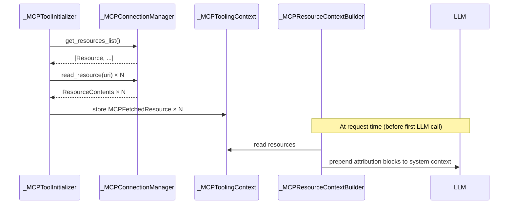

# Design: MCP Capabilities Extension (Resources, Prompts, Tool Annotations)

- **Status:** Draft
- **Dependencies:**
  - None

## Problem Statement

QuickApps uses MCP servers exclusively for tool invocation (`tools/list` + `tools/call`).
The remaining capabilities defined by the MCP 2025-11-25 specification — Resources,
Prompts, and tool annotations — are silently ignored.

As a result:

- MCP servers that expose contextual data (database schemas, documentation, configuration)
  via Resources provide no value beyond their tools. The LLM operates without context
  the server explicitly makes available.
- MCP servers that encode reusable instruction sets via Prompts cannot contribute to the
  agent's skill repertoire. Users have no way to activate these prompts through QuickApps.
- Tool annotations (`title`, `readOnlyHint`, `destructiveHint`) are discarded at
  initialization time. The LLM receives no hints about tool safety or intent, which
  degrades its decision-making when choosing between destructive and read-only operations.
- `structuredContent` in tool call results is only referenced in error-path logging
  (`_MCPTool._run_in_stage_async`). When a server returns structured output alongside
  empty text blocks, the response surfaces as blank content.

## Design Goals

- MCP servers that declare the `resources` capability automatically supply their resource
  content as attributed context blocks in every request — no changes required to existing
  client manifests.
- Users can optionally restrict which resources are loaded by URI, or load all of them
  with a single flag.
- MCP servers that declare the `prompts` capability make their prompts available inside
  QuickApps (exact integration strategy — skills source vs system prompt contribution —
  is an open decision documented in §3.3).
- Tool annotations (`title`, `readOnlyHint`, `destructiveHint`) are reflected in the
  tool description exposed to the LLM.
- `structuredContent` in successful tool results is surfaced as text content when no
  text blocks are present.
- Existing `MCPToolSet` and `DialMCPToolSet` manifests without the new fields behave
  identically to today. No migration is required.

---

## Use Cases

### UC-1: MCP server as a context source

**Trigger:** A toolset config has `resources.enabled: true`. The MCP server exposes a
resource `schema://tables` (name: "Database Schema", description: "Table definitions for
the orders database").

**Behavior:** During request initialization, QuickApps calls `resources/list` and then
`resources/read` for the resource URI. The text content is wrapped in an attributed block
and prepended to the system context:

```
--- Resource: Database Schema (database-assistant) ---
URI: schema://tables
Table definitions for the orders database.

CREATE TABLE orders (id INT, ...);
```

**Outcome:** The LLM receives the schema with explicit attribution to the server that
owns it. When deciding which SQL tool to call, it can correlate the schema with the
`database-assistant` toolset.

---

### UC-2: Filtering resources by URI

**Trigger:** A server exposes 20 resources. The user specifies
`resources.uris: ["schema://tables", "schema://indexes"]` in the toolset config.

**Behavior:** QuickApps fetches the full resource list from the server but only calls
`resources/read` for the two listed URIs. All other resources are ignored.

**Outcome:** The system context contains only the two relevant resources, reducing token
usage.

---

### UC-3: MCP server as a skill source

**Trigger:** A toolset config has `prompts.enabled: true`. The MCP server exposes a
prompt `code_review` with arguments `{ "code": { "type": "string", "required": true } }`.

**Behavior:** During initialization, QuickApps calls `prompts/list` and registers each
returned prompt as an `MCPPromptSkill` in `SkillsRegistry`. When the skill is activated,
QuickApps calls `prompts/get` with arguments resolved from the conversation context,
and injects the returned messages into the interaction.

**Outcome:** The `code_review` prompt becomes available as a skill alongside predefined
and DIAL prompt skills. The LLM selects it when appropriate and QuickApps fetches its
content on demand.

---

### UC-4: Tool annotations improve LLM behavior

**Trigger:** A server returns a tool `delete_record` with
`annotations: { destructiveHint: true, title: "Delete Database Record" }`.

**Behavior:** `_MCPToolInitializer._convert_to_openai_tool` appends
`" (destructive — use with caution)"` to the tool description and uses
`"Delete Database Record"` as the stage display name.

**Outcome:** The LLM description for the tool includes the warning. The agent is more
conservative when considering this tool relative to a read-only alternative.

---

### UC-5: Existing config unchanged

**Trigger:** An existing `MCPToolSet` manifest with no `resources` or `prompts` fields.

**Behavior:** Both fields default to `enabled: false`. Initialization runs exactly as
today — only `tools/list` is called.

**Outcome:** Zero behavioral change for existing deployments.

---

## Proposed Design

### 3.1 Config extension

Two new frozen Pydantic models are added in `config/toolsets/mcp.py` and applied as
optional fields to both `MCPToolSet` and `DialMCPToolSet`. Default values ensure full
backward compatibility.

```python
class MCPResourcesConfig(BaseModel):
    model_config = ConfigDict(frozen=True)
    enabled: bool = Field(default=False)
    uris: list[str] | None = Field(
        default=None,
        description="URIs to fetch. None means all resources exposed by the server.",
    )

class MCPPromptsConfig(BaseModel):
    model_config = ConfigDict(frozen=True)
    enabled: bool = Field(default=False)
    names: list[str] | None = Field(
        default=None,
        description="Prompt names to load. None means all prompts exposed by the server.",
    )
```

`MCPToolSet` gains two new fields:

```python
resources: MCPResourcesConfig = Field(default_factory=MCPResourcesConfig)
prompts: MCPPromptsConfig = Field(default_factory=MCPPromptsConfig)
```

`DialMCPToolSet` gains the same two fields with the same defaults.

---

### 3.2 Resources

#### Data model

A new frozen model `MCPFetchedResource` (in `mcp_tooling/_mcp_fetched_resource.py`)
carries the resolved content of a single resource alongside its attribution metadata:

| Field | Source |
|---|---|
| `toolset_name` | `MCPToolSet.name` |
| `toolset_description` | `MCPToolSet.description` |
| `resource_name` | `Resource.name` |
| `resource_uri` | `Resource.uri` |
| `resource_description` | `Resource.description` (optional) |
| `text` | `TextResourceContents.text` |
| `blob` | `BlobResourceContents.blob` (base64) |
| `mime_type` | `ResourceContents.mimeType` (optional) |

Exactly one of `text` or `blob` is set; the other is `None`.

#### Loading

`_MCPConnectionManager` gains three new methods:

- `get_resources_list() -> list[Resource]` — paginates `resources/list` identically to
  the existing `get_tools_list`.
- `read_resource(uri: str) -> ResourceContents` — calls `resources/read` for a single URI.
- `get_prompts_list() -> list[Prompt]` — paginates `prompts/list`.

`_MCPToolInitializer._process_toolset` is extended: after tools are loaded, if
`toolset.resources.enabled`, the same `connection_manager` is used to:

1. Call `get_resources_list()`.
2. Filter the result to `toolset.resources.uris` if the list is non-empty.
3. Call `read_resource(uri)` for each retained resource.
4. Construct `MCPFetchedResource` objects and store them in
   `_MCPToolingContext.resources: list[MCPFetchedResource]`.

Resource loading errors are caught independently of tool loading: a failure to load
resources does not prevent tools from being registered. Errors are recorded in
`_MCPToolingContext.exceptions` with the toolset name.

Blob resources whose `mime_type` matches `toolset.attachment.supported_types` are
uploaded to DIAL via `AttachmentService` (the same path used for tool result blobs).
Their DIAL URL replaces the raw base64 `blob` field in the stored `MCPFetchedResource`.

#### Injection into system context

A new component `_MCPResourceContextBuilder` (wired in `MCPToolingModule`) reads
`_MCPToolingContext.resources` and converts each entry into a Markdown attribution block:

```
--- Resource: {resource_name} ({toolset_name}) ---
URI: {resource_uri}
{toolset_description or resource_description, whichever is more specific}

{text content}
```

When `resource_description` and `toolset_description` are both present, `resource_description`
takes precedence as it is more specific to the individual resource.

The orchestrator prepends these blocks to the system context before the first LLM call,
in the order the resources were returned by the server.



---

### 3.3 Prompts

#### Loading

If `toolset.prompts.enabled`, `_MCPToolInitializer._process_toolset` calls
`connection_manager.get_prompts_list()` after tools and resources. The result is filtered
by `toolset.prompts.names` if set. Retained prompts are stored in
`_MCPToolingContext.prompts: list[Prompt]` alongside their originating `toolset_name`.

Prompt loading errors are independent: failures do not affect tools or resources.

#### Integration options

Two integration strategies are under consideration. The decision is deferred pending
team discussion.

**Option P1 — Prompts as a skill source (preferred)**

Each retained prompt is wrapped in an `MCPPromptSkill` and registered in `SkillsRegistry`
alongside predefined and DIAL prompt skills. When a skill is activated, QuickApps calls
`prompts/get` with arguments resolved from the conversation context.

This approach treats MCP prompts as on-demand instructions: they are only fetched and
injected when selected, and their arguments can be populated from runtime context.
It requires defining an argument-resolution strategy (how conversation context maps
to `PromptArgument` values), which is the primary open question.

**Option P2 — Prompts as system prompt contributions**

At initialization, `prompts/get` is called for each retained prompt with no arguments.
Prompts with `required` arguments that cannot be satisfied are skipped. The returned
messages are serialized and appended to the system prompt.

This approach requires no new abstractions but has two limitations: prompts with required
arguments are silently dropped, and all enabled prompts consume context tokens on every
request regardless of relevance.

---

### 3.4 Tool annotations

**Owner:** `_MCPToolInitializer._convert_to_openai_tool`

**Change:** The method currently uses only `name`, `description`, and `inputSchema`.
It is extended to incorporate `tool.annotations` when present:

| Annotation | Effect |
|---|---|
| `title` | Used as `stage_name_component` in `_MCPTool` instead of the raw tool name |
| `destructiveHint: true` | Appends `" (destructive — use with caution)"` to the description |
| `readOnlyHint: true` | Appends `" (read-only)"` to the description |
| `idempotentHint` | No visible change; available for future use |

Annotations are treated as advisory per the MCP spec: they improve LLM behavior but are
not enforced at the protocol level.

---

### 3.5 Structured output (success path)

**Owner:** `_MCPTool._run_in_stage_async`

**Change:** `structuredContent` is currently only referenced in the error logging path.
In the success path, if `text_parts` is empty (the server returned no `TextContent`
blocks) and `tool_call_result.structuredContent` is non-empty, the structured content
is serialized as a JSON string and used as `tool_content`. This matches the MCP spec's
backward-compatibility recommendation: servers that return structured output should also
include a text serialization, but not all do.

---

## Secondary Fixes

### Independent error handling per capability

Resources and prompts loading must not block tool registration. Each capability is
wrapped in its own try/except inside `_process_toolset`. Errors produce a
`ToolInitializationException` with a `toolset_name` and a capability-specific message
(e.g. `"Failed to load resources for toolset 'database-assistant'"`), appended to
`_MCPToolingContext.exceptions`.

### `get_resources_list` and `get_prompts_list` pagination

Both methods follow the same pagination loop as `get_tools_list`: iterate with
`nextCursor` until exhausted, with a `MAX_ITERATIONS = 1000` guard against infinite
loops.

---

## Out of Scope

**Prompts with argument resolution (Option P1 full implementation)**
The preferred integration (P1) requires deciding how `PromptArgument` values are
resolved from conversation context. This will be addressed in a follow-up design after
the team discussion on Option P1 vs P2.

**Resource subscriptions (`resources/subscribe`)**
QuickApps processes resources per-request in a stateless manner. Subscriptions require
a persistent client session that can receive `notifications/resources/updated` pushes,
which is not compatible with the current request lifecycle.

**Resource templates (`resources/templates/list`)**
Parameterized URIs require user input to materialize. There is no UI mechanism for
providing template arguments in the current QuickApps model.

**Elicitation**
The MCP elicitation capability allows a server to request additional data from the user
mid-tool-call. Implementing it requires a pause/resume mechanism in the orchestrator
and a DIAL-side UI for presenting the elicitation form. This is a separate design effort.

**Stateless protocol (RC 2026-07-28)**
The upcoming RC eliminates the `initialize()`/`initialized` handshake and `Mcp-Session-Id`.
This does not affect the Resources or Prompts API messages defined here. A separate design
will cover the `_MCPConnectionManager` transport refactor when the RC stabilizes.

**Logging capability**
MCP log messages sent from server to client (`notifications/message`). Deprecated in
the 2026-07-28 RC in favour of stderr/OpenTelemetry; not implemented.

**Roots and Sampling**
Both deprecated in the 2026-07-28 RC; not implemented.

---

## Configuration / Usage Examples

### Full example: resources + prompts enabled

```json
{
  "tool_sets": [
    {
      "type": "mcp",
      "name": "database-assistant",
      "description": "PostgreSQL access tools for the orders database",
      "mcp_server_info": {
        "url": "https://my-mcp-server/mcp",
        "protocol": "streamable_http",
        "authorization": {
          "type": "bearer",
          "token": "..."
        }
      },
      "resources": {
        "enabled": true,
        "uris": ["schema://tables", "schema://indexes"]
      },
      "prompts": {
        "enabled": true,
        "names": ["sql_review", "query_optimizer"]
      }
    }
  ]
}
```

### Load all resources, no prompt filter

```json
"resources": { "enabled": true },
"prompts": { "enabled": true }
```

`uris: null` and `names: null` (the defaults) mean "fetch everything the server exposes".

### Existing config — no change required

```json
{
  "type": "mcp",
  "name": "my-server",
  "mcp_server_info": { "url": "...", "protocol": "streamable_http" }
}
```

`resources` and `prompts` default to `{ "enabled": false }`. Behavior is identical to
the current implementation.

### `DialMCPToolSet` — same fields apply

```json
{
  "type": "dial-mcp",
  "deployment_id": "toolsets/abc123/MyServer",
  "resources": { "enabled": true }
}
```

---

## Migration

### Breaking changes

None. All new fields are optional with `enabled: false` defaults.

### Non-breaking changes

Running `make dump_app_schema` after this change regenerates the JSON manifest schema to
include `resources` and `prompts` as optional objects on `MCPToolSet` and
`DialMCPToolSet`. Existing manifests that omit these fields continue to validate and
behave as before.

---

## Summary of Changes

### `config/toolsets/`

| Change | Detail |
|---|---|
| ✚ `MCPResourcesConfig` in `mcp.py` | New frozen model: `enabled`, `uris` |
| ✚ `MCPPromptsConfig` in `mcp.py` | New frozen model: `enabled`, `names` |
| ~ `MCPToolSet` in `mcp.py` | Add `resources: MCPResourcesConfig`, `prompts: MCPPromptsConfig` |
| ~ `DialMCPToolSet` in `dial_mcp.py` | Add `resources: MCPResourcesConfig`, `prompts: MCPPromptsConfig` |

### `mcp_tooling/`

| Change | Detail |
|---|---|
| ✚ `_mcp_fetched_resource.py` | New frozen Pydantic model `MCPFetchedResource` |
| ✚ `_mcp_resource_context_builder.py` | Converts `MCPFetchedResource` list to attributed Markdown blocks; injected into orchestrator system context |
| ~ `_mcp_tooling_context.py` | Add `resources: list[MCPFetchedResource]`, `prompts: list[Prompt]` |
| ~ `_mcp_connection_manager.py` | Add `get_resources_list()`, `read_resource(uri)`, `get_prompts_list()` |
| ~ `_mcp_tool_initializer.py` | Load resources and prompts after tools in `_process_toolset`; extend `_convert_to_openai_tool` to handle annotations |
| ~ `mcp_tooling_module.py` | Wire `_MCPResourceContextBuilder` |
| ~ `_mcp_tool.py` | Surface `structuredContent` as text in success path when no text blocks present |
