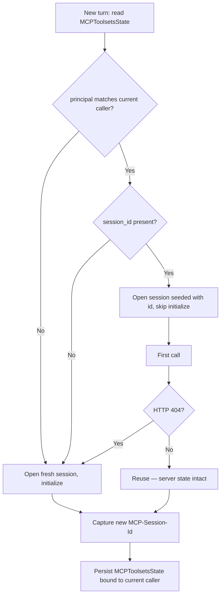

# Design: Persist MCP Sessions Across Conversation Turns

- **Status:** Draft
- **Approved:** N/A
- **Last updated:** 2026-06-30
- **Dependencies:**
  - **Depends on** [`mcp_within_request_session_reuse.md`](mcp_within_request_session_reuse.md) — the
    request-scoped `_MCPSessionManager`, its owner-task lifecycle, and the stable `_toolset_key` introduced
    there are prerequisites for capturing, re-attaching, and recovering a session id.
  - Interacts with, but does not depend on, [`interactive_login.md`](interactive_login.md).

> **Implementation status.** This is the **remaining work** (Phase 2, a.k.a. "Phase B"), building on the
> landed within-request layer (PR #390). It specifies: session-id capture (an earlier simplify pass removed the
> groundwork as dead code; this design re-introduces it where it is actually used), cross-turn persistence, the
> principal binding, the per-key eviction that powers 404 recovery, and the `terminate_on_close` policy.
> *Summary of Changes* lists each artifact.

## Problem Statement

QuickApps now reuses one initialized MCP session per toolset *within* a request
([`mcp_within_request_session_reuse.md`](mcp_within_request_session_reuse.md)). But that session is torn down
at request end, and the session id the server returned is discarded (the third element of
`streamable_http_client()` is bound to `_`).

The MCP specification lets a server assign a **session id** at initialization (the `MCP-Session-Id` response
header); once it does, the client **MUST** include that id on all subsequent requests, and the server uses the
session to hold per-session state — including across the turn boundary.

Because the id is discarded at request end, a stateful server's per-session state — a working set established
by one turn and read by the next, an authenticated handshake, a server-side cursor — survives *within* a turn
but is **lost between turns**: turn N+1 re-negotiates a brand-new session and starts from empty. Completing the
fix for [issue #389](https://github.com/epam/ai-dial-quickapps-backend/issues/389) for multi-turn stateful
workflows requires preserving the id across turns so the next turn can rejoin the same server-side session.

## Design Goals

- **G1 — Cross-turn continuity (best-effort, single-replica).** When a server assigns a session id, persist it
  in the response state so a follow-up turn can rejoin the same server-side session instead of negotiating a
  new one — verifiable as: against a single-replica stateful server, server-side state set in turn N is
  observable in turn N+1 without a fresh `initialize`. Multi-replica servers without shared session storage
  degrade to G2 (see *Out of Scope*).
- **G2 — Spec-compliant recovery.** On `HTTP 404` (session expired or terminated server-side) the client
  starts a fresh session, exactly as the spec mandates — transparently to the orchestrator and the user.
- **G3 — Per-principal isolation and secure handling.** The persisted id round-trips through the client, so
  treat it as a credential-grade value per the spec's session-hijacking guidance, and **bind it to the
  principal that created it** so a session can never be re-attached for a different user — even if the
  conversation state reaches one (e.g. via sharing).
- **G4 — No regression.** Existing apps and stored conversation states (which carry no `mcp_state` key) behave
  exactly as today; the feature is opt-in per toolset, default off, and never affects stateless servers or
  within-request behavior.

---

## Use Cases

### UC-1: Continuity across turns

**Trigger:** The agent uses a stateful toolset in turn 1, then the user sends a follow-up in turn 2.
**Behavior:** The session id captured in turn 1 was saved to the conversation state. In turn 2 QuickApps
re-attaches to the same server session id and resumes without re-initializing.
**Outcome:** Server-side state established in turn 1 is still available in turn 2.

### UC-2: Session expired between turns

**Trigger:** Same as UC-1, but the server expired the session (TTL) or it lives on a different replica.
**Behavior:** The first call with the stale id returns `HTTP 404`; QuickApps starts a new session
(fresh `initialize`), persists the new id, and retries the call once.
**Outcome:** The call succeeds against a fresh session. The user sees no error.

### UC-3: Stateless server (no session id)

**Trigger:** A server that never sets `MCP-Session-Id`.
**Behavior:** Within-request reuse still holds one connection open, but no id is captured or persisted; nothing
is written to the conversation state.
**Outcome:** No cross-turn state; behavior unchanged from today.

### UC-4: SSE (legacy) toolset

**Trigger:** A toolset configured for the deprecated SSE transport.
**Behavior:** Cross-turn id persistence does **not** apply (SSE predates streamable-HTTP session management);
within-request reuse still holds the session for the turn.
**Outcome:** No cross-turn continuity, documented as a known limitation.

### UC-5: Conversation reaches a different user

**Trigger:** A conversation that persisted an MCP session id in turn 1 is continued by a *different* principal
(e.g. a shared or forwarded conversation).
**Behavior:** The persisted state is bound to the original principal; the new caller's principal does not
match, so QuickApps ignores the persisted id and opens a fresh session under the new caller.
**Outcome:** No cross-user session reuse — the second user never rejoins the first user's server-side session.

---

## Proposed Design

This layer builds directly on the within-request session layer
([`mcp_within_request_session_reuse.md`](mcp_within_request_session_reuse.md)): that layer already opens one
live `ClientSession` per toolset inside an owner task and derives a stable `_toolset_key`. Cross-turn
persistence (a) re-exposes the server-assigned session id that layer captures, (b) persists it per toolset in
DIAL conversation state, and (c) on a new turn re-attaches to it — recovering spec-compliantly on `HTTP 404`.
Everything persisted is **bound to the principal that created it**, so a session can never be re-attached for a
different user (see *Securing the persisted session id*). The feature is gated per toolset (see
*Configuration / gating*).

### Capturing and persisting the session id

**What:** Capture the server-assigned `MCP-Session-Id` (via the SDK's `get_session_id` callback that is
currently discarded) and persist it, per toolset, in the DIAL conversation state under a new state key.

**Owner:** `mcp_tooling/` (a small session-state helper) + the existing `StateHolder` / orchestrator state
plumbing.

**Semantics — mirrors the proven Python-interpreter precedent.** `internal_tooling/py_interpreter_tooling`
already persists a session identifier across turns: `SessionManager.get_session_id()` reads `StateHolder`
first (within-request fast path) and otherwise scans assistant `custom_content.state` (across-request), and
`_persist_state()` writes back via `StateHolder.add_state(...)`. The orchestrator flushes `StateHolder` into
the response via `choice.set_state(...)` in `_persisting_state()`. MCP persistence follows the same read/write
plumbing, with two differences: an app can have **several** MCP toolsets, and the per-toolset value is a
**structured, extensible model** rather than a bare id (see *Persisted state model* below).

| Aspect | Python interpreter (existing) | MCP toolsets (this design) |
|--------|-------------------------------|----------------------------|
| State key | `py_interpreter_state` | `mcp_state` |
| Shape | single `session_id` | `MCPToolsetsState` — per-toolset `MCPToolsetState` keyed by toolset key |
| Read path | `StateHolder` → message-history scan | identical |
| Write path | `StateHolder.add_state` → `choice.set_state` | identical |
| Validate / recreate | `check_session_opened` → reopen | first call returns 404 → fresh `initialize` |

### Persisted state model

The persisted value is a model, not a raw `{key: id}` dict, so future per-toolset state (resumption tokens,
negotiated protocol version, cached server capabilities, last-used timestamps) can be added later. Two nested
models:

```python
class MCPToolsetState(BaseModel):
    """Per-toolset persisted state, stored under a stable toolset key. Extend here."""
    session_id: str | None = None
    # reserved for future fields: protocol_version, resumption_token,
    # server_capabilities, last_used_at, ...
    model_config = ConfigDict(extra="ignore")   # tolerate fields written by newer builds

class MCPToolsetsState(BaseModel):
    """Container persisted under MCP_STATE_KEY; per-toolset state keyed by toolset key."""
    principal_fingerprint: str | None = None   # binds the whole blob to its creating principal (see "Securing the persisted session id")
    toolsets: dict[str, MCPToolsetState] = Field(default_factory=dict)
    model_config = ConfigDict(extra="ignore")
```

**Read / write contract:**

- **Write:** sets `principal_fingerprint` to the current caller's fingerprint, then
  `MCPToolsetsState.model_dump(exclude_none=True)` (mirroring the interpreter precedent), so unset reserved
  fields are *not* serialized — the client-visible state stays minimal rather than a wall of `null`s.
- **Read:** `MCPToolsetsState.model_validate(raw)`; on `ValidationError` the whole MCP state is treated as
  empty (fresh sessions), so a corrupt blob does not break the request.
- **Principal gate (read):** before any persisted id is used, `principal_fingerprint` must equal the current
  caller's fingerprint; otherwise the whole MCP state is treated as empty (fresh sessions). See
  *Securing the persisted session id*.
- **Unknown fields** written by a newer build are dropped (`extra="ignore"`); an older reader degrades to the
  subset of fields it understands. This covers *additive* evolution — the only kind in scope.
- The container being a model (not a bare dict) also leaves room for **cross-toolset** metadata later
  (e.g. a global eviction policy).

A schema-`version` field for non-additive (re-keying / semantic) migrations is **out of scope** — until such
a change is actually needed, an incompatible blob is handled by the read path above (`ValidationError` →
empty state → fresh sessions), and a `version` field can be introduced at that point.

### Toolset key (stability)

`MCPToolsetsState.toolsets` is keyed by the **stable toolset key** introduced by the within-request layer
(`_toolset_key`), and choosing it well is the genuinely hard part of cross-turn continuity — the key is what
links turn N+1's toolset back to turn N's `MCPToolsetState`.

- For `DialMCPToolSet` the natural key is `deployment_id` (stable, canonical). DIAL-routed toolsets are
  deferred (see *Out of Scope*) pending the passthrough question, but `deployment_id` is the intended key.
- For directly-addressed `MCPToolSet` the only stable identifiers are `name` and `mcp_server_info.url`. The
  key uses **`name`** (apps address toolsets by name; the URL may carry volatile query params); this is the
  landed `_toolset_key` (`mcp:{name}`).
- **Collision / rename:** if a toolset is renamed between turns, the old key's entry is simply never matched
  and the new key has no entry → a fresh session is opened (no error). A stale or mismatched entry likewise
  self-heals via the 404 path (UC-2). The key never needs to be globally unique, only stable per app.

### Re-attaching to a persisted session

**What:** On a new turn, read the persisted `MCPToolsetsState`, **verify it belongs to the current caller**
(the principal gate above), then for each toolset seed the transport with its `session_id` and skip the
`initialize` handshake so requests rejoin the existing server session. A principal mismatch is treated exactly
like "no persisted id" — a fresh session is opened.

**SDK constraint (named risk).** In the installed `mcp` 1.28.1, `StreamableHTTPTransport.__init__` exposes
**no constructor parameter for a pre-existing session id** (it sets `self.session_id = None`; its other
parameters — `headers`/`timeout`/`sse_read_timeout`/`auth` — are now `@deprecated` and ignored at runtime, so
the only construction path is `__init__(url)`), and the transport does not auto-reinitialize on 404.
Re-attaching therefore requires a thin wrapper around the SDK transport that (a) pre-sets the session id
(by assigning `transport.session_id` after construction) and (b) bypasses the initialize handshake. This
wrapper is the only place the design reaches below the public SDK surface, and is the main implementation
risk. `pyproject.toml` declares a **range** (`mcp>=1.28.1,<2.0.0`), not a pin, so the wrapper must be guarded
by a version-asserting test that fails loudly if a future in-range SDK changes these internals (see Open
Questions #1).

**Recovery (spec-mandated).** The spec requires: *"When a client receives HTTP 404 in response to a request
containing an `MCP-Session-Id`, it MUST start a new session by sending a new InitializeRequest without a
session id attached."* The re-attach path catches 404, drops the stale id, opens a fresh session, persists the
new id, and retries the call once.

**Coordinating recovery with the within-request session manager.** Both the seeded re-attach and the 404
fallback go through `_MCPSessionManager.get_session` (the session manager introduced by the within-request layer), so
each session is opened and closed inside a single owner task. On a 404 the toolset client **invalidates the
session manager's cached handle for that `toolset_key`** (signalling its owner task to shut down and exit the context)
and re-enters through `get_session`, which spawns a fresh owner task for the replacement session — keeping
enter/exit co-located per the anyio constraint. Per-key eviction **awaits the evicted owner task's exit before
spawning the replacement** (so a concurrent borrower of the same key cannot observe a half-torn-down handle)
and leaves other keys' handles untouched — distinct from the request-end `aclose_all`, which tears down every
key at once. This adds a small per-key eviction method to the `_MCPSessionManager` (an addition to the landed
within-request interface).



**Termination policy.** The SDK's `streamable_http_client` exposes a `terminate_on_close` flag controlling
whether it sends an HTTP `DELETE` to end the server session on close; its default is `True`. Non-persisted
toolsets therefore keep the default (close **with** `DELETE`, honoring the spec's "clients that no longer need
a session SHOULD send DELETE"); only the **persisted** case overrides it to `False`, so the server keeps the
session for the next turn. The implementer overrides exactly one direction — persisted → `False`.

### Securing the persisted session id

Per the 2025-11-25 spec the client **MUST** handle the session id securely (session-hijacking mitigation).
DIAL conversation state is replayed to and stored by the client, so persisting the id exposes it beyond the
QuickApps process — including to whoever a conversation is later shared with. Two distinct risks follow, and
they need different answers.

**1. Cross-user reuse (the primary control): bind the id to its principal.** Without a binding, a conversation
that carried a session id into its state could be continued by a *different* user (sharing, forwarding), and
QuickApps would replay the first user's session id on the second user's behalf. The toolset's own upstream
authorization does **not** prevent this on its own: a static Api-Key / OAuth-client-credentials toolset
presents the *same* app-level credential for every user, so the upstream cannot tell the two users apart.

The control is therefore app-side. QuickApps resolves a **stable principal** for the caller from DIAL Core's
`GET /v1/user/info` (the `aidial-client` `user` resource `client.user.info()`): the per-user `sub` claim when a
user token is present, falling back to the key's `project` otherwise — i.e. the binding is exactly as
fine-grained as the
identity DIAL itself can see. A **keyed HMAC fingerprint** of that principal (never the
raw principal, so the stored value cannot be reversed or correlated across apps) is persisted alongside the
session ids. On a new turn the fingerprint is recomputed from the *current* caller and must match before any
persisted id is used; a mismatch — or no resolvable principal, or a `user/info` failure — discards the
persisted state and opens fresh sessions. The check input (the live caller's identity) is supplied by DIAL on
each request and is **not** part of the shareable state blob, so a shared conversation cannot forge a match.

**Project-only binding (accepted trade-off).** When no user token is present and the principal resolves only
to a `project` (e.g. a shared project key), all users of that project share one fingerprint, so a persisted
session can be reused among them. This is **accepted by design**: those callers share a single DIAL identity
and security domain, and DIAL itself cannot tell them apart — the binding is per-user wherever DIAL exposes a
user, and per-project otherwise (see Open Questions #3).

**2. Out-of-band replay (credential-grade handling): a residual only for no-auth servers.** Even with the
principal gate — which governs only what *QuickApps* will do — the raw id sits in client-visible state, so it
can in principle be read out of a stored/shared conversation and replayed *directly* to the server, bypassing
the app entirely. Whether that resolves to a real hijack depends on the upstream's auth, which splits the
toolset landscape into a mainstream that is safe and one outlier that is not:

- **Mainstream — authenticated toolsets and DIAL MCP toolsets:** the server also demands a credential
  (static Api-Key / bearer / OAuth, or — for `DialMCPToolSet` — DIAL's per-user auth plus any additional
  server auth), and that credential lives in the QuickApp's **server-side** config or is the caller's own
  DIAL token — it is **never written into conversation state**. A leaked id alone is therefore insufficient;
  the upstream credential is a genuine second factor. (This is the kernel of truth in the old "not a
  stand-alone credential" claim — but it holds *only* for these modes.)
- **Outlier — no-auth servers:** a server that requires no credential is driven by the session id alone, so
  the persisted id *is* a stand-alone credential for it. The principal gate still blocks the app-mediated
  cross-user path, but it cannot stop a direct out-of-band replay, and there is no server-side second factor
  to fall back on. This residual is **documented and accepted**: exploiting it needs both a genuinely no-auth
  server *and* a leak of the conversation state, and a no-auth server holding sensitive per-session state is
  already an unusual posture. (A future hardening — encrypting the id under a principal-derived, app-secret
  key so the raw id never enters state — would close even this; deferred, see Open Questions #5.)

**Other handling.** Cross-turn persistence stays **opt-in per toolset** (default off), so apps consciously
accept the exposure trade-off; the id and the principal fingerprint are stored under a dedicated state key,
never logged above `DEBUG` (consistent with existing `StateHolder` logging), and only persisted for
streamable-HTTP toolsets.

### Configuration / gating

Cross-turn persistence is **opt-in**, via a new per-toolset field (e.g.
`MCPToolSet.preserve_session: bool = False`). Off by default given the server-affinity and security
trade-offs. (Within-request reuse, by contrast, is unconditional and has no flag — see
[`mcp_within_request_session_reuse.md`](mcp_within_request_session_reuse.md).)

---

## Secondary Fixes

None — this design has no incidental follow-on changes beyond the cross-turn layer above.

---

## Out of Scope

- **Resumability / redelivery (`Last-Event-ID`).** Replaying dropped SSE events mid-stream is a distinct
  mechanism (per-stream event-id cursor) from session reuse. The SDK supports it via `resumption_token`; this
  design does not use it. Deferred — it addresses connection drops within a single long response, not session
  continuity.
- **Guaranteed cross-turn continuity under load balancing.** If the upstream MCP server is replicated without
  shared session storage, a follow-up turn may land on a replica that never saw the session → 404 → fresh
  session. The design degrades gracefully (UC-2) but cannot guarantee continuity the server itself doesn't
  preserve.
- **DIAL Core session-id passthrough for `DialMCPToolSet`.** DIAL-routed toolsets reach the upstream through
  `/v1/toolset/{id}/mcp`. Whether DIAL Core forwards `MCP-Session-Id` end-to-end is an upstream dependency to
  confirm; until then, cross-turn persistence targets directly-addressed `MCPToolSet`s. (`DialMCPToolSet` is
  still wired for the field, accepting it may no-op until Core forwards the header — see Open Questions #2.)
- **Cross-turn persistence for SSE toolsets** (UC-4).

---

## Configuration / Usage Examples

```yaml
# Stateful streamable-HTTP toolset that should survive across turns
tool_sets:
  - type: mcp
    name: stateful_workspace
    preserve_session: true          # cross-turn opt-in (default false)
    mcp_server_info:
      url: https://example.com/mcp
      protocol: streamable_http
```

| Variable / field | Scope | Default | Effect |
|------------------|-------|---------|--------|
| `preserve_session` | per toolset | `false` | Enables cross-turn session-id persistence (streamable-HTTP only) |

(Within-request reuse has no configuration — it is always on; see
[`mcp_within_request_session_reuse.md`](mcp_within_request_session_reuse.md).)

---

## Migration

### Non-breaking changes

- This layer is additive and opt-in; existing apps and stored conversation states (which carry no
  `mcp_state` key) behave exactly as today. An unknown/stale persisted id self-heals via the 404 path, and a
  blob whose principal fingerprint is absent or does not match the caller is ignored (fresh session).

### Breaking changes

None anticipated. The new per-toolset `preserve_session` field is optional with a safe default; the new state
key is namespaced and ignored by older readers.

---

## Open Questions / Risks

1. **SDK wrapper for re-attach.** Seeding a session id and skipping `initialize` reaches below the public SDK
   surface. Since `pyproject.toml` allows the whole `>=1.28.1,<2.0.0` range, guard the wrapper with
   a version-asserting test that fails loudly if an in-range SDK changes `StreamableHTTPTransport`'s
   session-id internals — rather than relying on a pin the dependency spec does not enforce.
2. **DIAL Core passthrough** of `MCP-Session-Id` for `DialMCPToolSet` (see *Out of Scope*) — confirm before
   enabling cross-turn persistence for DIAL-routed toolsets.
3. **Principal resolution granularity.** Confirm that in the flows where `preserve_session` is enabled the
   per-request credential resolves to an end-user `sub` (per-user binding) rather than only a `project`
   (per-project binding). If only a project is available, sessions are isolated per project, not per user.
4. **Optional Core enhancement.** `/v1/user/info` returns `userClaims` (with `sub` only if the IdP emits it),
   not a canonical id; DIAL Core already computes `userId`/`userHash` internally. Exposing one as a top-level
   field would *replace* the `sub`/`project` derivation under *Securing the persisted session id* (not add a
   second, independent mechanism) and remove the IdP-dependent claim parsing — a small, optional upstream
   change.
5. **Future hardening for no-auth servers.** Encrypting the persisted id under a principal-derived, app-secret
   key (rather than storing the raw id plus a fingerprint) would also close the no-auth out-of-band residual;
   deferred pending a process-stable app secret.

---

## Summary of Changes

| Component | Status | Change |
|-----------|--------|--------|
| `mcp_tooling/_mcp_toolset_client.py` | New | Capture `get_session_id`; on 404 → evict handle + fresh session + retry once; `terminate_on_close` policy (persisted → `False`) |
| `mcp_tooling/_mcp_session_manager.py` (eviction) | New | Add per-`toolset_key` handle eviction so 404 recovery re-enters via `get_session` in a fresh owner task |
| `mcp_tooling/_mcp_state.py` | New | `MCPToolsetsState` / `MCPToolsetState` models; `MCPToolsetsState` carries a `principal_fingerprint` binding the blob to its creating principal |
| `mcp_tooling/` (session-state helper) | New | Read/persist `MCPToolsetsState` via `StateHolder`/message history (mirroring `py_interpreter` `SessionManager`); resolve the caller principal via the `aidial-client` `user` resource and enforce the principal gate on read |
| `core/agent/models.py` | New | Add `MCP_STATE_KEY = "mcp_state"` |
| `config/toolsets/mcp.py` | New | Add optional `preserve_session: bool = False` to `MCPToolSet` (propagated to `DialMCPToolSet`) |
| `CONFIGURATION.md` | New | Document `preserve_session` |
| `docs/agent.md` | New | Add cross-turn persistence, recovery, and security to the MCP section |
| App schema | New | Regenerate via `make dump_app_schema` (new config field) |
