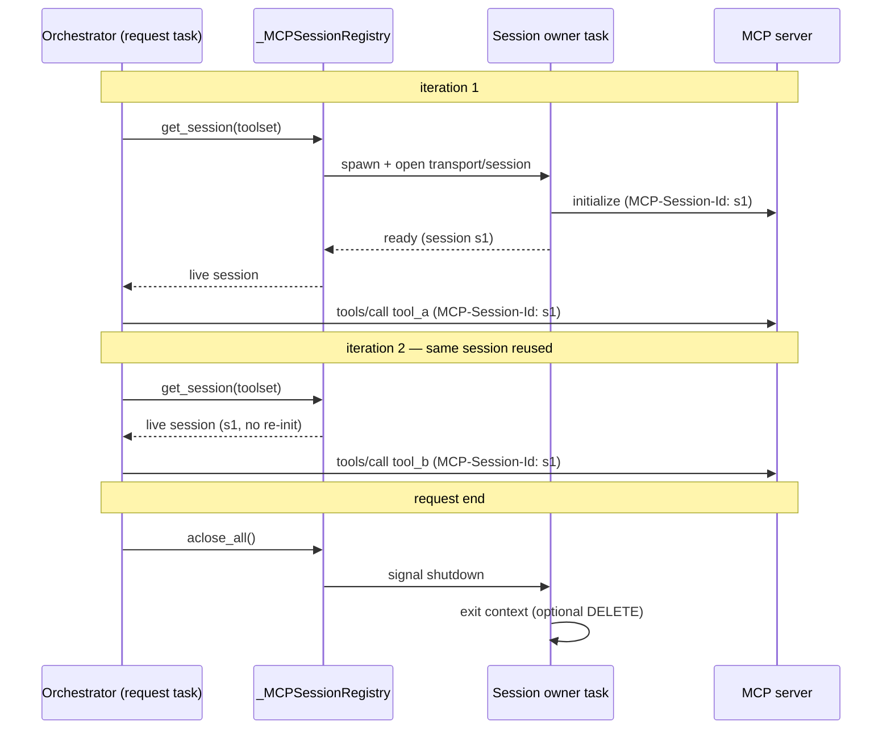
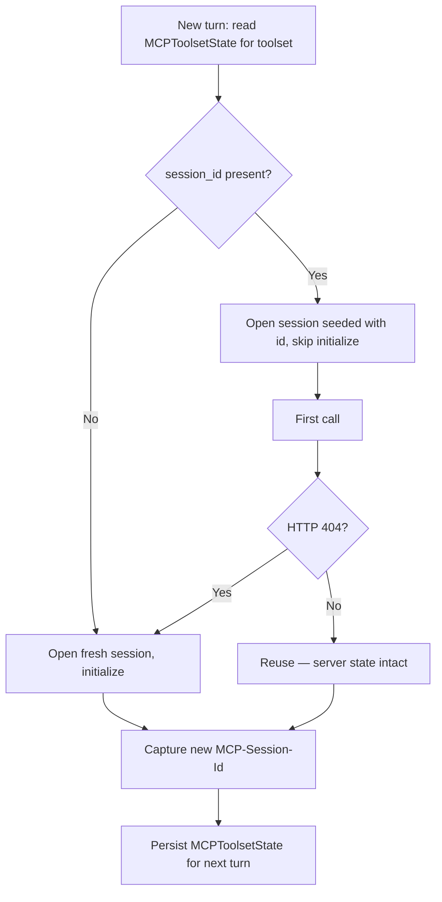

# Design: Preserve MCP Sessions Across Tool Calls and Conversation Turns

- **Status:** Approved
- **Approved:** 2026-06-29
- **Dependencies:**
  - None (interacts with, but does not depend on, [`interactive_login.md`](interactive_login.md))

## Problem Statement

QuickApps treats every MCP interaction as a brand-new connection. `_MCPConnectionManager.__session_context()`
opens a transport (SSE or streamable HTTP), creates a `ClientSession`, calls `initialize()`, runs a single
operation, and tears the whole thing down — on **every** call. Both `get_tools_list()` (during toolset
initialization) and `call_mcp_tool()` (during the orchestrator loop) open their own short-lived session, and
the session id the server returns is discarded (the third element of `streamablehttp_client()` is bound to `_`).

The MCP specification defines a **session** as "logically related interactions between a client and a server,
beginning with the initialization phase." A server **MAY** assign a session id at initialization (the
`MCP-Session-Id` response header) and, once it does, the client **MUST** include that id on all subsequent
requests. Servers use the session to hold per-session state across calls.

Because QuickApps never reuses a session — not across orchestrator iterations, not even across two tool calls
within a single iteration — **stateful MCP servers do not work**. Any server that relies on session-scoped
state (a working set established by one tool call and read by the next, an authenticated handshake, a
server-side cursor) loses it the instant the call returns, and the streamable-HTTP session id is re-negotiated
every time. This was the root cause of the MCP server we found failing during investigation
([issue #389](https://github.com/epam/ai-dial-quickapps-backend/issues/389)).

## Design Goals

- **G1 — Within-request continuity.** All MCP calls to the same toolset within a single chat-completion
  request share one initialized session: opened once, reused across orchestrator iterations and across
  concurrent tool calls in the same iteration, torn down cleanly at request end.
- **G2 — Cross-turn continuity (best-effort).** When a server assigns a session id, persist it in the
  response state so a follow-up turn can rejoin the same server-side session instead of negotiating a new one.
  *Verifiable as:* against a single-replica stateful server, server-side state set in turn N is observable in
  turn N+1 without a fresh `initialize`. (Multi-replica servers without shared session storage degrade to G3.)
- **G3 — Spec-compliant recovery.** On `HTTP 404` (session expired or terminated server-side) the client
  starts a fresh session, exactly as the spec mandates — transparently to the orchestrator and the user.
- **G4 — Secure handling of the session id.** The persisted id round-trips through the client; treat it as a
  credential-grade value per the spec's session-hijacking guidance.
- **G5 — No regression for stateless servers.** Servers that assign no session id, and existing flows
  (interactive login, fallback strategies, attachment upload), behave exactly as today.

---

## Use Cases

### UC-1: Stateful server, multiple calls in one turn

**Trigger:** An app wires a stateful MCP toolset. In one user turn the agent calls `tool_a` (which sets up
server-side state) and then `tool_b` (which depends on it).
**Behavior:** Both calls run over the same initialized session; the server sees one continuous session id.
**Outcome:** `tool_b` succeeds. Today it fails or sees an empty server state.

### UC-2: Continuity across turns

**Trigger:** The agent uses a stateful toolset in turn 1, then the user sends a follow-up in turn 2.
**Behavior:** The session id captured in turn 1 was saved to the conversation state. In turn 2 QuickApps
re-attaches to the same server session id and resumes without re-initializing.
**Outcome:** Server-side state established in turn 1 is still available in turn 2.

### UC-3: Session expired between turns

**Trigger:** Same as UC-2, but the server expired the session (TTL) or it lives on a different replica.
**Behavior:** The first call with the stale id returns `HTTP 404`; QuickApps starts a new session
(fresh `initialize`), persists the new id, and retries the call once.
**Outcome:** The call succeeds against a fresh session. The user sees no error.

### UC-4: Stateless server (no session id)

**Trigger:** A server that never sets `MCP-Session-Id`.
**Behavior:** Within-request reuse still holds one connection open for efficiency, but no id is captured or
persisted; teardown closes the connection.
**Outcome:** Identical observable behavior to today, fewer connections opened.

### UC-5: SSE (legacy) toolset

**Trigger:** A toolset configured for the deprecated SSE transport.
**Behavior:** Within-request reuse applies; cross-turn id persistence does **not** (SSE predates streamable-HTTP
session management).
**Outcome:** Efficiency win within a turn; no cross-turn continuity, documented as a known limitation.

---

## Proposed Design

The design has two orthogonal layers. **Layer 1 (within-request reuse)** is the core fix and is
self-contained. **Layer 2 (cross-turn persistence)** builds on Layer 1's captured session id and is opt-in.

### Layer 1 — A request-scoped live session per toolset

**What:** A new request-scoped `_MCPSessionRegistry` owns one live, initialized `ClientSession` per toolset
for the duration of the request. `_MCPConnectionManager` stops opening a fresh `__session_context()` per call
and instead borrows the shared session from the registry.

**Owner:** `mcp_tooling/` — new `_MCPSessionRegistry`; modified `_MCPConnectionManager`; the orchestrator
provides the teardown seam.

**Wiring (reconciling existing scopes).** Today `_MCPConnectionManager` is bound `request_scope` but is in
practice built **per toolset** via `AssistedBuilder` in `_MCPToolInitializer`, and that one instance is shared
by every `_MCPTool` of the toolset. The registry, by contrast, is a single **request-scoped singleton** keyed
by a **stable toolset key** (see Layer 2 — the same key is used for both reuse and persistence). Each
per-toolset `_MCPConnectionManager` receives the registry by injection and calls `registry.get_session(key)`;
the registry owns the lifecycle, the connection manager just borrows.

**Semantics:**

- The session is opened **lazily** on first use within the request and reused for every subsequent
  `call_mcp_tool()` to that toolset.
- It is torn down once, at request end.

**The anyio task constraint (central decision).** A `ClientSession` and its transport are anyio context
managers backed by an internal task group; anyio requires a cancel scope to be *exited in the same task that
entered it*. The orchestrator runs its loop in one task, but tool calls within an iteration execute in
**concurrent child tasks**. If a session were entered lazily inside a child tool task, exiting it later from
the orchestrator task would raise a cross-task cancel-scope error. The registry therefore opens each session
inside a dedicated **owner task** that enters the context, signals readiness, parks until a shutdown event,
and exits the context itself. Callers (including concurrent ones) borrow the live `ClientSession` and issue
`call_tool` against it — safe, because the SDK multiplexes concurrent requests over the streams by request id.
This co-locates enter/exit in a single task regardless of which task first triggers the open.



**Teardown seam.** The orchestrator's `_persisting_state()` context manager already brackets the whole
request and runs cleanup in its `finally` block (it flushes the deferred stage-close registry and writes
state). Registry teardown hooks in here, so sessions are guaranteed to close on both success and error paths.

**Initialization vs. the loop.** Toolset initialization (`_MCPToolInitializer`, which lists tools) runs in
its own `asyncio.gather` tasks *before* the orchestrator loop. Its tool-listing session is **not** carried
forward (it lives in a different task and finishes during init). The persistent session is the one opened by
the registry within the request/owner-task context. Tool *listing* keeps its current short-lived session.

### Layer 2 — Cross-turn session-id persistence (opt-in)

Builds on Layer 1's captured session id; gated per toolset (see *Configuration / gating*).

#### Capturing and persisting the session id

**What:** Capture the server-assigned `MCP-Session-Id` (via the SDK's `get_session_id` callback that is
currently discarded) and persist it, per toolset, in the DIAL conversation state under a new state key.

**Owner:** `mcp_tooling/` (a small session-state helper) + the existing `StateHolder` / orchestrator state
plumbing.

**Semantics — mirrors the proven Python-interpreter precedent.** `internal_tooling/py_interpreter_tooling`
already persists a session identifier across turns: `SessionManager.get_session_id()` reads `StateHolder`
first (within-request fast path) and otherwise scans assistant `custom_content.state` (across-request), and
`_persist_state()` writes back via `StateHolder.add_state(...)`. The orchestrator flushes `StateHolder` into
the response via `choice.set_state(...)` in `_persisting_state()`. MCP persistence follows the same read/write
plumbing, with two differences: an app can have **several** MCP toolsets, and the per-toolset value is a
**structured, extensible model** rather than a bare id (see *Persisted state model* below).

| Aspect | Python interpreter (existing) | MCP toolsets (this design) |
|--------|-------------------------------|----------------------------|
| State key | `py_interpreter_state` | `mcp_state` |
| Shape | single `session_id` | `MCPToolsetsState` — per-toolset `MCPToolsetState` keyed by toolset key |
| Read path | `StateHolder` → message-history scan | identical |
| Write path | `StateHolder.add_state` → `choice.set_state` | identical |
| Validate / recreate | `check_session_opened` → reopen | first call returns 404 → fresh `initialize` |

#### Persisted state model

The persisted value is a model, not a raw `{key: id}` dict, so future per-toolset state (resumption tokens,
negotiated protocol version, cached server capabilities, last-used timestamps) can be added later. Two nested
models:

```python
class MCPToolsetState(BaseModel):
    """Per-toolset persisted state, stored under a stable toolset key. Extend here."""
    session_id: str | None = None
    # reserved for future fields: protocol_version, resumption_token,
    # server_capabilities, last_used_at, ...
    model_config = ConfigDict(extra="ignore")   # tolerate fields written by newer builds

class MCPToolsetsState(BaseModel):
    """Container persisted under MCP_STATE_KEY; per-toolset state keyed by toolset key."""
    toolsets: dict[str, MCPToolsetState] = Field(default_factory=dict)
    model_config = ConfigDict(extra="ignore")
```

**Read / write contract:**

- **Write:** `MCPToolsetsState.model_dump(exclude_none=True)` (mirroring the interpreter precedent), so unset
  reserved fields are *not* serialized — the client-visible state stays minimal rather than a wall of `null`s.
- **Read:** `MCPToolsetsState.model_validate(raw)`; on `ValidationError` the whole MCP state is treated as
  empty (fresh sessions), so a corrupt blob does not break the request.
- **Unknown fields** written by a newer build are dropped (`extra="ignore"`); an older reader degrades to the
  subset of fields it understands. This covers *additive* evolution — the only kind in scope.
- The container being a model (not a bare dict) also leaves room for **cross-toolset** metadata later
  (e.g. a global eviction policy).

A schema-`version` field for non-additive (re-keying / semantic) migrations is **out of scope** — until such
a change is actually needed, an incompatible blob is handled by the read path above (`ValidationError` →
empty state → fresh sessions), and a `version` field can be introduced at that point.

#### Toolset key (stability)

`MCPToolsetsState.toolsets` is keyed by a **stable toolset key**, and choosing it well is the genuinely hard
part of cross-turn continuity — the key is what links turn N+1's toolset back to turn N's `MCPToolsetState`.

- For `DialMCPToolSet` the natural key is `deployment_id` (stable, canonical). DIAL-routed toolsets are
  deferred (see *Out of Scope*) pending the passthrough question, but `deployment_id` is the intended key.
- For directly-addressed `MCPToolSet` the only stable identifiers are `name` and `mcp_server_info.url`. The
  design uses **`name`** (apps address toolsets by name; the URL may carry volatile query params).
- **Collision / rename:** if a toolset is renamed between turns, the old key's entry is simply never matched
  and the new key has no entry → a fresh session is opened (no error). A stale or mismatched entry likewise
  self-heals via the 404 path (UC-3). The key never needs to be globally unique, only stable per app.

#### Re-attaching to a persisted session

**What:** On a new turn, read the toolset's `MCPToolsetState`, seed the transport with its `session_id`, and
skip the `initialize` handshake, so requests rejoin the existing server session.

**SDK constraint (named risk).** In the installed `mcp` 1.27.0, `StreamableHTTPTransport.__init__` takes only
`url` and sets `self.session_id = None`; there is **no public parameter to seed a pre-existing session id**,
and the transport does not auto-reinitialize on 404. Re-attaching therefore requires a thin wrapper around the
SDK transport that (a) pre-sets the session id and (b) bypasses the initialize handshake. This wrapper is the
only place the design reaches below the public SDK surface, and is the main implementation risk. `pyproject.toml`
declares a **range** (`mcp>=1.23.2,<2.0.0`), not a pin, so the wrapper must be guarded by a version-asserting
test that fails loudly if a future in-range SDK changes these internals (see Open Questions #1).

**Recovery (spec-mandated).** The spec requires: *"When a client receives HTTP 404 in response to a request
containing an `MCP-Session-Id`, it MUST start a new session by sending a new InitializeRequest without a
session id attached."* The re-attach path catches 404, drops the stale id, opens a fresh session, persists the
new id, and retries the call once.



**Termination policy.** The SDK's `streamablehttp_client` exposes a `terminate_on_close` flag controlling
whether it sends an HTTP `DELETE` to end the server session on close; its default is `True`. Non-persisted
toolsets therefore keep the default (close **with** `DELETE`, honoring the spec's "clients that no longer need
a session SHOULD send DELETE"); only the **persisted** case overrides it to `False`, so the server keeps the
session for the next turn. The implementer overrides exactly one direction — persisted → `False`.

#### Securing the persisted session id

Per the 2025-11-25 spec the client **MUST** handle the session id securely (session-hijacking mitigation).
Because DIAL conversation state is replayed to and stored by the client, persisting the id exposes it beyond
the QuickApps process. Decisions:

- The session id is **not a stand-alone credential**: every upstream request still carries the toolset's own
  authorization (Api-Key / bearer / OAuth from `__build_headers()`), so a leaked id alone cannot drive the
  server.
- Cross-turn persistence is **opt-in per toolset** (default off), so apps must consciously accept the
  exposure trade-off.
- The id is stored under a dedicated state key and never logged at `INFO`+ (only `DEBUG`, consistent with
  existing `StateHolder` logging), and only persisted for streamable-HTTP toolsets.

### Configuration / gating

- **Within-request reuse (Layer 1): on by default**, no per-toolset flag — it is strictly spec-aligned and
  benefits every toolset. A global env kill-switch (e.g. `MCP_SESSION_REUSE_ENABLED`, default `true`) allows
  emergency rollback.
- **Cross-turn persistence (Layer 2): opt-in**, via a new per-toolset field (e.g.
  `MCPToolSet.preserve_session: bool = False`). Off by default given the server-affinity and security
  trade-offs.

---

## Secondary Fixes

None — this design has no incidental follow-on changes beyond the two layers above.

---

## Out of Scope

- **Resumability / redelivery (`Last-Event-ID`).** Replaying dropped SSE events mid-stream is a distinct
  mechanism (per-stream event-id cursor) from session reuse. The SDK supports it via `resumption_token`; this
  design does not use it. Deferred — it addresses connection drops within a single long response, not session
  continuity.
- **Guaranteed cross-turn continuity under load balancing.** If the upstream MCP server is replicated without
  shared session storage, a follow-up turn may land on a replica that never saw the session → 404 → fresh
  session. The design degrades gracefully (UC-3) but cannot guarantee continuity the server itself doesn't
  preserve.
- **DIAL Core session-id passthrough for `DialMCPToolSet`.** DIAL-routed toolsets reach the upstream through
  `/v1/toolset/{id}/mcp`. Whether DIAL Core forwards `MCP-Session-Id` end-to-end is an upstream dependency to
  confirm; until then, cross-turn persistence targets directly-addressed `MCPToolSet`s. Within-request reuse
  still holds one transport open for the turn (avoiding per-call re-initialization), but whether DIAL Core
  preserves the *upstream* session across that held connection is the same open question (#2), just within one
  turn rather than across turns.
- **Cross-turn persistence for SSE toolsets** (UC-5).

---

## Configuration / Usage Examples

```yaml
# Stateful streamable-HTTP toolset that should survive across turns
tool_sets:
  - type: mcp
    name: stateful_workspace
    preserve_session: true          # Layer 2 opt-in (default false)
    mcp_server_info:
      url: https://example.com/mcp
      protocol: streamable_http
```

| Variable / field | Scope | Default | Effect |
|------------------|-------|---------|--------|
| `MCP_SESSION_REUSE_ENABLED` | env (admin) | `true` | Master switch for Layer 1 within-request reuse |
| `preserve_session` | per toolset | `false` | Enables Layer 2 cross-turn id persistence (streamable-HTTP only) |

---

## Migration

### Non-breaking changes

- **Layer 1** changes connection lifetime, not observable tool behavior; stateless servers are unaffected
  (UC-4). Shipped on by default with an env kill-switch.
- **Layer 2** is additive and opt-in; existing apps and stored conversation states (which carry no
  `mcp_state` key) behave exactly as today. An unknown/stale persisted id self-heals via the 404 path.

### Breaking changes

None anticipated. The new per-toolset `preserve_session` field is optional with a safe default; the new state
key is namespaced and ignored by older readers.

---

## Open Questions / Risks

1. **SDK wrapper for re-attach.** Seeding a session id and skipping `initialize` reaches below the public SDK
   surface (Layer 2). Since `pyproject.toml` allows the whole `>=1.23.2,<2.0.0` range, guard the wrapper with
   a version-asserting test that fails loudly if an in-range SDK changes `StreamableHTTPTransport`'s
   session-id internals — rather than relying on a pin the dependency spec does not enforce.
2. **DIAL Core passthrough** of `MCP-Session-Id` for `DialMCPToolSet` (see Out of Scope) — confirm before
   enabling Layer 2 for DIAL-routed toolsets.
3. **Owner-task lifecycle** must be robust to orchestrator cancellation/errors; teardown lives in
   `_persisting_state()`'s `finally` to cover both paths.

---

## Summary of Changes

| Component | Change |
|-----------|--------|
| `mcp_tooling/_mcp_session_registry.py` | **New** — request-scoped registry owning one live `ClientSession` per toolset via owner tasks; lazy open, reuse, `aclose_all()` teardown |
| `mcp_tooling/_mcp_connection_manager.py` | Borrow the shared session from the registry instead of opening `__session_context()` per call; capture `get_session_id`; 404 → fresh session + retry; `terminate_on_close` policy |
| `mcp_tooling/_mcp_state.py` | **New** — `MCPToolsetsState` / `MCPToolsetState` Pydantic models (extensible per-toolset state) |
| `mcp_tooling/` (session-state helper) | **New** — read/persist `MCPToolsetsState` via `StateHolder`/message history, mirroring `py_interpreter` `SessionManager` |
| `mcp_tooling/mcp_tooling_module.py` | Register `_MCPSessionRegistry` (request-scoped); wire teardown |
| `core/agent/orchestrator.py` | Invoke registry teardown from `_persisting_state()` `finally` |
| `core/agent/models.py` | Add `MCP_STATE_KEY = "mcp_state"` |
| `config/toolsets/mcp.py` | Add optional `preserve_session: bool = False` to `MCPToolSet` |
| `CONFIGURATION.md` | Document `MCP_SESSION_REUSE_ENABLED` and `preserve_session` |
| `docs/agent.md` | Document MCP session lifecycle: within-request reuse, cross-turn persistence, recovery, security |
| App schema | Regenerate via `make dump_app_schema` (new config field) |
