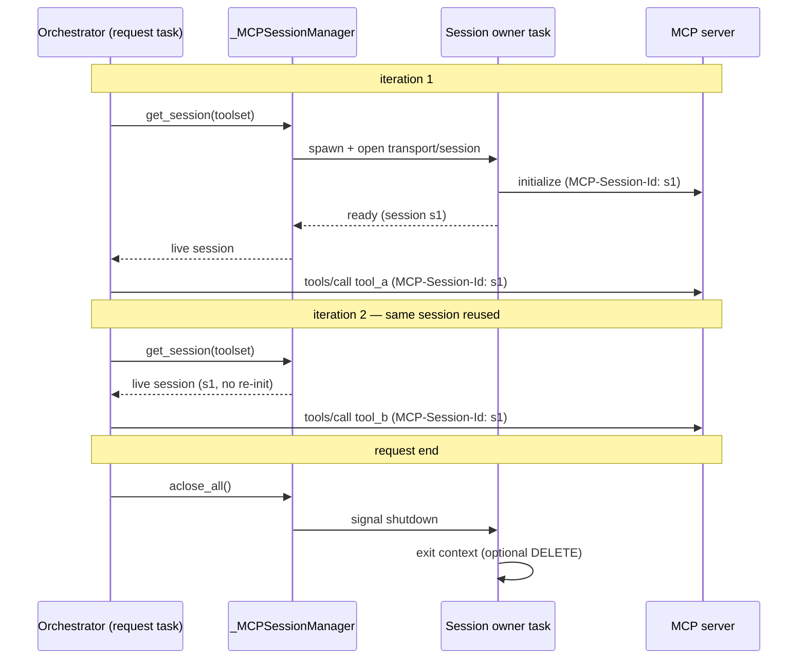

# Design: Reuse MCP Sessions Across Tool Calls Within a Request

- **Status:** Approved
- **Approved:** 2026-06-29
- **Last updated:** 2026-06-30
- **Dependencies:**
  - Interacts with, but does not depend on, [`interactive_login.md`](interactive_login.md).
  - Foundation for [`mcp_cross_turn_session_persistence.md`](mcp_cross_turn_session_persistence.md), which
    builds on the request-scoped session manager and the stable toolset key introduced here.

> **Implementation status.** This layer is **implemented** and lives on `feat/mcp-session-persistence`
> (commit `abaf16f`, PR #390): the `_MCPSessionManager` (owner-task model, `get_session`, `aclose_all`), the
> toolset-client borrow, the `_toolset_key` derivation, the DI binding, and the `RequestAsyncCloseRegistry`
> teardown seam all exist. *Summary of Changes* marks each landed artifact.

## Problem Statement

QuickApps treats every MCP interaction as a brand-new connection. `_MCPToolsetClient._open_session`
opens a transport (SSE or streamable HTTP), creates a `ClientSession`, calls `initialize()`, runs a single
operation, and tears the whole thing down — on **every** call. Both `get_tools_list()` (during toolset
initialization) and `call_mcp_tool()` (during the orchestrator loop) open their own short-lived session.

The MCP specification defines a **session** as "logically related interactions between a client and a server,
beginning with the initialization phase." Servers use the session to hold per-session state across calls.

Because QuickApps never reuses a session — not across orchestrator iterations, not even across two tool calls
within a single iteration — **stateful MCP servers do not work within a turn**. Any server that relies on
session-scoped state (a working set established by one tool call and read by the next, an authenticated
handshake, a server-side cursor) loses it the instant the call returns. This was the root cause of the MCP
server we found failing during investigation
([issue #389](https://github.com/epam/ai-dial-quickapps-backend/issues/389)).

> Preserving the session *across conversation turns* — so a follow-up turn rejoins the same server-side session
> instead of negotiating a new one — is a separate, opt-in concern covered by
> [`mcp_cross_turn_session_persistence.md`](mcp_cross_turn_session_persistence.md). This document covers only
> the within-request half: the always-on foundation that the cross-turn layer builds on.

## Design Goals

- **G1 — Within-request continuity.** All MCP calls to the same toolset within a single chat-completion
  request share one initialized session: opened once, reused across orchestrator iterations and across
  concurrent tool calls in the same iteration, torn down cleanly at request end.
- **G2 — No regression for stateless servers and existing flows.** Stateless servers see no behavioral
  change, and existing flows (interactive login, fallback strategies, attachment upload) keep working
  unchanged.

---

## Use Cases

### UC-1: Stateful server, multiple calls in one turn

**Trigger:** An app wires a stateful MCP toolset. In one user turn the agent calls `tool_a` (which sets up
server-side state) and then `tool_b` (which depends on it).
**Behavior:** Both calls run over the same initialized session; the server sees one continuous session id.
**Outcome:** `tool_b` succeeds. Today it fails or sees an empty server state.

### UC-2: Stateless server (no session id)

**Trigger:** A server that never sets `MCP-Session-Id`.
**Behavior:** Within-request reuse still holds one connection open for the turn's calls (for efficiency); no
id is captured or persisted; teardown closes the connection.
**Outcome:** Fewer connections opened; behavior otherwise unchanged.

### UC-3: SSE (legacy) toolset

**Trigger:** A toolset configured for the deprecated SSE transport.
**Behavior:** Within-request reuse applies — one session is held open for the turn's calls.
**Outcome:** Efficiency win within a turn. (Cross-turn continuity does not apply to SSE — see
[`mcp_cross_turn_session_persistence.md`](mcp_cross_turn_session_persistence.md).)

---

## Proposed Design

This is the foundational layer of the MCP session work: it is self-contained and always on. The opt-in
cross-turn layer ([`mcp_cross_turn_session_persistence.md`](mcp_cross_turn_session_persistence.md)) builds on
the session it holds open and the toolset key it derives.

### A request-scoped live session per toolset

**What:** A request-scoped `_MCPSessionManager` owns one live, initialized `ClientSession` per toolset
for the duration of the request. `_MCPToolsetClient` stops opening a fresh `_open_session` per call
and instead borrows the shared session from the session manager.

**Owner:** `mcp_tooling/` — new `_MCPSessionManager`; modified `_MCPToolsetClient`; the orchestrator
provides the teardown seam.

**Wiring (reconciling existing scopes).** Today `_MCPToolsetClient` is bound `request_scope` but is in
practice built **per toolset** via `AssistedBuilder` in `_MCPToolInitializer`, and that one instance is shared
by every `_MCPTool` of the toolset. The session manager, by contrast, is a single **request-scoped singleton** keyed
by a **stable toolset key** (the `_toolset_key`; the cross-turn layer reuses the same key for persistence —
see [`mcp_cross_turn_session_persistence.md`](mcp_cross_turn_session_persistence.md)). Each per-toolset
`_MCPToolsetClient` receives the session manager by injection and calls `session_manager.get_session(key)`; the
session manager owns the lifecycle, the toolset client just borrows.

**Semantics:**

- The session is opened **lazily** on first use within the request and reused for every subsequent
  `call_mcp_tool()` to that toolset.
- It is torn down once, at request end.

**The anyio task constraint (central decision).** A `ClientSession` and its transport are anyio context
managers backed by an internal task group; anyio requires a cancel scope to be *exited in the same task that
entered it*. The orchestrator runs its loop in one task, but tool calls within an iteration execute in
**concurrent child tasks**. If a session were entered lazily inside a child tool task, exiting it later from
the orchestrator task would raise a cross-task cancel-scope error. The session manager therefore opens each session
inside a dedicated **owner task** that enters the context, signals readiness, parks until a shutdown event,
and exits the context itself. Callers (including concurrent ones) borrow the live `ClientSession` and issue
`call_tool` against it — safe, because the SDK multiplexes concurrent requests over the streams by request id.
This co-locates enter/exit in a single task regardless of which task first triggers the open. A failed open is
**not** memoized, so the existing interactive-login retry re-opens cleanly.

**Teardown seam.** The orchestrator's `_persisting_state()` context manager already brackets the whole
request and runs cleanup in its `finally` block (it flushes the deferred stage-close registry and writes
state). Session-manager teardown hooks in here via a generic request-scoped `RequestAsyncCloseRegistry` (in
`common/`) with which the session manager self-registers, so sessions are guaranteed to close on both the
success and error paths.

**Why tool listing stays out of the session manager.** Toolset initialization (`_MCPToolInitializer`, which lists
tools) runs *before* the orchestrator loop. The decisive reason listing keeps its own short-lived session is
**teardown scope**: session-manager teardown is wired to the orchestrator's `_persisting_state()` finally, which only
runs once the loop is reached — a manager-held session opened during initialization would leak if init failed
beforehand. Two supporting reasons: listing is read-only (it establishes no state later calls depend on), and
it runs for *every* configured toolset, whereas the long-lived session is opened lazily on the first
`call_mcp_tool`, scoping it to toolsets the agent actually uses. (The owner-task model means listing *could*
technically share the session manager session — the constraint is the teardown seam, not anyio task binding — but
that would require a request-level teardown seam and is deferred.)

### Configuration / gating

Within-request reuse is **always on**, no flag — it is strictly spec-aligned and benefits every toolset.

---

## Secondary Fixes

### Migrate `streamablehttp_client` → `streamable_http_client`

Borrowing a shared session required moving off the deprecated `streamablehttp_client` to the current
`streamable_http_client`, whose third yielded element is the `get_session_id` callback (discarded here, used by
the cross-turn layer). A mechanical rename with no behavioral change for callers.

---

## Out of Scope

- **DIAL Core session-id passthrough for `DialMCPToolSet` (within-turn angle).** DIAL-routed toolsets reach
  the upstream through `/v1/toolset/{id}/mcp`. Within-request reuse holds one transport open for the turn
  (avoiding per-call re-initialization), but whether DIAL Core preserves the *upstream* session across that
  held connection is an upstream dependency to confirm — the same open question that gates cross-turn
  persistence for DIAL-routed toolsets, just within one turn rather than across turns. See the
  [cross-turn doc's Out of Scope](mcp_cross_turn_session_persistence.md).

---

## Configuration / Usage Examples

Within-request reuse has **no configuration** — it is always on for every MCP toolset (streamable-HTTP and
SSE alike). No config fields and no app-schema changes.

---

## Migration

### Non-breaking changes

- Within-request reuse changes connection *lifetime*, not observable tool behavior; stateless servers are
  unaffected (UC-2). Always on, no configuration.

### Breaking changes

None.

---

## Open Questions / Risks

1. **Owner-task lifecycle** must be robust to orchestrator cancellation/errors; teardown lives in
   `_persisting_state()`'s `finally` to cover both the success and error paths.
2. **DIAL Core passthrough within a turn** (see *Out of Scope*) — whether DIAL Core preserves the upstream
   session across the held connection for `DialMCPToolSet` is unconfirmed; it does not affect directly-addressed
   `MCPToolSet`s and degrades gracefully (a non-preserved upstream simply re-initializes as before).

---

## Summary of Changes

| Component | Status | Change |
|-----------|--------|--------|
| `common/request_async_close_registry.py` | Landed (#390) | Generic request-scoped async teardown registry — the seam this layer hooks into |
| `mcp_tooling/_mcp_session_manager.py` | Landed (#390) | Request-scoped manager owning one live `ClientSession` per toolset via owner tasks; lazy open, reuse, `aclose_all()` teardown |
| `mcp_tooling/_mcp_tool_initializer.py` | Landed (#390) | `_toolset_key` derivation — `dial:{deployment_id}` / `mcp:{name}` |
| `mcp_tooling/mcp_tooling_module.py` | Landed (#390) | Bind `_MCPSessionManager` (request-scoped) |
| `core/agent/orchestrator.py` | Landed (#390) | Invoke session-manager teardown from `_persisting_state()` `finally` (via `RequestAsyncCloseRegistry`) |
| `mcp_tooling/_mcp_toolset_client.py` | Landed (#390) | Borrow the shared session from the session manager instead of opening `_open_session` per call; migrate `streamablehttp_client` → `streamable_http_client` |
| `docs/agent.md` | Landed (#390) | Document within-request session reuse |
