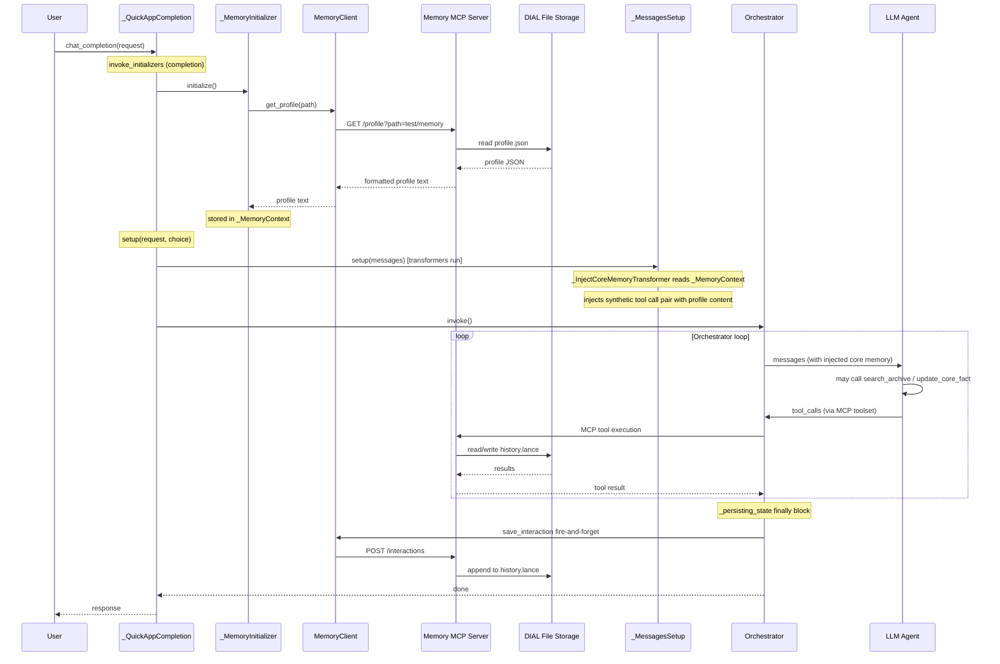

# Memory Feature: Extended Design and Implementation Plan

## Summary of choices

- **Memory path**: Fixed for first iteration (`test/memory.json`); scoping will be addressed in a follow-up (see §0.2).
- **Storage backend**: DIAL file storage (the platform's built-in object storage, analogous to S3).
- **Memory scopes**: Two per-user memory stores — one scoped to a specific QuickApp (`app`), one shared across all QuickApps for the same user (`user`). Both live inside the user's folder in DIAL file storage; there is no cross-user sharing.
- **Vector search**: LanceDB backed by DIAL file storage for history; plain JSON for the core profile.
- **Architecture**: Memory lives in a **separate MCP server project**; the current project (`quickapps-backend`) consumes it as an MCP toolset and adds pre-request hooks and post-response persistence.

---

## 0. Cross-cutting Concerns

### 0.1 Storage backend — DIAL file storage

All persistent data is stored in **DIAL file storage** — the platform's built-in object store (functionally equivalent to S3: key-based, scalable, no server to manage). The Memory MCP server accesses it via the DIAL file storage API. This means:

- No S3 or external storage dependency.
- The MCP server is stateless; storage is fully external and survives restarts.
- LanceDB supports arbitrary storage backends; it will be configured to use DIAL file storage as its backing store (or a local `/tmp` cache with a sync-up/sync-down pattern, as LanceDB supports).

### 0.2 Memory scope extensibility

Memory is always associated with a **scope** that determines who owns it and how the storage path is derived. There are two per-user memory scopes — both stored inside the user's folder in DIAL file storage. There is no cross-user sharing at any scope level.

| Scope | Description | Path pattern | Status |
|-------|-------------|--------------|--------|
| `app` | Per-user memory scoped to a specific QuickApp. Stores facts and history relevant only to that application. | `users/{user_id}/apps/{quickapp_id}/memory/` | First iteration (hardcoded path `test/` for now) |
| `user` | Per-user memory shared across **all** QuickApps. Stores universal facts (name, language, global preferences) that any QuickApp can read and enrich. | `users/{user_id}/memory/` | Second iteration |

**Design rule**: the Memory MCP server accepts a `path` parameter on every request and is path-agnostic — it never interprets what a path means semantically. Scope resolution is the responsibility of the **caller** (quickapps-backend), which computes the correct path(s) from user identity and QuickApp ID before calling the server.

When both scopes are active, quickapps-backend fetches from both paths and merges the results before injection. App-scoped memory takes precedence over global user memory when facts conflict.

The `MemoryConfig` in quickapps-backend will eventually look like:

```python
class MemoryConfig(BaseModel):
    base_url: str | None = None
    app_memory_path: str = "test/memory"    # first iteration: hardcoded; later: users/{id}/apps/{app_id}/memory
    user_memory_path: str | None = None     # second iteration: users/{id}/memory; None disables global memory
```

### 0.3 Storage layout (LanceDB + plain JSON)

| Data | Format | Location (under scope path) |
|------|--------|-----------------------------|
| Core profile (key/value facts) | Plain JSON | `<scope_path>/profile.json` |
| Conversation history + vectors | LanceDB | `<scope_path>/history.lance/` |

Keeping them separate means the human-readable profile is always inspectable without tooling, while the vector index benefits from LanceDB's columnar efficiency.

---

## Part 1 — Current Project: quickapps-backend

This repo stays agnostic of storage details; it integrates with the Memory MCP server over HTTP and injects core memory into the agent conversation.

### 1.1 Memory skill

A skill file (under `config/predefined/skills/memory/SKILL.md`) instructs the agent when and how to use memory tools:

- Use `search_archive` when the user refers to past events or conversations.
- Use `update_core_fact` when the user explicitly states or corrects a preference or fact.

The skill is loaded by the existing `AgentSkillsProvider` + `PredefinedContentProvider` pipeline — no changes to the skills loader are needed.

### 1.2 Core memory injection via synthetic tool call (pre-transformer)

Before the agent runs each turn, the app fetches the core profile from the Memory server and injects it into the conversation as a **synthetic tool call pair** — the same technique used by `_InjectFileTransferInstructionTransformer`.

**Components:**

| Component | Role |
|-----------|------|
| `_MemoryContext` | Request-scoped holder that stores the pre-fetched profile text |
| `_MemoryInitializer` (CompletionInitializer) | Async; fetches profile from `MemoryClient.get_profile()` and stores it in `_MemoryContext` before messages are transformed |
| `_InjectCoreMemoryTransformer` (MessagesTransformer) | Synchronously reads from `_MemoryContext` and injects a synthetic assistant-tool-call + tool-response message pair at the start of the conversation (once) |

The synthetic pair looks like this (invisible to the user, visible to the LLM):
```
ASSISTANT: [calls read_core_memory()]
TOOL (id=synthetic_core_memory): <profile content from Memory server>
```

If `_MemoryContext` has no profile (server unavailable or not configured), the transformer is a no-op.

### 1.3 Post-response persistence

After the orchestrator finishes a turn, the last user message and assistant response are sent to the Memory server to be appended to the interaction history.

- **Where**: `Orchestrator._persisting_state` `finally` block.
- **How**: `MemoryClient.save_interaction(path, user_msg, ai_msg)` — fire-and-forget (`asyncio.create_task`). Errors are logged but never propagate to the response.

### 1.4 MemoryClient

A thin async HTTP client (`src/quickapp/memory/_memory_client.py`) wrapping `httpx.AsyncClient`:

| Method | HTTP call |
|--------|-----------|
| `get_profile(path) -> str` | `GET /profile?path=<path>` |
| `save_interaction(path, user_msg, ai_msg)` | `POST /interactions` |

Config via `MemoryConfig` (optional; both methods are no-ops if `base_url` is not set).

### 1.5 Adding Memory MCP server as a toolset

The Memory MCP server exposes `search_archive` and `update_core_fact` as MCP tools. These are wired in application config as a `dial-mcp` toolset:

```yaml
tool_sets:
  - type: dial-mcp
    dial_id: memory-mcp-server   # DIAL deployment ID pointing to the Memory MCP server
    allowed_tools:
      - search_archive
      - update_core_fact
```

No code changes are needed in the tooling layer — only configuration.

### 1.6 Config

Optional top-level `memory` config block in `ApplicationConfig`:

```python
class MemoryConfig(BaseModel):
    base_url: str | None = None            # Memory MCP server HTTP base URL
    app_memory_path: str = "test/memory"   # QuickApp-specific memory path (users/{id}/apps/{app_id}/memory)
    user_memory_path: str | None = None    # Global user memory path (users/{id}/memory); None disables it
```

Both `_MemoryInitializer` and `Orchestrator` are no-ops when `base_url` is `None`. When `user_memory_path` is set, the initializer fetches from both paths and merges results before injection.

### 1.7 Request flow



### 1.8 Files added/modified (current project)

| Area | File |
|------|------|
| Design | `docs/designs/memory_architecture.md` (this file) |
| Memory module | `src/quickapp/memory/__init__.py` |
| Memory client | `src/quickapp/memory/_memory_client.py` |
| Memory context | `src/quickapp/memory/_memory_context.py` |
| Memory initializer | `src/quickapp/memory/_memory_initializer.py` |
| Core memory transformer | `src/quickapp/memory/_inject_core_memory_transformer.py` |
| Memory DI module | `src/quickapp/memory/memory_module.py` |
| Config | `src/quickapp/config/application.py` — add `MemoryConfig` |
| App factory | `src/quickapp/app_factory.py` — register `MemoryModule` |
| Orchestrator | `src/quickapp/agent/orchestrator.py` — call `save_interaction` in `_persisting_state` |
| Skill | `config/predefined/skills/memory/SKILL.md` |

---

## Part 2 — Separate Project: Memory MCP Server

A standalone Python service that manages conversation memory backed by DIAL file storage, and exposes it via MCP tools and an HTTP management API.

### 2.1 Responsibilities

| Concern | Details |
|---------|---------|
| Storage | DIAL file storage via the DIAL file storage API. Core profile in `profile.json`; history in `history.lance/` (LanceDB). |
| MCP tools | `search_archive`, `update_core_fact` (agent-callable) |
| HTTP API | `GET /profile`, `POST /interactions` (app-callable, not exposed to agent) |
| Scope routing | Derive storage path from `memory_path` param; scope resolution (user/deployment) added in a follow-up |

### 2.2 MCP tools

| Tool | Description | Arguments |
|------|-------------|-----------|
| `search_archive` | Search conversation history. Use when the user references past events. | `query: str` |
| `update_core_fact` | Update a permanent user fact/preference. Use when the user explicitly states or corrects something. | `key: str`, `value: str` |

### 2.3 HTTP management API

| Endpoint | Purpose |
|----------|---------|
| `GET /profile?path=<path>` | Returns the `core` block of `profile.json` formatted as a readable string. Used by `_MemoryInitializer`. |
| `POST /interactions` body: `{ path, user_msg, ai_msg }` | Appends user + assistant messages to `history.lance`. Used by `Orchestrator` after each turn. |

### 2.4 Storage design

Two files per memory namespace, stored in DIAL file storage under the `memory_path`:

| File | Format | Purpose |
|------|--------|---------|
| `profile.json` | Plain JSON `{ "key": "value" }` | Core facts; loaded on every request; human-readable |
| `history.lance/` | LanceDB (Arrow/Lance columnar) | Full interaction history with vector embeddings; queried only on `search_archive` |

The MCP server syncs LanceDB to/from DIAL file storage using a local `/tmp` cache (sync-down before read/write, sync-up after write). LanceDB's columnar format means only the required columns (text + vector) are fetched during search.

### 2.5 Embeddings strategy

| Phase | `search_archive` behaviour | Embedding storage |
|-------|---------------------------|-------------------|
| First iteration | Keyword / substring match over last N messages | None |
| Follow-up | Cosine similarity via ANN index (LanceDB built-in) | Per-entry float vector in `history.lance` |
| Embedding source | External API (e.g. DIAL embedding deployment) called at `save_interaction` time | — |

### 2.6 Scope extensibility

The server accepts a `path` parameter on every request and is fully path-agnostic. Scope resolution is the responsibility of the caller (quickapps-backend). Both memory scopes are stored inside the user's folder — there is no cross-user sharing.

| Scope | Path computed by | Example path |
|---|---|---|
| `app` (first iteration) | quickapps-backend combines user identity + QuickApp ID | `users/abc123/apps/my-quickapp/memory` |
| `user` / global (second iteration) | quickapps-backend resolves user identity only | `users/abc123/memory` |

When global user memory is enabled, quickapps-backend calls the Memory MCP server twice (once per path), merges the results, and injects a single unified context block. The Memory MCP server itself is called identically in both cases — only the `path` argument differs.

The Memory MCP server itself remains path-agnostic — it never needs to know what a path means semantically.

### 2.7 Project layout

```
ai-dial-memory-mcp/
├── src/
│   └── memory_mcp/
│       ├── server.py          # FastMCP server (MCP tools: search_archive, update_core_fact)
│       ├── api.py             # FastAPI routes (GET /profile, POST /interactions)
│       ├── storage/
│       │   ├── profile.py     # Read/write profile.json via DIAL file storage
│       │   └── history.py     # LanceDB read/write with DIAL file storage sync
│       └── settings.py        # Pydantic settings (dial_storage_url, default_path, etc.)
├── pyproject.toml
└── Dockerfile
```
