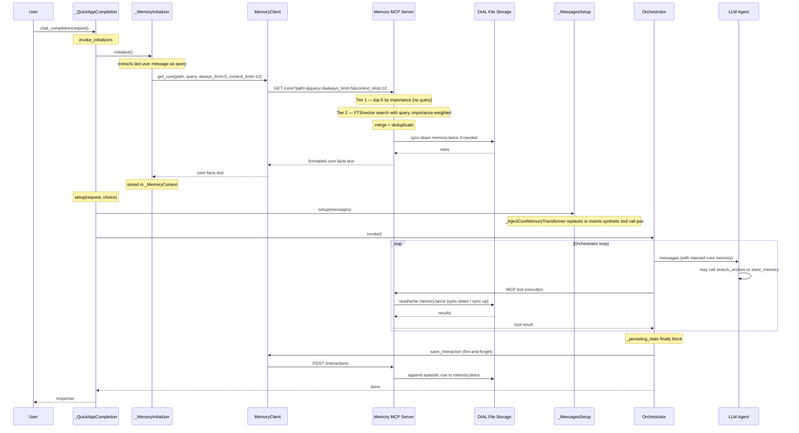

# Memory Feature: Design and Implementation Plan

## Summary of choices

- **Storage backend**: DIAL file storage (the platform's built-in object store, analogous to S3).
- **Memory store**: Single LanceDB table (`memory.lance/`) holding all memory rows — both core facts and episodic history — distinguished by a `memory_type` column.
- **Memory scopes**: Two per-user memory stores — one scoped to a specific QuickApp (`app`), one shared across all QuickApps for the same user (`user`). Both live inside the user's folder in DIAL file storage; there is no cross-user sharing.
- **Core fact storage**: Append-only rows. No key/value replacement. Facts coexist and retrieval is context-aware.
- **Core injection**: Two-tier semantic retrieval on every request — universal facts by importance (Tier 1) plus context-specific facts by FTS/vector match to the current user message (Tier 2). When both memory scopes are active, results from each path are merged before injection.
- **Agent tools**: `store_memory` (append-only, both types) and `search_archive` (episodic search on demand).
- **Architecture**: Memory lives in a **separate MCP server project**; the current project (`quickapps-backend`) consumes it as an MCP toolset and adds pre-request hooks and post-response persistence.

---

## 0. Cross-cutting Concerns

### 0.1 Storage backend — DIAL file storage

All persistent data is stored in **DIAL file storage** — the platform's built-in object store (key-based, scalable, no server to manage). The Memory MCP server accesses it via the DIAL file storage API:

- No S3 or external storage dependency.
- The MCP server is stateless; storage is fully external and survives restarts.
- LanceDB is configured to use DIAL file storage via a local `/tmp` cache with sync-down before read/write and sync-up after write.

### 0.2 Memory scope extensibility

Memory is always associated with a **scope** that determines who owns it and how the storage path is derived. There are two per-user memory scopes — both stored inside the user's folder in DIAL file storage. There is no cross-user sharing at any scope level.

| Scope | Description | Path pattern | Status |
|-------|-------------|--------------|--------|
| `app` | Per-user memory scoped to a specific QuickApp. Stores facts and history relevant only to that application. | `users/{user_id}/apps/{quickapp_id}/memory/` | First iteration (hardcoded `test/` for now) |
| `user` | Per-user memory shared across **all** QuickApps. Stores universal facts (name, language, global preferences) that any QuickApp can read and enrich. | `users/{user_id}/memory/` | Second iteration |

**Design rule**: the Memory MCP server accepts a `path` parameter on every request and is path-agnostic — it never interprets what a path means semantically. For the first iteration the path is hardcoded (`test/memory`). Scope resolution is added by changing how the **caller** computes `path`.

When both scopes are active, quickapps-backend fetches from both paths independently and merges results before injection. App-scoped memory takes precedence over global user memory when facts conflict.

### 0.3 Unified storage schema

One LanceDB table (`memory.lance/`) per memory namespace, stored under `<scope_path>/memory.lance/`.

| Column | Type | Purpose |
|--------|------|---------|
| `id` | `string` | UUID |
| `memory_type` | `string` | `"core"` or `"episodic"` |
| `content` | `string` | Full text of the memory |
| `context` | `string` | Scope hint: `"project-alpha"`, `"user-prefs"`, etc. |
| `importance` | `float32` | 0.0–1.0; drives Tier 1 always-inject threshold and Tier 2 score weighting |
| `embedding_model` | `string` | Model that produced the vector (e.g. `"text-embedding-3-small"`); used to exclude cross-model comparisons |
| `vector` | `list<float32>[N]` | Embedding; null in Phase 1 (FTS only) |
| `timestamp` | `timestamp[us]` | Creation time |
| `access_count` | `int32` | Incremented on retrieval; reserved for future decay logic |

---

## Part 1 — Current Project: quickapps-backend

This repo stays agnostic of storage details. It integrates with the Memory MCP server over HTTP for system-level operations (pre-request fetch, post-response persistence) and over MCP for agent-callable tools.

### 1.1 Memory skill

A skill file (`config/predefined/skills/memory/SKILL.md`) instructs the agent when and how to use memory tools. It is loaded by the existing `AgentSkillsProvider` + `PredefinedContentProvider` pipeline — no changes to the skills loader are needed.

```markdown
## Memory

Core facts relevant to your current conversation are already injected
at the start of every request. Trust them, but treat them as potentially
stale — they reflect what was stored in past sessions.

### Call search_archive when:
- User says "last time", "previously", "remember when", "we talked about"
- You need to verify something from a past session not in your current context

### Call store_memory with memory_type=core when:
- User explicitly states a permanent fact: "I work in Python", "my name is Alex"
- User corrects or adds nuance to a fact: "actually that's a different project"
- A clear preference is established: "always respond in English"
- Set context to scope the fact: context="project-alpha", context="user-prefs"
- Store universal facts (name, language preference) to the global user memory scope so all QuickApps benefit
- Store app-specific facts (project details, workflow preferences) to the QuickApp-scoped memory
- NEVER overwrite — always store as a new row; retrieval handles context

### Importance guide for core facts:
- 0.9+   Universal facts (name, language preference) — always injected regardless of topic
- 0.7–0.9  Project/context-specific facts — injected when contextually relevant
- below 0.7  Low-priority hints

### Call store_memory with memory_type=episodic when:
- A significant decision was made this session worth recalling in a future one
- A bug was found and fixed — future sessions should know what was tried
- A repeatable workflow was established

### Never store:
- Intermediate debug steps that led nowhere
- General knowledge (how HTTP works, what Python is)
- File contents — that is what RAG is for
```

### 1.2 Per-request two-tier core injection

Before the orchestrator runs each turn, the app fetches relevant core facts from the Memory server and injects them into the conversation as a **synthetic tool call pair** — the same technique used by `_InjectFileTransferInstructionTransformer`.

The fetch happens on **every request**, not once per conversation. This means the injected facts adapt as the topic shifts across turns within the same conversation.

#### Two-tier retrieval (executed server-side)

**Tier 1 — Always inject** (universal facts, no query):
```sql
SELECT * FROM memory
WHERE memory_type = 'core'
ORDER BY importance DESC
LIMIT :always_limit   -- default 5
```

Guarantees that high-importance universal facts (name, language preference) are always present regardless of what the user message is about.

**Tier 2 — Context inject** (relevant to current message):
```
FTS (Phase 1) or vector search (Phase 2) over memory_type = 'core'
using the last user message as query
scored as: final_score = cosine_similarity * (0.5 + importance * 0.5)
LIMIT :context_limit   -- default 10
```

Surfaces facts relevant to the current topic — e.g. "project-alpha is in Python" when the user mentions that project, without surfacing unrelated facts.

Both tiers are merged and deduplicated by `id` before injection.

**Fallback when no user message is available** (e.g. first turn with no user message yet): Tier 1 only, ordered by `importance DESC, timestamp DESC`.

#### Components

| Component | Role |
|-----------|------|
| `_MemoryContext` | Request-scoped holder for the fetched core facts text |
| `_MemoryInitializer` (CompletionInitializer) | Async; extracts the last user message as the Tier 2 query; calls `MemoryClient.get_core(path, query)`; stores result in `_MemoryContext` |
| `_InjectCoreMemoryTransformer` (MessagesTransformer) | Synchronous; reads `_MemoryContext`; **replaces** any existing synthetic core memory pair if already present in the message list, otherwise inserts one at position 0 (after system message) |

The transformer is **idempotent**: it never appends a second pair on top of the one injected in a previous turn. The model always sees exactly one synthetic pair per request with the freshest results.

The injected pair looks like this (invisible to the user, visible to the LLM):
```
ASSISTANT: [calls read_core_memory()]
TOOL (id=synthetic_core_memory): <formatted core facts from Memory server>
```

If `_MemoryContext` is empty (server unavailable or no facts stored yet), the transformer is a no-op.

### 1.3 Post-response persistence (episodic, automatic)

After the orchestrator finishes a turn, the last user message and assistant response are sent to the Memory server to be appended as an episodic row.

- **Where**: `Orchestrator._persisting_state` `finally` block.
- **How**: `MemoryClient.save_interaction(path, user_msg, ai_msg)` — `asyncio.create_task`. Errors are logged but never propagate to the response.

### 1.4 MemoryClient

Thin async HTTP client (`src/quickapp/memory/_memory_client.py`) wrapping `httpx.AsyncClient`:

| Method | HTTP call |
|--------|-----------|
| `get_core(path, query, always_limit, context_limit) -> str` | `GET /core?path=&query=&always_limit=&context_limit=` |
| `save_interaction(path, user_msg, ai_msg)` | `POST /interactions` |

Config via `MemoryConfig` — both methods are no-ops if `base_url` is not set.

### 1.5 Adding Memory MCP server as a toolset

The Memory MCP server exposes `search_archive` and `store_memory` as MCP tools, wired as a `dial-mcp` toolset:

```yaml
tool_sets:
  - type: dial-mcp
    dial_id: memory-mcp-server
    allowed_tools:
      - search_archive
      - store_memory
```

No code changes needed in the tooling layer — only configuration.

### 1.6 Config

```python
class MemoryConfig(BaseModel):
    base_url: str | None = None            # Memory MCP server HTTP base URL
    app_memory_path: str = "test/memory"   # QuickApp-specific memory path (users/{id}/apps/{app_id}/memory)
    user_memory_path: str | None = None    # Global user memory path (users/{id}/memory); None disables it
    core_always_limit: int = 5             # Tier 1: top-N by importance
    core_context_limit: int = 10           # Tier 2: top-M by semantic match
```

All components are no-ops when `base_url` is `None`. When `user_memory_path` is set, `_MemoryInitializer` fetches from both paths concurrently and merges the deduplicated results before injection.

### 1.7 Request flow



### 1.8 Files added/modified (current project)

| Area | File |
|------|------|
| Design | `docs/designs/memory_architecture_unified_semantic_injection.md` |
| Memory module | `src/quickapp/memory/__init__.py` |
| Memory client | `src/quickapp/memory/_memory_client.py` |
| Memory context | `src/quickapp/memory/_memory_context.py` |
| Memory initializer | `src/quickapp/memory/_memory_initializer.py` |
| Core memory transformer | `src/quickapp/memory/_inject_core_memory_transformer.py` |
| Memory DI module | `src/quickapp/memory/memory_module.py` |
| Config | `src/quickapp/config/application.py` — add `MemoryConfig` |
| App factory | `src/quickapp/app_factory.py` — register `MemoryModule` |
| Orchestrator | `src/quickapp/agent/orchestrator.py` — call `save_interaction` in `_persisting_state` |
| Skill | `config/predefined/skills/memory/SKILL.md` |

---

## Part 2 — Separate Project: Memory MCP Server

A standalone Python service managing conversation memory backed by DIAL file storage, exposing MCP tools for agent use and an HTTP management API for system use.

### 2.1 Responsibilities

| Concern | Details |
|---------|---------|
| Storage | Single `memory.lance/` table per namespace in DIAL file storage |
| MCP tools | `search_archive`, `store_memory` (agent-callable) |
| HTTP API | `GET /core`, `POST /interactions` (system-callable, not exposed to agent) |
| Scope routing | Path-agnostic; derives storage location from `path` param |

### 2.2 MCP tools

| Tool | Description | Arguments |
|------|-------------|-----------|
| `search_archive` | Search episodic history. Use when user references past events. | `query: str` |
| `store_memory` | Append a new memory row. Never overwrites. | `content: str`, `memory_type: Literal["core","episodic"]`, `context: str`, `importance: float` |

`store_memory` is strictly append-only. If the agent stores "project-alpha is in Python" and later "project-beta is in Rust", both rows coexist. Retrieval surfaces the contextually appropriate one. If the model sees two conflicting facts injected for the same query, it can ask the user to clarify — which is the correct behavior.

### 2.3 HTTP management API

| Endpoint | Purpose |
|----------|---------|
| `GET /core?path=&query=&always_limit=&context_limit=` | Two-tier core fact retrieval. Returns merged Tier 1 + Tier 2 results as formatted text. Used by `_MemoryInitializer`. |
| `POST /interactions` body: `{ path, user_msg, ai_msg }` | Appends an episodic row to `memory.lance`. Used by `Orchestrator` after each turn. |

### 2.4 Retrieval strategy by phase

| Phase | `search_archive` | `GET /core` Tier 2 | Embedding storage |
|-------|-----------------|-------------------|-------------------|
| Phase 1 | FTS (keyword/substring) over episodic rows | FTS over core rows | None (vector column null) |
| Phase 2 | Cosine similarity via LanceDB ANN | Cosine similarity, importance-weighted | Per-row float vector |

**Importance-weighted scoring (Phase 2 Tier 2):**
```python
final_score = cosine_similarity * (0.5 + importance * 0.5)
# importance=1.0 → multiplier 1.0x
# importance=0.0 → multiplier 0.5x
# high-importance facts can be up to 2x more prominent than low-importance ones at equal similarity
```

**Embedding model tracking**: every row stores `embedding_model` at write time. If the active model changes, rows with a different `embedding_model` are excluded from vector search and fall back to FTS. A background re-embed job can be added as a follow-up.

### 2.5 Scope extensibility

The server accepts `path` on every request and is fully path-agnostic. Scope resolution is the responsibility of the caller (quickapps-backend). Both memory scopes are stored inside the user's folder — there is no cross-user sharing.

| Scope | Path computed by | Example path |
|---|---|---|
| `app` (first iteration) | quickapps-backend combines user identity + QuickApp ID | `users/abc123/apps/my-quickapp/memory` |
| `user` / global (second iteration) | quickapps-backend resolves user identity only | `users/abc123/memory` |

When global user memory is enabled, quickapps-backend calls the Memory MCP server twice (once per path), merges and deduplicates results by `id`, and injects a single unified context block. The Memory MCP server is called identically in both cases — only the `path` argument differs.

### 2.6 Project layout

```
ai-dial-memory-mcp/
├── src/
│   └── memory_mcp/
│       ├── server.py          # FastMCP server (MCP tools: search_archive, store_memory)
│       ├── api.py             # FastAPI routes (GET /core, POST /interactions)
│       ├── storage/
│       │   └── memory.py      # LanceDB read/write with DIAL file storage sync
│       └── settings.py        # Pydantic settings (dial_storage_url, default_path, etc.)
├── pyproject.toml
└── Dockerfile
```

---

## Key design decisions

| Decision | Rationale |
|----------|-----------|
| Single LanceDB table for all memory types | One schema, one sync mechanism, one code path; type distinction is a column value not a file split |
| Append-only core facts | Prevents silent overwrite of still-valid facts from different contexts; both facts coexist and the right one surfaces via retrieval |
| `context` field on core rows | Enables scoped disambiguation without encoding context into key names |
| Two per-user memory scopes (`app` + `user`) | App-scoped memory holds QuickApp-specific facts; global user memory holds universal facts (name, preferences) reusable by any QuickApp. Both live inside the user's folder — no cross-user sharing at any level |
| No `deployment`-shared memory | Sharing memory between users of the same QuickApp was rejected in favour of portable per-user memory. Each user owns their own data exclusively |
| Per-request injection | Topic shifts within a conversation are reflected immediately; no stale facts from the first turn persist for the whole session |
| Two-tier injection | Tier 1 guarantees universal facts (name, preferences) are always present; Tier 2 adds contextually relevant facts without token-wasting noise |
| `importance` as the single control knob | Drives both Tier 1 threshold and Tier 2 score weighting; no separate `sticky` flag needed |
| `embedding_model` column | Prevents cross-model cosine similarity errors when embedding provider changes |
| HTTP for system calls, MCP for agent calls | Pre-transformer runs before the orchestrator loop; HTTP is the correct channel for system-level access; keeps agent and system access paths cleanly separated |
