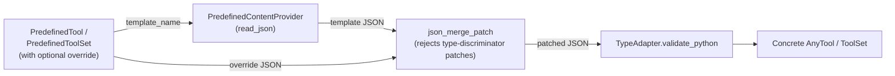

# Design: Predefined Template Overrides for Per-App Configurations

- **Status:** Implemented

## Problem Statement

Quick Apps that compose a fixed set of capabilities — most notably the family of **ChatHub**
applications shipped under `docker_compose_files/core/configuration/chathub/` — wire themselves
together by referencing predefined templates by name:

```json
"tool_sets": [
  { "type": "predefined", "template_name": "chathub" },
  { "type": "predefined", "template_name": "py_interpreter" }
]
```

The references resolved by `ConfigResolver.resolve_config()` are **pure pointers**.
`PredefinedToolSet` carries only `template_name`; `PredefinedTool` carries `template_name` plus an
`enabled` flag and nothing else. The resolver reads the template file from
`PredefinedContentProvider` and **replaces** the pointer with the parsed content — there is no
merge step.

This rigidity costs DevOps and support teams in three concrete ways:

1. **No per-app deployment swap.** The predefined `dial_rag.json`, `web_search.json`, and
   `image_generation.json` templates hardcode their `deployment.name` (`dial-rag`,
   `gemini-2.5-pro-google-search`, `gpt-image-1`). A team that wants ChatHub-A to use a
   tenant-specific RAG deployment and ChatHub-B to use the default cannot express that. The only
   knob today is `PREDEFINED_EXTRA_PATHS`, which replaces the file *globally* across every
   application that resolves the same template name.

2. **No per-app description/parameter tweak.** A team that wants their ChatHub variant to expose
   the RAG tool as "Search internal HR documents" instead of the generic catch-all description has
   no path other than forking the entire tool template — losing the upstream baseline whenever the
   project changes the canonical wording.

3. **No light "remove one tool from the bundle" path.** The `chathub` predefined toolset bundles
   RAG + image generation + web search. Disabling image generation for one ChatHub variant requires
   either a global override of `chathub.json` (affecting every variant) or a fully inline
   `dial-deployment` toolset that reproduces the bundle minus one tool — duplicating ~75 lines of
   tool JSON per kept tool.

The escape valve — writing a fully inline `deployment-tool` for each tool — works but defeats the
purpose of the predefined library: every chat hub must restate the function descriptor, the JSON
schema for parameters, attachment rules, fallback config, and stay in sync with upstream by hand.

## Design Goals

- **Per-app overrides.** A ChatHub config can swap fields on a predefined tool (deployment name,
  description, parameters) without forking the template file or touching environment variables.
- **One knob per pointer.** Every override path is a single `override` field that takes a JSON
  patch — no proliferation of typed override fields like `deployment_override`,
  `description_override`, etc.
- **Reuse-preserving.** The override surface keeps the canonical predefined template as the
  baseline; only fields the caller names are changed, so upstream improvements continue to flow.
- **Predictable escape hatch.** Whenever the override needs go beyond a thin patch, the caller
  drops the `predefined-*` reference and writes the full inline config model. The two tiers
  (pointer-with-patch vs. inline) stay clearly separated.
- **Backwards compatible.** Existing `predefined` references — including the entire `chathub/`
  config family — continue to validate and resolve identically without any change.

---

## Use Cases

### UC-1: Per-app RAG deployment swap

**Trigger:** A ChatHub variant for an internal HR audience must use a tenant-specific RAG
deployment (`hr-rag-prod`) instead of the default `dial-rag`.
**Behavior:** The ChatHub config references the predefined `dial_rag` tool with an `override` that
replaces the deployment name.
**Outcome:** At resolution time the canonical `dial_rag` template is loaded, the override patch is
applied, and the resulting `DialDeploymentTool` carries `deployment.name = "hr-rag-prod"`. All
other fields — function descriptor, attachment config, fallback strategies — come unchanged from
the template.

### UC-2: Per-app web-search description revision

**Trigger:** A ChatHub variant must expose a narrowed scope for web search ("internal knowledge
base only") via its function description so the orchestrator picks it correctly.
**Behavior:** The ChatHub config references the predefined `web_search` tool with an `override`
that patches `open_ai_tool.function.description`.
**Outcome:** The resolved tool keeps the canonical deployment, parameters, and fallback, with only
the description text replaced.

### UC-3: Disable a single tool from a predefined bundle

**Trigger:** A ChatHub variant must drop image generation but keep RAG and web search.
**Behavior:** The variant replaces the `{ type: "predefined", template_name: "chathub" }`
reference with an inline `dial-deployment` toolset that lists each tool as a `predefined-tool`
reference and sets `enabled: false` on `image_generation`. This is the **dissolve pattern** —
already supported by the existing `DeploymentToolSet.tools` union, surfaced explicitly by this
design.
**Outcome:** RAG and web search resolve as before. The disabled image generation reference is
short-circuited by `ConfigResolver.resolve_toolset` (which only resolves predefined-tool
references when `enabled` is true; a disabled reference stays unresolved); `_DeploymentToolInitializer`
then ignores the still-unresolved `PredefinedTool` because it does not match the
`DialDeploymentTool` / `DialDeploymentSimpleTool` `isinstance` branches.

### UC-4: Drop an entire predefined toolset

**Trigger:** A ChatHub variant must not include the Python interpreter at all.
**Behavior:** The variant omits the `{ type: "predefined", template_name: "py_interpreter" }`
entry from `tool_sets`.
**Outcome:** The interpreter is never initialized for that variant. Removing the line is the
recipe.

### UC-5: Total replacement of a tool

**Trigger:** A ChatHub variant must use a fundamentally different tool — e.g., a custom
image-generation tool with a different function name and parameter schema.
**Behavior:** The variant abandons the `predefined-tool` reference for that slot and writes a full
inline `deployment-tool` (or any other concrete `AnyTool` type).
**Outcome:** The inline tool is used as-is. The override field is **not** the path here; whole
replacement uses the full config model. This boundary is intentional and called out in the
documentation.

### UC-6: Swap image generation to a deployment with a fundamentally different parameter shape

**Trigger:** A ChatHub variant must use an alternative image-generation provider whose model
exposes a fundamentally different parameter set than the predefined `image_generation` template.
For example, a FLUX-style model that takes `style` and a different size enum instead of the
GPT-Image-1 family of `output_compression`, `moderation`, `background`, `output_format`, and
`quality`.

**Behavior:** Although the `override` mechanism technically supports this — by `null`ing out each
property the new model does not expose and adding the new ones — the resulting patch is dominated
by deletions and is harder to read than the equivalent fully inline `deployment-tool`. Per the
design's escape-hatch boundary (UC-5), the variant abandons the `image_generation` predefined
reference and writes an inline `deployment-tool` for the new image generator.

**Outcome:** The new image generator is wired with its native parameter shape, function name, and
description. The predefined `image_generation` template remains untouched and continues to serve
the canonical GPT-Image-1 deployment for other ChatHub variants. UC-1 and UC-2 remain the right
recipes for *narrow* image-generation tweaks (e.g., swapping just the deployment name to a
GPT-Image-1-compatible alternative); UC-6 is specifically the case where the shape changes too.

---

## Proposed Design

### 1. `override` field on `PredefinedTool`

**What:** A new optional field `override: dict[str, Any] | None = None` on `PredefinedTool`
(`config/tools/predefined.py`). The field carries an arbitrary JSON object that will be merged
onto the loaded template before pydantic validation.

**Owner:** `PredefinedTool` schema; `ConfigResolver.resolve_tool` consumes it.

**Semantics:**

- When `override` is set, the resolver loads the template JSON, applies the override as a JSON
  Merge Patch (see *§3 — Merge semantics*), and validates the result against `AnyTool`.
- The `enabled` flag gates whether the override is evaluated at all: a disabled `PredefinedTool`
  short-circuits in `ConfigResolver.resolve_toolset` (`config_template_resolver.py:188`) and stays
  unresolved, after which `_DeploymentToolInitializer` ignores it (no `isinstance` branch matches
  the raw `PredefinedTool`).
- Setting `override` together with `enabled: false` is a benign no-op: the patch is preserved on
  the parsed reference but never applied, so an operator can flip `enabled` back on during
  testing without losing the patch.

**Change relative to today:** `resolve_tool` (`config_template_resolver.py:198`) gains a single
patch step between reading the template and validating it.

### 2. `override` field on `PredefinedToolSet` (symmetric)

**What:** The same optional `override: dict[str, Any] | None = None` on `PredefinedToolSet`
(`config/toolsets/predefined.py`).

**Owner:** `PredefinedToolSet` schema; `ConfigResolver.resolve_predefined_toolset` consumes it.

**Semantics:** Identical to the per-tool case. The patch is applied to the loaded toolset JSON
before validation against the `ToolSet` discriminated union, so the patch's keyspace is the
*resolved* `ToolSet` member's schema — e.g. for `DeploymentToolSet`, the fields inherited from
`BaseToolSet` (`config/toolsets/base.py:13`): `name`, `description`, `enabled`, plus `tools`.

**Why include this** even though UC-3 already has a path via the dissolve pattern: keeping the two
predefined references symmetric makes the resolver pipeline uniform, the schema documentation
consistent, and removes the temptation to special-case toolset overrides as a separate feature
later. The patched-toolset path is **not** the recommended recipe for "drop one tool" — the
dissolve pattern is — but it remains available for narrow tweaks (e.g., renaming a toolset).

### 3. Merge semantics — JSON Merge Patch (RFC 7396)

**What:** The override is interpreted as a JSON Merge Patch as defined in
[RFC 7396](https://datatracker.ietf.org/doc/html/rfc7396).

**Owner:** A small utility function in `config/utils.py` consumed by `ConfigResolver`.

**Semantics:**

- Objects merge recursively: keys present in the patch override or extend the corresponding keys
  in the target.
- Arrays are **replaced wholesale** — there is no element-wise merge, no append, no index-based
  patching.
- A patch value of `null` removes the corresponding key from the target.
- Scalars in the patch replace scalars in the target.

**Why RFC 7396 and not RFC 6902 (JSON Patch):**

- 7396 mirrors how operators already think about config files: "show me the diff and apply it."
- 7396 patches are themselves valid JSON objects that can be authored and reviewed without
  learning a path/op DSL.
- 6902 is more powerful (positional list edits, atomic test/replace) but the cost — verbose
  array-of-ops syntax — outweighs the benefit for our use cases. Operators who need positional
  list edits are better served by switching to the inline config model.

**List-replacement caveat.** Because arrays replace wholesale, an override that wants to add a
parameter to `open_ai_tool.function.parameters.properties` (an object — fine, deep-merges) must
also re-state `required` (an array) if any change is needed there. This is acceptable because
small additions are still small; deep schema rewrites belong in the inline path.

**Discriminator-field rule.** Patches that target a `type` discriminator field — at the top level
(`AnyTool` / `ToolSet`) **or** nested (e.g. a per-tool `type` inside `DeploymentToolSet.tools[N]`
when a toolset-level patch surgically targets one entry) — are **rejected at merge time**.
Allowing the discriminator to flip would invert the boundary between this design's
pointer-with-patch tier and the inline escape hatch (§5 / UC-5 / UC-6). Operators that need a
different concrete tool shape must abandon the predefined reference and write the inline tool
directly.

### 4. Resolution pipeline change

**What:** `ConfigResolver.resolve_predefined_toolset` (`config_template_resolver.py:178`) and
`ConfigResolver.resolve_tool` (`config_template_resolver.py:198`) apply the patch between template
read and pydantic validation.



**Owner:** `ConfigResolver` (`config/config_template_resolver.py`).

**Semantics:** A single patch step is inserted between template read and pydantic validation in
each of the two methods, conditional on the override being set.

**Validation error UX.** Merge failures (e.g. a `type`-discriminator violation, see §3) and
post-merge pydantic validation failures are wrapped into an `InitializationException`
(`quickapp.common.exceptions.initialization`) carrying the `template_name`, the JSON path inside
the patch that diverged, and the underlying pydantic error. This routes operator authoring
mistakes to a precise location, distinct from the malformed-template path that surfaces as a
build/deploy bug.

### 5. System prompt revisions — explicitly **not** introduced

**What:** `PredefinedSystemPromptConfig` (`config/prompt.py`) is **not** extended with an override
field, an append field, or any other patch surface in this design.

**Why:** The `predefined` system prompt mode is a pointer to a markdown body. There is no
structured object to merge into. The natural "light tweak" — appending an org-policy paragraph —
is a special-case that does not generalize, and adding it would force a divergent recipe ("the
override field on prompts behaves differently from the override field on tools").

**Recipe instead:** When a ChatHub variant needs to revise the system prompt, switch from
`{ type: "predefined", template: "anthropic_prompt" }` to
`{ type: "custom", content: "...", variables: {} }` and supply the desired prompt body. The
canonical predefined prompts live in `config/predefined/prompt/*.md` and are the operator's source
of truth for the starting baseline.

**Trade-off named:** Operators who fork the prompt this way will not pick up upstream prompt
improvements automatically. This is the deliberate cost of "use the full config model for whole
overrides" and matches the boundary drawn for tools (UC-5).

---

## Secondary Fixes

### Schema-dump regeneration

`make dump_app_schema` regenerates `docs/generated-app-schema.json` and the
`https://mydial.epam.com/custom_application_schemas/quickapps2` URL the chat hub configs reference.
The new `override` fields land in that schema as optional `object` properties, which is what
existing JSON tooling already accepts. No manual schema changes required.

### Documentation updates

- `docs/chathub.md` — **new dedicated doc** introducing the ChatHub application family (what it
  is, which variants ship out of the box, how the predefined toolsets compose it) and acting as
  the single source of truth for ChatHub configuration recipes. UC-1 through UC-6 plus the
  system-prompt boundary recipe live here. This is the doc DevOps and support teams will be
  pointed at, not `CONFIGURATION.md` (which remains the schema reference).
- `CONFIGURATION.md` — extend the `PredefinedToolSet` and `PredefinedTool` reference tables with
  the new `override` field. No recipe content here; `CONFIGURATION.md` stays a schema reference
  and points to `docs/chathub.md` for ChatHub-specific recipes.
- `docs/agent.md` — note the merge step in the request lifecycle's Configuration Resolution stage.
- `CLAUDE.md` — no change; the project overview does not enumerate config-field semantics.

---

## Out of Scope

- **System prompt override field.** Decided against, see *§5 — System prompt revisions*.
  Reconsider only if a recurring pattern emerges (e.g., 80%+ of ChatHub variants append the same
  shape of org policy).
- **JSON Patch (RFC 6902) operations.** Verbose for the marginal gain; revisit only if operators
  hit a real ceiling with merge-patch semantics.
- **Per-deployment template selection.** "Use template X for tenant A, template Y for tenant B"
  remains served by the global `PREDEFINED_EXTRA_PATHS` mechanism. This design does not introduce
  request-time template switching.
- **List-element merging / append semantics.** Lists replace wholesale under RFC 7396. Operators
  that need element-wise edits are pushed to the inline model on purpose.
- **Override of `dial-deployment-simple` tool refs.** Those tools fetch their config from DIAL Core
  at request time; their override surface, if any, is a separate design problem.

---

## Configuration / Usage Examples

### Recipe table

| Scenario                                | Recipe                                                                                   | Mechanism                                |
|-----------------------------------------|------------------------------------------------------------------------------------------|------------------------------------------|
| Swap RAG deployment per ChatHub         | `predefined-tool` with `override.deployment.name`                                        | Tool override (this design)              |
| Swap web search deployment              | `predefined-tool` with `override.deployment.name`                                        | Tool override (this design)              |
| Tweak a tool's function description     | `predefined-tool` with `override.open_ai_tool.function.description`                      | Tool override (this design)              |
| Disable image generation for a ChatHub  | Inline `dial-deployment` toolset listing `predefined-tool` refs; `enabled: false` on one | Dissolve pattern (existing schema)       |
| Drop the Python interpreter             | Remove the `py_interpreter` toolset entry from `tool_sets`                               | Existing                                 |
| Use a fundamentally different RAG tool  | Inline `deployment-tool` instead of `predefined-tool`                                    | Existing escape hatch (UC-5)             |
| Image gen with different param shape    | Inline `deployment-tool` instead of `predefined-tool`                                    | Existing escape hatch (UC-6)             |
| Revise the system prompt                | Switch from `type: predefined` to `type: custom`                                         | Existing escape hatch (no new knob)      |

Each example below shows the relevant fragment of a ChatHub `applicationProperties` block. Wrap
in the surrounding ChatHub config (`displayName`, `applicationTypeSchemaId`, `orchestrator`,
`contexts`, …) when authoring real configs.

### Example A — UC-1, swap RAG deployment

```json
{
  "tool_sets": [
    {
      "name": "chat-hub",
      "type": "dial-deployment",
      "tools": [
        {
          "type": "predefined-tool",
          "template_name": "dial_rag",
          "override": {
            "deployment": { "name": "hr-rag-prod" }
          }
        },
        { "type": "predefined-tool", "template_name": "image_generation" },
        { "type": "predefined-tool", "template_name": "web_search" }
      ]
    },
    { "type": "predefined", "template_name": "py_interpreter" }
  ]
}
```

### Example B — UC-2 + UC-3 combined: tweak description, disable image gen

```json
{
  "tool_sets": [
    {
      "name": "chat-hub",
      "type": "dial-deployment",
      "tools": [
        { "type": "predefined-tool", "template_name": "dial_rag" },
        {
          "type": "predefined-tool",
          "template_name": "image_generation",
          "enabled": false
        },
        {
          "type": "predefined-tool",
          "template_name": "web_search",
          "override": {
            "open_ai_tool": {
              "function": {
                "description": "Search the internal knowledge base for company-internal information."
              }
            }
          }
        }
      ]
    },
    { "type": "predefined", "template_name": "py_interpreter" }
  ]
}
```

### Example C — UC-6: replace image generation with an inline tool that has a different parameter shape

This shows the recommended recipe for UC-6 — the predefined `image_generation` reference is
abandoned in favour of an inline `deployment-tool` because the new model exposes a fundamentally
different parameter set. The other tools continue to use predefined references unchanged.

```json
{
  "tool_sets": [
    {
      "name": "chat-hub",
      "type": "dial-deployment",
      "tools": [
        { "type": "predefined-tool", "template_name": "dial_rag" },
        { "type": "predefined-tool", "template_name": "web_search" },
        {
          "type": "deployment-tool",
          "deployment": { "name": "flux-pro-1" },
          "open_ai_tool": {
            "type": "function",
            "function": {
              "name": "image_generation_tool",
              "description": "Generate images using FLUX Pro. Use for visualizations and creative imagery.",
              "parameters": {
                "type": "object",
                "properties": {
                  "query": {
                    "type": "string",
                    "description": "Description of the image to generate."
                  },
                  "style": {
                    "type": "string",
                    "enum": ["realistic", "anime", "sketch"],
                    "description": "Visual style of the generated image."
                  },
                  "aspect_ratio": {
                    "type": "string",
                    "enum": ["1:1", "16:9", "9:16"],
                    "description": "Aspect ratio of the generated image."
                  }
                },
                "required": ["query"]
              }
            }
          }
        }
      ]
    }
  ]
}
```

---

## Migration

### Breaking changes

**None.** `override` is a new optional field defaulting to `None`.

### Non-breaking changes

- The new per-reference `override` is independent of, and applied *after*, the
  `PREDEFINED_EXTRA_PATHS` layered template store has resolved which template body wins for a
  given name.

## Summary of Changes

**`config/tools/predefined.py` — `PredefinedTool`**
- Add: `override: dict[str, Any] | None = None`

**`config/toolsets/predefined.py` — `PredefinedToolSet`**
- Add: `override: dict[str, Any] | None = None`

**`config/utils.py`**
- Add: `json_merge_patch(target: dict, patch: dict) -> dict` (RFC 7396).

**`config/config_template_resolver.py` — `ConfigResolver`**
- Modify: `resolve_predefined_toolset` to apply the override patch before validation.
- Modify: `resolve_tool` to apply the override patch before validation.

**`config/prompt.py` — `PredefinedSystemPromptConfig`**
- No change. Recipe ("switch to `type: custom`") documented in `docs/chathub.md`.

**`docs/chathub.md` (new file)**
- Introduce the ChatHub application family: what it is, the variants shipped under
  `docker_compose_files/core/configuration/chathub/`, and the predefined building blocks
  (`chathub` toolset, `py_interpreter` toolset, predefined tools, predefined system prompts).
- Walk through the anatomy of a ChatHub variant (orchestrator + system prompt + tool sets).
- Document the recipes UC-1 through UC-6 plus the system-prompt-revision recipe.
- List the relevant environment knobs (`PREDEFINED_EXTRA_PATHS`, `CONFIG_PROMPT_MAPPING`).

**`CONFIGURATION.md`**
- Document the `override` field in the `PredefinedToolSet` and `PredefinedTool` reference tables.
- Cross-link to `docs/chathub.md` for ChatHub-specific recipes.

**`docs/agent.md`**
- Note the merge step in Configuration Resolution.

**Generated schema**
- `make dump_app_schema` regenerates `docs/generated-app-schema.json`. No manual edits.
