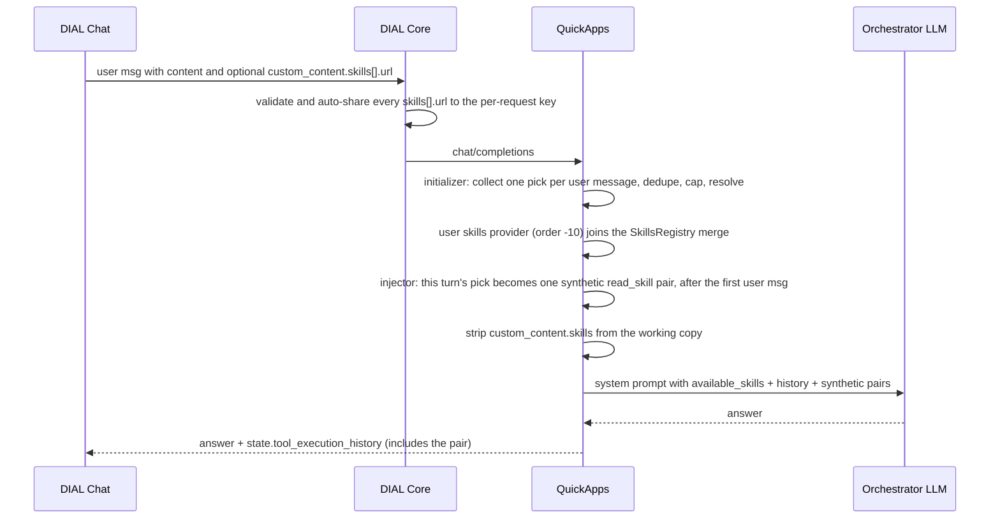

# Design: Invoking a Skill from a Message

- **Status:** Approved
- **Approved:** 2026-09-14
- **Issue:** [epam/ai-dial-quickapps-backend#549](https://github.com/epam/ai-dial-quickapps-backend/issues/549), a
  sub-issue of [#421](https://github.com/epam/ai-dial-quickapps-backend/issues/421) ([EPIC] Advanced Agent Skills
  support)
- **Scope:** Phase 1a — a picked skill is loaded, listed and readable, under its **own** name. Making a picked skill
  unable to collide with an agent's skill is phase 1b
  ([Follow-up](#follow-up-phase-1b--collision-free-names)).
- **Dependencies:**
  - [`skills_as_dial_resource.md`](skills_as_dial_resource.md) — `DialSkillResolver`, `DialSkillReader`, the
    `<skill_files>` inventory. Branch `feat/418-skills-as-dial-resource`, not yet on `development`.
  - `ai-dial-core` — `CollectRequestSkillsFn` collects `messages[*].custom_content.skills[*]` and auto-shares each skill
    to the per-request key; the field is in the OpenAPI message schemas as `RequestSkill`. **Done:**
    [epam/ai-dial-core#1956](https://github.com/epam/ai-dial-core/pull/1956) (issue #1955), on `development`. It
    rejects a URL the user can't read with `403`, which leaves one gap (see [Known Gaps](#known-gaps)).
  - `ai-dial-chat` — `chat-api` accepts the field (`MessageCustomContentDto`), and the composer emits it from a `/`
    palette of the user's own skills. **Agreed, not started.**

## Problem Statement

A skill reaches a QuickApp agent in exactly one way: the app author lists it in `ApplicationConfig.skills`, QuickApps
advertises it in `<available_skills>`, and the **model** decides whether to call `read_skill`. The user has no say.
They can't tell the agent "use this skill for this message", and they can't use a skill the author never attached.

That leaves two gaps:

1. **No deterministic invocation.** Even when the skill is attached, "please use the code-review skill" is a hint the
   model may or may not act on. Other agent products solve this with a `/skill-name` command whose effect is
   guaranteed: the skill is loaded, every time.
2. **No way in for the user's own skills.** DIAL Chat has a full skill catalog and editor. A user who wrote
   `code-review` for themselves cannot bring it into a conversation with an agent they don't own. Under a per-request
   key, the app cannot read `skills/<user-bucket>/…` at all unless something shares it.

DIAL Core and DIAL Chat have agreed on a wire contract that closes the access half: a user message may carry
`custom_content.skills[*]`, and Core auto-shares each referenced skill to the app's per-request key, as it already
does for `custom_content.attachments[*]`. This design specifies how QuickApps consumes that field.

## Design Goals

1. A skill the user picks is **always** loaded into the model's context on that turn. The model doesn't choose.
2. The user can pick any skill they can read from their own catalog: their own, one shared with them, or a published
   one. It doesn't need to be in the app config.
3. The loaded manifest **stays** in the model's context for the rest of the conversation, without being re-injected
   and without changing after the turn that loaded it.
4. The skill's **bundled files stay readable** on any later turn, through `read_skill(name, file_path)`, exactly as
   for a declared skill.
5. A chip on the current message that fails is visible to both the user and the model. The request is still served.
6. The **shape** of the skills contract doesn't change: `<available_skills>` keeps its fields, `read_skill` keeps its
   parameters, and a request without the field behaves exactly as today. What does change is *which* skills an agent
   ends up with — a picked skill can displace an agent's same-named one. That is a deliberate relaxation, not a
   property this design preserves; see [Known Gaps](#known-gaps).
7. The change is as small as possible. In particular, a picked skill is an ordinary `SkillsProvider` entry — no new
   lookup path, no second read tool, no new collision machinery, and no special case in `SkillsRegistry`.

## Phasing

- **Phase 1a — this design.** A picked skill is resolved, injected as a synthetic `read_skill` pair, and registered
  as an ordinary skill under **its own manifest name**. It wins any name collision with the agent's skills
  ([UC-5](#uc-5-the-users-skill-has-the-same-name-as-one-of-the-agents)).
- **Phase 1b — [follow-up](#follow-up-phase-1b--collision-free-names).** A picked skill gets a name it cannot collide
  on, so it stops shadowing the agent's skills and both stay reachable.
- **Phase 2 — to be designed** ([#550](https://github.com/epam/ai-dial-quickapps-backend/issues/550)). The user can
  pick the agent's own skills too. How the client learns about them is left for that design.

---

## Use Cases

### UC-1: Picking a personal skill from the palette

**Trigger:** The user picks their own `skills/<user-bucket>/sql-style` from the palette.
**Behavior:** Chat sends `content: "/sql-style …"` with `custom_content.skills: [{url: "skills/<user-bucket>/sql-style"}]`.
Core auto-shares the skill to the per-request key. QuickApps resolves it through `DialSkillResolver`, registers it as
`sql-style`, and inserts a synthetic `read_skill` call and result for that name after the first user message.
**Outcome:** The model starts its turn with the skill's manifest and its `<skill_files>` inventory already in context.
The response shows the normal "Reading Skill: sql-style" stage.

### UC-2: Reading a bundled file three turns later

**Trigger:** On turn 4 the model calls `read_skill("sql-style", "references/naming.md")` for a skill picked on turn 1.
**Behavior:** The turn-1 user message still carries the chip, so Core shares the skill again and QuickApps resolves
and registers it again under the same name. The manifest itself is not re-injected: it comes back from the turn-1
assistant state like any other tool result.
**Outcome:** The file is returned. The conversation history is byte-identical to what the model saw on turn 1, even if
the user edited the skill in the meantime.

### UC-3: Asking for one of the agent's own skills

**Trigger:** The agent has an `acme-release-notes` skill. The palette doesn't offer it, so the user writes "use the
release notes skill for 0.9.0".
**Behavior:** Nothing new. The message carries no `custom_content.skills`, and QuickApps doesn't parse the text. The
skill is in `<available_skills>` as today, and the model decides whether to call `read_skill`.
**Outcome:** Same as today. Guaranteed invocation of the agent's own skills is phase 2.

### UC-4: The picked skill can't be loaded

**Trigger:** The skill was deleted, or its manifest is invalid.
**Behavior:** The synthetic pair is still inserted, with an error result that names the skill and says it could not
be loaded. The reason is reported to the user in the "Initialization issues" stage. The skill is not registered.
**Outcome:** The model knows the user asked for a skill it doesn't have, and says so. The rest of the answer is
produced normally.

### UC-5: The user's skill has the same name as one of the agent's

**Trigger:** The agent has a predefined `code-review`. The user picks their own `skills/<user-bucket>/code-review`.
**Behavior:** The user's skill wins. It is listed as `code-review`, `read_skill("code-review")` returns it, and the
agent's `code-review` is dropped from the merged set and reported in "Initialization issues" by the existing
`SkillsRegistry` collision path — no new mechanism.
**Outcome:** For that conversation the agent's same-named skill is unavailable. **This is accepted for 1a**, on the
assumption that a user does not pick skills whose names clash with the agent's. Phase 1b removes the possibility;
see [Known Gaps](#known-gaps).

---

## Proposed Design



Four concerns. Nothing below adds a lookup path: a picked skill becomes an ordinary entry in the existing registry,
which is what makes bundled files and later turns work for free (goals 4 and 7).

### 1. Wire contract — `custom_content.skills`

- **What.** An array on a **user** message's `custom_content`:

  ```jsonc
  {
    "role": "user",
    "content": "/code-review focus on auth",
    "custom_content": {
      "skills": [
        { "url": "skills/<bucket>/<path>" }
      ]
    }
  }
  ```

- **Owner.** The client writes it, Core validates and shares what it references, and QuickApps interprets it.
- **Semantics.**
  - In phase 1 the array only ever carries the user's skills, picked from the palette. The agent's own skills never
    go in it.
  - What Core does with each entry (`CollectRequestSkillsFn`), before QuickApps sees the request:
    - an entry that isn't an object, has no `url`, or whose `url` is absolute or not a `skills/` resource → `400` for
      the whole request;
    - a public skill → nothing to share, since any key can read it;
    - a skill the user can read → shared read-only with the per-request key;
    - a skill the user can't read → `403` for the whole request.
  - **One skill per message.** The field is an array, but QuickApps loads only its **first** entry. Any others are
    ignored: on the message being answered they are reported as a warning-severity initialization issue naming them,
    and on earlier turns they are only logged, so the stage does not repeat an issue the user can no longer act on.
    Identical entries on one message count once.
  - `url` is the only field QuickApps reads. Anything else (`title`, say) passes Core and is ignored, so the client
    may carry display data.
  - The URL has **no trailing slash**: `skills/<bucket>/<path>`. Core shares exactly that URL and authorises every
    read of the skill (`SKILL.md` and each bundled file) against it, so one share covers the whole skill. A URL ending
    in `/` would be shared under a different key and every read would then be denied. QuickApps strips a trailing `/`
    before use, so the dedup key and the share key stay aligned.
  - The field is **per message**, not per request. An invocation belongs to the turn it was made on. Because it stays
    on that message, Core re-shares the skill on every later turn while the client keeps resending the history, which
    is what keeps bundled files readable (UC-2).
  - `custom_content.skills` on a non-user message is ignored.
  - `content` is opaque. QuickApps never parses it, and the chip is the only invocation signal. The client sends it
    as the user typed it, `/name` token included, so a message with a chip is never empty.
- **Change.** Nothing to parse in the SDK: `CustomContent` is an `ExtraAllowModel`, so the field arrives in
  `model_extra`. A typed `skills` field in `aidial-sdk` is welcome but not required.

### 2. Resolution — `_SkillInvocationInitializer`

- **What.** A `CompletionInitializer` in a new package `quickapp/skill_invocation/`. It fills a request-scoped
  `_InvokedSkillsContext` (concern 3).
- **Owner.** `quickapp/skill_invocation/`.
- **Semantics.**
  1. Walk the user messages in order and collect **one** `url` per message — the first entry of its
     `custom_content.skills`, canonicalised by stripping a trailing `/` — keyed by the **ordinal** of that user
     message (`0` for the first, `1` for the second, …). Extra entries are recorded as ignored (concern 1). A
     malformed entry is dropped with a debug log — Core answers such a request with `400`, so reaching here means
     something upstream changed, and refusing the turn over it would be worse.

     The ordinal is the anchor rather than a list index because the injector sees a different list from the one
     parsed here: `extract_tool_calls` has expanded the stored tool history and the scrub transformer has copied the
     messages that carried the field. User messages survive both, in order, so counting them is stable.
  2. Deduplicate, keeping each URL's **first** occurrence: a skill is loaded once, ahead of the message that first
     asked for it, and picking it again later changes nothing. A re-pick therefore neither refreshes the skill's
     position under the cap nor injects a second pair.
  3. Keep the picks of the newest `SKILL_INVOCATION_MAX_SKILLS` ordinals, so the cap drops the **oldest** picks and
     never the pick made on the message being answered. A dropped pick's manifest is still in history, but it is no
     longer registered, so its name stops resolving and its files stop being readable.
  4. Wrap each URL in a `DialSkillConfig` and hand the list, **oldest first**, to the existing `DialSkillResolver`,
     unchanged. Manifest parsing, the `<skill_files>` inventory, byte caps, per-URL failure isolation and warning
     severities all come for free.
  5. Store the resolved skills **keyed by URL**, and separately **the URL picked on the message being answered**
     (`None` when this turn picked nothing — a re-pick of an already-loaded URL included). The injector reads both
     back: the lookup to choose between a real result and the error sentence, the current pick to know whether this
     turn injects at all. Recording "this turn's pick" here rather than re-parsing the messages later means the
     injector does not care whether the scrub has already run.
- **Every historical pick is re-resolved on every turn.** That is what keeps a turn-1 skill registered on turn 4 so
  its files stay readable (goal 4, UC-2). The cost is one Core fetch per picked skill per turn, bounded by the cap.
  Resolving lazily on a `read_skill` miss would remove it but needs an async path through the registry merge; see
  [Out of Scope](#out-of-scope).
- **No dedup against the app config.** A picked URL the app also declares is resolved again and wins its own name by
  order. It is the same content from two sources, and needs no merging logic.
- **Where it gets the messages.** Initializers run **before** `setup_messages`, so `MessagesMixin.messages` is still
  empty. `_RequestContextSetup.setup_context` will also store the raw `request.messages`, and `AppModule` will expose
  them under a new DI alias, `REQUEST_MESSAGES`, next to `DIAL_API_KEY` and `TOOL_CHOICE` in `common/_di_types.py`.
  An initializer rather than a transformer is deliberate: `SkillsRegistry` caches its merge on first call, and that
  call comes from `_AddSystemPromptTransformer`, so populating the provider from another transformer would depend on
  transformer ordering.
- **Change.** A new initializer and the `REQUEST_MESSAGES` alias. `DialSkillResolver` is used as it is.

### 3. Registration — an ordinary skill, under its own name

- **What.** `_InvokedSkillsContext` is an ordinary `SkillsProvider`, like `_DialSkillsContext`, with
  `display_name = "user skills"` and:

  ```python
  order = -10
  ```

- **Owner.** `quickapp/skill_invocation/`.
- **Semantics.**
  - The skills it returns are the resolved skills **as resolved**: the manifest's own `name` and `description`, the
    real `url`, `files` and reader. The only change is one line prepended to `content`, naming the skill as
    user-selected so the model can tell it apart from the agent's own when the user refers to it in words.
  - `order = -10` puts it ahead of every agent source (agent/predefined `0`, dial-prompt `10`, dial-skill `20`), so a
    picked skill **wins** a name collision: it is the one listed, and the one `read_skill` returns. The agent's
    same-named skill is dropped and reported by the existing `SkillsRegistry` collision path. See
    [UC-5](#uc-5-the-users-skill-has-the-same-name-as-one-of-the-agents) and [Known Gaps](#known-gaps).
  - **There is no uniqueness scheme in 1a, and no new collision logic.** A picked skill is named by its own manifest,
    like every other skill, and the two kinds of clash are settled in two different places that both already exist:

    | Clash | Settled by | Winner |
    |---|---|---|
    | A pick vs. an agent's skill | `SkillsRegistry._get_merged`, by provider `order` | The pick (`order = -10`) |
    | A pick vs. another pick | `DialSkillResolver.resolve`'s name dedup, **before** the provider is populated | The **oldest** pick — the resolver keeps the first occurrence, and step 4 hands it the list oldest-first |

    The second row is the one worth reading twice: two picks live in the *same* provider, so the registry never sees
    the loser. `DialSkillResolver` drops it and emits `Duplicate skill name '<name>'; keeping first occurrence`, which
    reaches "Initialization issues" with the resolver's wording rather than the registry's, and does so on **every**
    turn — the *Reporting* rule below cannot suppress it, because the exception is produced inside the resolver and
    flows straight into the context's exception list.

    Three further consequences follow, all **accepted** for 1a:

    - The dropped pick's URL is not among the URLs that resolved, so the injector's table classifies it as *failed to
      resolve* and the model is told it could not be loaded. That is misleading about the cause but correct about the
      outcome: the skill genuinely is not available to the model.
    - A user who re-picks a same-named skill from a different URL keeps the **older** one.
    - That re-pick still produces a pair, and it is an **error** pair: the loser's URL never reaches the context, so
      the injector classifies it as failed and writes the fixed "could not be loaded" sentence, naming its URL's last
      segment. The model is told the second pick failed while the first one, carrying the same manifest name, sits in
      the same conversation.

    **All three are unreachable under the assumption this phase rests on: picked skills have names that don't clash.**
    It is the user's to keep, nothing enforces it, and 1b removes the need for it. Reporting the duplicate distinctly
    was considered and rejected — see [Alternatives](#alternatives-considered).
  - Everything downstream then works unchanged, which is the point of registering rather than special-casing:
    - the `SkillsRegistry` merge sees one more provider;
    - `generate_skills_xml` renders the skill like any other;
    - `read_skill("sql-style", …)` is the same dictionary lookup;
    - bundled files are read by `skill.url` through `DialSkillReader.read_bundled_file`, which the entry keeps.
- **Change.** The provider class. No change to `SkillsRegistry`, `generate_skills_xml`, `read_skill` or
  `_SkillReaderStageWrapper`.

### 4. Injection — `_SkillInvocationInjector`

- **What.** A `StagedToolSyntheticInjector` in `quickapp/skill_invocation/`. It inserts one synthetic `read_skill`
  call and result for the skill picked on the message being answered.
- **Owner.** `quickapp/skill_invocation/`.
- **Semantics.**
  - **When.** Only when `_InvokedSkillsContext` recorded a pick for this turn (concern 2, step 5) — `should_inject`
    returns `False` otherwise. It is read from the context, **not** by re-reading the messages: the scrub transformer
    belongs to `SkillsModule`, which `app_factory` registers ahead of this module, so by the time the injector runs
    the messages no longer carry `custom_content.skills` at all.

    Earlier invocations need nothing: `Orchestrator` persists everything after the last user message into
    `state.tool_execution_history`, and `_MessagesSetup.extract_tool_calls` restores it. Acting on every historical
    pick would duplicate them.
  - **Where.** `InjectionFrequency.APPEND_IF_CHANGED`, which puts the pair at `after_first_user_idx` — directly after
    the **first** user message, the same slot the built-in file-transfer skill uses. The instructions therefore read
    ahead of the turns they apply to, and the explicit index keeps the pair ahead of any transformer that appends to
    the end (`_TimestampInjectionTransformer`, `_AttachmentNotificationInjector`), whatever the module order.

    The frequency carries its own dedup as well: a pair already in the conversation for the same tool, arguments and
    content is replaced in place rather than added, so a request can never carry two pairs sharing a `tool_call_id`.
    With `should_inject` already limited to the turn the pick is made, that is a second line of defence rather than
    the mechanism.

    The manifest the model reads therefore stays the one from the turn that picked the skill, even if the user edits
    the skill afterwards. That is how every other tool result behaves, and it keeps history consistent with what the
    model has already seen (goal 3).
  - **What.**

    | Case | Tool call | Tool result |
    |---|---|---|
    | The skill resolved | `read_skill({"skill_name": "<name>"})` | The result of actually running `read_skill`: the header line, the manifest and `<skill_files>` |
    | Failed to resolve, or over the cap | `read_skill({"skill_name": "<name>"})` | ``Error: the user's skill `<name>` could not be loaded. The reason is shown to the user.`` |

    For a resolved pick `<name>` is the manifest's name. For a failed one the skill has no manifest, so the URL's last
    segment is used — it is what the name would almost certainly have been, and it gives the model something to name
    in its apology.

    The failure result is a fixed sentence on purpose. The resolver's reason is operator detail — for example
    `Skill validation failed for 'skills/<bucket>/…'` from `parse_frontmatter` — which belongs in the "Initialization
    issues" stage and the logs, where the user can act on it. Feeding a varying, internals-shaped string to the model
    gives it something to improvise on; a fixed sentence keeps its reaction predictable.
  - **How.** `StagedToolSyntheticInjector` already looks the `read_skill` `StagedBaseTool` up by its function name and
    runs it through `arun`, so the subclass supplies little more than `should_inject`, `get_tool_name`,
    `get_frequency` and `get_arguments`. Because the skill is registered (concern 3), the result is byte-identical to
    a model-initiated call, `<skill_files>` included.

    Two things do change:

    - `StagedToolSyntheticInjector.stage_level` becomes an **overridable class attribute**, defaulting to the
      `StageDisplayLevel.DEBUG` it hardcoded before — so every existing subclass keeps its hidden stage — and this
      injector raises it to `INFO`. The invocation is something the user did explicitly, so the ordinary
      "Reading Skill: `<name>`" stage belongs in the response, and forcing `DEBUG` would make UC-1's stage silently
      never appear.
    - `get_content` is overridden for the one case the base class handles badly: a pick that never reached the
      registry. Running `read_skill` for it would only produce the tool's own "not found", so the fixed sentence is
      returned directly instead — and because the tool never runs, a failed pick shows no stage.
  - **Scrubbing lives elsewhere.** Removing `custom_content.skills` from the working copy is **not** this
    transformer's job: it belongs to a small transformer in `SkillsModule`, which is never preview-gated. The
    orchestrator LLM and any DIAL deployment tool that forwards the conversation don't need the field, and forwarding
    it makes Core share the user's skill folders with those deployments too — a leak that must not depend on whether
    the preview flag is on. Messages carrying the field are copied, not edited: the working list shares objects with
    the request's own messages.

    The two transformers need no ordering between them, because the injector takes this turn's pick from the context
    (concern 2, step 5) rather than re-reading the messages.
  - **Reporting** (done by the initializer, concern 2). Every historical pick is resolved again on every turn, so
    reporting everything every turn would repeat the same issues until the conversation ends. Only problems with the
    **message being answered** — its pick failing to resolve, or extra entries dropped by the one-per-message rule —
    are recorded as `SkillInitializationException` and shown in "Initialization issues"; problems with older picks
    are logged. The model learns about a failed pick from its error result. **No path fails the request.**
- **Change.** A new transformer, plus the `stage_level` class attribute on `StagedToolSyntheticInjector`.
  `synthetic_tool_call_injector.py` is untouched: one pair per turn is exactly what `SyntheticToolCallInjector`
  already assumes.

---

## Out of Scope

- **Phase 1b: collision-free names.** [Below](#follow-up-phase-1b--collision-free-names).
- **Phase 2: letting the user pick the agent's own skills.** It needs a way for the client to list them. One
  constraint is already known: Core rejects a `custom_content.skills` entry without a `url` with `400`, so a name-only
  reference can't go in that array.
- **Picking `prompts/` URLs.** Core accepts only `skills/` resources in the field. Declared `prompts/` skills are used
  by the model as today.
- **A configurable per-message limit.** A message invokes at most one skill, fixed. Only the conversation cap is
  tunable: it already bounds how many skills are fetched and listed, and it is spent newest-first, so the current
  turn's pick is never dropped in favour of older ones.
- **A per-app switch to disable invocation.** Access is capped by the user's own reach. A `features.skill_invocation`
  toggle can be added if an app author asks for one.
- **Autoloading the user's skills.** Implicit, every-turn skill loading has its own access and prompt-budget story.
- **Argument templating** (`$ARGUMENTS` in the manifest). The message text is the argument. Templating would rewrite
  skill content per invocation and break the "history is what the model saw" property.
- **Enforcing `allowed-tools`.** Unchanged: still advertised in the XML and never enforced.
- **Lazy resolution of older invocations.** Today every picked skill in the conversation is resolved every turn,
  bounded by the cap. Resolving only on a `read_skill` miss would remove that cost but needs an async path through the
  registry merge.

---

## Configuration / Usage Examples

### Picking a personal skill — turn 1

```jsonc
{
  "messages": [
    {
      "role": "user",
      "content": "/code-review the diff in the attachment, focus on auth",
      "custom_content": {
        "attachments": [{ "type": "text/x-diff", "url": "files/<bucket>/pr-812.diff" }],
        "skills": [{ "url": "skills/<user-bucket>/code-review" }]
      }
    }
  ]
}
```

What the orchestrator LLM receives, when the agent also has its own `code-review`:

```text
system    … <available_skills>
              <skill><name>code-review</name><description>How I want my code reviewed</description></skill>
            </available_skills> …     ← the user's; the agent's was dropped (UC-5)
user      /code-review the diff in the attachment, focus on auth
assistant tool_calls: read_skill {"skill_name": "code-review"}
tool      Skill `code-review`, selected by the user for this conversation.
          ---\nname: code-review\n… \n<skill_files>\nreferences/checklist.md\n</skill_files>
```

The user sees the stage "Reading Skill: code-review", and an "Initialization issues" note that the agent's
`code-review` was superseded.

### Turn 2

The client resends turn 1, with `custom_content.skills` still on the first user message, then the new user message.
QuickApps restores the turn-1 pair from assistant state, resolves and registers the picked skill again under the same
name so its files stay readable, and injects nothing new unless the new message picks a URL it has not seen before.
When it does, that pair is inserted right after the **first** user message too — ahead of turn 1's answer and ahead of
the turn-1 pair — so the manifests sit together at the head of the conversation, most recent pick first.

### Limits

| Variable | Default | Purpose |
|---|---|---|
| `SKILL_INVOCATION_MAX_SKILLS` | `10` | Distinct picked skills resolved and listed per request across the conversation, newest first. Each one adds a `<skill>` block to the system prompt on every turn and one Core fetch per turn. The fetches are parallel, so this is a prompt budget and a Core-load budget more than a latency one |
| `DIAL_SKILLS_FILE_MAX_BYTES` | `262144` | Reused unchanged for the manifest and each bundled file |

### Failure modes

| Condition | Result |
|---|---|
| No chips anywhere | Exactly as today, system prompt included; no extra Core calls |
| `ENABLE_PREVIEW_FEATURES=false` | The module is unregistered, so a chip is not resolved, registered or injected, and neither the user nor the model is told. The scrub still runs, because it lives in the never-gated `SkillsModule`, so the field does not reach the orchestrator deployment either way |
| Malformed entry, absolute URL, or not a `skills/` resource | Core rejects the request with `400`; QuickApps never sees it |
| Picked skill deleted (user's own, or public) | Error result on the invoking turn; on later turns it isn't registered and its name returns "not found" |
| Picked skill shared with the user, share later revoked | Core rejects the request with `403`, on every later turn of that conversation (Known Gaps) |
| Invalid or over-cap `SKILL.md` | Fixed error result for the model; the reason in "Initialization issues"; not registered |
| Picked skill has the same `name` as an agent skill | The user's wins and the agent's is dropped and reported (UC-5) |
| Two picked skills share a `name` | Decided by `DialSkillResolver`'s name dedup, not the registry — the **oldest** pick wins, the other is dropped with `Duplicate skill name …`, reported every turn |
| The same manifest `name` picked from two different URLs | The older pick stays registered. The newer is dropped by the resolver's name dedup, so it never reaches the context and gets an error pair naming its URL's last segment — the model is told the second pick failed while the first, under the same name, is present. Accepted: unreachable under the non-clashing-names assumption (concern 3) |
| Picked URL the app also declares | Same content, one entry; the user's copy wins by order |
| The same URL picked again later | The first pick stands: no new pair, no stage, and its position under the cap is **not** refreshed, so a re-picked old skill can still age out |
| The user edits a picked skill mid-conversation | The model keeps the manifest from the turn that first picked it; a later `read_skill` of a bundled file returns the current file |
| More than one entry on one message | Only the first is loaded. The rest are ignored — reported as a warning on the message being answered, logged on earlier turns. Identical entries count once |
| Over `SKILL_INVOCATION_MAX_SKILLS` in the conversation | The oldest picks stop being registered; their manifests stay in history; their names return "not found" |
| A dropped pick's files are read later | Its turn-1 manifest is still in history advertising `<skill_files>`, but its name no longer resolves, so `read_skill(name, path)` answers "not found" with no explanation of why. A rough edge of the cap, not engineered around |
| DIAL Core outage | Every picked skill gets an error result or drops out; the agent's own skills are unaffected; request served |

---

## Known Gaps

### A picked skill shadows the agent's same-named skill

`order = -10` means a user's pick replaces an agent skill of the same name for the whole conversation — including a
**predefined** skill the app author considers part of the product. The collision is reported in "Initialization
issues", so it is visible, but the author cannot prevent it and the user may not realise what they displaced.

**Accepted for 1a**, and it rests on one assumption stated plainly: **picked skills must have names that do not
clash with the agent's.** Nothing enforces it in this phase. A user who breaks it silently loses the agent's skill of
that name for the conversation.

The alternative orders are worse. At `order = 30` the agent wins instead, and the synthetic pair would inject the
agent's skill while the user picked their own — silently doing the wrong thing on the one action the user took
explicitly. An order that spares predefined skills but not declared ones (`order = 5`) was considered and rejected as
a half-measure: it splits the rule in two without removing the clash. Phase 1b removes the need for the assumption
altogether by giving picked skills names that cannot collide.

A second consequence of registering the skill as resolved: its `description`, `license`, `compatibility`,
`allowed-tools` and arbitrary `metadata` are rendered into `<available_skills>` by `generate_skills_xml`, so a picked
skill puts user-controlled text into the system prompt, the channel the app author owns — the `description`
unbounded. Accepted as it stands: the manifest body already reaches the model as a tool result either way, and the
number of picked skills is capped. Nothing is trimmed in 1a; 1b revisits it, where a picked skill stops being listed
under its own identity at all.

### A revoked share breaks the conversation

Core rejects a request with `403` when any `custom_content.skills` URL in it is unreadable by the user, the same
fail-closed rule it applies to attachments. The client resends the whole history every turn, so a skill that was
shared with the user and then unshared makes **every later turn** of that conversation fail, not just the turn that
picked it. The user's own skills and public skills are not affected: the user can always read their own bucket, and
Core doesn't check public skills. A deleted skill of either kind passes Core and becomes an ordinary QuickApps error
result.

QuickApps can't work around this, because the request never reaches it. The fix belongs in Core: skip an unreadable
skill reference instead of failing the request, and let QuickApps report it like any other skill it can't load. Until
then the user's only way out is to start a new conversation.

---

## Alternatives Considered

| Alternative | Why not |
|---|---|
| **A collision-free derived name now** (`user:<name>:<hash>`) | It is phase 1b. It needs a listed-name format, a trimmed metadata copy, a stage-title parser so the user doesn't read a hash, and the resolver's name-dedup turned off. None of it is needed to make `/skill-name` work, and the clash it prevents is one we are willing to assume away for now |
| **The agent's skill wins instead** (`order = 30`) | The synthetic pair addresses the skill by name, so it would inject the agent's skill while the user picked their own — silently wrong on the one action the user took explicitly |
| **Register the skill for reads but keep it out of `<available_skills>`** | Keeps user-controlled text out of the system prompt, but `SkillsRegistry` builds the XML and the lookup table in one pass, so it needs a new `listed` flag on `SkillsProvider` — a special case for one provider, against goal 7. The model also can't see that it has the skill |
| **A separate `read_user_skill` tool** | Sidesteps naming entirely and allows lazy resolution, but adds a second skill-reading tool to every preview app's tool list and two mental models for "read a skill" |
| **Only list the picked skill, without injecting it** | Not deterministic (goal 1): the model decides whether to read it |
| **Report a duplicate-name pick distinctly** (a field separating "dropped as a duplicate" from "failed to load") | The user is already told: the resolver's `Duplicate skill name …` reaches "Initialization issues" verbatim. Splitting the model-facing result too would replace one fixed sentence with two, for a case the non-clashing-names assumption rules out |
| **`unique_names=False` on the resolver, letting the registry settle pick-vs-pick** | Would make clash behaviour coherent and is only ~9 lines, but reopens `dial_skills/` — the one thing that keeps this phase to "add a provider". Deferred to 1b, which needs the flag anyway |
| **Only inject, without registering** | The manifest reaches the model, but bundled files are unreadable and the model can't see it has the skill (goals 4 and 7) |
| **Persist name/description/files in choice state and skip the per-turn fetch** | Would remove the re-resolution, but `ResolvedSkill.content` is an eager `str`, so `get_skill_content` would need a lazy path — a change to the skills contract, against goal 7. The fetches are already parallel (`asyncio.gather` in `DialSkillResolver`), so the saving is Core load, not latency |
| **Inline the manifest into the user message every turn** | Re-fetches and re-inlines on every turn. If the skill is edited, earlier turns silently change, so history stops matching what the model saw. The synthetic pair freezes the manifest as it was when invoked |
| **Parse `/name` from the text** | A name carries no access, so a personal skill still couldn't be read, and it is ambiguous among the user's same-named skills |
| **Request-level `custom_fields.skills.invoked`** | An invocation belongs to a turn. A request-level field only describes the latest turn and is gone from history once the next message is sent, so Core can't re-share the skill and its files become unreadable |
| **Send the skill as a `custom_content.attachments` entry** | Works with no Core change, but when the user switches models mid-conversation every other deployment would see a `skills/` URL as a file attachment, and QuickApps would have to filter it out of its own attachment pipeline |

---

## Follow-up: phase 1b — collision-free names

Tracked separately; sketched here so 1a's boundary is legible. 1b stops a picked skill from shadowing the agent's, so
both stay listed and reachable, and the app author's product is never displaced by a user's pick.

What it adds, none of which 1a needs:

| Addition | Why |
|---|---|
| A derived listed name (`user:<name>:<hash>` or similar) | Unique by construction: a valid skill name is `[a-z0-9-]` and never contains `:`, so a picked skill can never take an agent skill's name, and two picks from different buckets differ by hash |
| A trimmed metadata copy | Once the entry is listed under a name of QuickApps' making, `license`, `compatibility`, `allowed-tools` and `metadata` should not ride along into the author's system prompt, and the description wants a hard cap |
| `DialSkillResolver.resolve(unique_names=False)` | Two picked skills may share a manifest `name`; both are legitimate once each is listed under a derived name |
| A stage-title parse | So the user reads `code-review (user skill)`, not `code-review:3f9a2c` |
| `order` becomes irrelevant | With no possible collision there is nothing for precedence to decide |

1b is additive: the wire contract, the resolution walk, the injection, the scrub and the failure handling all stay,
and the injector's `skill_name` argument switches from the manifest name to the derived one.

---

## Migration

### Breaking changes

None for existing apps. Within the feature, 1b changes the name a picked skill is listed under, which changes the
system prompt and the synthetic call arguments for conversations in flight; a conversation started under 1a keeps its
turn-1 pair under the old name, so its bundled files stop resolving after the upgrade. Acceptable while the feature is
preview-gated.

### Non-breaking changes

- Requests without `custom_content.skills` behave exactly as today, system prompt included: no new Core calls, no new
  messages, no change to `<available_skills>`.
- The package is gated by `@preview_module`, matching `DialSkillsModule`, whose `DialSkillResolver` it reuses.

## Summary of Changes

### `quickapp/skill_invocation/` (new)

- `_skill_reference.py` — `message_skill_urls`, `collect_picks` and the `ConversationPicks` it returns: parse
  `custom_content.model_extra["skills"]` on user messages, canonicalise each URL, keep one pick per message keyed by
  user-message ordinal, dedupe across the conversation keeping the **first** occurrence, and record the entries the
  one-per-message rule ignored. Plus `skill_name_from_url`, for a pick with no manifest to ask.
- `_invoked_skills_context.py` — `_InvokedSkillsContext(SkillsProvider)`, `order = -10`,
  `display_name = "user skills"`. Holds the resolved skills as resolved, keyed by URL, with one header line prepended
  to `content`; the URL picked on the message being answered; and the exceptions to report.
- `_skill_invocation_initializer.py` — `_SkillInvocationInitializer(CompletionInitializer)`: collect, dedupe, cap
  newest-first, delegate to `DialSkillResolver`, report this turn's problems.
- `_skill_invocation_injector.py` — `_SkillInvocationInjector(StagedToolSyntheticInjector)`: one synthetic
  `read_skill` pair for this turn's pick via the real tool, `stage_level = INFO`, and a fixed error result for a pick
  that never reached the registry. No scrubbing, no reporting.
- `_settings.py` — `SkillInvocationSettings` (`SKILL_INVOCATION_MAX_SKILLS`).
- `skill_invocation_module.py` — `@preview_module`; multiproviders for `CompletionInitializer`, `SkillsProvider`,
  `MessagesTransformer`, `InitializationException`. Registered in `app_factory.py` after `DialSkillsModule`.

### `quickapp/common/`

- `_di_types.py` — `REQUEST_MESSAGES`.
- `synthetic_injection/staged_tool_synthetic_injector.py` — `stage_level` becomes an overridable class attribute,
  defaulting to the `DEBUG` it hardcoded before, so existing subclasses are unaffected.
- `synthetic_injection/synthetic_tool_call_injector.py` — unchanged.

### `quickapp/core/application/`

- `_request_context.py`, `_request_context_setup.py`, `app_module.py` — store the raw request messages in
  `setup_context` and provide them as `REQUEST_MESSAGES`.

### `quickapp/skills/`

- `_scrub_skill_chips_transformer.py` (new) — a `MessagesTransformer` that removes `custom_content.skills` from the
  working copy, registered by `SkillsModule`. It lives here, not in `skill_invocation/`, because `SkillsModule` is
  never preview-gated and the field must not reach the orchestrator deployment even with the feature off.
- `skills_module.py` — register that transformer.

Nothing else here changes: no name helpers, no listed-name format, no stage-title change.

### Unchanged

`quickapp/dial_skills/` is not touched — `DialSkillResolver` keeps its signature and its name-dedup. That is goal 7,
and it is what 1b will start changing.

### Outside this repo

- `ai-dial-core` — done in #1956 for chat completions. Follow-up request: skip an unreadable skill reference instead
  of rejecting the request (Known Gaps).
- `ai-dial-chat` — `skills?: SkillRefDto[]` on `MessageCustomContentDto` (`forbidNonWhitelisted` rejects it today),
  the `/` palette of the user's own skills, and the skill chip. `content` is sent as typed, `/name` token included.
- `aidial-sdk` (optional) — a typed `CustomContent.skills`.
- `docs/skills.md` — document invocation, the wire field and the limits once implemented.
