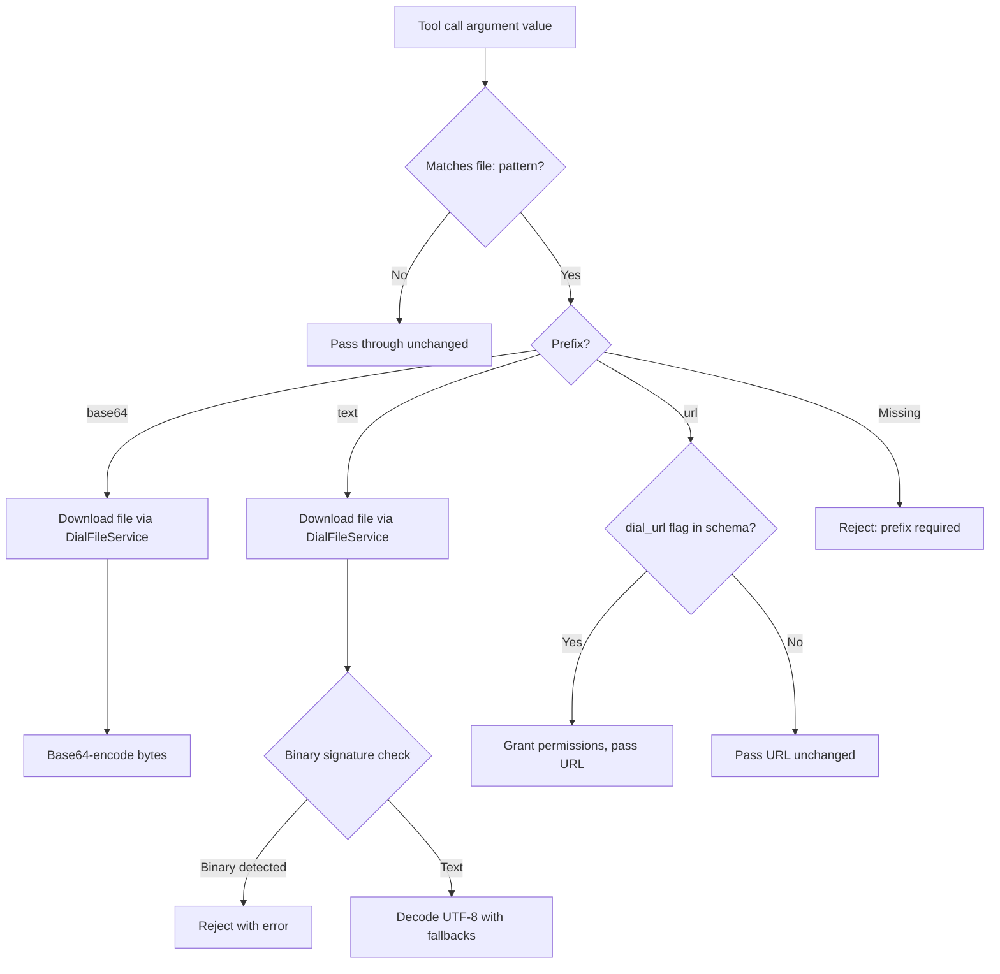

# Design: Agent Skills and File Transfer

**Status:** Implemented

## Problem Statement

Quick Apps agents interact with external tools (MCP, REST API, DIAL deployments) that accept file-related
parameters — base64-encoded content, plain text, or URL references. Today there is no structured way to teach an agent
**how** to format these parameters. Two symptoms follow:

1. **Agents guess file parameter formats.** When an MCP tool parameter expects base64-encoded content vs. a URL
   reference, the agent has no guidance and frequently picks the wrong one. There is no mechanism to provide
   tool-usage instructions that go beyond the OpenAI function schema's `description` field.

2. **The `content_downloader` tool is a poor fit.** The existing `content_downloader` internal tool downloads a file
   from DIAL Core, base64-encodes it, caches it in `StateHolder`, and tells the agent to pass the original URL to
   downstream tools. This works for one specific scenario (binary content) but cannot handle the text or URL-reference
   cases. It also forces an extra tool-call round-trip for every file, even when the downstream tool just needs a URL
   passed through.

3. **No extensibility model for agent instructions.** System prompt content is currently assembled from a single
   config-based prompt. There is no way to bundle reusable instruction sets ("skills") that can be discovered, read
   on demand, and extended by operators without modifying application code.

## Design Goals

- **Generic skills framework** that loads markdown instruction files with YAML frontmatter, exposes their metadata in
  the system prompt, and provides a `read_skill` tool for agents to retrieve full content at runtime — based on the
  [Agent Skills specification](https://agentskills.io/specification).
- **Builtin file transfer skill** that teaches agents the `file:{prefix}::{path}` parameter convention, replacing the
  `content_downloader` tool.
- **MCP-level parameter preprocessing** that intercepts the `file:{prefix}::` pattern in tool call arguments and
  resolves it to the correct format (base64, text, or passthrough URL) before forwarding to the MCP server.
- **Operator extensibility** via the existing layered predefined content system — custom skills are directories with
  `SKILL.md` dropped into an extra predefined layer.

---

## Proposed Design

### Skills framework

#### Relationship to the Agent Skills specification

This design implements the [Agent Skills specification](https://agentskills.io/specification). The following sections
describe what is supported, what is intentionally deferred, and where the implementation extends the spec.

**Supported: directory-based skill structure with `SKILL.md`.** Each skill is a **directory** inside the `skills/`
folder, containing a `SKILL.md` file with YAML frontmatter and Markdown instructions. This matches the spec's primary
requirement.

```
skills/
  tool-call-file-parameter-formatting/
    SKILL.md
  my-custom-skill/
    SKILL.md
```

**Supported: `name` must match directory name.** The `name` field in `SKILL.md` frontmatter must match the parent
directory name. A mismatch is logged as a warning and the skill is skipped. This enforces the spec's naming contract
and eliminates the ambiguity of decoupled names.

**Deferred: optional subdirectories (`scripts/`, `references/`, `assets/`).** The spec defines optional
subdirectories for three-tier progressive disclosure (metadata → instructions → resources). This implementation only
supports the first two tiers: metadata (frontmatter loaded at startup) and instructions (`SKILL.md` body loaded via
`read_skill`). The `scripts/`, `references/`, and `assets/` directories are **not scanned** and their contents are
not accessible to agents. This is sufficient for instruction-only skills (like file transfer formatting) and avoids the
complexity of script execution sandboxing and cross-file references. Support can be added in a future iteration.

**Deferred: no `<location>` in XML output.** The spec's integration guide includes a `<location>` element for
filesystem-based agents. This implementation follows the tool-based agent integration path (via `read_skill`), where
the spec says `<location>` can be omitted.

**Extension: `allowed-tools` accepts YAML list.** The spec defines `allowed-tools` as a space-delimited string. This
implementation additionally accepts a YAML list, normalizing both forms to `list[str]`. This is an intentional
convenience extension for operator-authored skills.

**Extension: case-insensitive prefix matching.** The `file:{prefix}::` pattern in MCP parameter preprocessing is
matched case-insensitively. `file:BASE64::...` and `file:Text::...` are valid and normalized to lowercase before
dispatch.

#### Skill file format

A skill is a **directory** inside the `skills/` subdirectory of a predefined content layer, containing a `SKILL.md`
file with YAML frontmatter followed by Markdown instructions.

```
<layer>/skills/
  my-skill-name/
    SKILL.md
```

`SKILL.md` format:

```yaml
---
name: my-skill-name            # required, must match directory name
description: What this skill does  # required, shown in system prompt
license: MIT                   # optional
compatibility: "gpt-4, gpt-4o" # optional
metadata:                      # optional, arbitrary key-value pairs
  version: "1.0"
allowed-tools:                 # optional, tool names this skill applies to
  - tool_a
  - tool_b
---

# Skill Title

Detailed instructions in Markdown...
```

**Validation rules** (enforced at load time, per the
[Agent Skills spec](https://agentskills.io/specification)):

| Field           | Constraint                                                                                              |
|-----------------|---------------------------------------------------------------------------------------------------------|
| `name`          | Required. Max 64 chars. Lowercase alphanumeric + hyphens. No leading/trailing hyphens. No consecutive hyphens (`--`). **Must match the parent directory name.** |
| `description`   | Required. Max 1024 chars.                                                                               |
| `compatibility` | Optional. Max 500 chars (truncated with warning if exceeded).                                           |
| `allowed-tools` | Optional. String (space-separated) or YAML list; normalized to `list[str]`.                             |

Directories without a `SKILL.md` file are silently ignored. Skills that fail validation (including name mismatch with
directory) are skipped with a warning log. The application continues to start — a malformed skill does not prevent
serving requests.

#### `AgentSkillsProvider` — singleton skill registry

**Owner:** `skills/` package.
**What:** Loads all skill files from `PredefinedContentProvider` at startup, parses frontmatter, validates metadata,
caches content, and generates an XML metadata block for the system prompt.

**Semantics:**

- Delegates all file I/O to `PredefinedContentProvider` (see
  [Layered Predefined Configuration](layered_predefined_config.md)).
- Iterates skill names in the order returned by `PredefinedContentProvider.list_names()`, which is **sorted
  alphabetically** by directory name.
- Validates that the frontmatter `name` matches the directory name (provided by the provider as the key). A mismatch
  is logged as a warning and the skill is skipped. This enforces the spec's naming contract.
- Since the directory name _is_ the skill identity, and the provider merges by directory name across layers (last wins),
  duplicate skill names cannot occur within a single merged set. No deduplication logic is needed.
- Implements `PromptPartProvider` — its `get_prompt_part()` returns the XML metadata block.

**XML output format** (injected into the system prompt):

```xml
<available_skills>
  <skill>
    <name>my-skill-name</name>
    <description>What this skill does</description>
    <allowed_tools>tool_a tool_b</allowed_tools>
    <metadata>
      <entry key="version">1.0</entry>
    </metadata>
  </skill>
</available_skills>
```

The agent sees this block in its system prompt and can decide when to read a skill's full content.

#### `PromptPartProvider` — composable system prompt

**Owner:** `common/abstract/` package.
**What:** An abstract base class with a single method `get_prompt_part() -> str`. Multiple implementations contribute
fragments that `_AddSystemPromptTransformer` joins with `\n\n` into the final system message.

**Implementations:**

| Provider                  | Registered by    | Content                                       |
|---------------------------|------------------|-----------------------------------------------|
| `ConfigBasedPromptProvider` | `AgentModule`    | System prompt from application config          |
| `AgentSkillsProvider`      | `SkillsModule`   | XML metadata of available skills               |

This decouples prompt assembly from individual content sources. Adding a new prompt contributor requires only
implementing the interface and registering the provider via DI.

**Precondition:** `_AddSystemPromptTransformer` only inserts a new system message when `messages[0]` is not already a
system message. If a system message exists at index 0 (e.g. from packed-state replay of a prior turn), the transformer
returns messages unchanged and the assembled prompt parts are not re-injected. This is the correct behavior for
multi-turn conversations where the system prompt is already present in history, but it means the transformer must run
before any other transformer that might prepend a system message.

#### `_SkillReaderTool` — on-demand skill retrieval

**Owner:** `skills/` package.
**What:** An internal tool (`read_skill`) that the agent calls to retrieve the full Markdown content of a skill by
name.

**Tool schema:**

| Field       | Value                                                                  |
|-------------|------------------------------------------------------------------------|
| Name        | `read_skill`                                                           |
| Parameter   | `skill_name` (string, required)                                        |
| Description | Read the full content of an agent skill from the available skills list. |

**Semantics:** Looks up the skill name in `AgentSkillsProvider`'s cache and returns the **raw file content** (the full
Markdown including the YAML frontmatter block). Returns an error message (not an exception) if the skill is not found,
keeping the orchestrator loop running.

#### `_SkillsInitializer` — startup scaffolding

**Owner:** `skills/` package.
**What:** A `StartupInitializer` that calls `AgentSkillsProvider.get_skills_xml()` during request setup.

**Note:** Currently this is effectively a no-op because `AgentSkillsProvider` is a singleton whose `__init__` already
calls `_load_skills()` eagerly — by the time the initializer runs, skills are already loaded and `get_skills_xml()`
returns a cached string. The initializer exists as scaffolding to follow the `StartupInitializer` pattern established
by other modules, and to provide a hook point if the provider is later changed to lazy-load skills.

#### `SkillsModule` — DI wiring

**Owner:** `skills/` package.
**What:** Injector `Module` that registers all skills-related components.

**Registrations:**

| Binding                                          | Scope         | Multiprovider target       |
|--------------------------------------------------|---------------|----------------------------|
| `AgentSkillsProvider`                            | Singleton     | —                          |
| `_SkillsInitializer`                             | Request scope | `list[StartupInitializer]` |
| `_SkillReaderTool`                               | Request scope | `list[StagedBaseTool]`     |
| `AgentSkillsProvider` as `PromptPartProvider`    | —             | `list[PromptPartProvider]` |
| `_InjectFileTransferInstructionTransformer`      | Request scope | `list[MessagesTransformer]`|

#### Impact on `PredefinedContentProvider` — directory-based skill scanning

**Owner:** `config/` package.
**What:** `PredefinedContentProvider._load_all()` gains a special case for `ContentType.SKILL` to scan skill
directories instead of flat files.

**Change:** For all content types except `SKILL`, the existing logic is unchanged — glob for `*.md` or `*.json` files,
key by filename stem. For `SKILL`, the scanning logic becomes:

1. Iterate sorted subdirectories of `<layer>/skills/`.
2. For each subdirectory, look for `SKILL.md` inside it.
3. If `SKILL.md` exists, read its content and store it keyed by the **directory name** (not the file stem, which is
   always `SKILL`).
4. If the directory has no `SKILL.md`, skip it silently (it may contain other files unrelated to skills).

**Merge semantics:** Unchanged — "last wins by name" across layers. The name is now the directory name rather than a
file stem, but the merging behavior is identical. An override layer can replace a built-in skill by providing a
directory with the same name.

**Public API:** Unchanged. `list_names(ContentType.SKILL)` returns sorted directory names.
`read_text(ContentType.SKILL, name)` returns the content of `SKILL.md` from the named directory. Callers
(`AgentSkillsProvider`) are unaffected.

### File transfer skill

#### Builtin skill: `tool-call-file-parameter-formatting`

**Owner:** `config/predefined/skills/tool-call-file-parameter-formatting/SKILL.md`.
**What:** A built-in skill that teaches the agent the `file:{prefix}::{path_or_url}` convention for tool call
parameters.

**Three prefixes:**

| Prefix   | When to use                                                                 | Runtime behavior                                   |
|----------|-----------------------------------------------------------------------------|----------------------------------------------------|
| `base64` | Tool parameter expects raw/encoded file content (images, PDFs, binary)      | File downloaded from DIAL Core, base64-encoded      |
| `text`   | Tool parameter expects plain text content (code, logs, markdown)            | File downloaded, decoded as UTF-8 with fallbacks    |
| `url`    | Tool parameter expects a URL/path reference                                 | URL passed through; permissions granted if `dial_url` |

The skill contains a decision process for the agent: inspect the tool's parameter name and description, deduce the
expected format, and apply the correct prefix. Multiple examples illustrate each case.

#### `_InjectFileTransferInstructionTransformer` — synthetic injection

**Owner:** `skills/` package.
**What:** A `MessagesSetupTransformer` that injects a synthetic `read_skill` tool call + response into the message
history at request setup, ensuring the agent sees the file transfer instructions before processing any user message.

**Semantics:**

- Runs once during `_MessagesSetup` (before the orchestrator loop).
- Creates a synthetic assistant message with a `ToolCall` (id: `synthetic_file_transfer_instruction`) and a
  corresponding tool response containing the full skill Markdown.
- Inserts after the system message if one exists, otherwise at the start of the history.
- Idempotent: checks for the synthetic tool call ID before injecting. Packed-state replay (multi-turn conversations)
  will already contain it.

This pattern — synthetic tool-call injection — makes the skill content appear as if the agent already read it, without
consuming an actual orchestrator iteration.

#### MCP parameter preprocessing

**Owner:** `mcp_tooling/` package.
**What:** `_MCPTool._pre_process_params()` intercepts the `file:{prefix}::{value}` pattern in tool call arguments
and resolves it before forwarding to the MCP server.

**Pattern:** `^/*file:(?:(?P<prefix>base64|url|text)::)?(?P<file_url>.+)$` (case-insensitive).

**Processing by prefix:**



**`FilePrefixHandlers`** — static handler methods for each prefix:

- `handle_base64(file_url, file_service)` — downloads and base64-encodes.
- `handle_text(file_url, file_service, parameter_name)` — downloads, detects binary signatures (PNG, JPEG, GIF, PDF,
  ZIP), decodes text with `utf-8-sig` → `latin-1` → `utf-8` (replacement) fallback chain.

**`DialFileService`** — request-scoped service for file operations:

- `download_file(url)` — downloads from DIAL Core with `StateHolder` caching. Rejects files exceeding **10 MB**
  (hardcoded limit). Downloaded bytes are cached in `StateHolder` for the request duration to avoid re-downloading the
  same file across multiple tool calls.
- `grant_permissions_to_files(urls, toolset_id)` — grants DIAL Core file access to a toolset (needed for `url` prefix
  with `dial_url` parameters).

#### Retry strategy for invalid parameters

**Owner:** `common/` package (exception, fallback handler) + `mcp_tooling/` package (raise sites).
**What:** When MCP parameter preprocessing detects an invalid `file:` value, it raises
`InvalidToolCallParameterException`. `StagedBaseTool` catches this exception and returns a retry fallback response
instead of propagating the error, giving the agent a chance to re-attempt the tool call with corrected parameters.

**Exception:** `InvalidToolCallParameterException(parameter_name, message)` — a `ValueError` subclass carrying the
offending parameter name and a human-readable error description. Raised in the following cases:

| Raise site | Condition |
|------------|-----------|
| `_MCPTool._pre_process_params()` | `file:` pattern matched but prefix is missing (`file::path` instead of `file:text::path`) |
| `_MCPTool._pre_process_params()` | `dial_url` parameter detected but `dial_toolset_id` is not configured |
| `FilePrefixHandlers.handle_base64()` | Downloaded content cannot be coerced to bytes |
| `FilePrefixHandlers.handle_text()` | Downloaded content cannot be coerced to bytes |
| `FilePrefixHandlers.handle_text()` | Binary signature detected (file is not text) |

**Recovery flow:** `StagedBaseTool.arun()` catches `InvalidToolCallParameterException` before the generic `Exception`
handler. Instead of applying the tool's configured fallback strategies, it constructs an inline `RetryStrategyModel`
with instructions describing the invalid parameter and error message. `FallbackProcessor.process_fallback()` returns
a `CompletionResult` containing the retry instructions, which the orchestrator delivers back to the LLM as a tool
response. The agent sees the error description and can re-attempt the tool call with corrected parameters in the next
iteration.

**`RetryStrategyModel`** — a new tool fallback strategy configuration alongside the existing `stop` and `continue`
strategies. Unlike `ContinueStrategyModel` where `instructions` is optional, `RetryStrategyModel` requires
`instructions` (the LLM needs guidance on what to fix). `RetryStrategyModel` is part of the `ToolFallbackStrategyModel`
discriminated union, so operators can technically use `type: retry` in application configs. However, its primary
purpose is internal — the `InvalidToolCallParameterException` handler constructs it inline. It is not documented for
operator use.

**`_pre_process_params()` is now async.** The base method in `StagedBaseTool` changed from `def` to `async def` to
support the async file download operations in `_MCPTool`'s override.

---

## Secondary Fixes

### Removal of `content_downloader` tool

The `content_downloader` internal tool (`_ContentDownloadTool`, `_ContentDownloaderStageWrapper`,
`config/predefined/tool/content_downloader.json`) is removed. It performed a single-purpose file download + base64
encode + cache cycle that is now handled more flexibly by the file transfer skill + MCP preprocessing pipeline.

**What was removed:**

| Component                             | Description                                                  |
|---------------------------------------|--------------------------------------------------------------|
| `_ContentDownloadTool`                | Internal tool implementation                                 |
| `_ContentDownloaderStageWrapper`      | Stage wrapper for UI display                                 |
| `content_downloader.json`             | Predefined tool configuration                                |
| `InternalToolModule` registration     | Builder and conditional registration for `content_downloader` |

**Why replaced:** The content downloader only supported one mode (download → base64 → cache → tell agent to pass URL).
The new approach supports three modes (base64, text, url), does not require an extra tool-call round-trip, and
integrates directly into MCP parameter preprocessing.

### Removal of `AgentInstructionsProvider`

`AgentInstructionsProvider` was a singleton that loaded all `.md` files from `config/predefined/instructions/`,
concatenated them, and appended the combined text to the system prompt via `_AddSystemPromptTransformer`. It performed
its own file scanning (`Path.glob("*.md")`) directly — there was no `ContentType.INSTRUCTION` variant or shared
provider. The `PREDEFINED_BASE_PATH` setting controlled the base directory.

**What was removed:**

| Component                                 | Description                                                          |
|-------------------------------------------|----------------------------------------------------------------------|
| `AgentInstructionsProvider`               | Singleton that loaded and concatenated instructions `.md` files      |
| `instructions/` directory convention      | The `config/predefined/instructions/` scanning path                  |
| `AgentModule` registration                | Singleton binding for `AgentInstructionsProvider`                     |
| Direct injection in `_AddSystemPromptTransformer` | Replaced by `list[PromptPartProvider]` multi-provider pattern |

**Why replaced:** The instructions mechanism was a single-purpose, hardcoded prompt extension point. The
`PromptPartProvider` abstraction generalizes this — any module can contribute system prompt content by implementing
the interface and registering via DI. Operators who previously used the `instructions/` directory can migrate their
content to skills, which offer richer metadata (name, description, allowed tools) and on-demand retrieval via
`read_skill`.

---

## Out of Scope

- **Nested object handling in MCP parameters.** The `file:` pattern matching in `_pre_process_params()` only scans
  top-level string values. Nested objects and arrays are not traversed. This is noted as a PoC limitation in the code
  and can be addressed in a follow-up when a concrete use case arises.

- **Skill subdirectories (`scripts/`, `references/`, `assets/`).** The spec defines optional subdirectories for
  bundled scripts, reference docs, and static assets. Only `SKILL.md` is read; other contents of the skill directory
  are ignored. Support can be added when a concrete use case arises (e.g. a skill that needs executable scripts or
  lookup tables).

- **Skill-to-tool binding enforcement.** The `allowed_tools` frontmatter field is exposed in the XML metadata but not
  enforced at runtime — the agent can read any skill regardless of which tools are configured. Enforcement could be
  added if skills grow to contain sensitive instructions.

- **Dynamic skill registration.** Skills are loaded once at startup from predefined content layers. Runtime
  registration of skills (e.g. from user-uploaded files) is not supported.

- **Non-MCP tool preprocessing.** The `file:{prefix}::` pattern is only processed in `_MCPTool._pre_process_params()`.
  REST API tools and DIAL deployment tools do not support this pattern. Extending it would require lifting the
  preprocessing to `StagedBaseTool` or a shared mixin.

- **Hot-reloading of skills.** Skills are loaded once at singleton construction time. Adding, modifying, or removing
  skill files requires an application restart. Hot-reloading could be added if a concrete use case arises.

### Known Limitations

- **File transfer injection is unconditional.** `_InjectFileTransferInstructionTransformer` always injects the file
  transfer skill, even when the application has no MCP tools configured (REST API-only or deployment-only apps). This
  wastes context tokens and may confuse the agent with irrelevant instructions. A future improvement should gate
  injection on whether MCP toolsets are present in the application config.

- **Binary signature detection is non-exhaustive.** `FilePrefixHandlers.handle_text` checks 5 binary signatures (PNG,
  JPEG, GIF, PDF, ZIP). Other binary formats (WEBP, TIFF, BMP, WOFF, MP3/MP4, DOCX/XLSX) would pass the check and
  produce garbled text output. A more robust approach would be a null-byte / non-printable-byte ratio heuristic on the
  first N bytes of the file.

- **Text decoding fallback chain has unreachable branch.** The chain `utf-8-sig` → `latin-1` → `utf-8`(replacement) in
  `handle_text` has a dead third branch because `latin-1` maps all 256 byte values and never raises
  `UnicodeDecodeError`. Harmless but misleading — the third branch should be removed or `latin-1` replaced with a more
  selective encoding (e.g. `cp1252`).

---

## Configuration / Usage Examples

### Adding a custom skill

1. Create a skill directory with a `SKILL.md` file:

```
/custom/config/skills/
  my-custom-analysis/
    SKILL.md
```

`SKILL.md` content:

```markdown
---
name: my-custom-analysis
description: Instructions for analyzing customer data with the analytics tool.
allowed-tools:
  - run_analytics
metadata:
  version: "1.0"
---

# Customer Data Analysis

When using the `run_analytics` tool, always include...
```

Note: the `name` field **must match** the directory name (`my-custom-analysis`).

2. Point the extra layer at the config directory:

```bash
PREDEFINED_EXTRA_PATHS=/custom/config
```

3. The skill appears in the system prompt XML and is readable via `read_skill`.

### Agent interaction flow

```
System prompt includes:
  <available_skills>
    <skill>
      <name>tool-call-file-parameter-formatting</name>
      <description>Formats file and URL parameters for tool calls...</description>
    </skill>
    <skill>
      <name>my-custom-analysis</name>
      <description>Instructions for analyzing customer data...</description>
    </skill>
  </available_skills>

[Synthetic injection - appears as if agent already called read_skill for file transfer]

User: "Analyze the uploaded spreadsheet using the analytics tool"

Agent thinks: I have file transfer instructions, the analytics tool expects text content...
Agent calls: run_analytics(data="file:text::files/bucket/spreadsheet.csv")

MCP preprocessing: downloads file, decodes as UTF-8, passes text content to MCP server
```

### File prefix examples

| Scenario                          | Tool parameter description          | Correct prefix | Formatted value                             |
|-----------------------------------|-------------------------------------|----------------|---------------------------------------------|
| Image analysis                    | "base64 encoded image data"         | `base64`       | `file:base64::files/images/chart.png`       |
| Code review                       | "text content of the source file"   | `text`         | `file:text::files/code/main.py`             |
| Web scraping                      | "URL to navigate to"                | `url`          | `file:url::https://example.com/page`        |
| Document processing (binary)      | "the file to process"               | `base64`       | `file:base64::files/docs/report.pdf`        |
| File sharing with DIAL deployment | "file_url" with `dial_url: true`    | `url`          | `file:url::files/shared/data.json`          |

---

## Migration

### Breaking changes

#### `content_downloader` tool removed

Application configs referencing `content_downloader` in `InternalToolSet` will have the tool silently skipped.
Agents that relied on it will no longer have it available.

**Mitigation:** Remove `content_downloader` from application configs. File handling is now automatic via MCP
preprocessing.

#### `AgentInstructionsProvider` removed

The `instructions/` predefined content directory convention is removed. Operators who placed `.md` files in
`config/predefined/instructions/` (or `PREDEFINED_BASE_PATH/instructions/`) to have their content appended to the
system prompt will lose that functionality.

**Mitigation:** Migrate instructions to the skills framework. For each instructions `.md` file, create a skill
directory under `skills/` with a `SKILL.md` file containing proper YAML frontmatter (`name`, `description`) followed
by the original instruction content. Skills are surfaced in the system prompt via the `<available_skills>` XML block
and can be read on demand by the agent via the `read_skill` tool.

### Non-breaking changes

- System prompt now includes `<available_skills>` XML block. Existing agents receive additional context but their
  behavior is unchanged if they don't use the `read_skill` tool.
- MCP tool calls that don't use the `file:` prefix are unaffected — `_pre_process_params()` only activates on
  matching patterns.
- The `read_skill` tool is registered alongside existing internal tools without affecting them.

---

## Summary of Changes

| Component                                           | Change                                                                                     |
|-----------------------------------------------------|--------------------------------------------------------------------------------------------|
| **`skills/` package** (new)                         | New package with skills framework: provider, reader tool, transformer, DI module            |
| **`AgentSkillsProvider`** (new)                     | Singleton that loads skills, parses frontmatter, validates name-to-directory match, generates XML, caches content |
| **`_SkillReaderTool`** (new)                        | Internal tool for on-demand skill content retrieval                                        |
| **`_InjectFileTransferInstructionTransformer`** (new) | Message transformer injecting synthetic file transfer skill at request setup               |
| **`_SkillsInitializer`** (new)                      | Startup initializer for eager skill loading                                                |
| **`SkillsModule`** (new)                            | DI module wiring all skills components                                                     |
| **`PromptPartProvider`** (new)                      | ABC for composable system prompt fragments                                                 |
| **`ConfigBasedPromptProvider`** (new)               | Extracts existing config prompt logic into a `PromptPartProvider` implementation            |
| **`_AddSystemPromptTransformer`**                   | Modified to collect and join multiple `PromptPartProvider` parts instead of single prompt   |
| **`PredefinedContentProvider`**                     | `_load_all()` gains directory-based scanning for `ContentType.SKILL` (subdirectories with `SKILL.md`) |
| **`tool-call-file-parameter-formatting/SKILL.md`** (new) | Built-in skill with file parameter formatting instructions                              |
| **`FilePrefixHandlers`** (new)                      | Static handlers for `base64`, `text` prefix resolution                                     |
| **`_MCPTool._pre_process_params()`**                | Added `file:{prefix}::` pattern detection and prefix-based preprocessing                   |
| **`DialFileService`** (new)                         | Request-scoped service for DIAL Core file download and permission management               |
| **`DialCoreClient`**                                | Existing methods (`get_metadata()`, `get_file()`, `grant_permissions()`) now consumed by `DialFileService` |
| **`InvalidToolCallParameterException`** (new)       | Exception for invalid `file:` parameter values; triggers retry fallback                    |
| **`RetryStrategyModel`** (new)                      | New tool fallback strategy type with required `instructions` field                         |
| **`RetryStrategyHandler`** (new)                    | Fallback handler that returns retry instructions to the agent                              |
| **`StagedBaseTool`**                                | Catches `InvalidToolCallParameterException` for retry; `_pre_process_params()` now async   |
| **`AgentInstructionsProvider`** (removed)            | Replaced by the `PromptPartProvider` abstraction; `instructions/` directory convention removed |
| **`_ContentDownloadTool`** (removed)                | Replaced by file transfer skill + MCP preprocessing                                       |
| **`_ContentDownloaderStageWrapper`** (removed)      | Removed with content downloader                                                            |
| **`content_downloader.json`** (removed)             | Predefined tool config removed                                                             |
| **`AppFactory`**                                    | `SkillsModule` added to injector module list                                               |

---

## Implementation Fixes (from review)

The following bugs/improvements were identified during design review and require code changes:

1. **Builtin skill file:** Create `config/predefined/skills/tool-call-file-parameter-formatting/SKILL.md` with the
   file transfer skill content in the directory-based layout.
2. **`predefined_content_provider.py`:** Add directory-based scanning for `ContentType.SKILL` in `_load_all()` —
   iterate subdirectories looking for `SKILL.md` instead of globbing `*.md` files. Key stored content by directory
   name.
3. **`agent_skills_provider.py`:** Add name-to-directory validation in `_load_skills()` — verify `metadata.name`
   matches the directory name (provider key) and skip with warning if not. Remove duplicate-name deduplication logic
   (no longer needed since directory names are unique within a merged layer). Update name validation regex to reject
   consecutive hyphens (`--`) per the Agent Skills spec.
4. **`_mcp_tool.py`:** Add `kwargs[key] = file_url_part` to the `dial_url` branch in `_pre_process_params()`. Currently
   the MCP server receives the raw `file:url::...` string instead of the stripped URL when `dial_url` is true.
5. **`_file_prefix_handlers.py`:** Remove unreachable third fallback in `handle_text` text decoding chain (`latin-1`
   never raises `UnicodeDecodeError`).
6. **Test coverage:** Add unit tests for `AgentSkillsProvider` (frontmatter parsing, XML generation, skill loading,
   name-to-directory validation), `_SkillReaderTool`, `FilePrefixHandlers`, `_MCPTool._pre_process_params` (including
   `kwargs[key]` update in both `dial_url=true` and `dial_url=false` branches), and `DialFileService`.
