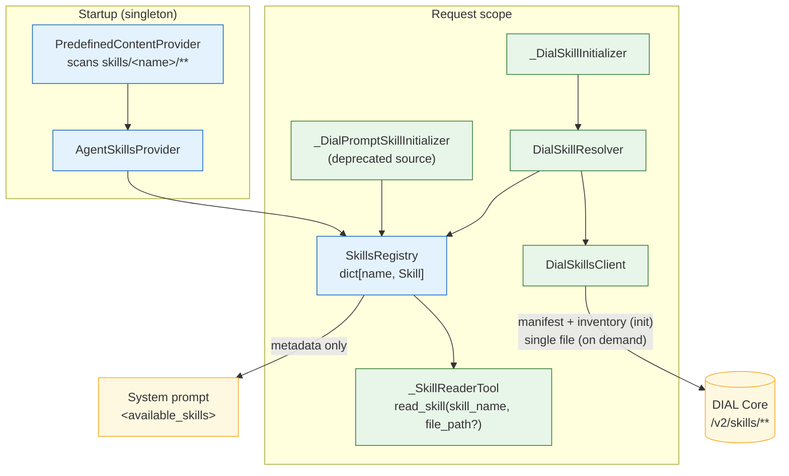
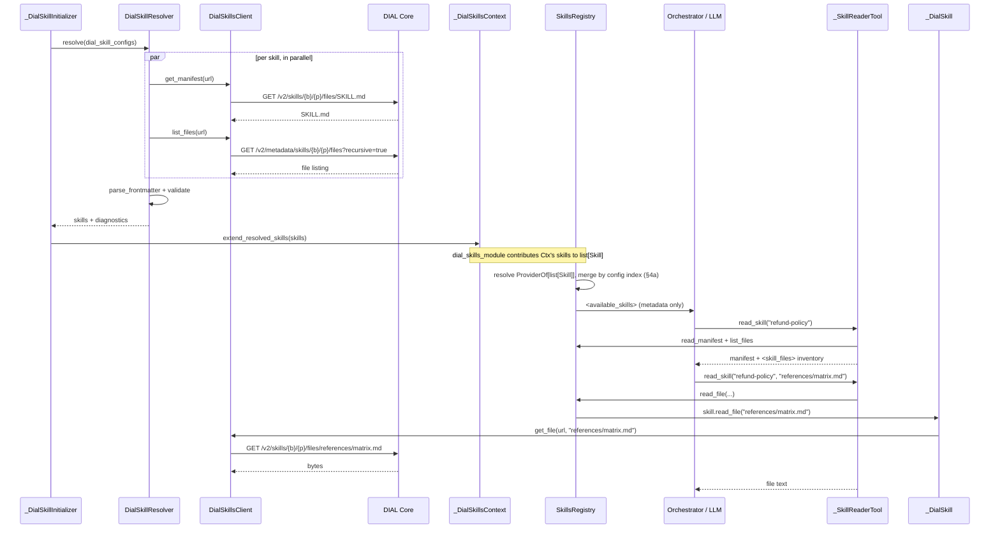

# Design: Skills as DIAL Resource

- **Status:** Approved
- **Delivery:** Split into phases — see [Delivery phases](#delivery-phases). This document describes the
  design *whole*; Phase 1 implements a subset of it. Sections marked **(Phase 2)** or **(Phase 3)** are
  designed but not yet built.
- **Dependencies:**
  - [`skills_and_file_transfer.md`](skills_and_file_transfer.md) — the original skills framework (`SKILL.md`, `read_skill`, `<available_skills>`)
  - [`dial_prompts_as_skills.md`](dial_prompts_as_skills.md) — the `dial-prompt` skill source this design deprecates
  - [ai-dial-core#1633] — *DIAL Folder As Resource* (**delivered**: `SKILL` resource type, `/v2/skills/**` API, sharing, publication)
  - Tracked by [#418] (*Skill artifacts support*) under EPIC [#421] (*Advanced Agent Skills support*)

---

## Problem Statement

QuickApps knows exactly one shape of skill: **a single Markdown document**.

| Source        | Location                                  | Loaded          | Shape        |
|---------------|-------------------------------------------|-----------------|--------------|
| Predefined    | `config/predefined/skills/<name>/SKILL.md` | Startup, cached | One document |
| DIAL prompt   | `prompts/<bucket>/<path>`                  | Per request     | One document |

The directory layout is already there but unused: `PredefinedContentProvider.__scan_entries` iterates each skill
directory and reads **only** `SKILL.md`, dropping every sibling file. `AgentSkillsProvider` caches
`dict[skill_name, str]`, `SkillsRegistry` merges two such dicts, and `_SkillReaderTool` returns the string. There is
nowhere in this pipeline for a skill to keep `references/`, `scripts/`, or `assets/`.

Observable symptoms:

1. **Spec-compliant skills silently degrade.** A `SKILL.md` that says *"consult `references/api-schema.md` before
   composing a request"* produces a dangling pointer: the agent has no tool that can open the file, so it either
   hallucinates the content or ignores the instruction. `docs/skills.md` documents this as
   *"Optional subdirectories — Not supported"* and *"Progressive disclosure — Not supported"*.
2. **No progressive disclosure.** Everything a skill wants the agent to know must fit in the one document
   `read_skill` returns, and that document is returned whole. The spec's core economy — a short manifest plus
   on-demand detail — is unavailable, so skill authors must choose between a bloated manifest and an incomplete one.
3. **`dial-prompt` is a workaround, not a home.** A DIAL prompt is a text blob. It cannot hold binaries, it is not
   addressable as a skill, and its share/publish lifecycle is the *prompt* lifecycle. Users who want a real skill get
   a document that merely looks like one.
4. **Authoring predefined skills is an ops task.** They are baked into the image (or a `PREDEFINED_EXTRA_PATHS`
   layer) and require a restart. There is no user-owned, editable skill storage.

Meanwhile DIAL Core has shipped the missing primitive. [ai-dial-core#1633]
introduced a generic **folder-as-resource** model with skills as its first concrete type:

- A new `SKILL` resource type with URL group `skills`, invisible to the v1 `files` API.
- A folder becomes a resource by carrying a `.dial-resource` marker; the marker points at an immutable
  `v/{versionId}/` subtree and is the single atomic commit point for any mutation.
- A `/v2/skills/**` API family with whole-resource, **single-file**, and metadata-listing operations.
- Server-side validation (`SKILL.md` at root with parseable frontmatter carrying `name` and `description`) —
  the same contract QuickApps' `parse_frontmatter` enforces.
- Integration with access control, sharing (`ShareResourceLimit(10, 72)` for `SKILL`) and publication
  (review → public), so a skill is shareable and publishable **as a unit**.

The primitive exists and is validated at the same contract QuickApps already speaks. The gap is entirely on the
QuickApps side: nothing here can address a `skills/<bucket>/<path>` URL, and the internal skill model has no room
for a second file.

---

## Design Goals

- **G1** — QuickApps can use a DIAL skill resource (`skills/<bucket>/<path>`) as a skill source, configured per app.
- **G2** — A skill is modelled as a *manifest plus a file tree*, not a string. All three sources (predefined,
  DIAL prompt, DIAL skill resource) present the same model, so the agent's experience does not depend on provenance.
- **G3** — The agent can read a bundled file on demand (progressive disclosure) without downloading the whole skill.
- **G4** — Reading a bundled file costs **one** Core round-trip; no whole-archive download per reference.
- **G5** — Nothing about a skill's file tree enters the system prompt uninvited: `<available_skills>` stays metadata-only,
  and the file inventory is disclosed only when the agent actually reads the skill.
- **G6** — Existing app configs keep working unchanged; `dial-prompt` continues to function while deprecated.
- **G7** — Failures are soft and observable: an unreachable, malformed, or forbidden skill is skipped with a
  diagnostic in the existing *Initialization issues* stage, never a failed request.
- **G8** — Memory and token cost are bounded by explicit, configurable limits on both file size and inventory size.

---

## Use Cases

### UC-1: Reference a DIAL skill resource from an app config

**Trigger:** A user creates a skill in DIAL (via Chat's editor or the `/v2/skills` API) at
`skills/<bucket>/support/refund-policy`, then adds it to their QuickApp config's `skills` list with
`{"type": "dial-skill", "url": "skills/<bucket>/support/refund-policy"}`.
**Behavior:** At request initialization QuickApps fetches the skill's `SKILL.md` and its file inventory, validates the
frontmatter, and merges the skill into the registry.
**Outcome:** The skill's `name`/`description` appear in the `<available_skills>` block of the system prompt, exactly
as a predefined skill would.

### UC-2: Agent reads the manifest

**Trigger:** The model decides the `refund-policy` skill is relevant and calls `read_skill(skill_name="refund-policy")`.
**Behavior:** QuickApps returns the `SKILL.md` body, followed by an inventory of the skill's other files.
**Outcome:** The agent sees the instructions *and* learns which bundled files exist, in one call.

### UC-3: Agent reads a bundled reference file

**Trigger:** The manifest (or the inventory from UC-2) points at `references/refund-matrix.md`; the model calls
`read_skill(skill_name="refund-policy", file_path="references/refund-matrix.md")`.
**Behavior:** QuickApps issues a single `GET /v2/skills/{bucket}/support/refund-policy/files/references/refund-matrix.md`
and returns the text.
**Outcome:** The agent gets exactly the detail it asked for, and no other bundled file has consumed a token.

### UC-4: Predefined skill with bundled files

**Trigger:** An operator ships `config/predefined/skills/data-analysis-helper/` containing `SKILL.md` and
`references/plotting-cookbook.md` (or layers it in via `PREDEFINED_EXTRA_PATHS`).
**Behavior:** At startup the provider reads `SKILL.md` and walks the directory for the file inventory — names only,
no content. `references/plotting-cookbook.md` is read from disk only if the agent asks for it.
**Outcome:** Predefined and DIAL-resource skills behave identically from the agent's point of view.

### UC-5: Shared skill

**Trigger:** A colleague shares their skill resource with the user; the user references it by its URL in their app config.
**Behavior:** Core's auto-share path grants the app's per-request key read access to the referenced skill, and QuickApps
reads it normally.
**Outcome:** The skill loads. **Today this path does not work** — see [Core Dependencies](#core-dependencies-and-known-gaps),
gap **C-1**.

### UC-6: Broken or inaccessible skill

**Trigger:** A configured skill URL 404s, returns 403, or its `SKILL.md` has invalid frontmatter.
**Behavior:** The skill is skipped; a `SkillInitializationException` carrying the URL and reason is recorded.
**Outcome:** The request is served with the remaining skills, and the issue is visible in the *Initialization issues* stage.

---

## Proposed Design

Five orthogonal concerns:

| # | Concern                | Owner                                            |
| - | ---------------------- | ------------------------------------------------ |
| 1 | Skill model            | `skills/` — `Skill` and friends                  |
| 2 | Config surface         | `config/skill.py`                                |
| 3 | Core v2 read client    | `dial_skills/_dial_skills_client.py`             |
| 4 | Resolution lifecycle   | `dial_skills/` package                           |
| 5 | Progressive disclosure | `skills/_skill_reader_tool.py`, `skills/_xml.py` |

**Traceability against [#418].** The issue states three requirements; two are delivered as asked, the third cannot be
delivered as written against the shipped Core:

| [#418] requirement | Where | Status |
|------------------|-------|--------|
| *"Load the full skill folder, not just `SKILL.md`, tolerating an arbitrary file hierarchy"* | §1 `Skill`, §3 inventory call, §6 predefined folders | Delivered as asked |
| *"Give the agent on-demand access to bundled files (progressive disclosure), e.g. by extending the `read_skill` tool or the file-reference scheme"* | §5 | Delivered via `read_skill`; the file-reference scheme is a **complement, not an alternative** — see [A-1](#a-1--expose-skill-files-through-the-file-reference-scheme-instead-of-read_skill) |
| *"Consume Core's metadata listing (name/description/version) for registry population and the aggregate etag as a cheap change signal for caching"* | §3, §8 | **Not deliverable as written** — the shipped listing carries neither (gaps **C-2**, **C-3**); see [A-4](#a-4--populate-the-registry-from-cores-metadata-listing-instead-of-reading-each-manifest) |

The issue's *"Depends on"* note is also stale: it lists per-resource limits, metadata listing, access control, and
sharing/publication as still open, but all of [ai-dial-core#1633]'s child issues are closed and each of those is present in
`ai-dial-core@development`. The one thing that genuinely does not work is narrower and is not mentioned there —
auto-sharing a config-declared skill to the app's per-request key (**C-1**).



### 1. One skill model for every source: `Skill`

**What.** A skill stops being a string and becomes an object: metadata that is always resident, plus lazily
readable content. It is named `Skill` — the domain noun the rest of the system already speaks (`read_skill`,
`<available_skills>`, `SkillsRegistry`) — rather than `SkillHandle`. "Handle" implies an owned resource with a
lifecycle to release, which is what the repo's `_SessionHandle` is (an asyncio task plus ready/shutdown events);
this type owns nothing and needs no closing, so the suffix would be ceremony.

Two neighbours need separating from it, since the package will advertise all three side by side. `SkillMetadata`
remains the frontmatter record a `Skill` carries. The existing `ParsedSkill` — the result of `parse_frontmatter`,
carrying metadata plus non-fatal warnings — is **not** a kind of `Skill`: it has no content, no `source`, no
`url`, and no `read_file`. It is renamed `ParsedFrontmatter`, which is what it has always been; the rename touches
four files (`_skill_metadata.py`, `_frontmatter.py`, `dial_prompt_skills/_dial_prompt_skill_resolver.py`, and
`tests/unit_tests/skills_tests/test_agent_skills_provider.py`, which imports and asserts on it) and no public
surface. New types in `quickapp/skills/`:

```python
class SkillSourceKind(StrEnum):
    PREDEFINED = "predefined"
    DIAL_PROMPT = "dial-prompt"      # deprecated source
    DIAL_SKILL = "dial-skill"

class SkillFileEntry(BaseModel):     # frozen
    path: str                        # POSIX, relative to the skill root, e.g. "references/api.md"
                                     # a model, not a bare str: the seam for `size` once C-4 lands

class SkillFileContent(BaseModel):   # frozen
    path: str
    text: str
    content_type: str

class Skill(ABC):
    metadata: SkillMetadata          # always resident — feeds <available_skills>
    source: SkillSourceKind
    url: str | None                  # None for predefined
    config_index: int | None         # position in ApplicationConfig.skills; None for predefined

    def read_manifest(self) -> str: ...                         # resident by contract, no I/O
    def list_files(self) -> list[SkillFileEntry]: ...           # resolved at init, no I/O
    async def read_file(self, relative_path: str) -> SkillFileContent: ...
```

Provenance (`source`, `url`) lives on the `Skill`, not on `SkillMetadata`, whose stated contract is
*"metadata extracted from a skill file's YAML frontmatter"* — and neither field comes from frontmatter. Every
diagnostic §4 and §4a describe is raised where the `Skill` is in scope, so it is a sufficient home.

Every implementation obeys the same cost model: **metadata and the inventory are resident, content is not.**
`metadata` is parsed once so `<available_skills>` can be built with no I/O, and `list_files()` is deliberately
**synchronous and I/O-free** — the inventory is resolved once during initialization (a directory walk for
predefined, one metadata call for DIAL skills, empty for DIAL prompts) and cached on the `Skill`. Only `read_file`
touches a file or the network, and only when the agent asks. Manifests are the one deliberate exception: they are
fetched during initialization because the agent reads them constantly and they are the skill's entry point.

**Owner.** `quickapp/skills/skill.py` (the abstraction) with three implementations:

| Implementation     | Package               | Manifest        | Inventory                 | `read_file`                             |
| ------------------ | --------------------- | --------------- | ------------------------- | --------------------------------------- |
| `_PredefinedSkill` | `skills/`             | Read at startup | Directory walk at startup | Lazy filesystem read, memoized          |
| `_DialPromptSkill` | `dial_prompt_skills/` | Fetched at init | Always empty              | Raises `SkillFileNotFound`              |
| `_DialSkill`       | `dial_skills/`        | Fetched at init | Listed at init            | One Core round-trip, cached per request |

**Semantics.** `<available_skills>` is still built from `SkillMetadata` alone. What changes is what sits behind a
name once the agent wants content.

**Change.** `SkillsRegistry._MergedSkills.contents: dict[str, str]` becomes `skills: dict[str, Skill]`, and
`SkillsRegistry.get_skill_content(name) -> str` is replaced by:

```python
def read_manifest(self, skill_name: str) -> str
def list_files(self, skill_name: str) -> list[SkillFileEntry]
async def read_file(self, skill_name: str, relative_path: str) -> SkillFileContent
```

`read_manifest` is **synchronous**, symmetric with `list_files()` and for the same reason: by this section's own
cost model the manifest is resident by the time any tool runs, so an `async` signature would propagate an `await`
through `SkillsRegistry` and `_SkillReaderTool` for a call that never yields. `read_file` is the only async member.

`read_manifest` returns the **raw file, frontmatter included** — the contract `read_skill` has today
(`AgentSkillsProvider` stores the full file text). The frontmatter is a few hundred bytes the model has already seen
summarised in `<available_skills>`, but stripping it would be a silent behavioral change to an existing tool for no
stated benefit.

Blast radius is small: `_SkillReaderTool` is the only consumer of **`SkillsRegistry.get_skill_content`**.
`AgentSkillsProvider` has a same-named method with its own consumer
(`_InjectFileTransferInstructionTransformer`), and that one is untouched — it keeps its synchronous in-memory
contract for the built-in file-transfer skill's manifest.

### 2. Config: add `dial-skill`, deprecate `dial-prompt`

**What.** `SkillConfig` is already a discriminated union — with one member. It gains a second:

```python
class DialSkillConfig(BaseModel):
    type: Literal["dial-skill"] = "dial-skill"
    url: Annotated[str, DialResourceConfigField(
        description="Relative skill resource URL in DIAL (e.g. skills/<bucket>/<path>)")]

class DialPromptSkillConfig(BaseModel):   # deprecated
    type: Literal["dial-prompt"] = "dial-prompt"
    url: Annotated[str, DialResourceConfigField(...)]

SkillConfig = Annotated[DialSkillConfig | DialPromptSkillConfig, Field(discriminator="type")]
```

**Owner.** `config/skill.py`; the schema it generates is consumed by DIAL Chat's editor and by Core's
`dial:resource` collector.

**Semantics.** `url` mirrors the established relative-URL convention (`prompts/<bucket>/<path>`,
`files/<bucket>/<path>`): the resource-type prefix is part of the value. It addresses the skill **as a unit** — never
a file inside it, never a grouping folder. A trailing slash, a `files/` segment, or a missing `skills/` prefix is
rejected **at resolve time**, as a `SkillInitializationException` naming the URL and the expected shape.

Deliberately *not* at config-parse time: `ApplicationConfig.model_validate` raises `pydantic.ValidationError`,
which is not a `ConfigResolutionException` and so misses the one branch that renders the stage and returns. It
falls through to the outer handler and becomes a `DialHTTPException` — one trailing slash on one URL would take
down the whole request with no stage at all, contradicting **G7** and UC-6. It would also make `dial-skill`
strictly harsher than the type it replaces: `DialPromptSkillConfig.url` is a bare `str` with no shape validation,
so the same typo there is soft. The resolver already turns a bad URL into exactly the diagnostic **G7** asks for,
so this needs no new machinery.

`DialResourceConfigField` stamps `dial:resource: true` into the generated schema, which is what makes Core
auto-share the referenced resource to the app's per-request key. That machinery does not yet accept `skills/` URLs —
gap **C-1**.

**Preview gating.** Two markers are required, and they do different jobs:

- `@preview_model` on **`DialSkillConfig`** — strips the variant from the published schema and removes
  `dial-skill` entries from the parsed list. `FolderContextConfig` is the exact precedent: a discriminated-union
  variant inside a `list[...]` config field carrying this marker.
- `@preview_module` on **`DialSkillsModule`** — drops the initializer and the client from the injector.

The module marker alone is not enough, and getting this wrong is silent: `app_factory` removing a preview module
takes the initializer out but leaves `DialSkillConfig` in the generated schema and still validating at runtime, so
Chat's editor would keep offering `dial-skill`, an entry would parse cleanly, nothing would resolve it, and no
diagnostic would appear — a silent no-op that violates **G7**.

Core marks every `/v2/skills/**` operation `x-preview: true`, and without **C-1** the headline use cases (UC-1 with
a shared skill, UC-5) reliably `403`, so gating is the honest default. Both markers ship in Phase 1, together with
the code they gate, so `dial-skill` is invisible until an operator turns preview on.

**What the user sees with preview off.** `nullify_preview_fields` drops the entries and emits a `logger.warning`;
it does not raise an `InitializationException`, so the drop does not reach the *Initialization issues* stage. This
design deliberately does **not** special-case skills here: every preview model in the repo behaves this way, and
surfacing dropped preview entries in the stage is a generic improvement to `nullify_preview_fields`, not a
skills-specific one. Filed as a follow-up rather than solved here.

**Change.** `dial-prompt` is marked deprecated on two levels:

- **Schema** — `model_config = ConfigDict(json_schema_extra={"deprecated": True})` on `DialPromptSkillConfig`, so
  DIAL Chat's editor renders it as deprecated. The `starters` → `conversation_starters` precedent in
  `ApplicationConfig` is *field*-level `Field(..., deprecated="…")` and does not apply: there is no single field to
  deprecate here, the whole config type is. `typing_extensions.deprecated` on the class is the other candidate and
  is **rejected** — it emits a `DeprecationWarning` on every `model_validate` of a config containing a
  `dial-prompt` entry, i.e. on every request for such an app. This project's diagnostic channel is the
  initialization-issues stage, not `warnings`.
- **Runtime** — the resolver emits one `SkillInitializationException(severity="warning")` per configured
  `dial-prompt` skill, pointing at `dial-skill` as the replacement. It rides the existing initialization-issues flow,
  so the deprecation is visible to whoever owns the config without breaking anything.

Removal is deliberately **not** scheduled in this design; it gets its own issue once `dial-skill` has shipped and the
Chat-side authoring path is available.

### 3. `DialSkillsClient` — the Core v2 read client

**What.** A thin, request-scoped **policy** wrapper over `aidial-client`'s `skills` resource, covering the three
v2 endpoints QuickApps reads.

| Purpose         | Endpoint                                                                   | When            |
|-----------------|----------------------------------------------------------------------------|-----------------|
| Manifest        | `GET /v2/skills/{bucket}/{path}/files/SKILL.md`                            | Initialization  |
| Inventory       | `GET /v2/metadata/skills/{bucket}/{path}/files?recursive=true&limit={n}`   | Initialization  |
| Bundled file    | `GET /v2/skills/{bucket}/{path}/files/{filePath}`                          | On agent demand |

**Why not the whole-resource ZIP** (`GET /v2/skills/{bucket}/{path}`): it downloads and materialises every bundled
file, including binaries the agent will never open, and Core streams it as `application/zip` that we would then have
to unpack and hold in memory. Two small requests at initialization plus one request per actually-referenced file is
strictly cheaper and satisfies **G4**. The ZIP endpoint stays available for a future export/caching path.

**Owner.** `dial_skills/_dial_skills_client.py`, bound in request scope.

**Semantics.**

- **Transport.** `aidial-client` gains a `skills` resource, contributed upstream — see
  [Upstreaming the `skills` resource](#upstreaming-the-skills-resource-into-ai-dial-client-python). `AsyncDial`
  today exposes `files`, `prompts`, `metadata`, `application`, `toolset` and more, but nothing for `/v2/skills`,
  and driving `httpx` off the injected client's `base_url` / `auth_headers()` would fork transport concerns
  (retries, timeout policy, error translation, percent-encoding) that the library solves — or, for encoding, is in
  the process of solving — once for every DIAL consumer. `DialSkillsClient` therefore stops being a transport
  adapter and becomes a thin **policy** wrapper over `dial_client.skills.*`: mapping library errors onto
  QuickApps' skill exceptions, running the inventory pagination loop against `inventory_max_entries`, and
  sanitizing what reaches the log. Authorization
  comes free — the injected `AsyncDial` already carries the per-request API key or bearer token.
- **URL handling.** Owned by the library, not by this wrapper: once `skills` joins `StorageResourceType`,
  `DialStorageResourceMixin.get_api_path` performs the bucket/path split and `_percent_encode_relative_url` quotes
  every segment, exactly as it will for `files` and `prompts`. **The encoding half is in flight**, not shipped:
  `get_api_path` and `_prepare_download_request` are on the library's `development`, but
  `_percent_encode_relative_url` exists only on branch `fix/124-encode-storage-resource-paths` and is absent from
  the pinned `0.16.1`. It is therefore a *second* thing the pin bump must clear: the pinned release has to
  carry both, which is what **Change** commits to. Worth recording why that is
  safe here: Core's reserved segments — `v`, `files`, `.dial-resource`, `.dial-folder` — cannot appear as skill
  or folder names, so the `{path}/files/{filePath}` grammar stays unambiguous after encoding.
- **Errors.** The wrapper maps **library exceptions**, never HTTP statuses — `BaseHTTPClient._raise_for_status`
  either returns the resource's `on_http_error` mapping or falls back to a generic `DialException` carrying
  `status_code`, so a raw `httpx.HTTPStatusError` never surfaces. Concretely: `ResourceNotFoundError` (the typed
  404 the resource's error processor produces) → `SkillNotFound`; a `DialException` with `status_code == 403` →
  `SkillAccessDenied`; any other `DialException` → a generic client error carrying the sanitized URL. All are
  caught by the resolver (initialization) or the reader tool (agent demand) and turned into diagnostics, per
  **G7**.
- **Timeouts.** Inherited from the injected `AsyncDial`, which every call site already constructs with
  `build_async_dial_timeout(timeout_resolver.resolve())` (`app_module.py`, `tool_config_service.py`,
  `dial_deployment_tooling_module.py`, `input_file_handler.py`). Reusing the library's client is what makes this
  automatic rather than a rule `DialSkillsClient` has to remember.
- **Pagination.** `inventory_max_entries` is a **fetch** bound here, not just a render bound. For a predefined
  skill the directory walk is complete and the cap only trims what is shown; for a DIAL skill it bounds what is
  *known*, so `list_files()` itself can return a partial inventory. That distinction is load-bearing because §5's
  "missing file → here are the available files" error is fed exactly this list: when the inventory is truncated,
  that error must say so rather than imply the skill contains nothing else.
  The inventory listing is **paged**: `ComplexResourceMetadataController` caps `limit` at 1000
  (default 100) and returns a continuation `token`, which `ComplexResourceService.listFiles` propagates as
  `nextToken`; its sibling's javadoc warns a page may hold fewer nodes than `limit`. The client follows `nextToken`
  until the listing is exhausted or `inventory_max_entries` is reached, and marks the inventory truncated (§5's
  explicit truncation line) when the cap stops the walk. A single unpaged call would silently return a short
  inventory — worse than a visible failure, because §5's "missing file → here are the available files" error would
  then actively misinform the model about what the skill contains. Note the walk is justified by Core's
  short-page warning, not by `inventory_max_entries`: with a stock Core the per-resource `maxFiles` of 100 sits
  below the cap's default of 200, so for a DIAL skill the cap binds only against a reconfigured Core, and §5's
  truncation line otherwise fires only for a predefined skill.
- **Folder nodes.** Directory nodes are filtered out of the inventory rather than offered to the agent as readable
  paths. This is defence in depth, not a correction: `listFiles` does carry a `NodeType.FOLDER` branch, but
  `ResourceService.getFolderMetadata` drops every non-`BLOB` entry when `recursive` is true, and this design's
  inventory call is `recursive=true`. The filter guards the contract, not an observed behavior of this endpoint.
- **Logging.** URLs pass through `common.url_sanitization.sanitize_url_for_log`; skill content never reaches the log
  outside `common.payload_logging.log_payload`, per `CODESTYLE.md` §9.

**Change.** New component. It has one external prerequisite with two parts: `pyproject.toml`'s `aidial-client`
pin (`>=0.16.0,<0.17.0`) moves to a release carrying **both** the `skills` resource and the percent-encoding fix
([ai-dial-client-python#124]), which the pinned `0.16.1` lacks.

### 4. Resolution lifecycle: the `dial_skills/` package

**What.** A new feature package mirroring `dial_prompt_skills/`, which it is designed to outlive:

| File                          | Role                                                                     |
|-------------------------------|--------------------------------------------------------------------------|
| `_dial_skills_client.py`      | The v2 read client (above)                                               |
| `_dial_skill_resolver.py`     | Dedups by URL, validates URL shape, applies the cap, fetches manifest + inventory, validates frontmatter, builds `Skill` objects |
| `_dial_skill_initializer.py`  | `CompletionInitializer` that runs the resolver during initialization      |
| `_dial_skills_context.py`     | Request-scoped bag of resolved skills and exceptions                    |
| `_exceptions.py`              | `SkillNotFound`, `SkillAccessDenied` — the library-exception mapping §3 defines |
| `dial_skills_module.py`       | DI wiring + `list[CompletionInitializer]` / `list[InitializationException]` multiproviders |

**Owner.** The package owns *fetching and validating* `dial-skill` entries. It explicitly does **not** own
precedence — see the next subsection, which assigns that to `SkillsRegistry`.

**Semantics.** Per-source resolution is identical in shape to the DIAL-prompt flow:

- **Order of operations**, which fixes how the two new *Failure modes* rows interact: dedup by URL → validate URL
  shape → apply `max_configured_skills` → fetch with `asyncio.gather(return_exceptions=True)`. Dedup runs first so
  a URL pasted twice is diagnosed once rather than producing two identical stage entries; validation still precedes
  the cap, so a malformed URL never consumes a cap slot. The cap counts **unique** URLs, not raw config entries —
  so a config with 25 entries of which 10 repeat a URL resolves 15 and drops nothing (at the default cap of 20). A
  deduped `Skill` keeps the **first** occurrence's `config_index`, consistent with §4a rule 2.
  Shape validation belongs to the resolver, not `DialSkillsClient`: §3's "URL handling" is the mechanical
  bucket/path split and percent-encoding of an already-valid URL, whereas rejecting a malformed one is a
  diagnostic-producing decision, and the resolver is where §4's diagnostics are raised.
- Per-URL failures become `SkillInitializationException(url=..., reason=...)`; non-fatal parser warnings become the
  same with `severity="warning"`. **Every diagnostic this resolver emits carries a URL** — a skill diagnostic with
  `url=None` is dropped by `_InitializationErrorHandler` (it falls through to the "Unhandled …; not rendered to
  stage" branch), so a URL-less skill exception is silently invisible to the user.
- A resolver-level failure becomes a `SkillCatastrophicInitializationException`, flipping the stage to FAILED.
  The stage's `_CATASTROPHIC_HEADER` is hardcoded to *"DIAL prompts as a whole could not be loaded"* and would
  render for a `dial-skill` failure, so it becomes source-neutral. No provenance field is added to carry the
  source: `SkillCatastrophicInitializationException.__init__` takes only `reason`, and neutral wording needs no
  new field and covers sources added later.

**Change.** Each `Skill` carries the index of its entry in `ApplicationConfig.skills`, assigned before the list is
split by type. Without it the original config order is unrecoverable: each initializer filters the list down to its
own type and neither can see the other's positions.

### 4a. Precedence: one owner across all three sources

**What.** A single, total ordering over skill names, spanning predefined, `dial-skill`, and `dial-prompt`.

**Owner.** `SkillsRegistry`, writing diagnostics into a new request-scoped **`_SkillsContext`** in `skills/`;
rule 0 is the one exception, enforced upstream by `AgentSkillsProvider` at startup so predefined names arrive
unique by construction. The registry is the only component that already sees every source, and per-resolver dedup cannot
express a cross-source rule: `_dial_prompt_skill_resolver.resolve()` dedups within one result set
(`seen_names` is local to the call) and `SkillsRegistry._get_merged` currently compares resolved skills only against
`predefined_names`. Two independent resolvers cannot see each other, so a `dial-skill` and a `dial-prompt` sharing a
`name` would be settled by merge iteration order, with no diagnostic — precisely the silent shadowing this design
promises never happens.

**Semantics.**

0. **Upstream invariant, not a registry rule:** predefined skill names are already unique when the registry sees
   them. `AgentSkillsProvider` collapses a duplicate at startup — first by directory name (its load order) wins —
   next to the directory-name mismatch warning it already emits there. This case is reachable because §6's
   frontmatter name and directory name may diverge, so two directories can yield one skill name; today the
   provider appends both to its list while its content map keeps only the last, putting a **duplicate name in
   `<available_skills>`** with a single body behind it. Enforcing it at startup rather than in the registry
   matters: the provider is a `singleton` and the registry is `request_scope`, so a registry-side rule would log
   the same process-fixed condition once per request.
1. Predefined skills win over anything configured.
2. Among configured skills, the lowest config index wins, regardless of type.
3. Every loser **with a URL** is reported as a `SkillInitializationException` carrying it, so a shadowed skill is
   never silently absent. Two cases fall outside: a predefined loser (rule 0) has no URL and is logged at startup
   instead — §4 requires every stage diagnostic to carry a URL, and a URL-less one would be dropped by
   `_InitializationErrorHandler` — and a URL collapsed by dedup is not a loss at all (§7).

Rules 0–2 are exhaustive over the three kinds of pair (predefined/predefined, predefined/configured,
configured/configured), which is what makes the ordering total. Rule 3 orders nothing; it is the consequence of
losing.

**Change.** `SkillsRegistry` depends on a **source-neutral `ProviderOf[list[Skill]]`**, not on the source
packages' contexts. `ProviderOf` is load-bearing, not decoration: injector concatenates the contributed lists
into a *new* list at resolution time, so a plain `list[Skill]` injected into `__init__` is materialized
when the registry is constructed and would snapshot whatever had been contributed by then. The repo already
defers for this exact reason — `_InitializationErrorHandler` takes
`ProviderOf[list[InitializationException]]`, and initializers are pulled at a controlled moment via
`injector.get(...)`. Today the registry happens to be constructed only after initializers run, but that is
safety by call order, not by construction.

Each source package contributes its skills through its own `@multiprovider`, exactly as
`list[CompletionInitializer]` and `list[InitializationException]` already work: `skills/` contributes the
predefined skills, `dial_prompt_skills/` and `dial_skills/` each contribute theirs by reading the
request-scoped context their initializer filled. `SkillsRegistry._get_merged` then concatenates whatever it is
given, applies rule 1 to drop configured skills shadowed by a predefined name, sorts the remainder by config
index, applies rules 2–3, and emits collision diagnostics into `_SkillsContext`. Ordering the steps this way is
what keeps the sort well-defined: rule 0 has settled predefined-vs-predefined upstream, so predefined names arrive
unique, and rule 1 runs before the sort, so the `config_index: None` that §1 gives predefined skills never has to
participate in it. The per-resolver name dedup is removed — it is now redundant and, worse, it would discard
a lower-indexed entry before the registry could see it.

**The diagnostic sink moves with the dependency.** Today the registry reports collisions by pushing into the
injected `_DialPromptSkillsContext`, and that context is the only reason those exceptions reach
`_InitializationErrorHandler` — `DialPromptSkillsModule.__provide_initialization_exceptions` is what contributes
them to `list[InitializationException]`. Removing the dependency without replacing the sink would silently drop
rule 3 and **G7**; keeping it would reinstate the coupling this section argues away, and would file a
predefined-vs-`dial-skill` collision into the *prompt* skills' context, where it does not belong. So `skills/`
gains its own request-scoped `_SkillsContext` and `SkillsModule` contributes it to `list[InitializationException]`
through a `@multiprovider`, exactly as every other feature package does.

The ordering works out: the registry merges lazily on first use during `setup_messages`, and
`_InitializationErrorHandler.handle_initialization_issues()` runs immediately after it, so collisions raised
during the merge still land in the *Initialization issues* stage.

Inverting the dependency is what makes the phasing work. Had the registry imported `_DialSkillsContext` directly,
`skills/` would import a package that need not exist, and `@preview_module` would leave that import unbound
whenever preview is off — injector does not pass `None` for a `T | None`
parameter, it just-in-time constructs a fresh transient, so the registry would read an empty context that is empty
*by accident* rather than by design. With the multiprovider, an uninstalled or gated-off source simply contributes
nothing, and `SkillsRegistry` owns precedence over whatever sources happen to be installed — which is the correct
statement of its job in every phase.



### 5. Progressive disclosure: `read_skill(skill_name, file_path?)`

**What.** The existing `read_skill` tool gains one optional parameter rather than gaining a sibling tool.

| Call                                         | Returns                                            |
|----------------------------------------------|----------------------------------------------------|
| `read_skill(skill_name="x")`                 | `SKILL.md` body + `<skill_files>` inventory        |
| `read_skill(skill_name="x", file_path="a/b")`| The text of `a/b` inside skill `x`                 |

**Owner.** `skills/_skill_reader_tool.py` and `skills/_tool_configs.py`.

**Why one tool, and why a tool at all.** A sibling `read_skill_file` tool and the `file:` reference scheme were
both considered and rejected for this role — see [A-2](#a-2--a-separate-read_skill_file-tool) and
[A-1](#a-1--expose-skill-files-through-the-file-reference-scheme-instead-of-read_skill).

**Semantics — inventory placement.** The file list is appended to the **manifest read result**, not to
`<available_skills>`.
`<available_skills>` is in the system prompt of every request and lists every skill; putting file trees there would
tax every request for detail that matters only after the agent has committed to a skill (**G5**). Emitted only when
the skill has files beyond `SKILL.md`:

```
<skill_files>
references/refund-matrix.md
references/escalation-paths.md
scripts/validate_claim.py
</skill_files>
```

Capped at `inventory_max_entries` with an explicit truncation line, so a pathological skill cannot flood the context.

**Guardrails on `file_path`.**

- Normalized to a POSIX relative path; absolute paths, `..` segments, and backslashes are rejected before any I/O.
- `SKILL.md` is accepted and equivalent to omitting the parameter.
- Content over `file_max_bytes` is refused with a message naming the limit and the actual size, rather than truncated —
  a half-file is worse than a clear failure for something the agent is about to follow as instructions.
- Non-UTF-8 content is reported as `binary file, N bytes — not readable as text` instead of mojibake. Putting a
  binary in front of the model is the wrong move regardless; the right one is to hand it to a tool without it
  entering the context at all, which is the job of
  [A-1](#a-1--expose-skill-files-through-the-file-reference-scheme-instead-of-read_skill) and [#420]'s requirement.
- Missing file → the error names the path and lists the available files, so the model can self-correct in one turn.

**Change.** `SKILL_READER_TOOL_CONFIG` gains the `file_path` property (optional, not in `required`), and the tool
description explains the two modes. `_SkillReaderTool._run_in_stage_async` gains a `file_path` argument; only
that branch awaits, since `read_manifest` and `list_files` are synchronous per §1. `_SkillReaderStageWrapper`
shows the resolved path in the stage title so a reader of the conversation can see which file was opened.

### 6. Predefined skills become folder skills **(Phase 3)**

**What.** `ContentType.SKILL` handling in `PredefinedContentProvider` is extended from *"read
`<name>/SKILL.md`"* to *"read `<name>/SKILL.md` and index the rest of `<name>/`"*.

**Owner.** `config/predefined_content_provider.py` owns the scan and the lazy read;
`skills/_PredefinedSkill` wraps it.

**Semantics.** `__scan_entries` already iterates skill directories. It starts resolving, per skill, the winning
**directory path** and a walk of that directory. `SKILL.md` is read eagerly into the existing text store, as today;
every other file contributes only its relative path to the inventory. Bundled content is read from disk when
`read_file` is called and memoized on the skill thereafter, so a process only ever holds the bundled files some
request actually opened.

Reading them all at startup was the first draft and it was wrong: it would make the one source that *can* be lazy
the only one that isn't, put every reference file and asset of every layered skill in every replica's memory for the
process lifetime whether or not a request ever touches them, and still need a lazy path for binaries — so the eager
path buys nothing but a divergent cost model. Startup does a `stat` walk, not a read.

Layering is unchanged and still last-wins — but now at **skill-directory granularity**: a layer that provides
`my-skill/` replaces that skill wholesale rather than merging file-by-file. Partial merges would make the effective
content of a skill depend on layer order in a way no operator could reason about. Resolving the winning directory
once at startup is also what makes the lazy read unambiguous later — there is exactly one directory to resolve a
relative path against.

**Path safety.** Lazy reads turn a model-supplied string into filesystem I/O, so §5's shape guardrails
(no absolute paths, no `..`, no backslashes) are necessary but not sufficient: a symlink inside a skill directory
could still point outside it. The provider resolves the requested path against the skill directory and rejects
anything whose resolved location is not contained by it, before opening the file.

**Why include this.** Without it the agent sees two classes of skill and must learn which one supports
`file_path` — a distinction with no user-facing meaning. `PredefinedContentProvider.__scan_entries` already walks
the skill directories, so the cost is small and **G2** is worth it.

**Change.** `__scan_entries` records a directory path and an inventory per skill instead of a single manifest
string; `AgentSkillsProvider` gains the lazy read and its containment check.

**Two names, one skill.** `__scan_entries` keys entries by **directory name** while `AgentSkillsProvider` keys
contents by the **frontmatter `name`**, and a divergence is only warned about, not rejected
(*"does not match directory name …; loading anyway"*). The `Skill` is keyed by the **frontmatter name** — that is
what `<available_skills>` advertises and what the agent passes to `read_skill` — and carries the resolved directory
path separately, as the root for lazy reads. Stating this matters here because §6's lazy read resolves a
model-supplied path against "the winning directory": with the two names diverging, keying the lookup by directory
name would make `read_skill` fail for exactly the skills that already log a warning.

### 7. Limits and safety

**What.** Two settings groups bounding what a skill can put in front of the model, sitting inside Core's own
per-resource ceilings.

**Owner.** Split by scope, because the caps do not all belong to the same feature. The two agent-facing caps govern
*every* source — they apply to a predefined skill's bundled file just as much as a DIAL one — so they live in
`skills/` and ship in Phase 1 alongside the code that enforces them. Only the resolution cap is a `dial_skills/`
concern.

`SkillsSettings` — `quickapp/skills/`, `env_prefix="skills_"`, Phase 1:

| Setting                 | Env var                          | Default | Purpose                                                        |
|-------------------------|----------------------------------|---------|----------------------------------------------------------------|
| `file_max_bytes`        | `SKILLS_FILE_MAX_BYTES`          | 40000   | Cap on **any** skill file returned to the agent, `SKILL.md` included |
| `inventory_max_entries` | `SKILLS_INVENTORY_MAX_ENTRIES`   | 200     | Bound on the file inventory — both what is fetched and what is rendered |

`DialSkillsSettings` — `quickapp/dial_skills/`, `env_prefix="dial_skills_"`, Phase 1:

| Setting                 | Env var                             | Default | Purpose                                          |
|-------------------------|-------------------------------------|---------|--------------------------------------------------|
| `max_configured_skills` | `DIAL_SKILLS_MAX_CONFIGURED_SKILLS` | 20      | Cap on unique `dial-skill` URLs resolved per request |

**Semantics — overflow.** The cap counts **unique URLs**, not raw config entries, and applies after shape
validation and dedup — §4's order of operations. So the **first `max_configured_skills` unique URLs, ordered by
first-occurrence config index**, are resolved; every unique URL beyond the cap is skipped with a
`SkillInitializationException` carrying its URL and naming the limit. Ordering by config index keeps the cap
deterministic and consistent with §4a's precedence — any other rule would make which skills survive depend on
fetch timing. Reporting each drop is the point: a URL lost to the cap is neither shadowed nor failed, so without
this rule it would be the one silently absent skill §4a exists to eliminate.

Dedup itself is the **one sanctioned exception** to §4a rule 3's "never silently absent": collapsing a repeated
URL emits no diagnostic, because the skill is still present — only the redundant entry is gone.

Every env var above is exactly `env_prefix` + field name, so no `alias=` is needed.

**Semantics — `file_max_bytes` covers the manifest.** The cap applies to every read `read_skill` can perform,
including `SKILL.md`, which §5 already treats as the same read (`file_path="SKILL.md"` is equivalent to omitting
the parameter). Without that the manifest path would be unbounded: Core's own `maxFileSizeBytes` is 1 MiB, so up to
`max_configured_skills` manifests of up to 1 MiB each could be fetched at initialization and any one of them would
enter the context whole on the first `read_skill`, contradicting **G8**.

Enforcement differs by phase, per **G7**:

- **At initialization** — a configured skill whose `SKILL.md` exceeds the cap is *skipped* with a
  `SkillInitializationException`, so it never advertises itself in `<available_skills>` and the failure is visible
  before the agent commits to it. A predefined skill in the same state is skipped at startup with a warning, the
  existing behavior for an unloadable predefined skill.
- **At read time** — only bundled files can fail here, with §5's refusal message.

**Semantics — why `40_000`, and why a plain literal.** The number answers a context-budget question: roughly 10k
tokens, the largest single block that can enter a conversation without materially displacing the actual task — and
skill content is instruction text the model must read in full rather than skim. `read_skill` is in
`_MANDATORY_EXCLUDED_TOOLS`, so offload never applies to a skill read at any configured `size_threshold`; the
exclusion exists because an offloaded skill read returns a *pointer* to the instructions the agent asked for,
forcing a `read_lines` round-trip to recover them — the opposite of UC-3.

`WebFetchConfig.max_inline_size` answers a superficially similar question by *deriving* its default from
`ToolCallResultOffloadSettings().size_threshold`, and this design deliberately does **not** copy that. The two caps
behave differently when they bind: `max_inline_size` *truncates* a web-fetch result, while `file_max_bytes` *skips
the skill at initialization*. A derived default would therefore let an offload knob — one that by the paragraph
above has no bearing on skill reads at all — silently remove every skill with a larger `SKILL.md` when lowered, or
silently raise how much instruction text may enter the context when raised. Flooring the derivation would fix only
the first direction and would reintroduce the literal anyway, so the literal is the honest form: `40_000` stands on
the context-budget argument, and `SKILLS_FILE_MAX_BYTES` moves it where the consequence is visible.

The value added to `_MANDATORY_EXCLUDED_TOOLS` is `INTERNAL_SKILLS_READ_SKILL_TOOL_NAME`
(`"internal_skills_read_skill"`, re-exported as `SKILL_READER_TOOL_NAME`) — the full LLM-facing form the set
actually holds. Note that `_MANDATORY_EXCLUDED_TOOLS`
is documented today as a recursion guard for the two read-back tools
(`internal_file_read_lines` / `internal_file_search` — the full LLM-facing names; `read_lines` / `search` are the
short names in `_REQUIRED_READ_BACK_TOOLS`). Adding `read_skill` widens it into a general never-offload policy set,
so its comment must be generalised rather than left asserting an invariant the new member does not share.

These sit **inside** Core's own per-resource limits, which are the outer bound
(`ComplexResourceService.Settings`: `maxFiles` 100, `maxTotalBytes` 16 MiB, `maxFileSizeBytes` 1 MiB by default), so
a skill Core accepts can still exceed what QuickApps is willing to put in front of a model. That is intentional: the
binding constraint here is the context window, not storage.

**Change.** Two new settings classes; `INTERNAL_SKILLS_READ_SKILL_TOOL_NAME` is added to
`_MANDATORY_EXCLUDED_TOOLS`.

### 8. Caching

**What.** Where skill content is held, and for how long.

**Owner.** The registry never caches content. Request-scoped caching lives on the skill object; the predefined
process-lifetime memo lives on the singleton `AgentSkillsProvider` that owns the lazy read (§6), and the
request-scoped `_PredefinedSkill` delegates to it — a request-scoped object cannot itself hold a
process-lifetime cache.

**Semantics.**

**Within a request**, the `Skill` caches the manifest, the inventory, and every file it has read. A skill read twice
in one conversation turn costs one round-trip.

**Predefined skills** memoize bundled reads for the process lifetime rather than the request — they are immutable
local files behind a singleton, and changing them already requires a restart. The cache is therefore bounded by what
has actually been read, not by what has been shipped.

**Across requests**, nothing is cached — matching today's `dial-prompt` behavior. The natural key would be the
skill's aggregate etag, and Core does not currently expose one cheaply (gap **C-2**), so cross-request caching is
deferred rather than built on a proxy signal that would serve stale instructions after an edit. When **C-2** lands, a
single conditional request per skill per request is enough to make caching safe, and it becomes a small follow-on
change behind the same `Skill` interface.

**Change.** No cross-request cache is introduced; the per-request memoization lives on the `Skill` objects added in §1.

---

## Alternatives Considered

### A-1 — Expose skill files through the `file:` reference scheme instead of `read_skill`

QuickApps already has a file-addressing convention the model is explicitly taught:
`file:{data|base64|text|url}::{path}`, documented by the built-in `tool-call-file-parameter-formatting` skill and
resolved by `_FileArgumentTransformer` / `_file_prefix_handlers` through `FileLoaderService`. [#418] names it as a
candidate mechanism. Extending it to skills would let the model write
`file:text::skills/<bucket>/<path>/files/references/matrix.md` as any tool's file parameter.

Rejected **for this issue**, and recommended **for [#420]**:

- **It solves a different problem.** The scheme moves bytes into a *tool parameter*; it never puts them in the
  model's context. Progressive disclosure is the opposite requirement — the agent must *read* `references/matrix.md`
  to follow the instruction the manifest just gave it. A skill file that can only be handed to a third-party tool
  cannot be read, so the scheme cannot satisfy [#418]'s second bullet on its own.
- **Its blast radius is much larger.** `classify_url` recognizes exactly one DIAL shape
  (`_DIAL_RELATIVE_PATH = ^/*files/`), and everything downstream — `FileLoaderService`, `DialDownloader`,
  `DialFilePromoter`, `_attachment_resolver`, `dial_files_tooling`'s path transformer — assumes a v1 files URL it can
  pass to `client.files.download`. Supporting a `skills/` shape means a new `UrlScheme` member, v2 routing in the
  loader, and an audit of every consumer that currently treats "DIAL URL" as "v1 file URL".
- **It taxes every request.** The addressing convention is carried by a built-in skill injected into every
  conversation. A second addressable namespace makes that prompt longer and the model's prefix choice harder, for a
  capability most apps never use.

The two mechanisms are complementary, and this design deliberately keeps the door open: skill files are addressed by
the stable, Core-native shape `skills/<bucket>/<path>/files/<relative-path>` — precisely the token a future
`UrlScheme.DIAL_SKILL_FILE` would carry. [#420] (handing a skill's script to a code-execution tool without its body
ever entering the context) is the use case that justifies paying that cost, and it should own the change.

### A-2 — A separate `read_skill_file` tool

Every tool definition is permanently resident in the model's context. `read_skill` and a hypothetical
`read_skill_file` are the same operation over the same addressing scheme; splitting them costs context on every
request, for every app, whether or not any skill has bundled files. Keeping one tool also lets a single result carry
the manifest *and* the inventory (§5), which is what makes the agent's follow-up call well-targeted instead of
guesswork.

### A-3 — Download the whole skill as a ZIP at initialization

`GET /v2/skills/{bucket}/{path}` returns the entire resource as `application/zip` — one request instead of two, and
`read_file` would become purely local. Rejected: it materializes every bundled file, including binaries and large
assets the agent will never open, for every configured skill on every request, and holds them for the request's
lifetime in order to serve the small subset actually read. Core's per-resource ceiling (16 MiB / 100 files by
default) is the worst case per skill. See §3 — the endpoint remains the right tool for a future export or
warm-cache path.

### A-4 — Populate the registry from Core's metadata listing instead of reading each manifest

This is [#418]'s third requirement, and it is the design one would choose: the `.dial-resource` marker already caches
`name`, `description`, and `version`, so a single listing of a grouping folder could populate metadata for every
skill beneath it, and the aggregate etag would make cross-request caching safe.

The shipped Core exposes neither. `ComplexResourceService.nodeMetadata` sets only `nodeType`, timestamps, and author,
and its own comment states the aggregate etag is deliberately omitted from listings ("*it lives inside the marker and
is available via a whole-resource GET*"). See **C-2** and **C-3**.

The fallback this design ships is one `SKILL.md` read per configured skill. It is correct, costs one extra
round-trip per skill at initialization, and is bounded by `max_configured_skills`. It is also *sufficient* for the
path that matters here: an app names its skills by URL, so it never needs to enumerate a folder — the listing is
only required for discovery UX, which is out of scope. When C-2 and C-3 land, A-4 becomes a drop-in optimization
behind the same `Skill` interface: the metadata source changes and nothing else does.

---

## Core Dependencies and Known Gaps

Verified against `ai-dial-core@development`. **C-1 blocks UC-1 and UC-5** and must be filed against
ai-dial-core before this design can ship end-to-end; the rest are quality-of-implementation follow-ups.

### C-1 — Skills declared in an app config are not auto-shared to the app's per-request key (**blocking**)

The `dial:resource` collector picks up every tagged value (`DialResourceKeyKeyword`), but
`ApplicationSchemaService` exposes only type-filtered views — `getFiles`, `getPrompts`, `getDeployments` — and
`getApplicationResources` drops anything whose type is not in the requested set. There is no `getSkills`. Downstream,
`BaseRequestFunction` has `shareApplicationFiles` / `shareApplicationPrompts` / `shareApplicationDeployments` but no
skills counterpart, `ApiKeyData` has no `attachedSkills`, and `AccessService.getAutoSharedAccess` has no lookup for
one. A `skills/...` URL in a config is therefore collected and then silently discarded, and the app's per-request key
gets `403` on read.

What Core needs:

1. `ApplicationSchemaService.getSkills(application)` filtering on `ResourceTypes.SKILL`.
2. `BaseRequestFunction.shareApplicationSkills(...)`, called from `CollectRequestApplicationFilesFn` and
   `AutoShareDeploymentFn` alongside the prompts call.
3. `ApiKeyData.attachedSkills` plus its branch in `AccessService.getAutoSharedAccess`.
4. A marker-aware existence check: `getApplicationResources` rejects a non-folder resource when
   `!resourceService.hasResource(descriptor)`, and a skill's URL has no blob of its own — its existence is the
   `.dial-resource` marker one level down. Without this, a valid skill URL fails validation as "not found".

Until then, the only working configuration is a skill in the **user's own bucket** reached through a per-request key
that already carries access, or a public/published skill. The design is otherwise unaffected: the QuickApps side is
identical either way.

### C-2 — No cheap aggregate-etag probe

*Blocks the caching half of [#418]'s third requirement.*

The marker carries an aggregate `etag` bumped on every mutation — the intended "did this skill change" signal — but
no read path returns it cheaply. `ComplexResourceService.listChildren` deliberately omits it
(*"it lives inside the marker and is available via a whole-resource GET"*), and although the single-file GET is
documented as returning "the ETag of the skill version", `getFileStream` delegates to
`resourceService.getResourceStream`, so the header is the **individual blob's** etag. Only the ZIP download exposes
the aggregate. A `HEAD /v2/skills/{bucket}/{path}`, or the aggregate etag in the children listing, would make
cross-request caching a few lines of work.

### C-3 — Children listing carries no skill metadata

*Blocks the registry-population half of [#418]'s third requirement; see
[A-4](#a-4--populate-the-registry-from-cores-metadata-listing-instead-of-reading-each-manifest).*

`nodeMetadata` sets `nodeType`, timestamps, and author only — not the marker's cached `name`/`description`/`version`,
which the epic describes as part of the listing contract. Browsing available skills therefore costs one manifest read
per skill. It does not affect this design (configs reference skills by URL), but it will gate any future
"pick a skill from a list" UX.

### C-4 — File listing carries no size

`ResourceItemMetadata` has no size field, so the inventory cannot show file sizes and `file_max_bytes` can only be
enforced after the response arrives. The marker's `fileMetadata` map already holds per-file sizes; exposing them in
the files listing would let the agent see which references are cheap to open.

### C-5 — DIAL Chat authoring

Creating and editing skill resources from Chat's editor is a parallel dependency tracked outside both repos. Until it
lands, skills are authored through the `/v2/skills` API directly, which is fine for the read path this design covers
but limits adoption.

---

## Secondary Fixes

### Upstreaming the `skills` resource into `ai-dial-client-python`

`Skills` / `AsyncSkills` take the same `Resource` / `AsyncResource` base and `FinalRequestOptions` as every other
resource, and `prompts.py`'s `on_http_error` processor is the right template for error mapping — its
`412 → EtagMismatchError` / `404 → ResourceNotFoundError` maps directly onto Core's contract.

The **method set**, though, follows `files.py`, not `prompts.py`: nothing in `prompts.py` returns bytes
(`Prompts.get` is `cast_to=Prompt`, `save` is `json_data`), whereas every method here is binary- or
listing-shaped. `get_file` returns bytes — §5 explicitly handles non-UTF-8 content — which is `files.py`'s
`cast_to=httpx.Response` + `FileDownloadResponse` over `_prepare_download_request`; the whole-resource `download`
is an `application/zip` stream, i.e. `stream_download`'s shape; and `save` is `multipart/form-data`, i.e.
`files=`, not `json_data=`.

The fourth method is the one this design calls most and is easiest to under-specify: **`list_files(url, *, token,
limit, recursive)` must accept a continuation token and return Core's `nextToken`.** §3's wrapper loops on it, so
a single-page listing would satisfy every other bullet here and still leave that loop with nothing to iterate —
producing exactly the silently-short inventory the Pagination bullet exists to prevent, which §5's "missing file →
here are the available files" error would then turn into active misinformation. It hangs off the `skills` resource
(as `Prompts.get_metadata` delegates to `Metadata`), even though the underlying route is the v2 metadata one — so
`dial_client.skills.*` remains the whole of the wrapper's surface.

The work is **not** a copy of `prompts.py`, because the library assumes v1 throughout, and that assumption is the
actual deliverable:

- `API_PREFIX = "v1/"` is a module constant that `prompts.py`, `files.py` and `DialStorageResourceMixin`
  `urljoin` directly. Skills live under `/v2/`, so the prefix has to become per-resource.
- `StorageResourceType = Literal["files", "conversations", "prompts"]` gates `parse_storage_resource`, which
  rejects any other resource type outright — so `skills/{bucket}/{path}` cannot currently be parsed at all.
  `skills` must join that union (or a v2 sibling of it).
- `Metadata.get` is `@overload`-typed over the same `Literal` and closes with `assert_never` in `_get_cast_to`, so
  the v2 metadata shape needs its own entry point rather than an extra overload on the v1 one —
  `/v2/metadata/skills/...` returns classified nodes, not `FileMetadata`. `METADATA_PREFIX` is *derived* from
  `API_PREFIX`, so that entry point needs its own prefix too, not just its own signature.
- Payload shapes the library has not needed before: a `multipart/form-data` writer for whole-resource `save`, and
  a streamed `application/zip` reader for whole-resource `download`.

None of that is deep, but it is library-wide, so it wants its own PR and review rather than riding along inside a
QuickApps change. **Sequencing:** this is the gate on Phase 1, not a parallel track. `DialSkillsClient`'s
interface is QuickApps-owned and stable either way, so Phase 1 can be written and reviewed against the
in-flight resource — but it cannot merge until a release carries it, which is why the pin bump is the first item
on Phase 1's merge checklist.

### Prompt-to-skill migration helper

A script under `src/scripts/` that reads a DIAL prompt and `PUT`s it as a single-file skill resource
(`multipart/form-data`, one part named `SKILL.md`), so users deprecating `dial-prompt` entries have a one-command
path. Small, self-contained, and it exercises the write side of the v2 API for our own testing.

### Refresh [#418]'s dependency note

The issue records per-resource limits, metadata listing, access control, and sharing/publication as *"still open"* in
Core. All of [ai-dial-core#1633]'s child issues are closed and each of those is present in `ai-dial-core@development` —
`ComplexResourceService.Settings`, `ComplexResourceMetadataController`, `ShareService`'s
`ResourceTypes.SKILL → ShareResourceLimit(10, 72)`, and `PublicationService`'s `SKILL` branches. The note should be
replaced with the one gap that is real and is not currently listed: **C-1**. The issue's third bullet should likewise
be re-scoped against **C-2** / **C-3** rather than left as an unqualified requirement.

### Surface dropped preview entries in the initialization stage

`nullify_preview_fields` removes preview-marked entries from list config fields with a `logger.warning` only, so a
user who configures a preview feature with the flag off sees nothing in the response. That is pre-existing and
generic — it affects `FolderContextConfig` today and `DialSkillConfig` tomorrow — so it is filed here rather than
solved inside this design, which would otherwise special-case skills for a repo-wide gap.

### `docs/skills.md` accuracy pass

Two claims are stale and one table needs rewriting:

- *"The `skills` config field is a **preview feature** — it requires `ENABLE_PREVIEW_FEATURES=true`"* — `skills` is a
  plain `Field` on `ApplicationConfig` and `DialPromptSkillsModule` is not decorated with `@preview_module`, so the
  field is always active.
- *"Restart the service after adding or modifying skills"* — true for predefined skills, not for configured ones.
- *"The directory name **must** match the `name` field in the YAML frontmatter. Skills that fail this check are
  skipped at startup"* — `AgentSkillsProvider` logs *"does not match directory name …; loading anyway"* and keeps
  the skill. The check is a warning, not a filter.
- The *Supported vs unsupported features* table flips **Optional subdirectories** and **Progressive disclosure** to
  Supported; **Dynamic skill registration** becomes partially supported (per-request resolution, no hot reload of
  predefined skills).

---

## Out of Scope

| Deferred                                     | Why                                                                                                         |
|----------------------------------------------|-------------------------------------------------------------------------------------------------------------|
| Writing skills from QuickApps (`PUT`/`DELETE`) | This design is a read path. Agent-authored skills are [#419] and need a workdir story first.                   |
| App-level / agent-authored skills             | [#419]. The `Skill` abstraction is the seam a workdir source would plug into.                            |
| Passing skill scripts to code execution tools | [#420], which additionally depends on the code-interpreter boundary decision ([#424]).                           |
| Addressing skill files in the `file:` reference scheme | [A-1](#a-1--expose-skill-files-through-the-file-reference-scheme-instead-of-read_skill) — a different capability with a much wider blast radius; belongs to [#420], which is the use case that needs it. |
| Bundled binaries as attachments               | Needs a policy on which skill assets may enter a response; belongs with the file-transfer design, not here.  |
| Enforcing `allowed-tools`                     | A standalone gap in the skills framework, independent of where a skill is stored.                            |
| Skill discovery / browsing UX                 | Blocked on **C-3**, and the config path does not need it.                                                     |
| Cross-request skill caching                   | Blocked on **C-2**; deliberately not built on a proxy signal that could serve stale instructions.            |
| Removing `dial-prompt`                        | Deprecated here, removed under its own issue once `dial-skill` has shipped and Chat authoring exists.        |

---

## Configuration / Usage Examples

### Referencing a DIAL skill resource

```json
{
  "orchestrator": { "...": "..." },
  "contexts": [],
  "tool_sets": [],
  "skills": [
    { "type": "dial-skill",  "url": "skills/<bucket>/support/refund-policy" },
    { "type": "dial-skill",  "url": "skills/<bucket>/analysis/cohort-reporting" },
    { "type": "dial-prompt", "url": "prompts/<bucket>/legacy/tone-of-voice" }
  ]
}
```

The third entry keeps working and adds one deprecation warning to the *Initialization issues* stage.

### Skill layout in DIAL

```
skills/<bucket>/support/refund-policy/       <- the resource (marker + versioned tree, both server-side)
├── SKILL.md                                 <- required; frontmatter name + description
├── references/
│   ├── refund-matrix.md
│   └── escalation-paths.md
└── scripts/
    └── validate_claim.py
```

### What the agent sees

System prompt — metadata only:

```xml
<available_skills>
  <skill>
    <name>refund-policy</name>
    <description>How to evaluate and process a refund request</description>
  </skill>
</available_skills>
```

`read_skill(skill_name="refund-policy")` — the raw manifest, frontmatter included, per §1:

```markdown
---
name: refund-policy
description: How to evaluate and process a refund request
---

# Refund Policy
Evaluate every claim against the matrix before promising an outcome...

<skill_files>
references/refund-matrix.md
references/escalation-paths.md
scripts/validate_claim.py
</skill_files>
```

`read_skill(skill_name="refund-policy", file_path="references/refund-matrix.md")` returns that file's text.

### Predefined skill with bundled files

```
config/predefined/skills/
└── data-analysis-helper/
    ├── SKILL.md
    └── references/
        └── plotting-cookbook.md
```

Identical agent-side behavior; no config entry needed.

### Failure modes

| Situation                              | Result                                                                       |
|----------------------------------------|-------------------------------------------------------------------------------|
| Skill URL malformed (trailing slash, `files/` segment, missing `skills/` prefix) | Skipped at resolve time; diagnostic names the URL and the expected shape — **not** a config-parse error (§2) |
| More than `max_configured_skills` **unique URLs** | First N by first-occurrence config index resolved; each unique URL beyond the cap skipped with a diagnostic naming the limit |
| Same URL listed twice | Collapsed by dedup before validation and the cap; no diagnostic — the skill is still present (§7) |
| `SKILL.md` larger than `file_max_bytes`   | Configured skill: skipped at initialization with a diagnostic, never advertised in `<available_skills>`. Predefined skill: skipped at startup with a log warning only |
| Skill URL 404s                         | Skipped; `SkillInitializationException(url, "not found")`                     |
| Skill URL 403s                         | Skipped; access-denied diagnostic (today's most likely cause: gap **C-1**)    |
| `SKILL.md` frontmatter invalid         | Skipped; the existing `parse_frontmatter` diagnostic                          |
| Name collides with a predefined skill  | Predefined wins (§4a rule 1); collision reported                              |
| Two configured skills share a frontmatter name | Lower config index wins (§4a rule 2), regardless of type; the loser is reported with its URL |
| Two predefined skills share a frontmatter name | Collapsed by `AgentSkillsProvider` at startup, first by directory name (§4a rule 0); the loser is logged — no stage diagnostic, since predefined skills have no URL |
| `file_path` escapes the skill root     | Rejected before I/O; the tool result names the rule                           |
| Bundled file over `file_max_bytes`     | Refused with limit and actual size                                            |
| DIAL Core unreachable                  | `SkillCatastrophicInitializationException`; request served with remaining skills |

---

## Migration

### Breaking changes

None. `dial-prompt` continues to resolve, and no existing config, env var, or predefined skill layout changes meaning.

### Deprecations **(Phase 2)**

`DialPromptSkillConfig` is marked deprecated in the schema and emits a per-entry warning at resolve time. Migration
is a two-step move a user can perform without QuickApps' involvement:

1. Create a skill resource whose `SKILL.md` is the prompt's body (Chat's editor, the `/v2/skills` API, or the
   migration helper above).
2. Swap the config entry's `type` to `dial-skill` and its `url` to `skills/<bucket>/<path>`.

Frontmatter requirements are identical on both sides — Core's `Skillr` enforces the same non-empty
`name`/`description` contract as `parse_frontmatter` — so a prompt that works as a skill today transfers unchanged.

### Non-breaking changes

- **(Phase 3)** Predefined skills gain bundled-file support; a skill directory containing only `SKILL.md`
  behaves exactly as before.
- `read_skill` gains an optional parameter; existing single-argument calls are unaffected.
- The manifest read result gains a `<skill_files>` block **only** for skills that have bundled files;
  `read_manifest` keeps today's contract of returning the raw file including frontmatter.
- `generate_skills_xml` is untouched, and so is the shape of the `<available_skills>` block. Its *contents* change
  in one existing edge case: two predefined skills sharing a frontmatter `name` — a state that today yields a
  duplicate entry and serves the **last**-scanned body from `read_skill` — resolve to the first by directory
  name (§4a rule 0), consistent with rules 1 and 2. This is a deliberate change to what an existing tool returns
  for that input; every other input is unaffected. **(Phase 2 — not yet built; today's duplicate-entry behavior
  is unchanged.)**
- `_InjectFileTransferInstructionTransformer` is untouched: it reads the built-in file-transfer skill's *manifest*,
  which stays resident and synchronous.
- `make dump_app_schema` must be re-run: `SkillConfig` becomes a union (Phase 1) and `dial-prompt` gains its
  deprecation marker (Phase 2).

### Delivery phases

The original draft of this section planned to land predefined folder skills first and the network path second.
That was re-sliced before implementation: the combined change reached ~6,800 lines across 65 files, too large for
one review pass, and the predefined-side work turned out to have **zero importers** in `dial_skills/` — so it was
separable in either direction. The order was inverted because `dial-skill` is what [#418] actually asks for, and
because the predefined file walk carries this design's highest-risk code (symlink containment over
operator-mounted `PREDEFINED_EXTRA_PATHS`), which is worth its own focused review rather than a share of a large
one.

| Phase | Scope | Status |
|-------|-------|--------|
| 1 | `Skill` model, `list[Skill]` multiprovider, `_SkillsContext` + `SkillsModule` `list[InitializationException]` multiprovider, registry precedence (§4a rules 1–2) across predefined + `dial-prompt` + `dial-skill`, `read_skill(file_path)`, `SkillsSettings`, `dial-skill` config type (`@preview_model`), `DialSkillsClient`, `dial_skills/` package (`@preview_module`), `DialSkillsSettings`, catastrophic-header fix | **Implemented.** Merge gated on an **`aidial-client` release carrying both the `skills` resource and the [ai-dial-client-python#124] encoding fix** (see §3) + pin bump; then ships behind `ENABLE_PREVIEW_FEATURES`; ungated on **C-1** |
| 2 | `dial-prompt` deprecation, editor Validate endpoint for `dial-skill`, `read_skill` offload exclusion, `_frontmatter.py` YAML scalar type-safety, `_SkillReaderStageWrapper` title, §4a **rule 0** (predefined duplicate-`name` resolution) | Planned. Each item is independent of the others and of Phase 3 |
| 3 | **§6 — predefined skills become folder skills**: `is_publishable_skill_file`, the `PredefinedContentProvider` walk, `AgentSkillsProvider` inventory + lazy read + containment check, `_PredefinedSkill` stub → real implementation | Planned. Carries the symlink-containment surface; separate review |
| 4 | Cross-request caching | **C-2** |

**What Phase 1 does *not* do.** Predefined skills stay manifest-only: `_PredefinedSkill.list_files()` returns
`[]` and `read_file` raises, so §6 is designed here but unbuilt. §4a rule 0 is likewise unbuilt — two predefined
directories declaring the same frontmatter `name` still yield a duplicate `<available_skills>` entry with
last-scanned content, exactly as before this design. `read_skill` is not yet in `_MANDATORY_EXCLUDED_TOOLS`, so a
skill read can still be offloaded into a pointer. `DialPromptSkillConfig` carries no deprecation marker yet.

Phase 1 ships behind the preview flag rather than waiting for **C-1**, so the read path can be exercised end to
end in a user's own bucket while the auto-share gap is fixed in Core.

---

## Summary of Changes

> These tables describe the design **as a whole**, across all phases — not the contents of any one pull request.
> See [Delivery phases](#delivery-phases) for what is built today.

### `quickapp/skills/` (skills framework)

| Change | Item |
|---|---|
| Added | `Skill` (ABC), `SkillFileEntry`, `SkillFileContent`, `SkillSourceKind` |
| Renamed | `ParsedSkill` → `ParsedFrontmatter` — it is a frontmatter parse result, not a kind of `Skill` (§1) |
| Added | `_PredefinedSkill` |
| Added | `SkillFileNotFound`, `SkillFileTooLarge`, `SkillFileNotText` in `_exceptions.py` |
| Modified | `SkillsRegistry` — merges `dict[str, Skill]`; `get_skill_content` → `read_manifest` / `read_file` / `list_files` |
| Modified | `_SkillReaderTool` — optional `file_path`, appends the inventory to a manifest read; only the `file_path` branch awaits |
| Modified | `SKILL_READER_TOOL_CONFIG` — `file_path` parameter and a two-mode description |
| Modified | `_SkillReaderStageWrapper` — shows the resolved file path in the stage title; `"Skill Content:"` debug label generalised to name the file read |
| Modified | `SkillsRegistry` — sole owner of cross-source precedence (§4a): merges by config index over a source-neutral `list[Skill]`, emits collision diagnostics |
| Added | `list[Skill]` multiprovider contract — each source package contributes its skills, mirroring `list[CompletionInitializer]`; consumed as `ProviderOf[...]` |
| Added | `_SkillsContext` (request-scoped) + `SkillsModule` `list[InitializationException]` multiprovider — the sink for §4a's collision diagnostics |
| Added | `SkillsSettings` — `file_max_bytes`, `inventory_max_entries` (source-neutral, Phase 1) |
| Modified | `AgentSkillsProvider` — exposes per-skill inventories and bundled-file content; two skills resolving to one frontmatter name no longer yield a duplicate `<available_skills>` entry (§4a rule 0) |

### `quickapp/dial_skills/` (new)

| Change | Item |
|---|---|
| Added | `DialSkillsClient` — v2 manifest / inventory / file reads |
| Added | `SkillNotFound`, `SkillAccessDenied` — `dial_skills/`-local, since only this wrapper maps library exceptions; the source-neutral file errors stay in `skills/_exceptions.py` |
| Added | `DialSkillResolver`, `ResolvedDialSkill`, `_DialSkill` |
| Added | `_DialSkillInitializer` (`CompletionInitializer`) |
| Added | `_DialSkillsContext` (request-scoped) |
| Added | `DialSkillsModule` — DI wiring, registered in `app_factory.py` |
| Added | `DialSkillsSettings` — `max_configured_skills` |
| Modified | `DialSkillsModule` — `@preview_module` until **C-1** lands |

### Cross-cutting

| Change | Item |
|---|---|
| Modified | `core/application/_initialization_error_handler.py` — `_CATASTROPHIC_HEADER` replaced with source-neutral wording; no provenance field is added (§4) |
| Modified | `dial_files_tooling_module.py` — `INTERNAL_SKILLS_READ_SKILL_TOOL_NAME` added to `_MANDATORY_EXCLUDED_TOOLS` so a skill read is never offloaded into a pointer; its recursion-guard comment generalised (§7) |

### `quickapp/config/`

| Change | Item |
|---|---|
| Added | `DialSkillConfig` (`type: "dial-skill"`, `url` with `DialResourceConfigField`), marked `@preview_model` until **C-1** |
| Modified | `SkillConfig` — discriminated union of `DialSkillConfig` and `DialPromptSkillConfig` |
| Modified | `DialPromptSkillConfig` — marked deprecated |
| Modified | `PredefinedContentProvider` — resolves the winning skill directory and walks it for an inventory (paths only); `SKILL.md` eager, bundled content read lazily and memoized, with containment checks on resolve |

### `quickapp/dial_prompt_skills/`

| Change | Item |
|---|---|
| Modified | `_DialPromptSkill` replaces raw content in the context; `list_files()` empty, `read_file` raises |
| Modified | Resolver emits a deprecation warning per configured entry |

### Docs, schema, and external

| Change | Item |
|---|---|
| Modified | `docs/skills.md` — DIAL skill resources, progressive disclosure, feature-table and preview-claim corrections |
| Modified | `README.md` *Environment Variables* — `SKILLS_FILE_MAX_BYTES`, `SKILLS_INVENTORY_MAX_ENTRIES`, `DIAL_SKILLS_MAX_CONFIGURED_SKILLS`. Not `CONFIGURATION.md`, which redirects env vars to the README |
| Modified | `CONFIGURATION.md` *Main Configuration Structure* — add the `skills` field and a *Skills configuration* section carrying the field/variant tables, linking to `docs/skills.md` for authoring guidance (which stays canonical for how to write a skill, so the two cannot drift the way `docs/skills.md` already has). The field is currently absent from that reference entirely — the string "skill" does not appear in the file — so a config author has no documented path to either `dial-skill` or `dial-prompt` |
| Modified | `pyproject.toml` — `aidial-client` pin moved past `<0.17.0` to a release carrying **both** the `skills` resource and the [ai-dial-client-python#124] encoding fix (gates Phase 1's merge) |
| Regenerated | App JSON schema (`make dump_app_schema`) |
| Added | `src/scripts/` prompt-to-skill migration helper |
| To update | [#418] — dependency note (stale) and the metadata-listing bullet (re-scope against C-2/C-3) |
| To file | ai-dial-core: **C-1** (blocking), **C-2**, **C-3**, **C-4** |
| To file | ai-dial-client-python: `skills` resource + v1-prefix generalization; must ship in the same release as the in-flight [ai-dial-client-python#124] encoding fix |


<!-- Issue links -->

[#418]: https://github.com/epam/ai-dial-quickapps-backend/issues/418
[#419]: https://github.com/epam/ai-dial-quickapps-backend/issues/419
[#420]: https://github.com/epam/ai-dial-quickapps-backend/issues/420
[#421]: https://github.com/epam/ai-dial-quickapps-backend/issues/421
[#424]: https://github.com/epam/ai-dial-quickapps-backend/issues/424
[ai-dial-core#1633]: https://github.com/epam/ai-dial-core/issues/1633
[ai-dial-client-python#124]: https://github.com/epam/ai-dial-client-python/pull/124
