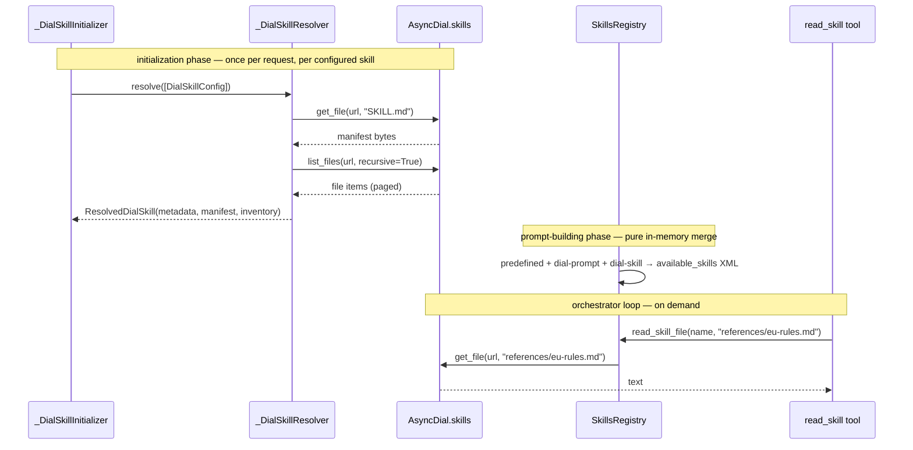

# Design: Skills as DIAL Resource (Phase 1)

- **Status:** Approved
- **Approved:** 2026-08-31
- **Issue:** [epam/ai-dial-quickapps-backend#418](https://github.com/epam/ai-dial-quickapps-backend/issues/418)
- **Dependencies:**
  - [epam/ai-dial-core#1633](https://github.com/epam/ai-dial-core/issues/1633) — folder-as-resource / `/v2/skills`. All
    child issues are closed; the read path this design uses is live.
  - `ai-dial-client-python` `feat/skills-read` — the `client.skills` resource. **Written, not merged, not released.**
  - Prior art: [`dial_prompts_as_skills.md`](dial_prompts_as_skills.md), [`skills_and_file_transfer.md`](skills_and_file_transfer.md)

## Problem Statement

DIAL Core now stores skills as folder-shaped resources: a mandatory `SKILL.md` manifest plus an arbitrary file
hierarchy (`references/`, `scripts/`, `assets/` — the [Agent Skills spec](https://agentskills.io/specification)),
served through `/v2/skills`.

QuickApps cannot consume them at all. The only user-configurable skill source is `dial-prompt`, a single DIAL prompt
blob (`prompts/<bucket>/<path>`), and `read_skill` returns exactly one string per skill. Consequences today:

- A skill authored in DIAL Chat as a skill resource **cannot be referenced from a QuickApp config**. There is no
  config type for it.
- Progressive disclosure — the mechanism the spec is built around, where `SKILL.md` stays small and points at
  bundled reference files the agent opens on demand — **does not exist**. A `dial-prompt` skill that says
  "see `references/api-schema.md`" silently degrades: the agent has no way to open it.
- `docs/skills.md` documents both of these as "Not supported".

## Design Goals

1. An app config can reference a DIAL skill resource by URL (`skills/<bucket>/<path>`) and the agent sees it in
   `<available_skills>` exactly like any other skill.
2. The agent can read the manifest **and** any bundled text file of that skill, on demand, one round-trip per file.
3. The agent discovers which files exist without guessing — the file list is part of what it gets back when it
   reads the manifest.
4. Nothing about predefined skills or `dial-prompt` skills changes. No behavior regression, no refactoring of
   either.
5. A broken, oversized, or inaccessible skill degrades to a reported initialization issue; the request is still
   served.

---

## Phasing

The issue asks for three things: load the whole folder, progressive disclosure, and metadata-listing/etag-driven
caching. This document designs and commits to **Phase 1 only**; the rest is named here so the seams are deliberate,
not so it is promised.

### Phase 1 — this design

| In | Out |
|---|---|
| New `dial-skill` config type over `skills/<bucket>/<path>` | Predefined skills — untouched, still flat `SKILL.md` |
| Manifest + **text-file inventory** resolved per request | `dial-prompt` — untouched, not deprecated yet |
| `read_skill(skill_name, file_path?)` for progressive disclosure | Binary / non-text bundled files |
| Docs + schema regeneration | Cross-request caching, etag probes |
| | Any unification of the three skill sources into one model |
| | A QuickApps-side validator for `dial-skill` — Core validates on write |

Deliberate non-goal: **no refactoring.** `dial_skills/` is a new package that mirrors the existing
`dial_prompt_skills/` shape. `SkillsRegistry` gains one more source and one async method. Nothing else is rewritten.

### Phase 2 — follow-ups (separate issues)

- **Binary/asset files.** Today a non-text file is neither advertised nor readable. Serving one means returning an
  attachment rather than a string — a different contract for `read_skill`, and it needs the file-transfer path.
- **Caching.** Resolution is per-request, same as `dial-prompt` today. A cheap "did this skill change" probe is
  blocked on Core (see [C-2](#c-2--no-cheap-aggregate-etag-probe)).
- **`read_skill` and offload.** A large file read can be swallowed by `tool_call_result_offload` and handed back to
  the model as a pointer. Add `internal_skills_read_skill` to the mandatory offload exclusions and cap the result.
- **Skill browsing for the editor.** `GET /skills` lists predefined skills only. Listing a user's DIAL skills is
  blocked on Core (see [C-3](#c-3--children-listing-carries-no-skill-metadata)).

### Later

Predefined skills as folder skills (one `Skill` model across all three sources), `dial-prompt` deprecation,
`scripts/` execution, `allowed-tools` enforcement.

---

## Use Cases

### UC-1: Reference a DIAL skill resource from an app config

**Trigger:** A builder adds `{"type": "dial-skill", "url": "skills/<bucket>/refund-policy"}` to `skills`.
**Behavior:** At request initialization QuickApps reads the skill's `SKILL.md` and lists its text files.
**Outcome:** `refund-policy` appears in `<available_skills>` with its name and description, indistinguishable from a
predefined skill.

### UC-2: Agent reads the manifest and sees what else is there

**Trigger:** The model calls `read_skill(skill_name="refund-policy")`.
**Behavior:** QuickApps returns the manifest body, followed by a `<skill_files>` block listing the skill's readable
files by path.
**Outcome:** The model knows `references/eu-rules.md` exists without the manifest having to spell out a URL scheme.

### UC-3: Agent opens a bundled file

**Trigger:** The model calls `read_skill(skill_name="refund-policy", file_path="references/eu-rules.md")`.
**Behavior:** One `GET /v2/skills/{bucket}/{path}/files/references/eu-rules.md` against Core.
**Outcome:** The file's text, in the tool result. Nothing was fetched that the model did not ask for.

### UC-4: Broken or inaccessible skill

**Trigger:** The configured URL 403s (see [C-1](#c-1--config-declared-skills-are-not-auto-shared-blocking-for-the-headline-use-case)), or its
`SKILL.md` has no frontmatter.
**Behavior:** The skill is dropped; a `SkillInitializationException` is recorded.
**Outcome:** The "Initialization issues" stage names the URL and the reason. Every other skill and the request itself
are unaffected.

---

## Proposed Design



### 1. Config: a new `dial-skill` union member

**What.** `DialSkillConfig` joins `SkillConfig`'s discriminated union in `quickapp/config/skill.py`:

```python
class DialSkillConfig(BaseModel):
    type: Literal["dial-skill"] = "dial-skill"
    url: Annotated[str, DialResourceConfigField(
        description="Relative skill resource URL in DIAL (e.g. skills/<bucket>/<path>)"
    )]

SkillConfig = Annotated[DialPromptSkillConfig | DialSkillConfig, Field(discriminator="type")]
```

**Semantics.** `DialResourceConfigField` tags the URL with `dial:resource` so Core's collector sees it — the same
annotation `dial-prompt` carries. See [C-1](#c-1--config-declared-skills-are-not-auto-shared-blocking-for-the-headline-use-case) for what Core
does (and does not) do with it today.

**Change.** `SkillConfig` goes from a one-member `Annotated[...]` to a real union. `make dump_app_schema`
regenerates `docs/generated-app-schema.json` and `docs/generated-config-support-openapi.json`.

**Not preview-gated.** `dial-prompt` is not, and gating one *member* of a union is not expressible with the
field-level `x-preview` marker the schema generator understands — it would take either a schema post-process or a
second union, both of which cost more than the feature. The code path is dormant unless a config declares a
`dial-skill`. If we later decide the Core gap makes it too sharp an edge, `@preview_module` on `DialSkillsModule` is
a one-line change that stops resolution (at the cost of ignoring such entries silently).

### 2. `quickapp/dial_skills/` — a new package mirroring `dial_prompt_skills/`

Four components, each the direct analogue of its `dial_prompt_skills/` counterpart. This is copy-shaped on purpose:
the lifecycle is identical, and sharing it would mean refactoring the prompt path.

| Component | Responsibility |
|---|---|
| `_DialSkillResolver` (request-scoped) | Dedup by URL → fetch in parallel → parse frontmatter → list files → dedup by name. Per-URL failures become `SkillInitializationException`. |
| `_DialSkillsContext` (request-scoped) | Holds `resolved_skills` and `exceptions`. Lock-guarded, like `_DialPromptSkillsContext`. |
| `_DialSkillInitializer` (`CompletionInitializer`) | Filters `ApplicationConfig.skills` to `DialSkillConfig`, calls the resolver, pushes results into the context. Resolver-level blowups become `SkillCatastrophicInitializationException`. |
| `DialSkillsModule` | Binds the three; contributes the initializer and the context's exceptions to the existing multiproviders. |

`ResolvedDialSkill` is a frozen model: `url`, `metadata: SkillMetadata`, `manifest: str`, `files: tuple[str, ...]`,
`warnings: list[str]`.

**Per-skill cost at initialization:** one `get_file(url, "SKILL.md")` plus one `list_files(url, recursive=True)`
(plus continuation pages). Both run concurrently across skills via `asyncio.gather(return_exceptions=True)`, exactly
as the prompt resolver does.

### 3. The inventory: what a skill advertises

`list_files(url, recursive=True)` returns items whose `url` is `skills/<bucket>/<path>/files/<relpath>`; folders are
distinguished by a trailing `/` (**not** by `node_type` — Core reports every entry as `ITEM`; the client's
`SkillFileItem` docstring records this). Relative paths come from stripping the `<skill-url>/files/` prefix and
percent-decoding.

An entry is advertised only if **all** of these hold:

1. It is not a folder (no trailing `/`).
2. No path segment starts with `.` — hidden files and the `.dial-resource` marker never reach the model.
3. Its extension is in the text allowlist: `.md .markdown .txt .json .yaml .yml .csv .tsv .xml .html .toml .ini .sql .py .sh .js .ts`.
4. It is not `SKILL.md` — that is what `read_skill(skill_name)` already returns.

**One rule, two places.** The same allowlist decides what is *listed* and what is *readable*, and readability is
enforced by inventory membership: `read_skill` serves a `file_path` **only if it is in that skill's inventory**.
That single check subsumes path traversal, encoded-separator smuggling, and dotfile leakage without a bespoke
validator — the model can only ask for what we told it exists. (The client also rejects `.`/`..` and encoded
separators before a request is built, so this is belt and braces.)

Non-text files are invisible in Phase 1. The manifest may still mention them in prose; a `read_skill` for one comes
back as "not available", with the inventory repeated as a hint.

### 4. `SkillsRegistry`: one more source, one new method

**Change (merge).** The registry takes an optional `_DialSkillsContext` alongside the existing optional
`_DialPromptSkillsContext`, and its merge loop grows a third pass. Precedence is unchanged in spirit and made
explicit: **predefined > dial-prompt > dial-skill**, and within a source, first-configured wins. A losing skill is
reported as a `SkillInitializationException` on its own context, the way prompt collisions already are.

**Change (routing).** The registry gains:

```python
async def read_skill_file(self, skill_name: str, file_path: str) -> str
```

It looks up a per-skill *file reader* registered by the dial-skill source. Predefined and `dial-prompt` skills
register none — for them the method raises the "this skill has no bundled files" error. `get_skill_content` stays
synchronous and unchanged; the manifest string it returns for a dial-skill has the `<skill_files>` block appended at
resolve time.

Reads are memoized in the request-scoped context, so a model that opens the same reference twice in one
conversation pays one round-trip.

### 5. `read_skill(skill_name, file_path?)`

**What.** One optional parameter added to `SKILL_READER_TOOL_CONFIG`:

> `file_path` — *(optional)* Path of a bundled file to read, relative to the skill root, exactly as listed in the
> skill's `<skill_files>` block (e.g. `references/eu-rules.md`). Omit to read the skill's instructions.

**Semantics.**

| Call | Result |
|---|---|
| `read_skill(name)` | Manifest. For a dial-skill, followed by `<skill_files>` when the skill has any. |
| `read_skill(name, "references/x.md")` | That file's text. |
| `read_skill(name, "SKILL.md")` | The manifest — accepted rather than treated as an error. |
| `file_path` not in the inventory | `Error: ... is not available in skill 'name'.` plus the inventory, so the model can correct itself in the next turn. |
| Skill has no bundled files | `Error: skill 'name' has no bundled files.` |

**Why one tool and not two.** A separate `read_skill_file` tool costs a second tool slot in every request's tool
list for a strictly narrower capability, and splits "reading a skill" across two names the model has to choose
between. Extending the existing tool keeps the prompt surface flat.

**Stage display.** `_SkillReaderStageWrapper` shows the manifest today. It gets the file path in the stage title
when one is present — a two-line change, no new wrapper.

### 6. Limits

`DialSkillsSettings` (`pydantic-settings`, module-local, per `CODESTYLE.md`):

| Env var | Default | Purpose |
|---|---|---|
| `DIAL_SKILLS_FILE_MAX_BYTES` | `262144` (256 KiB) | Cap on any single fetched file, manifest included. Enforced **after** the response arrives — Core's listing carries no size ([C-4](#c-4--file-listing-carries-no-size)). An over-cap manifest drops the skill with a reported reason; an over-cap file read returns an error to the model. |
| `DIAL_SKILLS_MAX_FILES` | `200` | Inventory ceiling per skill. Beyond it the listing stops and the block ends with a truncation note. |
| `DIAL_SKILLS_LISTING_MAX_PAGES` | `10` | Pagination ceiling. Follow `next_token` at most this many times, and stop on a repeated token — a stuck cursor must not hang initialization. |

Decoding is strict UTF-8; a decode failure is reported as "not a text file" rather than mangled into the context.

### 7. `/skills/validate` stays `dial-prompt`-only

**No QuickApps-side validator for `dial-skill`.** A DIAL skill resource is created and validated by Core: the
`/v2/skills` write path enforces a mandatory `SKILL.md` with parseable frontmatter server-side
([#1633](https://github.com/epam/ai-dial-core/issues/1633), requirement 6). A stored skill is already valid, so
re-checking it at config time would duplicate Core's rule and risk drifting from it. `dial-prompt` keeps its
validator because a prompt is an arbitrary text blob that Core knows nothing about.

**But the endpoint's request type must be narrowed**, or widening the union ships a bug. The handler is annotated
`config: SkillConfig`, so widening the union regenerates the config-support OpenAPI to advertise `dial-skill` on
`/skills/validate` — a request the handler's `else` branch answers `400 Unsupported skill type`. Pinning the
annotation to `DialPromptSkillConfig` keeps the schema honest about what the endpoint accepts, and lets the now
unreachable `isinstance` check and its `400` branch go with it. A `dial-skill` payload then fails the `type`
literal and gets a `422` from FastAPI, matching the published schema.

The editor should not offer Validate for a `dial-skill` at all — that is part of the `ai-dial-chat` work in
[C-5](#c-5--dial-chat-editor).

---

## Alternatives Considered

**A-1 — Download the whole skill as a ZIP once per request.** `client.skills.download()` is a single round-trip and
removes pagination, per-file fetches, and the inventory listing. Rejected: it pays the full byte cost of every
bundled asset on every request even when the model opens nothing, with no way to check size before committing to the
download, and it is the opposite of progressive disclosure.

**A-2 — Expose bundled files through the existing `file:` reference scheme.** Would reuse `FileLoaderService` and
need no tool change. Rejected: skill-relative paths are not DIAL file URLs, and the resolution would have to be
scoped per skill to stay contained — more machinery than a `file_path` parameter.

**A-3 — Populate the registry from Core's metadata listing instead of reading each manifest.** Would remove one
round-trip per skill. Blocked: the listing carries no name/description ([C-3](#c-3--children-listing-carries-no-skill-metadata)).

**A-4 — Decode-sniff instead of an extension allowlist.** Attempt UTF-8, treat failure as binary. Rejected for the
*listing* (it would require fetching every file to decide what to advertise); kept as a secondary guard on read.

---

## Dependencies and Known Gaps

### D-1 — `ai-dial-client-python` `client.skills` is unreleased (**blocking**)

The `feat/skills-read` branch adds `AsyncSkills` with `get_metadata`, `list_files`, `get_file`, `stream_file`, and
`download`, plus `my_skills_home()` and the `SkillMetadata` / `SkillFileMetadata` types. Everything Phase 1 needs is
there. It must be merged and released before this can ship; `pyproject.toml` then moves from
`aidial-client (>=0.16.0,<0.17.0)` to the release that carries it. **No vendored copy and no git dependency** — a
pinned git ref in `pyproject.toml` is not something we want in a release build.

### C-1 — Config-declared skills are not auto-shared (**blocking for the headline use case**)

Verified against `ai-dial-core@development`: `ApplicationSchemaService` exposes `getFiles` / `getPrompts` /
`getDeployments` and no `getSkills`; `BaseRequestFunction` has no `shareApplicationSkills`; `ApiKeyData` has no
`attachedSkills`. A `skills/...` URL tagged `dial:resource` is collected and then dropped, so the app's per-request
key gets `403`.

Until Core closes this, a `dial-skill` works only when the **caller's own key already has access**: a skill in the
user's own bucket, a skill shared with them, or a published skill. That covers "I authored a skill in Chat and want
my QuickApp to use it" — the primary Phase 1 scenario — and does not cover "the app ships with a skill from the
builder's bucket".

**Action:** file this against `ai-dial-core` (needs `getSkills`, `shareApplicationSkills`, `ApiKeyData.attachedSkills`
+ its `AccessService.getAutoSharedAccess` branch, and a marker-aware existence check, since a skill URL has no blob
of its own). Nothing on the QuickApps side changes when it lands.

### C-2 — No cheap aggregate-etag probe

The `.dial-resource` marker carries an aggregate etag bumped on every mutation, but no read path returns it cheaply:
`listChildren` omits it deliberately, the single-file GET returns the individual blob's etag, and only the ZIP
download exposes the aggregate. A `HEAD /v2/skills/{bucket}/{path}` would make Phase 2 caching trivial.

### C-3 — Children listing carries no skill metadata

`nodeMetadata` sets node type, timestamps, and author — not the marker's cached name/description/version. Browsing
skills therefore costs one manifest read each. Does not affect Phase 1 (configs address skills by URL); gates any
"pick a skill from a list" editor UX.

### C-4 — File listing carries no size

`ResourceItemMetadata` has no size field, so `DIAL_SKILLS_FILE_MAX_BYTES` can only be enforced after the response
arrives, and the inventory cannot tell the model which references are cheap to open.

### C-5 — DIAL Chat editor

Skill authoring in Chat is live enough to have its own bug reports (e.g. `epam/ai-dial-core#1861`), so Phase 1 has a
real authoring surface to consume. Referencing a skill from a QuickApp config still needs editor support for the new
`dial-skill` type — a separate `ai-dial-chat` issue.

---

## Out of Scope

| Deferred | Why | What it would need |
|---|---|---|
| Predefined skills as folders | Phase 1 must not touch them; today they are flat `SKILL.md` files read at startup | A lazy disk-backed reader and one `Skill` model across sources |
| Binary / asset files | Different result contract (attachment, not string) | File-transfer integration in `read_skill` |
| Cross-request caching | Per-request resolution matches `dial-prompt` today | [C-2](#c-2--no-cheap-aggregate-etag-probe) |
| `dial-prompt` deprecation | Nothing forces it yet; both can coexist | A migration note once `dial-skill` has soaked |
| `scripts/` execution, `allowed-tools` enforcement | Neither is supported for any skill source today | Separate design |
| A `dial-skill` branch in `/skills/validate` | Core validates `SKILL.md` on write; duplicating that rule invites drift | Nothing — the editor should not offer Validate for this type |
| Listing a user's DIAL skills in the editor | Not needed to reference one by URL | [C-3](#c-3--children-listing-carries-no-skill-metadata) |

---

## Configuration / Usage Examples

### Config

```json
{
  "skills": [
    { "type": "dial-prompt", "url": "prompts/my-bucket/skills/tone-of-voice" },
    { "type": "dial-skill",  "url": "skills/my-bucket/refund-policy" }
  ]
}
```

### Skill layout in DIAL

```
skills/my-bucket/refund-policy/
├── SKILL.md                     ← manifest, always read
├── references/
│   ├── eu-rules.md              ← advertised, readable
│   └── us-rules.md              ← advertised, readable
├── assets/logo.png              ← not advertised in Phase 1
└── .dial-resource               ← Core's marker, never advertised
```

### What the agent sees

System prompt (`<available_skills>`) — unchanged shape:

```xml
<skill>
  <name>refund-policy</name>
  <description>How to handle refund requests, by region.</description>
</skill>
```

`read_skill(skill_name="refund-policy")`:

```markdown
---
name: refund-policy
description: How to handle refund requests, by region.
---

# Refund Policy

Determine the customer's region, then read the matching reference file.

<skill_files>
references/eu-rules.md
references/us-rules.md
</skill_files>
```

`read_skill(skill_name="refund-policy", file_path="references/eu-rules.md")` → that file's text.

### Failure modes

| Situation | Where it surfaces | Effect |
|---|---|---|
| URL 403/404 | Initialization issues stage, with the URL | Skill dropped, request served |
| `SKILL.md` missing or unparseable frontmatter | Initialization issues stage | Skill dropped |
| Manifest over `DIAL_SKILLS_FILE_MAX_BYTES` | Initialization issues stage | Skill dropped |
| Name collides with a predefined skill | Initialization issues stage | Predefined wins |
| `file_path` not in the inventory | Tool result | Error + inventory reprinted |
| File over cap, or not valid UTF-8 | Tool result | Error, other files still readable |
| Core unreachable during initialization | Initialization issues stage (catastrophic) | All dial-skills dropped, request served |

---

## Migration

### Breaking changes

None. `dial-skill` is additive; `dial-prompt` and predefined skills behave exactly as before, and the `read_skill`
signature is backward compatible (`file_path` optional).

### Non-breaking changes

- `SkillConfig` becomes a two-member union — a config with only `dial-prompt` entries validates identically.
- `read_skill`'s description and parameters change, so the model sees a slightly different tool schema.
- `/skills/validate` publishes a narrower request schema (`DialPromptSkillConfig` instead of `SkillConfig`), which
  is what it has always actually accepted. A `dial-skill` payload now fails as `422` rather than `400`; no caller
  could have been sending one before, since the type did not exist.

---

## Summary of Changes

### `quickapp/config/`

| Change | Detail |
|---|---|
| Add `DialSkillConfig` | `type: "dial-skill"`, `url` tagged `DialResourceConfigField` |
| Widen `SkillConfig` | `DialPromptSkillConfig \| DialSkillConfig`, discriminated on `type` |

### `quickapp/dial_skills/` (new)

| File | Contents |
|---|---|
| `_dial_skill_resolver.py` | `_DialSkillResolver`, `ResolvedDialSkill`, resolver output model |
| `_dial_skills_context.py` | `_DialSkillsContext` — resolved skills, exceptions, per-request file-read memo |
| `_dial_skill_initializer.py` | `_DialSkillInitializer(CompletionInitializer)` |
| `_dial_skills_client.py` | Thin wrapper over `client.skills`: manifest fetch, paged inventory, single-file read, limits |
| `_settings.py` | `DialSkillsSettings` — `DIAL_SKILLS_FILE_MAX_BYTES`, `DIAL_SKILLS_MAX_FILES`, `DIAL_SKILLS_LISTING_MAX_PAGES` |
| `dial_skills_module.py` | `DialSkillsModule` — bindings, initializer and exception multiproviders |

### `quickapp/skills/` (minimal deltas, no refactoring)

| Component | Change |
|---|---|
| `SkillsRegistry` | Optional `_DialSkillsContext`; third merge pass with explicit precedence; new `async read_skill_file` |
| `_SkillReaderTool` | Optional `file_path` argument, routed to `read_skill_file` |
| `_tool_configs.py` | `file_path` parameter added to the tool schema; description updated |
| `_skill_reader_stage_wrapper.py` | Show `file_path` in the stage title when present |

### Cross-cutting

| Item | Change |
|---|---|
| `app_factory.py` | Register `DialSkillsModule` |
| `configuration_support/_controller.py` | Narrow `validate_skill` to `DialPromptSkillConfig`; drop the dead `isinstance` check and its `400` branch |
| `pyproject.toml` | Bump `aidial-client` to the release carrying `client.skills` |
| `docs/generated-*.json` | Regenerated via `make dump_app_schema` |
| `docs/skills.md` | New "DIAL Skill Resources" section; flip the two "Not supported" rows for the dial-skill source |
| `CLAUDE.md` | Name the third skill source |
