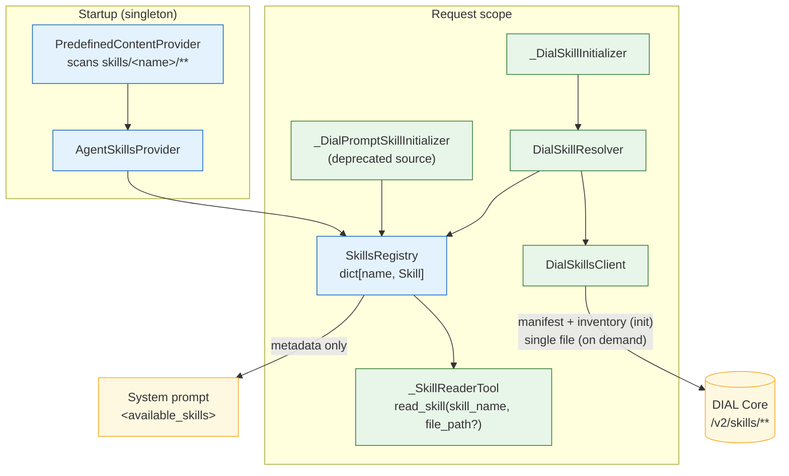
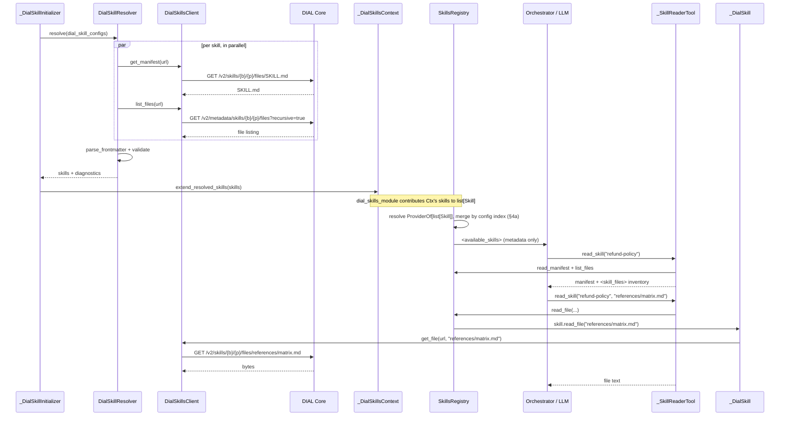

# Design: Skills as DIAL Resource

- **Status:** Draft
- **Delivery:** Split into phases — see [Delivery phases](#delivery-phases). This document describes the
  design *whole*; Phase 1 implements a subset of it. Sections marked **(Phase 2)** or **(Phase 3)** are
  designed but not yet built.
- **Dependencies:**
  - [`skills_and_file_transfer.md`](skills_and_file_transfer.md) — the original skills framework (`SKILL.md`, `read_skill`, `<available_skills>`)
  - [`dial_prompts_as_skills.md`](dial_prompts_as_skills.md) — the `dial-prompt` skill source this design deprecates
  - [ai-dial-core#1633] — *DIAL Folder As Resource* (**delivered**: `SKILL` resource type, `/v2/skills/**` API, sharing, publication)
  - Tracked by [#418] (*Skill artifacts support*) under EPIC [#421] (*Advanced Agent Skills support*)

---

## Problem Statement

QuickApps knows exactly one shape of skill: **a single Markdown document**.

| Source        | Location                                  | Loaded          | Shape        |
|---------------|-------------------------------------------|-----------------|--------------|
| Predefined    | `config/predefined/skills/<name>/SKILL.md` | Startup, cached | One document |
| DIAL prompt   | `prompts/<bucket>/<path>`                  | Per request     | One document |

The directory layout is already there but unused: `PredefinedContentProvider.__scan_entries` iterates each skill
directory and reads **only** `SKILL.md`, dropping every sibling file. `AgentSkillsProvider` caches
`dict[skill_name, str]`, `SkillsRegistry` merges two such dicts, and `_SkillReaderTool` returns the string. There is
nowhere in this pipeline for a skill to keep `references/`, `scripts/`, or `assets/`.

Observable symptoms:

1. **Spec-compliant skills silently degrade.** A `SKILL.md` that says *"consult `references/api-schema.md` before
   composing a request"* produces a dangling pointer: the agent has no tool that can open the file, so it either
   hallucinates the content or ignores the instruction. `docs/skills.md` documents this as
   *"Optional subdirectories — Not supported"* and *"Progressive disclosure — Not supported"*.
2. **No progressive disclosure.** Everything a skill wants the agent to know must fit in the one document
   `read_skill` returns, and that document is returned whole. The spec's core economy — a short manifest plus
   on-demand detail — is unavailable, so skill authors must choose between a bloated manifest and an incomplete one.
3. **`dial-prompt` is a workaround, not a home.** A DIAL prompt is a text blob. It cannot hold binaries, it is not
   addressable as a skill, and its share/publish lifecycle is the *prompt* lifecycle. Users who want a real skill get
   a document that merely looks like one.
4. **Authoring predefined skills is an ops task.** They are baked into the image (or a `PREDEFINED_EXTRA_PATHS`
   layer) and require a restart. There is no user-owned, editable skill storage.

Meanwhile DIAL Core has shipped the missing primitive. [ai-dial-core#1633]
introduced a generic **folder-as-resource** model with skills as its first concrete type:

- A new `SKILL` resource type with URL group `skills`, invisible to the v1 `files` API.
- A folder becomes a resource by carrying a `.dial-resource` marker; the marker points at an immutable
  `v/{versionId}/` subtree and is the single atomic commit point for any mutation.
- A `/v2/skills/**` API family with whole-resource, **single-file**, and metadata-listing operations.
- Server-side validation (`SKILL.md` at root with parseable frontmatter carrying `name` and `description`) —
  the same contract QuickApps' `parse_frontmatter` enforces.
- Integration with access control, sharing (`ShareResourceLimit(10, 72)` for `SKILL`) and publication
  (review → public), so a skill is shareable and publishable **as a unit**.

The primitive exists and is validated at the same contract QuickApps already speaks. The gap is entirely on the
QuickApps side: nothing here can address a `skills/<bucket>/<path>` URL, and the internal skill model has no room
for a second file.

---

## Design Goals

- **G1** — QuickApps can use a DIAL skill resource (`skills/<bucket>/<path>`) as a skill source, configured per app.
- **G2** — A skill is modelled as a *manifest plus a file tree*, not a string. All three sources (predefined,
  DIAL prompt, DIAL skill resource) present the same model, so the agent's experience does not depend on provenance.
- **G3** — The agent can read a bundled file on demand (progressive disclosure) without downloading the whole skill.
- **G4** — Reading a bundled file costs **one** Core round-trip; no whole-archive download per reference.
- **G5** — Nothing about a skill's file tree enters the system prompt uninvited: `<available_skills>` stays metadata-only,
  and the file inventory is disclosed only when the agent actually reads the skill.
- **G6** — Existing app configs keep working unchanged; `dial-prompt` continues to function while deprecated.
- **G7** — Failures are soft and observable: an unreachable, malformed, or forbidden skill is skipped with a
  diagnostic in the existing *Initialization issues* stage, never a failed request.
- **G8** — Memory and token cost are bounded by explicit, configurable limits on both file size and inventory size.

---

## Use Cases

### UC-1: Reference a DIAL skill resource from an app config

**Trigger:** A user creates a skill in DIAL (via Chat's editor or the `/v2/skills` API) at
`skills/<bucket>/support/refund-policy`, then adds it to their QuickApp config's `skills` list with
`{"type": "dial-skill", "url": "skills/<bucket>/support/refund-policy"}`.
**Behavior:** At request initialization QuickApps fetches the skill's `SKILL.md` and its file inventory, validates the
frontmatter, and merges the skill into the registry.
**Outcome:** The skill's `name`/`description` appear in the `<available_skills>` block of the system prompt, exactly
as a predefined skill would.

### UC-2: Agent reads the manifest

**Trigger:** The model decides the `refund-policy` skill is relevant and calls `read_skill(skill_name="refund-policy")`.
**Behavior:** QuickApps returns the `SKILL.md` body, followed by an inventory of the skill's other files.
**Outcome:** The agent sees the instructions *and* learns which bundled files exist, in one call.

### UC-3: Agent reads a bundled reference file

**Trigger:** The manifest (or the inventory from UC-2) points at `references/refund-matrix.md`; the model calls
`read_skill(skill_name="refund-policy", file_path="references/refund-matrix.md")`.
**Behavior:** QuickApps issues a single `GET /v2/skills/{bucket}/support/refund-policy/files/references/refund-matrix.md`
and returns the text.
**Outcome:** The agent gets exactly the detail it asked for, and no other bundled file has consumed a token.

### UC-4: Predefined skill with bundled files

**Trigger:** An operator ships `config/predefined/skills/data-analysis-helper/` containing `SKILL.md` and
`references/plotting-cookbook.md` (or layers it in via `PREDEFINED_EXTRA_PATHS`).
**Behavior:** At startup the provider reads `SKILL.md` and walks the directory for the file inventory — names only,
no content. `references/plotting-cookbook.md` is read from disk only if the agent asks for it.
**Outcome:** Predefined and DIAL-resource skills behave identically from the agent's point of view.

### UC-5: Shared skill

**Trigger:** A colleague shares their skill resource with the user; the user references it by its URL in their app config.
**Behavior:** Core's auto-share path grants the app's per-request key read access to the referenced skill, and QuickApps
reads it normally.
**Outcome:** The skill loads. **Today this path does not work** — see [Core Dependencies](#core-dependencies-and-known-gaps),
gap **C-1**.

### UC-6: Broken or inaccessible skill

**Trigger:** A configured skill URL 404s, returns 403, or its `SKILL.md` has invalid frontmatter.
**Behavior:** The skill is skipped; a `SkillInitializationException` carrying the URL and reason is recorded.
**Outcome:** The request is served with the remaining skills, and the issue is visible in the *Initialization issues* stage.

---

## Proposed Design

Five orthogonal concerns:

| # | Concern                | Owner                                            |
| - | ---------------------- | ------------------------------------------------ |
| 1 | Skill model            | `skills/` — `Skill` and friends                  |
| 2 | Config surface         | `config/skill.py`                                |
| 3 | Core v2 read client    | `dial_skills/_dial_skills_client.py`             |
| 4 | Resolution lifecycle   | `dial_skills/` package                           |
| 5 | Progressive disclosure | `skills/_skill_reader_tool.py`, `skills/_xml.py` |

**Traceability against [#418].** The issue states three requirements; two are delivered as asked, the third cannot be
delivered as written against the shipped Core:

| [#418] requirement | Where | Status |
|------------------|-------|--------|
| *"Load the full skill folder, not just `SKILL.md`, tolerating an arbitrary file hierarchy"* | §1 `Skill`, §3 inventory call, §6 predefined folders | Delivered as asked |
| *"Give the agent on-demand access to bundled files (progressive disclosure), e.g. by extending the `read_skill` tool or the file-reference scheme"* | §5 | Delivered via `read_skill`; the file-reference scheme is a **complement, not an alternative** — see [A-1](#a-1--expose-skill-files-through-the-file-reference-scheme-instead-of-read_skill) |
| *"Consume Core's metadata listing (name/description/version) for registry population and the aggregate etag as a cheap change signal for caching"* | §3, §8 | **Not deliverable as written** — the shipped listing carries neither (gaps **C-2**, **C-3**); see [A-4](#a-4--populate-the-registry-from-cores-metadata-listing-instead-of-reading-each-manifest) |

The issue's *"Depends on"* note is also stale: it lists per-resource limits, metadata listing, access control, and
sharing/publication as still open, but all of [ai-dial-core#1633]'s child issues are closed and each of those is present in
`ai-dial-core@development`. The one thing that genuinely does not work is narrower and is not mentioned there —
auto-sharing a config-declared skill to the app's per-request key (**C-1**).



### 1. One skill model for every source: `Skill`

**What.** A skill stops being a string and becomes an object: metadata that is always resident, plus lazily
readable content. It is named `Skill` — the domain noun the rest of the system already speaks (`read_skill`,
`<available_skills>`, `SkillsRegistry`) — rather than `SkillHandle`. "Handle" implies an owned resource with a
lifecycle to release, which is what the repo's `_SessionHandle` is (an asyncio task plus ready/shutdown events);
this type owns nothing and needs no closing, so the suffix would be ceremony.

Two neighbours need separating from it, since the package will advertise all three side by side. `SkillMetadata`
remains the frontmatter record a `Skill` carries. The existing `ParsedSkill` — the result of `parse_frontmatter`,
carrying metadata plus non-fatal warnings — is **not** a kind of `Skill`: it has no content, no `source`, no
`url`, and no `read_file`. It is renamed `ParsedFrontmatter`, which is what it has always been; the rename touches
four files (`_skill_metadata.py`, `_frontmatter.py`, `dial_prompt_skills/_dial_prompt_skill_resolver.py`, and
`tests/unit_tests/skills_tests/test_agent_skills_provider.py`, which imports and asserts on it) and no public
surface. New types in `quickapp/skills/`:

```python
class SkillSourceKind(StrEnum):
    PREDEFINED = "predefined"
    DIAL_PROMPT = "dial-prompt"      # deprecated source
    DIAL_SKILL = "dial-skill"

class SkillFileEntry(BaseModel):     # frozen
    path: str                        # POSIX, relative to the skill root, e.g. "references/api.md"
                                     # a model, not a bare str: the seam for `size` once C-4 lands

class SkillFileContent(BaseModel):   # frozen
    path: str
    text: str
    content_type: str

class Skill(ABC):
    metadata: SkillMetadata          # always resident — feeds <available_skills>
    source: SkillSourceKind
    url: str | None                  # None for predefined
    config_index: int | None         # position in ApplicationConfig.skills; None for predefined

    def read_manifest(self) -> str: ...                         # resident by contract, no I/O
    def list_files(self) -> list[SkillFileEntry]: ...           # resolved at init, no I/O
    async def read_file(self, relative_path: str) -> SkillFileContent: ...
```

Provenance (`source`, `url`) lives on the `Skill`, not on `SkillMetadata`, whose stated contract is
*"metadata extracted from a skill file's YAML frontmatter"* — and neither field comes from frontmatter. Every
diagnostic §4 and §4a describe is raised where the `Skill` is in scope, so it is a sufficient home.

Every implementation obeys the same cost model: **metadata and the inventory are resident, content is not.**
`metadata` is parsed once so `<available_skills>` can be built with no I/O, and `list_files()` is deliberately
**synchronous and I/O-free** — the inventory is resolved once during initialization (a directory walk for
predefined, one metadata call for DIAL skills, empty for DIAL prompts) and cached on the `Skill`. Only `read_file`
touches a file or the network, and only when the agent asks. Manifests are the one deliberate exception: they are
fetched during initialization because the agent reads them constantly and they are the skill's entry point.

**Owner.** `quickapp/skills/skill.py` (the abstraction) with three implementations:

| Implementation     | Package               | Manifest        | Inventory                 | `read_file`                             |
| ------------------ | --------------------- | --------------- | ------------------------- | --------------------------------------- |
| `_PredefinedSkill` | `skills/`             | Read at startup | Directory walk at startup | Lazy filesystem read, memoized          |
| `_DialPromptSkill` | `dial_prompt_skills/` | Fetched at init | Always empty              | Raises `SkillFileNotFound`              |
| `_DialSkill`       | `dial_skills/`        | Fetched at init | Listed at init            | One Core round-trip, cached per request |

**Semantics.** `<available_skills>` is still built from `SkillMetadata` alone. What changes is what sits behind a
name once the agent wants content.

**Change.** `SkillsRegistry._MergedSkills.contents: dict[str, str]` becomes `skills: dict[str, Skill]`, and
`SkillsRegistry.get_skill_content(name) -> str` is replaced by:

```python
def read_manifest(self, skill_name: str) -> str
def list_files(self, skill_name: str) -> list[SkillFileEntry]
async def read_file(self, skill_name: str, relative_path: str) -> SkillFileContent
```

`read_manifest` is **synchronous**, symmetric with `list_files()` and for the same reason: by this section's own
cost model the manifest is resident by the time any tool runs, so an `async` signature would propagate an `await`
through `SkillsRegistry` and `_SkillReaderTool` for a call that never yields. `read_file` is the only async member.

`read_manifest` returns the **raw file, frontmatter included** — the contract `read_skill` has today
(`AgentSkillsProvider` stores the full file text). The frontmatter is a few hundred bytes the model has already seen
summarised in `<available_skills>`, but stripping it would be a silent behavioral change to an existing tool for no
stated benefit.

Blast radius is small: `_SkillReaderTool` is the only consumer of **`SkillsRegistry.get_skill_content`**.
`AgentSkillsProvider` has a same-named method with its own consumer
(`_InjectFileTransferInstructionTransformer`), and that one is untouched — it keeps its synchronous in-memory
contract for the built-in file-transfer skill's manifest.

### 2. Config: add `dial-skill`, deprecate `dial-prompt`

**What.** `SkillConfig` is already a discriminated union — with one member. It gains a second:

```python
class DialSkillConfig(BaseModel):
    type: Literal["dial-skill"] = "dial-skill"
    url: Annotated[str, DialResourceConfigField(
        description="Relative skill resource URL in DIAL (e.g. skills/<bucket>/<path>)")]

class DialPromptSkillConfig(BaseModel):   # deprecated
    type: Literal["dial-prompt"] = "dial-prompt"
    url: Annotated[str, DialResourceConfigField(...)]

SkillConfig = Annotated[DialSkillConfig | DialPromptSkillConfig, Field(discriminator="type")]
```

**Owner.** `config/skill.py`; the schema it generates is consumed by DIAL Chat's editor and by Core's
`dial:resource` collector.

**Semantics.** `url` mirrors the established relative-URL convention (`prompts/<bucket>/<path>`,
`files/<bucket>/<path>`): the resource-type prefix is part of the value. It addresses the skill **as a unit** — never
a file inside it, never a grouping folder. A trailing slash, a `files/` segment, or a missing `skills/` prefix is
rejected **at resolve time**, as a `SkillInitializationException` naming the URL and the expected shape.

Deliberately *not* at config-parse time: `ApplicationConfig.model_validate` raises `pydantic.ValidationError`,
which is not a `ConfigResolutionException` and so misses the one branch that renders the stage and returns. It
falls through to the outer handler and becomes a `DialHTTPException` — one trailing slash on one URL would take
down the whole request with no stage at all, contradicting **G7** and UC-6. It would also make `dial-skill`
strictly harsher than the type it replaces: `DialPromptSkillConfig.url` is a bare `str` with no shape validation,
so the same typo there is soft. The resolver already turns a bad URL into exactly the diagnostic **G7** asks for,
so this needs no new machinery.

`DialResourceConfigField` stamps `dial:resource: true` into the generated schema, which is what makes Core
auto-share the referenced resource to the app's per-request key. That machinery does not yet accept `skills/` URLs —
gap **C-1**.

**Preview gating.** Two markers are required, and they do different jobs:

- `@preview_model` on **`DialSkillConfig`** — strips the variant from the published schema and removes
  `dial-skill` entries from the parsed list. `FolderContextConfig` is the exact precedent: a discriminated-union
  variant inside a `list[...]` config field carrying this marker.
- `@preview_module` on **`DialSkillsModule`** — drops the initializer and the client from the injector.

The module marker alone is not enough, and getting this wrong is silent: `app_factory` removing a preview module
takes the initializer out but leaves `DialSkillConfig` in the generated schema and still validating at runtime, so
Chat's editor would keep offering `dial-skill`, an entry would parse cleanly, nothing would resolve it, and no
diagnostic would appear — a silent no-op that violates **G7**.

Core marks every `/v2/skills/**` operation `x-preview: true`, and without **C-1** the headline use cases (UC-1 with
a shared skill, UC-5) reliably `403`, so gating is the honest default. Phase 1 is **not** gated — it touches only
`skills/` and predefined content, and works regardless of C-1.

**What the user sees with preview off.** `nullify_preview_fields` drops the entries and emits a `logger.warning`;
it does not raise an `InitializationException`, so the drop does not reach the *Initialization issues* stage. This
design deliberately does **not** special-case skills here: every preview model in the repo behaves this way, and
surfacing dropped preview entries in the stage is a generic improvement to `nullify_preview_fields`, not a
skills-specific one. Filed as a follow-up rather than solved here.

**Change.** `dial-prompt` is marked deprecated on two levels:

- **Schema** — `model_config = ConfigDict(json_schema_extra={"deprecated": True})` on `DialPromptSkillConfig`, so
  DIAL Chat's editor renders it as deprecated. The `starters` → `conversation_starters` precedent in
  `ApplicationConfig` is *field*-level `Field(..., deprecated="…")` and does not apply: there is no single field to
  deprecate here, the whole config type is. `typing_extensions.deprecated` on the class is the other candidate and
  is **rejected** — it emits a `DeprecationWarning` on every `model_validate` of a config containing a
  `dial-prompt` entry, i.e. on every request for such an app. This project's diagnostic channel is the
  initialization-issues stage, not `warnings`.
- **Runtime** — the resolver emits one `SkillInitializationException(severity="warning")` per configured
  `dial-prompt` skill, pointing at `dial-skill` as the replacement. It rides the existing initialization-issues flow,
  so the deprecation is visible to whoever owns the config without breaking anything.

Removal is deliberately **not** scheduled in this design; it gets its own issue once `dial-skill` has shipped and the
Chat-side authoring path is available.

### 3. `DialSkillsClient` — the Core v2 read client

**What.** A thin, request-scoped **policy** wrapper over `aidial-client`'s `skills` resource, covering the three
v2 endpoints QuickApps reads.

| Purpose         | Endpoint                                                                   | When            |
|-----------------|----------------------------------------------------------------------------|-----------------|
| Manifest        | `GET /v2/skills/{bucket}/{path}/files/SKILL.md`                            | Initialization  |
| Inventory       | `GET /v2/metadata/skills/{bucket}/{path}/files?recursive=true&limit={n}`   | Initialization  |
| Bundled file    | `GET /v2/skills/{bucket}/{path}/files/{filePath}`                          | On agent demand |

**Why not the whole-resource ZIP** (`GET /v2/skills/{bucket}/{path}`): it downloads and materialises every bundled
file, including binaries the agent will never open, and Core streams it as `application/zip` that we would then have
to unpack and hold in memory. Two small requests at initialization plus one request per actually-referenced file is
strictly cheaper and satisfies **G4**. The ZIP endpoint stays available for a future export/caching path.

**Owner.** `dial_skills/_dial_skills_client.py`, bound in request scope.

**Semantics.**

- **Transport.** `aidial-client` gains a `skills` resource, contributed upstream — see
  [Upstreaming the `skills` resource](#upstreaming-the-skills-resource-into-ai-dial-client-python). `AsyncDial`
  today exposes `files`, `prompts`, `metadata`, `application`, `toolset` and more, but nothing for `/v2/skills`,
  and driving `httpx` off the injected client's `base_url` / `auth_headers()` would fork transport concerns
  (retries, timeout policy, error translation, percent-encoding) that the library solves — or, for encoding, is in
  the process of solving — once for every DIAL consumer. `DialSkillsClient` therefore stops being a transport
  adapter and becomes a thin **policy** wrapper over `dial_client.skills.*`: mapping library errors onto
  QuickApps' skill exceptions, running the inventory pagination loop against `inventory_max_entries`, and
  sanitizing what reaches the log. Authorization
  comes free — the injected `AsyncDial` already carries the per-request API key or bearer token.
- **URL handling.** Owned by the library, not by this wrapper: once `skills` joins `StorageResourceType`,
  `DialStorageResourceMixin.get_api_path` performs the bucket/path split and `_percent_encode_relative_url` quotes
  every segment, exactly as it will for `files` and `prompts`. **The encoding half is in flight**, not shipped:
  `get_api_path` and `_prepare_download_request` are on the library's `development`, but
  `_percent_encode_relative_url` exists only on branch `fix/124-encode-storage-resource-paths` and is absent from
  the pinned `0.16.1`. It is therefore a *second* thing the pin bump must clear: the pinned release has to
  carry both, which is what **Change** commits to. Worth recording why that is
  safe here: Core's reserved segments — `v`, `files`, `.dial-resource`, `.dial-folder` — cannot appear as skill
  or folder names, so the `{path}/files/{filePath}` grammar stays unambiguous after encoding.
- **Errors.** The wrapper maps **library exceptions**, never HTTP statuses — `BaseHTTPClient._raise_for_status`
  either returns the resource's `on_http_error` mapping or falls back to a generic `DialException` carrying
  `status_code`, so a raw `httpx.HTTPStatusError` never surfaces. Concretely: `ResourceNotFoundError` (the typed
  404 the resource's error processor produces) → `SkillNotFound`; a `DialException` with `status_code == 403` →
  `SkillAccessDenied`; any other `DialException` → a generic client error carrying the sanitized URL. All are
  caught by the resolver (initialization) or the reader tool (agent demand) and turned into diagnostics, per
  **G7**.
- **Timeouts.** Inherited from the injected `AsyncDial`, which every call site already constructs with
  `build_async_dial_timeout(timeout_resolver.resolve())` (`app_module.py`, `tool_config_service.py`,
  `dial_deployment_tooling_module.py`, `input_file_handler.py`). Reusing the library's client is what makes this
  automatic rather than a rule `DialSkillsClient` has to remember.
- **Pagination.** `inventory_max_entries` is a **fetch** bound here, not just a render bound. For a predefined
  skill the directory walk is complete and the cap only trims what is shown; for a DIAL skill it bounds what is
  *known*, so `list_files()` itself can return a partial inventory. That distinction is load-bearing because §5's
  "missing file → here are the available files" error is fed exactly this list: when the inventory is truncated,
  that error must say so rather than imply the skill contains nothing else.
  The inventory listing is **paged**: `ComplexResourceMetadataController` caps `limit` at 1000
  (default 100) and returns a continuation `token`, which `ComplexResourceService.listFiles` propagates as
  `nextToken`; its sibling's javadoc warns a page may hold fewer nodes than `limit`. The client follows `nextToken`
  until the listing is exhausted or `inventory_max_entries` is reached, and marks the inventory truncated (§5's
  explicit truncation line) when the cap stops the walk. A single unpaged call would silently return a short
  inventory — worse than a visible failure, because §5's "missing file → here are the available files" error would
  then actively misinform the model about what the skill contains. Note the walk is justified by Core's
  short-page warning, not by `inventory_max_entries`: with a stock Core the per-resource `maxFiles` of 100 sits
  below the cap's default of 200, so for a DIAL skill the cap binds only against a reconfigured Core, and §5's
  truncation line otherwise fires only for a predefined skill.
- **Folder nodes.** Directory nodes are filtered out of the inventory rather than offered to the agent as readable
  paths. This is defence in depth, not a correction: `listFiles` does carry a `NodeType.FOLDER` branch, but
  `ResourceService.getFolderMetadata` drops every non-`BLOB` entry when `recursive` is true, and this design's
  inventory call is `recursive=true`. The filter guards the contract, not an observed behavior of this endpoint.
- **Logging.** URLs pass through `common.url_sanitization.sanitize_url_for_log`; skill content never reaches the log
  outside `common.payload_logging.log_payload`, per `CODESTYLE.md` §9.

**Change.** New component. It has one external prerequisite with two parts: `pyproject.toml`'s `aidial-client`
pin (`>=0.16.0,<0.17.0`) moves to a release carrying **both** the `skills` resource and the percent-encoding fix
([ai-dial-client-python#124]), which the pinned `0.16.1` lacks.

### 4. Resolution lifecycle: the `dial_skills/` package

**What.** A new feature package mirroring `dial_prompt_skills/`, which it is designed to outlive:

| File                          | Role                                                                     |
|-------------------------------|--------------------------------------------------------------------------|
| `_dial_skills_client.py`      | The v2 read client (above)                                               |
| `_dial_skill_resolver.py`     | Dedups by URL, validates URL shape, applies the cap, fetches manifest + inventory, validates frontmatter, builds `Skill` objects |
| `_dial_skill_initializer.py`  | `CompletionInitializer` that runs the resolver during initialization      |
| `_dial_skills_context.py`     | Request-scoped bag of resolved skills and exceptions                    |
| `_exceptions.py`              | `SkillNotFound`, `SkillAccessDenied` — the library-exception mapping §3 defines |
| `dial_skills_module.py`       | DI wiring + `list[CompletionInitializer]` / `list[InitializationException]` multiproviders |

**Owner.** The package owns *fetching and validating* `dial-skill` entries. It explicitly does **not** own
precedence — see the next subsection, which assigns that to `SkillsRegistry`.

**Semantics.** Per-source resolution is identical in shape to the DIAL-prompt flow:

- **Order of operations**, which fixes how the two new *Failure modes* rows interact: dedup by URL → validate URL
  shape → apply `max_configured_skills` → fetch with `asyncio.gather(return_exceptions=True)`. Dedup runs first so
  a URL pasted twice is diagnosed once rather than producing two identical stage entries; validation still precedes
  the cap, so a malformed URL never consumes a cap slot. The cap counts **unique** URLs, not raw config entries —
  so a config with 25 entries of which 10 repeat a URL resolves 15 and drops nothing (at the default cap of 20). A
  deduped `Skill` keeps the **first** occurrence's `config_index`, consistent with §4a rule 2.
  Shape validation belongs to the resolver, not `DialSkillsClient`: §3's "URL handling" is the mechanical
  bucket/path split and percent-encoding of an already-valid URL, whereas rejecting a malformed one is a
  diagnostic-producing decision, and the resolver is where §4's diagnostics are raised.
- Per-URL failures become `SkillInitializationException(url=..., reason=...)`; non-fatal parser warnings become the
  same with `severity="warning"`. **Every diagnostic this resolver emits carries a URL** — a skill diagnostic with
  `url=None` is dropped by `_InitializationErrorHandler` (it falls through to the "Unhandled …; not rendered to
  stage" branch), so a URL-less skill exception is silently invisible to the user.
- A resolver-level failure becomes a `SkillCatastrophicInitializationException`, flipping the stage to FAILED.
  The stage's `_CATASTROPHIC_HEADER` is hardcoded to *"DIAL prompts as a whole could not be loaded"* and would
  render for a `dial-skill` failure, so it becomes source-neutral. No provenance field is added to carry the
  source: `SkillCatastrophicInitializationException.__init__` takes only `reason`, and neutral wording needs no
  new field and covers sources added later.

**Change.** Each `Skill` carries the index of its entry in `ApplicationConfig.skills`, assigned before the list is
split by type. Without it the original config order is unrecoverable: each initializer filters the list down to its
own type and neither can see the other's positions.

### 4a. Precedence: one owner across all three sources

**What.** A single, total ordering over skill names, spanning predefined, `dial-skill`, and `dial-prompt`.

**Owner.** `SkillsRegistry`, writing diagnostics into a new request-scoped **`_SkillsContext`** in `skills/`;
rule 0 is the one exception, enforced upstream by `AgentSkillsProvider` at startup so predefined names arrive
unique by construction. The registry is the only component that already sees every source, and per-resolver dedup cannot
express a cross-source rule: `_dial_prompt_skill_resolver.resolve()` dedups within one result set
(`seen_names` is local to the call) and `SkillsRegistry._get_merged` currently compares resolved skills only against
`predefined_names`. Two independent resolvers cannot see each other, so a `dial-skill` and a `dial-prompt` sharing a
`name` would be settled by merge iteration order, with no diagnostic — precisely the silent shadowing this design
promises never happens.

**Semantics.**

0. **Upstream invariant, not a registry rule:** predefined skill names are already unique when the registry sees
   them. `AgentSkillsProvider` collapses a duplicate at startup — first by directory name (its load order) wins —
   next to the directory-name mismatch warning it already emits there. This case is reachable because §6's
   frontmatter name and directory name may diverge, so two directories can yield one skill name; today the
   provider appends both to its list while its content map keeps only the last, putting a **duplicate name in
   `<available_skills>`** with a single body behind it. Enforcing it at startup rather than in the registry
   matters: the provider is a `singleton` and the registry is `request_scope`, so a registry-side rule would log
   the same process-fixed condition once per request.
1. Predefined skills win over anything configured.
2. Among configured skills, the lowest config index wins, regardless of type.
3. Every loser **with a URL** is reported as a `SkillInitializationException` carrying it, so a shadowed skill is
   never silently absent. Two cases fall outside: a predefined loser (rule 0) has no URL and is logged at startup
   instead — §4 requires every stage diagnostic to carry a URL, and a URL-less one would be dropped by
   `_InitializationErrorHandler` — and a URL collapsed by dedup is not a loss at all (§7).

Rules 0–2 are exhaustive over the three kinds of pair (predefined/predefined, predefined/configured,
configured/configured), which is what makes the ordering total. Rule 3 orders nothing; it is the consequence of
losing.

**Change.** `SkillsRegistry` depends on a **source-neutral `ProviderOf[list[Skill]]`**, not on the source
packages' contexts. `ProviderOf` is load-bearing, not decoration: injector concatenates the contributed lists
into a *new* list at resolution time, so a plain `list[Skill]` injected into `__init__` is materialized
when the registry is constructed and would snapshot whatever had been contributed by then. The repo already
defers for this exact reason — `_InitializationErrorHandler` takes
`ProviderOf[list[InitializationException]]`, and initializers are pulled at a controlled moment via
`injector.get(...)`. Today the registry happens to be constructed only after initializers run, but that is
safety by call order, not by construction.

Each source package contributes its skills through its own `@multiprovider`, exactly as
`list[CompletionInitializer]` and `list[InitializationException]` already work: `skills/` contributes the
predefined skills, `dial_prompt_skills/` and `dial_skills/` each contribute theirs by reading the
request-scoped context their initializer filled. `SkillsRegistry._get_merged` then concatenates whatever it is
given, applies rule 1 to drop configured skills shadowed by a predefined name, sorts the remainder by config
index, applies rules 2–3, and emits collision diagnostics into `_SkillsContext`. Ordering the steps this way is
what keeps the sort well-defined: rule 0 has settled predefined-vs-predefined upstream, so predefined names arrive
unique, and rule 1 runs before the sort, so the `config_index: None` that §1 gives predefined skills never has to
participate in it. The per-resolver name dedup is removed — it is now redundant and, worse, it would discard
a lower-indexed entry before the registry could see it.

**The diagnostic sink moves with the dependency.** Today the registry reports collisions by pushing into the
injected `_DialPromptSkillsContext`, and that context is the only reason those exceptions reach
`_InitializationErrorHandler` — `DialPromptSkillsModule.__provide_initialization_exceptions` is what contributes
them to `list[InitializationException]`. Removing the dependency without replacing the sink would silently drop
rule 3 and **G7**; keeping it would reinstate the coupling this section argues away, and would file a
predefined-vs-`dial-skill` collision into the *prompt* skills' context, where it does not belong. So `skills/`
gains its own request-scoped `_SkillsContext` and `SkillsModule` contributes it to `list[InitializationException]`
through a `@multiprovider`, exactly as every other feature package does.

The ordering works out: the registry merges lazily on first use during `setup_messages`, and
`_InitializationErrorHandler.handle_initialization_issues()` runs immediately after it, so collisions raised
during the merge still land in the *Initialization issues* stage.

Inverting the dependency is what makes the phasing work. Had the registry imported `_DialSkillsContext` directly,
Phase 1 would ship a `skills/` that imports a package that does not exist yet, and Phase 2's `@preview_module`
would leave that import unbound whenever preview is off — injector does not pass `None` for a `T | None`
parameter, it just-in-time constructs a fresh transient, so the registry would read an empty context that is empty
*by accident* rather than by design. With the multiprovider, an uninstalled or gated-off source simply contributes
nothing, and `SkillsRegistry` owns precedence over whatever sources happen to be installed — which is the correct
statement of its job in every phase.



### 5. Progressive disclosure: `read_skill(skill_name, file_path?)`

**What.** The existing `read_skill` tool gains one optional parameter rather than gaining a sibling tool.

| Call                                         | Returns                                            |
|----------------------------------------------|----------------------------------------------------|
| `read_skill(skill_name="x")`                 | `SKILL.md` body + `<skill_files>` inventory        |
| `read_skill(skill_name="x", file_path="a/b")`| The text of `a/b` inside skill `x`                 |

**Owner.** `skills/_skill_reader_tool.py` and `skills/_tool_configs.py`.

**Why one tool, and why a tool at all.** A sibling `read_skill_file` tool and the `file:` reference scheme were
both considered and rejected for this role — see [A-2](#a-2--a-separate-read_skill_file-tool) and
[A-1](#a-1--expose-skill-files-through-the-file-reference-scheme-instead-of-read_skill).

**Semantics — inventory placement.** The file list is appended to the **manifest read result**, not to
`<available_skills>`.
`<available_skills>` is in the system prompt of every request and lists every skill; putting file trees there would
tax every request for detail that matters only after the agent has committed to a skill (**G5**). Emitted only when
the skill has files beyond `SKILL.md`:

```
<skill_files>
references/refund-matrix.md
references/escalation-paths.md
scripts/validate_claim.py
</skill_files>
```

Capped at `inventory_max_entries` with an explicit truncation line, so a pathological skill cannot flood the context.

**Guardrails on `file_path`.**

- Normalized to a POSIX relative path; absolute paths, `..` segments, and backslashes are rejected before any I/O.
- `SKILL.md` is accepted and equivalent to omitting the parameter.
- Content over `file_max_bytes` is refused with a message naming the limit and the actual size, rather than truncated —
  a half-file is worse than a clear failure for something the agent is about to follow as instructions.
- Non-UTF-8 content is reported as `binary file, N bytes — not readable as text` instead of mojibake. Putting a
  binary in front of the model is the wrong move regardless; the right one is to hand it to a tool without it
  entering the context at all, which is the job of
  [A-1](#a-1--expose-skill-files-through-the-file-reference-scheme-instead-of-read_skill) and [#420]'s requirement.
- Missing file → the error names the path and lists the available files, so the model can self-correct in one turn.

**Change.** `SKILL_READER_TOOL_CONFIG` gains the `file_path` property (optional, not in `required`), and the tool
description explains the two modes. `_SkillReaderTool._run_in_stage_async` gains a `file_path` argument; only
that branch awaits, since `read_manifest` and `list_files` are synchronous per §1. `_SkillReaderStageWrapper`
shows the resolved path in the stage title so a reader of the conversation can see which file was opened.

### 6. Predefined skills become folder skills **(Phase 3)**

**What.** `ContentType.SKILL` handling in `PredefinedContentProvider` is extended from *"read
`<name>/SKILL.md`"* to *"read `<name>/SKILL.md` and index the rest of `<name>/`"*.

**Owner.** `config/predefined_content_provider.py` owns the scan and the lazy read;
`skills/_PredefinedSkill` wraps it.

**Semantics.** `__scan_entries` already iterates skill directories. It starts resolving, per skill, the winning
**directory path** and a walk of that directory. `SKILL.md` is read eagerly into the existing text store, as today;
every other file contributes only its relative path to the inventory. Bundled content is read from disk when
`read_file` is called and memoized on the skill thereafter, so a process only ever holds the bundled files some
request actually opened.

Reading them all at startup was the first draft and it was wrong: it would make the one source that *can* be lazy
the only one that isn't, put every reference file and asset of every layered skill in every replica's memory for the
process lifetime whether or not a request ever touches them, and still need a lazy path for binaries — so the eager
path buys nothing but a divergent cost model. Startup does a `stat` walk, not a read.

Layering is unchanged and still last-wins — but now at **skill-directory granularity**: a layer that provides
`my-skill/` replaces that skill wholesale rather than merging file-by-file. Partial merges would make the effective
content of a skill depend on layer order in a way no operator could reason about. Resolving the winning directory
once at startup is also what makes the lazy read unambiguous later — there is exactly one directory to resolve a
relative path against.

**Path safety.** Lazy reads turn a model-supplied string into filesystem I/O, so §5's shape guardrails
(no absolute paths, no `..`, no backslashes) are necessary but not sufficient: a symlink inside a skill directory
could still point outside it. The provider resolves the requested path against the skill directory and rejects
anything whose resolved location is not contained by it, before opening the file.

**Why include this.** Without it the agent sees two classes of skill and must learn which one supports
`file_path` — a distinction with no user-facing meaning. `PredefinedContentProvider.__scan_entries` already walks
the skill directories, so the cost is small and **G2** is worth it.

**Change.** `__scan_entries` records a directory path and an inventory per skill instead of a single manifest
string; `AgentSkillsProvider` gains the lazy read and its containment check.

**Two names, one skill.** `__scan_entries` keys entries by **directory name** while `AgentSkillsProvider` keys
contents by the **frontmatter `name`**, and a divergence is only warned about, not rejected
(*"does not match directory name …; loading anyway"*). The `Skill` is keyed by the **frontmatter name** — that is
what `<available_skills>` advertises and what the agent passes to `read_skill` — and carries the resolved directory
path separately, as the root for lazy reads. Stating this matters here because §6's lazy read resolves a
model-supplied path against "the winning directory": with the two names diverging, keying the lookup by directory
name would make `read_skill` fail for exactly the skills that already log a warning.

### 7. Limits and safety

**What.** Two settings groups bounding what a skill can put in front of the model, sitting inside Core's own
per-resource ceilings.

**Owner.** Split by scope, because the caps do not all belong to the same feature. The two agent-facing caps govern
*every* source — they apply to a predefined skill's bundled file just as much as a DIAL one — so they live in
`skills/` and ship in Phase 1 alongside the code that enforces them. Only the resolution cap is a `dial_skills/`
concern.

`SkillsSettings` — `quickapp/skills/`, `env_prefix="skills_"`, Phase 1:

| Setting                 | Env var                          | Default | Purpose                                                        |
|-------------------------|----------------------------------|---------|----------------------------------------------------------------|
| `file_max_bytes`        | `SKILLS_FILE_MAX_BYTES`          | 40000   | Cap on **any** skill file returned to the agent, `SKILL.md` included |
| `inventory_max_entries` | `SKILLS_INVENTORY_MAX_ENTRIES`   | 200     | Bound on the file inventory — both what is fetched and what is rendered |

`DialSkillsSettings` — `quickapp/dial_skills/`, `env_prefix="dial_skills_"`, Phase 2:

| Setting                 | Env var                             | Default | Purpose                                          |
|-------------------------|-------------------------------------|---------|--------------------------------------------------|
| `max_configured_skills` | `DIAL_SKILLS_MAX_CONFIGURED_SKILLS` | 20      | Cap on unique `dial-skill` URLs resolved per request |

**Semantics — overflow.** The cap counts **unique URLs**, not raw config entries, and applies after shape
validation and dedup — §4's order of operations. So the **first `max_configured_skills` unique URLs, ordered by
first-occurrence config index**, are resolved; every unique URL beyond the cap is skipped with a
`SkillInitializationException` carrying its URL and naming the limit. Ordering by config index keeps the cap
deterministic and consistent with §4a's precedence — any other rule would make which skills survive depend on
fetch timing. Reporting each drop is the point: a URL lost to the cap is neither shadowed nor failed, so without
this rule it would be the one silently absent skill §4a exists to eliminate.

Dedup itself is the **one sanctioned exception** to §4a rule 3's "never silently absent": collapsing a repeated
URL emits no diagnostic, because the skill is still present — only the redundant entry is gone.

Every env var above is exactly `env_prefix` + field name, so no `alias=` is needed.

**Semantics — `file_max_bytes` covers the manifest.** The cap applies to every read `read_skill` can perform,
including `SKILL.md`, which §5 already treats as the same read (`file_path="SKILL.md"` is equivalent to omitting
the parameter). Without that the manifest path would be unbounded: Core's own `maxFileSizeBytes` is 1 MiB, so up to
`max_configured_skills` manifests of up to 1 MiB each could be fetched at initialization and any one of them would
enter the context whole on the first `read_skill`, contradicting **G8**.

Enforcement differs by phase, per **G7**:

- **At initialization** — a configured skill whose `SKILL.md` exceeds the cap is *skipped* with a
  `SkillInitializationException`, so it never advertises itself in `<available_skills>` and the failure is visible
  before the agent commits to it. A predefined skill in the same state is skipped at startup with a warning, the
  existing behavior for an unloadable predefined skill.
- **At read time** — only bundled files can fail here, with §5's refusal message.

**Semantics — why `40_000`, and why a plain literal.** The number answers a context-budget question: roughly 10k
tokens, the largest single block that can enter a conversation without materially displacing the actual task — and
skill content is instruction text the model must read in full rather than skim. `read_skill` is in
`_MANDATORY_EXCLUDED_TOOLS`, so offload never applies to a skill read at any configured `size_threshold`; the
exclusion exists because an offloaded skill read returns a *pointer* to the instructions the agent asked for,
forcing a `read_lines` round-trip to recover them — the opposite of UC-3.

`WebFetchConfig.max_inline_size` answers a superficially similar question by *deriving* its default from
`ToolCallResultOffloadSettings().size_threshold`, and this design deliberately does **not** copy that. The two caps
behave differently when they bind: `max_inline_size` *truncates* a web-fetch result, while `file_max_bytes` *skips
the skill at initialization*. A derived default would therefore let an offload knob — one that by the paragraph
above has no bearing on skill reads at all — silently remove every skill with a larger `SKILL.md` when lowered, or
silently raise how much instruction text may enter the context when raised. Flooring the derivation would fix only
the first direction and would reintroduce the literal anyway, so the literal is the honest form: `40_000` stands on
the context-budget argument, and `SKILLS_FILE_MAX_BYTES` moves it where the consequence is visible.

The value added to `_MANDATORY_EXCLUDED_TOOLS` is `INTERNAL_SKILLS_READ_SKILL_TOOL_NAME`
(`"internal_skills_read_skill"`, re-exported as `SKILL_READER_TOOL_NAME`) — the full LLM-facing form the set
actually holds. Note that `_MANDATORY_EXCLUDED_TOOLS`
is documented today as a recursion guard for the two read-back tools
(`internal_file_read_lines` / `internal_file_search` — the full LLM-facing names; `read_lines` / `search` are the
short names in `_REQUIRED_READ_BACK_TOOLS`). Adding `read_skill` widens it into a general never-offload policy set,
so its comment must be generalised rather than left asserting an invariant the new member does not share.

These sit **inside** Core's own per-resource limits, which are the outer bound
(`ComplexResourceService.Settings`: `maxFiles` 100, `maxTotalBytes` 16 MiB, `maxFileSizeBytes` 1 MiB by default), so
a skill Core accepts can still exceed what QuickApps is willing to put in front of a model. That is intentional: the
binding constraint here is the context window, not storage.

**Change.** Two new settings classes; `INTERNAL_SKILLS_READ_SKILL_TOOL_NAME` is added to
`_MANDATORY_EXCLUDED_TOOLS`.

### 8. Caching

**What.** Where skill content is held, and for how long.

**Owner.** The registry never caches content. Request-scoped caching lives on the skill object; the predefined
process-lifetime memo lives on the singleton `AgentSkillsProvider` that owns the lazy read (§6), and the
request-scoped `_PredefinedSkill` delegates to it — a request-scoped object cannot itself hold a
process-lifetime cache.

**Semantics.**

**Within a request**, the `Skill` caches the manifest, the inventory, and every file it has read. A skill read twice
in one conversation turn costs one round-trip.

**Predefined skills** memoize bundled reads for the process lifetime rather than the request — they are immutable
local files behind a singleton, and changing them already requires a restart. The cache is therefore bounded by what
has actually been read, not by what has been shipped.

**Across requests**, nothing is cached — matching today's `dial-prompt` behavior. The natural key would be the
skill's aggregate etag, and Core does not currently expose one cheaply (gap **C-2**), so cross-request caching is
deferred rather than built on a proxy signal that would serve stale instructions after an edit. When **C-2** lands, a
single conditional request per skill per request is enough to make caching safe, and it becomes a small follow-on
change behind the same `Skill` interface.

**Change.** No cross-request cache is introduced; the per-request memoization lives on the `Skill` objects added in §1.

---

## Alternatives Considered

### A-1 — Expose skill files through the `file:` reference scheme instead of `read_skill`

QuickApps already has a file-addressing convention the model is explicitly taught:
`file:{data|base64|text|url}::{path}`, documented by the built-in `tool-call-file-parameter-formatting` skill and
resolved by `_FileArgumentTransformer` / `_file_prefix_handlers` through `FileLoaderService`. [#418] names it as a
candidate mechanism. Extending it to skills would let the model write
`file:text::skills/<bucket>/<path>/files/references/matrix.md` as any tool's file parameter.

Rejected **for this issue**, and recommended **for [#420]**:

- **It solves a different problem.** The scheme moves bytes into a *tool parameter*; it never puts them in the
  model's context. Progressive disclosure is the opposite requirement — the agent must *read* `references/matrix.md`
  to follow the instruction the manifest just gave it. A skill file that can only be handed to a third-party tool
  cannot be read, so the scheme cannot satisfy [#418]'s second bullet on its own.
- **Its blast radius is much larger.** `classify_url` recognizes exactly one DIAL shape
  (`_DIAL_RELATIVE_PATH = ^/*files/`), and everything downstream — `FileLoaderService`, `DialDownloader`,
  `DialFilePromoter`, `_attachment_resolver`, `dial_files_tooling`'s path transformer — assumes a v1 files URL it can
  pass to `client.files.download`. Supporting a `skills/` shape means a new `UrlScheme` member, v2 routing in the
  loader, and an audit of every consumer that currently treats "DIAL URL" as "v1 file URL".
- **It taxes every request.** The addressing convention is carried by a built-in skill injected into every
  conversation. A second addressable namespace makes that prompt longer and the model's prefix choice harder, for a
  capability most apps never use.

The two mechanisms are complementary, and this design deliberately keeps the door open: skill files are addressed by
the stable, Core-native shape `skills/<bucket>/<path>/files/<relative-path>` — precisely the token a future
`UrlScheme.DIAL_SKILL_FILE` would carry. [#420] (handing a skill's script to a code-execution tool without its body
ever entering the context) is the use case that justifies paying that cost, and it should own the change.

### A-2 — A separate `read_skill_file` tool

Every tool definition is permanently resident in the model's context. `read_skill` and a hypothetical
`read_skill_file` are the same operation over the same addressing scheme; splitting them costs context on every
request, for every app, whether or not any skill has bundled files. Keeping one tool also lets a single result carry
the manifest *and* the inventory (§5), which is what makes the agent's follow-up call well-targeted instead of
guesswork.

### A-3 — Download the whole skill as a ZIP at initialization

`GET /v2/skills/{bucket}/{path}` returns the entire resource as `application/zip` — one request instead of two, and
`read_file` would become purely local. Rejected: it materializes every bundled file, including binaries and large
assets the agent will never open, for every configured skill on every request, and holds them for the request's
lifetime in order to serve the small subset actually read. Core's per-resource ceiling (16 MiB / 100 files by
default) is the worst case per skill. See §3 — the endpoint remains the right tool for a future export or
warm-cache path.

### A-4 — Populate the registry from Core's metadata listing instead of reading each manifest

This is [#418]'s third requirement, and it is the design one would choose: the `.dial-resource` marker already caches
`name`, `description`, and `version`, so a single listing of a grouping folder could populate metadata for every
skill beneath it, and the aggregate etag would make cross-request caching safe.

The shipped Core exposes neither. `ComplexResourceService.nodeMetadata` sets only `nodeType`, timestamps, and author,
and its own comment states the aggregate etag is deliberately omitted from listings ("*it lives inside the marker and
is available via a whole-resource GET*"). See **C-2** and **C-3**.

The fallback this design ships is one `SKILL.md` read per configured skill. It is correct, costs one extra
round-trip per skill at initialization, and is bounded by `max_configured_skills`. It is also *sufficient* for the
path that matters here: an app names its skills by URL, so it never needs to enumerate a folder — the listing is
only required for discovery UX, which is out of scope. When C-2 and C-3 land, A-4 becomes a drop-in optimization
behind the same `Skill` interface: the metadata source changes and nothing else does.

---

## Core Dependencies and Known Gaps

Verified against `ai-dial-core@development`. **C-1 blocks UC-1 and UC-5** and must be filed against
ai-dial-core before this design can ship end-to-end; the rest are quality-of-implementation follow-ups.

### C-1 — Skills declared in an app config are not auto-shared to the app's per-request key (**blocking**)

The `dial:resource` collector picks up every tagged value (`DialResourceKeyKeyword`), but
`ApplicationSchemaService` exposes only type-filtered views — `getFiles`, `getPrompts`, `getDeployments` — and
`getApplicationResources` drops anything whose type is not in the requested set. There is no `getSkills`. Downstream,
`BaseRequestFunction` has `shareApplicationFiles` / `shareApplicationPrompts` / `shareApplicationDeployments` but no
skills counterpart, `ApiKeyData` has no `attachedSkills`, and `AccessService.getAutoSharedAccess` has no lookup for
one. A `skills/...` URL in a config is therefore collected and then silently discarded, and the app's per-request key
gets `403` on read.

What Core needs:

1. `ApplicationSchemaService.getSkills(application)` filtering on `ResourceTypes.SKILL`.
2. `BaseRequestFunction.shareApplicationSkills(...)`, called from `CollectRequestApplicationFilesFn` and
   `AutoShareDeploymentFn` alongside the prompts call.
3. `ApiKeyData.attachedSkills` plus its branch in `AccessService.getAutoSharedAccess`.
4. A marker-aware existence check: `getApplicationResources` rejects a non-folder resource when
   `!resourceService.hasResource(descriptor)`, and a skill's URL has no blob of its own — its existence is the
   `.dial-resource` marker one level down. Without this, a valid skill URL fails validation as "not found".

Until then, the only working configuration is a skill in the **user's own bucket** reached through a per-request key
that already carries access, or a public/published skill. The design is otherwise unaffected: the QuickApps side is
identical either way.

### C-2 — No cheap aggregate-etag probe

*Blocks the caching half of [#418]'s third requirement.*

The marker carries an aggregate `etag` bumped on every mutation — the intended "did this skill change" signal — but
no read path returns it cheaply. `ComplexResourceService.listChildren` deliberately omits it
(*"it lives inside the marker and is available via a whole-resource GET"*), and although the single-file GET is
documented as returning "the ETag of the skill version", `getFileStream` delegates to
`resourceService.getResourceStream`, so the header is the **individual blob's** etag. Only the ZIP download exposes
the aggregate. A `HEAD /v2/skills/{bucket}/{path}`, or the aggregate etag in the children listing, would make
cross-request caching a few lines of work.

### C-3 — Children listing carries no skill metadata

*Blocks the registry-population half of [#418]'s third requirement; see
[A-4](#a-4--populate-the-registry-from-cores-metadata-listing-instead-of-reading-each-manifest).*

`nodeMetadata` sets `nodeType`, timestamps, and author only — not the marker's cached `name`/`description`/`version`,
which the epic describes as part of the listing contract. Browsing available skills therefore costs one manifest read
per skill. It does not affect this design (configs reference skills by URL), but it will gate any future
"pick a skill from a list" UX.

### C-4 — File listing carries no size

`ResourceItemMetadata` has no size field, so the inventory cannot show file sizes and `file_max_bytes` can only be
enforced after the response arrives. The marker's `fileMetadata` map already holds per-file sizes; exposing them in
the files listing would let the agent see which references are cheap to open.

### C-5 — DIAL Chat authoring

Creating and editing skill resources from Chat's editor is a parallel dependency tracked outside both repos. Until it
lands, skills are authored through the `/v2/skills` API directly, which is fine for the read path this design covers
but limits adoption.

---

## Secondary Fixes

### Upstreaming the `skills` resource into `ai-dial-client-python`

`Skills` / `AsyncSkills` take the same `Resource` / `AsyncResource` base and `FinalRequestOptions` as every other
resource, and `prompts.py`'s `on_http_error` processor is the right template for error mapping — its
`412 → EtagMismatchError` / `404 → ResourceNotFoundError` maps directly onto Core's contract.

The **method set**, though, follows `files.py`, not `prompts.py`: nothing in `prompts.py` returns bytes
(`Prompts.get` is `cast_to=Prompt`, `save` is `json_data`), whereas every method here is binary- or
listing-shaped. `get_file` returns bytes — §5 explicitly handles non-UTF-8 content — which is `files.py`'s
`cast_to=httpx.Response` + `FileDownloadResponse` over `_prepare_download_request`; the whole-resource `download`
is an `application/zip` stream, i.e. `stream_download`'s shape; and `save` is `multipart/form-data`, i.e.
`files=`, not `json_data=`.

The fourth method is the one this design calls most and is easiest to under-specify: **`list_files(url, *, token,
limit, recursive)` must accept a continuation token and return Core's `nextToken`.** §3's wrapper loops on it, so
a single-page listing would satisfy every other bullet here and still leave that loop with nothing to iterate —
producing exactly the silently-short inventory the Pagination bullet exists to prevent, which §5's "missing file →
here are the available files" error would then turn into active misinformation. It hangs off the `skills` resource
(as `Prompts.get_metadata` delegates to `Metadata`), even though the underlying route is the v2 metadata one — so
`dial_client.skills.*` remains the whole of the wrapper's surface.

The work is **not** a copy of `prompts.py`, because the library assumes v1 throughout, and that assumption is the
actual deliverable:

- `API_PREFIX = "v1/"` is a module constant that `prompts.py`, `files.py` and `DialStorageResourceMixin`
  `urljoin` directly. Skills live under `/v2/`, so the prefix has to become per-resource.
- `StorageResourceType = Literal["files", "conversations", "prompts"]` gates `parse_storage_resource`, which
  rejects any other resource type outright — so `skills/{bucket}/{path}` cannot currently be parsed at all.
  `skills` must join that union (or a v2 sibling of it).
- `Metadata.get` is `@overload`-typed over the same `Literal` and closes with `assert_never` in `_get_cast_to`, so
  the v2 metadata shape needs its own entry point rather than an extra overload on the v1 one —
  `/v2/metadata/skills/...` returns classified nodes, not `FileMetadata`. `METADATA_PREFIX` is *derived* from
  `API_PREFIX`, so that entry point needs its own prefix too, not just its own signature.
- Payload shapes the library has not needed before: a `multipart/form-data` writer for whole-resource `save`, and
  a streamed `application/zip` reader for whole-resource `download`.

None of that is deep, but it is library-wide, so it wants its own PR and review rather than riding along inside a
QuickApps change. **Sequencing:** `DialSkillsClient`'s interface is QuickApps-owned and stable either way, so
Phase 2 can be implemented against the upstream resource as soon as it lands, and the upstream PR can proceed in
parallel with Phase 1 (which needs no client at all).

### Prompt-to-skill migration helper

A script under `src/scripts/` that reads a DIAL prompt and `PUT`s it as a single-file skill resource
(`multipart/form-data`, one part named `SKILL.md`), so users deprecating `dial-prompt` entries have a one-command
path. Small, self-contained, and it exercises the write side of the v2 API for our own testing.

### Refresh [#418]'s dependency note

The issue records per-resource limits, metadata listing, access control, and sharing/publication as *"still open"* in
Core. All of [ai-dial-core#1633]'s child issues are closed and each of those is present in `ai-dial-core@development` —
`ComplexResourceService.Settings`, `ComplexResourceMetadataController`, `ShareService`'s
`ResourceTypes.SKILL → ShareResourceLimit(10, 72)`, and `PublicationService`'s `SKILL` branches. The note should be
replaced with the one gap that is real and is not currently listed: **C-1**. The issue's third bullet should likewise
be re-scoped against **C-2** / **C-3** rather than left as an unqualified requirement.

### Surface dropped preview entries in the initialization stage

`nullify_preview_fields` removes preview-marked entries from list config fields with a `logger.warning` only, so a
user who configures a preview feature with the flag off sees nothing in the response. That is pre-existing and
generic — it affects `FolderContextConfig` today and `DialSkillConfig` tomorrow — so it is filed here rather than
solved inside this design, which would otherwise special-case skills for a repo-wide gap.

### `docs/skills.md` accuracy pass

Two claims are stale and one table needs rewriting:

- *"The `skills` config field is a **preview feature** — it requires `ENABLE_PREVIEW_FEATURES=true`"* — `skills` is a
  plain `Field` on `ApplicationConfig` and `DialPromptSkillsModule` is not decorated with `@preview_module`, so the
  field is always active.
- *"Restart the service after adding or modifying skills"* — true for predefined skills, not for configured ones.
- *"The directory name **must** match the `name` field in the YAML frontmatter. Skills that fail this check are
  skipped at startup"* — `AgentSkillsProvider` logs *"does not match directory name …; loading anyway"* and keeps
  the skill. The check is a warning, not a filter.
- The *Supported vs unsupported features* table flips **Optional subdirectories** and **Progressive disclosure** to
  Supported; **Dynamic skill registration** becomes partially supported (per-request resolution, no hot reload of
  predefined skills).

---

## Out of Scope

| Deferred                                     | Why                                                                                                         |
|----------------------------------------------|-------------------------------------------------------------------------------------------------------------|
| Writing skills from QuickApps (`PUT`/`DELETE`) | This design is a read path. Agent-authored skills are [#419] and need a workdir story first.                   |
| App-level / agent-authored skills             | [#419]. The `Skill` abstraction is the seam a workdir source would plug into.                            |
| Passing skill scripts to code execution tools | [#420], which additionally depends on the code-interpreter boundary decision ([#424]).                           |
| Addressing skill files in the `file:` reference scheme | [A-1](#a-1--expose-skill-files-through-the-file-reference-scheme-instead-of-read_skill) — a different capability with a much wider blast radius; belongs to [#420], which is the use case that needs it. |
| Bundled binaries as attachments               | Needs a policy on which skill assets may enter a response; belongs with the file-transfer design, not here.  |
| Enforcing `allowed-tools`                     | A standalone gap in the skills framework, independent of where a skill is stored.                            |
| Skill discovery / browsing UX                 | Blocked on **C-3**, and the config path does not need it.                                                     |
| Cross-request skill caching                   | Blocked on **C-2**; deliberately not built on a proxy signal that could serve stale instructions.            |
| Removing `dial-prompt`                        | Deprecated here, removed under its own issue once `dial-skill` has shipped and Chat authoring exists.        |

---

## Configuration / Usage Examples

### Referencing a DIAL skill resource

```json
{
  "orchestrator": { "...": "..." },
  "contexts": [],
  "tool_sets": [],
  "skills": [
    { "type": "dial-skill",  "url": "skills/<bucket>/support/refund-policy" },
    { "type": "dial-skill",  "url": "skills/<bucket>/analysis/cohort-reporting" },
    { "type": "dial-prompt", "url": "prompts/<bucket>/legacy/tone-of-voice" }
  ]
}
```

The third entry keeps working and adds one deprecation warning to the *Initialization issues* stage.

### Skill layout in DIAL

```
skills/<bucket>/support/refund-policy/       <- the resource (marker + versioned tree, both server-side)
├── SKILL.md                                 <- required; frontmatter name + description
├── references/
│   ├── refund-matrix.md
│   └── escalation-paths.md
└── scripts/
    └── validate_claim.py
```

### What the agent sees

System prompt — metadata only:

```xml
<available_skills>
  <skill>
    <name>refund-policy</name>
    <description>How to evaluate and process a refund request</description>
  </skill>
</available_skills>
```

`read_skill(skill_name="refund-policy")` — the raw manifest, frontmatter included, per §1:

```markdown
---
name: refund-policy
description: How to evaluate and process a refund request
---

# Refund Policy
Evaluate every claim against the matrix before promising an outcome...

<skill_files>
references/refund-matrix.md
references/escalation-paths.md
scripts/validate_claim.py
</skill_files>
```

`read_skill(skill_name="refund-policy", file_path="references/refund-matrix.md")` returns that file's text.

### Predefined skill with bundled files

```
config/predefined/skills/
└── data-analysis-helper/
    ├── SKILL.md
    └── references/
        └── plotting-cookbook.md
```

Identical agent-side behavior; no config entry needed.

### Failure modes

| Situation                              | Result                                                                       |
|----------------------------------------|-------------------------------------------------------------------------------|
| Skill URL malformed (trailing slash, `files/` segment, missing `skills/` prefix) | Skipped at resolve time; diagnostic names the URL and the expected shape — **not** a config-parse error (§2) |
| More than `max_configured_skills` **unique URLs** | First N by first-occurrence config index resolved; each unique URL beyond the cap skipped with a diagnostic naming the limit |
| Same URL listed twice | Collapsed by dedup before validation and the cap; no diagnostic — the skill is still present (§7) |
| `SKILL.md` larger than `file_max_bytes`   | Configured skill: skipped at initialization with a diagnostic, never advertised in `<available_skills>`. Predefined skill: skipped at startup with a log warning only |
| Skill URL 404s                         | Skipped; `SkillInitializationException(url, "not found")`                     |
| Skill URL 403s                         | Skipped; access-denied diagnostic (today's most likely cause: gap **C-1**)    |
| `SKILL.md` frontmatter invalid         | Skipped; the existing `parse_frontmatter` diagnostic                          |
| Name collides with a predefined skill  | Predefined wins (§4a rule 1); collision reported                              |
| Two configured skills share a frontmatter name | Lower config index wins (§4a rule 2), regardless of type; the loser is reported with its URL |
| Two predefined skills share a frontmatter name | Collapsed by `AgentSkillsProvider` at startup, first by directory name (§4a rule 0); the loser is logged — no stage diagnostic, since predefined skills have no URL |
| `file_path` escapes the skill root     | Rejected before I/O; the tool result names the rule                           |
| Bundled file over `file_max_bytes`     | Refused with limit and actual size                                            |
| DIAL Core unreachable                  | `SkillCatastrophicInitializationException`; request served with remaining skills |

---

## Migration

### Breaking changes

None. `dial-prompt` continues to resolve, and no existing config, env var, or predefined skill layout changes meaning.

### Deprecations **(Phase 2)**

`DialPromptSkillConfig` is marked deprecated in the schema and emits a per-entry warning at resolve time. Migration
is a two-step move a user can perform without QuickApps' involvement:

1. Create a skill resource whose `SKILL.md` is the prompt's body (Chat's editor, the `/v2/skills` API, or the
   migration helper above).
2. Swap the config entry's `type` to `dial-skill` and its `url` to `skills/<bucket>/<path>`.

Frontmatter requirements are identical on both sides — Core's `Skillr` enforces the same non-empty
`name`/`description` contract as `parse_frontmatter` — so a prompt that works as a skill today transfers unchanged.

### Non-breaking changes

- **(Phase 3)** Predefined skills gain bundled-file support; a skill directory containing only `SKILL.md`
  behaves exactly as before.
- `read_skill` gains an optional parameter; existing single-argument calls are unaffected.
- The manifest read result gains a `<skill_files>` block **only** for skills that have bundled files;
  `read_manifest` keeps today's contract of returning the raw file including frontmatter.
- `generate_skills_xml` is untouched, and so is the shape of the `<available_skills>` block. Its *contents* change
  in one existing edge case: two predefined skills sharing a frontmatter `name` — a state that today yields a
  duplicate entry and serves the **last**-scanned body from `read_skill` — resolve to the first by directory
  name (§4a rule 0), consistent with rules 1 and 2. This is a deliberate change to what an existing tool returns
  for that input; every other input is unaffected. **(Phase 2 — not yet built; today's duplicate-entry behavior
  is unchanged.)**
- `_InjectFileTransferInstructionTransformer` is untouched: it reads the built-in file-transfer skill's *manifest*,
  which stays resident and synchronous.
- `make dump_app_schema` must be re-run: `SkillConfig` becomes a union (Phase 1) and `dial-prompt` gains its
  deprecation marker (Phase 2).

### Delivery phases

The original draft of this section planned to land predefined folder skills first and the network path second.
That was re-sliced before implementation: the combined change reached ~6,800 lines across 65 files, too large for
one review pass, and the predefined-side work turned out to have **zero importers** in `dial_skills/` — so it was
separable in either direction. The order was inverted because `dial-skill` is what [#418] actually asks for, and
because the predefined file walk carries this design's highest-risk code (symlink containment over
operator-mounted `PREDEFINED_EXTRA_PATHS`), which is worth its own focused review rather than a share of a large
one.

| Phase | Scope | Status |
|-------|-------|--------|
| 1 | `Skill` model, `list[Skill]` multiprovider, `_SkillsContext` + `SkillsModule` `list[InitializationException]` multiprovider, registry precedence (§4a rules 1–2) across predefined + `dial-prompt` + `dial-skill`, `read_skill(file_path)`, `SkillsSettings`, `dial-skill` config type (`@preview_model`), `DialSkillsClient`, `dial_skills/` package (`@preview_module`), `DialSkillsSettings`, catastrophic-header fix | **Implemented.** Merge gated on an **`aidial-client` release carrying both the `skills` resource and the [ai-dial-client-python#124] encoding fix** (see §3) + pin bump; then ships behind `ENABLE_PREVIEW_FEATURES`; ungated on **C-1** |
| 2 | `dial-prompt` deprecation, editor Validate endpoint for `dial-skill`, `read_skill` offload exclusion, `_frontmatter.py` YAML scalar type-safety, `_SkillReaderStageWrapper` title, §4a **rule 0** (predefined duplicate-`name` resolution) | Planned. Each item is independent of the others and of Phase 3 |
| 3 | **§6 — predefined skills become folder skills**: `is_publishable_skill_file`, the `PredefinedContentProvider` walk, `AgentSkillsProvider` inventory + lazy read + containment check, `_PredefinedSkill` stub → real implementation | Planned. Carries the symlink-containment surface; separate review |
| 4 | Cross-request caching | **C-2** |

**What Phase 1 does *not* do.** Predefined skills stay manifest-only: `_PredefinedSkill.list_files()` returns
`[]` and `read_file` raises, so §6 is designed here but unbuilt. §4a rule 0 is likewise unbuilt — two predefined
directories declaring the same frontmatter `name` still yield a duplicate `<available_skills>` entry with
last-scanned content, exactly as before this design. `read_skill` is not yet in `_MANDATORY_EXCLUDED_TOOLS`, so a
skill read can still be offloaded into a pointer. `DialPromptSkillConfig` carries no deprecation marker yet.

Phase 1 ships behind the preview flag rather than waiting for **C-1**, so the read path can be exercised end to
end in a user's own bucket while the auto-share gap is fixed in Core.

---

## Summary of Changes

> These tables describe the design **as a whole**, across all phases — not the contents of any one pull request.
> See [Delivery phases](#delivery-phases) for what is built today.

### `quickapp/skills/` (skills framework)

| Change | Item |
|---|---|
| Added | `Skill` (ABC), `SkillFileEntry`, `SkillFileContent`, `SkillSourceKind` |
| Renamed | `ParsedSkill` → `ParsedFrontmatter` — it is a frontmatter parse result, not a kind of `Skill` (§1) |
| Added | `_PredefinedSkill` |
| Added | `SkillFileNotFound`, `SkillFileTooLarge`, `SkillFileNotText` in `_exceptions.py` |
| Modified | `SkillsRegistry` — merges `dict[str, Skill]`; `get_skill_content` → `read_manifest` / `read_file` / `list_files` |
| Modified | `_SkillReaderTool` — optional `file_path`, appends the inventory to a manifest read; only the `file_path` branch awaits |
| Modified | `SKILL_READER_TOOL_CONFIG` — `file_path` parameter and a two-mode description |
| Modified | `_SkillReaderStageWrapper` — shows the resolved file path in the stage title; `"Skill Content:"` debug label generalised to name the file read |
| Modified | `SkillsRegistry` — sole owner of cross-source precedence (§4a): merges by config index over a source-neutral `list[Skill]`, emits collision diagnostics |
| Added | `list[Skill]` multiprovider contract — each source package contributes its skills, mirroring `list[CompletionInitializer]`; consumed as `ProviderOf[...]` |
| Added | `_SkillsContext` (request-scoped) + `SkillsModule` `list[InitializationException]` multiprovider — the sink for §4a's collision diagnostics |
| Added | `SkillsSettings` — `file_max_bytes`, `inventory_max_entries` (source-neutral, Phase 1) |
| Modified | `AgentSkillsProvider` — exposes per-skill inventories and bundled-file content; two skills resolving to one frontmatter name no longer yield a duplicate `<available_skills>` entry (§4a rule 0) |

### `quickapp/dial_skills/` (new)

| Change | Item |
|---|---|
| Added | `DialSkillsClient` — v2 manifest / inventory / file reads |
| Added | `SkillNotFound`, `SkillAccessDenied` — `dial_skills/`-local, since only this wrapper maps library exceptions; the source-neutral file errors stay in `skills/_exceptions.py` |
| Added | `DialSkillResolver`, `ResolvedDialSkill`, `_DialSkill` |
| Added | `_DialSkillInitializer` (`CompletionInitializer`) |
| Added | `_DialSkillsContext` (request-scoped) |
| Added | `DialSkillsModule` — DI wiring, registered in `app_factory.py` |
| Added | `DialSkillsSettings` — `max_configured_skills` |
| Modified | `DialSkillsModule` — `@preview_module` until **C-1** lands |

### Cross-cutting

| Change | Item |
|---|---|
| Modified | `core/application/_initialization_error_handler.py` — `_CATASTROPHIC_HEADER` replaced with source-neutral wording; no provenance field is added (§4) |
| Modified | `dial_files_tooling_module.py` — `INTERNAL_SKILLS_READ_SKILL_TOOL_NAME` added to `_MANDATORY_EXCLUDED_TOOLS` so a skill read is never offloaded into a pointer; its recursion-guard comment generalised (§7) |

### `quickapp/config/`

| Change | Item |
|---|---|
| Added | `DialSkillConfig` (`type: "dial-skill"`, `url` with `DialResourceConfigField`), marked `@preview_model` until **C-1** |
| Modified | `SkillConfig` — discriminated union of `DialSkillConfig` and `DialPromptSkillConfig` |
| Modified | `DialPromptSkillConfig` — marked deprecated |
| Modified | `PredefinedContentProvider` — resolves the winning skill directory and walks it for an inventory (paths only); `SKILL.md` eager, bundled content read lazily and memoized, with containment checks on resolve |

### `quickapp/dial_prompt_skills/`

| Change | Item |
|---|---|
| Modified | `_DialPromptSkill` replaces raw content in the context; `list_files()` empty, `read_file` raises |
| Modified | Resolver emits a deprecation warning per configured entry |

### Docs, schema, and external

| Change | Item |
|---|---|
| Modified | `docs/skills.md` — DIAL skill resources, progressive disclosure, feature-table and preview-claim corrections |
| Modified | `README.md` *Environment Variables* — `SKILLS_FILE_MAX_BYTES`, `SKILLS_INVENTORY_MAX_ENTRIES`, `DIAL_SKILLS_MAX_CONFIGURED_SKILLS`. Not `CONFIGURATION.md`, which redirects env vars to the README |
| Modified | `CONFIGURATION.md` *Main Configuration Structure* — add the `skills` field and a *Skills configuration* section carrying the field/variant tables, linking to `docs/skills.md` for authoring guidance (which stays canonical for how to write a skill, so the two cannot drift the way `docs/skills.md` already has). The field is currently absent from that reference entirely — the string "skill" does not appear in the file — so a config author has no documented path to either `dial-skill` or `dial-prompt` |
| Modified | `pyproject.toml` — `aidial-client` pin moved past `<0.17.0` to a release carrying **both** the `skills` resource and the [ai-dial-client-python#124] encoding fix (Phase 2 prerequisite) |
| Regenerated | App JSON schema (`make dump_app_schema`) |
| Added | `src/scripts/` prompt-to-skill migration helper |
| To update | [#418] — dependency note (stale) and the metadata-listing bullet (re-scope against C-2/C-3) |
| To file | ai-dial-core: **C-1** (blocking), **C-2**, **C-3**, **C-4** |
| To file | ai-dial-client-python: `skills` resource + v1-prefix generalization; must ship in the same release as the in-flight [ai-dial-client-python#124] encoding fix |


<!-- Issue links -->

[#418]: https://github.com/epam/ai-dial-quickapps-backend/issues/418
[#419]: https://github.com/epam/ai-dial-quickapps-backend/issues/419
[#420]: https://github.com/epam/ai-dial-quickapps-backend/issues/420
[#421]: https://github.com/epam/ai-dial-quickapps-backend/issues/421
[#424]: https://github.com/epam/ai-dial-quickapps-backend/issues/424
[ai-dial-core#1633]: https://github.com/epam/ai-dial-core/issues/1633
[ai-dial-client-python#124]: https://github.com/epam/ai-dial-client-python/pull/124

---

## Review Notes — Round 1

- **Reviewer:** Claude (quickapps-design-review skill)
- **Date:** 2026-08-25

### Verdict

`Blocking issues must be addressed`

This is a strong, unusually well-grounded design. Every non-trivial claim I spot-checked against
`ai-dial-core@development` holds: `ResourceTypes.SKILL("skills", …)`, the `/v2/skills/**` and
`/v2/metadata/skills/**` route shapes in `RouteTemplate`, `ComplexResourceService.Settings`
(100 / 16 MiB / 1 MiB), `ShareService`'s `ResourceTypes.SKILL → ShareResourceLimit(10, 72)`,
`PublicationService`'s `SKILL` branches, `SkillHandler`'s non-empty `name`/`description` contract, and
`RESERVED_NAMES = {v, .dial-resource, .dial-folder, files}`. The four **C-** gaps are all real and precisely
stated — `nodeMetadata` really does set only `nodeType`/timestamps/author, `getFileStream` really does return
the individual blob's etag despite the `@ApiHeader(name = "ETag", description = "The ETag of the skill version")`
annotation, `ResourceItemMetadata` really has no size field, and `ApplicationSchemaService` really has no
`getSkills` / `BaseRequestFunction` no `shareApplicationSkills` / `ApiKeyData` no `attachedSkills`. The
QuickApps-side claims check out too (`PredefinedContentProvider.__scan_entries`, `_SkillReaderTool` as the sole
consumer of `SkillsRegistry.get_skill_content`, `classify_url`'s `^/*files/`, `skills` being a plain `Field` and
`DialPromptSkillsModule` carrying no `@preview_module`). A-1 through A-4 are the right alternatives, argued on
the right grounds.

What blocks approval is not the research — it is four places where the design asserts a behavior that the
proposed structure cannot deliver, or that the existing code will contradict: cross-source skill precedence has
no owner, the catastrophic-failure path renders DIAL-prompt wording, the new settings are owned by a package
that ships one phase after the code that needs them, and the inventory call ignores Core's pagination contract.
All four are local fixes; none of them threaten the shape of the design.

### Blocking issues

1. **§4 *Resolution lifecycle* — the stated precedence rule has no owner and cannot hold across sources.**
   The doc states: *"Among configured skills, first occurrence in `skills` wins, regardless of type"* and
   *"Every loser is reported as a `SkillInitializationException`, so a shadowed skill is never silently absent."*
   The proposed structure cannot implement either. `dial_prompt_skills/` and `dial_skills/` are two independent
   `CompletionInitializer`s, each with its own resolver and its own request-scoped context; each dedups names
   only within its own result set (`_dial_prompt_skill_resolver.py:87` — `seen_names: set[str]` is local to one
   `resolve()` call), and `SkillsRegistry._get_merged` (`_skills_registry.py:42-74`) compares resolved skills
   only against `predefined_names`. A `dial-skill` and a `dial-prompt` skill sharing a `name` will therefore be
   resolved by two resolvers that cannot see each other, and the registry will let the second writer win by
   iteration order, with no diagnostic — the exact silent shadowing the doc promises never happens. Config order
   is also lost: each initializer filters `ApplicationConfig.skills` down to its own type, so neither knows the
   original index.
   **Suggestion:** name the owner of cross-source dedup explicitly. Either (a) give `SkillsRegistry` the merge
   contract — it already receives both contexts, so have it dedup by name across `predefined → configured`, using
   a config-order index carried on each handle, and emit the collision diagnostics there; or (b) introduce a
   single `SkillResolutionCoordinator` that owns `ApplicationConfig.skills` end to end and delegates per-type
   fetching. Either way, state that the config index travels with the handle, and move the precedence rules under
   that owner's **Semantics**.

2. **§4 / *Failure modes* — the catastrophic path will render DIAL-prompt wording for DIAL skills.**
   The doc leans on the existing error surface being *"already built"* and specifies
   *"A resolver-level failure becomes a `SkillCatastrophicInitializationException`, flipping the stage to FAILED"*,
   with the failure table's *"DIAL Core unreachable → `SkillCatastrophicInitializationException`"*. But
   `_initialization_error_handler.py:24-26` hardcodes a single catastrophic header:
   `"> DIAL prompts as a whole could not be loaded — falling back to predefined skills only."` A `dial-skill`
   resolver failure would surface to the user under that sentence. Separately, `handle_initialization_issues`
   routes any non-catastrophic `SkillInitializationException` with `url is None` to the "Unhandled …; not
   rendered to stage" branch (line 83-87), so any skill diagnostic the new resolver raises without a URL is
   silently dropped.
   **Suggestion:** add `core/application/_initialization_error_handler.py` to the *Summary of Changes* and specify
   the header change — either a source-neutral sentence or per-source wording keyed off the new
   `SkillMetadata.source` / exception provenance you are already adding in *Secondary Fixes*. State that every
   skill diagnostic the new resolver emits carries a URL.

3. **§7 *Limits and safety* vs *Delivery phases* — the settings are owned by the package that ships last.**
   §7 puts `file_max_bytes`, `inventory_max_entries`, and `max_configured_skills` in a `DialSkillsSettings` under
   `env_prefix="dial_skills_"`, and the *Summary of Changes* files it under `quickapp/dial_skills/` (new). But the
   phase table ships `read_skill(file_path)` and predefined folder skills in **Phase 1**, and `dial_skills/` only
   in **Phase 2 (gated on C-1)**. Phase 1 needs both `file_max_bytes` (§5's refusal rule) and
   `inventory_max_entries` (§5's truncation cap) for predefined skills, which are not DIAL skills at all —
   so Phase 1 either ships without its own guardrails or reaches into a package that does not exist yet. The env
   naming carries the same confusion, and the table is internally inconsistent besides: with
   `env_prefix="dial_skills_"`, field `max_configured_skills` resolves to `DIAL_SKILLS_MAX_CONFIGURED_SKILLS`,
   not the `DIAL_SKILLS_MAX_CONFIGURED` the table lists.
   **Suggestion:** split the settings by ownership — the two agent-facing caps (`file_max_bytes`,
   `inventory_max_entries`) belong to `skills/` under a source-neutral prefix (e.g. `SKILLS_*`), because they
   govern every source; only `max_configured_skills` is genuinely a `dial_skills/` concern. Then fix the env-var
   column to match `env_prefix` + field name, or say explicitly that an `alias=` pins each name (`CODESTYLE.md`
   §2 sanctions `Field(..., alias="ENV_VAR_NAME")` for exactly this).

4. **§3 *`DialSkillsClient`* — the inventory call ignores Core's pagination contract.**
   The table specifies a single `GET /v2/metadata/skills/{bucket}/{path}/files?recursive=true&limit={n}` and §1
   says the inventory is *"one metadata call for DIAL skills"*. Core's `ComplexResourceMetadataController` rejects
   `limit > 1000`, defaults it to 100, and returns a continuation `token`; `ComplexResourceService.listFiles`
   propagates `raw.getNextToken()`, and the sibling `listChildren` javadoc warns that *"Pagination reuses the blob
   continuation token, so a page may contain fewer nodes than `limit`"*. A single unpaged call can therefore
   return a short inventory with no error, which is worse than a visible failure: the manifest tells the agent to
   open `references/matrix.md`, the inventory omits it, and §5's "missing file → lists the available files" error
   then actively misinforms the model.
   **Suggestion:** state the pagination behavior in §3's **Semantics** — follow `nextToken` until exhausted or
   until `inventory_max_entries` is reached, and mark the inventory truncated (the same explicit truncation line
   §5 already defines) when the cap stops the walk. Also note that `listFiles` emits `NodeType.FOLDER` entries
   alongside files, so directory nodes must be filtered out of `<skill_files>` rather than listed as readable
   paths.

### Suggestions

1. **§5 *Progressive disclosure* — the offload processor will intercept large `read_skill` results.**
   `ToolCallResultOffloadProcessor` (`dial_files_tooling/_offload_processor.py`) rewrites any tool result over
   `size_threshold` (default 40 000 bytes) into a DIAL file plus a read-back notice, and `read_skill` is not in
   `_MANDATORY_EXCLUDED_TOOLS` (`dial_files_tooling_module.py:78-80`, which holds only `read_lines` / `search`).
   For any app that configures `features.dial_files.tool_call_result_offload`, a bundled reference file between
   40 KB and the proposed `file_max_bytes` of 262 144 bytes never reaches the model inline — it comes back as a
   pointer. That is a defensible outcome, but it is not what UC-3's *"The agent gets exactly the detail it asked
   for"* describes, and the 6× gap between the two thresholds makes it the common case rather than the corner.
   Decide and state it: either add `read_skill` to the offload exclusions, or say explicitly that offload is the
   intended relief valve above 40 KB and align `file_max_bytes` with that story.

2. **§3 *Semantics / Transport* — the new client bypasses the project's timeout convention.**
   Every other DIAL call site resolves a timeout before constructing its client — `app_module.py:119`,
   `dial_core_services/tool_config_service.py:66`, `dial_deployment_tooling_module.py:66`,
   `py_interpreter_tooling/handlers/input_file_handler.py:93`, all via
   `build_async_dial_timeout(timeout_resolver.resolve())`. The design's httpx adapter inherits `base_url` and
   `auth_headers()` from the injected `AsyncDial` but says nothing about timeouts, so it would silently get
   httpx's defaults. Add one line to §3's **Semantics** committing the client to `ToolTimeoutResolver`.

3. **§2 / *Delivery phases* — no position on preview gating.**
   Core marks every `/v2/skills/**` operation `x-preview: true`, and C-1 means a config-declared skill outside
   the user's own bucket returns 403 today. The design nonetheless adds `dial-skill` to the always-active
   `skills` config field with no `@preview_module` on `DialSkillsModule`. Given the repo's
   `ENABLE_PREVIEW_FEATURES` convention and that Phase 2 is explicitly *"gated on C-1"*, state the decision:
   preview-gate `dial_skills/` until C-1 lands, or explain why shipping a config type whose headline use case
   (UC-1, UC-5) reliably 403s is preferable to hiding it.

4. **§2 *Change* — the cited deprecation precedent is field-level; the proposed one is class-level, and it has a
   runtime side effect.** The doc says *"`deprecated=` on the model, following the `starters` →
   `conversation_starters` precedent in `ApplicationConfig`"*. That precedent is
   `Field(..., deprecated="…")` on a **field** (`config/application.py:251-255`); there is no field to deprecate
   here, so the mechanism must be `typing_extensions.deprecated` on the class. I verified both halves under
   Pydantic 2.13: the class-level marker does emit `"deprecated": true` into `$defs`, **and** it raises a
   `DeprecationWarning` on every `model_validate` of a config containing a `dial-prompt` entry — i.e. on every
   request for such apps, in addition to the per-entry `SkillInitializationException(severity="warning")` §2 also
   specifies. Name the actual mechanism, and decide whether the Python-level warning is wanted (the project's
   diagnostic channel is the initialization-issues stage, not `warnings`).

5. **§1 *Change* / *Configuration examples* — `read_manifest()` semantics are unstated, and the example implies a
   behavior change.** Today `read_skill` returns whatever `AgentSkillsProvider._load_skills` stored, which is the
   **raw file including frontmatter** (`agent_skills_provider.py:59` — `contents[metadata.name] = content`). The
   *"What the agent sees"* example shows a manifest read starting at `# Refund Policy`, with no `---` block. If
   that is intentional, it is a behavior change worth its own line in *Migration / Non-breaking changes*; if it is
   just abbreviation, say so. Either way `read_manifest`'s contract ("full file" vs "body after frontmatter")
   belongs in §1's **Semantics**.

6. **§1 — `read_manifest` is `async` for no reason the design gives.** §1 argues the cost model explicitly:
   *"Manifests are the one deliberate exception: they are fetched during initialization"* — so by the doc's own
   rules the manifest is always resident by the time the tool runs, exactly like `list_files()`, which is
   deliberately synchronous for that reason. Making it `async` propagates through `SkillsRegistry` and
   `_SkillReaderTool` for a call that never awaits. Either justify it (a future workdir source that streams) or
   make it symmetric with `list_files()`.

7. **§6 *Why include this* — the attribution is wrong.** *"`AgentSkillsProvider` already owns the directory
   walk"*. It does not: `PredefinedContentProvider.__scan_entries` owns it
   (`config/predefined_content_provider.py:242-258`); `AgentSkillsProvider` only calls `list_names` / `read_text`.
   The *Summary of Changes* gets this right (it files the change under `PredefinedContentProvider`), so this is
   just the prose. Related and unmentioned: `__scan_entries` keys entries by **directory name** while
   `AgentSkillsProvider` keys contents by **frontmatter name**, and a mismatch is only warned about
   (`agent_skills_provider.py:52-57`), not rejected. Since §6's lazy read resolves a model-supplied path against
   "the winning directory", say which of the two names the handle is keyed by and how the divergence is carried.

### Nits

1. **Sequence diagram (§4) contradicts the text.** It shows `Init->>Reg: extend_resolved_skills(handles)` and
   `Reg->>Cli: get_file(url, …)`. Per §4 the initializer pushes into `_dial_skills_context.py` and the registry
   pulls from it lazily (that is how `_DialPromptSkillsContext` works today), and per §1 the *handle* owns the
   client, not the registry. Redraw those two edges through the context and the handle.

2. **Per-concern template applied unevenly.** §1 has all four of **What / Owner / Semantics / Change**; §2 omits
   **Owner**; §3 omits **Change**; §4 omits **Owner** and **Change**; §5 and §6 omit **Owner**; §7 and §8 have no
   headings at all. `docs/designs/README.md` asks for the four consistently.

3. **"What is NOT changing" prose outside *Migration*.** The *Summary of Changes* carries an explicit
   `| Unchanged | _xml.py / generate_skills_xml … |` row; the `_InjectFileTransferInstructionTransformer`
   non-change is stated twice (§1 *Change* and §6 *Why include this*); §4's *"**Precedence**, unchanged in
   spirit"* and the example section's *"System prompt — unchanged in shape"* are the same move. *Migration /
   Non-breaking changes* is the sanctioned home for these; cutting them elsewhere would shorten the doc without
   costing a reader anything.

4. **Two small model/doc details.**
   `SkillFileEntry` carries a single `path: str` field, and per **C-4** there is no size to add — either justify
   it as the forward-compatible seam for when C-4 lands, or use `list[str]`. And
   `_SkillReaderStageWrapper._build_debug_info_from_result` labels its output `"Skill Content:"`, which reads
   wrong for a bundled-file read; the *Summary of Changes* already lists that class as modified, so fold the
   label into the same change.

5. ***Secondary Fixes* / `docs/skills.md` accuracy pass — one more stale claim.** Both flagged claims are
   correct (`skills` is a plain `Field` on `ApplicationConfig`, and `DialPromptSkillsModule` carries no
   `@preview_module`). Worth adding a third: *"The directory name **must** match the `name` field in the YAML
   frontmatter. Skills that fail this check are skipped at startup"* — `agent_skills_provider.py:52-57` logs
   `"…does not match directory name…; loading anyway"` and keeps the skill.

---

## Review Notes — Round 2

- **Reviewer:** Claude (quickapps-design-review skill)
- **Date:** 2026-08-25

### Verdict

`Blocking issues must be addressed`

Round 1's four blocking issues are all genuinely resolved, and resolved well — §4a gives precedence a named
owner with a rule set, §7's split settings now have env names that actually match `env_prefix` + field, §3
carries Core's pagination and timeout contracts, and `read_manifest` is synchronous for the reason the cost
model already implied. The new material is as well-grounded as the original: I re-verified `limit` default 100 /
max 1000 and the continuation `token` in `ComplexResourceMetadataController`, `listFiles` propagating
`raw.getNextToken()`, `ToolCallResultOffloadSettings.size_threshold = 40_000`, `_MANDATORY_EXCLUDED_TOOLS`
holding exactly `read_lines` / `search`, and — under Pydantic 2.13 — that a class-level
`ConfigDict(json_schema_extra={"deprecated": True})` really does emit `"deprecated": true` into `$defs` without
the `DeprecationWarning` that `typing_extensions.deprecated` would raise.

What blocks approval is fallout from the Round-1 fixes rather than anything left over from Round 1. The preview
gate is applied to the DI module but not to the config variant, so with preview off the schema still advertises
`dial-skill` and a configured entry is silently discarded. The offload exclusion §7 correctly adds happens to
remove the only thing that was bounding a manifest read, and nothing else caps it. And §4a's chosen owner —
`SkillsRegistry` reaching into both source contexts — cannot be built in Phase 1, nor when the Phase-2 module is
gated off. All three are local; none of them touch the design's shape.

### Blocking issues

1. **§2 *Preview gating* — `@preview_module` gates the wiring, not the config variant.**
   The doc states: *"`DialSkillsModule` carries `@preview_module`, so `dial-skill` resolves only under
   `ENABLE_PREVIEW_FEATURES=true` … Shipping the config type ungated would advertise a capability that fails for
   most inputs."* The named mechanism does not deliver that. `app_factory.py:73` drops preview modules from the
   injector, which removes the initializer and nothing else: `DialSkillConfig` stays in the generated schema
   (`ApplicationConfig.model_json_schema` strips only preview-*marked* fields and `$defs` —
   `common/base_config.py:546-548`, `_strip_preview_discriminated_unions` at `:390`/`:455`) and still validates at
   runtime (`ApplicationConfig._gate_preview_fields` → `nullify_preview_fields`,
   `config/application.py:100-135, 276-281`, whose list branch removes only entries where
   `is_preview_model(type(item))`). So with preview off, Chat's editor keeps offering `dial-skill`, a
   `dial-skill` entry parses cleanly, no initializer resolves it, and no diagnostic is produced — a silent no-op
   that contradicts **G7** and §2's own stated reason for gating.
   The repo already has the right tool, with an exact precedent: `FolderContextConfig`
   (`config/context.py:18`) is a discriminated-union variant inside a `list[...]` config field marked
   `@preview_model`, which is both stripped from the published schema and dropped from the parsed list.
   **Suggestion:** mark `DialSkillConfig` with `@preview_model` *in addition to* `@preview_module` on the module,
   and say what the user sees when preview is off — `nullify_preview_fields` only `logger.warning`s, it does not
   emit an `InitializationException`, so surfacing the drop in the *Initialization issues* stage is a separate
   decision worth naming here.

2. **§7 / §5 / §1 — the manifest is uncapped, and §7's own offload exclusion is what removes the last bound on
   it.** **G8** promises *"Memory and token cost are bounded by explicit, configurable limits on both file size
   and inventory size."* `file_max_bytes` is scoped to *"a single bundled file returned to the agent"* and is
   enforced in §5 only under **Guardrails on `file_path`**; §5 then says *"`SKILL.md` is accepted and equivalent
   to omitting the parameter"*, which routes to `read_manifest`, and §1 says `read_manifest` returns *"the **raw
   file, frontmatter included**"* from the resident string. Nothing caps it. §7 itself quotes Core's
   `maxFileSizeBytes` of 1 MiB, so up to `max_configured_skills` (20) manifests of up to 1 MiB each are fetched
   at initialization, and any one of them enters the context whole on the first `read_skill`. Round 1 noted the
   offload processor as the accidental relief valve above 40 KB; §7 has now — correctly — closed it by adding
   `read_skill` to `_MANDATORY_EXCLUDED_TOOLS` (`dial_files_tooling_module.py:78-80`, unioned unconditionally at
   `:173`), which leaves the manifest path with no bound at all.
   The same exclusion also undercuts §7's stated rationale for the number: with `read_skill` excluded at any
   `size_threshold`, alignment to `ToolCallResultOffloadSettings.size_threshold` guarantees nothing that the
   exclusion does not already guarantee, so `40 000` is left without an independent justification.
   **Suggestion:** state a cap that covers the manifest — the natural reading is that `file_max_bytes` applies to
   `SKILL.md` too, since §5 already treats `file_path="SKILL.md"` as the same read — and say what happens when a
   configured skill's manifest exceeds it at *initialization* (skip with a `SkillInitializationException`, per
   **G7**, rather than failing at read time). Then re-justify `40 000` on context-budget grounds rather than on
   the offload threshold, and keep the exclusion as the mechanism it is.

3. **§4a *Precedence* — the chosen owner cannot exist in Phase 1, nor when Phase 2 is gated off.**
   §4a's **Change** reads: *"`SkillsRegistry._get_merged` becomes the single dedup point: it consumes both
   request-scoped contexts."* The phase table then puts *"registry refactor incl. precedence (§4a)"* in **Phase
   1** and the `dial_skills/` package in **Phase 2**. Phase 1 therefore ships a registry that imports
   `_DialSkillsContext` from a package that does not exist yet. Once Phase 2 does ship, it is `@preview_module`-
   gated, so with preview off `DialSkillsModule.configure` never runs and `_DialSkillsContext` has no
   request-scope binding at all — injector will not pass `None` for a `T | None` parameter (`injector/__init__.py:1357-1358`:
   *"We don't treat Optional parameters in any special way at the moment."*), it will just-in-time construct a
   fresh transient instance per injection, and the module's `list[InitializationException]` multiprovider is
   absent too. The result happens to be correct — an empty context — but only by accident, and the doc says
   nothing about it.
   **Suggestion:** invert the dependency rather than hardcoding two context imports into `skills/`. A
   source-neutral `list[SkillHandle]` multiprovider that each source package contributes to — the pattern
   `list[CompletionInitializer]` and `list[InitializationException]` already use — lets `SkillsRegistry` own
   precedence over whatever sources happen to be installed, makes Phase 1 buildable standalone, and makes preview
   gating a non-event. Whichever way you go, split the phase-table row so Phase 1 claims precedence only over the
   sources it has, and state the registry's behavior when the `dial_skills` context is absent.

### Suggestions

1. **§7 / §3 — `inventory_max_entries` means two different things depending on the source.** §7 defines it as
   *"Cap on inventory lines in a manifest read result"* — a presentation cap. §3's **Pagination** bullet uses it
   as the stop condition for the metadata walk: *"follows `nextToken` until the listing is exhausted or
   `inventory_max_entries` is reached"* — a fetch cap. For a predefined skill the directory walk is complete and
   the cap only trims what is rendered; for a DIAL skill the cap bounds what is *known*, so `list_files()` itself
   returns a partial inventory. That distinction matters because §5's *"missing file → the error names the path
   and lists the available files"* is fed exactly that list. State both roles explicitly, or separate the fetch
   bound from the render bound.

2. **§8 *Caching* — "Owner: the handle, in every source" does not hold for predefined skills.** §8 also says
   predefined skills *"memoize bundled reads for the process lifetime rather than the request"*, while §6's
   **Change** puts the lazy read and its containment check on `AgentSkillsProvider` — bound `singleton` in
   `skills_module.py`. A request-scoped handle cannot hold a process-lifetime cache; the cache lives on the
   provider and the handle delegates to it. One sentence in §8's **Owner** reconciles this.

3. ***Configuration / Usage Examples* — the "What the agent sees" block still contradicts §1.** §1 now commits
   `read_manifest` to *"the **raw file, frontmatter included**"*, but the
   `read_skill(skill_name="refund-policy")` sample starts at `# Refund Policy` with no `---` block. This is the
   half of Round-1 suggestion 5 that was not picked up: the contract got stated, the example did not follow.
   Either show the frontmatter or mark the sample as abbreviated.

4. **§7 — `_MANDATORY_EXCLUDED_TOOLS` currently carries a narrower meaning than the new member.** Its comment
   reads *"The same two read-back tools in full (LLM-facing) name form. Always excluded from offload, regardless
   of config: a large read-back slice must never be re-offloaded (infinite recursion)."*
   (`dial_files_tooling_module.py:74-80`). Adding `internal_skills_read_skill` widens the set from a recursion
   guard into a general never-offload policy list; say so, so the implementer generalises the comment rather than
   quietly invalidating its stated invariant. Minor related point: the set holds the full LLM-facing names
   (`internal_file_read_lines`, `internal_file_search`), not the short `read_lines` / `search` §7 cites — those
   are `_REQUIRED_READ_BACK_TOOLS`.

### Nits

1. **§3 *Folder nodes* — the stated grounds do not hold for the call this design makes.**
   `ResourceService.getFolderMetadata` filters every non-blob entry out whenever `recursive` is true
   (`storage/src/main/java/com/epam/aidial/core/storage/service/ResourceService.java:289-292` —
   `.filter(meta -> !recursive || meta.getType() == StorageType.BLOB)`), and §3's inventory call is
   `recursive=true`. `listFiles` does carry a `NodeType.FOLDER` branch
   (`ComplexResourceService.java:621`), but it is reachable only for a non-recursive listing. Keep the filtering
   as defence in depth; just don't justify it with a behavior the recursive endpoint does not exhibit.

2. ***Summary of Changes* — the `CONFIGURATION.md` row went stale in the §7 split.** It still reads
   *"the three `DIAL_SKILLS_*` env vars"*; §7 now defines two `SKILLS_*` vars and one `DIAL_SKILLS_*`.

3. **§2 snippet drift.** `SkillConfig` is *already* `Annotated[DialPromptSkillConfig, Field(discriminator="type")]`
   and `DialPromptSkillConfig.type` is already a described `Field` (`config/skill.py:8-24`) — the discriminator is
   not new, the union merely gains a second member. Half a sentence keeps a reader from over-estimating the change.

4. **§5 *Change* — "awaits the registry" reads oddly after §1's sync decision.** Only the `file_path` branch
   awaits; `read_manifest` and `list_files` are synchronous by §1's own argument.

### Changes since previous round

**Blocking (4/4 resolved).**

1. *Precedence has no owner* — **resolved.** §4a assigns it to `SkillsRegistry` with a total ordering and a
   `config_index` carried on the handle; the per-resolver name dedup is explicitly removed. (The chosen owner
   raises a new phasing/gating problem — Round-2 blocking 3 — but the ownership gap itself is closed.)
2. *Catastrophic header renders DIAL-prompt wording* — **resolved.** §4 now requires every resolver diagnostic to
   carry a URL, and *Summary of Changes* adds `_initialization_error_handler.py` with source-neutral wording.
3. *Settings owned by the package that ships last* — **resolved.** §7 splits into source-neutral `SkillsSettings`
   (`skills/`, Phase 1) and `DialSkillsSettings` (`dial_skills/`, Phase 2); every env var is now exactly
   `env_prefix` + field name, which I verified against the table.
4. *Inventory call ignores pagination* — **resolved.** §3 adds the `nextToken` walk, the truncation marker, and
   folder-node filtering (see Round-2 nit 1 on the justification).

**Suggestions (5 resolved, 2 partially addressed).**

1. *Offload processor intercepts large `read_skill` results* — **addressed**, via `file_max_bytes` = 40 000 plus
   the `_MANDATORY_EXCLUDED_TOOLS` entry. It surfaces a new hole on the manifest path (Round-2 blocking 2).
2. *Timeout convention* — **resolved.** §3 commits the client to `ToolTimeoutResolver` /
   `build_async_dial_timeout`; the returned `openai.Timeout` is `httpx.Timeout`, so it drops straight into the
   httpx adapter.
3. *No position on preview gating* — **partially addressed.** A position is now stated, but the mechanism named
   gates only the DI module (Round-2 blocking 1).
4. *Deprecation precedent is field-level* — **resolved.** §2 names the class-level
   `ConfigDict(json_schema_extra={"deprecated": True})`, rejects `typing_extensions.deprecated` on the right
   grounds, and both halves check out under Pydantic 2.13.
5. *`read_manifest` semantics unstated* — **partially addressed.** §1 now states "raw file, frontmatter
   included"; the usage example still shows a frontmatter-free manifest (Round-2 suggestion 3).
6. *`read_manifest` async for no reason* — **resolved.** It is synchronous, with the cost-model justification
   spelled out.
7. *§6 attribution wrong* — **resolved.** The walk is attributed to `PredefinedContentProvider.__scan_entries`,
   and the new *"Two names, one skill"* subsection settles the directory-name / frontmatter-name divergence.

**Nits (5/5 resolved).** The sequence diagram now routes through `_DialSkillsContext` and the handle;
What/Owner/Semantics/Change is applied consistently through §8; the `Unchanged` row and the duplicated
`_InjectFileTransferInstructionTransformer` non-change are gone from the body and now live only under *Migration
/ Non-breaking changes*; `SkillFileEntry` carries its C-4 seam rationale and the `"Skill Content:"` label is
folded into the stage-wrapper change; and the third stale `docs/skills.md` claim (`docs/skills.md:28`) is listed.

---

## Review Notes — Round 3

- **Reviewer:** Claude (quickapps-design-review skill)
- **Date:** 2026-08-25

### Verdict

`Blocking issues must be addressed`

All three Round-2 blocking issues are genuinely resolved, and the two substantial ones are resolved on exactly
the right grounds. §2 now names `@preview_model` on `DialSkillConfig` alongside `@preview_module` on the module,
and the `FolderContextConfig` precedent it cites is exact — `config/context.py:18` is a `@preview_model`
discriminated-union variant inside `contexts: list[Context]` (`config/context.py:53-56`,
`config/application.py:249`) — while the stated preview-off behavior matches `nullify_preview_fields`'
list branch, which removes entries with a `logger.warning` and no exception (`config/application.py:115-131`).
§7 now covers `SKILL.md` under `file_max_bytes` with an init-time skip / read-time refusal split that matches
`AgentSkillsProvider._load_skills`' existing skip-with-warning behavior for an unloadable predefined skill
(`skills/agent_skills_provider.py:41-46`), and re-justifies `40 000` on context-budget grounds — which it had
to, since the offload exclusion really does make the old justification circular
(`ToolCallResultOffloadSettings.size_threshold = 40_000`, `config/dial_files.py:27`).

§4a's inversion to a source-neutral `list[SkillHandle]` multiprovider is the right call and does make Phase 1
buildable standalone. What it does not do is carry the registry's *write* path across with it: `SkillsRegistry`
today emits its collision diagnostics by pushing into `_DialPromptSkillsContext`, which is precisely the
dependency §4a removes, and no replacement sink is named anywhere in the doc. That is the one blocker, and it is
a paragraph of work. The remaining findings are about stating the multiprovider's resolution timing and two
naming leftovers.

### Blocking issues

1. **§4a *Precedence* — inverting the dependency removed the registry's only diagnostic sink, and rule 3 has
   nowhere left to write.**
   §4a's **Semantics** rule 3 promises *"Every loser is reported as a `SkillInitializationException` carrying the
   losing skill's URL, so a shadowed skill is never silently absent"*, and the *Failure modes* table repeats it
   (*"Name collides with a predefined skill → Predefined wins; collision reported"*). §4a's **Change** then says
   `SkillsRegistry` *"depends on a source-neutral `list[SkillHandle]` multiprovider, **not** on the source
   packages' contexts"*. Today the registry's only way to report a collision is
   `self._context.extend_exceptions(collisions)` on the injected `_DialPromptSkillsContext`
   (`src/quickapp/skills/_skills_registry.py:66-67`), and that context is the sole reason those exceptions ever
   reach `_InitializationErrorHandler` — `DialPromptSkillsModule.__provide_initialization_exceptions` is what
   contributes them to `list[InitializationException]`
   (`src/quickapp/dial_prompt_skills/dial_prompt_skills_module.py:32-36`). Remove that dependency and the write
   path goes with it: `SkillsModule` contributes no `list[InitializationException]` multiprovider
   (`src/quickapp/skills/skills_module.py:21-56`), and neither §4a nor the *Summary of Changes* adds one — the
   `quickapp/skills/` table lists `SkillHandle`, the multiprovider contract, and `SkillsSettings`, but no
   exception context. An implementer following §4a literally either drops the diagnostics on the floor (breaking
   rule 3 and **G7**) or re-imports `_DialPromptSkillsContext` to write into, reinstating the coupling the
   section just argued away — and writing a predefined-vs-`dial-skill` collision into the *prompt* skills'
   context would be wrong besides.
   **Suggestion:** name the sink in §4a's **Owner** or **Change** — the symmetric move is a request-scoped
   `_SkillsContext` (or equivalent) in `skills/`, contributing to `list[InitializationException]` through a
   `SkillsModule` multiprovider exactly as every other feature package does. Add it to the *Summary of Changes*
   `quickapp/skills/` table. Worth one sentence on timing while you are there: the registry emits collisions
   during `setup_messages`, and `_InitializationErrorHandler.handle_initialization_issues()` runs after it
   (`core/application/_quick_app_completion.py:85-87`), so the diagnostics do land in the stage — that ordering
   is what makes the sink work and is currently unstated.

### Suggestions

1. **§4a — the multiprovider's resolution timing is unstated, and the sequence diagram still shows the old
   dependency.** §4a says the sources contribute handles *"exactly as `list[CompletionInitializer]` and
   `list[InitializationException]` already work"*, but neither of those is constructor-injected: initializers are
   pulled at a controlled moment via `injector.get(...)` (`common/base_initializer.py:34-40`) and the exception
   list is deliberately deferred behind `ProviderOf[list[InitializationException]]`
   (`core/application/_initialization_error_handler.py:36`) — because injector concatenates the contributed lists
   into a *new* list at resolution time, so an early resolution snapshots empty. A `list[SkillHandle]` injected
   into `SkillsRegistry.__init__` is materialized when the registry is constructed. That happens to be safe
   today — the registry is reached only through `list[PromptPartProvider]` inside `_AddSystemPromptTransformer`
   (`core/agent/_messages_transformers.py:14`), itself behind `ProviderOf[list[MessagesTransformer]]`
   (`core/application/_messages_setup.py:26,31`) and therefore not resolved until `setup_messages`, and through
   `list[StagedBaseTool]`, also post-initializers — but it is safe by call order, not by construction, which is
   the property Round 2 objected to. Say which mechanism you mean (`ProviderOf[list[SkillHandle]]`, or plain
   injection plus the stated ordering guarantee). Relatedly, the §4a sequence diagram still draws
   `Reg->>Ctx: pull handles (lazy, first use)` with `Ctx as _DialSkillsContext` — the exact edge the **Change**
   paragraph says no longer exists. Route it through the multiprovider.

2. **§7 *why 40 000* — the repo's nearest analogue derives the same number rather than duplicating it.**
   §7 argues `file_max_bytes` *"happens to coincide with `ToolCallResultOffloadSettings.size_threshold`, but it
   does not depend on it"*. The argument is sound, but `WebFetchConfig.max_inline_size` — also a byte cap on
   tool-result text entering the context — takes the opposite position and derives its default:
   `default_factory=lambda: ToolCallResultOffloadSettings().size_threshold` (`config/web_fetch.py:23-24`). With
   §7 as written the codebase gains a third literal `40_000` whose relationship to the other two is documented
   only here. Either derive it the same way and say the coupling is intentional, or state explicitly that
   `SkillsSettings.file_max_bytes` is an independent literal and that drift between the two is acceptable.

3. **§7 / *Summary of Changes* — the new `_MANDATORY_EXCLUDED_TOOLS` member is named in the short form the set
   does not use.** §7's own note correctly distinguishes the full LLM-facing names in
   `_MANDATORY_EXCLUDED_TOOLS` from the short names in `_REQUIRED_READ_BACK_TOOLS`
   (`dial_files_tooling/dial_files_tooling_module.py:72-80`), then says *"`read_skill` is added to
   `_MANDATORY_EXCLUDED_TOOLS`"*; the *Summary of Changes* row says the same. The value to add is
   `INTERNAL_SKILLS_READ_SKILL_TOOL_NAME` = `"internal_skills_read_skill"` (`common/tool_names.py:9`, re-exported
   as `SKILL_READER_TOOL_NAME` at `skills/_tool_configs.py:49`). Having just drawn the distinction, use it.

### Nits

1. ***Summary of Changes* — the `_SkillReaderTool` row still says "awaits the registry".** §5's **Change** was
   corrected this round (*"only that branch awaits, since `read_manifest` and `list_files` are synchronous per
   §1"*), but the summary row reads *"optional `file_path`, awaits the registry, appends the inventory to a
   manifest read"*. Round-2 nit 4 applied to one of the two places.

### Changes since previous round

**Blocking (3/3 resolved).**

1. *`@preview_module` gates the wiring, not the config variant* — **resolved.** §2 now requires `@preview_model`
   on `DialSkillConfig` as well, cites `FolderContextConfig` (verified: `@preview_model` at `config/context.py:18`,
   a `Field(discriminator="type")` member of `Context` at `:53-56`, used as `contexts: list[Context]`), states
   the preview-off behavior accurately against `nullify_preview_fields`' list branch
   (`config/application.py:115-131` — `logger.warning`, no `InitializationException`), and files the generic gap
   as a Secondary Fix instead of special-casing skills. The *Summary of Changes* rows for both markers are
   present.
2. *Manifest uncapped* — **resolved.** §7's `file_max_bytes` now reads *"Cap on **any** skill file returned to
   the agent, `SKILL.md` included"*, with a dedicated **Semantics** subsection and a phase split (init-time skip
   with a `SkillInitializationException` for configured skills; startup skip with a warning for predefined,
   which matches `agent_skills_provider.py:41-46`; read-time refusal for bundled files). The `40 000`
   justification is now context-budget-based and explicitly independent of the offload threshold, with the
   exclusion kept as the mechanism it is — see Round-3 suggestion 2 on the duplicated literal.
3. *§4a's owner cannot exist in Phase 1 nor when Phase 2 is gated off* — **resolved.** The `list[SkillHandle]`
   multiprovider makes `skills/` depend on no source package, the phase table now scopes Phase 1's precedence to
   *"the sources installed at that point"*, and the paragraph on injector's `T | None` behavior explains why the
   inversion makes gating a non-event. The inversion opens one new hole (Round-3 blocking 1) and leaves the
   resolution mechanism unstated (Round-3 suggestion 1), but the ownership and phasing objection itself is
   closed.

**Suggestions (4/4 resolved).**

1. *`inventory_max_entries` means two different things* — **resolved.** §3's **Pagination** bullet now opens by
   naming it a fetch bound rather than only a render bound, spells out the predefined-vs-DIAL difference, and
   ties it to §5's "available files" error; §7's table says *"both what is fetched and what is rendered"*.
2. *§8's caching owner does not hold for predefined skills* — **resolved.** §8's **Owner** now puts the
   process-lifetime memo on the singleton `AgentSkillsProvider` and has the request-scoped handle delegate to it,
   with the reason stated.
3. *Usage example contradicts `read_manifest`'s stated contract* — **resolved.** The
   `read_skill(skill_name="refund-policy")` sample now opens with the `---` frontmatter block.
4. *`_MANDATORY_EXCLUDED_TOOLS` carries a narrower meaning than the new member* — **resolved.** §7 adds the
   paragraph asking for the comment to be generalised, and reproduces the short-vs-full name distinction
   correctly (see Round-3 suggestion 3 on applying it to the new member).

**Nits (3 resolved, 1 partially addressed).**

1. *Folder-node justification* — **resolved.** §3 now frames the filter as *"defence in depth, not a
   correction"*, citing `getFolderMetadata`'s recursive filter.
2. *Stale `CONFIGURATION.md` row* — **resolved.** It lists `SKILLS_FILE_MAX_BYTES`,
   `SKILLS_INVENTORY_MAX_ENTRIES`, `DIAL_SKILLS_MAX_CONFIGURED_SKILLS`.
3. *§2 snippet drift* — **resolved.** §2 now opens *"`SkillConfig` is already a discriminated union — with one
   member. It gains a second"*.
4. *"awaits the registry"* — **partially addressed.** Fixed in §5's **Change**, still present in the
   *Summary of Changes* row (Round-3 nit 1).

---

## Review Notes — Round 4

- **Reviewer:** Claude (quickapps-design-review skill)
- **Date:** 2026-08-25

### Verdict

`Blocking issues must be addressed`

Everything Round 3 raised is resolved, and resolved precisely. §4a names the sink — a request-scoped
`_SkillsContext` in `skills/`, contributed to `list[InitializationException]` by a `SkillsModule` multiprovider —
and states the ordering that makes it work; I verified it holds, including the part the doc leaves implicit:
`_AddSystemPromptTransformer` is an unconditional member of `list[MessagesTransformer]`
(`core/agent/agent_module.py:242-249`), so the merge that raises collisions cannot be skipped before
`handle_initialization_issues()`. `ProviderOf[list[SkillHandle]]` is named with the right justification,
`file_max_bytes` derives exactly as `WebFetchConfig.max_inline_size` does, the excluded tool is named in the form
the set actually holds, and the sequence diagram no longer draws the dependency §4a removed.

What blocks approval this round is not fallout from those fixes — it is two behaviors that contradict **G7**, both
present since Round 1 and both a sentence's worth of work. §2 puts skill-URL shape validation at config-parse
time, which is a failed request rather than a skipped skill. And §7's `max_configured_skills` never says what
happens to the twenty-first entry. Neither touches the design's shape.

### Blocking issues

1. **§2 *Semantics* — config-parse-time URL validation is a failed request, contradicting G7 and UC-6.**
   §2 states: *"A trailing slash, a `files/` segment, or a missing `skills/` prefix is a validation error at
   config-parse time, with a message naming the expected shape."* **G7** promises *"an unreachable, malformed, or
   forbidden skill is skipped with a diagnostic in the existing Initialization issues stage, **never a failed
   request**"*, and UC-6's Outcome repeats it. Config parse is
   `ApplicationConfig.model_validate(application_properties)` (`core/application/_request_context_setup.py:46`),
   which raises `pydantic.ValidationError`. That is not a `ConfigResolutionException`, so it misses the one branch
   that renders the stage and returns (`core/application/_quick_app_completion.py:74-80`) and falls through to the
   outer `except Exception` → `__handle_exception` → `DialHTTPException`. One trailing slash on one `dial-skill`
   URL therefore takes down the whole request with a Pydantic error and no stage at all — the opposite of what the
   *Failure modes* table's neighbouring rows lead a reader to expect. The asymmetry is sharper still:
   `DialPromptSkillConfig.url` is a bare `str` with no shape validation today (`config/skill.py:13-18`), so the
   same typo in a `dial-prompt` entry is soft (a 404 diagnostic) while in a `dial-skill` entry it is fatal.
   **Suggestion:** move the shape check to resolve time — the resolver already turns a bad URL into
   `SkillInitializationException(url=..., reason=...)`, which is G7's contract and needs no new machinery — or, if
   a hard config error is genuinely wanted, say so explicitly in §2 and carve the exception out of **G7** and UC-6.
   Either way, add the row to *Failure modes*.

2. **§7 — `max_configured_skills` has no stated overflow behavior, so the twenty-first skill is silently absent.**
   The setting is described only as *"Cap on `dial-skill` entries resolved per request"* (§7's table) and reused as
   a bound in [A-4](#a-4--populate-the-registry-from-cores-metadata-listing-instead-of-reading-each-manifest);
   nothing in §4, §4a, the *Failure modes* table, or the *Summary of Changes* says what happens when a config
   declares more. §4a rule 3 promises *"a shadowed skill is never silently absent"* and **G7** promises
   observability, but an entry dropped by the cap is neither shadowed nor reported under any rule the doc states,
   so an implementer is free to truncate the list quietly — the same silent drop §4a spends a section eliminating.
   **Suggestion:** one sentence in §7's **Semantics** — entries beyond the cap are skipped, each with a
   `SkillInitializationException` carrying its URL and naming the limit, so the diagnostic satisfies §4's
   every-diagnostic-carries-a-URL rule — plus a *Failure modes* row. State which entries win, too: the cap
   interacts with §4a's config-index ordering, and "the first `max_configured_skills` by config index" is the only
   reading that keeps precedence deterministic.

### Suggestions

1. **§7 *why 40 000, and why derived* — the derivation lets an offload knob skip skills at initialization.**
   Deriving `file_max_bytes` from `ToolCallResultOffloadSettings().size_threshold` is the right call and the
   precedent is exact (`config/web_fetch.py:23-24`). But the two caps do different things when they bind:
   `max_inline_size` truncates a web-fetch result, while §7's own *Enforcement differs by phase* makes
   `file_max_bytes` **skip the skill at initialization** — it never reaches `<available_skills>`. So an operator
   who lowers `TOOL_CALL_RESULT_OFFLOAD__SIZE_THRESHOLD` to offload more aggressively silently removes every skill
   whose `SKILL.md` is larger, via a knob the same paragraph has just finished arguing has no bearing on skill
   reads (*"offload never applies to a skill read at any configured `size_threshold`"*). The escape hatch is named
   (`SKILLS_FILE_MAX_BYTES`); the trap is not.
   **Suggestion:** one clause naming the consequence, or floor the derived default so lowering the offload
   threshold cannot drop skills.

2. **§1 / *Secondary Fixes* — provenance is specified twice, with no statement of which is authoritative.**
   §1's `SkillHandle` carries `source: SkillSourceKind` and `url: str | None`; *Secondary Fixes* →
   *`SkillMetadata` gains provenance* adds the same two fields to `SkillMetadata`, and the *Summary of Changes*
   lists *"Modified | `SkillMetadata` — `source`, `url`"*. `SkillMetadata`'s stated contract is narrower than that
   — *"Metadata extracted from a skill file's YAML frontmatter"* (`skills/_skill_metadata.py:6-7`) — and neither
   field comes from frontmatter. Every diagnostic §4 and §4a describe is raised where the handle is in scope, so
   the handle's fields look sufficient on their own.
   **Suggestion:** say which object owns provenance. If it is the handle, drop the `SkillMetadata` change; if it is
   `SkillMetadata`, widen the docstring's contract in the same breath and say why the handle repeats it.

3. ***Summary of Changes* — the catastrophic header has no provenance to key off.**
   The cross-cutting row says `_CATASTROPHIC_HEADER` is *"replaced with source-neutral wording keyed off the
   exception's provenance"*. Those are two different fixes and only the first is buildable as specified:
   `SkillCatastrophicInitializationException.__init__(self, reason)` takes nothing but a reason and hardcodes
   `url=None` (`common/exceptions/skill_initialization.py:29-37`), so there is no provenance on the exception, and
   nothing in §4, §7, or the Summary adds any.
   **Suggestion:** commit to source-neutral wording — no new field, and it covers sources added later — or list the
   exception change (a `source` argument on `SkillCatastrophicInitializationException`) as its own Summary row.

### Nits

1. ***Delivery phases* — Phase 1's row does not carry §4a's new sink.** Phase 1 ships *"registry precedence
   (§4a)"*, which now depends on `_SkillsContext` and the `SkillsModule` `list[InitializationException]`
   multiprovider; the row lists `SkillHandle`, the `list[SkillHandle]` multiprovider, `SkillsSettings`, and the
   offload exclusion, but not those two. The *Summary of Changes* has them; the phase table is where an
   implementer scopes the first PR.

2. **§4a and §5 carry line-wrap drift from the in-place edits.** Lines 431 (161 columns), 435 (138) and 543 (177)
   run well past the ~118-column wrap the rest of the doc keeps. Related: §4a's **Change** is now a single
   eleven-line paragraph carrying three separate claims — why `ProviderOf` is load-bearing, how each source
   contributes, and why the per-resolver dedup goes away. Reflow, and split the paragraph at *"Each source package
   contributes its handles…"*.

3. **§7 — `inventory_max_entries`'s default sits above Core's own file ceiling, so its truncation branch is dead
   for DIAL skills.** §7 quotes `maxFiles` 100 (verified: `ComplexResourceService.java:101`) two paragraphs after
   setting `inventory_max_entries` to 200, so with a stock Core a DIAL skill cannot reach the cap and §5's
   truncation line only ever fires for a predefined skill or a reconfigured Core. §3's pagination walk is still
   necessary regardless — its justification is the short-page warning, not the cap — but *"A single unpaged call
   would silently return a short inventory"* reads as though the cap were doing that work. One clause separating
   the two keeps §3 from over-claiming.

### Changes since previous round

**Blocking (1/1 resolved).**

1. *§4a's inversion removed the registry's only diagnostic sink* — **resolved.** §4a's **Owner** names a
   request-scoped `_SkillsContext` in `skills/`, a dedicated paragraph (*"The diagnostic sink moves with the
   dependency"*) explains why neither reusing `_DialPromptSkillsContext` nor dropping the sink works, and the
   *Summary of Changes* `quickapp/skills/` table adds the context plus the `SkillsModule`
   `list[InitializationException]` multiprovider. The requested timing sentence is present and checks out:
   `setup_messages` at `core/application/_quick_app_completion.py:85` precedes `handle_initialization_issues()` at
   `:87`, and `_AddSystemPromptTransformer` — the only thing that triggers the merge — is an unconditional member
   of `list[MessagesTransformer]` (`core/agent/agent_module.py:242-249`), so the merge cannot be skipped. (The
   phase table did not follow — Round-4 nit 1.)

**Suggestions (3/3 resolved).**

1. *Multiprovider resolution timing unstated; diagram shows the old dependency* — **resolved.** §4a's **Change**
   commits to `ProviderOf[list[SkillHandle]]` and explains why deferral is load-bearing rather than decorative,
   citing the `_InitializationErrorHandler` precedent (`core/application/_initialization_error_handler.py:36`) and
   naming today's safety as call-order rather than construction. The diagram's `Reg->>Ctx: pull handles` edge is
   gone, replaced by a note that `dial_skills_module` contributes the context's handles to `list[SkillHandle]` and
   a self-edge resolving the provider.
2. *Derive `file_max_bytes` rather than duplicating the literal* — **resolved.** The §7 table reads
   *"derived (40 000)"* and the new *why 40 000, and why derived* paragraph mirrors `WebFetchConfig`'s
   `default_factory` (`config/web_fetch.py:23-24`) while keeping the context-budget argument for the number, and
   separates the shared default from the offload behavior it does not depend on. (See Round-4 suggestion 1 for the
   consequence the derivation carries.)
3. *Name the excluded tool in the form the set holds* — **resolved.** §7 and the cross-cutting Summary row both
   name `INTERNAL_SKILLS_READ_SKILL_TOOL_NAME` / `"internal_skills_read_skill"`, matching `common/tool_names.py:9`,
   and keep the short-vs-full-name distinction §7 had drawn.

**Nits (1/1 resolved).**

1. *"awaits the registry" in the Summary row* — **resolved.** The `_SkillReaderTool` row now reads *"only the
   `file_path` branch awaits"*, consistent with §5's **Change** and §1's synchronous `read_manifest`.

---

## Review Notes — Round 5

- **Reviewer:** Claude (quickapps-design-review skill)
- **Date:** 2026-08-25

### Verdict

`Ready for approval pending minor suggestions`

Both Round-4 blocking issues are resolved, and resolved on grounds I could verify end to end. §2's move of
shape validation to resolve time is now argued from the actual control flow: `__resolve_application_config`
calls `ApplicationConfig.model_validate` inside `setup_context`
(`core/application/_request_context_setup.py:45-47, 62`), nothing between there and the caller wraps
`pydantic.ValidationError`, and `chat_completion` catches only `ConfigResolutionException` around that call
(`core/application/_quick_app_completion.py:70-81`) before falling through to `except Exception` →
`__handle_exception` — so a parse-time shape check really would be a stageless `DialHTTPException`. The
asymmetry argument checks out too: `DialPromptSkillConfig.url` is a bare `str` carrying only
`DialResourceConfigField`, which stamps `dial:resource: true` and validates nothing
(`config/skill.py:13-18`, `common/base_config.py:115-128`). §7's overflow rule is deterministic, ties correctly
to §4a's config-index ordering, and its per-entry diagnostic carries the URL §4 requires. The three Round-4
suggestions and three nits are all in: provenance now lives only on `SkillHandle` (the `SkillMetadata`
Secondary Fix and its Summary row are gone), the catastrophic-header row commits to source-neutral wording with
no new field, the `file_max_bytes` floor closes the silent-skip trap, Phase 1 carries `_SkillsContext` and the
`SkillsModule` multiprovider, §4a's **Change** is split in two, §3 separates the pagination justification from
the cap, and the 161/138/177-column lines are gone.

Nothing blocks approval. What remains is one rationale that the Round-4 fix quietly invalidated, two places
where the newly relocated behavior has no named owner or ordering, and four points of doc hygiene.

### Suggestions

1. **§7 *why 40 000, and why derived* / *The derivation has one sharp edge* — the floor reintroduces the exact
   literal the derivation was adopted to avoid, and the doc still claims otherwise.** The first paragraph's stated
   benefit is that *"the codebase keeps one tunable 'largest inline tool result' constant instead of gaining a
   third literal `40_000` whose relationship to the other two lives only in this document"*. The fix two
   paragraphs later is *"the derived default is **floored at 40 000**"* — which is `max(40_000, ...)`, i.e. a
   third literal `40_000` in `SkillsSettings`, with its relationship to the other two documented only here. The
   two paragraphs now argue against each other, and an implementer reading only the first would write the
   unfloored `default_factory` (`WebFetchConfig.max_inline_size` at `config/web_fetch.py:23-24` is a bare
   `default_factory=lambda: ToolCallResultOffloadSettings().size_threshold`, with no floor).
   Worth naming the surviving coupling while you are there: with the floor, the derivation only tracks the
   offload threshold *upward*, so raising `TOOL_CALL_RESULT_OFFLOAD__SIZE_THRESHOLD` silently raises how much
   skill instruction text may enter the context — the same "a knob with no bearing on skill reads moves the skill
   cap" the paragraph objects to, in the direction that happens to be benign.
   **Suggestion:** pick one story. Either keep the floor and rewrite the derivation's rationale to what it now is
   (*"never below 40 000; tracks the offload threshold upward so an operator who raises it does not get a skill
   cap below what they now accept inline"*), or drop the derivation — the context-budget argument for 40 000 now
   stands on its own and a plain literal has no sharp edge to document.

2. **§2 / §4 — the relocated URL-shape check has no named owner and no position in the resolution order.**
   §2 now says a bad URL *"is rejected **at resolve time**, as a `SkillInitializationException` naming the URL
   and the expected shape"*, but §4's file-role table still describes `_dial_skill_resolver.py` as
   *"Fetches manifest + inventory, validates frontmatter, dedups, builds handles"* — no shape step — while §3
   assigns *"URL handling"* (bucket/path split, percent-encoding) to `DialSkillsClient`. Round 4's fix was
   entirely about *where* the check runs, so the doc should say which of the two runs it, and where it sits
   relative to §4's *"Dedup by URL before fetching"* and §7's cap. A malformed URL rejected before it consumes a
   `max_configured_skills` slot is the reading that keeps the two new *Failure modes* rows from interacting.

3. **§7 *Semantics — overflow* — "first N by config index" does not say whether the cap counts raw or deduped
   entries.** §4 specifies *"Dedup by URL before fetching"*, and the resolver §4 mirrors does exactly that:
   `DialPromptSkillResolver.resolve` collapses duplicate URLs into `unique_configs` *before* the
   `asyncio.gather` (`dial_prompt_skills/_dial_prompt_skill_resolver.py:70-83`). So a config with 25 `dial-skill`
   entries of which 10 repeat a URL either resolves 15 uniques and drops nothing, or drops 5 — depending on
   which side of the dedup the cap sits. Half a sentence fixes it, and it also settles which `config_index` a
   surviving deduped handle keeps (first occurrence, presumably, to stay consistent with §4a rule 2).

### Nits

1. **§7 — `**Change.**` now sits in the middle of the section's Semantics blocks.** After the overflow insertion,
   §7 reads What → Owner → tables → *Semantics — overflow* → env-var note → **Change** → *Semantics —
   `file_max_bytes` covers the manifest* → *Enforcement differs by phase* → *why 40 000* → *the sharp edge*.
   Round-2 nit 2 asked for What/Owner/Semantics/Change applied consistently, and every other section keeps
   **Change** last. Moving that one line to the end of §7 restores it.

2. **§1 — the provenance rationale is now an interleaved three-line code comment.** The snippet reads:
   `source: SkillSourceKind  # provenance lives here, not on SkillMetadata,` / `url: str | None  # whose contract
   is "extracted from frontmatter"` / `# — and neither field is. None url for predefined.` The sentence has to be
   reassembled across three field declarations, and the unrelated *"None url for predefined"* is appended to its
   tail. `docs/designs/README.md` asks for prose over snippet detail; the argument belongs in §1's **Semantics**
   (where §4a keeps its equivalent), leaving the snippet with one short comment per field.

3. ***Failure modes* — the oversized-`SKILL.md` row covers only the configured path.** The new row reads
   *"Skipped at initialization; never advertised in `<available_skills>`"*, but §7's *Enforcement differs by
   phase* also specifies the predefined case — *"skipped at startup with a warning"* — which is a different
   mechanism with different visibility (a log line, no *Initialization issues* entry). A parenthetical or a
   second row keeps the quick-reference table consistent with the section it summarises.

4. ***Summary of Changes*, catastrophic-header row — the justification outgrew the table cell.** Committing to
   source-neutral wording was the right call, but the row now carries the decision *and* its two-clause defence
   (*"No provenance field is added: `SkillCatastrophicInitializationException.__init__` takes only `reason` and
   hardcodes `url=None`, and source-neutral wording needs no new field and covers sources added later"*) inside a
   scannable summary table. The verified facts are right; trimming to *"…replaced with source-neutral wording; no
   provenance field is added"* keeps the row scannable, and the reasoning, if it is worth keeping at all, reads
   better as one line in §4.

### Changes since previous round

**Blocking (2/2 resolved).**

1. *Config-parse-time URL validation is a failed request* — **resolved.** §2 now rejects a malformed URL at
   resolve time with a `SkillInitializationException`, and the added paragraph gives both reasons: the
   `ValidationError`-is-not-a-`ConfigResolutionException` control-flow argument (verified against
   `_request_context_setup.py:45-47,62` and `_quick_app_completion.py:70-81` — nothing wraps it in between) and
   the `dial-prompt`-would-be-softer asymmetry (verified: `config/skill.py:13-18` is a bare `str`, and
   `DialResourceConfigField` only stamps `dial:resource`, `common/base_config.py:115-128`). The requested
   *Failure modes* row is present and says *"not a config-parse error (§2)"*. Owner and ordering are still
   unstated — Round-5 suggestion 2.
2. *`max_configured_skills` has no overflow behavior* — **resolved.** §7 gains a *Semantics — overflow* block:
   first N by config index win, each entry beyond the cap is skipped with a `SkillInitializationException`
   carrying its URL and naming the limit, with the determinism argument tied to §4a. The *Failure modes* row is
   present. One ambiguity remains against §4's URL dedup — Round-5 suggestion 3.

**Suggestions (3/3 resolved).**

1. *The derivation lets an offload knob skip skills* — **resolved as behavior.** The derived default is floored
   at 40 000, so lowering the offload threshold can no longer remove skills, and the escape hatch is named. The
   fix collides with the paragraph above it — Round-5 suggestion 1.
2. *Provenance specified twice* — **resolved.** §1's snippet states that provenance lives on `SkillHandle` and
   why `SkillMetadata` is the wrong home (its docstring contract is frontmatter-derived,
   `skills/_skill_metadata.py:6-7`); the *`SkillMetadata` gains provenance* Secondary Fix and its
   *Summary of Changes* row are both gone, and no other section still assigns provenance to `SkillMetadata`.
3. *The catastrophic header has no provenance to key off* — **resolved.** The cross-cutting row commits to
   source-neutral wording and states that no field is added, which matches
   `SkillCatastrophicInitializationException.__init__(self, reason)` hardcoding `url=None`. See Round-5 nit 4 on
   the row's length.

**Nits (3/3 resolved).**

1. *Phase 1 does not carry §4a's sink* — **resolved.** The Phase 1 row now lists `_SkillsContext` and the
   `SkillsModule` `list[InitializationException]` multiprovider alongside `SkillHandle` and the
   `list[SkillHandle]` multiprovider.
2. *Line-wrap drift and §4a's eleven-line paragraph* — **resolved.** The 161/138/177-column lines are gone; the
   body's remaining long lines are table rows and one unbreakable anchor link, and §4a's **Change** is split at
   *"Each source package contributes its handles…"* as asked.
3. *§3 over-claims the pagination walk on the cap's behalf* — **resolved.** The bullet now ends by separating the
   two: the walk is justified by Core's short-page warning, while the cap binds only against a reconfigured Core
   because `maxFiles` is 100 (verified: `ComplexResourceService.java:101`) against a default of 200.

---

## Review Notes — Round 6

- **Reviewer:** Claude (quickapps-design-review skill)
- **Date:** 2026-08-25

### Verdict

`Ready for approval pending minor suggestions`

The two substantive Round-5 suggestions are answered well. Dropping the derivation rather than flooring it is the
right call and the new paragraph makes the argument on the mechanism rather than on taste: `max_inline_size`
truncates while `file_max_bytes` skips the skill at initialization, so a shared default would let
`TOOL_CALL_RESULT_OFFLOAD__SIZE_THRESHOLD` move the skill cap in both directions — verified against
`config/web_fetch.py:23-24` (a bare `default_factory=lambda: ToolCallResultOffloadSettings().size_threshold`, no
floor) and `config/dial_files.py:27` (`size_threshold` default `40_000`, which is why the two numbers coincide
today and would look harmless in review). §4's order-of-operations bullet settles both open questions at once —
shape validation is the resolver's because it is a diagnostic-producing decision while §3's URL handling is the
mechanical split of an already-valid URL, the cap counts unique URLs, and a deduped handle keeps the first
occurrence's `config_index`. All four nits landed, and the §4 facts they moved still check out
(`SkillCatastrophicInitializationException.__init__(self, reason)` calling `super().__init__(reason, url=None)`,
`common/exceptions/skill_initialization.py:36-37`).

Nothing blocks approval on the design. What remains is one leftover from the round's own edit — §7's settings
table still advertises the derived default the section now argues against — plus one wording drift in §7 that
§4's new dedup rule created, and two nits.

### Suggestions

1. **§7 settings table — `file_max_bytes` still reads `derived (40 000)`, which is the one line an implementer
   will copy.** The prose is unambiguous (*"the literal is the honest form: `40 000` stands on the context-budget
   argument"*), but the `SkillsSettings` row two screens above it still says:
   `| file_max_bytes | SKILLS_FILE_MAX_BYTES | derived (40 000) | … |`. The table is the normative statement of the
   default; leaving it as `derived` reproduces exactly the Round-5 defect in a different place — two answers to
   *"what does `SkillsSettings.file_max_bytes` default to?"* — and an implementer scanning the tables would write
   the `default_factory` the section spends a paragraph rejecting.
   **Suggestion:** change the cell to `40 000`. Worth doing before approval, since it is the doc's only remaining
   statement that the default is derived.

2. **§7 *Semantics — overflow* and the `DialSkillsSettings` row still count raw config entries, after §4 made the
   cap count unique URLs.** §4 now says *"the cap counts **unique** URLs, not raw config entries"*, while §7 still
   reads *"The **first `max_configured_skills` entries by config index** are resolved; every entry beyond the cap
   is skipped"* and its table cell says *"Cap on `dial-skill` entries resolved per request"*. Under §4's order the
   accurate statement is *the first N unique URLs, ordered by first-occurrence config index* — and shape-invalid
   entries never reach the count either. Two smaller things belong in the same edit:
   - Say that a URL collapsed by dedup emits **no** diagnostic. §4a rule 3 and §7's own overflow paragraph both
     lean on *"never silently absent"*, and dedup is now an explicit, sanctioned exception to it (the skill is
     still present, only the redundant entry is gone). One clause keeps the invariant honest.
   - §4's worked example — *"a config with 25 entries of which 10 repeat a URL resolves 15 and drops nothing"* —
     is true only at the default cap of 20. A parenthetical *(at the default cap of 20)* makes it exact.
   **Suggestion:** restate §7's overflow rule in unique-URL terms and cross-reference §4's ordering, so the two
   sections describe one cap in one unit.

### Nits

1. **§7 — *"The value added is …"* now dangles.** The paragraph naming `INTERNAL_SKILLS_READ_SKILL_TOOL_NAME`
   opens with a bare *"The value added is"*, whose antecedent — `_MANDATORY_EXCLUDED_TOOLS` — is in the *previous*
   paragraph's second sentence, and the newly inserted `WebFetchConfig` paragraph now sits between them. Opening
   with *"The value added to `_MANDATORY_EXCLUDED_TOOLS` is …"*, or moving the paragraph up to sit directly after
   the offload-exclusion sentence it elaborates, restores the link. (The facts are right:
   `common/tool_names.py:9`, re-exported at `skills/_tool_configs.py:49`, and the set's comment at
   `dial_files_tooling_module.py:73-77` does frame it purely as a read-back recursion guard.)

2. **§4 — validating shape *before* dedup means a repeated malformed URL yields two identical diagnostics.** The
   stated order is *"validate URL shape → dedup by URL → apply `max_configured_skills`"*; a config that pastes the
   same trailing-slash URL twice therefore reports it twice in the *Initialization issues* stage. Either swap the
   first two steps (dedup → validate → cap still keeps a malformed URL from consuming a cap slot, which is the
   property the bullet is protecting) or add *"per unique URL"* to the shape diagnostic.

### Changes since previous round

**Suggestions (3/3 addressed; 1 with a leftover).**

1. *The floor reintroduces the literal the derivation avoided* — **addressed in prose, partially addressed
   overall.** The derivation is gone rather than floored, and the replacement paragraph argues from how the two
   caps behave when they bind (truncate vs skip) instead of from the shared number, which is the stronger form of
   the "pick one story" option. The §7 settings table still says `derived (40 000)` — Round-6 suggestion 1.
2. *The relocated URL-shape check has no owner and no position in the order* — **resolved.** §4's file-role row
   now reads *"Validates URL shape, dedups by URL, applies the cap, fetches…"*, the new **Order of operations**
   bullet gives the full sequence, and the resolver-vs-`DialSkillsClient` split is argued on the right axis
   (mechanical encoding vs a diagnostic-producing decision).
3. *"First N by config index" does not say raw or deduped* — **resolved.** §4 states the cap counts unique URLs
   and that a deduped handle keeps the first occurrence's `config_index`, consistent with §4a rule 2. §7's own
   wording was not updated to match — Round-6 suggestion 2.

**Nits (4/4 resolved).**

1. *`**Change.**` sat mid-section in §7* — **resolved.** §7 now ends with **Change**, matching every other
   section.
2. *§1's provenance rationale was an interleaved code comment* — **resolved.** It is prose now, and the quoted
   contract matches `SkillMetadata`'s docstring verbatim (*"Metadata extracted from a skill file's YAML
   frontmatter"*, `skills/_skill_metadata.py:7`). It sits with the model declaration rather than under
   **Semantics** as Round 5 suggested; that reads better where it is, so no action needed.
3. *Oversized-`SKILL.md` row covered only the configured path* — **resolved.** The row now splits configured
   (skipped at initialization with a diagnostic) from predefined (skipped at startup, log warning only), matching
   §7's *Enforcement differs by phase*.
4. *Catastrophic-header Summary row outgrew the cell* — **resolved.** The row is now
   *"…replaced with source-neutral wording; no provenance field is added (§4)"*, and §4 carries the reasoning; its
   trimmed claim that the exception *"takes only `reason`"* is accurate.

---

## Review Notes — Round 7

- **Reviewer:** Claude (quickapps-design-review skill)
- **Date:** 2026-08-25

### Verdict

`Ready for approval pending minor suggestions`

Both Round-6 suggestions and both nits are in, and the two substantive ones are answered better than asked. §7's
overflow rule now states the cap in the same unit §4 counts in (*"the **first `max_configured_skills` unique URLs,
ordered by first-occurrence config index**"*), the `DialSkillsSettings` cell agrees with it, and the new dedup
clause names the one sanctioned exception to §4a rule 3 on the right grounds — the skill is still present, so
nothing is silently absent. The §4 reorder is the stronger of the two options Round-6 nit 2 offered, and it has a
precedent the doc could even cite: `DialPromptSkillResolver.resolve` already collapses duplicate URLs into
`unique_configs` as its *first* step, before any per-URL work
(`dial_prompt_skills/_dial_prompt_skill_resolver.py:69-79`), so dedup → validate → cap → fetch keeps §4's
*"identical in shape to the DIAL-prompt flow"* claim literally true rather than merely approximately.
Round-6 nit 1's antecedent is restored and its facts still hold (`common/tool_names.py:9`;
`dial_files_tooling_module.py:70-79`, whose comment frames the set purely as a read-back recursion guard, exactly
as §7 says it must stop doing).

Nothing blocks approval. What remains is one row of the *Failure modes* quick-reference table that the round's own
edit left behind — the same shape of leftover Round 6 caught in the settings table — plus two nits.

### Suggestions

1. **_Failure modes_ table — the over-cap row still counts raw entries, and now implies a behavior §4 forbids.**
   §7 and the `DialSkillsSettings` row were converted to unique URLs, but the summary table still reads
   `| More than max_configured_skills entries | First N by config index resolved; each entry beyond the cap skipped with a diagnostic naming the limit |`.
   Two things are off. The unit is the pre-Round-6 one
   (*entries*, *"First N by config index"*), so the table answers *"how many skills survive a 25-entry config with
   10 repeats?"* differently from §4's worked example. And *"each entry beyond the cap skipped with a
   diagnostic"* now describes something the new order actively prevents: with dedup first, a URL pasted twice and
   sitting past the cap produces **one** diagnostic, not two — which was the whole point of the swap.
   **Suggestion:** restate the row in the section's own terms, e.g. *"More than `max_configured_skills` unique
   URLs → first N by first-occurrence config index resolved; each unique URL beyond the cap skipped with a
   diagnostic naming the limit"*. While editing the table, consider a companion row for the case §7 just made
   explicit — *"Same URL configured twice → collapsed to one skill; no diagnostic (§7)"*. The table is where a
   reader looks for *"what happens when…"*, and a deliberately silent behavior is worth stating there precisely
   because it is the exception to the invariant the rest of the table upholds.

### Nits

1. **§7 settings table — `40000` is the doc's only ungrouped five-digit number.** The cell now reads `40000`
   while the section it summarises reads `40 000` four times (*"why 40 000, and why a plain literal"*,
   *"`40 000` stands on the context-budget argument"*). Round-6 suggestion 1 asked for `40 000`; the fix is
   correct in substance — it is a literal, not a derivation — and only the grouping drifted. One space.

2. **§1 — *"the only consumer of `get_skill_content`"* is exact only for the registry's copy of that name.** The
   claim is true as scoped (`SkillsRegistry.get_skill_content` at `skills/_skills_registry.py:84` is called only
   from `skills/_skill_reader_tool.py:60`), but `AgentSkillsProvider` has a same-named method
   (`skills/agent_skills_provider.py:74`) with a second consumer,
   `_InjectFileTransferInstructionTransformer` (`skills/_inject_file_transfer_instruction_transformer.py:43`) —
   which §6 and the Summary both modify, and which *Migration* separately promises is untouched. An implementer
   grepping the bare name gets four call sites and two classes. Writing *"the only consumer of
   `SkillsRegistry.get_skill_content`"* removes the ambiguity in one word.

### Changes since previous round

**Suggestions (2/2 resolved; 1 with a leftover).**

1. *§7's settings table still said `derived (40 000)`* — **resolved.** The cell is a plain literal now, so the
   table and the *why 40 000, and why a plain literal* paragraph give one answer. Only the digit grouping drifted
   — Round-7 nit 1.
2. *§7's overflow rule and the `DialSkillsSettings` row still counted raw entries* — **resolved**, including both
   sub-items. §7 now reads *"the **first `max_configured_skills` unique URLs, ordered by first-occurrence config
   index**"* and cross-references §4's order; the settings cell reads *"Cap on unique `dial-skill` URLs resolved
   per request"*; the dedup-emits-no-diagnostic clause is present and correctly framed as the one sanctioned
   exception to §4a rule 3; and §4's worked example carries *"(at the default cap of 20)"*. The third place the
   cap is stated — the *Failure modes* table — was not updated: Round-7 suggestion 1.

**Nits (2/2 resolved).**

1. *"The value added is …" dangled* — **resolved.** It now reads *"The value added to `_MANDATORY_EXCLUDED_TOOLS`
   is `INTERNAL_SKILLS_READ_SKILL_TOOL_NAME` …"*, so the antecedent survives the intervening `WebFetchConfig`
   paragraph.
2. *Validating shape before dedup double-reports a repeated malformed URL* — **resolved via the swap**, the
   stronger of the two offered options. §4's bullet is now *dedup by URL → validate URL shape → apply
   `max_configured_skills` → fetch*, with both properties stated explicitly (one diagnostic per pasted-twice URL;
   validation still ahead of the cap so a malformed URL never consumes a slot), and the resolver's file-role row
   was updated in step (*"Dedups by URL, validates URL shape, applies the cap, fetches…"*) rather than left to
   contradict the bullet.

---

## Review Notes — Round 8

- **Reviewer:** Claude (quickapps-design-review skill)
- **Date:** 2026-08-25

### Verdict

`Ready for approval pending minor suggestions`

All three Round-7 items are in, and two of them are answered more precisely than asked. The *Failure modes* table
now states the cap in the same unit §4 and §7 count in, and its companion dedup row is exact about *where* the
collapse happens (*"before validation and the cap"*), which is the one detail that makes the row compose with the
malformed-URL row directly above it rather than contradict it. The `40_000` / `40000` split is the right call and
has a repo precedent stronger than internal consistency: `config/dial_files.py:27` is
`size_threshold: int = Field(default=40_000)` while `README.md:164` documents the same number as an env-var default
`` `40000` `` — so each spelling in §7 now matches the artifact it describes. §1's qualification is exact:
`SkillsRegistry.get_skill_content` (`skills/_skills_registry.py:84`) is called only from
`skills/_skill_reader_tool.py:60`, and `AgentSkillsProvider.get_skill_content`
(`skills/agent_skills_provider.py:74`) is called only from `skills/_inject_file_transfer_instruction_transformer.py:43`,
which is what the new sentence and *Migration* both promise stays as it is.

Nothing blocks approval, and nothing in the design is unsettled. Two small accuracy items remain, both in the
reference material rather than the design: one row the *Failure modes* table is still missing, and one file the
*Summary of Changes* points at.

### Suggestions

1. **_Failure modes_ table — configured-vs-configured name collisions have no row, and the row that exists implies
   predefined is the only collision case.** The table carries
   `| Name collides with a predefined skill | Predefined wins; collision reported |`, which is §4a rule 1. Rule 2 —
   *"Among configured skills, the lowest config index wins, regardless of type"* — has no row, so a reader asking
   the table's question (*"a `dial-skill` and a `dial-prompt` advertise the same frontmatter `name` — what
   happens?"*) gets no answer from the place designed to answer it, and may reasonably read the predefined row as
   exhaustive. That scenario is not incidental: it was Round 1's first blocking issue, §4a exists to settle it, and
   it is the one collision an app author can cause with two config entries they control.
   **Suggestion:** add a row in the same shape as the dedup row, e.g. *"Two configured skills share a frontmatter
   `name` → lowest config index wins regardless of type; the loser is reported with its URL (§4a)"*. This is the
   same gap Round 7 closed for dedup, in the neighbouring rule.

2. **_Summary of Changes_ — the three new env vars are filed against `CONFIGURATION.md`, which explicitly does not
   document env vars.** The row reads
   `| Modified | CONFIGURATION.md — SKILLS_FILE_MAX_BYTES, SKILLS_INVENTORY_MAX_ENTRIES, DIAL_SKILLS_MAX_CONFIGURED_SKILLS |`,
   but `CONFIGURATION.md:6` is *"For environment variables see [README.md](./README.md#environment-variables)"*, and
   that file is an app-config schema reference throughout (orchestrator / contexts / tool_sets / features) with no
   env-var table to extend. The env-var reference is `README.md:128` *### Environment Variables*, whose rows are
   exactly the shape these three settings need — and where `TOOL_CALL_RESULT_OFFLOAD__SIZE_THRESHOLD` already sits
   two rows from the offload knob §7 spends a paragraph distinguishing itself from. An implementer following this
   row lands in the wrong file. (The mistake is easy to inherit: `CLAUDE.md`'s env-var line still says
   *"Full reference: `CONFIGURATION.md`"*, which is itself stale — worth a separate one-line fix, not this doc's job.)
   **Suggestion:** retarget the row at `README.md` (*Environment Variables*), matching that table's `Default` /
   `Required` columns.

### Changes since previous round

**Suggestions (1/1 resolved).**

1. *The over-cap row still counted raw entries and implied a per-entry diagnostic the new order prevents* —
   **resolved, including the optional companion row.** The row is now
   *"More than `max_configured_skills` **unique URLs** → First N by first-occurrence config index resolved; each
   unique URL beyond the cap skipped with a diagnostic naming the limit"*, which restates §7 verbatim in unit and
   ordering, and the new *"Same URL listed twice → Collapsed by dedup before validation and the cap; no diagnostic —
   the skill is still present (§7)"* row makes the sanctioned exception to §4a rule 3 visible where a reader looks
   for it. Naming the position in §4's sequence is the improvement over the suggested wording: it is what tells the
   reader that a *malformed* URL pasted twice is still one diagnostic, so the two rows compose instead of competing.

**Nits (2/2 resolved).**

1. *`40000` was the doc's only ungrouped five-digit number* — **resolved, on a better rule than the one suggested.**
   Round 7 asked for uniform `40 000`; the doc instead uses `40_000` in prose and `40000` in the settings table, one
   spelling per context, each matching its artifact — the Python literal (`config/dial_files.py:27`) and the
   env-var default (`README.md:164`). No ambiguity survives, and the prose spelling now also reinforces §7's
   argument that this is a plain literal rather than a derivation.
2. *"the only consumer of `get_skill_content`" was exact only for the registry's copy* — **resolved.** §1 now scopes
   the claim to `SkillsRegistry.get_skill_content` and names `AgentSkillsProvider`'s same-named method with its own
   consumer, `_InjectFileTransferInstructionTransformer`, as untouched — consistent with *Migration*'s standing
   promise and with §6/the Summary modifying the provider around, not through, that method.

---

## Review Notes — Round 9

- **Reviewer:** Claude (quickapps-design-review skill)
- **Date:** 2026-08-25

### Verdict

`Ready for approval pending minor suggestions`

Both Round-8 suggestions are in and both check out. The *Failure modes* table now carries §4a's two collision
rules as a pair — the predefined row cites rule 1 and the new row states rule 2 in the same shape as the dedup row
above it (*"Lower config index wins (§4a rule 2), regardless of type; the loser is reported with its URL"*) — so
the table finally answers the one collision an app author can cause with two entries they control, and the
predefined row no longer reads as exhaustive. The env-var retarget is correct against the files: `CONFIGURATION.md:6`
is *"For environment variables see [README.md](./README.md#environment-variables)"* and the file carries no env-var
table anywhere, while `README.md:128` *### Environment Variables* has exactly the `Variable / Default / Required /
Description` shape these three settings need — with `TOOL_CALL_RESULT_OFFLOAD__SIZE_THRESHOLD` (`40000`,
`README.md:164`) already in it, two rows from the offload knob §7 spends a paragraph distinguishing itself from.

Nothing in the design is unsettled and nothing here needs another round. What remains is one documentation-ownership
question the Round-8 fix surfaces without answering, and two nits.

### Suggestions

1. **_Summary of Changes_ — having settled who documents the env vars, the doc is silent on who documents the
   config field, and `CONFIGURATION.md` omits `skills` entirely.**
   The new row is right that `CONFIGURATION.md` is not the env-var home. But it *is* the config-schema home —
   *"the full configuration reference … configuration model, orchestrator configuration, contexts, tool sets"*
   (`CONFIGURATION.md:1-5`) — and its *Main Configuration Structure* table (`CONFIGURATION.md:244-251`) lists
   `orchestrator`, `contexts`, `tool_sets`, and `features`, but **not** `skills`; the string *skill* does not appear
   in the file at all. This design adds a second variant to that undocumented field, so a config author working from
   the reference finds neither `dial-skill` nor `dial-prompt` in it. The gap is pre-existing and `docs/skills.md`
   covers the field today, so it is not this design's bug to fix — but it is this design's occasion to say which
   file owns it, since the row now states only where the env vars *don't* go.
   **Suggestion:** one line either way — add a `skills` row to `CONFIGURATION.md`'s *Main Configuration Structure*
   pointing at `docs/skills.md` (the shape the `features` row already uses), or state in the `docs/skills.md`
   Secondary Fix that `docs/skills.md` is the config home for `skills` and that `CONFIGURATION.md`'s omission is a
   separate pre-existing gap.

### Nits

1. **§4a — "a single, **total** ordering over skill names" is not total: predefined-vs-predefined is unsettled.**
   Rule 1 covers predefined vs configured and rule 2 covers configured vs configured; neither covers two
   *predefined* skills advertising the same frontmatter `name`. That is reachable precisely because of the
   divergence §6's *"Two names, one skill"* documents — the directory-name / frontmatter-name mismatch is only
   warned about, so `skill-a/` and `skill-b/` may both declare `name: helper`. Today
   `AgentSkillsProvider._load_skills` appends both metadata entries and keys contents by frontmatter name
   (`skills/agent_skills_provider.py:58-59`), so `SkillsRegistry._get_merged` (`skills/_skills_registry.py:46-49`)
   advertises the name twice in `<available_skills>` and serves whichever content was scanned last. Under §4a the
   merge becomes `dict[str, SkillHandle]`, so the duplicate collapses silently — an improvement over today, but
   arrived at by the same accident §4a exists to eliminate. Half a sentence in **Semantics** settles it (e.g. a
   rule 0: among predefined skills the last scanned wins, unchanged from today).

2. **§7 — one line drifted past the wrap in the Round-6 nit fix.** Line 692 (*"The value added to
   `_MANDATORY_EXCLUDED_TOOLS` is `INTERNAL_SKILLS_READ_SKILL_TOOL_NAME` …"*) is 136 columns; restoring the
   antecedent Round 6 asked for pushed it over. It is the only non-link body line materially past the doc's
   ~120-column wrap.

### Changes since previous round

**Suggestions (2/2 resolved).**

1. *Configured-vs-configured name collisions had no Failure-modes row* — **resolved.** The table gains
   *"Two configured skills share a frontmatter name → Lower config index wins (§4a rule 2), regardless of type; the
   loser is reported with its URL"*, which restates §4a rules 2 and 3 in the table's own terms, and the predefined
   row now cites *(§4a rule 1)* so the two read as a pair rather than the predefined case reading as the only
   collision. Both rows are consistent with §4a's **Semantics** and with §4's every-diagnostic-carries-a-URL rule.
2. *The three env vars were filed against `CONFIGURATION.md`* — **resolved.** The row now targets
   `README.md` *Environment Variables* and names the redirect that makes it the right file. Verified:
   `CONFIGURATION.md:6` points env vars at `README.md#environment-variables`, that anchor resolves to
   `README.md:128`, and its table's columns match what the three settings need. The parenthetical steering an
   implementer away from `CONFIGURATION.md` is a non-change statement in a summary table, which the doc elsewhere
   avoids — it earns its place here, since `CLAUDE.md` still points at `CONFIGURATION.md` for env vars and the
   previous revision of this row made exactly that mistake.

---

## Review Notes — Round 10

- **Reviewer:** Claude (quickapps-design-review skill)
- **Date:** 2026-08-25

### Verdict

`Ready for approval pending minor suggestions`

All three Round-9 items are in, and the substantive one — rule 0 — lands the right decision on a defect that is
real. Verified: `AgentSkillsProvider._load_skills` appends metadata unconditionally
(`src/quickapp/skills/agent_skills_provider.py:58`) while keying content by frontmatter name (`:59`), so two
directories declaring one `name` genuinely do put a duplicate entry in `<available_skills>` with only the
last-scanned body behind it. "First by directory name (the provider's load order)" is exact rather than
approximate: `PredefinedContentProvider.list_names` returns `sorted(store[content_type].keys())`
(`src/quickapp/config/predefined_content_provider.py:83`) and `__scan_entries` walks `sorted(sub_dir.iterdir())`
(`:250`), so directory-name order *is* load order. The `CONFIGURATION.md` row is likewise accurate to the file:
`Main Configuration Structure` (`CONFIGURATION.md:244`) lists `orchestrator` / `contexts` / `tool_sets` /
`features` and nothing else, and a case-insensitive search for *skill* across the file returns zero hits. The
line-wrap pass holds — no non-link body line now exceeds 125 columns.

What rule 0 has not finished doing is propagating into the three other places that describe the same mechanism.
No design decision is left unmade below; every item is a sentence.

### Suggestions

1. **§4a — rule 0 is stated in *Semantics* but absent from *Change*, and four places now disagree about who
   applies it and when.** *Semantics* says *"The registry now settles it and logs the loser (a startup-time
   condition …)"*, but *Change* still says `SkillsRegistry._get_merged` *"concatenates whatever it is given, sorts
   by config index, applies **rules 1–3**"* (line 475) — the sentence that says what the registry actually does
   never acquired rule 0. The mechanism cannot be read into it either: §1 gives predefined handles
   `config_index: None`, so "sorts by config index" is the one ordering that cannot express "first by directory
   name". Meanwhile the *Failure modes* row says the loser is *"logged at startup"* and the *Summary of Changes*
   files the fix under `AgentSkillsProvider` (*"two skills resolving to one frontmatter name no longer yield a
   duplicate `<available_skills>` entry (§4a rule 0)"*), while §4a's **Owner** line assigns the whole subsection to
   `SkillsRegistry`. Startup and the registry are not interchangeable here: `AgentSkillsProvider` is bound
   `singleton` and `SkillsRegistry` `request_scope` (`src/quickapp/skills/skills_module.py:23-24`), so "the
   registry logs it" means one log line per request for a condition that is fixed at process start.
   **Suggestion:** pick one owner and make the four statements agree. The cheaper reading is the one the *Summary*
   and the *Failure modes* row already assume — the provider collapses the duplicate at startup, next to the
   directory-name mismatch warning it already emits there (`agent_skills_provider.py:51-56`), so predefined names
   reach the registry unique by construction and *Change*'s "rules 1–3" stays literally true. Then rule 0 reads as
   an invariant the registry relies on rather than a rule it enforces, which is also what makes it a startup log.

2. **§4a rule 3 — "Every loser is reported as a `SkillInitializationException` carrying the losing skill's URL"
   now has two exceptions and names one.** The carve-out added this round covers dedup (*"except a URL collapsed
   by dedup, which is not a loss (§7)"*), but rule 0's loser is a predefined skill, which by §1 has `url = None`
   and by rule 0's own parenthetical gets *"a log line, not a stage diagnostic"*. §4's stronger statement makes
   this structural rather than stylistic — *"a skill diagnostic with `url=None` is dropped by
   `_InitializationErrorHandler`"* — so rule 3's "every loser" is not merely imprecise, it describes something the
   error handler would discard. A reader composing rules 0 and 3 in order hits the contradiction before reaching
   the parenthetical that resolves it.
   **Suggestion:** scope rule 3 to the losers that have a URL, e.g. *"Every loser with a URL is reported as a
   `SkillInitializationException` … ; a predefined loser (rule 0) is logged instead, and a URL collapsed by dedup
   is not a loss at all (§7)."*

3. **_Migration → Non-breaking changes_ — rule 0 changes two observable behaviors and the section records
   neither, while asserting the opposite of one.** The list still carries *"`generate_skills_xml` and the
   `<available_skills>` block are untouched"* (line 1056), but the *Summary of Changes* row added this round says
   the block loses its duplicate entry in exactly the case rule 0 describes. The second change is unrecorded
   anywhere: today `contents[metadata.name] = content` (`agent_skills_provider.py:59`) is last-wins, so for two
   directories `alpha/` and `beta/` both declaring `name: helper`, `read_skill("helper")` returns *beta*'s body;
   under rule 0 it returns *alpha*'s. That is a silent change to what an existing tool returns — the same class of
   change §1 explicitly declines to make when it keeps frontmatter in `read_manifest` *"for no stated benefit"*.
   Here there is a benefit and the flip is the right call (it aligns rule 0 with rules 1 and 2, which are both
   first-wins), but the doc should own it.
   **Suggestion:** qualify the `<available_skills>` line and add one bullet, e.g. *"Two predefined skills sharing
   a frontmatter `name` — a state that today yields a duplicate `<available_skills>` entry and serves the
   last-scanned body — now resolve to the first by directory name, consistent with rules 1 and 2."*

### Nits

1. **§4a — "Rules 0–3 are exhaustive over every pair of skills the registry can see" (line 460) counts a rule
   that orders no pair.** Rule 3 is the reporting rule; the ordering is settled entirely by rules 0–2
   (predefined-vs-predefined, predefined-vs-configured, configured-vs-configured), which *are* exhaustive over the
   three pair kinds. Saying "Rules 0–2" makes the totality claim exact and leaves rule 3 as what it is — the
   consequence of losing, not a tie-break.

2. **_Summary of Changes_ — the `CONFIGURATION.md` row creates a second full home for the `skills` field without
   saying which is canonical.** The row commits to *"add the `skills` field and a *Skills configuration* section
   covering both variants"*, which goes further than Round 9 asked and is defensible — the `features` row already
   uses an in-file anchor (`#features-configuration`), so an in-file *Skills configuration* section matches the
   file's own pattern. But `docs/skills.md` already has a `### Configuration` section documenting the `skills`
   array (`docs/skills.md:131-153`), and the neighbouring Secondary Fix exists *because* that file drifted from
   the code. Two independently maintained descriptions of one config field is the condition that produced the
   drift being fixed. Half a sentence on the row — e.g. that `CONFIGURATION.md` carries the field/variant tables
   and links to `docs/skills.md` for authoring — settles it.

### Changes since previous round

**Suggestions (1/1 resolved).**

1. *The doc had settled who documents the env vars but was silent on who documents the config field* —
   **resolved, and more thoroughly than asked.** Round 9 offered two one-line options; the new row takes neither
   and instead files the real gap, correctly diagnosed: `CONFIGURATION.md` has no `skills` row in *Main
   Configuration Structure* and no occurrence of the string *skill* anywhere — both verified. Committing to a
   *Skills configuration* section covering both variants is the better answer for a file that calls itself *"the
   full configuration reference"*, and it is the only change in this round that adds work rather than removing
   ambiguity. The one thing it leaves open is its relationship to `docs/skills.md`'s existing `### Configuration`
   — Nit 2.

**Nits (2/2 resolved).**

1. *The "total ordering" claim did not cover predefined-vs-predefined* — **resolved in substance, by a different
   rule than the one suggested.** Round 9 offered "last scanned wins, unchanged from today"; the doc chose first
   by directory name, which is the better choice — it makes all three ordering rules first-wins instead of leaving
   rule 0 as the one that runs backwards — and it records the current behavior it replaces, accurately. Two loose
   ends follow from taking the better option: it is a behavior change and *Migration* still says otherwise
   (Suggestion 3), and the new rule reached *Semantics* but not *Change*, the *Failure modes* row, or the
   *Summary* row consistently (Suggestion 1). Rule 3's carve-out was extended for dedup as stated, but not for the
   URL-less loser rule 0 introduces (Suggestion 2).
2. *Line 692 ran to 136 columns* — **resolved.** The `_MANDATORY_EXCLUDED_TOOLS` paragraph and the A-1 anchor line
   are both reflowed. Verified across lines 1–1153: every remaining line over 125 columns is a table row or a line
   whose length is driven by an inline link (the two *Dependencies* bullets, and UC-5's
   `#core-dependencies-and-known-gaps` anchor at 127) — the carve-out Round 9's nit already made for link-driven
   lines. No prose line exceeds the wrap.

---

## Review Notes — Round 11

- **Reviewer:** Claude (quickapps-design-review skill)
- **Date:** 2026-08-25

### Verdict

`Ready for approval pending minor suggestions`

All five Round-10 items are in and all five check out — rule 0 now reads identically in **Owner**, **Semantics**,
**Change**, the *Failure modes* row and the *Summary of Changes*, and *Migration* owns both behaviors it changes.
The two author-initiated changes are the right calls and their factual claims verify exactly. The `Skill` rename is
complete at the type level (`SkillHandle` survives only in §1's own justification), nothing in the repo,
`aidial_client`, or `aidial_sdk` binds the name `Skill`, and §1's `_SessionHandle` argument is accurate to the code
(`mcp_tooling/_mcp_session_manager.py:17-25` — `ready`/`shutdown` events plus an owner `asyncio.Task`). The
§3 transport change is the better design and all three v1 assumptions its Secondary Fix names are real, verified
against `ai-dial-client-python@development`.

Nothing below is a design decision. What remains is consistency fallout from the two changes: three §3 bullets and
one delivery-phase cell still describe the world before the transport moved upstream, and the rename left the noun
"handle" — and one proposed field name — behind it.

### Suggestions

1. **§3 — the transport moved to `aidial-client`, but the three bullets under **Transport** still describe the
   httpx adapter it replaced.** The **Transport** bullet's own argument is that forking "retries, timeout policy,
   error translation, **percent-encoding**" is what to avoid, "that the library already solves once for every DIAL
   consumer". The next bullet then assigns two of those to `DialSkillsClient`:
   - **URL handling** — *"`skills/<bucket>/<path>` is split into bucket and path, each segment percent-encoded,
     and mapped onto the v2 route. `filePath` segments are encoded the same way."* Upstream already owns both:
     `_percent_encode_relative_url` (`aidial_client/helpers/storage_resource.py:15`) quotes every segment, and
     `DialStorageResourceMixin.get_api_path` (`:168`) is what each resource `urljoin`s onto its prefix. Once
     `skills` joins `StorageResourceType`, the split and the encoding are the resource's, not the wrapper's — the
     reserved-segment note (`v`, `files`, `.dial-resource`, `.dial-folder`) is still worth keeping as the reason no
     ambiguity arises.
   - **Errors** — *"`404` → `SkillNotFound`; `403` → `SkillAccessDenied`; anything else → a generic client error"*
     reads as though the wrapper sees HTTP statuses. It will not: `BaseHTTPClient._raise_for_status`
     (`aidial_client/_http_client/_base.py:112-125`) either returns the resource's `on_http_error` mapping — for
     prompts, `412 → EtagMismatchError` / `404 → ResourceNotFoundError` — or falls back to a generic
     `DialException` carrying `status_code`. So 404 arrives as a typed library exception and 403 arrives as a
     `DialException` distinguishable only by `status_code`. Both map cleanly; the doc should say which it is
     mapping *from*, since it just made error translation a library concern.

   Two smaller edges of the same seam: **What** still calls this "a thin, request-scoped client over the three v2
   endpoints QuickApps reads" (it is now a policy wrapper over one library resource — the endpoint table is a fine
   record of the Core traffic either way), and **Change** still says *"New component; no existing call site
   changes"* while Phase 2 now also moves `pyproject.toml`'s pin (`aidial-client (>=0.16.0,<0.17.0)`,
   `pyproject.toml:13`).
   **Suggestion:** rewrite **URL handling** and **Errors** against the library's contract, and add the pin to
   **Change**.

2. **_Delivery phases_ — Phase 2 acquired a hard external dependency and its *Gated on* cell does not name it.**
   Under the previous transport, Phase 2's only external blocker was C-1, which the doc deliberately ships
   *ungated* on. Now Phase 2 cannot be implemented until `ai-dial-client-python` releases a `skills` resource
   **and** QuickApps' pin moves past `<0.17.0`. The doc states the sequencing correctly in prose — *"Phase 2 can be
   implemented against the upstream resource as soon as it lands, and the upstream PR can proceed in parallel with
   Phase 1 (which needs no client at all)"* — and files the work in *Summary of Changes*
   (*"To file | ai-dial-client-python: `skills` resource"*), but the phase table is the doc's schedule of record
   and its Phase-2 gate still reads *"ships behind `ENABLE_PREVIEW_FEATURES`; ungated on **C-1**"*. A reader
   scanning that column concludes Phase 2 is unblocked today.
   **Suggestion:** add the client release to Phase 2's *Gated on* cell, and a `pyproject.toml` row to *Summary of
   Changes* → *Docs, schema, and external*. Phase 1's *"needs no client at all"* is accurate and worth keeping:
   `dial_prompt_skills/` reads through the existing `prompts` resource, and nothing else in Phase 1 touches DIAL.

3. **_Secondary Fixes_ — *"mirror `resources/prompts.py`"* is the right template for the error processor and the
   wrong one for the read methods this design needs.** The `on_http_error` claim verifies exactly
   (`_prompts_error_processor`, `resources/prompts.py:24-35`). But nothing in `prompts.py` ever returns bytes:
   `Prompts.get` is `cast_to=Prompt` (`:71`) and `save` is `json_data`. The three methods this design asks for are
   all binary- or listing-shaped:
   - `get_file` must return bytes — §5 explicitly handles non-UTF-8 content (*"binary file, N bytes — not readable
     as text"*) — which is `files.py`'s shape: `cast_to=httpx.Response` plus `FileDownloadResponse`
     (`resources/files.py:188-196`) over `_prepare_download_request` (`helpers/storage_resource.py:181`).
   - the whole-resource `download` is an `application/zip` stream, i.e. `stream_download`'s shape.
   - `save` for a skill is `multipart/form-data` — this doc's own migration-helper fix says so — i.e. `files=`,
     not `json_data=`.

   **Suggestion:** keep the `on_http_error` sentence pointed at `prompts.py` and point the method set at
   `files.py`, then add the payload shape as a fourth generalization item beside the three already named. Those
   three are exact and should be kept verbatim: `API_PREFIX = "v1/"` (`aidial_client/_constants.py:12`), `urljoin`ed
   by `prompts.py`, `files.py` and `DialStorageResourceMixin` (`helpers/storage_resource.py:193`);
   `StorageResourceType = Literal["files", "conversations", "prompts"]` (`:12`), which
   `safe_parse_storage_resource` enforces at `:96` so `skills/{bucket}/{path}` cannot be parsed at all; and
   `Metadata.get`'s overload set (`resources/metadata.py:36-79`) closing on `assert_never` in `_get_cast_to`
   (`:21-31`). Worth one clause on a fourth constant while you are there: `METADATA_PREFIX` is *derived* from
   `API_PREFIX` (`_constants.py:13`), so the v2 metadata entry point needs its own prefix, not just its own
   signature.

4. **§1 — the rename lands on the type, but the doc still calls the objects "handles" in ~20 places, one of which
   becomes code.** §1 spends four lines arguing that *"'Handle' implies an owned resource with a lifecycle to
   release … so the suffix would be ceremony"*, and then §1's own **Change** proposes the `_MergedSkills` field
   name: *"`contents: dict[str, str]` becomes `handles: dict[str, Skill]`"*. The noun then runs through §4 (
   `_dial_skills_context.py` — *"Request-scoped bag of resolved **handles**"*; *"builds **handles**"*), §4a
   (*"Each source package contributes its **handles**"*), §6 (*"memoized on the **handle**"*), §8 (*"Request-scoped
   caching lives on the **handle**"*), the §4a sequence diagram (`Reg->>H: handle.read_file(...)`) and two
   *Summary of Changes* rows. Prose can keep an informal noun, but the field name is the one that becomes a symbol
   a reader will meet next to a class that exists specifically because "handle" was the wrong word.
   **Suggestion:** rename the field (`skills: dict[str, Skill]`) at minimum; ideally sweep the prose to "skill" or
   "skill object" so §1's paragraph is not contradicted twenty lines later, or add half a sentence to §1 conceding
   the informal noun survives.

5. **§1 — `Skill` now sits beside an existing `ParsedSkill`, and the naming paragraph disambiguates only
   `SkillMetadata`.** `skills/_skill_metadata.py:17` already defines `ParsedSkill` — *"Result of
   `parse_frontmatter`: metadata plus non-fatal warnings"* — imported cross-package by
   `dial_prompt_skills/_dial_prompt_skill_resolver.py:11`. After the rename the package advertises `Skill`,
   `SkillMetadata` and `ParsedSkill` side by side, and `ParsedSkill` reads as *a kind of* `Skill`, which it is not:
   it has no content, no `source`, no `url`, and no `read_file`. This does not make the rename wrong — it is
   still the better name, and no symbol in the repo, `aidial_client`, or `aidial_sdk` collides with it — but §1
   pre-empts exactly this confusion for `SkillMetadata` and leaves the nearer neighbour unaddressed.
   **Suggestion:** one clause in §1's naming paragraph separating the two (a `ParsedSkill` is a frontmatter parse
   result, a `Skill` is the addressable thing), or, if you would rather remove the ambiguity than explain it, fold
   a `ParsedSkill` → `ParsedFrontmatter` rename into *Summary of Changes* → `quickapp/skills/`.

### Nits

1. **§4a *Change* — the new clause joins two independent facts with "so".** *"applies rules 1–3 — rule 0 having
   been settled upstream, so predefined names are already unique and `config_index: None` never has to participate
   in the sort"*. The first half follows: rule 0 upstream is what keeps *"rules 1–3"* literally true. The second
   does not follow from rule 0 — what keeps `config_index: None` out of the config-index ordering is **rule 1**,
   which settles predefined-vs-configured outright before any sort. Both statements are correct; only one is a
   consequence of rule 0.

2. **Two tables kept the old column widths after the rename.** `_PredefinedSkillHandle` → `_PredefinedSkill`
   shortened §1's implementation table's first column to 22 characters against a 29-character separator, leaving
   header and separator at 137 columns and the three body rows at 136 / 132 / 145. The *Proposed Design* concerns
   table (line 131) has the same artifact: the *Skill model* row is 73 columns in a 77-column table, its owner cell
   still padded for the longer name. Both render fine; it is just the rename's footprint left in the source.

3. **_Summary of Changes_ — the `CONFIGURATION.md` row's new clause does not finish.** *"…linking to
   `docs/skills.md` for authoring guidance (which stays canonical for how to write a skill, so the two do not drift
   as `docs/skills.md` already has)."* The trailing *"as `docs/skills.md` already has"* has no antecedent —
   presumably *"…already has [drifted from the code]"*, which is the neighbouring Secondary Fix's whole point. The
   substance is exactly what Round 10 asked for; the sentence just needs its verb.

### Changes since previous round

**Suggestions (3/3 resolved).**

1. *Rule 0 reached **Semantics** but four places disagreed about who applies it and when* — **resolved**, by the
   cheaper reading Round 10 recommended. All four now agree: **Owner** carves it out explicitly (*"rule 0 is the one
   exception, enforced upstream by `AgentSkillsProvider` at startup so predefined names arrive unique by
   construction"*), **Semantics** labels it *"Upstream invariant, not a registry rule"* and gives the
   `singleton`-vs-`request_scope` reason for enforcing it at startup, **Change** keeps *"applies rules 1–3"*
   literally true, and both the *Failure modes* row and the *Summary of Changes* row credit `AgentSkillsProvider`.
   The `config_index: None` clause added alongside is correct in substance — see Nit 1 on its justification.
2. *Rule 3's "every loser" contradicted rule 0's URL-less loser* — **resolved.** Rule 3 is now scoped to *"Every
   loser **with a URL**"* and names both carve-outs in one sentence, with §4's `_InitializationErrorHandler`
   reason attached to the predefined case, so a reader composing rules 0 and 3 in order no longer hits a
   contradiction before the explanation.
3. *Migration asserted `<available_skills>` was untouched while rule 0 changed it* — **resolved, and it owns both
   changes.** The bullet now qualifies the claim to the block's *shape*, records the duplicate entry disappearing,
   and records the second change that was unrecorded anywhere: `read_skill` flipping from the last-scanned to the
   first-scanned body for that input, explicitly labelled *"a deliberate change to what an existing tool returns"*
   — the same standard §1 applies when it declines to strip frontmatter.

**Nits (2/2 resolved).**

1. *"Rules 0–3 are exhaustive" counted a rule that orders no pair* — **resolved.** Now *"Rules 0–2 are exhaustive
   over the three kinds of pair"*, with *"Rule 3 orders nothing; it is the consequence of losing"*.
2. *The `CONFIGURATION.md` row created a second home for the `skills` field without naming the canonical one* —
   **resolved.** The row now splits ownership as suggested — `CONFIGURATION.md` carries the field/variant tables,
   `docs/skills.md` stays canonical for authoring — so the two files have non-overlapping jobs. The clause needs
   one grammatical fix (Nit 3). `CONFIGURATION.md` still returns zero case-insensitive hits for *skill*, so the gap
   the row describes is still real.

**Author-initiated changes (2).** Both are improvements and both are accurate; every finding above is consistency
fallout, not a challenge to either decision. The `Skill` rename is complete at the type level and collides with
nothing (Suggestions 4 and 5 are the noun and the neighbour, not the name). The `aidial-client` transport is
strictly better than a QuickApps httpx adapter — it inherits the retry policy (`_base.py:87-95`), the timeout the
four `build_async_dial_timeout` call sites already construct, and the percent-encoding — and the Secondary Fix's
scoping of the upstream work is right in kind and verified in detail; it wants one more generalization item
(Suggestion 3) and its consequences want to reach §3's remaining bullets and the phase table (Suggestions 1, 2).

---

## Review Notes — Round 12

- **Reviewer:** Claude (quickapps-design-review skill)
- **Date:** 2026-08-25

### Verdict

`Ready for approval pending minor suggestions`

All five Round-11 suggestions are in, and the two substantive ones are done well. §3 now speaks the library's
contract end to end — **What** calls it a policy wrapper, **URL handling** hands the split and the encoding to
`get_api_path` / `_percent_encode_relative_url` and keeps only the reserved-segment note, **Errors** maps
`ResourceNotFoundError` and `DialException.status_code` rather than raw HTTP, and **Change** names the pin move —
and the Phase-2 gate now names the client release. Every library claim the rewrite added verifies against
`ai-dial-client-python`: `_raise_for_status` (`_http_client/_base.py:112-126`) does turn every
`httpx.HTTPStatusError` into either the resource's `on_http_error` result or a `DialException` carrying
`status_code`; `_prompts_error_processor` does produce `ResourceNotFoundError` on 404; `download` is
`cast_to=httpx.Response` + `FileDownloadResponse` over `_prepare_download_request`, with `stream_download`
alongside it and `upload` using `files={"file": file}`; and `METADATA_PREFIX` really is
`urljoin(API_PREFIX, "metadata/")` (`_constants.py:13`). The `handles` → `skills` sweep is clean — the only two
"handle" survivors in the body are §1's own rationale and one ordinary verb — and the
`ParsedSkill` → `ParsedFrontmatter` separation takes the stronger of the two options Round 11 offered, with its
"no public surface" claim holding (`ParsedSkill` is not re-exported from `skills/__init__.py`).

Nothing below is a design decision. Two suggestions are seams the §3 rewrite opened by moving work upstream: the
inventory listing — the one call this design makes in a loop — never got a method in the upstream contract, and
percent-encoding is the single part of "the library already solves this" that the library does not yet solve. The
third is a pair of exception types the error contract is written against that nothing files. All three Round-11
nits are unchanged in the file and are carried forward.

### Suggestions

1. **_Secondary Fixes_ — the upstream method set names every shape except the listing one, and no continuation
   token.** The rewritten paragraph enumerates `get_file` (bytes, `files.py`'s shape), the whole-resource
   `download` (zip stream) and `save` (multipart) — but the inventory, which is one of the three endpoints in §3's
   own table and the only one this design calls repeatedly, is never given a method. The nearest thing is the third
   generalization bullet, and it specifies only the *shape* (*"`/v2/metadata/skills/...` returns classified nodes,
   not `FileMetadata`"*) and the prefix. §3 meanwhile commits the wrapper to *"running the inventory pagination loop
   against `inventory_max_entries`"* and to *"follow[ing] `nextToken` until the listing is exhausted or
   `inventory_max_entries` is reached"* — which requires the upstream entry point to accept a continuation token and
   return `nextToken`. An upstream PR written from this list could ship a single-page listing and satisfy every
   bullet in it, leaving §3's loop with nothing to loop on: precisely the short-inventory failure the Pagination
   bullet exists to prevent, and which §5's "missing file → here are the available files" error would then turn into
   active misinformation. One smaller edge of the same seam: **Transport** calls this *"a thin **policy** wrapper
   over `dial_client.skills.*`"*, while the third bullet places the listing on a v2 metadata entry point — so one of
   the three endpoints hangs off a different resource than that sentence implies.
   **Suggestion:** name the listing method beside the three binary ones, state that it must take a continuation
   token and return `nextToken`, and say which resource it hangs off (`skills`, or a v2 sibling of `Metadata`).

2. **§3 — percent-encoding is the one item in "the library already solves this" that the library does not yet
   solve.** **Transport** lists *"retries, timeout policy, error translation, percent-encoding"* as concerns *"that
   the library already solves once for every DIAL consumer"*, and **URL handling** has
   `_percent_encode_relative_url` quoting every segment *"exactly as it does for `files` and `prompts`"*. The other
   three verify on the library's `development`; this one does not exist there. In this workspace the helper lives
   only on `ai-dial-client-python`'s in-flight branch `fix/124-encode-storage-resource-paths` (`552f842` —
   *"fix: percent-encode storage resource paths on the wire (#124)"* — and `c6b6848`); the fetched
   `origin/development` (`321ab75`) has neither the helper nor a call to it, and the `aidial_client` installed under
   this repo's `.venv` has neither. `get_api_path` and `_prepare_download_request` *are* on development and behave
   as described, so only the encoding half is forward-looking. It matters because **Change** now names exactly one
   external prerequisite — *"the release carrying the `skills` resource"* — and the encoding fix is a second thing
   the pin bump has to clear unless it rides the same release.
   **Suggestion:** one clause in **URL handling** or **Change** noting the encoding fix is in flight and must land in
   the same pinned release. (Caveat on my evidence: this clone's tags stop at `0.9.0` while `poetry.lock` resolves
   `0.16.1`, so read this as "not verifiable here" rather than "not released", and confirm against the remote.)

3. **§3 *Errors* — `SkillNotFound` and `SkillAccessDenied` are the contract's two named types, and nothing files
   them.** The rewritten bullet maps `ResourceNotFoundError` → `SkillNotFound` and `DialException` with
   `status_code == 403` → `SkillAccessDenied`. Those two names appear nowhere else in the doc. *Summary of Changes*
   → `quickapp/skills/` files `SkillFileNotFound`, `SkillFileTooLarge`, `SkillFileNotText` in `_exceptions.py`; the
   `quickapp/dial_skills/` table files no exceptions at all; and `src/quickapp/skills/_exceptions.py` today holds
   only `SkillValidationError`. So the two types the whole error-mapping contract is written against have no
   declared home, and it is unstated whether they are `dial_skills/`-local (only this wrapper produces them) or
   source-neutral the way `SkillFileNotFound` is — §1's implementation table already has `_DialPromptSkill` raising
   that one.
   **Suggestion:** add a row filing both, in whichever package owns them.

### Nits

1. **§1 — the rename touches four files, not three.** *"the rename touches three files (`_skill_metadata.py`,
   `_frontmatter.py`, `dial_prompt_skills/_dial_prompt_skill_resolver.py`) and no public surface"*. The
   public-surface half holds. But `src/tests/unit_tests/skills_tests/test_agent_skills_provider.py` imports
   `ParsedSkill` (`:11`) and asserts on it (`:39`), so a fourth file moves with the rename. Trivial, except that the
   sentence is the scoping claim an implementer sizes the change from.

2. **§4a *Change* — carried from Round 11 Nit 1, unchanged.** The clause still reads *"applies rules 1–3 — rule 0
   having been settled upstream, so predefined names are already unique and `config_index: None` never has to
   participate in the sort"*, verbatim. The second half still follows from **rule 1** (predefined-vs-configured is
   settled before any sort), not from rule 0.

3. **_Summary of Changes_ — carried from Round 11 Nit 3, unchanged.** The `CONFIGURATION.md` row still ends
   *"…so the two do not drift as `docs/skills.md` already has"*, with no verb for *has*.

4. **Table alignment — carried from Round 11 Nit 2, unchanged, plus one more rename footprint.** The *Proposed
   Design* concerns table's *Skill model* row is 73 columns against a 77-column header and separator (line 131), and
   §1's implementation table still runs 137 / 137 / 136 / 132 / 145. The same footprint sits in §4a's sequence
   diagram, where `_DialSkill`'s participant alias is still `H` (`participant H as _DialSkill`) — it renders
   correctly; it is just the old noun's initial.

### Changes since previous round

**Suggestions (5/5 resolved).**

1. *Three §3 bullets still described the httpx adapter the transport change replaced* — **resolved.** **What** is
   now *"a thin, request-scoped **policy** wrapper over `aidial-client`'s `skills` resource"*; **URL handling**
   assigns the split and the encoding to the library and keeps the reserved-segment note as the reason the
   `{path}/files/{filePath}` grammar stays unambiguous after encoding; **Errors** maps library exceptions with the
   `_raise_for_status` reason attached, which is both the right framing and accurate to
   `_http_client/_base.py:112-126`; and **Change** names the pin while dropping the *"no existing call site
   changes"* non-change, which was itself the kind of prose the rubric asks to cut. Suggestion 2 above is the one
   clause of the new argument that is still forward-looking, not a regression.
2. *Phase 2's `Gated on` cell did not name its new external dependency* — **resolved.** The cell now leads with
   ***"`aidial-client` release with the `skills` resource** + pin bump"* before the preview flag and C-1, so the
   schedule of record no longer reads as unblocked today, and *Summary of Changes* → *Docs, schema, and external*
   gained the `pyproject.toml` row naming `<0.17.0` as the pin to move. Phase 1's *"needs no client at all"* is
   retained and still accurate.
3. *"mirror `prompts.py`" was the right template for the error processor and the wrong one for the read methods* —
   **resolved as asked.** The `on_http_error` sentence stays pointed at `prompts.py`, the method set now points at
   `files.py` with all three shapes named correctly, the payload-shapes generalization joins the three verbatim
   ones, and the `METADATA_PREFIX`-derived-from-`API_PREFIX` clause is in. Every one of those verifies. The listing
   method was outside Round 11's ask and is still unspecified — that is Suggestion 1, a new adjacent gap rather
   than an unresolved item.
4. *The rename landed on the type but the doc still called the objects "handles", one of which became a field name*
   — **resolved.** `_MergedSkills.contents` now becomes `skills: dict[str, Skill]` (today's field really is
   `contents: dict[str, str]`, `_skills_registry.py:11-16`), and the noun is swept from §4, §4a, §6, §8, the
   sequence diagram and *Summary of Changes*. The two survivors are exactly the two that should survive: §1's own
   rationale for rejecting `SkillHandle`, and *"§5 explicitly handles non-UTF-8 content"*. Only the diagram's
   participant alias kept the initial (Nit 4).
5. *`Skill` sat beside an existing `ParsedSkill` and the naming paragraph disambiguated only `SkillMetadata`* —
   **resolved, by the stronger option.** §1 now separates the two on the right grounds (*"it has no content, no
   `source`, no `url`, and no `read_file`"*) and folds in the `ParsedSkill` → `ParsedFrontmatter` rename, with a
   *Summary of Changes* row. `ParsedFrontmatter` is what `parse_frontmatter` has always returned, and the rename
   collides with nothing. File count is one short (Nit 1).

**Nits (0/3 resolved).** All three are byte-identical to what Round 11 quoted — §4a's *"so"* clause, the
`CONFIGURATION.md` row's verbless trailing clause, and the two tables' column widths (measured again this round:
concerns row 1 at 73 vs 77, implementation rows at 137/137/136/132/145). They are carried forward as Nits 2–4; none
of them blocks anything.

---

## Review Notes — Round 13

- **Reviewer:** Claude (quickapps-design-review skill)
- **Date:** 2026-08-25

### Verdict

`Ready for approval pending minor suggestions`

All three Round-12 suggestions and all four nits are in, and every new factual claim verifies. The upstream
contract now names the listing method with the right signature — Core's own query parameters are exactly
`token` / `limit` (0–1000, default 100) / `recursive`
(`ComplexResourceMetadataController.handle`), and `ComplexResourceService.listFiles` really does return
`new ResourceFolderMetadata(filesListingFolder(resource), items, raw.getNextToken())`, so `nextToken` is there to
propagate; `Prompts.get_metadata` really does delegate to `self.metadata.get(...)`
(`resources/prompts.py:101-107`), which makes the "hangs off `skills`" precedent exact. §3's encoding caveat is
right in both directions: `get_api_path` and `_prepare_download_request` are on `origin/development`, and
`_percent_encode_relative_url` appears only on `fix/124-encode-storage-resource-paths` and is absent from the
`aidial_client` installed under this repo's `.venv` (0.16.1). The `ParsedFrontmatter` rename's file count is now
exact — `ParsedSkill` appears in precisely those four files and nowhere else. Both flagged tables measure uniform
(concerns table 81 characters on every row; §1's implementation table 134), and the diagram participant is `S`.

Nothing below is a design decision, and nothing blocks. What remains is the same class of finding as the last two
rounds: the two-part external prerequisite reached §3 but not the two places that schedule it, and §3 now argues
both sides of it in successive bullets.

### Suggestions

1. **_Delivery phases_ and _Summary of Changes_ — §3 now names a two-part prerequisite; the schedule of record
   still names one.** §3's **Change** reads *"It has one external prerequisite with two parts: `pyproject.toml`'s
   `aidial-client` pin (`>=0.16.0,<0.17.0`) moves to a release carrying **both** the `skills` resource and the
   percent-encoding fix (#124)"*. The two rows a reader plans from disagree:
   - Phase 2's *Gated on* cell still reads *"**`aidial-client` release with the `skills` resource** + pin bump"*.
   - The `pyproject.toml` row reads *"pin moved past `<0.17.0` to the release carrying the `skills` resource
     (Phase 2 prerequisite)"*.

   This is the identical drift Round 11's Suggestion 2 fixed once, reopened by the new second part: a reader
   scanning the phase table concludes Phase 2 unblocks the moment the `skills` resource ships, which §3 says it
   does not. A third row is adjacent: *"To file | ai-dial-client-python: `skills` resource"* files only the
   resource, while #124 is not work to file — it is an in-flight branch to track and get released, a different
   action for whoever owns the row.
   **Suggestion:** add "+ the #124 encoding fix" to both cells, and either extend the *To file* row or add a
   *To track* one for #124.

2. **§3 — **Transport** and **URL handling** now state opposite things about percent-encoding, and **URL
   handling** and **Change** disagree on whether the pin bump is optional.** Two edges of the caveat added this
   round:
   - **Transport** still lists *"retries, timeout policy, error translation, percent-encoding"* as concerns *"that
     the library already solves once for every DIAL consumer"*. The next bullet's *"**The encoding half is in
     flight**, not shipped"* contradicts one of those four. The Transport argument survives intact without it
     (three concerns still carry it, and the fourth is one release away) — it just should not assert the present
     tense the very next bullet withdraws.
   - **URL handling** closes with an alternative — *"either it rides the same release as the `skills` resource, or
     the wrapper encodes segments itself until it lands"* — while **Change** states the prerequisite as settled:
     the pin *"moves to a release carrying **both**"*. The fallback is the same fork the Transport bullet exists to
     reject, and Phase 2 is gated on the pin bump regardless, so nothing seems to depend on keeping it open.
   **Suggestion:** soften Transport's list to name percent-encoding as landing rather than landed, and drop the
   fallback clause (or, if it is genuinely wanted, say what would trigger it).

### Nits

1. **§4a *Change* — the fix is right on substance, but the pipeline sentence and its justification now disagree
   about when rule 1 runs.** The new clause is exactly what Round 12 asked for, as two independent facts. But the
   sentence immediately before it enumerates the pipeline as *"concatenates whatever it is given, **sorts by config
   index, applies rules 1–3**"* — sort, then rules — while the justification reads *"rule 1 settles
   predefined-vs-configured **before any sorting happens**"*. Both readings are defensible in isolation; together
   they are a temporal contradiction one sentence apart. **Suggestion:** either reorder the pipeline sentence
   (*"applies rule 1, sorts the survivors by config index, applies rules 2–3"*) or drop *"before any sorting
   happens"* in favour of a non-temporal phrasing (*"rule 1 removes predefined skills from the config-index
   ordering entirely"*).

2. **§4 — the two new exceptions are filed as `dial_skills/`-local, and §4's file table has no home for them.**
   *Summary of Changes* → `quickapp/dial_skills/` now correctly files `SkillNotFound` / `SkillAccessDenied` as
   package-local. But §4's table — the doc's statement of what the package contains — lists five files
   (`_dial_skills_client.py`, `_dial_skill_resolver.py`, `_dial_skill_initializer.py`, `_dial_skills_context.py`,
   `dial_skills_module.py`) and none is an exceptions module. The table faithfully mirrors `dial_prompt_skills/`,
   which has no `_exceptions.py` because it raises none of its own; this package does. The neutral errors get a
   named home (`skills/_exceptions.py`); these two do not.
   **Suggestion:** a sixth row (`_exceptions.py`), or a clause on the client row saying they live with it.

3. **§3 *Change* — `(#124)` is the only unqualified issue reference in the doc.** Every other one is a link
   reference resolved in the trailing block (`[#418]`, `[ai-dial-core#1633]`), and a bare `#124` in a QuickApps
   file reads as a QuickApps number at a glance; it is an `ai-dial-client-python` one. The neighbouring branch
   name (`fix/124-encode-storage-resource-paths`) supplies the context, but only to a reader who is already there.
   **Suggestion:** write it `ai-dial-client-python#124`, with a link definition alongside the others if you want it
   clickable.

### Changes since previous round

**Suggestions (3/3 resolved).**

1. *The upstream method set named every shape except the listing one, and no continuation token* — **resolved, and
   with the right signature.** The paragraph now leads with *"**`list_files(url, *, token, limit, recursive)` must
   accept a continuation token and return Core's `nextToken`**"*, keeps the reason attached (*"a single-page
   listing would satisfy every other bullet here and still leave that loop with nothing to iterate"*), and settles
   the resource question the Transport sentence had left ambiguous — it hangs off `skills`, with
   `Prompts.get_metadata`'s delegation to `Metadata` as the precedent, *"so `dial_client.skills.*` remains the
   whole of the wrapper's surface"*. The parameter names match Core's contract exactly, so an upstream PR written
   from this line lands on the right query string.
2. *Percent-encoding was the one item in "the library already solves this" that the library does not solve* —
   **resolved in the two places that decide implementation.** **URL handling** now separates the shipped half from
   the in-flight half by name and branch, and **Change** promotes the prerequisite to two parts. Both halves of the
   evidence re-verify independently here. Two consequences of the new caveat did not reach the rows that schedule
   it, or the Transport bullet it contradicts — Suggestions 1 and 2, fallout rather than an unresolved item.
3. *`SkillNotFound` / `SkillAccessDenied` had no declared home* — **resolved, with the ownership question
   answered.** The `quickapp/dial_skills/` table now files both, and the row states the reasoning the previous
   round said was missing (*"`dial_skills/`-local, since only this wrapper maps library exceptions; the
   source-neutral file errors stay in `skills/_exceptions.py`"*), which is the correct split: `_DialPromptSkill`
   raises `SkillFileNotFound`, so that one cannot be wrapper-local. Only the file that holds them is unnamed
   (Nit 2).

**Nits (4/4 resolved).**

1. *The rename's file count was one short* — **resolved and exact.** §1 now says four files and names
   `tests/unit_tests/skills_tests/test_agent_skills_provider.py` with the reason it moves. `ParsedSkill` occurs in
   those four files and no others, and remains absent from `skills/__init__.py`, so *"no public surface"* still
   holds.
2. *§4a's clause joined two independent facts with "so"* — **resolved.** They are now two coordinated facts with
   the right rule attached to each: rule 0 for uniqueness of predefined names, rule 1 for `config_index: None`
   never participating. Only the ordering wording is left (Nit 1).
3. *The `CONFIGURATION.md` row's trailing clause had no verb* — **resolved.** It now reads *"so the two cannot
   drift the way `docs/skills.md` already has"*, which supplies the antecedent and keeps the neighbouring
   Secondary Fix's point.
4. *Two tables kept pre-rename column widths, and the diagram kept the old participant initial* — **resolved.**
   The *Proposed Design* concerns table is 81 characters on all seven rows and §1's implementation table 134 on all
   five (measured as characters, not bytes — the em-dash in the `Skill model` row is what made it look 83 before).
   The sequence diagram declares `participant S as _DialSkill` and calls `Reg->>S: skill.read_file(...)`.
