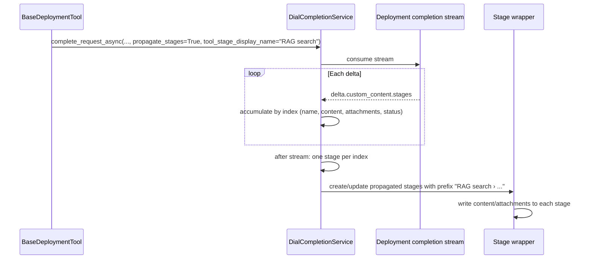

# Design: Subagent Stage Propagation

**Status:** Implemented

## Problem Statement

When a QuickApp invokes subagents (e.g. DIAL RAG, nested QuickApps), there is no way for the user to see what is happening inside those subagents. Subagents can produce **stages** — discrete steps or phases of work — but those stages are only visible within the subagent’s own context. The root QuickApp choice (the one the user is following) does not surface them, so users have no visibility into subagent progress without digging into each subagent call.

**Observable symptom:** A user sees the root QuickApp “calling RAG” or “calling another QuickApp” as a single step, with no indication of which sub-steps (e.g. “Access document”, “Load indexes”, “Combined search”) are running or completed inside that call.

## Design Goals

- When a QuickApp is configured to do so, stages produced by its subagents must be **propagated to the root QuickApp choice** (the choice the user is following).
- It must be **clear to the user that these stages belong to the subagent**, not to the root QuickApp. The UX must distinguish “stages of this QuickApp” from “stages of a subagent this QuickApp called” (e.g. labelling, grouping, or attribution so the source is unambiguous).
- Propagation must be **opt-in per deployment tool** via configuration; default behaviour remains no propagation.
- Handling of deployment stream deltas (including stages) must stay in a **single place** so the rest of the application stays agnostic to subagent internals.

---

## Proposed Design

Subagent stages are propagated to the root QuickApp choice only when a deployment tool is explicitly configured to do so. A new setting under `content_propagation` controls whether stages from the deployment completion stream are surfaced. The application reacts to `custom_content.stages` in the deployment completion stream inside `DialCompletionService._consume_stream()`, creating or updating stages on the current tool’s stage wrapper. Each propagated stage’s display name is prefixed with the invoking tool’s `display.stage.name` so the source (subagent vs root) is unambiguous. The design is backend-only; the DIAL chat completion wire format for `delta.custom_content.stages` is assumed given.

### Concern 1: Tool config (deployment)

**What:** A new boolean on deployment tool config to enable stage propagation.

**Owner:** `ContentPropagation` in `quickapp.config.tools.deployment`; `DialDeploymentTool.content_propagation`.

**Semantics:** Add `propagate_stages: bool = False` to `ContentPropagation`. When `True`, the deployment tool instructs the completion service to interpret `delta.custom_content.stages` and propagate them to the root QuickApp choice with prefixed names. Only deployment tools that set this to `True` propagate subagent stages.

**Change:** New field `propagate_stages` on `ContentPropagation` with description documenting that subagent stages from the deployment stream are propagated to the root choice with prefixed names so the source is unambiguous.

### Concern 2: Tool config (display)

**What:** Reuse existing display stage name as the prefix for propagated stages.

**Owner:** `ToolDisplayConfig.stage` (`ToolStageConfig`: `name`, `body`, `show`).

**Semantics:** No new config. The existing `display.stage.name` is the value used as the prefix for propagated stage names (e.g. “RAG search: › Access document '...' [0.01s]”). This reuses the existing display config and gives users clear attribution without new config surface.

**Change:** None. Read-only use of `tool_config.display.stage.name` when building propagated stage names.

### Concern 3: DialCompletionService — stream consumption and stage creation

**What:** In `_consume_stream()`, when stage propagation is enabled and `delta.custom_content` carries a `stages` field, accumulate by **stage index** (same index = same stage, merge; new index = new stage). After the stream, create one propagated stage per index with prefixed name and accumulated content/attachments.

**Owner:** `DialCompletionService` in `quickapp.dial_deployment_tooling.dial_completion_service`.

**Semantics:**

- **Accumulation:** For each delta with `custom_content.stages`, parse into a list of `SubagentStageDelta` (see data contracts). Group by `index`: append name parts, content, attachments; keep last status.
- **After stream:** Create one propagated stage per index in sorted order. Display name = `{tool_stage_display_name}{separator}{concatenated name parts}`. If there are no name parts, use `"Stage {index+1}"`. Write accumulated content and attachments to each stage.
- **Separator:** Fixed constant `PROPAGATED_STAGE_NAME_SEPARATOR` (e.g. `" › "`) from `quickapp.dial_deployment_tooling.constants`.

**Change:** Extend `complete_request_async` with optional `propagate_stages: bool = False` and `tool_stage_display_name: str | None = None`; pass them into `_consume_stream`. In `_consume_stream`, when `propagate_stages` is True and `delta.custom_content` has `stages`, accumulate by index and, after the stream, create propagated stages via the stage wrapper (child or sibling stages with prefixed names).

### Concern 4: BaseDeploymentTool — passing propagation into completion

**What:** Derive `propagate_stages` and `tool_stage_display_name` from tool config and pass them into the completion service.

**Owner:** `BaseDeploymentTool` in `quickapp.dial_deployment_tooling.base_deployment_tool`.

**Semantics:** In `_run_in_stage_async`, read `content_propagation.propagate_stages` and `tool_config.display.stage.name` (when present); pass them as `propagate_stages` and `tool_stage_display_name` into `complete_request_async`. When `content_propagation` is `None` or `propagate_stages` is False, pass `propagate_stages=False`; when display stage name is missing, pass `None` (fallback naming still applies).

**Change:** Pass propagation flag and tool stage display name into `complete_request_async` so `_consume_stream` can decide whether to handle `custom_content.stages` and how to prefix names.

### Concern 5: Stage wrapper and SDK

**What:** Create or update propagated stages from the current tool stage so they appear on the root choice.

**Owner:** `BaseStageWrapper` / deployment stage wrapper; SDK `Stage` (e.g. `append_name`, `append_content`, `add_attachment`, or child stage creation).

**Semantics:** The tool’s stage can create child stages (e.g. `create_stage(name)` if the SDK supports it), or the application creates sibling stages on the same choice with prefixed names. No change to `BaseStageWrapper` interface beyond what is strictly needed to create a propagated stage and write content/attachments to it.

**Change:** Implementation-specific: use SDK support for child stages or fallback (e.g. sibling stages on the choice with prefixed names) so the root choice shows a consistent view matching the subagent’s stage structure.

### Data flow (summary)



---

## Key interfaces and data contracts

| Item | Contract |
|------|----------|
| **Propagation setting** | `ContentPropagation.propagate_stages: bool = False`. When `True`, `_consume_stream()` interprets `delta.custom_content.stages` and propagates them with the naming rule below. |
| **Subagent stage payload** | `custom_content.stages`: list of stage delta objects. Each item identified by **index** (0-based). Same index across deltas = same logical stage (merge). Fields: `index`, optional `name`/`title`, optional `content`, optional `attachments`, optional `status`. See `SubagentStageDelta` in `stage_propagation_models.py`. |
| **Propagated stage name** | One propagated stage per subagent **index**. Display name = `{tool_stage_display_name}{PROPAGATED_STAGE_NAME_SEPARATOR}{concatenated name parts}`. Name parts appended in order. If no name parts, use `"Stage {index+1}"`. |
| **Separator constant** | `PROPAGATED_STAGE_NAME_SEPARATOR = " › "` in `quickapp.dial_deployment_tooling.constants`. |
| **Parsing** | `parse_stages(raw_stages)` in `stage_propagation_models`: resilient to partial/malformed payloads; only valid list items (dicts that validate as `SubagentStageDelta`) are returned. |

---

## Design patterns and rationale

- **Configuration-driven behaviour:** Whether stages are propagated is controlled by tool config (`content_propagation.propagate_stages`), not globally. Keeps the default safe (no propagation) and allows per-tool control.
- **Single place for stream reaction:** All handling of deployment stream deltas (content, attachments, state, and stages) stays in `DialCompletionService._consume_stream()`, so the deployment tool’s “internal” behaviour stays in one place and the rest of the app stays agnostic.
- **Naming convention:** Prefixing with `display.stage.name` reuses existing display config and gives users clear attribution without new config surface.

---

## Secondary considerations

- **Logging:** When stage propagation is triggered, log e.g. count of propagated stages (or first occurrence) for debugging.
- **Error handling:** If `custom_content.stages` is malformed or stage creation fails, fall back to not propagating or to a single stage with prefixed name and concatenated content; do not fail the whole completion. Log the condition. Malformed or non-dict items in `stages` are skipped by `parse_stages`.
- **Auth / security:** No change; stream consumption is already in a trusted backend path.
- **Extensibility:** The same mechanism (`custom_content.stages` + prefix rule) could later be used by other tools that call subagents (e.g. MCP or REST tools that return stages), if they adopt the same config and consumption pattern.

---

## Out of Scope

- **Frontend / UX design:** How to illustrate that propagated stages are from the subagent (naming, hierarchy, or visual treatment) is a product/UX concern; this design only specifies backend naming (prefix) so the source is unambiguous.
- **Root model stream:** The agent chunk processor’s `__process_custom_content()` (for root model stream) is for the root model only; deployment tool stream is consumed only in `DialCompletionService`. No change to ChunkProcessor for this feature.
- **Exact DIAL wire format:** The precise shape of `delta.custom_content.stages` (incremental vs full, field names) depends on the DIAL chat completion API and client/SDK; implementation aligns with the actual delta schema. The design assumes a list of stage-like objects with at least name/title and content.

---

## Configuration / Usage Examples

### Default: no propagation

```json
{
  "type": "deployment-tool",
  "deployment": { ... },
  "content_propagation": {
    "propagate_history": false,
    "propagate_stages": false
  }
}
```

Subagent stages are not propagated; user sees only the root QuickApp’s own stages.

### Enable stage propagation

```json
{
  "type": "deployment-tool",
  "deployment": { ... },
  "content_propagation": {
    "propagate_history": true,
    "propagate_stages": true
  },
  "display": {
    "stage": {
      "name": "RAG search",
      "body": "Searching knowledge base",
      "show": true
    }
  }
}
```

When the deployment returns `delta.custom_content.stages`, each subagent stage is propagated to the root choice with names like:

- `RAG search › Access document '...' [0.01s]`
- `RAG search › Load indexes`
- `RAG search › Combined search`

So the user sees both the root QuickApp’s stages and the subagent’s stages, with clear attribution to “RAG search”.

### Config sample reference

`config-sample.json` (or deployment tool config sample) includes optional `propagate_stages` under `content_propagation` so deployers know the option exists.

---

## Migration

### Breaking changes

None. Stage propagation is opt-in via `content_propagation.propagate_stages`. Default is `False`; existing configs are unchanged.

### Non-breaking changes

- New optional field `propagate_stages` on `ContentPropagation`; default `False`.
- New optional parameters `propagate_stages` and `tool_stage_display_name` on `DialCompletionService.complete_request_async` and `_consume_stream`.
- New module `stage_propagation_models` and constant `PROPAGATED_STAGE_NAME_SEPARATOR`. Existing callers that do not pass propagation args get default behaviour (no propagation).

---

## Risks and constraints

- **SDK and wire format:** The exact shape of `delta.custom_content.stages` depends on the DIAL chat completion API and client/SDK. Implementation must align with the actual delta schema; the design assumes a list of stage-like objects with at least name and content.
- **Stage hierarchy:** If the SDK does not support creating child stages under the tool’s stage, the implementation may create sibling stages on the choice with the same prefix; UX (ordering, grouping) should still make the source clear.
- **Ordering and streaming:** Stages are merged by **index**. All deltas with the same index are accumulated; after the stream, one propagated stage is created per index in sorted order, so the root choice shows a consistent view matching the subagent’s stage structure.

---

## Summary of Changes

| Component | Change |
|-----------|--------|
| **ContentPropagation** (`config/tools/deployment.py`) | Add `propagate_stages: bool = False` with description. |
| **DialDeploymentTool** | No structural change; uses existing `content_propagation`. |
| **ToolDisplayConfig.stage** | No change; read-only use of `display.stage.name` for prefix. |
| **Constants** (`dial_deployment_tooling/constants.py`) | Add `PROPAGATED_STAGE_NAME_SEPARATOR = " › "`. |
| **stage_propagation_models** (new) | `SubagentStageDelta` Pydantic model; `parse_stages(raw_stages)` for resilient parsing. |
| **DialCompletionService** | `complete_request_async`: optional `propagate_stages`, `tool_stage_display_name`. `_consume_stream`: accept same; when enabled and `delta.custom_content.stages` present, accumulate by index and create propagated stages with prefixed names. |
| **BaseDeploymentTool** | In `_run_in_stage_async`, derive and pass `propagate_stages` and `tool_stage_display_name` into `complete_request_async`. |
| **BaseStageWrapper / Stage (SDK)** | Use existing or new method to create propagated (child or sibling) stages and write content/attachments; no interface change unless required for creation. |
| **Config sample** | Show optional `propagate_stages` under `content_propagation`. |
