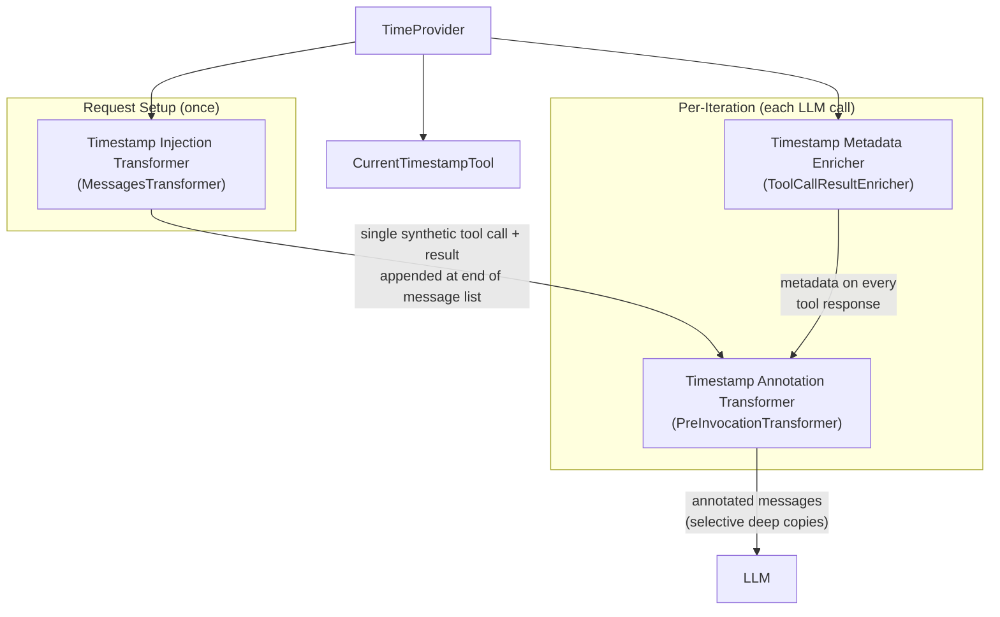
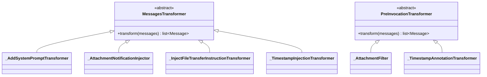

# Design: Time Awareness

- **Status:** Implemented
- **Dependencies:**
  - [Preview Feature Gating](preview_feature_gating.md)

## Problem Statement

LLMs have no inherent sense of time. When a user asks "what happened today?" or "schedule this for
tomorrow", the agent cannot reason about temporal context because it has no access to the current
date or time.

Today the only workaround is to have a general-purpose tool (e.g. the Python code interpreter)
that can return `datetime.now()`. This has two problems:

1. **Latency and waste** — the agent must decide to call a heavy tool just to learn the time,
   adding a full tool-call round-trip to every time-sensitive interaction.
2. **No temporal context for tool results** — when the agent receives data from tools (API
   responses, search results, fetched content), it has no way to know *when* that data was
   produced. It cannot reason about freshness or staleness.

## Design Goals

- The agent can determine the current date and time via a lightweight, dedicated tool.
- The current timestamp is automatically injected into the conversation at every user turn, so the
  agent always knows "when" the interaction is happening without an explicit tool call.
- Every tool response is annotated with its production timestamp, so the agent can reason about
  data freshness.
- The design is timezone-aware from the start (defaulting to UTC), with a clear extension point for
  request-level timezone configuration in the future.
- The timestamp tool lives in its own module (`timestamp_tooling`), independent of the existing
  internal tooling.

---

## Use Cases

### UC-1: User asks a time-sensitive question

- **Trigger:** User sends "What day is it today?" to an app with the timestamp tool enabled.
- **Behavior:** The agent sees the auto-injected timestamp in the conversation and answers directly.
- **Outcome:** The agent responds with the correct current date without making any tool calls.

### UC-2: Agent has access to data freshness information

- **Trigger:** The agent calls a REST API tool that returns market data during a multi-iteration loop.
  Several iterations later, the agent considers whether to re-fetch.
- **Behavior:** Each tool response carries a human-readable timestamp annotation. The agent can
  compare the annotation on the earlier result with the current time (from the auto-injected
  timestamp).
- **Outcome:** The agent has access to freshness information and can factor it into its decisions.
  Note: whether the LLM reliably acts on this depends on the model's temporal reasoning ability.

### UC-3: Agent plans a future action

- **Trigger:** User says "Remind me about this in 2 hours" or "What's the deadline if it's 3 days
  from now?"
- **Behavior:** The agent reads the auto-injected current timestamp and performs arithmetic on it.
- **Outcome:** The agent produces correct absolute dates/times relative to "now."

### UC-4: User asks for time in a specific timezone

- **Trigger:** User asks "What time is it in Tokyo right now?"
- **Behavior:** The agent calls `current_timestamp` with `{"timezone": "Asia/Tokyo"}`. The tool
  returns the current time converted to the requested timezone via `ZoneInfo`.
- **Outcome:** The agent responds with an authoritative, server-computed time in the requested
  timezone — no LLM arithmetic required, avoiding errors with DST or unusual offset rules.

### UC-5: Multi-turn conversation spanning time

- **Trigger:** A conversation spans several minutes. The user sends a new message after a pause.
- **Behavior:** Each user turn gets a fresh auto-injected timestamp. The agent can see the
  progression of time across turns.
- **Outcome:** The agent can reference "your previous message was 5 minutes ago" or "since your
  last message, the data may have changed."

---

## Proposed Design

The feature has five cooperating concerns:



### 1. Timestamp Tool

- **What:** A new `_CurrentTimestampTool` extending `StagedBaseTool`, registered within the
  `timestamp_tooling` module.
- **Owner:** `timestamp_tooling` module.
- **Semantics:** Accepts an optional `timezone` parameter (IANA name, e.g. `"Asia/Tokyo"`).
  Defaults to UTC. Returns the current date and time as ISO 8601 with timezone name and source
  (`default` or `request`).
- **Change:** New tool class, new DI module.

The tool is not part of any user-configured toolset. `TimestampModule` registers it
conditionally (when time awareness is enabled) via `@multiprovider`, following the
`AttachmentProcessingModule` / `_AvailableContextTool` pattern.

The auto-injected timestamp already gives the agent "now" in UTC. The tool's primary purpose is
explicit timezone conversion (UC-4) — the agent calls it with a `timezone` parameter when the
user asks about a specific timezone.

### 2. Auto-Injection via MessagesTransformer

- **What:** `_TimestampInjectionTransformer`, a `MessagesTransformer` that appends a single
  synthetic tool-call + tool-result pair at the end of the message list.
- **Owner:** `timestamp_tooling` module.
- **Semantics:** Runs once at request setup (in `_MessagesSetup`). Appends a synthetic
  assistant message with a tool call to `current_timestamp` and a corresponding tool result
  containing the current UTC time at the end of the message list. Uses a deterministic
  synthetic ID with a known prefix (e.g. `call_synthetic_timestamp_`). Other transformers
  (e.g. `_AttachmentNotificationInjector`) may also append messages — ordering between them
  does not matter. From the agent's perspective: "I saw the user's message, I checked the
  time, now I respond."
- **Change:** New transformer registered via `@multiprovider` as `list[MessagesTransformer]`.

**History persistence:** The synthetic timestamp messages are appended at the end of the
message list, placing them inside the window captured by `_build_tool_execution_history()`. On
the next request, `extract_tool_calls()` restores them with the **original** timestamp. The
transformer then appends a new timestamp at the end of the new message list. Each turn's
timestamp is preserved with its correct historical time (UC-5).

**Token cost:** Only 2 extra messages per turn (one assistant tool call + one tool result).
Historical timestamps are restored from state, not re-injected.

### 3. Tool Response Metadata Enrichment

- **What:** `ToolCallResultEnricher` ABC in `common/abstract/` and
  `_TimestampMetadataEnricher` implementation in `timestamp_tooling`.
- **Owner:** ABC in `common/abstract/`, implementation in `timestamp_tooling`.
- **Semantics:** After each tool completes in `ToolExecutor`, the enricher stamps the result's
  state with timestamp metadata (production time, timezone, source). Uses "fill if absent"
  semantics — if a tool already set metadata, the enricher preserves it.
- **Change:** `ToolExecutor` receives `list[ToolCallResultEnricher]` via DI and runs them
  on each `ToolCallResult` after tool execution. The ABC is needed to keep `agent/` decoupled
  from `timestamp_tooling/` — `ToolExecutor` depends on the abstraction, not the concrete
  implementation.

The metadata is stored in `ToolCallResult.state` under a `_message_metadata` key, using a
`MessageMetadata` Pydantic model that nests `TimestampMetadata`.

### 4. Per-Invocation Annotation Transformer

- **What:** A new transformer tier (`PreInvocationTransformer`) that runs before every LLM call,
  and a `_TimestampAnnotationTransformer` that appends human-readable timestamp strings to tool
  messages.
- **Owner:** `PreInvocationTransformer` ABC in `common/abstract/base_transformer.py`;
  annotation transformer in `timestamp_tooling`.
- **Semantics:**
    - `AssistantInvoker.__prepare_messages()` runs all `PreInvocationTransformer` instances
      before each LLM call. This ensures annotations never leak into the persisted message
      history.
    - Each transformer is responsible for its own deep-copy strategy — it copies only the
      messages it mutates, leaving the rest as references (same approach as `_AttachmentFilter`
      today).
    - `_TimestampAnnotationTransformer` iterates tool messages, reads `_message_metadata` from
      state, and appends an annotation like `\n[Timestamp: 2026-01-15 12:30:00 UTC]`.
    - The transformer skips messages whose `tool_call_id` starts with the synthetic timestamp
      prefix (`call_synthetic_timestamp_`) to avoid double-annotating timestamp tool results.
      This is simpler than looking up the tool name from the preceding assistant message.
    - Annotations are appended to `msg.content` which the LLM always reads as text, regardless
      of the tool's logical content type. Downstream components are unaffected because
      annotations only exist in the per-invocation copies, never in the persisted history.
- **Change:**
    - New `PreInvocationTransformer` ABC alongside existing `MessagesTransformer`.
    - `AssistantInvoker` receives `list[PreInvocationTransformer]` via DI and applies them.
    - `_AttachmentFilter` is refactored into a `PreInvocationTransformer` (it already operates
      on selective deep copies per-invocation — this formalizes the pattern).

### 5. TimeProvider

- **What:** A request-scoped provider that returns the current time in a configured timezone.
- **Owner:** `timestamp_tooling` module.
- **Semantics:** Constructed at request scope with a `ZoneInfo` timezone and a
  `TimestampSource` enum (`DEFAULT` or `REQUEST`). Defaults to UTC / `DEFAULT`. Calls
  `datetime.now(tz)` on each invocation — it is a provider, not a snapshot. Each tool result
  gets stamped with its actual production time, even if the orchestrator loop spans multiple
  iterations. When the request carries a timezone (future extension point), the provider is
  constructed with that timezone and `TimestampSource.REQUEST`. This is the natural DI seam
  for request-level timezone — when it arrives, only the provider construction changes.
- **Change:** New class, bound in `TimestampModule` at request scope.

### 6. Transformer Hierarchy

The current codebase has a single `MessagesTransformer` ABC and a separate `_AttachmentFilter`
that is not a transformer. This design adds a second tier — `PreInvocationTransformer` — without
renaming the existing `MessagesTransformer`:



| Tier                       | When it runs                           | Mutation safety                                     |
|----------------------------|----------------------------------------|-----------------------------------------------------|
| `MessagesTransformer`      | Once, in `_MessagesSetup.setup()`      | Mutates the canonical message list                  |
| `PreInvocationTransformer` | Every iteration, in `AssistantInvoker` | Each transformer selectively copies what it mutates |

### 7. Configurability

Time awareness is a feature-level concern that impacts the whole app (tool registration,
message transformation, tool result enrichment), not just the orchestrator. It is configured
under a new top-level `features` section in `ApplicationConfig`.

#### Features model

A new `Features` model groups optional, independently toggleable capabilities. Each capability
is an optional config object — presence enables the feature. `Features` lives at the
`ApplicationConfig` level and defaults to an empty instance (all features `None`) to avoid
double null checks in code:

```python
class Features(BaseModel):
    timestamp: TimestampConfig | None = PreviewField(
        default_factory=ToolCallTimestampConfig,
        description="Time awareness configuration.",
    )

class ApplicationConfig(BaseApplicationTypeConfig):
    # ... existing fields ...
    features: Features = Field(
        default_factory=Features,
        description="Optional feature flags.",
    )
```

`Features.timestamp` uses the `TimestampConfig` alias from the start. A discriminated union
with one variant is functionally identical to the concrete type, so there's no cost today.
When a second strategy is added, only the union definition changes — `Features` stays
untouched.

The `features` field has `propertyKind: "server"` (backend concern, not client-visible).
`propertyOrder` is auto-assigned by position (last among top-level fields).

An app opts in with:

```json
{
  "orchestrator": {
    "deployment": {
      "name": "gpt-4o"
    }
  },
  "features": {
    "timestamp": {}
  }
}
```

When disabled (no `features` section, no `timestamp` key, or `"timestamp": null`):

- `TimestampModule` does not register the tool, injection transformer, annotation transformer,
  or metadata enricher.
- No synthetic messages are injected, no tool responses are annotated.
- Zero overhead for apps that do not need time awareness.

Code access is always `config.features.timestamp` — no outer null check needed.

#### TimestampConfig and injection strategy extensibility

`TimestampConfig` is a discriminated union keyed on `injection_strategy`. Each strategy has
its own config model with strategy-specific properties. Initially only `ToolCallTimestampConfig`
exists:

```python
class ToolCallTimestampConfig(BaseModel):
    injection_strategy: Literal["tool_call"] = "tool_call"


# Type alias — currently a single variant.  When a second strategy is added,
# change this to a discriminated union:
#   TimestampConfig = Annotated[
#       ToolCallTimestampConfig | SystemPromptTimestampConfig,
#       Discriminator("injection_strategy"),
#   ]
TimestampConfig = ToolCallTimestampConfig
```

`TimestampModule` matches on the config type and registers the appropriate components. When
a new strategy is needed (e.g. system prompt injection), a new config model is added to the
union and the module registers a `PromptPartProvider` instead of
`_TimestampInjectionTransformer`. Adding a variant to the union is a non-breaking change
(existing configs with `"injection_strategy": "tool_call"` or no `injection_strategy` key
continue to parse as `ToolCallTimestampConfig`). Each strategy's config model carries only
the properties relevant to that strategy — no shared fields accumulate unused options.

#### Preview feature gating

For this release cycle, `TimestampModule` is a preview module and the `timestamp` field uses
`PreviewField`.

---

## Secondary Fixes

### AttachmentFilter formalization

`_AttachmentFilter` currently lives outside the transformer hierarchy — it's called directly by
`AssistantInvoker` and performs its own deep copies. With the `PreInvocationTransformer`
abstraction, it becomes a proper transformer registered via DI. `AssistantInvoker` no longer
needs to know about `_AttachmentFilter` specifically; it just runs all pre-invocation
transformers.

### MessageMetadata model

A shared `MessageMetadata` model (in `common/`) provides typed access to tool message state.
This replaces ad-hoc `custom_content.state` dict access with a structured model:

```python
class TimestampSource(StrEnum):
    DEFAULT = "default"  # timezone not provided, defaulted to UTC
    REQUEST = "request"  # timezone provided in the request


class TimestampMetadata(BaseModel):
    response_timestamp: datetime | None = None
    timestamp_source: TimestampSource | None = None
    timezone_name: str | None = None


class MessageMetadata(BaseModel):
    timestamp: TimestampMetadata | None = None
```

---

## Out of Scope

### User timezone from request headers

The design prepares for this (via `TimeProvider` with configurable timezone and
`TimestampSource.REQUEST` provenance), but actual header extraction and request-level
timezone override are deferred. **Why:** DIAL Core does not currently pass timezone in request
headers. When it does, the only change needed is populating `TimeProvider` from the header in
request setup.

### System prompt injection strategy

An alternative injection strategy that injects the current timestamp directly into the system
prompt via a `PromptPartProvider` instead of using synthetic tool-call messages. When needed,
a `SystemPromptTimestampConfig` model is added to the `TimestampConfig` discriminated union
and handled by `TimestampModule` — the DI seam already supports this (see §7). **Why deferred:**
The tool-call strategy covers all current use cases and preserves per-turn history naturally.
The system prompt strategy may be preferable for models that handle system prompts better than
synthetic tool calls, but this needs validation.

### Agent-learned timezone from conversation

The agent could learn the user's timezone from conversation context (e.g. "I'm in Warsaw") and
apply it to subsequent timestamps. Deferred because it adds complexity (timezone persistence
across turns, state management) and the auto-injection with UTC covers the primary use cases.

---

## Configuration / Usage Examples

### Tool config (inline in code)

The tool config is defined inline in a `_tool_configs.py` module (same pattern as
`_AvailableContextTool`), not in a predefined JSON file. This keeps the tool self-contained
within the `timestamp_tooling` module since it is not user-customizable.

```python
CURRENT_TIMESTAMP_TOOL_CONFIG = InternalTool(
    open_ai_tool=OpenAiToolConfig(
        function=OpenAiToolFunction(
            name="current_timestamp",
            description="Returns the current date and time. Optionally converts to a specific timezone.",
            parameters=OpenAiToolFunctionParameters(
                type=JsonTypeEnum.object,
                properties={
                    "timezone": ConfigurableSchemaSimpleType(
                        type=JsonTypeEnum.string,
                        description="IANA timezone name (e.g. 'Asia/Tokyo'). Defaults to UTC.",
                    )
                },
            ),
        )
    ),
)
```

### Module registration

`TimestampModule` registers the tool and all transformers directly via `@multiprovider`,
following the same pattern as `AttachmentProcessingModule` with `_AvailableContextTool`. The
registration is conditional on the presence of a `timestamp` section in
`ApplicationConfig.features`.

### What the LLM sees (auto-injected)

First turn — synthetic timestamp appended at the end of the message list. Other transformers
(e.g. `_AttachmentNotificationInjector`) may also append messages; the timestamp appears after
them:

```
[system] You are a helpful assistant...

[user]     What day is it?

[assistant] (tool_call: current_timestamp → {})
[tool]     2026-03-24T14:30:00+00:00 (UTC, source=default)

[assistant] Today is Monday, March 24, 2026.
```

When the app has contexts configured, context notifications appear between the user message
and the timestamp:

```
[user]     What day is it?

[assistant] (tool_call: available_context → {})
[tool]     {"entries": [...]}

[assistant] (tool_call: current_timestamp → {})
[tool]     2026-03-24T14:30:00+00:00 (UTC, source=default)
```

Second turn — previous timestamp restored from history, new one appended at the end:

```
[system] You are a helpful assistant...

[user]     What day is it?

[assistant] (tool_call: current_timestamp → {})
[tool]     2026-03-24T14:30:00+00:00 (UTC, source=default)

[assistant] Today is Monday, March 24, 2026.

[user]     And what time is it now?

[assistant] (tool_call: current_timestamp → {})
[tool]     2026-03-24T14:35:12+00:00 (UTC, source=default)
```

### Tool response annotation example

After the metadata enricher runs, a REST API tool response that originally contained:

```
{"temperature": 22, "unit": "celsius"}
```

Is seen by the LLM (after the annotation transformer) as:

```
{"temperature": 22, "unit": "celsius"}
[Timestamp: 2026-03-24 14:30:00 UTC]
```

---

## Migration

### Breaking changes

None.

### Non-breaking changes

- New `features` field on `ApplicationConfig` — defaults to empty `Features()`.
- New `ToolCallResultEnricher` pipeline in `ToolExecutor` — empty list means no change.
- New `PreInvocationTransformer` pipeline in `AssistantInvoker` — empty list means no change.
- `_AttachmentFilter` becoming a `PreInvocationTransformer` is an internal refactor with no
  config or behavioral change.

## Summary of Changes

### `common/abstract/`

- **Add** `ToolCallResultEnricher` ABC (`tool_call_result_enricher.py`)
- **Add** `PreInvocationTransformer` ABC (in `base_transformer.py`)

### `common/`

- **Add** `MessageMetadata`, `TimestampMetadata`, `TimestampSource` (`message_metadata.py`)
- **Add** `TimeProvider` (`time_provider.py`)

### `timestamp_tooling/` (new module)

- **Add** `_tool_configs.py` — inline tool config (same pattern as `_AvailableContextTool`)
- **Add** `_CurrentTimestampTool` — the tool implementation
- **Add** `_TimestampInjectionTransformer` — auto-injects timestamp at end of message list
- **Add** `_TimestampAnnotationTransformer` — annotates tool messages per-invocation
- **Add** `_TimestampMetadataEnricher` — stamps every tool result with production time
- **Add** `TimestampModule` — DI wiring

### `config/`

- **Add** `ToolCallTimestampConfig` model, `TimestampConfig` discriminated union type alias
- **Add** `Features` model with `PreviewField`-annotated fields
- **Modify** `ApplicationConfig` — add `features: Features` field (defaults to empty `Features()`)

### `agent/`

- **Modify** `ToolExecutor.execute()` — run `ToolCallResultEnricher` chain after tool execution
- **Modify** `AssistantInvoker.__prepare_messages()` — run `PreInvocationTransformer` chain
- **Refactor** `_AttachmentFilter` → `PreInvocationTransformer` subclass

### `app_factory.py`

- **Add** `TimestampModule` to the module list
