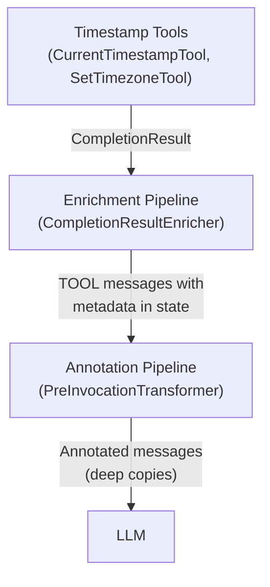
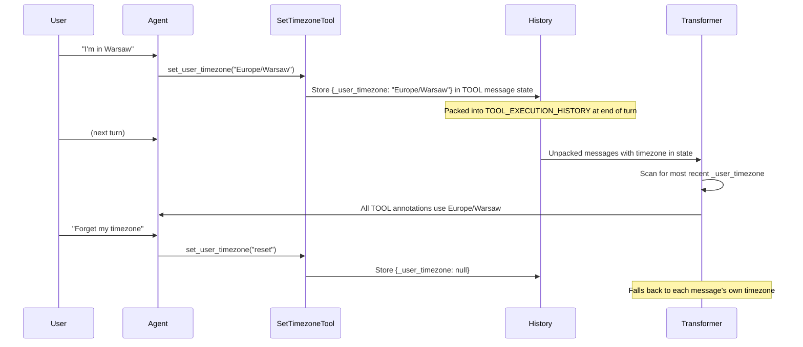
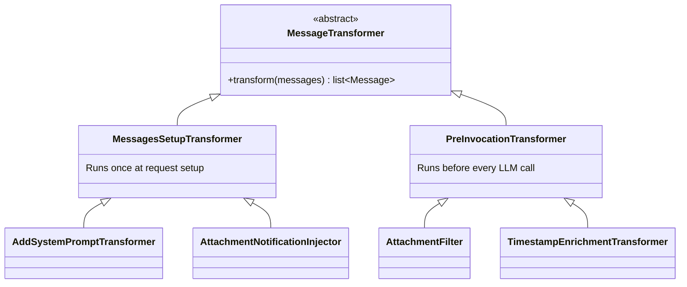

# Timestamp Awareness

## Motivation

LLMs have no inherent sense of time. When a user asks "what's the current time?" or "summarize what happened today", the agent cannot answer without external help. Similarly, when tools return data (API responses, search results, fetched content), the agent has no way to know *when* that data was produced or how fresh it is.

This feature introduces time awareness to the Quick Apps agent at three levels:

1. **Explicit time access** — the agent can ask "what time is it?" via a dedicated tool
2. **Implicit freshness signals** — every tool response is annotated with when it was produced, so the agent can reason about data recency
3. **User timezone management** — the agent can learn and apply the user's timezone, so timestamps are presented in the user's local time rather than server UTC

## Challenges

### The LLM cannot see message metadata

Tool responses in the DIAL protocol carry a `custom_content.state` dictionary that persists across turns. This is invisible to the LLM — it only sees the `content` field. Any timestamp information stored solely in state is useless for the agent's reasoning. The design must surface timestamps into the content the LLM reads, while keeping machine-readable metadata in state for programmatic use.

### Timezone provenance ambiguity

A timestamp like `2026-01-15T12:30:00+00:00` doesn't tell the agent whether it's in UTC because the server defaulted to UTC, or because the user is actually in UTC. This distinction matters: if the server defaulted, the agent should caveat its response; if the user chose it, the agent can present it confidently. Every timestamp needs a provenance label.

### Cross-tool consistency

Metadata enrichment was originally embedded in the tool base class (`StagedBaseTool`), forcing every tool subclass to accept a `TimeProvider` dependency through its constructor — pure boilerplate for tools that never use time directly. The design must decouple timestamp enrichment from individual tools so it applies uniformly without touching tool implementations.

### Non-destructive annotation

The orchestrator's message history is the source of truth. It gets packed into `TOOL_EXECUTION_HISTORY` state at the end of each turn and unpacked on the next turn. Timestamp annotations added for the LLM must not leak into this persisted history — they are ephemeral per-invocation decorations. Mutating the original messages would cause annotations to accumulate on every turn.

### Timezone persistence across turns

When the user says "I'm in Warsaw", the agent needs a way to remember this. Tool instances are request-scoped (recreated each request), so instance fields don't survive across turns. The timezone setting must persist through the message history state mechanism.

## Design Overview

The feature is composed of four cooperating subsystems:



### 1. Timestamp Tools

Two tools give the agent direct control over time:

**Current Timestamp Tool** returns the current date and time with provenance labels. The content includes the IANA timezone name and source (server default vs. user-provided), so the agent can present time accurately and honestly to the user. The tool also pre-sets its own metadata in state, ensuring the enrichment pipeline preserves these values rather than overwriting them.

**Set Timezone Tool** allows the agent to store the user's timezone when the user mentions it in conversation. The timezone is validated against the IANA database and stored in message state under a well-known key. It supports reset to clear a previously set timezone. The tool's stage is hidden in the UI since it's a background action.

Both tools are packaged as predefined tools and bundled into a single toolset, so applications can enable timestamp awareness by adding one toolset reference to their configuration.

### 2. Enrichment Pipeline

The `CompletionResultEnricher` abstraction decouples metadata enrichment from individual tools. After `ToolExecutor` runs all tools in parallel via `asyncio.gather`, it passes each result through a chain of enrichers.

The `_TimestampMetadataEnricher` populates four metadata fields on every tool response: the timestamp of when the response was produced, the provenance source, the timezone name, and the content type. All fields use "fill if absent" semantics — if a tool already set a field (as the current timestamp tool does), the enricher preserves it.

This replaced the previous approach where `StagedBaseTool._enrich_state()` handled enrichment, which required every tool subclass to accept and forward a `TimeProvider` through its constructor. The new design removes `TimeProvider` from the base class entirely.

### 3. Annotation Pipeline

Metadata in state is invisible to the LLM. The `_TimestampEnrichmentTransformer` bridges this gap by appending human-readable timestamp annotations to tool message content before each LLM invocation.

The transformer runs as part of the `PreInvocationTransformer` pipeline — a formalization of the per-iteration message preprocessing that previously existed only as an ad-hoc attachment filter. The pipeline operates on deep copies of the message history, so annotations never leak into the persisted history.

For each tool message with timestamp metadata, the transformer appends an annotation like:

```
[Timestamp: 2026-01-15 12:30:00 UTC (server default timezone)]
```

If the user has set a timezone via the set timezone tool, all timestamps are converted to that timezone:

```
[Timestamp: 2026-01-15 13:30:00 Europe/Warsaw (user-provided timezone)]
```

The transformer skips non-text content types (e.g. JSON from context tools) to avoid corrupting structured output.

### 4. Timezone Lifecycle

Timezone information flows through the system at two levels:

**Request-level timezone** is set when the request arrives (e.g. extracted from request headers). It determines the `TimeProvider`'s timezone and provenance source for the duration of that request. If no timezone is provided, the server defaults to UTC with source `SERVER`.

**Conversation-level timezone** is set by the agent via the set timezone tool. It's stored in message state and persists across turns through the tool execution history packing/unpacking mechanism. The annotation transformer scans the message history for the most recent timezone setting and applies it when formatting annotations.



The two levels are complementary: request-level timezone affects tool execution (what time the current timestamp tool reports), while conversation-level timezone affects presentation (how timestamps are displayed to the LLM in annotations).

## Message Transformer Hierarchy

This feature formalized an existing architectural pattern into a proper hierarchy. Previously, there were two kinds of message transformers with no shared type:

- **Setup transformers** that run once at request setup (system prompt injection, attachment notifications)
- **Per-invocation transformers** that run before every LLM call (attachment filtering)



The new hierarchy introduces a common base with two marker subclasses that encode *when* the transformer runs. This allows the DI system to aggregate transformers of each type independently and lets new transformers (like the timestamp annotation transformer) plug into the correct phase without modifying existing wiring.

The per-invocation pipeline performs a single upfront deep copy of the message list before running any transformers, so individual implementations can mutate freely. This replaced the previous approach where each transformer was individually responsible for avoiding mutation of the originals.

## Provenance Model

Every timestamp in the system carries a provenance label indicating its source:

- **SERVER** — the timezone was not explicitly provided; the server used its default (UTC). The agent should treat timestamps as potentially not matching the user's local time.
- **USER_TIMEZONE** — the timezone was explicitly provided (via request headers or conversation). Timestamps can be presented as the user's local time.

This is tracked as a `TimestampSource` enum that flows through the system: from `_RequestContext` to `TimeProvider` to `MessageMetadata` to the annotation transformer. It replaces a previous boolean flag that only tracked whether the timezone had been set, without encoding the semantic meaning.

## Backward Compatibility

All new metadata fields are optional with `None` defaults. Messages from older conversations that lack provenance fields deserialize cleanly — the enricher treats missing fields as unset and fills them with current defaults. The annotation transformer skips messages without metadata entirely. No migration is needed.

The `MessagesSetupTransformer` class retains a backward-compatible alias under the old `MessagesTransformer` name.