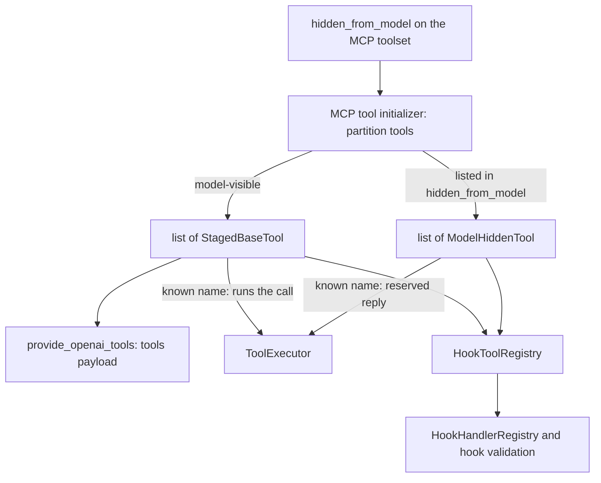

# Design: Tools Hidden from the Model

- **Status:** Approved
- **Phases:** Phase 1 (this iteration, specified in detail) covers MCP toolsets plus the type-agnostic
  foundation. Phase 2 (REST, DIAL deployment, internal tools) is conditional — see [Phasing](#phasing)
- **Dependencies:**
  - [Hook Context, Parameter Templating, and Lifecycle Events](hook_context_and_lifecycle_events.md) — the
    hooks that consume these tools
  - [DIAL App Toolset](dial_app_toolset.md) — the `dial-app` MCP branch that carries the new field
  - [Dynamic Tool Discovery](dynamic_tool_discovery.md) — the deferral mechanism that must never expose
    these tools

## Problem Statement

A hook calls a tool by toolset and tool name. The tool is looked up in the same request-scoped
`list[StagedBaseTool]` that the orchestrator advertises to the model. Every tool a hook can reach is
therefore also offered to the model, and `ToolExecutor` runs it when the model asks.

This surfaced with an agent-memory MCP server. Its tools (`get_skill`, `prime_memories`, `save_memory`) are
meant to be driven by `on_request_start` and `on_completion` hooks, yet the model sees them in `tools` and
starts calling them on its own. None of the existing levers fixes this:

- `allowed_tools` on an MCP toolset drops the tool from the request entirely, so the hook reports
  `tool '...' not found in initialized tools`.
- `deferred` only withholds the schema from the initial payload. The tool stays discoverable through
  `tool_search` and executable by `ToolExecutor`.
- The manifest has no way to say "this tool is for the platform's own use, hide it from the model".

Hooks are the only platform-side consumer of such tools today. The mechanism is named after its effect on the
model (`hidden_from_model`), not after the consumer, so that a future consumer can reuse it without renaming
a published field.

## Design Goals

- A manifest can declare MCP tools that hooks can call and the model can never use: absent from the `tools`
  payload, absent from the `tool_search` catalog, and not executed when the model requests them by name.
- When the model does request such a tool (for example by imitating a synthetic tool-call pair in history),
  it receives a clear tool response saying the tool is not available to it and is called by the platform
  automatically, not a generic "unknown tool".
- Hooks treat model-hidden and ordinary tools identically: same `toolset_name` + `tool_name` addressing, same
  argument templating, same hidden debug stage.
- The model-side exclusion holds by construction. Code that reads the model's tool collection cannot see a
  model-hidden tool without explicitly opting in.
- The runtime foundation (collection type, context bucket, hook lookup, executor behavior) is independent of
  the tool type, so Phase 2 adds a config field and a routing call per tool type and changes no consumer.
- The schema change is purely additive. No existing manifest changes meaning.

---

## Phasing

| Phase | Scope | Status |
|---|---|---|
| **1** | Foundation (DI collection, context bucket, hook lookup, executor reply, request-conflict check) and the config field for MCP-based toolsets: `mcp`, `dial-mcp`, `dial-app` (MCP branch only; a `dial-app` resolves to the MCP or the chat-completion branch, see [DIAL App Toolset](dial_app_toolset.md)) | Specified in this document |
| **2** | A per-tool flag for toolsets that declare tools one by one: `rest-api`, `dial-deployment` (including `DialDeploymentSimpleTool`), `internal`; `dial-app` chat-completion branch is reachable through `dial-deployment` | Conditional — see [Phase 2](#phase-2-other-tool-types-conditional) |

Phase 1 implements nothing of Phase 2 but is shaped so that Phase 2 is additive. The rules below cost nothing
in Phase 1:

1. **The foundation knows nothing about tool types.** The model-hidden bucket lives in `ToolingContextBase`,
   which every tooling context already extends. Adopting a tool type later means filling the bucket.
2. **The routing decision is made where the tool is created, from the declared configuration.** It happens
   before the deferral decision, so a model-hidden tool is never registered as deferred.
3. **Names are reserved now.** `hidden_from_model` always means "a list of names of tools that are discovered
   at runtime". The Phase 2 per-tool field is a different field on a different object, so the two never
   collide (see [Schema evolution](#schema-evolution)).
4. **Validation is shared.** The `hidden_from_model` validator is one function reused by every MCP-based
   toolset class.

---

## Use Cases

### UC-1: Memory server driven only by hooks

**Trigger:** An application declares a `dial-app` toolset over the memory MCP server and lists all of its
tools in `hidden_from_model`. Hooks reference `prime_memories` and `save_memory`.
**Behavior:** The tools are initialized through the normal MCP session, but are not added to the model's
`tools` payload. Hooks resolve them by name and call them.
**Outcome:** The model never sees or calls the memory tools. The synthetic tool-call pair injected by an
`on_request_start` hook still appears in history.

### UC-2: One server, mixed audience

**Trigger:** The same server also exposes `search_memories`, which the model may legitimately call. The
manifest lists only `get_skill`, `prime_memories` and `save_memory` in `hidden_from_model`.
**Behavior:** One toolset, one MCP session. Three tools go to the model-hidden collection and one to the
model's collection.
**Outcome:** The model sees one memory tool; hooks can use all four.

### UC-3: The model calls a model-hidden tool anyway

**Trigger:** History contains a synthetic `prime_memories` pair and the model repeats the call.
**Behavior:** `ToolExecutor` recognizes the name as model-hidden and returns a tool response stating that the
tool is not available to the model, is called by the platform automatically, and must not be called.
**Outcome:** No tool runs. The model continues without it and does not retry.

### UC-4: Misconfiguration

**Trigger:** `hidden_from_model` names a tool that is missing from `allowed_tools`, or that the server does
not provide.
**Behavior:** The first case is rejected when the manifest is loaded. The second is logged as a warning at
initialization, and a hook that references the tool reports it as not found through the existing
`HookInitializationException`.
**Outcome:** A typo never silently exposes or loses a tool.

---

## Proposed Design



### Component 1: Configuration

**What:** An optional field `hidden_from_model: list[str] | None` on the three MCP-based toolset classes:
`MCPToolSet`, `DialMCPToolSet`, `DialAppToolSet`.

**Owner:** `config/toolsets/`

**Semantics:**

- Entries are raw tool names as the MCP server reports them — the same addressing as `allowed_tools`, which
  is also the `tool_name` that hooks use.
- `None` (default) and an empty list both mean "every tool is visible to the model".
- When `allowed_tools` is set, every entry of `hidden_from_model` must be present in it. A tool outside
  `allowed_tools` is dropped before routing, so a mismatch would silently lose the tool for the hook too.
  The mismatch is a validation error that names the offending entries.
- Names unknown to the server are not a configuration error (the server can change independently). They
  produce a warning at initialization.
- The field is a `PreviewField`. Hooks are a preview feature, so the field is stripped from the published
  schema and nullified at runtime when `ENABLE_PREVIEW_FEATURES` is off; the tools then stay model-visible,
  consistent with no hooks running.
- On the `dial-app` chat-completion branch the field is ignored with a warning, exactly as `allowed_tools`
  is. That branch yields one synthetic deployment tool without a per-tool configuration; it is covered by
  Phase 2.
- Hiding works by listing. A tool added to the server later is model-visible unless `allowed_tools` also
  pins the set. Documentation recommends setting both whenever `hidden_from_model` is used.

**Change:** Add the field and one shared validator. Carry the field through the two places that rebuild an
`MCPToolSet` by hand: `_MCPToolInitializer._process_toolset` (the `DialMCPToolSet` resolution) and
`_DialAppResolver._handle_mcp_branch`. Omitting it in either place leaves the tools model-visible without any
error, so each path gets its own unit test.

### Component 2: The model-hidden tool collection

**What:** A DI type `ModelHiddenTool`, an alias of `StagedBaseTool` annotated with a tag (the same technique as
`DeferredToolName`). `list[ModelHiddenTool]` is a separate injector key from `list[StagedBaseTool]`.

**Owner:** `common/`, `core/agent/agent_module.py`

**Semantics:**

- Model-hidden tools are ordinary tool instances built by the same builders as model-visible tools, so they
  share the toolset's MCP client and session lifetime. `on_completion` hooks still run before request-scoped
  sessions close.
- `ToolingContextBase` gets a second bucket with `extend_model_hidden_tools` and a `model_hidden_tools` property.
  Each tooling module that supports the feature adds one `@multiprovider` returning `list[ModelHiddenTool]` from
  its context.
- `AgentModule` provides an empty `list[ModelHiddenTool]`, the established pattern for extension lists, so
  consumers can always inject it.
- The hook tool registry (Component 4) is the only reader of this collection today. A future platform-side
  consumer injects it the same way; no configuration field changes.
- Because the collections are separate, `provide_openai_tools`, `ToolExecutor`, `tool_search`, stream sinks
  and the synthetic injectors keep reading `list[StagedBaseTool]` and cannot see model-hidden tools.

**Change:** New alias in `common/`; `ToolingContextBase` bucket; `AgentModule` empty provider; in Phase 1,
`MCPToolingModule` provider.

### Component 3: Routing in the MCP initializer

**What:** `_MCPToolInitializer._load_tools` partitions the tools it builds.

**Owner:** `mcp_tooling/`

**Semantics:**

1. Fetch the server's tools and apply `allowed_tools` (unchanged order).
2. Build a tool for each remaining server tool.
3. Tools whose raw name is in `hidden_from_model` go to the model-hidden bucket; the rest follow the existing
   path.
4. The deferral decision (`is_toolset_deferred`) and the deferred registry see only the model-visible tools.
   A toolset whose tools are all model-hidden has nothing to defer and contributes nothing to the `tool_search`
   catalog. The `min_tools_for_deferral` threshold counts visible tools only.
5. Names in `hidden_from_model` that the server did not return are logged as a warning with the toolset label.

**Change:** `_MCPToolInitializer._load_tools`.

### Component 4: Hook lookup

**What:** A new class `HookToolRegistry` (working name) — a single request-scoped place that answers "which
tools can a hook call", returning model-visible tools together with model-hidden tools.

**Owner:** `agent_hooks/`

**Semantics:** `HookHandlerRegistry` (tool resolution for `ToolCallHookHandler`) and `_AgentHooksContext`
(the `tool '...' not found in initialized tools` validation) both read `HookToolRegistry` instead of
`ProviderOf[list[StagedBaseTool]]`. A hook behaves identically whichever collection the tool came from.

**Change:** New `HookToolRegistry` in `agent_hooks/`, bound request-scoped in `AgentHooksModule`; the two
consumers switch to it.

### Component 5: Model-side reply

**What:** `ToolExecutor` distinguishes three outcomes for a requested tool name: known and model-visible
(runs), model-hidden (reserved reply), unknown (existing reply).

**Owner:** `core/agent/tool_executor.py`

**Semantics:**

- `ToolExecutor` additionally receives `list[ModelHiddenTool]` and keeps the set of their function names.
- A call to a model-hidden name produces a fallback result through the same mechanism as the unknown-tool path
  (a `ContinueStrategyModel`), so it is an ordinary tool response in history and the loop continues. The text
  states that the tool is not available to the model and is called by the platform automatically, that it
  must not be called, and that the model should continue without it. The unknown-tool text ("check the tool name and try again") would invite a retry and
  is deliberately not reused.
- The event is logged at warning level with the tool name only, without the list of registered names.
- The call counts toward `total_tool_calls` and iterations like any other.

**Change:** `ToolExecutor` constructor and `execute`.

### Component 6: Client-supplied tool names

**What:** `AgentModule.provide_extra_openai_tools` rejects a client tool whose name collides with a
server-configured tool. The collision set must include model-hidden names.

**Semantics:** Without this, a client could register a function named like a model-hidden tool and the model
could call it as an external tool, while history holds a server-side pair under the same name.

**Change:** Extend the server-name set in `provide_extra_openai_tools` with model-hidden function names.

### Alternatives considered

| Alternative | Why not |
|---|---|
| A flag on the tool and a filter in every consumer | Fail-open: a consumer that forgets the filter leaks the tool to the model. Separate collections make leaking impossible by construction |
| A central hide-list in the orchestrator configuration | Splits the configuration across two places; hidden tools would still be counted by deferral thresholds and appear in the `tool_search` catalog; a typo silently hides nothing |
| A separate top-level list of model-hidden toolsets | `tool_sets` is read in about nine places (MCP, REST, internal and deployment modules, the dial-app resolver, the deployment initializer, the predefined-template resolver, the catch-all scanner); each would handle two lists, and the schema duplicates every toolset type |
| Reuse `deferred` or `allowed_tools` | Deferred tools remain discoverable and executable; `allowed_tools` removes the tool for hooks too |
| Hide implicitly any tool a hook references | Breaks the case where the model should also use the tool, and makes visibility depend on another section of the manifest |

---

## Secondary Fixes

- The `Request initialized` lifecycle log (`_QuickAppCompletion.__log_request_initialized`) reports the tool
  count from `list[StagedBaseTool]` only. It also reports the number of model-hidden tools so the log still
  explains the tool inventory.

---

## Phase 2: Other tool types (conditional)

**Start condition.** A concrete request to hide a REST, DIAL deployment or internal tool from the model.
Nothing below is built in Phase 1.

**Configuration.** These toolsets declare tools one by one, so the flag belongs to the tool: a new optional
field on the tool configuration base next to `enabled`, defaulting to today's behavior. Its shape (boolean or
enum) is decided before Phase 2 ships, under the [Schema evolution](#schema-evolution) rules. It cannot be
changed afterwards.

**Mechanism.** Each module routes tools to the model-hidden bucket where it creates them, from the declared
tool configuration:

- The REST and internal modules build tools inside synchronous multiproviders, so a small request-scoped
  holder is needed to share one construction between the model-visible and model-hidden providers.
- `_DeploymentToolInitializer` builds `DialDeploymentSimpleTool` configurations from what DIAL Core returns
  and copies only selected fields. Routing must read the declared `DialDeploymentSimpleTool` flag, not the
  built configuration.
- A `dial-app` toolset resolving to the chat-completion branch is not reachable through a toolset field.
  Such a tool is declared as a `dial-deployment` toolset with a simple tool and the per-tool flag.

---

## Out of Scope

- **Wildcard or whole-toolset hiding for MCP** (for example `"*"`). Hiding by list is fail-open for tools
  added to the server later. A wildcard is additive (a reserved entry in the same list) and is deferred until
  a use case needs it; its semantics with `allowed_tools` must be defined then.
- **Tools visible to the model but not to hooks.** No use case; hooks already work with any configured tool.
- **Built-in feature tools** (`dial_files`, timestamp, skills, tool search). They are not declared in
  `tool_sets` and use separate configuration.
- **Provider-compatibility mitigation.** See [Risks](#risks-and-open-questions). A different injection
  representation for hook results is considered only if verification shows a provider problem.

---

## Risks and Open Questions

- **History references a function that is absent from `tools`.** Synthetic pairs from hooks stay in history
  with the name of a model-hidden tool, while the request's `tools` does not declare it. The project already
  sends such history for deferred tools discovered on an earlier turn, and the executor reply in Component 5
  covers a model that imitates the pair. Whether a given provider (in particular Anthropic and Bedrock models
  behind DIAL) rejects such history is not established from the code and is verified with the integration
  tests during implementation. If a provider rejects it, the mitigation is to inject model-hidden results as a
  context message instead of a synthetic tool-call pair, an additive configuration change.
- **No visible tools at all.** `tools` is always sent, even when empty. An application whose only tools are
  model-hidden, with no timestamp, `dial_files` or other model-visible tool, may be rejected by some providers
  when history holds tool-call blocks. Typical applications always have a visible tool; verified together
  with the item above.
- **Fail-open on a forgotten copy.** A new field that is not copied in a hand-written toolset conversion
  leaves tools visible to the model. Component 1 requires a test per conversion path.

---

## Configuration / Usage Examples

### UC-1 and UC-2: memory server, mixed audience

```json
{
  "tool_sets": [
    {
      "type": "dial-app",
      "name": "AppMemory",
      "deployment_id": "memory",
      "transport": "mcp",
      "allowed_tools": ["get_skill", "prime_memories", "save_memory", "search_memories"],
      "hidden_from_model": ["get_skill", "prime_memories", "save_memory"]
    }
  ],
  "hooks": [
    {
      "kind": "tool_call",
      "event": "on_request_start",
      "toolset_name": "AppMemory",
      "tool_name": "prime_memories"
    },
    {
      "kind": "tool_call",
      "event": "on_completion",
      "toolset_name": "AppMemory",
      "tool_name": "save_memory",
      "arguments": { "user_message": { "$eval": "last_user_message.content" } }
    }
  ]
}
```

The model's `tools` contains `AppMemory_search_memories` only. Both hooks run.

### Rejected configurations

| Config | Error |
|---|---|
| `"allowed_tools": ["a"]`, `"hidden_from_model": ["a", "b"]` | `hidden_from_model` entries not present in `allowed_tools`: `b` |
| `hidden_from_model` on a `dial-app` that resolves to chat-completion | Accepted by the schema; ignored with a warning at runtime, like `allowed_tools` |

---

## Migration

### Breaking changes

None. The change adds one optional preview field to three toolset types.

### Non-breaking changes

- Manifests without `hidden_from_model` behave exactly as before; the field defaults to `None`.
- The published schema gains the field only when `ENABLE_PREVIEW_FEATURES` is on.
- **Mixed-version deployments.** The configuration models ignore unknown fields. A replica running an older
  version receives a manifest with `hidden_from_model`, ignores it, and exposes the tools to the model. During
  a rolling upgrade or after a rollback, model-hidden tools can therefore briefly be model-visible. Preview
  gating limits the exposure to applications that opted in.
- After implementation: run `make dump_app_schema`; document the field in the toolset section of
  [CONFIGURATION.md](../../CONFIGURATION.md) and the hooks section; add the capability row to
  [docs/README.md](../README.md).

### Schema evolution

Phase 1 fixes the following so that later phases only extend the schema:

1. `hidden_from_model` is a list of runtime-discovered tool names. Future needs (a wildcard entry, other
   MCP-style toolset types) extend its values or add it to more classes; its meaning does not change.
2. No toolset-level boolean is introduced, so the Phase 2 per-tool field cannot collide with or contradict a
   toolset-level one.
3. The Phase 2 per-tool field is added as an optional field defaulting to today's behavior. Its shape
   follows the rule from [hook_context_and_lifecycle_events.md](hook_context_and_lifecycle_events.md#schema-evolution-rules)
   that a closed set of values is a `StrEnum`: a boolean is acceptable only if visibility will never gain a
   third value, and that decision is made before the field ships.

---

## Summary of Changes

### `config/toolsets/` — MODIFIED

- `hidden_from_model: list[str] | None` (`PreviewField`) on `MCPToolSet`, `DialMCPToolSet`, `DialAppToolSet`
- One shared validator: entries must be a subset of `allowed_tools` when it is set

### `common/` — MODIFIED

- `ModelHiddenTool` DI alias
- `ToolingContextBase`: model-hidden bucket (`extend_model_hidden_tools`, `model_hidden_tools`)

### `mcp_tooling/` — MODIFIED

- `_MCPToolInitializer._load_tools`: partitions tools; deferral sees only model-visible tools; warns on
  unknown names
- `_MCPToolInitializer._process_toolset`: carries `hidden_from_model` into the resolved `MCPToolSet`
- `MCPToolingModule`: `@multiprovider` for `list[ModelHiddenTool]`

### `dial_app_tooling/` — MODIFIED

- `_DialAppResolver._handle_mcp_branch`: carries `hidden_from_model` into the resolved `MCPToolSet`
- `_DialAppResolver._handle_chat_completion_branch`: warns and ignores `hidden_from_model`, next to the
  existing `allowed_tools` warning

### `core/agent/` — MODIFIED

- `agent_module.py`: empty `list[ModelHiddenTool]` provider; `provide_extra_openai_tools` collision set includes
  model-hidden names
- `tool_executor.py`: reserved-for-hooks reply

### `agent_hooks/` — MODIFIED

- New `HookToolRegistry` (model-visible plus model-hidden); `HookHandlerRegistry` and `_AgentHooksContext` read it

### `core/application/_quick_app_completion.py` — MODIFIED

- `Request initialized` log reports the model-hidden tool count

### `docs/generated-app-schema.json`, `CONFIGURATION.md`, `docs/README.md` — UPDATED at implementation time
