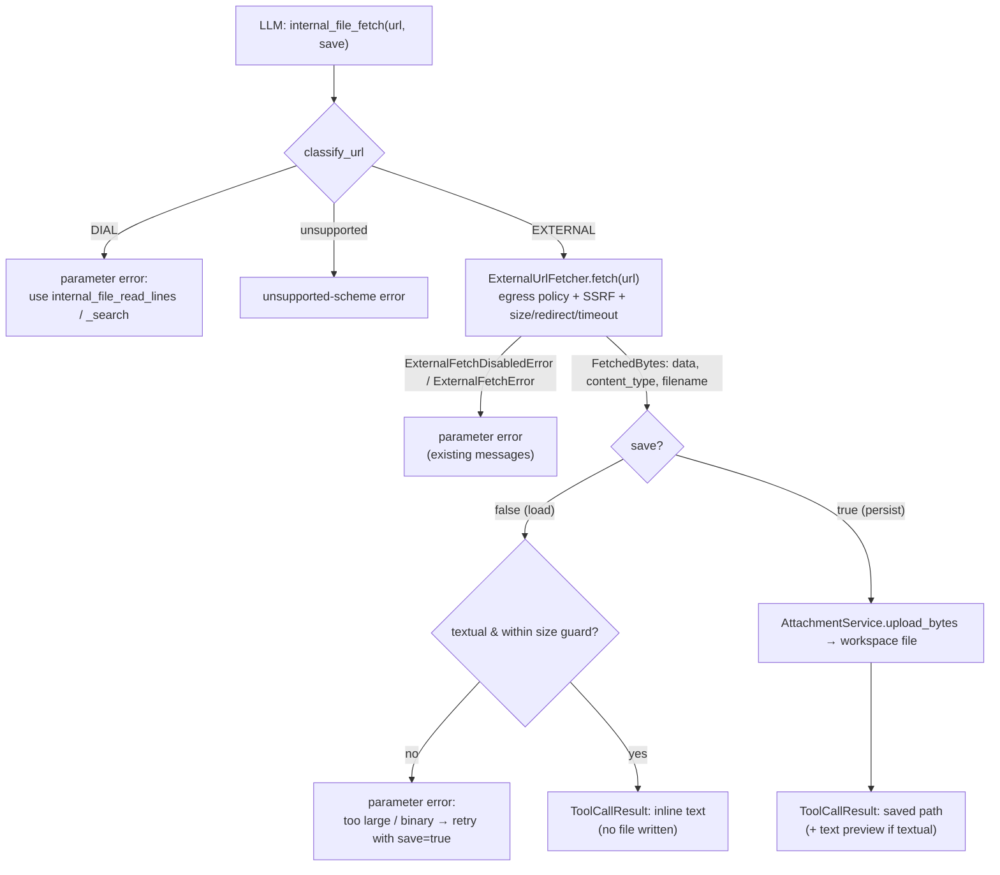

# Design: Built-in Web Fetch Tool (`internal_file_fetch`)

- **Status:** Draft
- **Dependencies:**
  - [external_url_attachments.md](external_url_attachments.md) — `ExternalUrlFetcher`, `AttachmentService`, and the two-tier egress policy this tool reuses unchanged.
  - [dial_files_tools.md](dial_files_tools.md) / [dial_files_search.md](dial_files_search.md) — the `internal_file_*` tool family this tool joins, and the workspace a saved file lands in.

## Problem Statement

The agent today has two halves of a capability but not the bridge between them:

- **It can *pass* an external URL outward.** PR #279 ([external_url_attachments.md](external_url_attachments.md)) made external URLs first-class file references, so the agent can hand `https://…` to a deployment or a REST/MCP tool as an attachment.
- **It can *operate on* files already in its workspace.** The `internal_file_*` family (`list`, `read_lines`, `search`, `find`, …) reads, searches, and edits files that already live in the agent's DIAL workspace.

What is missing is the ability for the agent to **fetch a web resource for its own use** — read a README from GitHub, a source file, a documentation page — either to consume the content directly *or* to pull it into its workspace for the existing file tools. Issue #344 asks for exactly this: "considering we introduced file tools, it would be logical to introduce a fetch tool as well."

Without it, an agent that needs the *contents* of a web page has no path: external URLs can only be forwarded to a downstream consumer, never read by the orchestrating model itself.

## Design Goals

- **Read in one call by default.** Fetching a text URL returns the content inline in a single tool call — no file written, no follow-up required.
- **Optional persistence under agent control.** A `save` flag lets the agent instead pull the resource into its workspace as a durable DIAL file, so the existing `internal_file_*` tools can operate on it.
- **Self-contained.** The tool owns its own behavior end-to-end. It does **not** depend on the large-tool-response offload processor or any other cross-cutting feature; large/binary content is handled by the agent choosing `save=true`.
- **Bounded output.** In load mode the tool never dumps unbounded content into the LLM context; a hard, tool-owned size guard redirects oversized fetches to `save=true`.
- **Zero new egress surface.** The fetch goes through the existing `ExternalUrlFetcher`, inheriting the two-tier egress policy, host allowlist, SSRF guard, and size/redirect/timeout caps verbatim.
- **Conventional.** Follows the established internal-tool pattern (`StagedBaseTool`, config-driven enablement, auto-generated schema) and joins the `internal_file_*` family by name and placement.

---

## The `save` argument (core design decision)

The tool exposes a single behavioral switch, `save: bool = false`, which selects between two modes:

| | `save=false` (default) — **load into context** | `save=true` — **persist to workspace** |
|---|---|---|
| **What the agent gets back** | The fetched text inline in the tool result | The saved workspace-relative path (+ a short text preview when textual) |
| **File written?** | No | Yes — durable DIAL file via `AttachmentService` |
| **Best for** | Reading a page/README/code file once | Large files, binary files, or content the agent will read/search repeatedly with the file tools |
| **Non-text/binary content** | Rejected — parameter error pointing at `save=true` (bytes can't be inlined) | Saved as-is; path returned |
| **Oversized text** | Rejected by the size guard — error pointing at `save=true` | Saved; ranged reading is then `internal_file_read_lines` / `internal_file_search` |

This switch is what makes the tool self-contained: **`save=true` is the large-content and binary-content story**, so the load path needs no pagination, no offload dependency, and no persistence — only a guard rail.

---

## Use Cases

### UC-1: Agent fetches a text resource and reads it in one call (default)

**Trigger:** Agent calls `internal_file_fetch(url="https://raw.githubusercontent.com/org/repo/main/README.md")` (default `save=false`).

**Behavior:** The tool fetches the bytes through `ExternalUrlFetcher` and, because the content is textual and within the size guard, returns the decoded text inline (code-block wrapped). No file is written.

**Outcome:** The model sees the README contents immediately. No second tool call, no workspace artifact.

### UC-2: Agent pulls a resource into the workspace for later use

**Trigger:** Agent calls `internal_file_fetch(url="https://…/data.py", save=true)`.

**Behavior:** The tool fetches the bytes and persists them as a DIAL file in the agent's workspace via `AttachmentService`. The result reports the saved workspace-relative path plus a short text preview (for textual content).

**Outcome:** The model gets the path and a preview, and can now read or search the file with the existing `internal_file_*` tools.

### UC-3: Agent saves, then chains a file tool

**Trigger:** After UC-2, agent calls `internal_file_search(path="files/…/data.py", query="def main")`.

**Behavior:** The search tool operates on the persisted file exactly as it would on any uploaded file.

**Outcome:** Fetch composes with the rest of the file family with no special-casing.

### UC-4: Agent loads a large text file without saving

**Trigger:** Agent calls `internal_file_fetch(url="https://…/huge.log")` with default `save=false`, and the decoded text exceeds the tool's size guard.

**Behavior:** The tool does **not** truncate-and-guess. It returns a parameter error explaining the content is too large to load inline and instructing the agent to retry with `save=true` (then read ranges via the file tools).

**Outcome:** The agent gets a clear, actionable next step; the context window is protected.

### UC-5: Agent fetches non-text / binary content

**Trigger:** Agent calls `internal_file_fetch` on a URL whose content type is non-textual (image, zip, PDF, …).

**Behavior:** With `save=false`, the tool returns a parameter error: binary content cannot be loaded into context; retry with `save=true`. With `save=true`, the bytes are saved and the path + content type + size are returned (no inline body, no extraction in phase-1).

**Outcome:** The model never receives garbled bytes in context; binary is reachable only as a saved file it can forward to a capable deployment/tool.

### UC-6: External egress is disabled (admin cap or per-app opt-out)

**Trigger:** Agent calls `internal_file_fetch` on an external URL while `EXTERNAL_URL_FETCH_ENABLED=false` (or the app set `features.external_url_fetch.enabled=false`, or the host is outside the allowlist).

**Behavior:** `ExternalUrlFetcher.fetch` raises `ExternalFetchDisabledError`; the tool wraps it as a parameter-scoped tool error carrying the existing operator/builder/allowlist message.

**Outcome:** The model gets a clear, actionable refusal — no new policy, no bypass.

### UC-7: Agent passes a DIAL URL

**Trigger:** Agent calls `internal_file_fetch(url="files/<bucket>/doc.md")`.

**Behavior:** The URL is classified as DIAL (already in the workspace). The tool returns a parameter error pointing the agent at the existing file tools.

**Outcome:** The fetch tool stays focused on *external* retrieval; in-workspace reads remain the job of `internal_file_read_lines` / `internal_file_search`.

---

## Proposed Design



### Component 1: The `internal_file_fetch` tool

- **What:** a new internal tool, `internal_file_fetch`, joining the `internal_file_*` family. It subclasses the shared file-tool base (`_DialFileTool`) so it reuses the family's workspace-path conventions and stage handling; it additionally depends on `ExternalUrlFetcher` (secure fetch) and `AttachmentService` (persist bytes when `save=true`).
- **Owner:** the tool itself orchestrates classify → fetch → (load | persist) → render. It owns no policy logic.
- **Arguments:**
  - `url: str` (required) — the http(s) URL to fetch.
  - `save: bool = false` (optional) — `false` loads content into context; `true` persists a workspace file. See the table above.
- **Semantics (runtime):**
  1. **Classify** the URL (`classify_url`, reused from the external-fetch machinery). `DIAL` → parameter error (UC-7); unsupported scheme → unsupported-scheme error.
  2. **Fetch** via `ExternalUrlFetcher.fetch(url)` → `FetchedBytes{data, content_type, filename}`. This call is where the **entire egress policy is enforced** (admin switch, per-app opt-out, host allowlist, SSRF guard, size/redirect/timeout caps). `ExternalFetchDisabledError` / `ExternalFetchError` are caught and re-raised as parameter-scoped tool errors, matching `FileLoaderService` / `DialFilePromoter`.
  3. **Branch on `save`:**
     - **`save=false`:** require textual content (Component 3) within the size guard (Component 2). If either fails → parameter error directing the agent to `save=true` (UC-4/UC-5). Otherwise return the decoded text inline.
     - **`save=true`:** persist via `AttachmentService.upload_bytes(data, content_type, filename)` → `FileMetadata`, into the workspace root the file tools address (Component 4). Return the saved path (+ a short text preview when textual).
- **Change:** purely additive; no existing tool is modified. The large-tool-response offload processor is **not** involved — this tool is self-contained by design.

> **Note on reuse.** `DialFilePromoter.promote(url)` already does "fetch + upload" but discards the bytes and returns only metadata; it also doesn't guarantee the file-family workspace root or produce a preview. The `save=true` path therefore calls `ExternalUrlFetcher.fetch` + `AttachmentService.upload_bytes` directly (the same two steps `promote` performs internally), fetching once and keeping the bytes for the preview.

### Component 2: Load-mode size guard

- **What:** a hard, tool-owned upper bound on the bytes the tool will inline when `save=false`.
- **Semantics:** if the fetched content (when `save=false`) exceeds the guard, the tool returns a parameter error — it does **not** silently truncate — telling the agent to retry with `save=true` and read ranges via the file tools.
- **Why a hard guard, not truncation or pagination:** a silent truncation hides data from the model; pagination would duplicate `internal_file_read_lines` / `internal_file_search`, which already provide ranged access on a saved file. `save=true` is the deliberate, agent-visible path to "more than fits inline."
- **Default:** a single server-side byte cap (proposed default ~100 KB), defined as a constant/setting. Independent of the offload feature's threshold.

### Component 3: Textual vs. non-textual classification

- **What:** the predicate that decides whether content can be loaded inline (`save=false`) and whether a preview is produced (`save=true`).
- **Semantics:** derived from the fetched `content_type` — `text/*`, `application/json`, `application/xml`, and the common source/markup types are treated as textual (decoded with the response charset, falling back to UTF-8 with replacement). Everything else is non-textual.
- **Change:** a small helper local to the tool; no dependency on content-sniffing libraries in phase-1.

### Component 4: Workspace placement (applies to `save=true`)

- **What:** when persisting, the file must be written to the **same workspace root** that the `internal_file_*` tools list and address, and the tool must return the **workspace-relative path** (not an opaque DIAL URL).
- **Why:** the "fetch composes with the file tools" promise (UC-3) depends on `internal_file_search`/`read_lines` finding the file by the path the fetch tool reports. If `AttachmentService.upload_bytes` does not already target that root, the tool must direct the upload there (e.g., a per-conversation/appdata prefix consistent with the file family).
- **Verification:** confirm during implementation where the file family resolves relative paths (`_DialFileTool` path resolution) and ensure the upload targets the same location; add a test that fetches with `save=true` then `internal_file_list`s the returned path.

### Component 5: Tool config, name, and DI wiring

- **Name:** add `INTERNAL_FILE_FETCH_TOOL_NAME = "internal_file_fetch"` to `common/tool_names.py`.
- **Config:** an `InternalTool` entry with the OpenAI function schema (`url` string required; `save` boolean default `false`). Enabled via the existing `internal` tool set like the rest of the family — no new tool-set type.
- **DI:** bind the tool at request scope and dispatch it from the file-tooling module's `@multiprovider` by matching the tool name (the established pattern for the family). Nothing new in `app_factory.py` beyond what the file-tooling module already provides.
- **Schema:** run `make dump_app_schema` to regenerate `docs/generated-app-schema.json` and `docs/generated-internal-tools.json`.

### Component 6: Egress policy (reused, unchanged)

- No new policy code. The two-tier gate (`EXTERNAL_URL_FETCH_ENABLED` + `features.external_url_fetch.enabled`), host allowlists, and SSRF guard are enforced inside `ExternalUrlFetcher.fetch`. The tool's only responsibility is to surface the resulting errors clearly (UC-6).

---

## Out of Scope

Deferred from phase-1; each is a clean follow-on, not a rework:

- **PDF / binary text extraction.** Binary content is save-only (no inline, no extraction) in phase-1. Extraction needs a parser and a preview strategy; future phase.
- **Reliance on the large-tool-response offload processor.** Intentionally avoided to keep the tool self-contained; `save=true` covers the large-content case explicitly.
- **Load-mode pagination / `start_index`.** Unnecessary — `save=true` + `internal_file_read_lines` / `internal_file_search` provide ranged access; load mode is for content that fits inline.
- **Content summarization** (Claude Code-style prompt-over-content).
- **Surfacing the saved file to the user via `propagate_to_choice`** and richer binary metadata (thumbnails, structured metadata).
- **Provenance-based URL allowlisting** (Anthropic-style: only fetch URLs that appeared in conversation context, to harden against model-fabricated exfiltration URLs). A worthwhile future hardening; the existing egress policy + host allowlist already gate destinations today.
- **DIAL-URL retrieval.** A DIAL URL is rejected with guidance (UC-7) rather than fetched; in-workspace reads stay with the file tools.

---

## Configuration / Usage Examples

### Enabling the tool

```yaml
tool_sets:
  - type: internal
    tools:
      - type: internal-tool
        enabled: true
        open_ai_tool:
          type: function
          function:
            name: internal_file_fetch
            description: >-
              Fetch a file or page from a web URL. By default returns the text content
              inline. Set save=true to store it as a workspace file (required for large
              or binary content) and read it with the other file tools.
            parameters:
              type: object
              properties:
                url:
                  type: string
                  description: The http(s) URL to fetch.
                save:
                  type: boolean
                  description: >-
                    If true, persist the fetched content as a workspace file and return
                    its path instead of inlining it. Required for binary or oversized content.
                  default: false
              required: [url]
```

### Walkthrough — load into context (UC-1)

`internal_file_fetch(url="https://raw.githubusercontent.com/org/repo/main/README.md")`
→ returns the README text inline. No file written.

### Walkthrough — save then search (UC-2 → UC-3)

1. `internal_file_fetch(url="https://…/data.py", save=true)`
   → `saved: files/<bucket>/<conv>/data.py` + short preview.
2. `internal_file_search(path="files/<bucket>/<conv>/data.py", query="def main")`
   → operates on the persisted file with no re-fetch.

### Egress disabled (UC-6)

`internal_file_fetch(url="https://example.com/x")` with `EXTERNAL_URL_FETCH_ENABLED=false`
→ tool error: *"External URL fetching is disabled by operator policy (EXTERNAL_URL_FETCH_ENABLED)."*

---

## Migration

### Breaking changes

None. The tool is purely additive and opt-in via app config.

### Non-breaking changes

- New tool `internal_file_fetch` appears in the generated schema/manifest after `make dump_app_schema`.
- No change to existing tools, the egress policy, the offload feature, or the config shape beyond the new tool entry.

## Summary of Changes

### New files

- `dial_files_tooling/_fetch_file_tool.py` — the `internal_file_fetch` tool (`_DialFileTool` subclass; depends on `ExternalUrlFetcher` + `AttachmentService`).
- Unit tests under the file-tooling test package.

### Modified files

- `common/tool_names.py` — add `INTERNAL_FILE_FETCH_TOOL_NAME`.
- The file-tooling DI module — bind the tool and dispatch it from the existing `@multiprovider`; add the tool's `InternalTool` config definition.
- `docs/generated-app-schema.json`, `docs/generated-internal-tools.json` — regenerated.

### Tools exposed to the LLM

- `internal_file_fetch(url, save=false)` — fetch an external resource. Default returns text inline; `save=true` persists a workspace file and returns its path.

### Tests

- `save=false`, textual, within guard → full inline content, no file written.
- `save=false`, textual, over size guard → parameter error pointing at `save=true`.
- `save=false`, binary → parameter error pointing at `save=true`.
- `save=true`, textual → persisted, path + preview returned.
- `save=true`, binary → persisted, path + content type + size returned, no inline body.
- `save=true` then `internal_file_list`/`read_lines` on the returned path (workspace-placement guarantee).
- Egress disabled / host not allowed → parameter error with the policy message.
- DIAL URL → parameter error pointing to the file tools.
