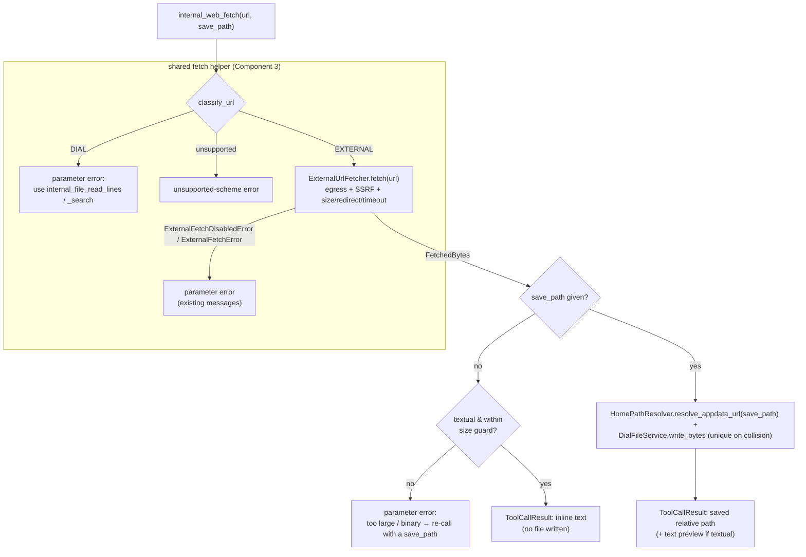

# Design: Built-in Web Fetch Tool

- **Status:** Approved (reworked — supersedes the earlier two-tool proposal; see [Reworked from](#reworked-from))
- **Dependencies:**
  - [external_url_attachments.md](external_url_attachments.md) — `ExternalUrlFetcher`, `classify_url`, and the two-tier egress policy the tool reuses unchanged.
  - **PR #368 (already merged, `db4450d`).** The dial-files home-resolution refactor extracted `_HomePathResolver` (`dial_files_tooling/_home_path_resolver.py`) into a standalone, request-scoped **injectable** with `resolve_appdata_url` / `resolve_home_dir` / `to_display_path`. Saving reuses that resolver directly (Component 4) instead of subclassing `_DialFileTool` — that extraction is what makes a single independent tool viable.

### Reworked from

An earlier revision of this doc (Status: Approved) shipped this capability as **two dedicated tools** — `internal_web_fetch` (inline text) and `internal_file_download` (persist to the workspace, living in the `internal_file_*` family). This revision collapses them into **one independent tool** whose behavior is selected by a single optional `save_path` argument. The rationale for the reversal is in [One tool, one switch](#one-tool-one-switch-core-design-decision).

## Problem Statement

The agent today has two halves of a capability but not the bridge between them:

- **It can *pass* an external URL outward.** PR #279 ([external_url_attachments.md](external_url_attachments.md)) made external URLs first-class file references, so the agent can hand `https://…` to a deployment or a REST/MCP tool as an attachment.
- **It can *operate on* files already in its workspace.** The `internal_file_*` family (`list`, `read_lines`, `search`, `find`, …) reads, searches, and edits files that already live in the agent's DIAL workspace.

What is missing is the ability for the agent to **fetch a web resource for its own use** — read a README from GitHub, a source file, a documentation page — either to consume the content directly *or* to pull it into its workspace for the existing file tools. Issue #344 asks for exactly this: "considering we introduced file tools, it would be logical to introduce a fetch tool as well."

Without it, an agent that needs the *contents* of a web page has no path: external URLs can only be forwarded to a downstream consumer, never read by the orchestrating model itself.

## Design Goals

- **Read in one call.** Fetching a text URL returns the content inline in a single tool call — no file written, no follow-up required — with nothing more than a URL.
- **Persist for the file tools, on demand.** The same tool, given a destination, pulls a resource into the workspace as a durable DIAL file so the existing `internal_file_*` tools can operate on it.
- **One capability, one switch.** A single feature flag exposes the whole fetch capability; the agent chooses read-now vs. keep-it per call by supplying (or omitting) one argument.
- **Self-contained.** The tool depends only on the shared fetch helper and the shared home-path resolver — not on the `internal_file_*` family or the large-tool-response offload processor.
- **Bounded inline output.** Inline reads never dump unbounded content into the LLM context; a hard, tool-owned size guard redirects oversized fetches to a save.
- **Zero new egress surface.** Every fetch goes through the existing `ExternalUrlFetcher`, inheriting the two-tier egress policy, host allowlist, SSRF guard, and size/redirect/timeout caps verbatim.

---

## One tool, one switch (core design decision)

The feature ships as **one dedicated tool, `internal_web_fetch(url, save_path=None)`**, living in its own `web_tooling` module. A single optional argument selects what the tool does with the fetched bytes:

| | `save_path` **omitted** — load into context | `save_path="…"` — persist to workspace |
|---|---|---|
| **Returns** | The fetched text inline in the tool result | The saved workspace-relative path (+ a short text preview when textual) |
| **File written?** | No | Yes — durable DIAL file at `save_path` under the agent home |
| **Content types** | Textual only | Any (text + binary) |
| **Oversized text** | Rejected by the size guard — error telling the agent to pass a `save_path` | Saved; ranged reading is then `internal_file_read_lines` / `internal_file_search` |
| **Best for** | Reading a page/README/code file once | Large files, binary files, or content the agent will read/search repeatedly with the file tools |

Both branches share the same front half — classify, egress-gate, fetch, decode (Component 3). They diverge only on the presence of `save_path`.

**Why one tool, not two (reversing the prior revision):** the prior revision split on the verb (*fetch* vs. *download*) to give each behavior a stable, single-shape return. This revision prefers a single tool because:

- **One capability, one switch.** Web retrieval is a single trust decision for an app builder — "may this agent reach the public web?" A single `features.web_fetch.enabled` flag models that directly, instead of one flag plus a file-family short-name entry that a builder must know to also set.
- **Independence.** As one self-contained `web_tooling` tool it no longer half-lives in the `internal_file_*` family (`internal_file_download` was a `_DialFileTool` subclass). Nothing in the file family needs to change, and the tool is enableable on its own.
- **The switch is the destination, not a mode enum.** "Fetch this URL; if you also give me a place to put it, I'll save it there" needs no separate `mode` flag — the presence of `save_path` *is* the choice. There is no redundant `mode`/`path` pair to keep consistent, and no "what does `path` mean in context mode?" ambiguity.
- **The return-shape objection is now cheap.** #368 turned home-path resolution into an injectable, so saving is a few lines in the same tool rather than a second class in another module. The presence-dependent return shape is documented in the tool description and both branches are individually testable.

**Why an explicit `save_path`, not an auto-derived filename:** the tool never guesses where a saved file lands. If the agent wants to keep the resource, it names the destination; this removes the Content-Disposition / URL-basename / hash-placeholder derivation entirely, keeps saves predictable, and makes the returned path something the agent already knows.

---

## Use Cases

### UC-1: Agent fetches a text resource and reads it in one call (default)

**Trigger:** Agent calls `internal_web_fetch(url="https://raw.githubusercontent.com/org/repo/main/README.md")` (no `save_path`).

**Behavior:** The tool fetches the bytes through `ExternalUrlFetcher` and, because the content is textual and within the size guard, returns the decoded text inline (code-block wrapped). No file is written.

**Outcome:** The model sees the README contents immediately. No second tool call, no workspace artifact.

### UC-2: Agent pulls a resource into the workspace for later use

**Trigger:** Agent calls `internal_web_fetch(url="https://…/data.py", save_path="analysis/data.py")`.

**Behavior:** The tool fetches the bytes and persists them as a DIAL file at `save_path` under the agent home, via the shared home-path resolver + a bytes write. The result reports the saved workspace-relative path plus a short text preview (for textual content).

**Outcome:** The model gets back the saved path. From there the file is a normal workspace artifact: the agent can hand its link to its own model or to a downstream deployment/tool as an attachment, or operate on it with the existing `internal_file_*` tools (read, search, …). How the saved file is subsequently consumed is out of this tool's scope — it only guarantees the file is durably placed where those mechanisms can address it.

### UC-3: Agent tries to load a large text file into context

**Trigger:** Agent calls `internal_web_fetch(url="https://…/huge.log")` (no `save_path`) and the decoded text exceeds the size guard.

**Behavior:** The tool does **not** truncate-and-guess. It returns a parameter error explaining the content is too large to load inline and instructing the agent to re-call with a `save_path` (then read ranges via the file tools).

**Outcome:** The agent gets a clear, actionable next step; the context window is protected.

### UC-4: Agent encounters non-text / binary content

**Trigger:** Agent calls `internal_web_fetch` on a URL whose content type is non-textual (image, zip, PDF, …).

**Behavior:** Without `save_path` → parameter error: binary content cannot be loaded into context; re-call with a `save_path`. With `save_path` → the bytes are saved and the tool returns the path + content type + size (no inline body, no extraction in phase-1).

**Outcome:** The model never receives garbled bytes in context; binary is reachable only as a saved file it can forward to a capable deployment/tool.

### UC-5: External egress is disabled (admin cap or per-app opt-out)

**Trigger:** An app sets `features.web_fetch.enabled=true` while external fetching is disabled — `EXTERNAL_URL_FETCH_ENABLED=false` (admin cap) or `features.external_url_fetch.enabled=false` (per-app opt-out).

**Behavior:** This is a contradictory configuration — the tool cannot function without egress — so it is caught at **initialization**, not per call. `WebToolingModule` gates tool provisioning on the egress policy (`ExternalUrlFetchPolicyResolver.is_enabled()`): the tool is **not exposed**, and a hard `ToolInitializationException` is surfaced in the "Initialization issues" stage explaining that `web_fetch` needs external fetch enabled. (A host-allowlist denial — egress on, but the *specific host* not allowed — is per-URL and cannot be known at init; it remains a runtime parameter error via `ExternalUrlFetcher.fetch`, see Component 3.)

**Outcome:** The builder learns their config is contradictory up front; the model is never offered a tool that would fail on every call. No silent misconfiguration.

### UC-6: Agent passes a DIAL URL

**Trigger:** Agent calls `internal_web_fetch(url="files/<bucket>/doc.md")`.

**Behavior:** The URL is classified as DIAL (already in the workspace). The tool returns a parameter error pointing the agent at the existing file tools.

**Outcome:** The fetch tool stays focused on *external* retrieval; in-workspace reads remain the job of `internal_file_read_lines` / `internal_file_search`.

### UC-7: App enables or disables the whole capability

**Trigger:** An app sets `features.web_fetch.enabled=true` (or omits it).

**Behavior:** The single feature switch (Component 5) exposes or hides `internal_web_fetch` — read-and-save together. Web retrieval is a single capability gated by a single flag.

**Outcome:** "May this agent reach the public web?" is one decision. (The prior two-tool revision could enable read-into-context without save independently; that split is intentionally dropped — see Out of Scope.)

---

## Proposed Design



### Component 1: `internal_web_fetch` (the single tool)

- **What:** a built-in tool, `internal_web_fetch`, in a dedicated `web_tooling` module (`WebToolingModule`, `@preview_module`). A plain `StagedBaseTool` — it does **not** subclass `_DialFileTool`; for saving it injects the shared `HomePathResolver` (Component 4) instead. Depends on the shared fetch helper (Component 3). Enabled by `features.web_fetch.enabled` (Component 5).
- **Arguments:**
  - `url: str` (required) — the http(s) URL to fetch.
  - `save_path: str` (optional) — the workspace-relative destination for the fetched file (e.g. `data.py`, `docs/readme.md`). **Its presence is the switch:** omit it to read the content inline; provide it to persist the resource there and get back the saved path. Subdirectories are allowed; DIAL-style (`files/…`) paths are rejected (Component 4).
- **Semantics:** run the shared helper to classify + fetch, then branch on whether `save_path` was given:
  - **omitted** → require textual content (Component 3) within the size guard (Component 2). If either fails → parameter error telling the agent to re-call with a `save_path` (UC-3/UC-4). Otherwise return the decoded text inline (code-block wrapped, consistent with the file-tool stage formatting).
  - **given** → persist any content type at `save_path` under the agent home (Component 4) and return the saved relative path (+ a short preview when textual). No size guard.
- **Return shape:** without `save_path` → inline text in `ToolCallResult.content`. With `save_path` → the saved relative path (+ optional preview) in `ToolCallResult.content`. Never sets `result.attachments` (see Component 4, "No user-choice propagation").

### Component 2: Inline size guard (no `save_path` only)

- **What:** a byte cap applied only on the inline (no-`save_path`) branch, **configurable** via `features.web_fetch.max_inline_size` (Component 5).
- **Default:** drawn from the **same env setting that governs the offload threshold's default** (`ToolCallResultOffloadSettings`, 40 KB; `config/dial_files.py`), so out of the box the two are equal and anything the tool returns inline is below the offloader's trigger — the "Read in one call" and "Bounded inline output" goals hold without the global processor silently rewriting the result (see Component 4a for the cases where an operator decouples the two).
- **Comparison is `>=` (at-or-above rejects).** The guard compares the UTF-8 byte length of the decoded text and rejects when `size >= max_inline_size`, so a *returned* result is always **strictly** below the cap. The global offloader offloads when `size >= size_threshold` (`_offload_processor.py`: it skips only when `size < size_threshold`). So at the default (cap == threshold), a returned result — strictly `< cap == threshold` — is strictly below the offloader's `>= threshold` trigger, with no gap between the two operators. The invariant above is thus provable, not merely asserted.
- **On exceed:** parameter error, no silent truncation, no pagination. Re-calling with a `save_path` + `internal_file_read_lines` / `internal_file_search` are the path to "more than fits inline."

### Component 3: Shared fetch helper (`WebContentFetcher`)

- **What:** a small helper (`shared/external_fetch/web_content_fetcher.py`, already present on the branch) covering the common front half both branches share. Its entry point is `fetch_external(url, parameter_name="url")`, plus the static `is_textual(content_type)` and `decode(data, content_type)` helpers.
- **Classification:** `classify_url` (`common/url_classification.py`) → `UrlScheme.{DIAL,EXTERNAL,UNSUPPORTED}`. `DIAL` → parameter error (UC-6); unsupported scheme → unsupported-scheme error.
- **Fetch:** wraps `ExternalUrlFetcher.fetch(url)` → `FetchedBytes{data, content_type, filename}`. This is where the **entire egress policy is enforced** (admin switch, per-app opt-out, host allowlist, SSRF guard, size/redirect/timeout caps). `fetch_external` already catches `ExternalFetchDisabledError` / `ExternalFetchError` and re-raises them as `InvalidToolCallParameterException` on the given `parameter_name`, matching `FileLoaderService` / `DialFilePromoter`.
- **Textual predicate (`is_textual`):** derived from `content_type` — `text/*`, `application/json`, `application/xml`, and common source/markup types are textual (decoded with the response charset, falling back to UTF-8 with replacement). Everything else is non-textual. Used by the inline branch to gate returning text and by the save branch to decide whether to attach a preview.
- **No content-sniffing libraries** in phase-1. `FetchedBytes.filename` is still produced by `ExternalUrlFetcher` but is unused by this tool (saving always uses the caller's `save_path`).

### Component 4: Workspace placement (when `save_path` is given)

- **What:** the file must be written under the agent-home root the `internal_file_*` tools address — `files/{appdata}/{agent_home_dir}/…` — and the tool must return the **workspace-relative path** (not an absolute DIAL URL), so the saved file is addressable by the file tools and shareable to the model / downstream deployments by its link.
- **How:** inject the shared `HomePathResolver` (extracted by #368, promoted to `shared/`; Component 5) and call `resolve_appdata_url(save_path)` → home-prefixed URL, then write the bytes via `DialFileService.write_bytes(url, content, content_type, overwrite=False)`, and report the relative path via `to_display_path(url)` so it round-trips into `internal_file_read_lines` / `internal_file_search`.
  - **Why inject the resolver, not subclass `_DialFileTool`:** the tool writes exactly one file and needs only home resolution + a bytes write — not the file family's read/scan/stage machinery. Injecting the standalone resolver keeps `web_tooling` independent of the `_DialFileTool` base class.
- **Why not `AttachmentService.upload_bytes`:** it targets the flat bucket root `files/{bucket}/{filename}` (`dial_core_services/attachment_service.py`), which the file tools cannot resolve by relative path (they resolve under the agent-home prefix). Placing the save under the agent home is what lets the returned path round-trip back into the `internal_file_*` tools.
- **Path validation:** `save_path` is passed to `resolve_appdata_url`, which enforces the family's path rules (non-empty, no newlines, no absolute/traversal escape via `validate_relative_path`) and resolves it under the agent home. **A `files/`-prefixed `save_path` is rejected up front** — `resolve_appdata_url` short-circuits and returns any `files/…` path verbatim *without* home-prefixing or traversal validation (`_home_path_resolver.py`), so such a value would escape the agent home and would not round-trip through `to_display_path`. The tool therefore treats a `save_path` that starts with `files/` (or otherwise classifies as DIAL) as a parameter error on `save_path`, directing the agent to give a home-relative path. Any invalid `save_path` is a parameter error on `save_path`.
- **Collision:** write with `overwrite=False` so an existing workspace file is never clobbered; on an etag clash, uniquify the target with a numeric suffix (`data.py` → `data-1.py`, …), bounded by a retry cap, before failing with a clear error. The uniquified name is what the result reports back. (A future revision could let a caller opt into overwrite; phase-1 always uniquifies.)
- **Binary write:** `DialFileService.write_bytes` writes arbitrary bytes to the *resolved home URL* (never the flat bucket path). Covered by the binary-save test.
- **No user-choice propagation:** the tool returns the path (+ preview) in `ToolCallResult.content` and deliberately does **not** set `result.attachments`. This **diverges from `_WriteFileTool`**, which *does* return `attachments=[attachment]`; the `StagedBaseTool` choice-propagation path (`staged_base_tool.py`) then forwards those whose type matches the tool config's `propagate_types_to_choice`. By leaving `attachments` empty, the save keeps the fetched file out of the user-visible choice — consistent with deferring `propagate_to_choice` (Out of Scope).
- **Verification:** a test that saves then `internal_file_list`/`read_lines` the returned relative path.

### Component 4a: Interaction with the global offload processor

- **Context:** when the dial-files offload sub-feature is configured, `ToolCallResultOffloadProcessor` is registered (`DialFilesToolingModule._provide_offload_processors`) and applied to **every** tool result in `ToolExecutor.__process_result` (`core/agent/tool_executor.py`) — it is not something a tool opts into. When a result's `content` exceeds the threshold (default 40 KB, `config/dial_files.py`), it is offloaded to a DIAL file and replaced with a notice. If the offload feature is not configured, no such processor exists.
- **Reconciliation:** the tool does not **depend on** offload — saving is the explicit large-content path. Out of the box the inline size guard and the offload threshold share a default, so there is no overlap. Both thresholds are independently configurable, so an operator can decouple them — a documented, opt-in trade-off, never a silent contradiction:
  - **Raising `max_inline_size` above the offload threshold**, or **lowering the offload threshold below `max_inline_size`**: inline results between the two values would be offloaded by the global processor (turned into a file + notice) rather than returned inline.
  - A save returns a small path + preview, well under any threshold.
- **Decision:** do **not** special-case the tool against offload in phase-1; the shared default removes the overlap, and the schema docs both knobs so an operator who decouples them does so knowingly. (If an operator wants `web_fetch` exempted regardless, the offload config already supports per-tool `excluded_tools`.)

### Component 5: Tool config, names, DI wiring, and gating

The tool is **feature-gated** (enabled through `features.web_fetch`, not through a per-tool tool-set entry) and **preview-gated**:

- **Name:** `INTERNAL_WEB_FETCH_TOOL_NAME = "internal_web_fetch"` in `common/tool_names.py`.
- **Feature config `WebFetchConfig`** (`config/web_fetch.py`): `enabled: bool = false`, `max_inline_size: int` (validated `gt=0`) defaulting (via `default_factory`) to the offload threshold. Exposed on the `Features` model (`config/application.py`) as a `PreviewField` — so configuring it requires `ENABLE_PREVIEW_FEATURES`.
- **Provider:** `WebToolingModule` (`web_tooling/web_tooling_module.py`, `@preview_module`) via a `@multiprovider` that builds the tool when `features.web_fetch.enabled` is true (passing `max_inline_size` from the same config). Registered in `app_factory.py`.
- **Egress init-gate (fail fast on contradictory config):** the tool is useless without external egress, so `WebToolingModule` injects `ExternalUrlFetchPolicyResolver` and, when `web_fetch.enabled` is set but `is_enabled()` is false (admin cap or per-app opt-out), **does not build the tool** and emits a hard `ToolInitializationException` via a second `@multiprovider -> list[InitializationException]` (aggregated by `_InitializationErrorHandler` into the "Initialization issues" stage). This replaces per-call egress-disabled errors for the on/off case (UC-5); host-allowlist denials stay runtime (Component 3).
- **Shared home resolver:** move `_HomePathResolver` (`dial_files_tooling/_home_path_resolver.py`) into a **new `shared/home_path/` package** as public `HomePathResolver`, bound request-scoped by a `HomePathModule` spliced into `shared_module` (`shared/__init__.py`, mirroring the existing `ExternalFetchModule` there, per the CLAUDE.md `shared/` convention). `dial_files_tooling` drops its own binding (`dial_files_tooling_module.py`) and injects the shared type; `_DialFileTool` and the `_AppdataHomePathTransformer` keep working against the same public API. Its constructor deps (`DialFileService`, `DialFilesConfig`) are already globally bound.
- **Preview gating:** `WebToolingModule` is `@preview_module` **and** `WebFetchConfig` is exposed via `PreviewField` — so `internal_web_fetch` is preview-gated at both the module and config level. (This mirrors how the dial-files tooling is preview-gated at the *module* level via `@preview_module`; note the `Features.dial_files` config field itself is a plain `Field`, so the two are not identical — `web_fetch` additionally nullifies its config outside preview.)
- **Schema:** run `make dump_app_schema` to regenerate `docs/generated-app-schema.json` and `docs/generated-internal-tools.json`.

### Component 6: Egress policy (reused, unchanged)

- No new policy code. The two-tier gate (`EXTERNAL_URL_FETCH_ENABLED` + `features.external_url_fetch.enabled`), host allowlists, and SSRF guard are enforced inside `ExternalUrlFetcher.fetch`. The tool reuses the same `ExternalUrlFetchPolicyResolver` to gate its own provisioning at init (Component 5, UC-5); at runtime it surfaces any residual errors (host-allowlist denials, SSRF) clearly.

---

## Secondary Fixes

None. The rework is self-contained; it introduces no follow-on changes to unrelated components beyond the shared-resolver relocation (Component 5), which is part of the main design.

---

## Out of Scope

Deferred from phase-1; each is a clean follow-on, not a rework:

- **A second dedicated tool / splitting read and save apart.** The prior revision's `internal_file_download` (a `_DialFileTool` subclass in the file family) is intentionally folded into the `save_path` branch. If a future need arises to enable saving independently of read-into-context, a separate flag or tool can be reintroduced; phase-1 treats web retrieval as one capability.
- **Auto-derived save filenames.** Saving always uses the caller's `save_path`; the tool never guesses a name from Content-Disposition / URL path / MIME type. A future revision could add an "infer a name" affordance.
- **PDF / binary text extraction.** Binary content is save-only (no inline, no extraction) in phase-1. Extraction needs a parser and a preview strategy; future phase.
- **Special-casing the tool against the global offload processor.** The tool does not rely on offload (saving covers large content) and does not exempt itself from the global post-processor in phase-1; see Component 4a.
- **Pagination / `start_index` on inline reads.** Unnecessary — a save + `internal_file_read_lines` / `internal_file_search` provide ranged access; inline fetch is for content that fits inline.
- **Content summarization** (Claude Code-style prompt-over-content).
- **Surfacing the saved file to the user via `propagate_to_choice`** and richer binary metadata (thumbnails, structured metadata).
- **Provenance-based URL allowlisting** (Anthropic-style: only fetch URLs that appeared in conversation context). A worthwhile future hardening; the existing egress policy + host allowlist already gate destinations today.
- **DIAL-URL retrieval.** A DIAL URL is rejected with guidance (UC-6) rather than fetched; in-workspace reads stay with the file tools.

---

## Configuration / Usage Examples

### Enabling the tool

The tool is turned on through `features.web_fetch` (no per-tool tool-set entry) and requires `ENABLE_PREVIEW_FEATURES=true` (preview-gated in phase-1):

```yaml
features:
  # Enables internal_web_fetch and sets its inline size cap
  # (defaults to the offload threshold, 40 KB).
  web_fetch:
    enabled: true
    max_inline_size: 40000
```

> `internal_web_fetch` has no `internal-tool` YAML entry — it is selected solely by `features.web_fetch.enabled`.

### Walkthrough — load into context (UC-1)

`internal_web_fetch(url="https://raw.githubusercontent.com/org/repo/main/README.md")`
→ returns the README text inline (no `save_path`). No file written.

### Walkthrough — save to the workspace (UC-2)

`internal_web_fetch(url="https://…/data.py", save_path="analysis/data.py")`
→ `saved: analysis/data.py` (workspace-relative, under the agent home) + short preview. The returned path can then be handed to the model / a deployment as an attachment link, or read/searched with `internal_file_read_lines` / `internal_file_search`.

### Egress disabled (UC-5)

`features.web_fetch.enabled=true` with `EXTERNAL_URL_FETCH_ENABLED=false` (or `features.external_url_fetch.enabled=false`)
→ the tool is **not exposed**; a hard initialization error appears in the "Initialization issues" stage: *"internal_web_fetch requires external URL fetching, which is disabled … enable it, or remove features.web_fetch."*

---

## Migration

### Breaking changes

None. The tool is purely additive and opt-in via app config.

### Non-breaking changes

- Only additive: a new `features.web_fetch` entry plus the new `internal_web_fetch` tool in the generated schema after `make dump_app_schema`. No existing tool, policy, or config shape changes.

## Summary of Changes

> **Baseline.** This inventory is the net change **relative to `development`** (the eventual merge target). Several of these artifacts already exist on the current `feat/344-web-fetch-tool` branch from the superseded two-tool implementation (uncommitted); [Branch reconciliation](#branch-reconciliation) covers how that intermediate state is brought to this end state.

### New files (vs. `development`)

- `shared/home_path/home_path_resolver.py` + `home_path_module.py` — public `HomePathResolver` (moved from `dial_files_tooling/_home_path_resolver.py`) and `HomePathModule`, spliced into `shared_module`.
- `web_tooling/web_tooling_module.py` — `WebToolingModule` (`@preview_module`; `configure` + `@multiprovider`).
- `web_tooling/_web_fetch_tool.py` — the `internal_web_fetch` tool (plain `StagedBaseTool`; injects the shared fetch helper + shared home resolver; branches on `save_path`).
- `web_tooling/_tool_configs.py` — the tool's `InternalTool` config (`WEB_FETCH_TOOL_CONFIG`), with `url` and optional `save_path` parameters.
- `web_tooling/_web_fetch_stage_wrapper.py` — the tool's stage wrapper.
- `config/web_fetch.py` — `WebFetchConfig` (`enabled`, `max_inline_size` with `gt=0`).
- `shared/external_fetch/web_content_fetcher.py` — the shared fetch helper (Component 3), exposing `fetch_external` / `is_textual` / `decode`.
- Unit tests for the tool (both branches) and the fetch helper.

### Modified files (vs. `development`)

- `common/tool_names.py` — add `INTERNAL_WEB_FETCH_TOOL_NAME`.
- `config/application.py` — add a `web_fetch` `PreviewField` to the `Features` model.
- `app_factory.py` — register `WebToolingModule`.
- `web_tooling/web_tooling_module.py` — inject `ExternalUrlFetchPolicyResolver`; gate tool provisioning on `is_enabled()` and emit a hard `ToolInitializationException` (via a `list[InitializationException]` `@multiprovider`) when `web_fetch` is enabled but egress is disabled.
- `dial_core_services/dial_file_service.py` — add `write_bytes` (bytes-capable sibling of `write_file`) targeting a resolved home URL (Component 4).
- `dial_files_tooling/dial_files_tooling_module.py` — drop the local `_HomePathResolver` binding (now provided by `HomePathModule`) and inject the shared `HomePathResolver`.
- `shared/__init__.py` — add `HomePathModule` to `shared_module`.

### Branch reconciliation

The current branch already carries a superseded two-tool implementation. Bringing it to the design above means:

- **Rework `web_tooling/_web_fetch_tool.py` + `_tool_configs.py`:** replace the intermediate `mode`/`path` argument pair (and any `internal_file_download` references in the oversize/binary error messages and the `WEB_FETCH_TOOL_CONFIG` description) with the single `save_path` argument, the `files/`-prefix rejection, and "re-call with a save_path" guidance; fold the save/write-unique logic (from the deleted download tool) into the `save_path` branch.
- **Rewrite `config/web_fetch.py`'s `max_inline_size` description** to reference the `save_path` guidance instead of `internal_file_download`.
- **Delete** `dial_files_tooling/_download_file_tool.py` and its tests.
- **Revert** the `download` short-name in the `DialFilesToolName` literal (`config/dial_files.py`) and its dispatch in the `dial_files_tooling` `@multiprovider` / config.
- **Move** `_HomePathResolver` → `shared/home_path/HomePathResolver` and rewire bindings (Component 5).

### Tool exposed to the LLM

- `internal_web_fetch(url, save_path=None)` — fetch an external resource; without `save_path` it returns text inline (text only; binary/oversize → directs the agent to pass a `save_path`); with `save_path` it persists the resource there under the agent home and returns the relative path (+ preview when textual).

### Tests

- **inline:** textual within guard → full inline content, no file written.
- **inline:** textual over size guard → parameter error telling the agent to pass a `save_path`.
- **inline:** binary → parameter error telling the agent to pass a `save_path`.
- **save:** textual → persisted at `save_path` under agent home, relative path + preview returned.
- **save:** binary → persisted at `save_path`, relative path + content type + size returned, no inline body.
- **save:** `save_path` with a subdirectory → persisted at that workspace-relative path.
- **save:** invalid `save_path` (absolute / traversal / empty / `files/`-prefixed) → parameter error on `save_path`.
- **save:** `save_path` collision → numeric-suffix uniquification.
- **save** then `internal_file_list`/`read_lines` on the returned relative path (workspace-placement guarantee).
- **both branches:** host not allowed / SSRF → parameter error with the policy message (runtime).
- **both branches:** DIAL URL → parameter error pointing to the file tools.
- **config:** `features.web_fetch.enabled=false` (or omitted) → tool not exposed (UC-7).
- **egress init-gate:** `web_fetch.enabled=true` but egress disabled → tool not exposed **and** a hard `ToolInitializationException` emitted (UC-5); `enabled=false` + egress disabled → no error.
