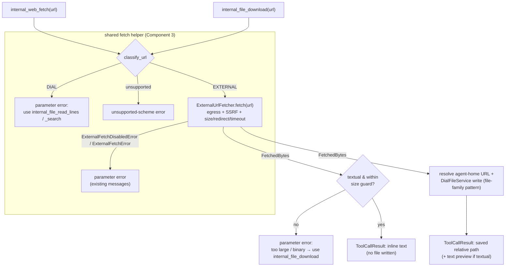

# Design: Built-in Web Fetch & File Download Tools

- **Status:** Approved
- **Dependencies:**
  - [external_url_attachments.md](external_url_attachments.md) — `ExternalUrlFetcher`, `classify_url`, and the two-tier egress policy both tools reuse unchanged.
  - [dial_files_tools.md](dial_files_tools.md) / [dial_files_search.md](dial_files_search.md) — the `internal_file_*` tool family `internal_file_download` joins, its `_DialFileTool` base, and the agent-home workspace a downloaded file lands in.
  - **Prerequisite PRs (merge first): #368 and #393.** #344 rebases onto a base that already includes PR #368 (dial-files home-resolution refactor — the `_DialFileTool` subclass API `_resolve_appdata_url` / `_to_display_path` is preserved, and `_WriteFileTool` now sets the real `content_type`) and PR #393 (which adds another preview-gated built-in tool via its own feature flag). #344's edits to the shared wiring files — `config/application.py` (`Features`), `common/tool_names.py`, `app_factory.py`, `src/scripts/dump_internal_tools.py` — are **additive** alongside those PRs' edits to the same files.

## Problem Statement

The agent today has two halves of a capability but not the bridge between them:

- **It can *pass* an external URL outward.** PR #279 ([external_url_attachments.md](external_url_attachments.md)) made external URLs first-class file references, so the agent can hand `https://…` to a deployment or a REST/MCP tool as an attachment.
- **It can *operate on* files already in its workspace.** The `internal_file_*` family (`list`, `read_lines`, `search`, `find`, …) reads, searches, and edits files that already live in the agent's DIAL workspace.

What is missing is the ability for the agent to **fetch a web resource for its own use** — read a README from GitHub, a source file, a documentation page — either to consume the content directly *or* to pull it into its workspace for the existing file tools. Issue #344 asks for exactly this: "considering we introduced file tools, it would be logical to introduce a fetch tool as well."

Without it, an agent that needs the *contents* of a web page has no path: external URLs can only be forwarded to a downstream consumer, never read by the orchestrating model itself.

## Design Goals

- **Read in one call.** Fetching a text URL returns the content inline in a single tool call — no file written, no follow-up required.
- **Persist for the file tools.** A separate tool pulls a resource into the workspace as a durable DIAL file so the existing `internal_file_*` tools can operate on it.
- **One job per tool.** Each tool has a single purpose and a single, predictable return shape — content, or a path. Consistent with the `internal_file_*` family's design (no behavior-changing flags).
- **Independently enableable.** An app can expose read-into-context without allowing file-writing, or vice versa.
- **Self-contained.** Neither tool depends on the large-tool-response offload processor (which nonetheless still post-processes results platform-wide; see Component 4a). Large/binary content is handled by routing the agent to `internal_file_download`.
- **Bounded output.** `internal_web_fetch` never dumps unbounded content into the LLM context; a hard, tool-owned size guard redirects oversized fetches to `internal_file_download`.
- **Zero new egress surface.** Both fetches go through the existing `ExternalUrlFetcher`, inheriting the two-tier egress policy, host allowlist, SSRF guard, and size/redirect/timeout caps verbatim.

---

## Two tools (core design decision)

The feature ships as **two dedicated tools** rather than one tool with a mode flag. Each has one job and one stable return contract:

| | `internal_web_fetch(url)` — **load into context** | `internal_file_download(url)` — **persist to workspace** |
|---|---|---|
| **Returns** | The fetched text inline in the tool result | The saved workspace-relative path (+ a short text preview when textual) |
| **File written?** | No | Yes — durable DIAL file under the agent home |
| **Content types** | Textual only | Any (text + binary) |
| **Oversized text** | Rejected by the size guard — error pointing at `internal_file_download` | Saved; ranged reading is then `internal_file_read_lines` / `internal_file_search` |
| **Best for** | Reading a page/README/code file once | Large files, binary files, or content the agent will read/search repeatedly with the file tools |
| **Lives in** | a new `web_tooling` module (plain `StagedBaseTool`) | the `internal_file_*` family (`_DialFileTool` subclass) |
| **Enabled by** | `features.web_fetch.enabled` | the short-name `download` in `features.dial_files.enabled_tools` |

**Why two tools, not one flag:** the two behaviors have genuinely different return shapes (inline text vs. a path) and different input domains (textual-only + size-capped vs. any content). A single tool whose output schema and preconditions depend on a boolean is harder for the model to use and inconsistent with the file family, which has no behavior-flagged tools. Splitting on the verb (**fetch** = read it now, **download** = keep it) mirrors the browser mental model and lets each tool be enabled independently.

The two tools share the fetch/decode/classify logic via a small helper (Component 3); they differ only in what they do with the result.

---

## Use Cases

### UC-1: Agent fetches a text resource and reads it in one call

**Trigger:** Agent calls `internal_web_fetch(url="https://raw.githubusercontent.com/org/repo/main/README.md")`.

**Behavior:** The tool fetches the bytes through `ExternalUrlFetcher` and, because the content is textual and within the size guard, returns the decoded text inline (code-block wrapped). No file is written.

**Outcome:** The model sees the README contents immediately. No second tool call, no workspace artifact.

### UC-2: Agent pulls a resource into the workspace for later use

**Trigger:** Agent calls `internal_file_download(url="https://…/data.py")`.

**Behavior:** The tool fetches the bytes and persists them as a DIAL file under the agent home via the file-family write path. The result reports the saved workspace-relative path plus a short text preview (for textual content).

**Outcome:** The model gets the path and a preview, and can now read or search the file with the existing `internal_file_*` tools.

### UC-3: Agent downloads, then chains a file tool

**Trigger:** After UC-2, agent calls `internal_file_search(path="data.py", query="def main")` (the relative path the download returned).

**Behavior:** The search tool operates on the persisted file exactly as it would on any uploaded file.

**Outcome:** Download composes with the rest of the file family with no special-casing.

### UC-4: Agent tries to load a large text file into context

**Trigger:** Agent calls `internal_web_fetch(url="https://…/huge.log")` and the decoded text exceeds the size guard.

**Behavior:** The tool does **not** truncate-and-guess. It returns a parameter error explaining the content is too large to load inline and instructing the agent to use `internal_file_download` (then read ranges via the file tools).

**Outcome:** The agent gets a clear, actionable next step; the context window is protected.

### UC-5: Agent encounters non-text / binary content

**Trigger:** Agent calls a fetch tool on a URL whose content type is non-textual (image, zip, PDF, …).

**Behavior:** `internal_web_fetch` returns a parameter error: binary content cannot be loaded into context; use `internal_file_download`. `internal_file_download` saves the bytes and returns the path + content type + size (no inline body, no extraction in phase-1).

**Outcome:** The model never receives garbled bytes in context; binary is reachable only as a saved file it can forward to a capable deployment/tool.

### UC-6: External egress is disabled (admin cap or per-app opt-out)

**Trigger:** Agent calls either fetch tool on an external URL while `EXTERNAL_URL_FETCH_ENABLED=false` (or the app set `features.external_url_fetch.enabled=false`, or the host is outside the allowlist).

**Behavior:** `ExternalUrlFetcher.fetch` raises `ExternalFetchDisabledError`; the tool wraps it as a parameter-scoped tool error carrying the existing operator/builder/allowlist message.

**Outcome:** The model gets a clear, actionable refusal — no new policy, no bypass.

### UC-7: Agent passes a DIAL URL

**Trigger:** Agent calls either fetch tool with `url="files/<bucket>/doc.md"`.

**Behavior:** The URL is classified as DIAL (already in the workspace). The tool returns a parameter error pointing the agent at the existing file tools.

**Outcome:** The fetch tools stay focused on *external* retrieval; in-workspace reads remain the job of `internal_file_read_lines` / `internal_file_search`.

### UC-8: App enables only one of the two tools

**Trigger:** A security-sensitive app exposes `internal_web_fetch` but not `internal_file_download` (or vice versa).

**Behavior:** The two are controlled by independent feature switches (Component 5) — `internal_web_fetch` by `features.web_fetch.enabled`, `internal_file_download` by the short-name `download` in `features.dial_files.enabled_tools`. Setting one and omitting the other exposes only that tool to the LLM.

**Outcome:** Read-into-context can be allowed without granting the ability to write fetched files into the workspace — a capability split a single flagged tool could not offer.

---

## Proposed Design



### Component 1: `internal_web_fetch` (load into context)

- **What:** a new built-in tool, `internal_web_fetch`, in a **new dedicated `web_tooling` module** (`WebToolingModule`, `@preview_module`) — a self-contained, feature-gated module (the standard shape for a standalone built-in tool: `configure` binding + a `@multiprovider` that reads its feature config). A plain `StagedBaseTool` (it produces no file, so it does **not** need `_DialFileTool`). Depends on the shared fetch helper (Component 3). Enabled by `features.web_fetch.enabled` (Component 5).
- **Arguments:** `url: str` (required) — the http(s) URL to fetch.
- **Semantics:** run the shared helper to classify + fetch. Then require textual content (Component 3) within the size guard (Component 2). If either fails → parameter error directing the agent to `internal_file_download` (UC-4/UC-5). Otherwise return the decoded text inline (code-block wrapped, consistent with the file-tool stage formatting).
- **Return shape:** always inline text in `ToolCallResult.content`; never an attachment, never a path.

### Component 2: `internal_file_download` (persist to workspace)

- **What:** a new internal tool, `internal_file_download`, joining the `internal_file_*` family in `dial_files_tooling/`. Subclasses `_DialFileTool` (`dial_files_tooling/_base_file_tool.py`) to reuse the family's home-path resolution, write path, and stage handling. Depends on the shared fetch helper (Component 3).
- **Arguments:** `url: str` (required) — the http(s) URL to fetch.
- **Semantics:** run the shared helper to classify + fetch (any content type — no textual restriction, no size guard). Then persist via the file-family write path — resolve a target URL under the agent home (the family's home-path resolution; see Component 4), write the bytes through `DialFileService` exactly as `_WriteFileTool` does. Return the saved **relative** path (+ a short text preview when textual).
- **Return shape:** always a saved relative path (+ optional preview) in `ToolCallResult.content`; never sets `result.attachments` (see Component 4, "No user-choice propagation").

### Component 3: Shared fetch helper

- **What:** a small helper shared by both tools, covering the common front half: classify the URL, fetch, decode, and the textual/size predicates.
- **Classification:** `classify_url` (`common/url_classification.py`). `DIAL` → parameter error (UC-7); unsupported scheme → unsupported-scheme error.
- **Fetch:** `ExternalUrlFetcher.fetch(url)` → `FetchedBytes{data, content_type, filename}`. This is where the **entire egress policy is enforced** (admin switch, per-app opt-out, host allowlist, SSRF guard, size/redirect/timeout caps). `ExternalFetchDisabledError` / `ExternalFetchError` are caught and re-raised as parameter-scoped tool errors, matching `FileLoaderService` / `DialFilePromoter`.
- **Textual predicate:** derived from `content_type` — `text/*`, `application/json`, `application/xml`, and common source/markup types are textual (decoded with the response charset, falling back to UTF-8 with replacement). Everything else is non-textual. Used by `internal_web_fetch` to gate inlining and by `internal_file_download` to decide whether to attach a preview.
- **Size guard:** a byte cap used **only** by `internal_web_fetch`, **configurable** via `features.web_fetch.max_inline_size` (Component 5). Its default is drawn from the **same env setting that governs the offload threshold's default** (`ToolCallResultOffloadSettings`, 40 KB; `config/dial_files.py`), so out of the box the two are equal and anything `internal_web_fetch` returns inline is below the offloader's trigger — the "Read in one call" and "Bounded output" goals hold without the global processor silently rewriting the result (see Component 4a for the cases where an operator decouples the two). On exceed → parameter error, no silent truncation, no pagination (the download tool + `internal_file_read_lines`/`internal_file_search` are the path to "more than fits inline").
- **No content-sniffing libraries** in phase-1.

### Component 4: Workspace placement (applies to `internal_file_download`)

- **What:** the file must be written under the agent-home root the `internal_file_*` tools address — `files/{appdata}/{agent_home_dir}/…` — and the tool must return the **workspace-relative path** (not an absolute DIAL URL).
- **How:** reuse the file family's **home-path resolution** to turn a target filename into the home-prefixed URL, then write via `DialFileService` — the same two steps `_WriteFileTool` performs. Report the relative path back via the family's display-path helper so it round-trips into `internal_file_read_lines` / `internal_file_search`.
  - **Subclass API is stable:** a `_DialFileTool` subclass calls `self._resolve_appdata_url` and `self._to_display_path`. PR #368 (merging first) refactors the home-resolution internals but **keeps these subclass-facing methods unchanged**, so the download tool uses them as-is. The behavior is: resolve under `files/{appdata}/{agent_home_dir}/…`, report the relative path.
- **Why not `AttachmentService.upload_bytes`:** it targets the flat bucket root `files/{bucket}/{filename}` (`dial_core_services/attachment_service.py:51`), which the file tools cannot resolve by relative path (they resolve under the agent-home prefix). This is the load-bearing decision for UC-3.
- **Target filename:** derive from `FetchedBytes.filename` (already sanitized from Content-Disposition / URL path / MIME extension by `ExternalUrlFetcher`); on collision, follow the file family's existing overwrite/uniqueness convention.
- **Binary write nuance (implementation):** `DialFileService.write_file` is text-oriented (`_upload_text` encodes a `str`). Persisting **binary** content under the home root needs a bytes-capable write into the *resolved home URL* — confirm `DialFileService` exposes one, or add a thin bytes-write that targets the resolved URL (never the flat bucket path). Covered by the binary-download test.
- **No user-choice propagation:** `internal_file_download` returns the path (+ preview) in `ToolCallResult.content` and deliberately does **not** set `result.attachments`. Note this **diverges from `_WriteFileTool`**, which *does* return `attachments=[attachment]` (`_write_file_tool.py:48-52`); the `StagedBaseTool` choice-propagation path (`staged_base_tool.py:176`) then forwards those whose type matches the tool config's `propagate_types_to_choice`. By leaving `attachments` empty, `download` keeps the fetched file out of the user-visible choice — consistent with deferring `propagate_to_choice` (Out of Scope). Surfacing the downloaded file to the user the way `write_file` does is a deliberate future option, not phase-1.
- **Verification:** add a test that downloads then `internal_file_list`/`read_lines` the returned relative path.

### Component 4a: Interaction with the global offload processor

- **Context:** when the dial-files offload sub-feature is configured, `ToolCallResultOffloadProcessor` is registered (`DialFilesToolingModule._provide_offload_processors`) and applied to **every** tool result in `ToolExecutor.__process_result` (`core/agent/tool_executor.py:56`) — it is not something a tool opts into. When a result's `content` exceeds the threshold (default 40 KB, `config/dial_files.py`), it is offloaded to a DIAL file and replaced with a notice. If the offload feature is not configured, no such processor exists.
- **Reconciliation:** neither tool **depends on** offload — `internal_file_download` is the explicit large-content path. Out of the box the `web_fetch` size guard and the offload threshold share a default, so there is no overlap. Both thresholds are independently configurable, so an operator can decouple them in two ways — each a documented, opt-in trade-off, never a silent contradiction:
  - **Raising `max_inline_size` above the offload threshold:** `web_fetch` results between the two values would be offloaded by the global processor (turned into a file + notice) rather than returned inline.
  - **Lowering the offload threshold below `max_inline_size`:** same effect from the other direction — `web_fetch` results between the two would be offloaded.
  - **`internal_file_download`** is unaffected either way: it returns a small path + preview, well under any threshold.
- **Decision:** do **not** special-case either tool against offload in phase-1; the shared default removes the overlap, and the schema docs both knobs so an operator who decouples them does so knowingly. (If an operator wants `web_fetch` exempted regardless, the offload config already supports per-tool `excluded_tools`.)

### Component 5: Tool config, names, DI wiring, and gating

Both tools are **feature-gated** (enabled through `features.*`, not through a per-tool tool-set entry) and **preview-gated** — symmetric by design:

- **Names:** add `INTERNAL_WEB_FETCH_TOOL_NAME = "internal_web_fetch"` to `common/tool_names.py`; `internal_file_download` follows the family's `INTERNAL_FILE_TOOL_NAME_PREFIX` + short-name `download`.
- **`internal_web_fetch`:**
  - New feature config `WebFetchConfig` (`enabled: bool = false`, `max_inline_size: int` defaulting to the offload threshold) added to the `Features` model (`config/application.py:169`) as a `PreviewField` — so configuring it requires `ENABLE_PREVIEW_FEATURES`, matching `dial_files`.
  - Provided by a **new `WebToolingModule`** (`web_tooling/web_tooling_module.py`, `@preview_module`) via its own `@multiprovider`, which builds the tool when `features.web_fetch.enabled` is true (reading `max_inline_size` from the same config). Registered in `app_factory.py`.
- **`internal_file_download` (file family):**
  - Enabled via `features.dial_files.enabled_tools` — the short-name `download` (or `"all"`), like every other `internal_file_*` tool. The `dial_files_tooling` module strips the `internal_file_` prefix and checks `short_name in cfg.enabled_tools` (`dial_files_tooling_module.py:123`).
  - Add `download` to the `DialFilesToolName` literal (defined near the top of `config/dial_files.py`). Dispatched from the existing `dial_files_tooling` `@multiprovider`; bound at request scope.
- **Preview gating:** `DialFilesToolingModule` is already `@preview_module` (`dial_files_tooling_module.py:46`), so `internal_file_download` is gated by `ENABLE_PREVIEW_FEATURES`. `WebToolingModule` is itself `@preview_module`, and `WebFetchConfig` is a `PreviewField` — so `internal_web_fetch` is preview-gated at both the module and config level, and **both tools graduate together**.
- **Schema:** run `make dump_app_schema` to regenerate `docs/generated-app-schema.json` and `docs/generated-internal-tools.json`.

### Component 6: Egress policy (reused, unchanged)

- No new policy code. The two-tier gate (`EXTERNAL_URL_FETCH_ENABLED` + `features.external_url_fetch.enabled`), host allowlists, and SSRF guard are enforced inside `ExternalUrlFetcher.fetch`. Each tool's only responsibility is to surface the resulting errors clearly (UC-6).

---

## Out of Scope

Deferred from phase-1; each is a clean follow-on, not a rework:

- **PDF / binary text extraction.** Binary content is download-only (no inline, no extraction) in phase-1. Extraction needs a parser and a preview strategy; future phase.
- **Special-casing the tools against the global offload processor.** Neither tool relies on offload (`internal_file_download` covers large content), but they also do not exempt themselves from the global post-processor in phase-1; see Component 4a.
- **Load-mode pagination / `start_index` on `internal_web_fetch`.** Unnecessary — `internal_file_download` + `internal_file_read_lines` / `internal_file_search` provide ranged access; web fetch is for content that fits inline.
- **Content summarization** (Claude Code-style prompt-over-content).
- **Surfacing the downloaded file to the user via `propagate_to_choice`** and richer binary metadata (thumbnails, structured metadata).
- **Provenance-based URL allowlisting** (Anthropic-style: only fetch URLs that appeared in conversation context, to harden against model-fabricated exfiltration URLs). A worthwhile future hardening; the existing egress policy + host allowlist already gate destinations today.
- **DIAL-URL retrieval.** A DIAL URL is rejected with guidance (UC-7) rather than fetched; in-workspace reads stay with the file tools.

---

## Configuration / Usage Examples

### Enabling both tools

Both tools are turned on through `features.*` (no per-tool tool-set entry for either) and both require `ENABLE_PREVIEW_FEATURES=true` (preview-gated in phase-1):

```yaml
features:
  # Enables internal_web_fetch and sets its inline size cap (defaults to the
  # offload threshold, 40 KB).
  web_fetch:
    enabled: true
    max_inline_size: 40000

  # Enables internal_file_download via the file-family short-name list.
  dial_files:
    enabled_tools: [download, read_lines, search]   # or "all"
```

> Neither tool has an `internal-tool` YAML entry. `internal_web_fetch` is selected by `features.web_fetch.enabled`; `internal_file_download` by its short-name in `features.dial_files.enabled_tools`.

### Walkthrough — load into context (UC-1)

`internal_web_fetch(url="https://raw.githubusercontent.com/org/repo/main/README.md")`
→ returns the README text inline. No file written.

### Walkthrough — download then search (UC-2 → UC-3)

1. `internal_file_download(url="https://…/data.py")`
   → `saved: data.py` (workspace-relative, under the agent home) + short preview.
2. `internal_file_search(path="data.py", query="def main")`
   → operates on the persisted file with no re-fetch.

### Egress disabled (UC-6)

`internal_web_fetch(url="https://example.com/x")` with `EXTERNAL_URL_FETCH_ENABLED=false`
→ tool error: *"External URL fetching is disabled by operator policy (EXTERNAL_URL_FETCH_ENABLED)."*

---

## Migration

### Breaking changes

None. Both tools are purely additive and opt-in via app config.

### Non-breaking changes

- New tools `internal_web_fetch` and `internal_file_download` appear in the generated schema/manifest after `make dump_app_schema`.
- No change to existing tools, the egress policy, the offload feature, or the config shape beyond the new tool entries.

## Summary of Changes

### New files

- `web_tooling/web_tooling_module.py` — `WebToolingModule` (`@preview_module`; `configure` + `@multiprovider`).
- `web_tooling/_web_fetch_tool.py` — the `internal_web_fetch` tool (plain `StagedBaseTool`; depends on the shared fetch helper).
- `web_tooling/_web_fetch_tool_config.py` — the tool's `InternalTool` config (`WEB_FETCH_TOOL_CONFIG`).
- `dial_files_tooling/_download_file_tool.py` — the `internal_file_download` tool (`_DialFileTool` subclass; persists via the file-family `DialFileService` write path).
- A shared fetch helper (Component 3) — location shared by both (e.g., `shared/external_fetch/` or a small `common/` helper), reused by both tools.
- Unit tests for both tools.

### Modified files

- `common/tool_names.py` — add `INTERNAL_WEB_FETCH_TOOL_NAME` (the download tool uses the family prefix + short-name `download`).
- `config/application.py` — add `WebFetchConfig` and a `web_fetch` `PreviewField` to the `Features` model (`enabled: bool`, `max_inline_size: int` defaulting to the offload threshold).
- `app_factory.py` — register `WebToolingModule`.
- `config/dial_files.py` — add `download` to the `DialFilesToolName` literal so it can appear in `enabled_tools`.
- `dial_files_tooling` DI module — bind `internal_file_download` and dispatch it from the existing `@multiprovider`; add its tool definition to the family.
- `dial_core_services/dial_file_service.py` — if no bytes-capable write exists, add a thin one targeting a resolved home URL (Component 4 binary nuance).
- `docs/generated-app-schema.json`, `docs/generated-internal-tools.json` — regenerated.

### Tools exposed to the LLM

- `internal_web_fetch(url)` — fetch a text resource and return it inline (text only; binary/oversize → directs to download).
- `internal_file_download(url)` — download any resource into the workspace (under the agent home) and return its relative path (+ preview when textual).

### Tests

- **web_fetch:** textual within guard → full inline content, no file written.
- **web_fetch:** textual over size guard → parameter error pointing at `internal_file_download`.
- **web_fetch:** binary → parameter error pointing at `internal_file_download`.
- **download:** textual → persisted under agent home, relative path + preview returned.
- **download:** binary → persisted under agent home, relative path + content type + size returned, no inline body.
- **download** then `internal_file_list`/`read_lines` on the returned relative path (workspace-placement guarantee).
- **both:** egress disabled / host not allowed → parameter error with the policy message.
- **both:** DIAL URL → parameter error pointing to the file tools.
- **config:** enabling only one tool exposes only that tool (UC-8).
