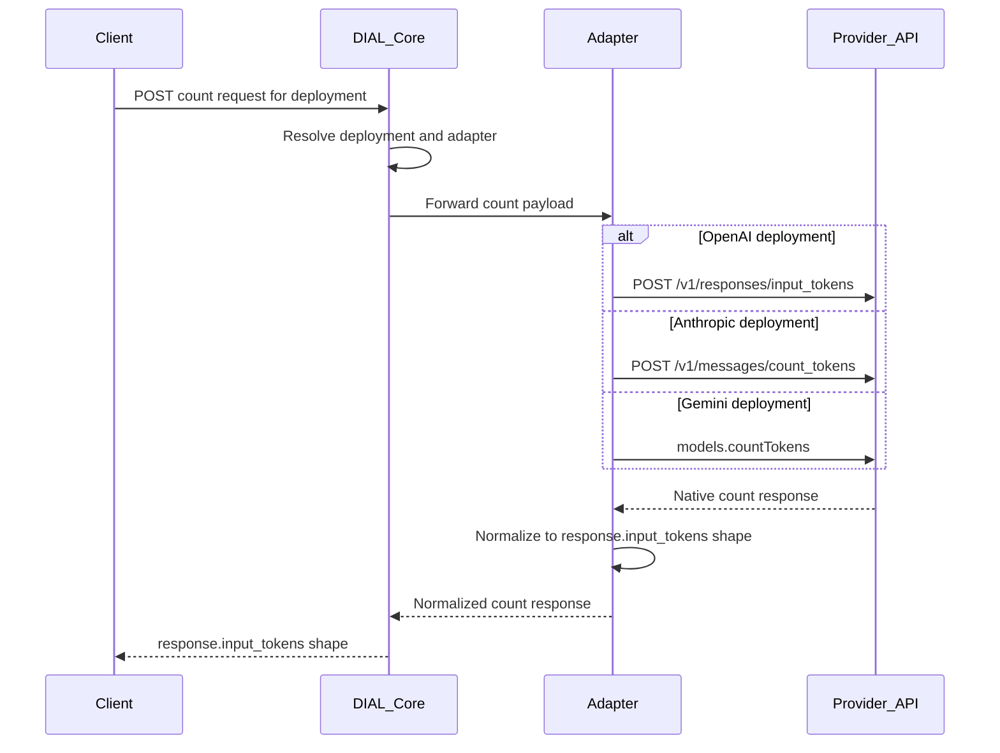

# DIAL Token Count API Consolidation

Discussion paper for **DIAL Core** and **DIAL Adapter** teams.

This is **not** a formal QuickApps design document. It does not follow [`docs/designs/template.md`](designs/template.md). Nothing here is binding — the goal is to describe the **idea of consolidating** provider token-count APIs behind one DIAL endpoint for **later implementation**.

---

## Summary

Today, OpenAI, Anthropic, and Google Gemini each expose a different API to count input tokens before sending a request. Field names, response shapes, and semantics differ. We propose that **DIAL Core** expose a single endpoint that routes to the correct adapter; each adapter calls the provider's native count API and **normalizes the response** to match the **OpenAI Responses API** `response.input_tokens` shape as closely as possible.

Clients (future QuickApps features, other DIAL applications) would then depend on one contract instead of three.

---

## Motivation

| Problem | Detail |
|---------|--------|
| Fragmented provider APIs | OpenAI uses `POST /v1/responses/input_tokens`; Anthropic uses `POST /v1/messages/count_tokens`; Gemini uses `count_tokens` / CountTokens. |
| Different field names | `input_tokens` vs `totalTokenCount` vs `prompt_token_count` (in usage metadata). |
| Different semantics | Cache tokens, thinking/reasoning tokens, and tool-schema overhead are reported differently per provider. |
| Legacy DIAL `/tokenize` | `aidial-adapter-openai` implements `/tokenize` with **tiktoken (text only)** — it does not count images, PDFs, tools, or multimodal content the way provider APIs do. |

A consolidated DIAL endpoint lets Core and adapters own provider differences; clients receive a uniform response.

---

## Proposed flow



**Responsibilities:**

- **DIAL Core** — Accept the request, resolve deployment → adapter, return the normalized response (or standard DIAL error envelope).
- **Adapter** — Translate DIAL request → provider count API payload; map provider response → OpenAI-shaped output.
- **Client** — Sends one request shape; reads one response shape. No provider-specific logic.

---

## Provider API reference

### OpenAI

| Resource | URL |
|----------|-----|
| Token counting guide | https://developers.openai.com/api/docs/guides/token-counting |
| Count input tokens | `POST https://api.openai.com/v1/responses/input_tokens` |
| Count input tokens API reference | https://developers.openai.com/api/reference/resources/responses/input_tokens |
| Responses API reference (incl. `ResponseUsage`) | https://developers.openai.com/api/reference/resources/responses/ |
| Migrate to Responses API | https://platform.openai.com/docs/guides/migrate-to-responses |

**Count response (canonical baseline for DIAL):**

```json
{
  "object": "response.input_tokens",
  "input_tokens": 328
}
```

**Post-completion `usage` on a Response (`ResponseUsage`)** — reference for future usage consolidation, not the count endpoint:

```json
{
  "input_tokens": 328,
  "input_tokens_details": { "cached_tokens": 100 },
  "output_tokens": 52,
  "output_tokens_details": { "reasoning_tokens": 20 },
  "total_tokens": 380
}
```

The count endpoint accepts the same input format as `responses.create` (text, messages, images, files, tools, instructions) and returns the exact input token count the model will receive. See the [token counting guide](https://developers.openai.com/api/docs/guides/token-counting).

---

### Anthropic

| Resource | URL |
|----------|-----|
| Messages API reference | https://docs.anthropic.com/en/api/messages |
| Count tokens endpoint | `POST https://api.anthropic.com/v1/messages/count_tokens` |
| Count tokens section | https://docs.anthropic.com/en/api/messages#count-tokens |
| Response `usage` object | https://docs.anthropic.com/en/api/messages#response-usage |

**Count response:**

```json
{ "input_tokens": 2095 }
```

**Post-completion `usage` (representative):**

```json
{
  "input_tokens": 2095,
  "output_tokens": 503,
  "cache_creation_input_tokens": 2051,
  "cache_read_input_tokens": 2051,
  "cache_creation": {
    "ephemeral_5m_input_tokens": 0,
    "ephemeral_1h_input_tokens": 0
  },
  "output_tokens_details": { "thinking_tokens": 0 },
  "server_tool_use": {
    "web_fetch_requests": 2,
    "web_search_requests": 0
  },
  "service_tier": "standard"
}
```

---

### Google Gemini

| Resource | URL |
|----------|-----|
| Understand and count tokens | https://ai.google.dev/gemini-api/docs/tokens |
| Gemini thinking (thoughts tokens) | https://ai.google.dev/gemini-api/docs/thinking |
| CountTokens API (`models.countTokens`) | https://ai.google.dev/api/tokens#method:-models.counttokens |
| `usage_metadata` (post-completion) | https://googleapis.github.io/js-genai/release_docs/classes/types.GenerateContentResponseUsageMetadata.html |

**Count response (input only):**

```json
{ "totalTokenCount": 328 }
```

SDKs may expose `total_tokens` or `totalTokenCount` depending on language.

**Post-completion `usage_metadata`:**

```json
{
  "prompt_token_count": 328,
  "candidates_token_count": 52,
  "thoughts_token_count": 20,
  "cached_content_token_count": 100,
  "total_token_count": 400
}
```

---

## Target DIAL response contract

All adapters normalize to this shape. It mirrors [OpenAI `response.input_tokens`](https://developers.openai.com/api/docs/guides/token-counting).

### Required fields (v1 count endpoint)

```json
{
  "object": "response.input_tokens",
  "input_tokens": 328
}
```

| Field | Type | Description |
|-------|------|-------------|
| `object` | string | Always `"response.input_tokens"`. |
| `input_tokens` | integer | Normalized input token count for the full logical request (messages, system/instructions, tools, multimodal parts). |

The count endpoint is **input-only**. Do not add `output_tokens` — OpenAI's count API does not return output counts.

### Optional extensions (for discussion)

```json
{
  "object": "response.input_tokens",
  "input_tokens": 328,
  "input_tokens_details": {
    "cached_tokens": 0
  },
  "provider_details": {}
}
```

| Field | When to populate |
|-------|------------------|
| `input_tokens_details.cached_tokens` | Only if the provider count API returns a cache breakdown pre-send (rare; usually omitted or `0`). |
| `provider_details` | Provider-specific fields with no OpenAI mapping — see mapping tables below. |

---

## Proposed DIAL endpoint (for discussion)

Exact path is for the DIAL Core team to decide. Two options:

| Option | Path | Notes |
|--------|------|-------|
| OpenAI-aligned | `POST /openai/deployments/{deployment_id}/responses/input_tokens` | Mirrors OpenAI URL shape. |
| Provider-neutral | `POST /deployments/{deployment_id}/count_tokens` | Shorter; same response body. |

**Request body:** Payload that adapters can forward to provider count APIs. Ideally aligned with OpenAI Responses API input (`model`, `input`, `instructions`, `tools`, multimodal parts). DIAL Core may alternatively accept Chat Completions-shaped requests and let each adapter translate.

**Response body:** `response.input_tokens` object above.

**Errors:** Standard DIAL error envelope; adapters map provider 4xx/5xx.

---

## Field mapping tables

Tables use columns:

- **DIAL / OpenAI target** — field in the normalized DIAL response
- **Provider source** — field from the provider API
- **Rule** — how the adapter maps it
- **Excessive in provider** — provider has it; OpenAI has no equivalent (preserve in `provider_details` when relevant)
- **Missing in provider** — OpenAI has it; provider does not (adapter must synthesize or omit)

### Count endpoint (v1 — input only)

#### OpenAI adapter — pass-through

Provider API: [POST /v1/responses/input_tokens](https://developers.openai.com/api/docs/guides/token-counting)

| DIAL / OpenAI target | Provider source | Rule | Excessive in provider | Missing in provider |
|----------------------|-------------------|------|----------------------|---------------------|
| `object` | `object` | Pass through (`"response.input_tokens"`) | — | — |
| `input_tokens` | `input_tokens` | Pass through | — | — |

No conversion needed. This adapter is the reference implementation.

**Note on legacy `/tokenize`:** Today `aidial-adapter-openai` uses tiktoken (text-only). The consolidated endpoint should call **`/v1/responses/input_tokens`** for parity with OpenAI's multimodal and tool-aware counting.

---

#### Anthropic adapter

Provider API: [POST /v1/messages/count_tokens](https://docs.anthropic.com/en/api/messages#count-tokens)

| DIAL / OpenAI target | Provider source | Rule | Excessive in provider | Missing in provider |
|----------------------|-------------------|------|----------------------|---------------------|
| `object` | — | Set `"response.input_tokens"` | — | `object` discriminator |
| `input_tokens` | `input_tokens` | Direct map | — | — |
| `input_tokens_details.cached_tokens` | — | Omit or `0` pre-send | — | No cache breakdown in count API |
| `provider_details` | — | Empty for count | — | — |

---

#### Gemini adapter

Provider API: [count_tokens](https://ai.google.dev/gemini-api/docs/tokens) / [CountTokens](https://ai.google.dev/api/tokens#method:-models.counttokens)

| DIAL / OpenAI target | Provider source | Rule | Excessive in provider | Missing in provider |
|----------------------|-------------------|------|----------------------|---------------------|
| `object` | — | Set `"response.input_tokens"` | — | `object` discriminator |
| `input_tokens` | `totalTokenCount` / `total_tokens` | Rename to `input_tokens` | `*_token_count` naming suffix | — |
| `input_tokens_details.cached_tokens` | — | Omit pre-send (cache unknown until completion) | — | Structured `input_tokens_details` |
| `provider_details` | — | Empty for count | — | — |

---

### Post-completion usage (appendix — future consolidation)

Not in scope for the v1 **count** endpoint. Documented here so adapters can reuse the same OpenAI `ResponseUsage` field names when normalizing stream/completion usage later.

Reference: [OpenAI `ResponseUsage`](https://developers.openai.com/api/reference/resources/responses/)

#### Anthropic → OpenAI `ResponseUsage`

Ref: [Anthropic response usage](https://docs.anthropic.com/en/api/messages#response-usage)

| OpenAI target | Anthropic source | Rule | Excessive (no OpenAI equivalent) | Missing in Anthropic |
|---------------|------------------|------|--------------------------------|----------------------|
| `input_tokens` | `input_tokens + cache_read_input_tokens + cache_creation_input_tokens` | **Sum** — `input_tokens` alone understates context fill when caching is on | — | — |
| `input_tokens_details.cached_tokens` | `cache_read_input_tokens` | Map read tokens; creation is not a "cached read" | `cache_creation_input_tokens`, `cache_creation.ephemeral_5m_input_tokens`, `cache_creation.ephemeral_1h_input_tokens` | `audio_tokens` |
| `output_tokens` | `output_tokens` | Direct map | — | — |
| `output_tokens_details.reasoning_tokens` | `output_tokens_details.thinking_tokens` | Direct map | — | — |
| `total_tokens` | — | Compute `input_tokens + output_tokens` | `server_tool_use`, `service_tier`, `inference_geo` | Top-level `total_tokens` |

**Fields to preserve in `provider_details` when normalizing usage:**

- `cache_creation_input_tokens`, `cache_creation` (TTL breakdown)
- `server_tool_use` (request counts, not tokens)
- `service_tier`, `inference_geo`

---

#### Gemini → OpenAI `ResponseUsage`

Ref: [Gemini tokens](https://ai.google.dev/gemini-api/docs/tokens)

| OpenAI target | Gemini source | Rule | Excessive (no OpenAI equivalent) | Missing in Gemini |
|---------------|---------------|------|----------------------------------|-------------------|
| `input_tokens` | `prompt_token_count` | Direct map | — | — |
| `input_tokens_details.cached_tokens` | `cached_content_token_count` | Map implicit cache hits | — | Nested `input_tokens_details` structure |
| `output_tokens` | `candidates_token_count + thoughts_token_count` | **Sum** — `candidates_token_count` alone omits thinking | Separate `candidates_token_count` vs `thoughts_token_count` buckets | Single `output_tokens` field |
| `output_tokens_details.reasoning_tokens` | `thoughts_token_count` | Direct map | — | Nested `output_tokens_details` structure |
| `total_tokens` | `total_token_count` | Prefer upstream; verify equals normalized input + output | `tool_use_prompt_token_count` | — |

**Fields to preserve in `provider_details` when normalizing usage:**

- `candidates_token_count` (visible output split from thinking)
- `tool_use_prompt_token_count` (tool schema overhead)

---

## Cross-provider summary

| | OpenAI | Anthropic | Gemini |
|---|--------|-----------|--------|
| **Count API** | [input_tokens](https://developers.openai.com/api/docs/guides/token-counting) | [count_tokens](https://docs.anthropic.com/en/api/messages#count-tokens) | [count_tokens](https://ai.google.dev/gemini-api/docs/tokens) |
| **Count HTTP** | `POST /v1/responses/input_tokens` | `POST /v1/messages/count_tokens` | `models.countTokens` |
| **Count response field** | `input_tokens` | `input_tokens` | `totalTokenCount` / `total_tokens` |
| **Response object type** | `response.input_tokens` | (none) | (none) |
| **Usage input field** | `input_tokens` | `input_tokens` (+ cache fields) | `prompt_token_count` |
| **Usage output field** | `output_tokens` | `output_tokens` | `candidates_token_count` + `thoughts_token_count` |
| **Reasoning detail** | `output_tokens_details.reasoning_tokens` | `output_tokens_details.thinking_tokens` | `thoughts_token_count` |
| **Cache** | `cached_tokens` ⊆ `input_tokens` | `cache_read_input_tokens` + `cache_creation_input_tokens` (separate) | `cached_content_token_count` (implicit) |
| **Cache in count response** | No | No | No |

---

## Normalization rules

### Count endpoint

1. **Always emit `object: "response.input_tokens"`** — Anthropic and Gemini count APIs have no object discriminator.
2. **OpenAI:** pass through unchanged.
3. **Anthropic count:** `input_tokens` → `input_tokens` (direct).
4. **Gemini count:** `totalTokenCount` / `total_tokens` → `input_tokens` (rename only).
5. **Do not add `output_tokens`** to the count response — all three providers' count APIs are input-only.

### Post-completion usage (appendix)

6. **Anthropic usage:** `input_tokens` for context fill = `input_tokens + cache_read_input_tokens + cache_creation_input_tokens`.
7. **Gemini usage:** `output_tokens` = `candidates_token_count + thoughts_token_count`.
8. **Anthropic usage:** compute `total_tokens` when upstream omits it.
9. **Preserve unmappable provider fields** in `provider_details` — do not silently drop cache creation breakdown, `server_tool_use`, or Gemini tool-use counts.

### Pseudocode

```python
def to_response_input_tokens_openai(provider: dict) -> dict:
    return {
        "object": provider["object"],
        "input_tokens": provider["input_tokens"],
    }


def to_response_input_tokens_anthropic(provider: dict) -> dict:
    return {
        "object": "response.input_tokens",
        "input_tokens": provider["input_tokens"],
    }


def to_response_input_tokens_gemini(provider: dict) -> dict:
    count = provider.get("totalTokenCount") or provider.get("total_tokens")
    return {
        "object": "response.input_tokens",
        "input_tokens": count,
    }
```

---

## Known pitfalls

1. **Anthropic (usage, not count):** `input_tokens` alone understates context-window fill when prompt caching is active. Use the sum rule for post-completion usage normalization.
2. **Gemini (usage):** `candidates_token_count` is not the full billable output — add `thoughts_token_count`.
3. **Gemini (count vs usage):** `count_tokens` may diverge from billed `usage_metadata` when tool schemas, thinking budget, or implicit cache differ between pre-send count and actual completion.
4. **Gemini (count):** Ensure tools in the DIAL request are passed to CountTokens the same way as `generateContent` — `count_tokens` may not include tool schemas if the adapter omits them.
5. **OpenAI:** Provider count API handles multimodal content and tools; legacy DIAL `/tokenize` (tiktoken) does not.
6. **All providers:** Count endpoint returns input tokens only — never invent `output_tokens` on the count response.

---

## Relationship to existing DIAL `/tokenize`

DIAL today exposes `POST /openai/deployments/{deployment_id}/tokenize` (via `aidial_sdk.deployment.tokenize`). The OpenAI adapter implements this with **tiktoken** (text BPE only).

| | Existing `/tokenize` | Proposed consolidated endpoint |
|---|---------------------|-------------------------------|
| OpenAI implementation | tiktoken (text only) | `POST /v1/responses/input_tokens` (provider-native) |
| Response shape | `TokenizeInputRequest` / per-chunk `token_count` | `response.input_tokens` |
| Multimodal / tools | Not counted accurately | Counted per provider rules |
| Cross-provider | Each adapter may differ | One normalized response contract |

Whether the new endpoint **replaces**, **supplements**, or **coexists** with `/tokenize` is an open question for DIAL Core (see below).

---

## Open questions for discussion

1. **DIAL endpoint path** — OpenAI-aligned (`/responses/input_tokens`) vs provider-neutral (`/count_tokens`)?
2. **Request body shape** — Accept OpenAI Responses API input directly, or Chat Completions-shaped requests with per-adapter translation?
3. **`/tokenize` migration** — Deprecate tiktoken-based `/tokenize` for OpenAI deployments, or keep both?
4. **`provider_details` on v1** — Include the optional bag on the count response, or defer to usage normalization only?
5. **Gemini tools in count** — How to guarantee CountTokens receives the same tool definitions as `generateContent`?
6. **Post-completion usage** — Same endpoint family later, or a separate normalization path for stream `usage`?
7. **Bedrock-hosted Claude** — Field name aliases and availability of `count_tokens` on Bedrock vs direct Anthropic API.

---

## Suggested next steps

| Team | Action |
|------|--------|
| **DIAL Core** | Choose endpoint path and request contract; define routing deployment → adapter. |
| **aidial-adapter-openai** | Implement pass-through to `POST /v1/responses/input_tokens`; document `/tokenize` relationship. |
| **aidial-adapter-anthropic** | Implement `count_tokens` → `response.input_tokens` mapping. |
| **aidial-adapter-gemini** | Implement CountTokens → `response.input_tokens`; validate tool/multimodal parity. |
| **All** | Golden fixtures: fixed payload → normalized count matches provider native API (0 delta for count). |

---

## Out of scope

- QuickApps implementation (`parse.py`, `context_usage`, etc.)
- DIAL Core or adapter code in this repository
- Formal design approval workflow

**Related (informational):** [`docs/designs/context_window_usage.md`](designs/context_window_usage.md) discusses future QuickApps context metering that may consume a DIAL token-count endpoint once available.
