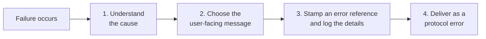

# Error Handling

This document explains what happens when a Quick Apps request fails: how the cause of a failure is
identified, how it is translated into a safe and actionable message, how it is correlated with server logs,
and how it reaches the user. For the design rationale and the platform contracts behind these choices, see
[`designs/error_message_resolution.md`](designs/error_message_resolution.md).

## The Three Error Surfaces

Quick Apps surfaces failures in three distinct ways, each aimed at a different audience:

| Surface | When it applies | What the user sees | Documented in |
|---|---|---|---|
| **Request failure** | Something aborts the whole turn — the AI model call fails, a required service is unavailable, or the app hits an internal error | A true error state: an explanation of the cause plus an error reference, rendered by the client as an error rather than as a chat reply | This document |
| **Initialization issues** | Some tools or skills fail to load, but the request can still proceed without them | A diagnostic *Initialization issues* stage above a normal, successful answer — aimed at the app builder fixing their manifest | [Agent Design §6](agent.md#6-error-handling) |
| **Tool-execution fallbacks** | A single tool call fails mid-conversation and the tool's configured fallback strategy decides what happens next | Usually nothing directly — the agent is instructed to recover, retry, or explain the failure in its own words | [Agent Design — Tool System](agent.md#error-handling) |

The rest of this document covers the first surface.

## What Happens When a Request Fails

Every failure that aborts a turn goes through the same four steps:

## 1. Understanding the Cause

Failures reach Quick Apps from several directions — the AI model call routed through DIAL Core, direct calls
to platform services, or the app's own logic — and each direction reports errors in a slightly different
shape. The first step normalizes them all into one common picture built from the fields the DIAL error
protocol defines:

| Field | Meaning |
|---|---|
| **status** | The HTTP status class of the failure, when one exists |
| **code** | A machine-readable cause, e.g. `content_filter` or `context_length_exceeded` |
| **type** | The protocol's error category; carried through but never used to pick a message |
| **message** | The internal explanation — logged, never shown to the user |
| **display message** | Text the failing component authored *specifically for end users* |

Normalization is best-effort: a failure that carries no usable details (or a malformed payload) simply yields
an empty picture and falls through to the generic rules below — diagnosing an error can never itself fail.

One DIAL convention deserves a note: when a model fails *mid-stream* (after it has already started answering),
the error arrives without an HTTP status of its own, but usually carries the original status inside its
`code` field (e.g. `"429"`). Quick Apps recognizes this and treats such failures as if they had the real
status, so a mid-stream rate limit gets the same precise message as an up-front one.

## 2. Choosing the User-Facing Message

The message is selected by a fixed precedence — the most specific and trustworthy information available wins:

1. **The upstream's own display message.** If the failing component authored user-facing text, it is shown
   verbatim (capped in length, and skipped if it turns out to be empty). Nothing is appended to it — generic
   advice could contradict a precise upstream explanation.
2. **Known error codes.** A curated set of causes gets tailored, actionable advice: content-policy
   rejections ("please rephrase your message"), context-window overflows ("please shorten your messages").
3. **Status-class messages.** Failing that, the status determines a canned message, worded for the failing
   component: *AI model* wording when the model call failed, *service* wording when a platform service did.
   Authentication, permission, not-found, payload-size, rate-limit, timeout, and connectivity causes each
   have their own text.
4. **Stream failures.** A mid-stream model failure that none of the above could explain is reported as "the
   AI model service failed while responding" — never as a generic mystery.
5. **Known internal conditions.** Failures originating inside Quick Apps itself (iteration limit reached,
   a configured toolset missing or inaccessible) have their own messages.
6. **The generic fallback.** Only a genuinely unknown failure ends with "Something went wrong with the
   execution of your request. Please contact your administrator."

### Retryability

Every resolved failure is also classified as retryable or not, and the advice matches the classification:
transient causes (rate limits, timeouts, upstream outages, network blips) end with "Please try again later.",
while deterministic causes carry advice that can actually help — contact an administrator, shorten the
conversation, rephrase the message. Notably, a *connection* failure to the model service is treated as
deterministic: by the time the user sees it, the platform has already retried it, so "try again later" would
be false hope. The classification is also recorded in the log entry for operators.

## 3. Error-Reference Correlation

"Contact your administrator" is only useful if the administrator can find the failure. Every request failure
is therefore stamped with a short opaque reference that appears in **both** places:

- **In the user-facing text** — `<message> (error reference: a1b2c3d4)`.
- **In a single server log record** — together with the full stack trace, the internal error details, and
  the retryability classification.

The workflow: the user reports the reference (a screenshot or copy-paste suffices) → the administrator greps
the application logs for it → the matching record has everything needed to diagnose the failure. Internal
detail lives *only* in the logs; user-facing text is limited to upstream display messages (user-safe by DIAL
contract) and Quick Apps' own curated wording.

## 4. Delivery as a Protocol Error

Failures are delivered through the **DIAL error protocol**, not as chat text. This distinction matters more
than it may seem:

- The client renders a **true error state** (in DIAL Chat: a red error box) instead of presenting the
  failure as a normal assistant reply.
- The error text is **kept out of conversation history** — it is never replayed to the LLM on later turns.
- The client steers the user toward **regenerating** the failed turn, which replays a clean history.
- Any partial answer streamed before the failure **stays visible**, with the error shown beneath it.
- Monitoring sees a failure instead of a fake success.

The wire shape depends on how far the response had progressed:

| Failure point | Wire format |
|---|---|
| Before the response stream opens (e.g. request validation), or on a non-streaming request | A non-200 response with a standard OpenAI-style error body |
| After the response stream opens — which in practice is every failure of an accepted streaming request | An error chunk inside the already-open stream, as the stream's final meaningful event |

Both shapes carry the same fields, and DIAL Chat treats them the same way for everything described above.

### Outgoing-status policy

Quick Apps never responds with a status that DIAL Core's load balancer treats as retriable (429, 502, 503,
504) — for an application Core cannot retry, so it would discard the explanation and substitute a generic
error. Instead:

- Failures attributable to the request itself keep their natural client status (bad request, authentication,
  permission, not-found, payload-too-large, validation).
- Everything else — upstream rate limits and outages, stream failures, timeouts, unknown internal errors —
  is reported as a plain internal error (500).

The true cause is preserved in the error's `code` field, so a 500 may legitimately carry `code: "429"`:
the code says *what happened*, the status says *how to route it*. API consumers should classify by code,
not status. Similarly, when the upstream supplied no `type`, Quick Apps fills in the protocol-conventional
one for the outgoing status: `invalid_request_error` for client statuses, `runtime_error` otherwise.

### Leaving the conversation tidy

An aborted turn must not leave visual debris behind. Before the error is delivered:

- Any still-open progress stages are closed in a **failed** state — otherwise the client would show them as
  perpetually running.
- Bookkeeping stages that decorate successful answers (such as the execution-time report) are suppressed, so
  the error is the last thing the user sees.

## Testing Error Handling End-to-End

The repository ships an **error-injection sample model**
([`src/tests/sample_apps/error_injection_app/`](../src/tests/sample_apps/error_injection_app/README.md))
that deterministically reproduces every failure mode described above — upstream errors with and without
display messages, content-filter and context-length rejections, mid-stream failures after partial content,
unknown internal errors, and slow responses.

Run it with `make run_error_injection_app`; the local docker-compose configuration registers it as the
`error-injection-model` deployment and wires an *Error Handling Tester* Quick App with one conversation
starter per scenario, so each failure mode can be triggered with a single click in DIAL Chat.
