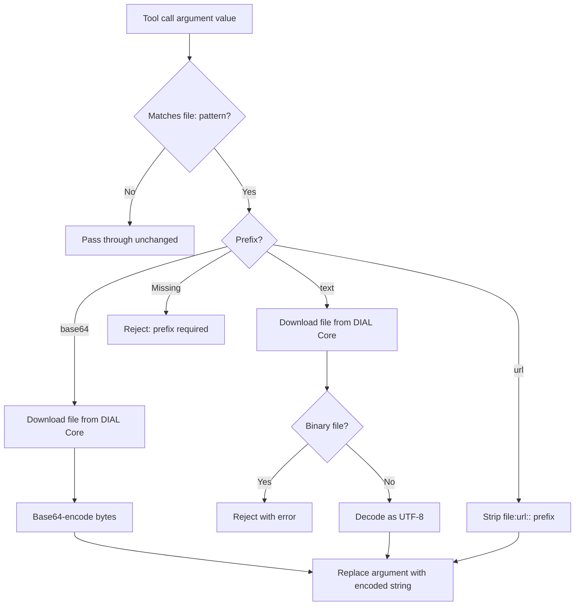

# File Transfer

This document describes how Quick Apps handles file-related parameters in tool calls. It covers the
`file:{prefix}::` convention, the preprocessing pipeline that resolves file references before they reach tools, and
the built-in skill that teaches the agent how to use the convention.

## Overview

When a user uploads a file or an admin attaches a context file, the agent receives its DIAL-relative URL (e.g.
`files/bucket/report.pdf`). However, downstream tools have different expectations for how file content is delivered —
some need base64-encoded bytes, others need plain text, and some just need the URL passed through.

Quick Apps solves this with a two-part mechanism:

1. **A built-in skill** that teaches the agent the `file:{prefix}::{path_or_url}` convention, so it formats
   parameters correctly based on what the tool expects.
2. **A preprocessing pipeline** that intercepts `file:` patterns in tool call arguments and resolves them to the
   actual content (base64 bytes, decoded text, or a bare URL) before the tool receives the parameters.

This applies to **all tool types** — MCP, REST API, DIAL deployment, and internal tools.

## The `file:{prefix}::` Convention

When the agent calls a tool and a parameter value requires file content, it uses the format:

```
file:{prefix}::{path_or_url}
```

| Component       | Description                                                                                                                |
|-----------------|----------------------------------------------------------------------------------------------------------------------------|
| `file:`         | Literal prefix that triggers preprocessing                                                                                 |
| `{prefix}`      | One of `base64`, `text`, or `url` (case-insensitive)                                                                       |
| `::`            | Separator between the prefix and the path                                                                                  |
| `{path_or_url}` | DIAL-relative file path (e.g. `files/bucket/foo.pdf`) or an external `http(s)://` URL (e.g. `https://example.com/foo.pdf`) |

### Prefixes

| Prefix   | When to use                                                                | What the tool receives                             |
|----------|----------------------------------------------------------------------------|----------------------------------------------------|
| `base64` | Tool expects raw/encoded file content (images, PDFs, binary data)          | Base64-encoded string of the downloaded file bytes |
| `text`   | Tool expects plain text content (source code, logs, markdown, CSV)         | UTF-8 decoded text content of the file             |
| `url`    | Tool expects a URL or path reference (navigation targets, file references) | The bare URL string, with `file:url::` stripped    |

### Examples

| Scenario       | Tool parameter                       | Agent writes                          | Tool receives                    |
|----------------|--------------------------------------|---------------------------------------|----------------------------------|
| Image analysis | `image_data: "base64 encoded image"` | `file:base64::files/images/chart.png` | `iVBORw0KGgo...` (base64 string) |
| Code review    | `source: "text content of file"`     | `file:text::files/code/main.py`       | `def main():\n    ...`           |
| Web navigation | `target_url: "URL to navigate to"`   | `file:url::https://example.com/page`  | `https://example.com/page`       |
| PDF processing | `document: "the file to process"`    | `file:base64::files/docs/report.pdf`  | `JVBERi0xLj...` (base64 string)  |

## How the Agent Learns the Convention

The agent learns the `file:{prefix}::` convention through a built-in
[agent skill](skills.md) called `tool-call-file-parameter-formatting`. This skill contains detailed instructions and
examples for choosing the correct prefix based on tool parameter names and descriptions.

The skill content is **injected automatically** at the start of every conversation as a synthetic `read_skill` tool
call and response. The agent sees the instructions before processing any user message, without consuming an
orchestrator iteration.

> [!NOTE]
> The injection is unconditional — it happens even when no tools with file parameters are configured. This uses some
> context tokens but ensures the agent is always prepared to handle files.

## Preprocessing Pipeline

When the agent calls a tool with a `file:{prefix}::` value, the preprocessing pipeline resolves it before the tool
executes:



### `base64` processing

1. Loads the file via `FileLoaderService` (DIAL files via `DialDownloader`, external URLs via `ExternalUrlFetcher`).
2. Base64-encodes the bytes.
3. Replaces the parameter value with the encoded string.

### `text` processing

1. Loads the file via `FileLoaderService` (same dispatch as `base64`).
2. Checks for binary file signatures (PNG, JPEG, GIF, PDF, ZIP). If the file is binary, the tool call fails with an
   error instructing the agent to use `base64` or `url` instead.
3. Decodes the bytes as UTF-8 (with BOM handling via `utf-8-sig`).
4. Replaces the parameter value with the decoded text.

### `url` processing

1. Strips the `file:url::` prefix.
2. Passes the bare URL to the tool. The runtime never fetches in this branch.

### Missing prefix

If the agent writes `file:path/to/file` without a prefix (no `base64::`, `text::`, or `url::`), the tool call is
rejected with an error message. The agent receives retry instructions and can re-attempt with a corrected prefix.

## File Loading and Caching

File loading is handled by `FileLoaderService`, a request-scoped service that:

- **Classifies** every URL via `classify_url`: bare DIAL paths and absolute URLs whose host matches the configured
  DIAL endpoint route to `DialDownloader` (DIAL Core download API); other `http(s)://` URLs route to
  `ExternalUrlFetcher`; everything else (`file:`, `ftp:`, `data:`, malformed) is rejected with a clear error.
- **Caches downloads** within the request via `StateHolder`, keyed by `sha256(url)`. If the same URL appears in
  multiple tool call parameters (or across multiple tool calls in the same orchestrator iteration), it is loaded
  only once.
- **Enforces a size limit** (default 10 MiB; per-app overridable via `features.file_loading.size_limit`). Both DIAL
  and external branches use the same `FileLoadingSizeLimitResolver`.

### External URL fetching (security envelope)

`ExternalUrlFetcher` is the single egress point for *file loading* of external URLs. It enforces the following
uniformly across every consumer:

| Concern                | Behaviour                                                                                                                          |
|------------------------|------------------------------------------------------------------------------------------------------------------------------------|
| Credential isolation   | The HTTP client is constructed with no DIAL API key, no bearer, and no DIAL-internal headers.                                      |
| SSRF guard             | Each hop is DNS-resolved before TCP connect and rejected if any resolved address falls in `127/8`, `10/8`, `172.16/12`, `192.168/16`, `169.254/16`, `::1`, `fe80::/10`. DNS-rebinding defence: rejection if **any** address in the answer is blocked. |
| Redirect cap           | Default 5, hard ceiling 10 (set via `EXTERNAL_URL_FETCH_MAX_REDIRECTS`). Each hop is SSRF-checked.                                 |
| Size limit             | Same `FileLoadingSizeLimitResolver` as DIAL downloads. Streamed in chunks; aborts mid-download if the running total exceeds limit. |
| Connect / read timeout | `EXTERNAL_URL_FETCH_CONNECT_TIMEOUT_SECONDS` (default 5s); read uses the resolved tool timeout.                                    |

### Two-tier egress policy

External fetching is gated along two orthogonal axes — **on/off** (does egress happen at all) and
**host allowlist** (which destinations are reachable). Each axis has an admin (env) tier and a
builder (per-app) tier. Defaults are off / unset.

| Axis      | Tier    | Setting                                                  | Default | Effect                                                                                                                                           |
|-----------|---------|----------------------------------------------------------|---------|--------------------------------------------------------------------------------------------------------------------------------------------------|
| On/off    | Admin   | env `EXTERNAL_URL_FETCH_ENABLED`                           | `false` | Hard cap. When false, no app may fetch externally regardless of its manifest.                                                                    |
| On/off    | Builder | manifest `features.external_url_fetch.enabled`           | `null`  | `null` defers to admin; `true` is a no-op when admin allows; `false` opts this app out from below.                                               |
| Allowlist | Admin   | env `EXTERNAL_URL_FETCH_HOST_ALLOWLIST` (comma-separated) | `null` | When unset, no admin-level host restriction. When set, only hosts matching the patterns are reachable; per-app builder lists can narrow further. |
| Allowlist | Builder | manifest `features.external_url_fetch.host_allowlist`    | `null`  | `null` defers to admin; a non-empty list narrows the admin list (intersection); an explicit empty list locks this app out of all hosts.          |

**Host pattern grammar.** `example.com` matches that host exactly (case-insensitive).
`*.example.com` matches any subdomain of `example.com` with at least one label
(`a.example.com`, `a.b.example.com`); it does not match `example.com` itself. List both to allow
both. IP-literal hosts (`https://1.2.3.4/...`) are never matched by the allowlist — the SSRF
guard remains responsible for IP-level filtering. IDNs / Unicode hostnames are the operator's
responsibility to normalise to ASCII (punycode) when configuring.

The allowlist axis is enforced before DNS, both for the initial URL and on every redirect target —
an allowlist-passing URL cannot redirect to a disallowed one.

The deployment-handoff branch (when a DIAL deployment advertises `features.url_attachments`) is **not** gated:
QuickApps emits an `AttachmentParam(reference_url=…)` and the deployment fetches the bytes itself, so neither axis
applies.

## Deployment-attachment dispatch

`DialCompletionService._resolve_attachment` is capability-aware. The four-branch dispatch is:

| URL classification | Deployment `features.url_attachments` | Output                                                                                |
|--------------------|---------------------------------------|---------------------------------------------------------------------------------------|
| DIAL               | (any)                                 | `AttachmentParam(url=<resolved DIAL url>, type=…, title=…)`                           |
| External           | `true`                                | `AttachmentParam(reference_url=url, title=<URL filename>)` — no QuickApps egress      |
| External           | `false` / `null` / absent             | `DialFilePromoter.promote(url)` → upload to caller's bucket → `AttachmentParam(url=)` |
| Unsupported        | (any)                                 | `InvalidToolCallParameterException` with the offending URL                            |

The `features.url_attachments` flag is snapshotted at tool-config build time and cached in
`DialDeploymentToolCacheService` for the process. An operator who flips the flag on a deployment sees the new
behaviour after process restart — same staleness profile as `input_attachment_types`.

## MCP-Specific: `dial_url` Permission Grants

MCP tools have an additional capability: when a tool parameter's JSON schema includes `"dial_url": true`, the
preprocessor grants DIAL Core file permissions to the MCP server's toolset, allowing the server to access the file
directly. The preprocessor classifies each value before granting; if the value is an external URL or any
non-`http(s)` scheme, the tool call is rejected with a clear retry message instructing the agent to fall back to
`file:base64::` / `file:text::`.

This only applies to MCP tools connected to DIAL (`DialMCPToolSet` with a configured `dial_id`). For non-DIAL MCP
tools and all other tool types, the `url` prefix simply passes the URL through without any permission management.

## Error Handling

When file preprocessing encounters an error, it raises `InvalidToolCallParameterException`. Instead of failing the
tool call permanently, `StagedBaseTool` catches this exception and returns a **retry response** to the agent. The
response includes the error details so the agent can self-correct:

| Error condition                                | Agent receives                                                                |
|------------------------------------------------|-------------------------------------------------------------------------------|
| Missing prefix (`file:path`)                   | "Missing required file prefix (base64::, url::, text::)"                      |
| Binary file with `text` prefix                 | "File appears to be binary (PNG image). Use base64:: or url:: instead"        |
| File exceeds size limit                        | "External URL … exceeds the configured file-size limit." / DIAL download error |
| External URL with SSRF block                   | "External URL … resolves to a blocked address …"                              |
| External URL with redirect cap                 | "External URL … exceeded the configured redirect limit."                      |
| External URL with timeout                      | "External URL … timed out."                                                   |
| External fetching disabled (admin)             | "External URL fetching is disabled by operator policy (EXTERNAL_URL_FETCH_ENABLED)." |
| External fetching disabled (per-app)           | "External URL fetching is disabled by this app (features.external_url_fetch.enabled=false)." |
| Host not in admin allowlist                    | "External URL host is not in the operator allowlist (EXTERNAL_URL_FETCH_HOST_ALLOWLIST)." |
| Host not in per-app allowlist                  | "External URL host is not in this app's allowlist (features.external_url_fetch.host_allowlist)." |
| `dial_url: true` parameter received external   | "Parameter `…` requires a DIAL file but received an external URL …"           |
| `dial_url` without configured toolset ID       | "Files cannot be shared because dial_toolset_id is not configured"            |

## Limitations

- **Top-level string parameters only.** The `file:` pattern is matched against top-level string values in tool call
  arguments. Nested objects and arrays are not traversed.
- **Binary detection is heuristic.** The `text` prefix checks 5 binary file signatures (PNG, JPEG, GIF, PDF, ZIP).
  Other binary formats may pass the check and produce garbled text.
- **No streaming.** Files are downloaded fully into memory before processing. The 10 MB limit prevents excessive
  memory use.

## Related Documentation

- [Agent Skills](skills.md) — how skills work, including the built-in file transfer skill
- [Agent Design](agent.md) — internal architecture, tool system, and message processing pipeline
- [Design Doc](designs/skills_and_file_transfer.md) — design rationale, implementation details, and known limitations
