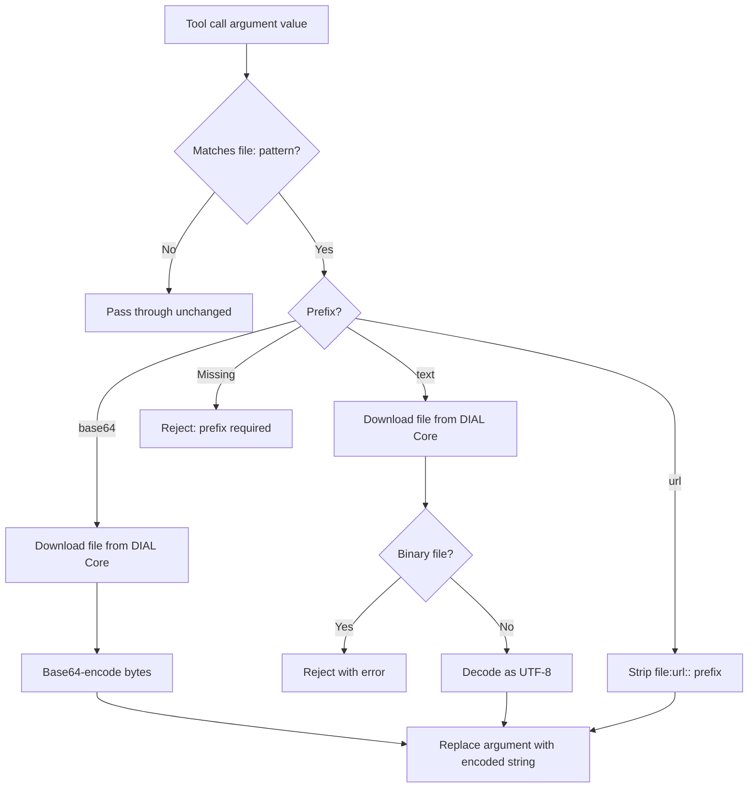

# File Transfer

This document describes how Quick Apps handles file-related parameters in tool calls. It covers the
`file:{prefix}::` convention, the preprocessing pipeline that resolves file references before they reach tools, and
the built-in skill that teaches the agent how to use the convention.

## Overview

When a user uploads a file or an admin attaches a context file, the agent receives its DIAL-relative URL (e.g.
`files/bucket/report.pdf`). However, downstream tools have different expectations for how file content is delivered —
some need base64-encoded bytes, others need plain text, and some just need the URL passed through.

Quick Apps solves this with a two-part mechanism:

1. **A built-in skill** that teaches the agent the `file:{prefix}::{path_or_url}` convention, so it formats
   parameters correctly based on what the tool expects.
2. **A preprocessing pipeline** that intercepts `file:` patterns in tool call arguments and resolves them to the
   actual content (base64 bytes, decoded text, or a bare URL) before the tool receives the parameters.

This applies to **all tool types** — MCP, REST API, DIAL deployment, and internal tools.

## The `file:{prefix}::` Convention

When the agent calls a tool and a parameter value requires file content, it uses the format:

```
file:{prefix}::{path_or_url}
```

| Component       | Description                                          |
|-----------------|------------------------------------------------------|
| `file:`         | Literal prefix that triggers preprocessing           |
| `{prefix}`      | One of `base64`, `text`, or `url` (case-insensitive) |
| `::`            | Separator between the prefix and the path            |
| `{path_or_url}` | DIAL-relative file path or an external URL           |

### Prefixes

| Prefix   | When to use                                                                | What the tool receives                             |
|----------|----------------------------------------------------------------------------|----------------------------------------------------|
| `base64` | Tool expects raw/encoded file content (images, PDFs, binary data)          | Base64-encoded string of the downloaded file bytes |
| `text`   | Tool expects plain text content (source code, logs, markdown, CSV)         | UTF-8 decoded text content of the file             |
| `url`    | Tool expects a URL or path reference (navigation targets, file references) | The bare URL string, with `file:url::` stripped    |

### Examples

| Scenario       | Tool parameter                       | Agent writes                          | Tool receives                    |
|----------------|--------------------------------------|---------------------------------------|----------------------------------|
| Image analysis | `image_data: "base64 encoded image"` | `file:base64::files/images/chart.png` | `iVBORw0KGgo...` (base64 string) |
| Code review    | `source: "text content of file"`     | `file:text::files/code/main.py`       | `def main():\n    ...`           |
| Web navigation | `target_url: "URL to navigate to"`   | `file:url::https://example.com/page`  | `https://example.com/page`       |
| PDF processing | `document: "the file to process"`    | `file:base64::files/docs/report.pdf`  | `JVBERi0xLj...` (base64 string)  |

## How the Agent Learns the Convention

The agent learns the `file:{prefix}::` convention through a built-in
[agent skill](skills.md) called `tool-call-file-parameter-formatting`. This skill contains detailed instructions and
examples for choosing the correct prefix based on tool parameter names and descriptions.

The skill content is **injected automatically** at the start of every conversation as a synthetic `read_skill` tool
call and response. The agent sees the instructions before processing any user message, without consuming an
orchestrator iteration.

> [!NOTE]
> The injection is unconditional — it happens even when no tools with file parameters are configured. This uses some
> context tokens but ensures the agent is always prepared to handle files.

## Preprocessing Pipeline

When the agent calls a tool with a `file:{prefix}::` value, the preprocessing pipeline resolves it before the tool
executes:



### `base64` processing

1. Downloads the file from DIAL Core via `DialFileService`.
2. Base64-encodes the bytes.
3. Replaces the parameter value with the encoded string.

### `text` processing

1. Downloads the file from DIAL Core.
2. Checks for binary file signatures (PNG, JPEG, GIF, PDF, ZIP). If the file is binary, the tool call fails with an
   error instructing the agent to use `base64` or `url` instead.
3. Decodes the bytes as UTF-8 (with BOM handling via `utf-8-sig`).
4. Replaces the parameter value with the decoded text.

### `url` processing

1. Strips the `file:url::` prefix.
2. Passes the bare URL to the tool.

### Missing prefix

If the agent writes `file:path/to/file` without a prefix (no `base64::`, `text::`, or `url::`), the tool call is
rejected with an error message. The agent receives retry instructions and can re-attempt with a corrected prefix.

## File Download and Caching

File downloads are handled by `DialFileService`, a request-scoped service that:

- **Caches downloads** within the request. If the same file URL appears in multiple tool call parameters (or across
  multiple tool calls in the same orchestrator iteration), it is downloaded only once.
- **Enforces a size limit** of 10 MB per file. Files exceeding this limit are rejected.
- **Authenticates** with DIAL Core using the request's API key.

## MCP-Specific: `dial_url` Permission Grants

MCP tools have an additional capability: when a tool parameter's JSON schema includes `"dial_url": true`, the
preprocessor grants DIAL Core file permissions to the MCP server's toolset, allowing the server to access the file
directly.

This only applies to MCP tools connected to DIAL (`DialMCPToolSet` with a configured `dial_id`). For non-DIAL MCP
tools and all other tool types, the `url` prefix simply passes the URL through without any permission management.

## Error Handling

When file preprocessing encounters an error, it raises `InvalidToolCallParameterException`. Instead of failing the
tool call permanently, `StagedBaseTool` catches this exception and returns a **retry response** to the agent. The
response includes the error details so the agent can self-correct:

| Error condition                          | Agent receives                                                         |
|------------------------------------------|------------------------------------------------------------------------|
| Missing prefix (`file:path`)             | "Missing required file prefix (base64::, url::, text::)"               |
| Binary file with `text` prefix           | "File appears to be binary (PNG image). Use base64:: or url:: instead" |
| File exceeds 10 MB                       | Size limit error                                                       |
| Download failure                         | Download error details                                                 |
| `dial_url` without configured toolset ID | "Files cannot be shared because dial_toolset_id is not configured"     |

## Limitations

- **Top-level string parameters only.** The `file:` pattern is matched against top-level string values in tool call
  arguments. Nested objects and arrays are not traversed.
- **Binary detection is heuristic.** The `text` prefix checks 5 binary file signatures (PNG, JPEG, GIF, PDF, ZIP).
  Other binary formats may pass the check and produce garbled text.
- **No streaming.** Files are downloaded fully into memory before processing. The 10 MB limit prevents excessive
  memory use.

## Related Documentation

- [Agent Skills](skills.md) — how skills work, including the built-in file transfer skill
- [Agent Design](agent.md) — internal architecture, tool system, and message processing pipeline
- [Design Doc](designs/skills_and_file_transfer.md) — design rationale, implementation details, and known limitations
