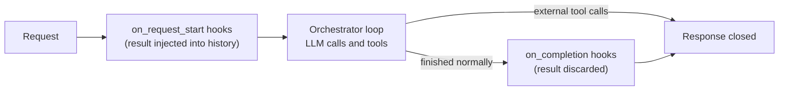

# Hooks

> **Preview** — requires `ENABLE_PREVIEW_FEATURES=true`. May change without a major version bump.

Hooks run a configured tool at a fixed point of a request, without the model deciding to call it.
This guide describes how that works at runtime. Fields and examples are in
[CONFIGURATION — Hooks](../CONFIGURATION.md#hooks-configuration); the reasoning behind the design is in
[hook_context_and_lifecycle_events.md](./designs/hook_context_and_lifecycle_events.md).

## Request lifecycle



| Event | When | Result |
|-------|------|--------|
| `on_request_start` | Before the first LLM call of the request | Injected into the conversation as a synthetic tool-call pair |
| `on_completion` | After the orchestrator loop ended normally, before the response is closed | Discarded; the hook exists for its side effect |

`on_completion` does not fire when the turn ends with external tool calls handed back to the client.

## `on_request_start`

- Each hook runs once per request, in the position of the hooks module in the message-transformer chain.
  It sees the messages as they are at that point: the restored tool history plus pairs injected by earlier
  transformers.
- The tool result is added to the history as an assistant tool call plus a `tool` message, so the model reads
  it as if it had called the tool itself. The call shows the **rendered** arguments.
- The identity of the pair (its call id) is derived from the **unrendered** `arguments`, so it stays the same
  from turn to turn even when the rendered values change. This is what `frequency` relies on:
  - `append_if_changed` (default): an identical result replaces the earlier pair in place, a different
    result is appended as a new pair.
  - `always`: a pair is appended every turn.
  - `refresh_condition` (TTL) finds the earlier pair by that identity, so it works only with static
    `arguments`. Combining it with a template is rejected when the configuration is validated.
- A hook that is skipped (see [Failures](#failures-and-timeouts)) injects nothing; pairs from earlier turns
  stay in place.

## `on_completion`

- Runs inside the request, after the final answer is streamed and before the response is closed, so
  per-request MCP sessions are still open and the hook can reuse them.
- Hooks run **sequentially in manifest order**. The response stays open until they finish, so the delay is
  bounded by the sum of their timeouts.
- The result is not added to the conversation and not stored, so the next turn does not see it.

## Hook context

Arguments are rendered against a read-only snapshot of the conversation. The names and templating syntax are
in [CONFIGURATION — Hook argument templates](../CONFIGURATION.md#hook-argument-templates). Behaviour to know:

- `messages` is a simplified view of the DIAL messages, not the raw objects: `content` is text (multimodal
  parts are reduced to their text, attachments are not exposed), `tool_calls[].arguments` is a parsed object
  rather than a JSON string, and a whitespace-only `content` becomes `""`.
- `messages` is not only the dialog. It also holds the system prompt, tool results and pairs injected by other
  features, so filter by role when you need only the utterances.
- `last_assistant_message` is the last assistant message **without tool calls**, that is, the final answer of a
  previous turn on `on_request_start` and the current answer on `on_completion`.

## Failures and timeouts

A hook never fails the request. Every hook has a timeout (`timeout_seconds`, default 15 s for
`on_request_start`, 30 s for `on_completion`).

| Situation | Outcome |
|-----------|---------|
| Argument template cannot be rendered for this request (for example `last_assistant_message.content` on the first turn) | Hook is skipped for the request |
| Hook exceeds its timeout | Hook is cancelled and skipped, a warning is logged |
| Unexpected error while running the hook | Hook is skipped, the error is logged with a traceback |
| Tool fails and its fallback strategy produces a message (the default) | The tool layer logs `Tool call failed`; for `on_completion` the fallback content is discarded, so a failed write shows up only in that log |

Logs name the hook (`name`, or the tool name) and the event. A successful run logs one `DEBUG` line with the
elapsed time. Arguments and results are never logged.

## Tools hidden from the model

By default every tool a hook can call is also offered to the model. For a tool that only the platform should
drive (for example `prime_memories` and `save_memory`) that is a problem: the model sees the schema, and starts
calling the tool on its own. `hidden_from_model` fixes that on MCP-based toolsets (`mcp`, `dial-mcp`, and the MCP
branch of `dial-app`).

```json
{
  "tool_sets": [
    {
      "type": "dial-app",
      "name": "AppMemory",
      "deployment_id": "memory",
      "transport": "mcp",
      "allowed_tools": ["get_skill", "prime_memories", "save_memory", "search_memories"],
      "hidden_from_model": ["get_skill", "prime_memories", "save_memory"]
    }
  ],
  "hooks": [
    {
      "kind": "tool_call",
      "event": "on_request_start",
      "toolset_name": "AppMemory",
      "tool_name": "prime_memories"
    },
    {
      "kind": "tool_call",
      "event": "on_completion",
      "toolset_name": "AppMemory",
      "tool_name": "save_memory",
      "arguments": { "user_message": { "$eval": "last_user_message.content" } }
    }
  ]
}
```

The model's `tools` contains `AppMemory_search_memories` only. Both hooks run.

### What changes for a hidden tool

| Aspect | Behaviour |
|---|---|
| Model's `tools` payload | The tool is absent |
| `tool_search` catalog and deferral | The tool is absent; it is never deferred and does not count towards `min_tools_for_deferral`. A toolset whose tools are all hidden contributes nothing to discovery |
| Hooks | Unchanged: same `toolset_name` + `tool_name` addressing, same argument templating |
| Same toolset, other tools | Stay visible; one toolset and one MCP session serve both audiences |
| Client-supplied tools | A client tool named like a hidden tool is rejected as a name conflict |

### If the model calls a hidden tool anyway

The synthetic pair injected by an `on_request_start` hook stays in the history with the hidden tool's name, so
the model may imitate it and request the tool. Nothing runs. The model gets an ordinary tool response saying
the tool is not available to it, that the platform calls it automatically, and that it must not call it; the loop
then continues. The event is logged at warning level with the tool name only, and the call still counts towards
the turn's iterations and tool calls.

### Rules and pitfalls

- Entries are raw tool names as the MCP server reports them (the same addressing as `allowed_tools`).
- When `allowed_tools` is set, every `hidden_from_model` entry must be in it, otherwise the manifest is rejected:
  a tool outside `allowed_tools` is dropped before routing and would be lost for the hook too.
- A name the server does not provide is not an error: it is logged as a warning at initialization, and a hook that
  references the tool reports `tool '...' not found in initialized tools`.
- Hiding works by listing. A tool added to the server later is visible to the model unless `allowed_tools` pins
  the set, so set both.
- `None` and an empty list both mean every tool is visible.
- The field is preview-gated. With `ENABLE_PREVIEW_FEATURES` off it is ignored and the tools stay model-visible,
  consistent with no hooks running.
- On the chat-completion branch of `dial-app` the field is ignored with a warning, like `allowed_tools`.
- During a rolling upgrade or after a rollback, a replica running an older version ignores the unknown field and
  exposes the tools to the model.
- Only MCP-based toolsets support it today. REST, DIAL deployment and internal tools are a conditional later
  phase.

### Troubleshooting

| Symptom | Likely cause |
|---|---|
| `tool '...' not found in initialized tools` for a hidden tool | The name is missing from the server's tool list, or from `allowed_tools`; check the warning logged at initialization |
| Manifest rejected: `hidden_from_model entries not present in allowed_tools` | Add the entry to `allowed_tools` or remove it from `hidden_from_model` |
| The model still sees the tool | Preview features are off, or the request ran on an older replica |
| The model asks for the hidden tool and then continues without it | Expected: see [If the model calls a hidden tool anyway](#if-the-model-calls-a-hidden-tool-anyway) |

## Related

- [CONFIGURATION — Hooks](../CONFIGURATION.md#hooks-configuration) — fields, templates, examples
- [Design: hook context and lifecycle events](./designs/hook_context_and_lifecycle_events.md) — rationale and
  Phase 2 (background execution, hook-level `condition`, role-filtered message lists)
- [Design: tools hidden from the model](./designs/tools_hidden_from_model.md)
